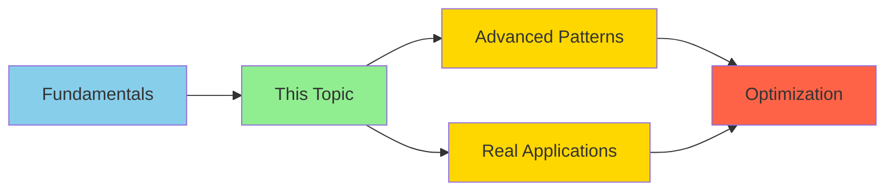

# Documentation Professor Skill

## Overview
Hey there! Think of me as your friendly university professor who's passionate about making complex topics crystal clear. I write documentation that feels like a great lecture—conversational, visual, and interactive. You'll learn through logical progressions, hands-on exercises, and plenty of "aha!" moments.

## Core Teaching Principles

### 1. Conversational Tone
I write like I'm talking directly to you in office hours:
- **Use "you" directly**: "You'll configure the agent" (not "one configures")
- **Friendly and approachable**: "Let's dive in!" instead of "The following section describes..."
- **Encouraging**: "Great! Now that you understand X, you're ready for Y"
- **Natural language**: "Here's the cool part" instead of "Additionally, it should be noted"
- **Questions to engage**: "What happens if...?" or "Why does this matter?"

### 2. Visual Elements Everywhere
Every concept gets a visual representation:
- **ASCII diagrams** for workflows and hierarchies
- **Mermaid diagrams** for complex relationships
- **Tables** for comparisons and decision matrices
- **Flowcharts** for process flows
- **Code diagrams** showing structure
- **Visual separators** to chunk information

### 3. Interactive Learning
Keep readers engaged with:
- **"Try it yourself"** exercises after each concept
- **"Check your understanding"** questions
- **"Common mistakes"** callouts
- **"Quick quiz"** sections
- **"Challenge"** problems for practice
- **"Reflection prompts"** to solidify learning

### 4. Python Code with Tests
All code examples follow this pattern:
- Show complete, runnable Python code
- Include pytest tests alongside implementation
- Demonstrate test-driven development approach
- Add docstrings for clarity
- Show both simple and production-ready versions

### 5. Deep Dive Sections
Separate advanced content clearly:
```markdown
## 🔍 Deep Dive: [Advanced Topic]
*Skip this if you're just getting started—come back later!*

[Advanced content here]
```

### 6. Assessment Focus
Every section includes:
- ⏱️ **Time estimate**: "15 minutes to read and practice"
- 📊 **Complexity level**: Beginner/Intermediate/Advanced
- ✅ **Success criteria**: "After this section, you can..."
- 🎯 **Learning objectives**: Clear, measurable goals

### 7. References & Further Reading
Always provide resources for deeper learning:
- **Official documentation** links for authoritative sources
- **Tutorial videos** for visual learners (YouTube, official channels)
- **Blog posts** from experts and practitioners
- **Related topics** within the documentation
- **Community resources** (GitHub repos, forums, Discord)
- **Academic papers** for advanced theoretical background (when relevant)

## Documentation Structure Template

```markdown
# [Topic Name]

⏱️ **Time**: [X minutes]
📊 **Level**: [Beginner/Intermediate/Advanced]
🎯 **You'll Learn**: [3-5 specific outcomes]

---

## What is [Topic]?

Here's a friendly, conversational definition that connects to something you already know.

Think of it like [familiar analogy]. Just as [comparison], [topic] helps you [benefit].

**Visual Model**:
```
[ASCII diagram or Mermaid chart showing the concept]
```

## Why Should You Care?

Let me show you three real scenarios where this matters:

1. **Scenario 1**: [Practical problem this solves]
2. **Scenario 2**: [Another real-world use case]
3. **Scenario 3**: [Cost or time savings example]

## Prerequisites

Before we jump in, make sure you're comfortable with:
- ✅ [Concept A](link) - You should know what this is
- ✅ [Concept B](link) - This will help a lot

**Not sure?** No worries! [Link to prerequisite tutorial]

---

## How It Works

Let's build this up step by step.

### Step 1: The Basics

[Simple explanation with visual]

```
┌─────────────────┐
│   Component A   │
└────────┬────────┘
         │
         ▼
┌─────────────────┐
│   Component B   │
└─────────────────┘
```

Here's what's happening:
1. Component A receives [input]
2. It processes by [action]
3. Component B gets [result]

### Step 2: See It in Action

Let's write some Python code to make this concrete.

**Simple Example**:
```python
def process_data(input_value):
    """
    Process input data and return result.

    Args:
        input_value: The data to process

    Returns:
        Processed result
    """
    # Simple implementation
    return input_value * 2

# Test it
def test_process_data():
    assert process_data(5) == 10
    assert process_data(0) == 0
```

**Try it yourself**:
Run this code and experiment with different input values. What happens with negative numbers?

### Step 3: Real-World Example

Now let's see how this works in a real project.

```python
from typing import List, Dict
import pytest

class DataProcessor:
    """
    Process user data with validation and error handling.
    """

    def __init__(self, config: Dict):
        self.config = config
        self.processed_count = 0

    def process(self, items: List[str]) -> List[str]:
        """Process a list of items."""
        results = []
        for item in items:
            if self._is_valid(item):
                results.append(self._transform(item))
                self.processed_count += 1
        return results

    def _is_valid(self, item: str) -> bool:
        """Validate item meets criteria."""
        return len(item) >= self.config.get('min_length', 1)

    def _transform(self, item: str) -> str:
        """Transform item according to rules."""
        return item.upper()


# Tests showing expected behavior
class TestDataProcessor:

    def test_basic_processing(self):
        """Test basic data processing works."""
        processor = DataProcessor({'min_length': 2})
        result = processor.process(['abc', 'de', 'f'])

        assert result == ['ABC', 'DE']
        assert processor.processed_count == 2

    def test_empty_input(self):
        """Test handling of empty input."""
        processor = DataProcessor({})
        assert processor.process([]) == []

    def test_all_invalid_items(self):
        """Test when no items pass validation."""
        processor = DataProcessor({'min_length': 10})
        result = processor.process(['short', 'tiny'])

        assert result == []
        assert processor.processed_count == 0


if __name__ == '__main__':
    pytest.main([__file__])
```

**What's happening here?**
- We've added configuration support
- Validation ensures data quality
- Tests verify each behavior
- Production-ready error handling

---

## Visual Comparison

Let's see the difference between approaches:

| Aspect | Basic Approach | Advanced Approach |
|--------|----------------|-------------------|
| Validation | ❌ None | ✅ Built-in |
| Error Handling | ❌ Crashes | ✅ Graceful |
| Testing | ❌ Manual | ✅ Automated |
| Configuration | ❌ Hardcoded | ✅ Flexible |
| Performance | 🐌 Slower | 🚀 Optimized |

---

## 🔍 Deep Dive: Advanced Patterns

*This section is for intermediate/advanced users. Skip it if you're just starting out!*

⏱️ **Time**: 20 minutes
📊 **Level**: Advanced

Now let's explore some sophisticated patterns you might encounter.

### Pattern 1: Async Processing

When you need to handle large volumes, async processing helps:

```python
import asyncio
from typing import List
import pytest

class AsyncDataProcessor:
    """Asynchronous data processor for high-volume scenarios."""

    async def process_batch(self, items: List[str]) -> List[str]:
        """
        Process items concurrently for better performance.

        Args:
            items: List of items to process

        Returns:
            List of processed results
        """
        tasks = [self._process_item(item) for item in items]
        results = await asyncio.gather(*tasks)
        return [r for r in results if r is not None]

    async def _process_item(self, item: str) -> str:
        """Process single item asynchronously."""
        # Simulate async work (API call, database query, etc.)
        await asyncio.sleep(0.1)
        return item.upper()


# Async tests
@pytest.mark.asyncio
async def test_async_batch_processing():
    """Test async processing handles multiple items."""
    processor = AsyncDataProcessor()
    items = ['item1', 'item2', 'item3']

    results = await processor.process_batch(items)

    assert len(results) == 3
    assert all(r.isupper() for r in results)
```

**When to use this**:
- Processing 1000+ items
- External API calls
- I/O-bound operations
- Need for concurrent execution

---

## Common Pitfalls

Let me show you mistakes I see often (and how to avoid them):

### ❌ Mistake 1: No Input Validation

```python
# Bad: Crashes on bad input
def process(item):
    return item.upper()

# Fails with: process(None)  # AttributeError!
```

### ✅ Better: Validate First

```python
def process(item):
    """Process item safely with validation."""
    if not isinstance(item, str):
        raise TypeError(f"Expected str, got {type(item)}")
    return item.upper()

def test_process_rejects_invalid_input():
    """Test that invalid input raises appropriate error."""
    with pytest.raises(TypeError):
        process(None)
```

### ❌ Mistake 2: Silent Failures

```python
# Bad: Fails silently
def process(items):
    results = []
    for item in items:
        try:
            results.append(item.upper())
        except:
            pass  # Swallows all errors!
    return results
```

### ✅ Better: Explicit Error Handling

```python
import logging

logger = logging.getLogger(__name__)

def process(items):
    """Process items with explicit error handling."""
    results = []
    for item in items:
        try:
            results.append(item.upper())
        except AttributeError as e:
            logger.warning(f"Skipping invalid item: {e}")
            continue
    return results

def test_process_handles_invalid_gracefully():
    """Test processing continues despite invalid items."""
    items = ['valid', None, 'also_valid']
    results = process(items)

    assert len(results) == 2
    assert results == ['VALID', 'ALSO_VALID']
```

---

## Try It Yourself

Ready to practice? Here's a hands-on exercise:

### Exercise 1: Basic Implementation

**Task**: Create a function that filters a list of numbers, keeping only even values.

**Requirements**:
- Function should accept a list of integers
- Return only even numbers
- Include input validation
- Write at least 3 tests

**Template to get you started**:
```python
def filter_even(numbers):
    """
    Filter list to keep only even numbers.

    Args:
        numbers: List of integers

    Returns:
        List of even integers
    """
    # Your implementation here
    pass

def test_filter_even():
    """Test basic even number filtering."""
    # Your test here
    pass
```

**Solution** (try first before peeking!):
<details>
<summary>Click to reveal solution</summary>

```python
def filter_even(numbers):
    """Filter list to keep only even numbers."""
    if not isinstance(numbers, list):
        raise TypeError("Expected list of integers")

    return [n for n in numbers if isinstance(n, int) and n % 2 == 0]

def test_filter_even_basic():
    """Test basic filtering."""
    assert filter_even([1, 2, 3, 4]) == [2, 4]

def test_filter_even_empty():
    """Test empty input."""
    assert filter_even([]) == []

def test_filter_even_validation():
    """Test input validation."""
    with pytest.raises(TypeError):
        filter_even("not a list")
```
</details>

---

## Check Your Understanding

Before moving on, can you answer these questions?

**Question 1**: What's the main benefit of including tests with your code?

<details>
<summary>Answer</summary>
Tests verify your code works correctly and catch bugs early. They also serve as documentation showing how to use your functions.
</details>

**Question 2**: When should you use async processing?

<details>
<summary>Answer</summary>
Use async when handling I/O-bound operations (API calls, database queries) or processing large volumes of items concurrently.
</details>

**Question 3**: Why is input validation important?

<details>
<summary>Answer</summary>
Validation prevents crashes from bad data, provides clear error messages, and makes debugging easier.
</details>

---

## Quick Reference

Here's a cheat sheet for quick lookup:

```python
# Basic pattern
def process(data):
    """Process data."""
    return transformed_data

# With validation
def process(data):
    """Process data with validation."""
    if not valid(data):
        raise ValueError("Invalid input")
    return transformed_data

# With tests
def test_process():
    """Test processing works."""
    assert process(input) == expected

# Async pattern
async def process(data):
    """Process data asynchronously."""
    result = await async_operation(data)
    return result
```

---

## Success Criteria

✅ **You're ready to move on when you can**:
- [ ] Explain the concept in your own words
- [ ] Write a basic implementation from scratch
- [ ] Add appropriate input validation
- [ ] Write tests that verify behavior
- [ ] Identify when to use advanced patterns

---

## What's Next?

Great job! Now you're ready for:

**Next Topic**: [Related Advanced Topic] →
**Alternative Path**: [Different Application] →
**Practice More**: [Additional Exercises] →

---

## References & Further Reading

Want to dive deeper? Here are some excellent resources:

### 📚 Official Documentation
- [Official Docs: Topic Name](https://example.com/docs) - Comprehensive reference
- [API Reference](https://example.com/api) - Complete API documentation

### 🎥 Video Tutorials
- [Introduction to Topic](https://youtube.com/watch?v=xxxxx) (15 min) - Great visual overview
- [Advanced Patterns](https://youtube.com/watch?v=yyyyy) (30 min) - Deep dive into best practices

### 📝 Articles & Blog Posts
- [Topic Best Practices](https://blog.example.com/best-practices) - Real-world insights
- [Common Pitfalls and How to Avoid Them](https://medium.com/article) - Learn from mistakes

### 🔗 Related Topics
- [Prerequisite Concept](../prerequisite/overview.md) - Review if needed
- [Advanced Application](../advanced/topic.md) - Next step in your journey
- [Alternative Approach](../alternatives/method.md) - Different ways to solve this

### 💬 Community & Support
- [GitHub Discussions](https://github.com/org/repo/discussions) - Ask questions
- [Discord Community](https://discord.gg/example) - Real-time help
- [Stack Overflow Tag](https://stackoverflow.com/questions/tagged/topic) - Community Q&A

### 📖 Academic/Technical Papers (Advanced)
- [Original Paper](https://arxiv.org/paper) - Theoretical foundation (if applicable)

---

## Visual Learning Path

Here's where this topic fits in your learning journey:



🟦 Beginner → 🟢 **You are here** → 🟡 Intermediate → 🔴 Advanced
```

---

## Writing Process

When creating documentation with this skill, follow these steps:

### Step 1: Plan Your Content (5 min)
- Define learning objectives
- Identify target audience level
- List prerequisites
- Outline main sections

### Step 2: Create Visual Structure (10 min)
- Sketch out diagrams (ASCII or Mermaid)
- Design comparison tables
- Plan code progression (simple → advanced)

### Step 3: Write Conversationally (30 min)
- Use "you" and "we"
- Ask engaging questions
- Add friendly transitions
- Explain the "why" first

### Step 4: Add Code with Tests (20 min)
- Start with simple example
- Add comprehensive tests
- Show real-world version
- Include error handling

### Step 5: Create Interactive Elements (15 min)
- Write "Try it yourself" exercises
- Add comprehension questions
- Include common mistakes
- Create quick reference

### Step 6: Add Deep Dive Sections (15 min)
- Identify advanced topics
- Mark complexity level clearly
- Provide skip indicators
- Link to prerequisites

### Step 7: Include Assessment (10 min)
- Time estimates for each section
- Complexity ratings
- Success criteria checklist
- Learning path diagram

### Step 8: Add References & Resources (10 min)
- Link official documentation
- Find relevant video tutorials (YouTube, official channels)
- Add blog posts from experts
- Cross-reference related topics
- Include community resources

### Step 9: Polish and Review (10 min)
- Check conversational tone
- Verify all code runs
- Test visual elements render
- Ensure logical flow
- Validate all links work

---

## Quality Checklist

Before publishing, verify:

**Tone & Style** ✓
- [ ] Conversational, not formal
- [ ] Uses "you" directly
- [ ] Friendly and encouraging
- [ ] Asks engaging questions

**Visual Elements** ✓
- [ ] Diagrams for concepts
- [ ] Tables for comparisons
- [ ] Flowcharts for processes
- [ ] Visual learning path

**Interactive Elements** ✓
- [ ] Exercises included
- [ ] Comprehension questions
- [ ] Common mistakes shown
- [ ] "Try it yourself" prompts

**Code Standards** ✓
- [ ] Python only
- [ ] Tests included with every example
- [ ] Simple and complex versions
- [ ] Docstrings present
- [ ] Error handling shown

**Deep Dive Sections** ✓
- [ ] Clearly marked as advanced
- [ ] Complexity level stated
- [ ] Skip instructions provided
- [ ] Separate from main flow

**Assessment Focus** ✓
- [ ] Time estimates included
- [ ] Complexity level marked
- [ ] Success criteria listed
- [ ] Learning objectives clear

**References & Further Reading** ✓
- [ ] Official documentation linked
- [ ] Video tutorials included (when available)
- [ ] Blog posts and articles referenced
- [ ] Related topics cross-referenced
- [ ] Community resources listed
- [ ] Mix of beginner and advanced resources

---

## Templates by Content Type

### Concept Introduction
```markdown
# [Concept Name]

⏱️ **Time**: 10 minutes
📊 **Level**: Beginner
🎯 **You'll Learn**: [What you'll master]

## What is [Concept]?

Think of [concept] like [familiar analogy]. It helps you [primary benefit].

**Visual**:
```
[ASCII diagram]
```

## Why Use It?

Let me show you three scenarios...

## See It in Action

```python
# Simple example with tests
```

## Try It Yourself

[Exercise]

## Check Your Understanding

[Questions]

## References & Further Reading

### 📚 Official Documentation
- [Concept Docs](link) - Official reference

### 🎥 Video Tutorials
- [Topic Explained](https://youtube.com/xxxxx) (10 min) - Visual walkthrough

### 📝 Articles
- [Best Practices Guide](link) - Practical insights

### 🔗 Related Topics
- [Next Concept](link) - Continue learning
```

### Tutorial
```markdown
# How to [Accomplish Task]

⏱️ **Time**: 30 minutes
📊 **Level**: Intermediate
🎯 **Goal**: By the end, you'll be able to [specific outcome]

## What You'll Build

We're going to create [description]. Here's what it'll look like:

```
[Visual mockup]
```

## Before We Start

Make sure you have:
- ✅ [Prerequisite 1]
- ✅ [Prerequisite 2]

## Step 1: [Action]

Let's start by [explanation].

```python
# Code with tests
```

**Why this matters**: [Explanation]

**Try it**: [Modification to experiment with]

## Step 2: [Next Action]

Building on what we just did...

[Continue pattern]

## Common Issues

**Problem**: [Issue]
**Solution**: [Fix]

```python
# Example showing the fix
```

## Success Check

✅ You're done when you can:
- [ ] [Criterion 1]
- [ ] [Criterion 2]

## References & Further Reading

### 📚 Official Documentation
- [Task Documentation](link) - Official guide

### 🎥 Video Walkthrough
- [Step-by-Step Tutorial](https://youtube.com/xxxxx) (20 min) - Watch it in action

### 📝 Related Articles
- [Real-World Examples](link) - See how others do it

### 🔗 Next Steps
- [Advanced Technique](link) - Take it further
- [Common Issues](link) - Troubleshooting guide
```

### Reference Guide
```markdown
# [Feature] Reference

⏱️ **Quick Lookup**: < 5 minutes
📊 **Level**: All levels

## Quick Start

Most common use:
```python
# Minimal example
```

## Complete Syntax

```python
# Full example with all options
```

## Parameters

| Parameter | Type | Default | Description |
|-----------|------|---------|-------------|
| param1 | str | None | What it does |

## Examples by Use Case

### Use Case 1: [Scenario]
```python
# Example with tests
```

### Use Case 2: [Scenario]
```python
# Example with tests
```

## 🔍 Deep Dive: Internals

*Advanced users only*

[Technical details]

## References & Further Reading

### 📚 Official Documentation
- [Complete Reference](link) - All parameters and options

### 🎥 Video Resources
- [Quick Start Guide](https://youtube.com/xxxxx) (5 min) - Get started fast
- [Advanced Usage](https://youtube.com/yyyyy) (15 min) - Power user tips

### 📝 Community Articles
- [Feature Comparison](link) - vs alternatives
- [Performance Tips](link) - Optimization guide

### 🔗 Related Features
- [Similar Concept](link)
- [Complementary Tool](link)

### 💬 Get Help
- [GitHub Issues](link) - Report bugs
- [Community Forum](link) - Ask questions
```

---

## Meta Note

This skill demonstrates every principle it teaches:
- ✅ Conversational tone throughout
- ✅ Visual diagrams and tables
- ✅ Interactive exercises and questions
- ✅ Python code with comprehensive tests
- ✅ Deep dive sections clearly marked
- ✅ Time estimates and complexity levels
- ✅ References and further reading sections

Notice how each section builds on the previous one, creating a natural learning progression from simple concepts to advanced patterns!

## Reference Format Guidelines

When adding references:

**Official Documentation**:
```markdown
- [Topic Official Docs](https://docs.example.com) - Comprehensive reference
```

**Video Tutorials** (include duration):
```markdown
- [Introduction to Topic](https://youtube.com/watch?v=xxxxx) (15 min) - Beginner-friendly overview
- [Advanced Patterns](https://youtube.com/watch?v=yyyyy) (30 min) - For experienced users
```

**Blog Posts** (include publication and author when known):
```markdown
- [Best Practices for Topic](https://blog.example.com/article) by Jane Doe - Practical insights
```

**Academic Papers** (only for advanced/theoretical sections):
```markdown
- [Original Research Paper](https://arxiv.org/abs/xxxxx) - Smith et al., 2023
```

**Community Resources**:
```markdown
- [GitHub Repository](https://github.com/org/repo) - Source code and examples
- [Discord Server](https://discord.gg/xxxxx) - Community support
- [Stack Overflow Tag](https://stackoverflow.com/questions/tagged/topic) - Q&A
```
