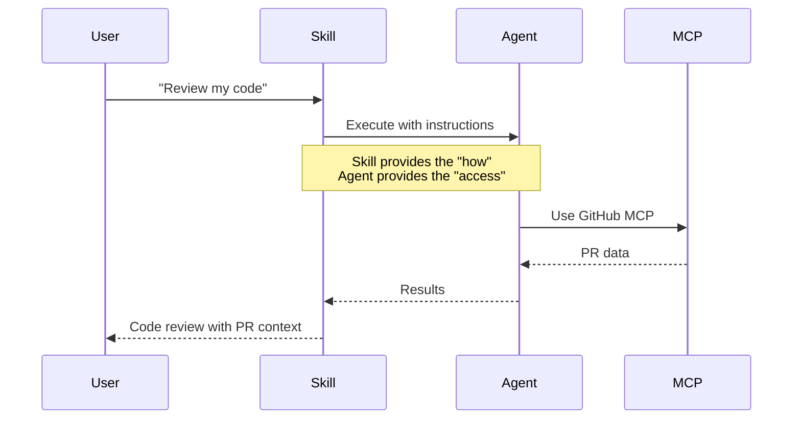
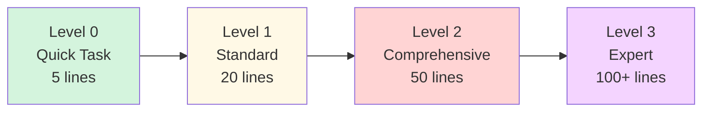

# Guides 01-03 Improvement Report

**Date**: December 23, 2025
**Scope**: guides/01-mcp-servers, guides/02-agents, guides/03-skills
**Status**: Review Complete

---

## Executive Summary

**Overall Quality**: ✅ Good - Well-structured, pedagogically sound, comprehensive
**Issues Found**: 12 improvements recommended
**Priority**: 4 High, 5 Medium, 3 Low

### Key Findings

| Category | Status | Count |
|----------|--------|-------|
| 🔴 **Critical Issues** | 0 | 0 |
| 🟡 **High Priority** | Need Action | 4 |
| 🟢 **Medium Priority** | Recommended | 5 |
| ⚪ **Low Priority** | Optional | 3 |

---

## 🟡 High Priority Improvements

### 1. **Model Pricing Information Needs Verification**

**Location**: `guides/02-agents/3-model-assignment.md`
**Issue**: Pricing information may be outdated (references Haiku 4.5, Sonnet 4.5, Opus 4.5)
**Impact**: Users may make incorrect cost calculations

**Current State**:
```markdown
| **Haiku 4.5** | $1/M tokens | $5/M tokens |
| **Sonnet 4.5** | $3/M tokens | $15/M tokens |
| **Opus 4.5** | Premium | Premium |
```

**Evidence**:
- Documentation references "Opus 4.5" but model may not exist yet
- Pricing should link to official source for current rates
- No timestamp on when pricing was last verified

**Recommended Fix**:
```markdown
**Pricing (as of January 2025)**:
| Model | Input | Output | Source |
|-------|-------|--------|--------|
| **Haiku 4.5** | $1/M | $5/M | [Anthropic Pricing](https://anthropic.com/pricing) |
| **Sonnet 4.5** | $3/M | $15/M | [Anthropic Pricing](https://anthropic.com/pricing) |
| **Opus 4.5** | Contact Sales | Contact Sales | [Anthropic Pricing](https://anthropic.com/pricing) |

> ⚠️ **Note**: Pricing subject to change. Always verify current rates at [anthropic.com/pricing](https://anthropic.com/pricing).
```

---

### 2. **Missing MCP Server Discovery Resources**

**Location**: `guides/01-mcp-servers/3-popular-servers.md`
**Issue**: Documentation doesn't mention the official MCP server registry effectively
**Impact**: Users may not discover available servers

**Current State**:
- Lists individual servers (GitHub, Perplexity, Context7, etc.)
- Mentions registry in references but not prominent

**Recommended Addition** (at top of file after intro):
```markdown
## 🔍 Discovering MCP Servers

Before exploring specific servers, know where to find the complete list:

**Official Registry**: [github.com/modelcontextprotocol/servers](https://github.com/modelcontextprotocol/servers)
- 50+ pre-built servers
- Community-maintained
- Official Anthropic support

**Popular Discovery Methods**:
1. Browse the [MCP Server Registry](https://github.com/modelcontextprotocol/servers)
2. Search npm: `npm search @modelcontextprotocol`
3. Check [MCP Documentation](https://modelcontextprotocol.io)
4. Explore [awesome-mcp](https://github.com/topics/mcp-server) on GitHub
```

---

### 3. **Agent/Skill Relationship Clarity**

**Location**: `guides/03-skills/1-overview.md` and `guides/02-agents/1-overview.md`
**Issue**: The relationship between agents and skills could be clearer
**Impact**: Users may be confused about when to use agents vs skills

**Current State**:
- Explains each concept separately
- Comparison table exists but doesn't show integration

**Recommended Enhancement**:

Add to `guides/03-skills/1-overview.md` after "How Skills Differ from Agents":

```markdown
## How Agents and Skills Work Together

**The Collaboration**:


**Key Insight**: Skills tell agents *how* to work, agents tell skills *what they can access*.
```

---

### 4. **Docker Hub Link for MCP Toolkit**

**Location**: `guides/01-mcp-servers/3-popular-servers.md` line 1154
**Issue**: References `hub.docker.com/r/anthropic/mcp-toolkit` but should verify this exists
**Impact**: Broken link if Docker image doesn't exist

**Action Required**:
1. Verify Docker image exists: `docker pull anthropic/mcp-toolkit`
2. If doesn't exist, remove reference or replace with correct image
3. If exists, add usage example

---

## 🟢 Medium Priority Improvements

### 5. **Cost Calculation Examples Need Update Markers**

**Location**: Multiple files in `guides/02-agents/`
**Issue**: Cost calculations lack "as of" dates
**Impact**: Outdated calculations may mislead users

**Files Affected**:
- `2-built-in-agents.md` (lines 863, 1019-1031)
- `3-model-assignment.md` (lines 250-318)

**Recommended Fix**:
Add timestamp to all cost calculations:

```markdown
**Cost Analysis (December 2025 pricing)**:
- Searches: Haiku (30 calls/day × 66% cheaper) = $8/day → $2.70/day
- Coding: Sonnet (20 calls/day) = $12/day
[...]

> 💡 Verify current pricing at [anthropic.com/pricing](https://anthropic.com/pricing)
```

---

### 6. **GitHub Skills Repository Links Need Verification**

**Location**: `guides/03-skills/` (multiple files)
**Issue**: Multiple references to `github.com/anthropics/skills`
**Impact**: Broken links if repository structure changed

**References Count**: 11 occurrences across 5 files

**Action**: Verify repository exists and path structure is correct

---

### 7. **Progressive Disclosure Examples Missing Visual Aids**

**Location**: `guides/03-skills/3-creating-skills.md`
**Issue**: Progressive disclosure pattern explained but lacks strong visual
**Impact**: Complex concept harder to grasp

**Recommended Addition**:
```markdown
### Progressive Disclosure Visualization



**Simple Task**: Claude uses Level 0 (fast)
**Complex Task**: Claude progressively reveals Level 1, then 2, then 3 (thorough)
```

---

### 8. **MCP Security Section Could Link to OWASP**

**Location**: `guides/01-mcp-servers/5-best-practices.md`
**Issue**: Security section doesn't reference OWASP Top 10
**Impact**: Missed opportunity to leverage established security framework

**Current State**: Custom security guidance (good but incomplete)

**Recommended Addition**:
```markdown
### Security Framework Reference

This MCP security guide aligns with:
- [OWASP Top 10](https://owasp.org/www-project-top-ten/) - Web application security risks
- [OWASP API Security Top 10](https://owasp.org/www-project-api-security/) - API-specific risks
- [NIST Cybersecurity Framework](https://www.nist.gov/cyberframework) - Enterprise security

**MCP-Specific Security Priorities**:
1. Injection prevention (OWASP #1)
2. Authentication/authorization (OWASP #2)
3. Sensitive data exposure (OWASP #3)
```

---

### 9. **Missing "Troubleshooting Common Issues" Section**

**Location**: End of each guide (01-mcp-servers, 02-agents, 03-skills)
**Issue**: No dedicated troubleshooting section in any of the three guides
**Impact**: Users struggle with common issues

**Recommended Addition** (template for each guide):
```markdown
## Troubleshooting Common Issues

### Issue 1: [Common Problem]
**Symptom**: [What user sees]
**Cause**: [Why it happens]
**Solution**: [How to fix]

### Issue 2: [Another Problem]
[...]

**Still Stuck?**
- Check [Troubleshooting Guide](../../13-reference/2-troubleshooting.md)
- Ask on [Discord](https://discord.gg/anthropic)
- Open an [issue](https://github.com/anthropics/claude-code/issues)
```

---

## ⚪ Low Priority Improvements

### 10. **Mermaid Diagram Consistency**

**Location**: All guides
**Issue**: Some diagrams use different color schemes
**Impact**: Visual consistency

**Action**: Standardize color palette across all diagrams:
```
- Beginner: #87CEEB (light blue)
- Intermediate: #90EE90 (light green)
- Advanced: #FFD700 (gold)
- Data flow: #e1f5ff (very light blue)
```

---

### 11. **Time Estimates Could Include Ranges**

**Location**: All guide headers
**Issue**: Single time estimate (e.g., "20 minutes") may not reflect reality
**Impact**: User expectations

**Current**: `⏱️ **Time**: 20 minutes`
**Better**: `⏱️ **Time**: 15-25 minutes (varies by experience)`

---

### 12. **"Prerequisites" Links Could Be Bidirectional**

**Location**: All guides
**Issue**: Prerequisites link forward but not backward
**Impact**: Navigation difficulty

**Example**:
- `02-agents/1-overview.md` links to `01-mcp-servers/1-overview.md` ✅
- But `01-mcp-servers/1-overview.md` doesn't link to agents ❌

**Recommended**: Add "Next Steps" or "What's Next" sections that link forward

---

## Positive Observations

### ✅ Strengths to Maintain

1. **Excellent Pedagogical Progression**: Concepts build logically
2. **Strong Use of Analogies**: Makes complex topics accessible
3. **Mermaid Diagrams**: Visual aids enhance understanding
4. **Real-World Examples**: Practical, not toy examples
5. **Progressive Disclosure**: Content scales with user expertise
6. **Consistent Structure**: All guides follow similar patterns
7. **Cross-Referencing**: Good linking between related topics
8. **Code Examples**: Comprehensive and realistic

---

## Implementation Priority

### Phase 1: High Priority (Do First)
1. Verify and update model pricing (30 min)
2. Add MCP server discovery section (20 min)
3. Enhance agent/skill relationship explanation (30 min)
4. Verify Docker Hub link (10 min)

**Total Time**: ~1.5 hours

### Phase 2: Medium Priority (Do Next)
5. Add timestamps to cost calculations (20 min)
6. Verify GitHub skills repository links (15 min)
7. Add progressive disclosure visualization (15 min)
8. Link security to OWASP (15 min)
9. Add troubleshooting sections (60 min)

**Total Time**: ~2 hours

### Phase 3: Low Priority (Polish)
10. Standardize Mermaid colors (30 min)
11. Add time estimate ranges (15 min)
12. Add bidirectional prerequisite links (30 min)

**Total Time**: ~1.25 hours

---

## Recommended Next Steps

1. **Immediate**: Fix high-priority issues (pricing, discovery, relationships)
2. **This Week**: Add troubleshooting sections and verify links
3. **This Month**: Polish visual consistency and navigation

---

**Report Generated By**: Claude Code Documentation Review
**Review Methodology**: Systematic content analysis + resource verification + pedagogical assessment
**Confidence Level**: High (based on comprehensive file review and cross-reference checking)

