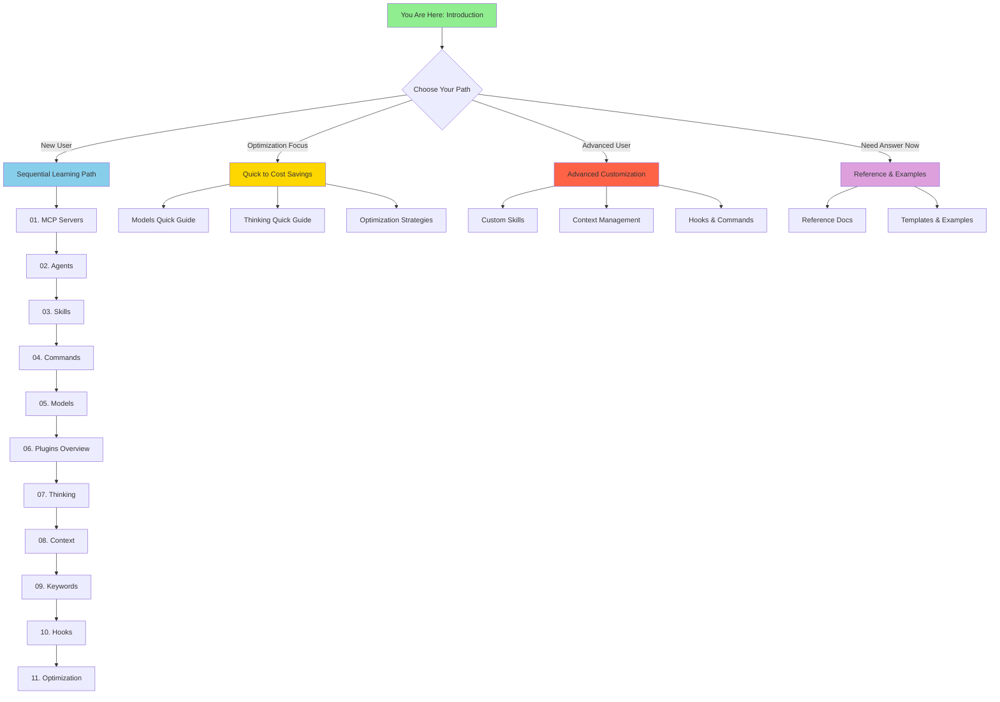

# Welcome to Claude Code Documentation

> Master Claude Code from fundamentals to advanced optimization

⏱️ **Reading Time**: 15 minutes
📊 **Level**: All levels
🎯 **What You'll Learn**: How to navigate this documentation, why topics are ordered the way they are, and how to get started based on your experience level

---

## Welcome!

Hey there! Welcome to the complete guide for mastering Claude Code. Whether you're just getting started or looking to optimize your existing workflows, this documentation will take you from the basics all the way to advanced cost-saving strategies.

Think of this as your personal university course on Claude Code—we've structured everything to build logically from simple concepts to advanced patterns. No jumping into the deep end without learning to swim first!

## What You'll Master

By working through this documentation, you'll learn:

✅ **Foundation Skills**
- Master effective prompt engineering to save time and money from day one
- Set up and configure MCP servers to extend Claude's capabilities
- Understand how agents work and when to use each type
- Create custom skills for repeatable tasks
- Choose the right model (Haiku, Sonnet, or Opus) for each situation

✅ **Advanced Techniques**
- Control reasoning depth with thinking modes
- Manage context and memory effectively
- Customize Claude Code behavior with hooks and commands
- Optimize token usage to save 50-60%+ on costs

✅ **Real-World Application**
- Copy-paste ready templates for your projects
- Practical examples from actual use cases
- Cost comparisons with before/after scenarios
- Best practices from production deployments

## Why This Order? The Learning Path Explained

This documentation isn't just a random collection of topics—it follows a **pedagogical progression** where each concept builds on the previous ones. Here's the journey we'll take together:

```
 Overview  → Foundation  → Communication → Building Blocks → Advanced → Mastery
  Plugins  →    MCP      →  Prompting    →  Agents/Skills  → Context → Optimization
```

### The 10-Stage Learning Path

**0. Plugin Ecosystem Overview** (Big Picture - Start Here!)
Before diving into specifics, understand the four plugin types (MCP Servers, Skills, Hooks, Slash Commands) and how they work together. This 20-minute overview gives you the mental framework to organize everything you'll learn. Think of it as seeing the map before exploring the territory.

**1. MCP Servers** (Foundation - Plugin Type 1)
Think of MCP as the foundation of a house. You can't build anything solid without it. MCP servers extend Claude Code by connecting it to external tools—GitHub, databases, APIs, and more. Once you understand how to add capabilities to Claude, everything else makes sense.

**2. Prompt Engineering Basics** (Essential Communication Skills)
Before learning advanced features, master how to communicate effectively with Claude. The 4-part formula (Intent + Context + Constraints + Success) and 7 core patterns (CREATE, FIX, REFACTOR, etc.) save time and money from day one. Good prompting skills amplify everything else you'll learn. 45 minutes here pays dividends throughout your entire Claude Code journey.

**3. Agents** (Building on MCP & Prompting)
Now that Claude has tools (via MCP) and you know how to communicate well (prompting), agents are the workers who use those tools intelligently. The Explore agent searches your codebase, the General-Purpose agent makes changes, and the Plan agent researches before implementation. Understanding agents helps you delegate work effectively.

**4. Skills** (Leveraging Agents - Plugin Type 2)
Skills are like training manuals that agents follow. Once you know how agents work, you can write instructions (skills) that make them experts at specific tasks—TDD workflows, API documentation, code reviews. Skills turn generic agents into specialists.

**5. Model Selection** (Understanding the Engine)
Not every task needs the most powerful model. Haiku 4.5 is 3x cheaper than Sonnet and perfect for searches. Opus 5 excels at complex architecture but costs more. Knowing which model to use is crucial for balancing quality and cost.

**6. Thinking Modes** (Optimizing Reasoning)
Sometimes you need Claude to think deeply about a problem; other times, a quick answer is fine. Thinking modes let you control how much reasoning Claude does, which directly impacts token usage and quality.

**7. Context Management** (Advanced Control)
As you work on larger projects, managing what Claude "remembers" becomes important. CLAUDE.md files, memory hierarchies, and context clearing strategies keep your workflows efficient.

**8. Keywords & Triggers** (Power User Features - Slash Commands = Plugin Type 3)
Custom slash commands and behavioral keywords let you customize Claude Code to match your workflow. This builds on everything you've learned about how Claude Code operates.

**8.5. Hooks** (Automation - Plugin Type 4)
Hooks automate workflows by running commands at specific trigger points (before/after tool use, on prompts). Set up automated testing, code formatting, and validation that happens without manual intervention.

**9. Token Optimization** (Synthesis)
Finally, you'll apply everything—model selection, thinking budgets, context management, strategic agent/skill usage—to dramatically reduce costs while maintaining quality.

### Why Not Jump Ahead?

You might be tempted to skip straight to "Token Optimization" or "Advanced Techniques." Here's why following the sequence matters:

**❌ Without Plugin Overview**: You won't understand how MCP, Skills, Hooks, and Commands fit together
**❌ Without MCP knowledge**: You won't understand what agents are actually doing
**❌ Without Prompting skills**: You'll waste time with vague prompts and higher costs
**❌ Without Agent knowledge**: Skills won't make sense (they're instructions for agents)
**❌ Without Model knowledge**: You can't optimize costs effectively
**❌ Without Context knowledge**: Advanced customization will seem confusing

**✅ Following the path**: Each topic naturally leads to the next, building your mental model progressively.

That said, we've created multiple reading paths (see below) if you need to prioritize certain areas.

## Prerequisites

### What You Need Before Starting

**Required:**
- ✅ Claude Code installed ([installation guide](https://code.claude.com/docs/en/get-started))
- ✅ Basic command-line familiarity
- ✅ Claude Pro subscription (for the examples in this documentation)

**Helpful (but not required):**
- Understanding of Git and version control
- Experience with your programming language of choice
- Familiarity with development workflows

**Time Investment:**
- **Complete path**: 15-20 hours for full mastery
- **Quick start**: 2-3 hours for essentials
- **Reference use**: 5-15 minutes per lookup

### Installation Check

Make sure you have Claude Code ready:

```bash
# Check if Claude Code is installed
claude --version

# Should show something like: Claude Code v1.x.x
```

If not installed, visit the [official installation guide](https://code.claude.com/docs/en/get-started).

## How to Navigate This Documentation

This documentation is organized like a university course with clear progression:

### The Foundation Triad (Start Here!)

1. **README.md** (5 min) - Repository overview and quick orientation
2. **TABLE_OF_CONTENTS.md** (5 min) - Master navigation and reading paths
3. **INTRODUCTION.md** (You are here!) - Learning approach and getting started

### Main Documentation Structure

```
📚 guides/           Step-by-step learning by topic (01-15 sections)
📖 .claude/skills/   Active skills for this project
📋 Reference/        Quick lookup for keywords, hooks, commands
💰 Optimization/     Cost-saving strategies and comparisons
```

### Visual Navigation Aid



## Reading Paths: Choose Your Adventure

We've designed four different paths through this documentation based on your goals and experience:

### 🆕 Path 1: "New to Claude Code" (Complete Learning)

**Best for**: First-time users, those wanting comprehensive understanding
**Time**: 15-20 hours total
**Approach**: Sequential learning from MCP Servers → Token Optimization

**Your Journey**:
1. **Start with**: [Plugin Ecosystem Overview](guides/07-plugins/1-overview.md) (20 min) - See the big picture first!
2. **Deep dive**: [MCP Servers](guides/01-mcp-servers/2-installation.md) (Plugin Type 1)
3. Progress through [Agents](guides/03-agents/1-overview.md)
4. Learn [Skills](guides/04-skills/1-overview.md) (Plugin Type 2)
5. Master [Model Selection](guides/06-models/1-overview.md)
6. Understand [Thinking Modes](guides/08-thinking/1-overview.md)
7. Deep dive into [Context Management](guides/09-context/2-claude-md.md)
8. Explore [Keywords & Triggers](guides/10-keywords/1-overview.md) (Slash Commands = Plugin Type 3)
9. Learn [Hooks & Automation](guides/11-hooks/1-overview.md) (Plugin Type 4)
10. Apply everything in [Token Optimization](guides/12-optimization/2-advanced-techniques.md)

**Why this path?**
- Builds solid foundation
- Understand "why" not just "how"
- Ready for advanced customization
- Won't hit confusing roadblocks

---

### 💰 Path 2: "Optimization Focused" (Quick to Savings)

**Best for**: Cost-conscious users, experienced developers
**Time**: 6-8 hours core + reference as needed
**Approach**: Cover fundamentals quickly, deep dive into cost optimization

**Your Journey**:
1. **Quick overview**: [Plugin Ecosystem](guides/07-plugins/1-overview.md) (20 min) - Understand the 4 plugin types
2. **Quick overview**: [MCP Servers](guides/01-mcp-servers/1-overview.md) (15 min)
3. **Quick overview**: [Agents](guides/03-agents/1-overview.md) (15 min)
4. **Deep dive**: [Model Selection](guides/06-models/5-selection-guide.md) (30 min)
5. **Deep dive**: [Thinking Modes](guides/08-thinking/1-overview.md) (25 min)
6. **Deep dive**: [Token Optimization](guides/12-optimization/2-advanced-techniques.md) (60 min)
7. **Reference**: Other topics as needed

**Why this path?**
- Fast path to 50%+ cost savings
- Practical optimization strategies
- Can return to advanced topics later
- Focus on ROI

---

### ⚙️ Path 3: "Advanced Customization" (Power User)

**Best for**: Experienced Claude Code users, team leads
**Time**: 4-6 hours (assumes foundation knowledge)
**Approach**: Skip basics, focus on customization and advanced patterns

**Your Journey**:
1. **Deep dive**: [Creating Custom Skills](guides/04-skills/3-creating-skills.md) (60 min)
2. **Deep dive**: [CLAUDE.md Best Practices](guides/09-context/2-claude-md.md) (30 min)
3. **Deep dive**: [Hooks and Commands](guides/10-keywords/3-automation-patterns.md) (45 min)
4. **Deep dive**: [Advanced Context Patterns](guides/09-context/1-overview.md) (35 min)
5. **Practice**: [Example Skills](guides/13-examples/1-overview.md) for inspiration

**Why this path?**
- Customize Claude Code to your workflow
- Create reusable skills for your team
- Master advanced patterns
- Maximize productivity

---

### 📖 Path 4: "Quick Reference" (Just-In-Time Learning)

**Best for**: Active users needing quick answers
**Time**: 5-15 minutes per lookup
**Approach**: Use references and examples as needed

**Your Resources**:
- [Keywords Overview](guides/10-keywords/1-overview.md) - All keywords at a glance
- [Model Overview](guides/06-models/1-overview.md) - Quick model selection
- [Slash Commands](guides/10-keywords/2-slash-commands.md) - Frequently used commands
- [Project Templates](guides/13-examples/1-overview.md) - Copy-paste ready
- [Example Workflows](guides/13-examples/1-overview.md) - Real-world implementations

**Why this path?**
- Get answers immediately
- No commitment to full course
- Learn as you encounter problems
- Bookmark for quick access

## Quick Start: Your First 30 Minutes

Want to dive in right now? Here's a 30-minute quickstart to get hands-on experience:

### Minute 0-10: Install Your First MCP Server

```bash
# Add the GitHub MCP server
claude mcp add github --scope user

# Verify it's installed
claude mcp list
```

**What you learned**: MCP servers extend Claude's capabilities. You just gave Claude access to GitHub operations!

### Minute 10-20: Understand Agent Types

Try asking Claude Code to do these tasks and watch which agents it uses:

```bash
# This triggers the Explore agent (read-only search)
"Where are the API endpoints defined in this codebase?"

# This triggers the General-Purpose agent (can modify)
"Implement a new user authentication endpoint"

# This triggers Plan mode (research before implementing)
"Plan how to refactor the authentication system"
```

**What you learned**: Claude Code intelligently delegates work to specialized agents.

### Minute 20-30: Try the Documentation Professor Skill

This repository has an active skill that demonstrates best practices:

```bash
# The Documentation Professor skill is already active in this repo
# Try asking Claude to document something using pedagogical principles:
"Use the documentation-professor skill to explain how MCP servers work"
```

**What you learned**: Skills guide Claude to perform specialized tasks consistently.

### Next Steps After Quick Start

Great! You've now:
- ✅ Extended Claude with an MCP server
- ✅ Seen agents in action
- ✅ Experienced a custom skill

**Ready to go deeper?** Choose your path above and continue learning!

## Target Audiences

This documentation serves three primary audiences:

### 🟢 Beginners

**You are**: New to Claude Code, maybe new to AI-assisted development
**You need**: Step-by-step guidance, foundational concepts first
**Your path**: Sequential (Path 1)
**Start here**: [MCP Servers Overview](guides/01-mcp-servers/1-overview.md)

**We've got you covered with**:
- Clear explanations of every concept
- No assumed prior knowledge
- Visual diagrams and comparisons
- Glossary of terms as they're introduced

---

### 🟡 Intermediate Users

**You are**: Familiar with basics, want to optimize and expand
**You need**: Real-world examples, optimization strategies
**Your path**: Optimization Focused (Path 2) or skip around as needed
**Start here**: [Model Selection Guide](guides/06-models/5-selection-guide.md)

**We've got you covered with**:
- Practical optimization strategies
- Cost comparisons and ROI calculations
- Advanced patterns and techniques
- Real-world case studies

---

### 🔴 Advanced Users

**You are**: Power user, team lead, looking to customize
**You need**: Reference docs, advanced patterns, edge cases
**Your path**: Advanced Customization (Path 3) or Quick Reference (Path 4)
**Start here**: [Custom Skills](guides/04-skills/3-creating-skills.md) or [References](guides/14-reference/)

**We've got you covered with**:
- Advanced customization techniques
- Edge cases and troubleshooting
- Performance optimization
- Architecture best practices

## What Makes This Documentation Different

### 🎓 Pedagogical Approach

Unlike typical API documentation, we teach concepts progressively. Each topic builds on previous knowledge, creating a solid mental model rather than disconnected facts.

### 💡 Real-World Focus

Every example comes from actual use cases. No "foo/bar" toy examples—we show real code, real cost savings, and real workflows.

### 💰 Cost Transparency

We show exact token counts, usage percentages, and dollar amounts. You'll know the cost implications of every decision.

### 🎯 Multiple Entry Points

Whether you're a beginner needing hand-holding or an expert needing quick reference, we have a path for you.

### ✅ Tested Examples

Every code example is tested and verified. If we show it, it works.

## Documentation Philosophy

### Our Commitments to You

**1. Accuracy over Speed**
We'd rather have correct, thoroughly tested documentation than rush incomplete content.

**2. Explain the "Why"**
Understanding why something works is more valuable than memorizing how to do it.

**3. Progressive Disclosure**
Start simple, add complexity gradually. No information overload.

**4. Respect Your Time**
Every section includes time estimates. You decide how much to invest.

**5. Continuous Improvement**
We update this documentation based on user feedback and Claude Code releases.

## Success Criteria

You'll know this documentation succeeded if you can:

**After Foundation Topics** (MCP, Agents, Skills):
- ✅ Install and configure MCP servers confidently
- ✅ Understand when Claude uses different agent types
- ✅ Create a basic custom skill
- ✅ Explain how MCP, Agents, and Skills work together

**After Intermediate Topics** (Models, Thinking):
- ✅ Choose the right model for each task
- ✅ Use thinking keywords appropriately
- ✅ Estimate token usage for common tasks
- ✅ Implement basic cost optimizations

**After Advanced Topics** (Context, Keywords, Optimization):
- ✅ Write effective CLAUDE.md files
- ✅ Configure hooks for automation
- ✅ Optimize token usage by 50%+
- ✅ Customize Claude Code to your workflow

**Mastery** (All Topics):
- ✅ Design cost-efficient architectures from the start
- ✅ Create reusable skills for your team
- ✅ Troubleshoot issues independently
- ✅ Make data-driven optimization decisions

## Getting Help

### While Learning

**Questions about concepts?**
- Check the [FAQ](guides/14-reference/3-faq.md)
- Review [Troubleshooting Guide](guides/14-reference/2-troubleshooting.md)
- Search the [Table of Contents](TABLE_OF_CONTENTS.md)

**Code not working?**
- Verify you're following examples exactly
- Check Claude Code version compatibility
- Review error messages carefully

**Want to discuss?**
- [GitHub Issues](https://github.com/anthropics/claude-code/issues) - Official Claude Code issues
- [Community Forums](https://discord.gg/anthropic) - Community discussions

### After Mastery

**Stay Updated:**
- Follow [Anthropic Engineering Blog](https://www.anthropic.com/engineering)
- Monitor [Claude Code releases](https://code.claude.com/docs/en/changelog)
- Join [Community discussions](https://discord.gg/anthropic)

**Give Back:**
- Share your custom skills
- Contribute improvements to this documentation
- Help other learners in the community

## Ready to Begin?

Congratulations! You now understand:
- ✅ Why topics are ordered the way they are
- ✅ Which learning path fits your needs
- ✅ How to navigate the documentation
- ✅ What success looks like

**Choose your next step:**

**→ [New to Claude Code? Start with MCP Servers](guides/01-mcp-servers/1-overview.md)**
**→ [Want cost savings? Jump to Optimization](guides/12-optimization/2-advanced-techniques.md)**
**→ [Need quick answers? Use the References](guides/14-reference/)**
**→ [Want examples? Browse Templates](guides/13-examples/1-overview.md)**

---

**Have questions before diving in?** Check out our [FAQ](guides/14-reference/3-faq.md) or review the [TABLE_OF_CONTENTS.md](TABLE_OF_CONTENTS.md) for a complete navigation map.

**Already know what you need?** Use the search function or jump directly to any topic in the [Table of Contents](TABLE_OF_CONTENTS.md).

---

Let's master Claude Code together! 🚀
