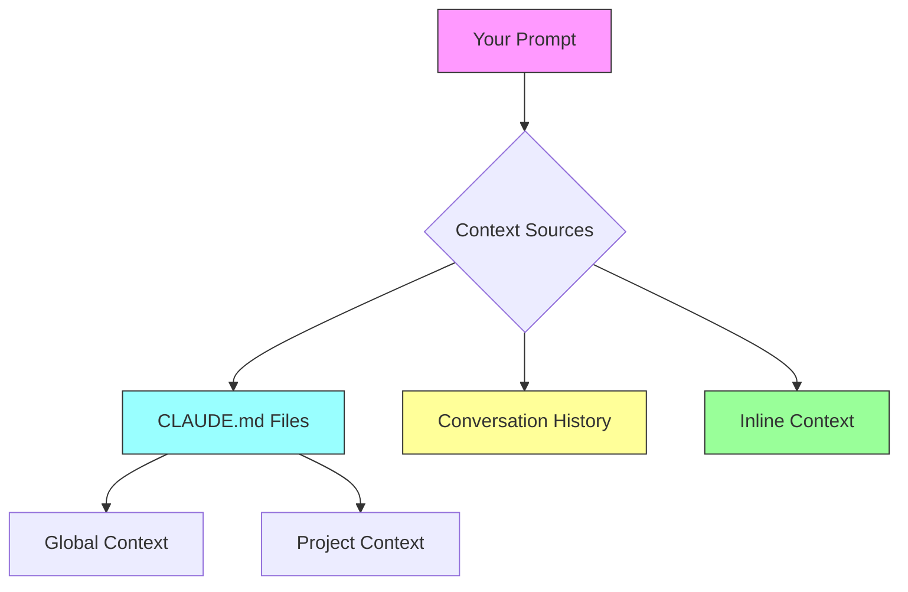

# Prompt Engineering Section - Implementation Plan

**Created**: December 27, 2025
**Status**: Planning Phase
**Objective**: Add comprehensive prompt engineering guidance for Claude Code users

---

## 1. Overview

Add a new guide section focused on **prompt engineering** specifically for Claude Code. This will teach users how to communicate effectively with Claude Code to get the best results for coding tasks.

---

## 2. Placement in Documentation Structure

### DECISION: Split Approach (Basics Early + Advanced Later)

**Rationale**: Users need basic prompting skills early, but advanced techniques require understanding the full system.

---

### Part 1: Basics (Early) - Position 02

**Location**: `guides/02-prompt-basics/`

**When**: Immediately after introduction, before diving into features
**Purpose**: Foundation for effective communication
**Reading Time**: 15-20 minutes
**Skill Level**: Beginner

**Structure**:
```
guides/02-prompt-basics/
├── 1-overview.md           # Why prompting matters, basic formula
└── 2-core-patterns.md      # 7 essential patterns (CREATE, FIX, REFACTOR, etc.)
```

**Content Focus**:
- Simple, standalone examples
- No references to advanced features (agents, skills, MCP servers)
- Core principles: clear intent, specific location, success criteria
- Top 5 common mistakes
- Quick wins for immediate improvement

---

### Part 2: Advanced (Later) - Position 16

**Location**: `guides/16-advanced-prompting/`

**When**: After users understand the full Claude Code system
**Purpose**: Expert-level techniques integrating all features
**Reading Time**: 35-45 minutes
**Skill Level**: Intermediate to Advanced

**Structure**:
```
guides/16-advanced-prompting/
├── 1-overview.md              # Advanced concepts introduction
├── 2-techniques.md            # Chain-of-thought, few-shot, constraints
├── 3-context-optimization.md  # CLAUDE.md integration, context layers
└── 4-cost-aware-prompting.md  # Optimizing prompts for cost/quality
```

**Content Focus**:
- Integration with agents, skills, hooks, thinking modes
- Context management strategies with CLAUDE.md
- Cost optimization through prompt design
- Multi-step workflows
- Real-world complex scenarios

---

### Renumbering Impact

**Current structure** → **New structure**:
```
01. MCP Servers          →  01. MCP Servers
                         →  02. Prompt Basics (NEW)
02. Agents               →  03. Agents
03. Skills               →  04. Skills
04. Commands             →  05. Commands
05. Models               →  06. Models
06. Plugins              →  07. Plugins
07. Thinking             →  08. Thinking
08. Context              →  09. Context
09. Keywords             →  10. Keywords
10. Hooks                →  11. Hooks
11. Optimization         →  12. Optimization
12. Examples             →  13. Examples
13. Reference            →  14. Reference
14. Security             →  15. Security
15. Community            →  16. Community
                         →  17. Advanced Prompting (NEW)
```

**Note**: This renumbering will require updating all internal cross-references in existing guides.

---

## 3. Content Outline

### 3.1 Guide 1: Overview (guides/16-prompt-engineering/1-overview.md)

**Reading Time**: 20-30 minutes
**Skill Level**: Beginner to Intermediate
**Prerequisites**: Basic Claude Code usage

**Content**:

#### Introduction
- What is prompt engineering for Claude Code?
- Why it matters (quality, efficiency, cost)
- How it differs from general LLM prompt engineering

#### The Prompt Engineering Formula
```
Great Prompt = Clear Intent + Sufficient Context + Specific Constraints + Success Criteria
```

#### Quick Comparison
Good vs Bad prompts side-by-side:

| Bad Prompt | Good Prompt | Why Better |
|------------|-------------|------------|
| "Fix the bug" | "Fix the null pointer exception in auth.ts line 42 where user.profile can be undefined" | Specific location and issue |
| "Add tests" | "Add unit tests for the UserService class using Jest, covering the login, logout, and token refresh methods" | Specific target, framework, coverage |
| "Refactor this" | "Refactor the checkout flow to use React hooks instead of class components, maintaining existing behavior" | Clear goal, constraints |

#### The 5 Principles of Effective Prompts
1. **Be Specific**: Name files, functions, line numbers
2. **Provide Context**: Tech stack, constraints, requirements
3. **State Intent**: What you want to achieve (not just how)
4. **Set Boundaries**: What NOT to change
5. **Define Success**: How to know when done

#### When to Use Different Prompt Styles

**Directive Prompts** (Simple tasks):
```
"Format this file with Prettier"
"Add type annotations to the User interface"
"Fix the linting errors in components/Button.tsx"
```

**Collaborative Prompts** (Complex tasks):
```
"Let's refactor the authentication system. I want to move from session-based to JWT tokens. What's the best approach given our Express + PostgreSQL stack?"
```

**Exploratory Prompts** (Investigation):
```
"Analyze the performance bottleneck in the API endpoint at /api/users. Show me profiling data and suggest optimizations."
```

#### Real-World Examples

**Example 1: Bug Fix**
- ❌ Bad: "The login doesn't work"
- ✅ Good: "The login form at src/components/LoginForm.tsx returns a 401 error even with correct credentials. The API endpoint is /api/auth/login. Can you check the authentication logic?"

**Example 2: Feature Addition**
- ❌ Bad: "Add a search feature"
- ✅ Good: "Add a search bar to the ProductList component that filters products by name and category in real-time. Use the existing useProducts hook and maintain the current pagination."

**Example 3: Code Review**
- ❌ Bad: "Review this code"
- ✅ Good: "Review this PR for security issues and performance problems. Focus on the new API endpoints in api/routes/payments.ts. We're using Stripe for payments."

---

### 3.2 Guide 2: Basic Patterns (guides/16-prompt-engineering/2-basic-patterns.md)

**Reading Time**: 25-35 minutes
**Skill Level**: Beginner to Intermediate

**Content**:

#### The 7 Core Prompt Patterns

##### 1. CREATE Pattern
**When to use**: Building something new

**Template**:
```
Create a [TYPE] that [PURPOSE]
- [Technology/framework]
- [Key requirements 1-3]
- [Constraints]
```

**Example**:
```
Create a React component for a product card that displays product image, name, price, and "Add to Cart" button
- Use TypeScript and Tailwind CSS
- Handle image loading states
- Make it responsive (mobile-first)
- Don't add Redux logic (parent handles state)
```

##### 2. FIX Pattern
**When to use**: Fixing bugs or errors

**Template**:
```
Fix [ISSUE] in [LOCATION]
- Current behavior: [what's happening]
- Expected behavior: [what should happen]
- Context: [relevant info]
```

**Example**:
```
Fix the infinite re-render loop in ProductList.tsx line 45
- Current: Component re-renders continuously
- Expected: Render once, update only when products change
- Context: Using useEffect to fetch products, dependency array might be wrong
```

##### 3. REFACTOR Pattern
**When to use**: Improving existing code

**Template**:
```
Refactor [TARGET] to [IMPROVEMENT]
- Current approach: [what exists now]
- Desired outcome: [what you want]
- Constraints: [what must stay the same]
```

**Example**:
```
Refactor the authentication middleware to use async/await instead of callbacks
- Current: Callback-based error handling
- Desired: Modern async/await with try/catch
- Constraints: Must maintain existing API contract, all tests must pass
```

##### 4. REVIEW Pattern
**When to use**: Code review, analysis

**Template**:
```
Review [TARGET] for [FOCUS_AREAS]
- Context: [what this code does]
- Pay special attention to: [specific concerns]
```

**Example**:
```
Review src/api/payment.ts for security vulnerabilities and error handling
- Context: Stripe payment processing for e-commerce checkout
- Pay special attention to: Input validation, secret key handling, error logging
```

##### 5. EXPLAIN Pattern
**When to use**: Understanding code

**Template**:
```
Explain [TARGET] focusing on [ASPECTS]
- Assume [KNOWLEDGE_LEVEL]
- Include: [what to cover]
```

**Example**:
```
Explain how the caching layer in services/cache.ts works
- Assume intermediate TypeScript knowledge
- Include: Cache invalidation strategy, TTL management, race condition handling
```

##### 6. TEST Pattern
**When to use**: Writing tests

**Template**:
```
Write [TEST_TYPE] for [TARGET]
- Framework: [test framework]
- Coverage: [what to test]
- Edge cases: [specific scenarios]
```

**Example**:
```
Write unit tests for the UserService class
- Framework: Jest with TypeScript
- Coverage: login(), logout(), refreshToken() methods
- Edge cases: expired tokens, invalid credentials, network errors
```

##### 7. OPTIMIZE Pattern
**When to use**: Performance improvements

**Template**:
```
Optimize [TARGET] for [METRIC]
- Current performance: [baseline]
- Target: [goal]
- Constraints: [limitations]
```

**Example**:
```
Optimize the product search query for response time
- Current: 2-3 seconds for 10K products
- Target: <500ms
- Constraints: Can't change database schema, must maintain full-text search
```

#### Combining Patterns

**Example - Multi-step task**:
```
1. First, EXPLAIN how the current authentication system works
2. Then, REVIEW it for security issues
3. Finally, REFACTOR it to use JWT tokens instead of sessions
```

#### Progressive Refinement

**Start broad, then narrow**:
```
Round 1: "Add user authentication to the app"
[Claude asks clarifying questions]

Round 2: "Use JWT tokens with refresh token rotation. Store in HttpOnly cookies. Use bcrypt for password hashing."
[Claude implements, you review]

Round 3: "Add rate limiting to the login endpoint - max 5 attempts per IP per 15 minutes"
[Iterative improvement]
```

---

### 3.3 Guide 3: Advanced Techniques (guides/16-prompt-engineering/3-advanced-techniques.md)

**Reading Time**: 30-40 minutes
**Skill Level**: Intermediate to Advanced

**Content**:

#### 1. Chain-of-Thought Prompting

**Technique**: Ask Claude to think through steps

**Example**:
```
Think through the best approach to migrate our PostgreSQL database to add multi-tenancy:
1. First, analyze the current schema
2. Then, identify what needs to change for tenant isolation
3. Consider performance implications
4. Propose a migration strategy with rollback plan
5. Implement the first migration file
```

**When to use**: Complex architectural decisions, multi-step tasks

#### 2. Few-Shot Examples

**Technique**: Provide examples of desired output

**Example**:
```
Create API endpoints following this pattern:

Example 1:
GET /api/v1/users/:id
- Validate user ID
- Check authentication
- Return user or 404

Example 2:
POST /api/v1/products
- Validate request body with Zod
- Check admin role
- Create product or 400

Now create endpoints for the Order resource with the same pattern.
```

**When to use**: Establishing coding patterns, enforcing style

#### 3. Constraint-Based Prompting

**Technique**: Define what NOT to do

**Example**:
```
Refactor the component to use TypeScript strict mode:
- ✅ Add explicit types for all props, state, and return values
- ✅ Use generics for reusable logic
- ❌ Don't use 'any' type
- ❌ Don't disable strict null checks
- ❌ Don't change the component's API
```

**When to use**: Maintaining code standards, preventing regressions

#### 4. Context Injection

**Technique**: Provide relevant context upfront

**Example**:
```
Context: Our app uses Next.js 14 with App Router, TypeScript, Tailwind, and Prisma. We follow server component patterns where possible.

Task: Create a new page for user profiles at /profile/[username] that:
- Fetches user data server-side
- Shows user avatar, bio, and recent posts
- Uses Suspense for loading states
```

**When to use**: Complex projects, specific tech stacks

#### 5. Iterative Refinement

**Technique**: Build incrementally

**Round 1 - Basic structure**:
```
Create a basic Product component with name and price
```

**Round 2 - Add features**:
```
Add image display with lazy loading and error handling
```

**Round 3 - Polish**:
```
Add animations on hover, responsive layout, and accessibility attributes
```

**When to use**: Large features, exploratory development

#### 6. Role-Based Prompting

**Technique**: Ask Claude to adopt a specific perspective

**Example**:
```
As a security engineer, review this authentication code for vulnerabilities:
[code]

Then, as a performance engineer, analyze it for bottlenecks.
```

**When to use**: Multi-faceted analysis, different expertise areas

#### 7. Comparative Prompting

**Technique**: Ask for comparisons

**Example**:
```
Compare three approaches for state management in our React app:
1. Redux Toolkit
2. Zustand
3. React Context + useReducer

For each, show:
- Code example
- Pros/cons for our use case (e-commerce with 20+ components)
- Performance implications
- Migration effort from current Context-based solution
```

**When to use**: Technology decisions, architecture choices

#### 8. Debugging Prompts

**Technique**: Structured problem investigation

**Example**:
```
The checkout flow is failing with "Payment processing error". Help me debug:

1. Here's the error stack trace: [paste]
2. Here's the payment service code: [file]
3. Recent changes: Added Stripe webhook handling yesterday
4. Environment: Production only (works in staging)

Walk through the debugging process step by step.
```

**When to use**: Complex bugs, production issues

---

### 3.4 Guide 4: Context in Prompts (guides/16-prompt-engineering/4-context-in-prompts.md)

**Reading Time**: 20-30 minutes
**Skill Level**: Intermediate

**Content**:

#### The Context Hierarchy



#### When to Use Each Context Source

##### 1. CLAUDE.md Context (Persistent)
**Use for**: Tech stack, coding standards, project structure

**Example CLAUDE.md**:
```markdown
# E-commerce Platform

## Tech Stack
- Next.js 14 + TypeScript + Tailwind
- PostgreSQL + Prisma
- Stripe for payments

## Coding Standards
- Server components by default
- Client components only for interactivity
- Zod for validation
```

**Then your prompts can be simpler**:
```
"Add a checkout page"
# Claude knows: Next.js, Stripe, Zod validation
```

##### 2. Conversation Context (Session)
**Use for**: Ongoing task context, iterative refinement

**Example conversation**:
```
You: "Let's refactor the authentication system"
Claude: [analyzes current system]

You: "Good analysis. Now implement JWT tokens"
# Claude remembers the analysis from previous message
```

##### 3. Inline Context (Per-prompt)
**Use for**: One-time context, specific task details

**Example**:
```
"Review this component for accessibility issues. Context: We need WCAG 2.1 AA compliance for government contract."
```

#### Providing Effective Inline Context

##### Pattern 1: Stack Context
```
Tech stack: React 18 + TypeScript + Vite + Vitest

Create a UserProfile component...
```

##### Pattern 2: Constraint Context
```
Constraints:
- Must work on IE11 (legacy requirement)
- Cannot use async/await
- Max bundle size: 50KB

Implement a date picker...
```

##### Pattern 3: Historical Context
```
Background: This code was written 3 years ago using class components and Redux. We're migrating to hooks and Context API.

Refactor the ProductList component...
```

##### Pattern 4: Business Context
```
Business requirement: Users complained that checkout takes too long. Analytics show 40% drop-off at payment step.

Optimize the checkout flow...
```

#### Context Optimization Tips

##### ✅ DO: Layer Context Appropriately

```
# CLAUDE.md (persistent)
Tech stack: Next.js + Prisma

# Conversation (session)
"We're adding a blog feature"
"Use MDX for content"

# Inline prompt (per-task)
"Create the blog post page at /blog/[slug]. Show reading time estimate."
```

##### ❌ DON'T: Repeat Context Every Prompt

**Bad** (wasteful):
```
Every prompt: "Using Next.js 14 with TypeScript and Tailwind, create..."
Every prompt: "Using Next.js 14 with TypeScript and Tailwind, add..."
Every prompt: "Using Next.js 14 with TypeScript and Tailwind, fix..."
```

**Good** (efficient):
```
CLAUDE.md: [tech stack once]
Prompts: "Create...", "Add...", "Fix..."
```

#### When Context is Missing

**Symptom**: Claude asks clarifying questions

**Example**:
```
You: "Add authentication"

Claude: "I'd be happy to help! A few questions:
- Which auth method? (JWT, sessions, OAuth)
- Which library? (Passport, NextAuth, custom)
- Where should users authenticate? (dedicated page, modal, redirect)"
```

**Solutions**:
1. **Add to CLAUDE.md** (if permanent)
2. **Provide in prompt** (if one-time)
3. **Answer questions** (if exploratory)

#### Context Trade-offs

| Approach | Tokens | Reusability | When to Use |
|----------|--------|-------------|-------------|
| **CLAUDE.md** | 500-2000 per request | High | Persistent project info |
| **Conversation** | Grows over time | Medium | Iterative tasks |
| **Inline** | 100-500 per prompt | Low | One-off context |

**Cost Example**:
```
Without CLAUDE.md (inline every time):
- 20 requests × 500 tokens context = 10,000 tokens
- Cost: ~$0.30 (Sonnet)

With CLAUDE.md (once):
- 20 requests × 500 tokens = 10,000 tokens
- Cost: ~$0.30 (same cost, but cleaner prompts)

Best: CLAUDE.md + concise prompts:
- 20 requests × 50 tokens inline = 1,000 tokens
- Cost: ~$0.03 (10x cheaper!)
```

---

### 3.5 Guide 5: Anti-Patterns (guides/16-prompt-engineering/5-anti-patterns.md)

**Reading Time**: 20-30 minutes
**Skill Level**: All levels

**Content**:

#### The 10 Most Common Prompt Mistakes

##### 1. ❌ Vague Intent

**Bad**:
```
"Fix the code"
"Make it better"
"Improve performance"
```

**Why bad**: Claude doesn't know what's broken or what "better" means

**Good**:
```
"Fix the memory leak in the WebSocket connection handler"
"Refactor to use TypeScript strict mode for better type safety"
"Reduce API response time from 2s to <500ms"
```

---

##### 2. ❌ Missing Location

**Bad**:
```
"There's a bug in the login"
```

**Why bad**: Large codebases have many files

**Good**:
```
"Fix the bug in src/components/LoginForm.tsx where the password validation fails for special characters"
```

---

##### 3. ❌ Ambiguous Scope

**Bad**:
```
"Add tests"
```

**Why bad**: Tests for what? Which files? What coverage?

**Good**:
```
"Add unit tests for UserService.login() method using Jest. Cover: successful login, invalid credentials, expired session, and network errors."
```

---

##### 4. ❌ Conflicting Instructions

**Bad**:
```
"Make it fast but also make it handle all edge cases thoroughly"
# (Fast vs thorough can conflict)

"Keep the current API but completely redesign it"
# (Contradictory)
```

**Why bad**: Creates confusion about priorities

**Good**:
```
"Optimize for speed while maintaining current error handling for invalid inputs. It's okay to skip edge cases like malformed Unicode."
```

---

##### 5. ❌ Assuming Context

**Bad**:
```
"Use the standard pattern we discussed"
# (Which pattern? When discussed?)

"Follow the same approach as before"
# (Which approach? How long ago?)
```

**Why bad**: Claude can't access memory beyond conversation

**Good**:
```
"Use the repository pattern we used in UserRepository.ts - dependency injection with interface segregation"
```

---

##### 6. ❌ Over-Specification

**Bad**:
```
"Create a button component. Make it blue (#3B82F6). Font size 14px. Padding 8px 16px. Border radius 4px. Font weight 500. Hover state should be #2563EB. Active state #1D4ED8. Disabled state #9CA3AF. Line height 1.5. Letter spacing 0.025em..."
```

**Why bad**: Too many micro-decisions, inflexible

**Good**:
```
"Create a primary button component using our Tailwind theme. Follow the design system in components/Button/variants.ts"
```

---

##### 7. ❌ No Success Criteria

**Bad**:
```
"Improve the search functionality"
```

**Why bad**: How do you know when it's "improved"?

**Good**:
```
"Improve search to return results in <200ms for the 90th percentile. Measure with existing benchmarks in tests/performance/search.test.ts"
```

---

##### 8. ❌ Mixing Multiple Unrelated Tasks

**Bad**:
```
"Fix the login bug, add dark mode, refactor the database queries, and update the README"
```

**Why bad**: Hard to track, high failure rate, unclear priorities

**Good**:
```
"Fix the login bug in LoginForm.tsx where password validation fails"
[Wait for completion]
"Now add dark mode support to the theme system"
[Iterative approach]
```

---

##### 9. ❌ Ignoring Existing Patterns

**Bad**:
```
"Create an API endpoint however you think is best"
```

**Why bad**: Inconsistent with existing code

**Good**:
```
"Create an API endpoint for /api/orders following the pattern in api/users.ts - Express router, Zod validation, async error handling"
```

---

##### 10. ❌ No Constraints

**Bad**:
```
"Refactor the authentication system"
```

**Why bad**: Could break everything, no boundaries

**Good**:
```
"Refactor authentication to use JWT tokens. Must maintain backward compatibility with existing session-based clients for 90 days. All tests must pass."
```

---

#### Anti-Pattern Detection

**Self-check before sending prompt**:
```
[ ] Is the intent clear?
[ ] Did I specify the location?
[ ] Is the scope well-defined?
[ ] Are there conflicting instructions?
[ ] Did I provide necessary context?
[ ] Is it appropriately detailed?
[ ] How will I know it's done?
[ ] Is it one focused task?
[ ] Does it follow existing patterns?
[ ] Are constraints clear?
```

---

#### Recovery from Bad Prompts

**If you realize you sent a bad prompt:**

**Option 1: Clarify Immediately**
```
You: "Add authentication"
You: "To clarify: JWT tokens with refresh rotation, store in HttpOnly cookies, use bcrypt for passwords"
```

**Option 2: Let Claude Ask Questions**
```
You: "Fix the bug"
Claude: "Which bug are you referring to? Can you point me to the file and symptom?"
You: [Provide details]
```

**Option 3: Start Over with Better Prompt**
```
You: "Actually, ignore that. Let me be more specific: Fix the null pointer exception in auth.ts:42 where user.profile can be undefined"
```

---

## 4. Cross-References & Integration

### Link to Existing Guides

**From prompt engineering guides, link to**:
- guides/08-thinking/ - When to use thinking modes in prompts
- guides/09-context/ - CLAUDE.md file management
- guides/03-agents/ - How different agents respond to prompts
- guides/12-optimization/ - Cost implications of prompt verbosity

**From existing guides, link to prompt engineering**:
- guides/09-context/1-overview.md - Add section "See also: Prompt Engineering"
- guides/08-thinking/1-overview.md - Link to prompt patterns
- TABLE_OF_CONTENTS.md - Add new section

---

## 5. Examples & Exercises

### Interactive Examples

Each guide should include:

**Before/After Examples**: Show bad prompt → good prompt → result

**Practice Exercises**:
```
Exercise 1: Improve this prompt
Bad: "The app is slow"
Your turn: [user rewrites]
Answer: "The product listing page loads in 5 seconds. Optimize by reducing API calls and adding pagination."
```

**Real-World Scenarios**:
- "You're debugging a production issue..."
- "You need to add a complex feature..."
- "Your team needs consistent code style..."

---

## 6. Visual Aids

### Diagrams to Include

**Prompt Anatomy Diagram**:
```
[Intent] + [Context] + [Constraints] + [Success Criteria] = Great Prompt
```

**Decision Trees**:
- "Which prompt pattern should I use?"
- "How much context do I need?"

**Flow Charts**:
- "Prompt refinement process"

---

## 7. Implementation Checklist

### Phase 1: Basic Prompt Engineering (Week 1)
**Objective**: Get basics in place early for immediate user value

- [ ] Create guides/02-prompt-basics/ directory
- [ ] Write 1-overview.md (why prompting matters, basic formula)
- [ ] Write 2-core-patterns.md (7 essential patterns with simple examples)
- [ ] No cross-references to advanced features yet
- [ ] Review for beginner-friendliness

### Phase 2: Renumber Existing Guides (Week 2)
**Objective**: Make room for new section, update all references

- [ ] Renumber guides 02-15 → 03-16
- [ ] Update all internal cross-references in existing guides
- [ ] Update TABLE_OF_CONTENTS.md
- [ ] Update INTRODUCTION.md learning paths
- [ ] Test all internal links

### Phase 3: Advanced Prompting (Week 3)
**Objective**: Add expert-level techniques

- [ ] Create guides/17-advanced-prompting/ directory
- [ ] Write 1-overview.md (advanced concepts)
- [ ] Write 2-techniques.md (chain-of-thought, few-shot, constraints)
- [ ] Write 3-context-optimization.md (CLAUDE.md integration)
- [ ] Write 4-cost-aware-prompting.md (cost optimization)
- [ ] Add cross-references to agents, skills, context, optimization guides

### Phase 4: Polish & Integration (Week 4)
**Objective**: Ensure cohesive documentation

- [ ] Add Mermaid diagrams to both sections
- [ ] Create practice exercises for basics section
- [ ] Add real-world examples to advanced section
- [ ] Link from existing guides to prompt engineering sections
- [ ] Technical review for accuracy
- [ ] User testing with 3-5 developers at different skill levels
- [ ] Incorporate feedback
- [ ] Final polish and publish

---

## Alternative: Phased Rollout

**If renumbering is too disruptive**, consider this approach:

### Approach A: Add Without Renumbering (Faster)
```
01. MCP Servers
02. Agents
...
15. Community
16. Prompt Basics (NEW - temporary position)
17. Advanced Prompting (NEW)
```

Then later, renumber everything in a separate PR.

### Approach B: Add to Existing Sections (No Renumbering)
```
01. MCP Servers
02. Agents
    └── Add: prompt-patterns-for-agents.md
03. Skills
...
09. Context
    └── Expand: Add prompting guidance
```

**Recommended**: Full renumbering (original plan) for better pedagogical flow, but acknowledge it's a bigger change.

---

## 8. Success Metrics

**Documentation should enable users to**:
- [ ] Write effective prompts on first try (reduce back-and-forth)
- [ ] Understand when to use which pattern
- [ ] Avoid common mistakes
- [ ] Optimize prompt costs
- [ ] Get better code quality from Claude

**Measurable outcomes**:
- Fewer clarifying questions from Claude
- Higher user satisfaction
- Better code quality in generated solutions
- Reduced token usage per task

---

## 9. Open Questions

**To decide before implementation**:

1. **Should we include language-specific prompt patterns?**
   - Python prompts vs JavaScript prompts
   - Or keep it language-agnostic?

2. **Should we add video examples?**
   - Screen recordings of prompt refinement
   - Before/after comparisons

3. **Should we create a prompt template library?**
   - Downloadable templates
   - Copy-paste ready prompts for common tasks

4. **How to handle prompt engineering for different agents?**
   - Do Explore, Plan, and General-Purpose agents need different prompting styles?

5. **Should we add a "Prompt Checklist" tool?**
   - Interactive checklist before submitting prompts
   - Could be a web tool or markdown checklist

---

## 10. Related Enhancements

**While implementing prompt engineering, consider**:

1. **Update CLAUDE.md guide** to show how it affects prompting
2. **Add prompt examples to each existing guide** (not just in section 16)
3. **Create a "Quick Reference" cheat sheet** for common patterns
4. **Add prompt engineering to CONTRIBUTING.md** for documentation contributors

---

## Next Steps

1. **Get user feedback** on this plan
2. **Decide on open questions** (section 9)
3. **Start with Phase 1** (overview + basic patterns)
4. **Iterate based on feedback**

---

**Questions for Review**:
- Does this structure make sense?
- Is this the right level of detail?
- Should prompt engineering be section 16, or integrated differently?
- Any critical topics missing?
