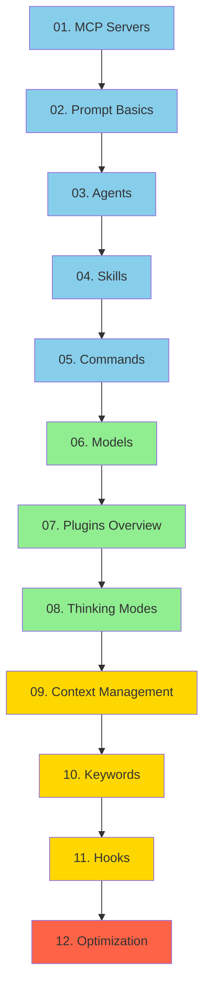
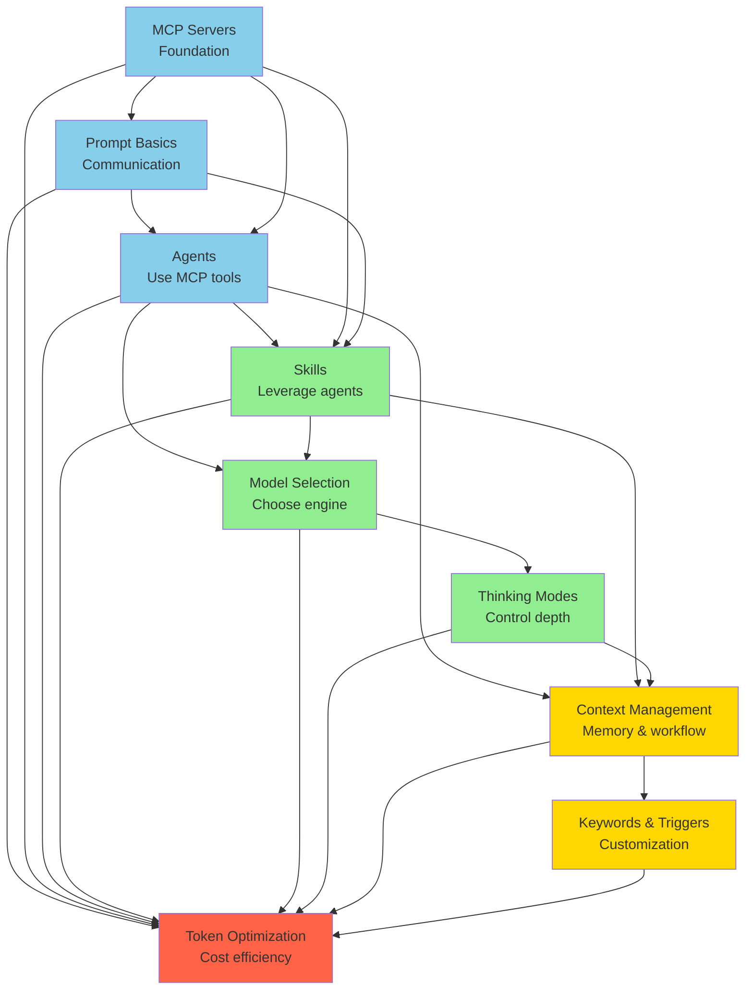

# Table of Contents

> Your guide to navigating the Claude Code documentation

## 📍 You Are Here

This documentation follows a **pedagogical progression** from fundamental to advanced concepts. Each topic builds on the previous ones, creating a natural learning path from setup to optimization.

```
Foundation → Building Blocks → Advanced → Mastery
   MCP     →    Agents/Skills  → Context → Optimization
```

## 🗺️ Documentation Map

### Core Learning Path (Sequential)



🟦 **Beginner** → 🟢 **Intermediate** → 🟡 **Advanced** → 🔴 **Mastery**

---

## 📚 Complete Documentation Structure

### 🏁 Getting Started

| Document | Level | Time | What You'll Learn |
|----------|-------|------|-------------------|
| [README.md](README.md) | All | 5 min | Repository overview and quick start |
| [INTRODUCTION.md](INTRODUCTION.md) | All | 15 min | Welcome, learning path, prerequisites |
| **→ You Are Here** | All | 5 min | Navigation and reading paths |

---

### 0️⃣6️⃣ Plugin Ecosystem (Big Picture)

**Level**: 🟦 Beginner
**Prerequisites**: None - start here for the overview!
**What You'll Master**: Understanding the four plugin types and how they extend Claude Code

| Guide | Time | Topics |
|-------|------|--------|
| **[Plugin Ecosystem Overview](guides/07-plugins/1-overview.md)** | **20 min** | **4 plugin types, comparison, when to use each** |

**Total Time**: 20 minutes
**Dependencies**: None
**Next**: MCP Servers (deep dive on plugin type 1)

**💡 Why Start Here**: Get the big picture before diving into details. Understand how MCP Servers, Skills, Hooks, and Slash Commands fit together.

---

### 1️⃣ MCP Servers (Foundation)

**Level**: 🟦 Beginner
**Prerequisites**: Plugin Ecosystem Overview (recommended)
**What You'll Master**: Extending Claude Code with external tools and services (Plugin Type 1)

| Guide | Time | Topics |
|-------|------|--------|
| [What Are MCP Servers?](guides/01-mcp-servers/1-overview.md) | 15 min | Protocol overview, benefits, architecture |
| [Installation Guide](guides/01-mcp-servers/2-installation.md) | 30 min | CLI, manual, Docker installation methods |
| [Popular MCP Servers](guides/01-mcp-servers/3-popular-servers.md) | 25 min | GitHub, Perplexity, Context7, and more |
| **[Creating Custom MCP Servers](guides/01-mcp-servers/4-creating-custom-servers.md)** | **60 min** | **Build your own MCP server from scratch** |
| [Best Practices](guides/01-mcp-servers/5-best-practices.md) | 20 min | Security, performance, error handling |

**Total Time**: ~2.5 hours
**Dependencies**: None
**Next**: Agents (use MCP tools effectively)

**🔨 Creation Guide Included**: Learn to build custom MCP servers for your specific needs

---

### 2️⃣ Prompt Engineering Basics (Essential Skills)

**Level**: 🟦 Beginner
**Prerequisites**: None - Start here after MCP overview!
**What You'll Master**: Effective communication with Claude Code

| Guide | Time | Topics |
|-------|------|--------|
| [Why Prompting Matters](guides/02-prompt-basics/1-overview.md) | 20 min | 4-part formula, cost/time savings, common mistakes |
| [Core Prompt Patterns](guides/02-prompt-basics/2-core-patterns.md) | 35 min | 7 essential patterns (CREATE, FIX, REFACTOR, REVIEW, EXPLAIN, TEST, OPTIMIZE) |

**Total Time**: ~55 minutes
**Dependencies**: None
**Next**: Agents (apply prompting skills to specialized agents)

**💡 Why Learn This Early**: Good prompts save time and money from day one. Master these patterns before learning advanced features.

---

### 3️⃣ Agents (Building on MCP)

**Level**: 🟦 Beginner → 🟢 Intermediate
**Prerequisites**: Understanding of MCP Servers
**What You'll Master**: Specialized AI assistants with focused capabilities

| Guide | Time | Topics |
|-------|------|--------|
| [What Are Agents?](guides/03-agents/1-overview.md) | 20 min | Concept, purpose, when to use |
| [Built-in Agent Types](guides/03-agents/2-built-in-agents.md) | 30 min | Explore, General-Purpose, Plan agents |
| [Model Assignment](guides/03-agents/3-model-assignment.md) | 25 min | Per-agent model selection for cost optimization |
| **[Creating Custom Agents](guides/03-agents/4-custom-agents.md)** | **50 min** | **Build specialized agents for your workflows** |

**Total Time**: ~2 hours
**Dependencies**: MCP Servers (Agents use MCP tools)
**Next**: Skills (leverage agents with reusable instructions)

**🔨 Creation Guide Included**: Learn to build custom agents with specialized capabilities

---

### 3️⃣ Skills (Leveraging Agents)

**Level**: 🟢 Intermediate
**Prerequisites**: MCP Servers, Agents basics
**What You'll Master**: Reusable instruction sets for complex tasks

| Guide | Time | Topics |
|-------|------|--------|
| [What Are Skills?](guides/04-skills/1-overview.md) | 20 min | Progressive disclosure, model invocation |
| [Marketplace Skills](guides/04-skills/2-marketplace-skills.md) | 20 min | Installing official and community skills |
| **[Creating Custom Skills](guides/04-skills/3-creating-skills.md)** | **70 min** | **SKILL.md structure, frontmatter, best practices** |
| [Model Assignment](guides/04-skills/4-model-assignment.md) | 20 min | Per-skill model selection |
| [Advanced Patterns](guides/04-skills/5-advanced-patterns.md) | 30 min | Progressive disclosure, testing, optimization |

**Total Time**: ~2.5 hours
**Dependencies**: Agents (Skills leverage agent capabilities)
**Next**: Models (choose the right engine for each task)

**🔨 Creation Guide Included**: Learn to build custom skills with progressive disclosure patterns

---

### 0️⃣4️⃣ Commands (Quick Shortcuts)

**Level**: 🟦 Beginner → 🟢 Intermediate
**Prerequisites**: Basic Claude Code usage
**What You'll Master**: Creating and using slash commands for quick shortcuts

| Guide | Time | Topics |
|-------|------|--------|
| **[Commands Overview](guides/05-commands/1-overview.md)** | **25 min** | **Creating slash commands, arguments, team workflows** |

**Total Time**: ~25 minutes
**Dependencies**: Basic Claude Code usage
**Next**: Models (choose the right engine for each task)

**🔨 Creation Guide Included**: Learn to build custom slash commands for your team

---

### 0️⃣5️⃣ Model Selection (Understanding the Engine)

**Level**: 🟢 Intermediate
**Prerequisites**: Basic understanding of Agents and Skills
**What You'll Master**: Choosing Haiku, Sonnet, or Opus strategically

| Guide | Time | Topics |
|-------|------|--------|
| [Model Overview](guides/06-models/1-overview.md) | 20 min | Haiku 4.5, Sonnet 4.5, Opus 4.5 capabilities |
| [Selection Guide](guides/06-models/5-selection-guide.md) | 30 min | Decision matrix, when to use each model |

**Total Time**: ~50 minutes
**Dependencies**: Agents and Skills (model assignment context)
**Next**: Thinking Modes (control reasoning depth)

---

### 0️⃣7️⃣ Thinking Modes (Optimizing Reasoning)

**Level**: 🟢 Intermediate → 🟡 Advanced
**Prerequisites**: Model Selection
**What You'll Master**: Extended thinking and reasoning depth control

| Guide | Time | Topics |
|-------|------|--------|
| [Extended Thinking Overview](guides/08-thinking/1-overview.md) | 15 min | What it is, how it works |
| [Keywords Reference](guides/08-thinking/2-keywords.md) | 10 min | "think", "think hard", "ultrathink" budgets |

**Total Time**: ~25 minutes
**Dependencies**: Models (thinking affects token usage)
**Next**: Context Management (advanced control)

---

### 0️⃣8️⃣ Context Management (Advanced Control)

**Level**: 🟡 Advanced
**Prerequisites**: All previous topics
**What You'll Master**: Memory, CLAUDE.md files, context optimization

| Guide | Time | Topics |
|-------|------|--------|
| [CLAUDE.md Files](guides/09-context/2-claude-md.md) | 30 min | System-level context, best practices |
| [Memory Hierarchy](guides/09-context/3-memory-hierarchy.md) | 25 min | Hierarchy, precedence, organization |

**Total Time**: ~55 minutes
**Dependencies**: Understanding of entire system
**Next**: Keywords & Triggers (customize behavior)

---

### 0️⃣9️⃣ Keywords & Triggers (Power User Features)

**Level**: 🟡 Advanced
**Prerequisites**: Context Management
**What You'll Master**: Hooks, commands, behavioral customization

| Reference | Time | Topics |
|-----------|------|--------|
| [Keywords Overview](guides/10-keywords/1-overview.md) | 15 min | All thinking keywords, effects |
| [Automation Patterns](guides/10-keywords/3-automation-patterns.md) | 30 min | PreToolUse, PostToolUse, Notification, Stop |
| [Slash Commands](guides/10-keywords/2-slash-commands.md) | 20 min | Slash commands, $ARGUMENTS, frontmatter |

**Total Time**: ~1 hour
**Dependencies**: Context Management
**Next**: Hooks & Automation (plugin type 4)

---

### 1️⃣0️⃣ Hooks & Automation (Plugin Type 4)

**Level**: 🟡 Advanced
**Prerequisites**: Keywords & Triggers, Plugin Ecosystem Overview
**What You'll Master**: Automated workflows with pre/post tool use hooks

| Guide | Time | Topics |
|-------|------|--------|
| **[Hooks Overview](guides/11-hooks/1-overview.md)** | **25 min** | **Hook types, configuration, automation patterns** |

**Total Time**: 25 minutes
**Dependencies**: Understanding of tools and workflows
**Next**: Token Optimization (optimize automated workflows)

**🎣 Why Hooks Matter**: Automate testing, formatting, and validation. Run commands automatically on file changes, commits, or any tool use.

---

### 1️⃣1️⃣ Token Optimization (Synthesis)

**Level**: 🔴 Mastery
**Prerequisites**: All previous topics
**What You'll Master**: Cost-efficient Claude Code usage

| Guide | Time | Topics |
|-------|------|--------|
| [Monitoring & Budgeting](guides/12-optimization/3-monitoring-budgeting.md) | 30 min | Tracking, estimation, monitoring |
| [Cost Optimization](guides/12-optimization/1-cost-optimization.md) | 30 min | Haiku vs. Sonnet vs. Opus economics |
| [Advanced Techniques](guides/12-optimization/2-advanced-techniques.md) | 35 min | 4 strategies, 60%+ savings potential |

**Total Time**: ~1.5 hours
**Dependencies**: All topics (applies everything learned)
**Outcome**: Save 50-60%+ on token costs

---

### 1️⃣2️⃣ Examples & Templates (Practical Application)

**Level**: 🟢 Intermediate
**Prerequisites**: Basic understanding of Claude Code
**What You'll Master**: Real-world project configurations and workflows

| Guide | Time | Topics |
|-------|------|--------|
| [Examples Overview](guides/13-examples/1-overview.md) | 10 min | How to use templates and examples |
| **Projects** |||
| [React + TypeScript Project](guides/13-examples/projects/1-react-typescript.md) | 45 min | Complete frontend project setup |
| [Node.js API Service](guides/13-examples/projects/2-nodejs-api.md) | 40 min | Backend API configuration |
| **[Python/Django Project](guides/13-examples/projects/python/1-django.md)** | **45 min** | **Django with custom skills and workflows** |
| **[Python/FastAPI Project](guides/13-examples/projects/python/2-fastapi.md)** | **40 min** | **Modern async Python API** |
| **[Python/Flask Project](guides/13-examples/projects/python/3-flask.md)** | **30 min** | **Lightweight Flask web framework** |
| **Workflows** |||
| [Feature Development Workflow](guides/13-examples/workflows/1-feature-development.md) | 30 min | 6-phase development process |
| **[Bug Fixing Workflow](guides/13-examples/workflows/2-bug-fixing.md)** | **30 min** | **Systematic debugging with TDD approach** |
| **[Code Review Workflow](guides/13-examples/workflows/3-code-review.md)** | **25 min** | **AI-assisted PR reviews with security checks** |
| **[Refactoring Workflow](guides/13-examples/workflows/4-refactoring.md)** | **35 min** | **Safe refactoring with Plan agent and tests** |
| **[Documentation Writing Workflow](guides/13-examples/workflows/5-documentation-writing.md)** | **25 min** | **API docs, tutorials, testing examples, ROI analysis** |
| **[Performance Optimization Workflow](guides/13-examples/workflows/6-performance-optimization.md)** | **30 min** | **Profile, analyze, optimize, validate with real examples** |
| **[Testing Workflow](guides/13-examples/workflows/7-testing.md)** | **35 min** | **TDD, unit tests, integration, E2E with comprehensive examples** |
| **Teams** |||
| [Solo Developer Setup](guides/13-examples/teams/1-solo-developer.md) | 25 min | Optimized individual configuration |

**Total Time**: ~6 hours
**Dependencies**: Understanding of core concepts
**Outcome**: Production-ready project configurations

---

### 1️⃣3️⃣ Reference Documentation (Quick Lookup)

**Level**: All levels
**Prerequisites**: None for quick reference, intermediate for deep understanding
**What You'll Master**: Technical specifications and troubleshooting

| Guide | Time | Topics |
|-------|------|--------|
| **[Complete API Reference](guides/14-reference/1-api-reference.md)** | **45 min** | **AGENT.md, SKILL.md, config.json schemas** |
| **[Troubleshooting Guide](guides/14-reference/2-troubleshooting.md)** | **35 min** | **Common issues and solutions** |
| **[FAQ](guides/14-reference/3-faq.md)** | **40 min** | **50+ frequently asked questions** |
| **[Quick Reference Cheat Sheet](guides/14-reference/4-cheat-sheet.md)** | **10 min** | **One-page printable reference** |

**Total Time**: ~2 hours (reference as needed)
**Dependencies**: None
**Use For**: Quick lookups, troubleshooting, technical specifications

---

### 1️⃣4️⃣ Security & Compliance (Production Readiness)

**Level**: 🔴 Advanced
**Prerequisites**: Understanding of core concepts, project experience
**What You'll Master**: Production deployment, security, testing, and performance

| Guide | Time | Topics |
|-------|------|--------|
| **[Security & Compliance](guides/15-security/1-security-compliance.md)** | **45 min** | **Secrets management, OWASP Top 10, GDPR/SOC 2/HIPAA, AI safety** |
| **[Testing & Quality](guides/15-security/2-testing-quality.md)** | **50 min** | **MCP/skill/agent testing, TDD/BDD, quality gates, CI/CD** |
| **[Performance & Monitoring](guides/15-security/3-performance-monitoring.md)** | **40 min** | **Benchmarks, token tracking, cost monitoring, optimization** |

**Total Time**: ~2 hours
**Dependencies**: Core concepts, project experience
**Outcome**: Production-ready, secure, and optimized deployments

---

### 1️⃣5️⃣ Community & Contribution

**Level**: All levels
**Prerequisites**: None
**What You'll Master**: Contributing to Claude Code ecosystem, learning from community

| Guide | Time | Topics |
|-------|------|--------|
| **[Community Resources](guides/16-community/1-resources.md)** | **20 min** | **Official docs, forums, learning materials** |
| **[Contribution Guide](guides/16-community/2-contribution-guide.md)** | **25 min** | **How to contribute skills, MCP servers, documentation** |
| **[Best Practices Catalog](guides/16-community/3-best-practices-catalog.md)** | **30 min** | **Production patterns from real-world use (73% cost reduction examples)** |

**Total Time**: ~1.5 hours
**Dependencies**: None
**Use For**: Contributing back, learning from community, sharing expertise

---

### 1️⃣6️⃣ Advanced Prompting (Production Optimization)

**Level**: 🔴 Intermediate to Advanced
**Prerequisites**: [Prompt Basics](guides/02-prompt-basics/1-overview.md), [Agents](guides/03-agents/1-overview.md), [Context Management](guides/09-context/2-claude-md.md)
**What You'll Master**: Advanced prompt engineering techniques for production workflows

| Guide | Time | Topics |
|-------|------|--------|
| **[Advanced Prompting Overview](guides/17-advanced-prompting/1-overview.md)** | **25 min** | **What advanced prompting is, ROI, when to use** |
| **[Advanced Techniques](guides/17-advanced-prompting/2-techniques.md)** | **45 min** | **Chain-of-thought, few-shot learning, constraints, meta-prompting** |
| **[Context Optimization](guides/17-advanced-prompting/3-context-optimization.md)** | **35 min** | **CLAUDE.md integration, context layering, memory management** |
| **[Cost-Aware Prompting](guides/17-advanced-prompting/4-cost-aware-prompting.md)** | **40 min** | **Prompt efficiency, model cascading, batch optimization, quality thresholds** |

**Total Time**: ~2.5 hours
**Dependencies**: Understanding of basics, agents, skills, and context management
**Outcome**: 60-90% cost reduction while maintaining or improving quality

**💰 Why Learn This**: Advanced prompting techniques pay for themselves within days. Typical ROI: 10-20x in first month through cost savings and efficiency gains.

---

### 📄 Project Documentation

| Document | Purpose |
|----------|---------|
| [CHANGELOG.md](CHANGELOG.md) | Version history and updates |
| [CONTRIBUTING.md](CONTRIBUTING.md) | How to contribute to this documentation |
| [DOCUMENTATION_PLAN.md](DOCUMENTATION_PLAN.md) | Complete documentation roadmap and plan |

---

## 🎯 Reading Paths for Different Users

### Path 1: "New to Claude Code" (Complete Learning)

**Recommended for**: First-time users, those wanting comprehensive understanding
**Time investment**: ~15-20 hours total
**Approach**: Follow sequential order from MCP Servers → Token Optimization

```
Start → MCP Servers → Prompt Basics → Agents → Skills → Models →
Thinking → Context → Keywords → Optimization → Master
```

**Benefits**:
- Solid foundation in fundamentals
- Understand why things work, not just how
- Build knowledge progressively
- Ready for advanced customization

---

### Path 2: "Optimization Focused" (Quick to Power User)

**Recommended for**: Experienced developers, cost-conscious users
**Time investment**: ~6-8 hours core + as-needed reference
**Approach**: Cover fundamentals quickly, deep dive into optimization

```
MCP Servers (quick) → Prompt Basics (deep) → Agents (quick) → Models (deep) →
Thinking (deep) → Optimization (deep) → Context (reference)
```

**Focus Areas**:
1. Prompt Basics (55 min deep dive)
2. Model Selection (30 min deep dive)
3. Thinking Modes (25 min deep dive)
4. Token Optimization (1 hour deep dive)
5. Reference other topics as needed

**Benefits**:
- Fast path to cost savings
- Practical optimization strategies
- Can return for advanced topics later

---

### Path 3: "Advanced Customization" (Power User)

**Recommended for**: Experienced Claude Code users seeking customization
**Time investment**: ~4-6 hours (assumes foundation knowledge)
**Approach**: Skip basics, focus on advanced features

```
Skills (deep) → Context Management (deep) →
Keywords & Triggers (deep) → Custom Agents → Custom Skills
```

**Focus Areas**:
1. Creating Custom Skills (1 hour)
2. CLAUDE.md Best Practices (30 min)
3. Hooks and Commands (45 min)
4. Advanced Context Patterns (35 min)

**Benefits**:
- Customize Claude Code to your workflow
- Create reusable skills for your team
- Master advanced patterns

---

### Path 4: "Quick Reference" (Lookup as Needed)

**Recommended for**: Active users needing quick answers
**Time investment**: 5-15 min per lookup
**Approach**: Use reference sections and examples

**Key Resources**:
- [Keywords Overview](guides/10-keywords/1-overview.md) - All keywords and effects
- [Automation Patterns](guides/10-keywords/3-automation-patterns.md) - Hook configuration
- [Slash Commands](guides/10-keywords/2-slash-commands.md) - Slash command syntax
- [Examples](guides/13-examples/1-overview.md) - Copy-paste ready templates

---

## 🔗 Dependency Diagram

Understanding how topics build on each other:



**Key Insights**:
- **MCP Servers** are the foundation - everything builds from here
- **Prompt Basics** apply to everything - learn early for immediate benefits
- **Skills** require both MCP and Agents knowledge
- **Token Optimization** synthesizes ALL topics
- **Context Management** touches most advanced features

---

## 📦 Examples & Templates

Practical, copy-paste ready examples:

### Skills Examples
- [Documentation Professor](.claude/skills/documentation-professor/) - Pedagogical documentation writer (active skill)
- [More workflow examples](guides/13-examples/workflows/) - Complete workflow guides including TDD, code review, and more

### Project Templates
- [React + TypeScript](guides/13-examples/projects/1-react-typescript.md) - Complete frontend project setup
- [Node.js API Service](guides/13-examples/projects/2-nodejs-api.md) - Backend API configuration
- [Python/Django](guides/13-examples/projects/python/1-django.md) - Django with custom skills
- [Python/FastAPI](guides/13-examples/projects/python/2-fastapi.md) - Modern async Python API
- [Python/Flask](guides/13-examples/projects/python/3-flask.md) - Lightweight Flask web framework

### Workflow Guides
- [Feature Development](guides/13-examples/workflows/1-feature-development.md) - 6-phase development process
- [Bug Fixing](guides/13-examples/workflows/2-bug-fixing.md) - Systematic debugging with TDD
- [Code Review](guides/13-examples/workflows/3-code-review.md) - AI-assisted PR reviews
- [Refactoring](guides/13-examples/workflows/4-refactoring.md) - Safe refactoring with tests
- [Documentation Writing](guides/13-examples/workflows/5-documentation-writing.md) - API docs and tutorials
- [Performance Optimization](guides/13-examples/workflows/6-performance-optimization.md) - Profile, analyze, optimize
- [Testing](guides/13-examples/workflows/7-testing.md) - TDD, unit, integration, E2E

---

## ❓ Why This Order?

### Pedagogical Rationale

**1. MCP Servers First**
You can't use Claude Code's full power without understanding how to extend it. MCP is the foundation for everything else.

**2. Prompt Basics Early**
Before diving into advanced features, learn how to communicate effectively. Good prompts save time and money from day one, and these skills apply to everything that follows.

**3. Agents Build on MCP & Prompting**
Agents use MCP tools to accomplish tasks. Understanding MCP and prompting first makes agents make sense and helps you use them effectively.

**4. Skills Leverage Agents**
Skills are instruction sets that agents follow. You need to understand agents before creating effective skills.

**5. Models Power Everything**
Knowing when to use Haiku, Sonnet, or Opus is crucial for cost-effective usage. This comes after understanding what tasks you're running (via agents/skills).

**6. Thinking Optimizes Reasoning**
Once you know which model to use, thinking modes let you control the depth of reasoning and balance quality vs. cost.

**7. Context Manages Flow**
Advanced usage requires understanding how Claude manages information across conversations. This builds on all previous knowledge.

**8. Keywords Customize Behavior**
Power user features like hooks and custom commands require understanding the entire system first.

**9. Optimization Synthesizes All**
Token optimization applies everything you've learned - model selection, thinking budgets, context management, and strategic agent/skill usage.

**10. Examples Provide Templates**
Real-world project configurations and workflows show how to apply all concepts in production environments. Templates accelerate setup and demonstrate best practices.

**11. Reference Enables Quick Lookup**
API references, troubleshooting guides, and FAQs support ongoing development work without requiring re-reading full guides.

**12. Security Ensures Production Quality**
Security, testing, and performance guides ensure deployments are production-ready, maintainable, and meet compliance requirements.

**13. Quick Reference Accelerates Daily Work**
Decision trees, checklists, and quick lookups optimize your daily workflow once you understand the fundamentals.

**14. Community Enables Contribution**
Contribution guides and best practices allow you to give back, learn from others' experiences, and participate in the ecosystem.

---

## 🎓 Learning Checkpoints

After completing each section, you should be able to:

✅ **After MCP Servers**:
- Install and configure MCP servers
- Understand the Model Context Protocol
- Add popular servers (GitHub, Perplexity)
- Know when to create custom servers

✅ **After Prompt Basics**:
- Use the 4-part formula (Intent + Context + Constraints + Success)
- Apply the 7 essential patterns (CREATE, FIX, REFACTOR, etc.)
- Transform vague prompts into effective ones
- Avoid common beginner mistakes
- Save time and money with better prompts

✅ **After Agents**:
- Explain the difference between Explore, General-Purpose, and Plan agents
- Choose the right agent type for tasks
- Configure agents with specific models
- Understand agent lifecycle

✅ **After Skills**:
- Create custom skills with SKILL.md
- Install marketplace skills
- Assign models to skills for optimization
- Write effective skill descriptions

✅ **After Models**:
- Choose between Haiku, Sonnet, and Opus strategically
- Configure models via CLI, agents, or skills
- Understand cost implications of each model
- Use decision matrix for model selection

✅ **After Thinking Modes**:
- Use thinking keywords appropriately
- Understand thinking token budgets
- Toggle extended thinking when needed
- Balance reasoning depth with cost

✅ **After Context Management**:
- Write effective CLAUDE.md files
- Organize memory hierarchies
- Handle context clearing gracefully
- Apply context best practices

✅ **After Keywords & Triggers**:
- Configure hooks for automation
- Create custom slash commands
- Use keywords to modify behavior
- Customize Claude Code workflows

✅ **After Token Optimization**:
- Implement all 4 optimization strategies
- Save 50-60%+ on token costs
- Monitor and measure usage effectively
- Make data-driven model choices

✅ **After Examples & Templates**:
- Apply project configurations to your codebase
- Use workflow guides for common development tasks
- Adapt templates to your specific needs
- Follow production-ready patterns

✅ **After Security & Compliance**:
- Implement security best practices in code
- Set up comprehensive testing pipelines
- Monitor performance and costs effectively
- Deploy confidently to production

✅ **After Community Engagement**:
- Contribute skills and MCP servers back
- Share best practices with community
- Learn from others' production experiences
- Help newcomers get started

---

## 📖 Additional Resources

### Quick References
- [Keywords Overview](guides/10-keywords/1-overview.md) - All keywords at a glance
- [Model Overview](guides/06-models/1-overview.md) - Quick model selection
- [Slash Commands](guides/10-keywords/2-slash-commands.md) - Frequently used commands

### External Links
- [Official Claude Code Docs](https://code.claude.com/docs)
- [Claude API Documentation](https://docs.claude.com)
- [Model Context Protocol](https://modelcontextprotocol.io)
- [Anthropic Engineering Blog](https://www.anthropic.com/engineering)
- [Community Skills](https://github.com/obra/superpowers)

### Getting Help
- [Troubleshooting Guide](guides/14-reference/2-troubleshooting.md) - Common issues and solutions
- [FAQ](guides/14-reference/3-faq.md) - Frequently asked questions
- [GitHub Issues](https://github.com/anthropics/claude-code/issues) - Report bugs

---

## 🚀 Ready to Start?

Choose your path:

**→ [New to Claude Code? Start with INTRODUCTION.md](INTRODUCTION.md)**
**→ [Want quick optimization? Jump to Token Optimization](guides/12-optimization/2-advanced-techniques.md)**
**→ [Need a specific answer? Use the search or references](guides/14-reference/)**
**→ [Want to see examples? Browse templates](guides/13-examples/1-overview.md)**

---

**Last Updated**: Phase 0 - Documentation Foundation
**Next Phase**: Phase 1 - Foundation Documentation (MCP, Agents, Skills)
