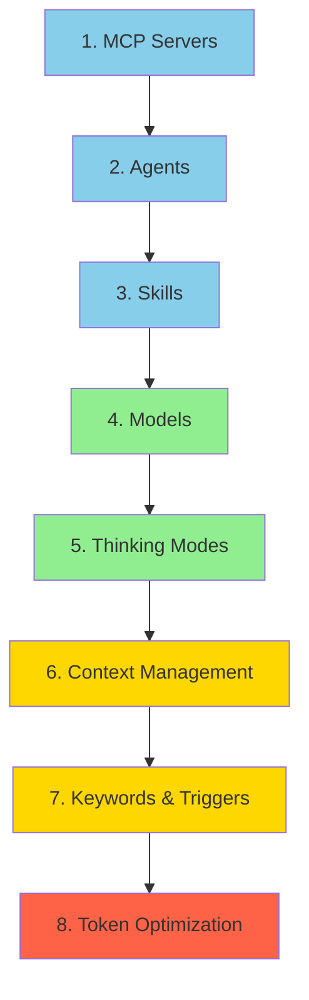
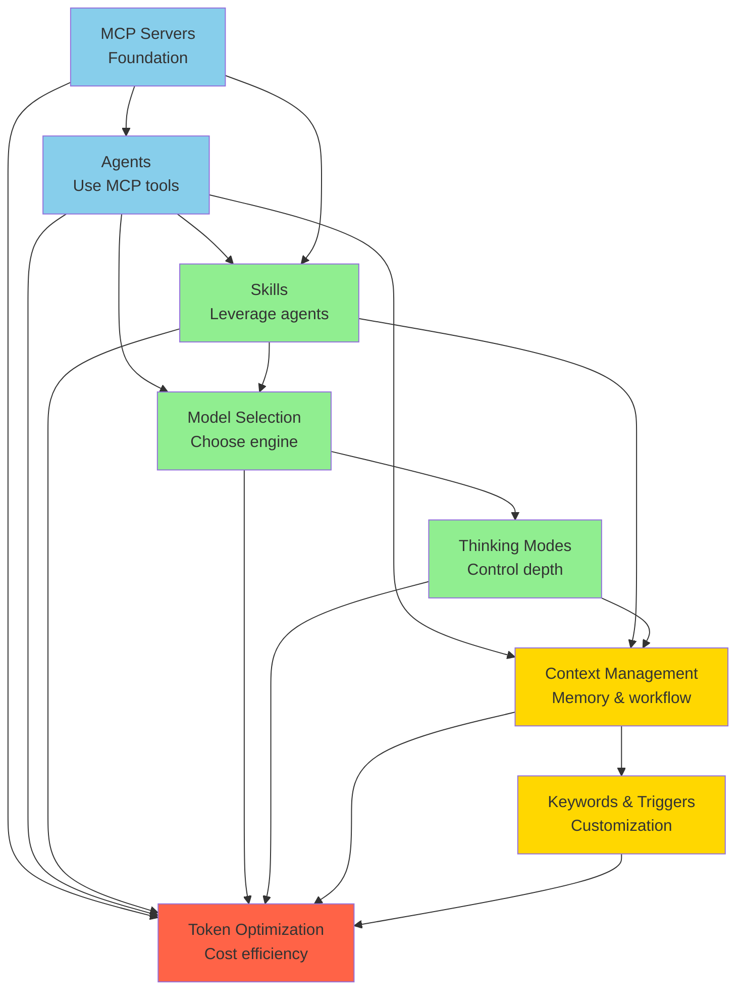

# Table of Contents

> Your guide to navigating the Claude Code documentation

## 📍 You Are Here

This documentation follows a **pedagogical progression** from fundamental to advanced concepts. Each topic builds on the previous ones, creating a natural learning path from setup to optimization.

```
Foundation → Building Blocks → Advanced → Mastery
   MCP     →    Agents/Skills  → Context → Optimization
```

## 🗺️ Documentation Map

### Core Learning Path (Sequential)



🟦 **Beginner** → 🟢 **Intermediate** → 🟡 **Advanced** → 🔴 **Mastery**

---

## 📚 Complete Documentation Structure

### 🏁 Getting Started

| Document | Level | Time | What You'll Learn |
|----------|-------|------|-------------------|
| [README.md](README.md) | All | 5 min | Repository overview and quick start |
| [INTRODUCTION.md](INTRODUCTION.md) | All | 15 min | Welcome, learning path, prerequisites |
| **→ You Are Here** | All | 5 min | Navigation and reading paths |

---

### 1️⃣ MCP Servers (Foundation)

**Level**: 🟦 Beginner
**Prerequisites**: None - start here!
**What You'll Master**: Extending Claude Code with external tools and services

| Guide | Time | Topics |
|-------|------|--------|
| [What Are MCP Servers?](guides/1-mcp-servers/1-overview.md) | 10 min | Protocol overview, benefits, architecture |
| [Installation Guide](guides/1-mcp-servers/2-installation.md) | 20 min | CLI, manual, Docker installation methods |
| [Popular MCP Servers](guides/1-mcp-servers/3-popular-servers.md) | 15 min | GitHub, Perplexity, Context7, and more |
| [Creating Custom Servers](guides/1-mcp-servers/creating-custom-servers.md) | 45 min | Build your own MCP server from scratch |
| [Best Practices](guides/1-mcp-servers/best-practices.md) | 20 min | Security, performance, error handling |

**Total Time**: ~2 hours
**Dependencies**: None
**Next**: Agents (use MCP tools effectively)

---

### 2️⃣ Agents (Building on MCP)

**Level**: 🟦 Beginner → 🟢 Intermediate
**Prerequisites**: Understanding of MCP Servers
**What You'll Master**: Specialized AI assistants with focused capabilities

| Guide | Time | Topics |
|-------|------|--------|
| [What Are Agents?](guides/2-agents/1-overview.md) | 15 min | Concept, purpose, when to use |
| [Built-in Agent Types](guides/2-agents/2-built-in-agents.md) | 30 min | Explore, General-Purpose, Plan agents |
| [Custom Agents](guides/2-agents/custom-agents.md) | 45 min | Create specialized agents |
| [Model Assignment](guides/2-agents/model-assignment.md) | 25 min | Per-agent model selection for cost optimization |

**Total Time**: ~2 hours
**Dependencies**: MCP Servers (Agents use MCP tools)
**Next**: Skills (leverage agents with reusable instructions)

---

### 3️⃣ Skills (Leveraging Agents)

**Level**: 🟢 Intermediate
**Prerequisites**: MCP Servers, Agents basics
**What You'll Master**: Reusable instruction sets for complex tasks

| Guide | Time | Topics |
|-------|------|--------|
| [What Are Skills?](guides/skills/overview.md) | 15 min | Progressive disclosure, model invocation |
| [Marketplace Skills](guides/skills/marketplace-skills.md) | 20 min | Installing official and community skills |
| [Creating Skills](guides/skills/creating-skills.md) | 60 min | SKILL.md structure, best practices |
| [Model Assignment](guides/skills/model-assignment.md) | 20 min | Per-skill model selection |
| [Best Practices](guides/skills/best-practices.md) | 30 min | Description quality, testing, optimization |

**Total Time**: ~2.5 hours
**Dependencies**: Agents (Skills leverage agent capabilities)
**Next**: Models (choose the right engine for each task)

---

### 4️⃣ Model Selection (Understanding the Engine)

**Level**: 🟢 Intermediate
**Prerequisites**: Basic understanding of Agents and Skills
**What You'll Master**: Choosing Haiku, Sonnet, or Opus strategically

| Guide | Time | Topics |
|-------|------|--------|
| [Model Comparison](guides/models/model-comparison.md) | 20 min | Haiku 4.5, Sonnet 4.5, Opus 4.5 capabilities |
| [Selection Guide](guides/models/selection-guide.md) | 30 min | Decision matrix, when to use each model |
| [Configuration](guides/models/configuration.md) | 25 min | CLI flags, agent config, skill frontmatter |

**Total Time**: ~1.5 hours
**Dependencies**: Agents and Skills (model assignment context)
**Next**: Thinking Modes (control reasoning depth)

---

### 5️⃣ Thinking Modes (Optimizing Reasoning)

**Level**: 🟢 Intermediate → 🟡 Advanced
**Prerequisites**: Model Selection
**What You'll Master**: Extended thinking and reasoning depth control

| Guide | Time | Topics |
|-------|------|--------|
| [Extended Thinking Overview](guides/thinking/extended-thinking.md) | 15 min | What it is, how it works |
| [Keywords Reference](guides/thinking/keywords-reference.md) | 10 min | "think", "think hard", "ultrathink" budgets |
| [When to Use](guides/thinking/when-to-use.md) | 20 min | Use cases, cost considerations |

**Total Time**: ~45 minutes
**Dependencies**: Models (thinking affects token usage)
**Next**: Context Management (advanced control)

---

### 6️⃣ Context Management (Advanced Control)

**Level**: 🟡 Advanced
**Prerequisites**: All previous topics
**What You'll Master**: Memory, CLAUDE.md files, context optimization

| Guide | Time | Topics |
|-------|------|--------|
| [CLAUDE.md Files](guides/context/claude-md-files.md) | 30 min | System-level context, best practices |
| [Memory Management](guides/context/memory-management.md) | 25 min | Hierarchy, precedence, organization |
| [Optimization](guides/context/optimization.md) | 35 min | Context clearing, strategies, anti-patterns |

**Total Time**: ~1.5 hours
**Dependencies**: Understanding of entire system
**Next**: Keywords & Triggers (customize behavior)

---

### 7️⃣ Keywords & Triggers (Power User Features)

**Level**: 🟡 Advanced
**Prerequisites**: Context Management
**What You'll Master**: Hooks, commands, behavioral customization

| Reference | Time | Topics |
|-----------|------|--------|
| [Keywords Reference](reference/keywords.md) | 15 min | All thinking keywords, effects |
| [Hooks Reference](reference/hooks.md) | 30 min | PreToolUse, PostToolUse, Notification, Stop |
| [Commands Reference](reference/commands.md) | 20 min | Slash commands, $ARGUMENTS, frontmatter |

**Total Time**: ~1 hour
**Dependencies**: Context Management
**Next**: Token Optimization (put it all together)

---

### 8️⃣ Token Optimization (Synthesis)

**Level**: 🔴 Mastery
**Prerequisites**: All previous topics
**What You'll Master**: Cost-efficient Claude Code usage

| Guide | Time | Topics |
|-------|------|--------|
| [Token Usage Guide](optimization/token-usage.md) | 30 min | Tracking, estimation, monitoring |
| [Cost Comparison](optimization/cost-comparison.md) | 20 min | Haiku vs. Sonnet vs. Opus economics |
| [Optimization Strategies](optimization/strategies.md) | 45 min | 4 strategies, 60%+ savings potential |

**Total Time**: ~1.5 hours
**Dependencies**: All topics (applies everything learned)
**Outcome**: Save 50-60%+ on token costs

---

## 🎯 Reading Paths for Different Users

### Path 1: "New to Claude Code" (Complete Learning)

**Recommended for**: First-time users, those wanting comprehensive understanding
**Time investment**: ~15-20 hours total
**Approach**: Follow sequential order from MCP Servers → Token Optimization

```
Start → MCP Servers → Agents → Skills → Models →
Thinking → Context → Keywords → Optimization → Master
```

**Benefits**:
- Solid foundation in fundamentals
- Understand why things work, not just how
- Build knowledge progressively
- Ready for advanced customization

---

### Path 2: "Optimization Focused" (Quick to Power User)

**Recommended for**: Experienced developers, cost-conscious users
**Time investment**: ~6-8 hours core + as-needed reference
**Approach**: Cover fundamentals quickly, deep dive into optimization

```
MCP Servers (quick) → Agents (quick) → Models (deep) →
Thinking (deep) → Optimization (deep) → Context (reference)
```

**Focus Areas**:
1. Model Selection (30 min deep dive)
2. Thinking Modes (25 min deep dive)
3. Token Optimization (1 hour deep dive)
4. Reference other topics as needed

**Benefits**:
- Fast path to cost savings
- Practical optimization strategies
- Can return for advanced topics later

---

### Path 3: "Advanced Customization" (Power User)

**Recommended for**: Experienced Claude Code users seeking customization
**Time investment**: ~4-6 hours (assumes foundation knowledge)
**Approach**: Skip basics, focus on advanced features

```
Skills (deep) → Context Management (deep) →
Keywords & Triggers (deep) → Custom Agents → Custom Skills
```

**Focus Areas**:
1. Creating Custom Skills (1 hour)
2. CLAUDE.md Best Practices (30 min)
3. Hooks and Commands (45 min)
4. Advanced Context Patterns (35 min)

**Benefits**:
- Customize Claude Code to your workflow
- Create reusable skills for your team
- Master advanced patterns

---

### Path 4: "Quick Reference" (Lookup as Needed)

**Recommended for**: Active users needing quick answers
**Time investment**: 5-15 min per lookup
**Approach**: Use reference sections and examples

**Key Resources**:
- [Keywords Reference](reference/keywords.md) - All keywords and effects
- [Hooks Reference](reference/hooks.md) - Hook configuration
- [Commands Reference](reference/commands.md) - Slash command syntax
- [Examples](examples/) - Copy-paste ready templates

---

## 🔗 Dependency Diagram

Understanding how topics build on each other:



**Key Insights**:
- **MCP Servers** are the foundation - everything builds from here
- **Skills** require both MCP and Agents knowledge
- **Token Optimization** synthesizes ALL topics
- **Context Management** touches most advanced features

---

## 📦 Examples & Templates

Practical, copy-paste ready examples:

### Skills Examples
- [Documentation Professor](examples/skills/documentation-professor/) - Pedagogical documentation writer
- [TDD Workflow](examples/skills/tdd-workflow/) - Test-driven development
- [API Documentation](examples/skills/api-documentation/) - Generate API docs from code
- [Code Review](examples/skills/code-review/) - Automated code reviews

### Agent Configurations
- [Quick Search Agent](examples/agents/quick-search.json) - Fast codebase exploration (Haiku)
- [Feature Implementer](examples/agents/feature-implementer.json) - Standard development (Sonnet)
- [Architecture Reviewer](examples/agents/architecture-reviewer.json) - Deep analysis (Opus)

### CLAUDE.md Templates
- [Web Application](examples/claude-md-templates/web-application-CLAUDE.md) - React/Vue/Angular
- [API Service](examples/claude-md-templates/api-service-CLAUDE.md) - Backend services
- [Library/Package](examples/claude-md-templates/library-package-CLAUDE.md) - Open source
- [Monorepo](examples/claude-md-templates/monorepo-CLAUDE.md) - Multi-package projects
- [Documentation](examples/claude-md-templates/documentation-project-CLAUDE.md) - Doc sites
- [Machine Learning](examples/claude-md-templates/machine-learning-CLAUDE.md) - ML projects

### Complete Projects
- [Web App Setup](examples/projects/web-app-setup.md) - Full web application configuration
- [API Service](examples/projects/api-service.md) - Backend service with database
- [Monorepo](examples/projects/monorepo.md) - Multi-package repository

---

## ❓ Why This Order?

### Pedagogical Rationale

**1. MCP Servers First**
You can't use Claude Code's full power without understanding how to extend it. MCP is the foundation for everything else.

**2. Agents Build on MCP**
Agents use MCP tools to accomplish tasks. Understanding MCP first makes agents make sense.

**3. Skills Leverage Agents**
Skills are instruction sets that agents follow. You need to understand agents before creating effective skills.

**4. Models Power Everything**
Knowing when to use Haiku, Sonnet, or Opus is crucial for cost-effective usage. This comes after understanding what tasks you're running (via agents/skills).

**5. Thinking Optimizes Reasoning**
Once you know which model to use, thinking modes let you control the depth of reasoning and balance quality vs. cost.

**6. Context Manages Flow**
Advanced usage requires understanding how Claude manages information across conversations. This builds on all previous knowledge.

**7. Keywords Customize Behavior**
Power user features like hooks and custom commands require understanding the entire system first.

**8. Optimization Synthesizes All**
Token optimization applies everything you've learned - model selection, thinking budgets, context management, and strategic agent/skill usage.

---

## 🎓 Learning Checkpoints

After completing each section, you should be able to:

✅ **After MCP Servers**:
- Install and configure MCP servers
- Understand the Model Context Protocol
- Add popular servers (GitHub, Perplexity)
- Know when to create custom servers

✅ **After Agents**:
- Explain the difference between Explore, General-Purpose, and Plan agents
- Choose the right agent type for tasks
- Configure agents with specific models
- Understand agent lifecycle

✅ **After Skills**:
- Create custom skills with SKILL.md
- Install marketplace skills
- Assign models to skills for optimization
- Write effective skill descriptions

✅ **After Models**:
- Choose between Haiku, Sonnet, and Opus strategically
- Configure models via CLI, agents, or skills
- Understand cost implications of each model
- Use decision matrix for model selection

✅ **After Thinking Modes**:
- Use thinking keywords appropriately
- Understand thinking token budgets
- Toggle extended thinking when needed
- Balance reasoning depth with cost

✅ **After Context Management**:
- Write effective CLAUDE.md files
- Organize memory hierarchies
- Handle context clearing gracefully
- Apply context best practices

✅ **After Keywords & Triggers**:
- Configure hooks for automation
- Create custom slash commands
- Use keywords to modify behavior
- Customize Claude Code workflows

✅ **After Token Optimization**:
- Implement all 4 optimization strategies
- Save 50-60%+ on token costs
- Monitor and measure usage effectively
- Make data-driven model choices

---

## 📖 Additional Resources

### Quick References
- [Keywords Cheat Sheet](reference/keywords.md#cheat-sheet) - All keywords at a glance
- [Model Comparison Table](guides/models/model-comparison.md#comparison-table) - Quick model selection
- [Common Commands](reference/commands.md#common-commands) - Frequently used commands

### External Links
- [Official Claude Code Docs](https://code.claude.com/docs)
- [Claude API Documentation](https://docs.claude.com)
- [Model Context Protocol](https://modelcontextprotocol.io)
- [Anthropic Engineering Blog](https://www.anthropic.com/engineering)
- [Community Skills](https://github.com/obra/superpowers)

### Getting Help
- [Troubleshooting Guide](reference/troubleshooting.md) - Common issues and solutions
- [FAQ](reference/faq.md) - Frequently asked questions
- [GitHub Issues](https://github.com/anthropics/claude-code/issues) - Report bugs

---

## 🚀 Ready to Start?

Choose your path:

**→ [New to Claude Code? Start with INTRODUCTION.md](INTRODUCTION.md)**
**→ [Want quick optimization? Jump to Token Optimization](optimization/strategies.md)**
**→ [Need a specific answer? Use the search or references](reference/)**
**→ [Want to see examples? Browse templates](examples/)**

---

**Last Updated**: Phase 0 - Documentation Foundation
**Next Phase**: Phase 1 - Foundation Documentation (MCP, Agents, Skills)
