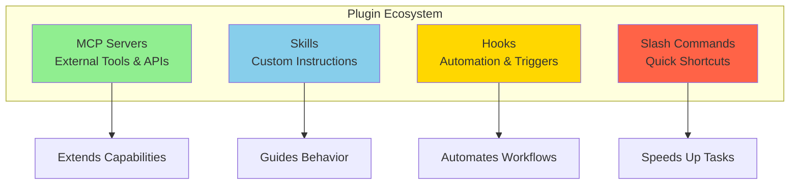

# Claude Code Plugin Ecosystem: Overview

⏱️ **Time**: 20 minutes
📊 **Level**: Beginner
🎯 **What You'll Learn**: The four types of plugins in Claude Code, when to use each, and how they work together to extend functionality

---

## What Are Plugins?

Think of Claude Code as your smartphone, and **plugins** as the apps you install to make it more powerful. Out of the box, Claude Code is already capable, but with plugins you unlock a whole new world of possibilities.

Plugins extend Claude Code to work with your favorite tools, services, and workflows. Want Claude to access your GitHub repos? There's a plugin for that. Need automated testing on every file save? Plugin. Want custom slash commands for your team? You guessed it—plugin!

## The Four Plugin Types

Claude Code's extensibility comes in **four flavors**, each serving a different purpose:



### Quick Comparison

| Plugin Type | Purpose | Example | Complexity | Learn More |
|------------|---------|---------|-----------|-----------|
| **MCP Servers** | Connect external tools | GitHub, databases, APIs | 🟡 Medium | [Section 1](../01-mcp-servers/1-overview.md) |
| **Skills** | Custom workflows | TDD, docs, reviews | 🟢 Easy | [Section 3](../03-skills/1-overview.md) |
| **Hooks** | Automation triggers | Auto-test, auto-format | 🔴 Advanced | [Section 7.5](../08-hooks/1-overview.md) |
| **Slash Commands** | Quick shortcuts | `/review-pr`, `/test` | 🟢 Easy | [Section 7](../07-keywords/2-slash-commands.md) |

---

## 1. MCP Servers: External Capabilities

**What They Are**: API connectors that let Claude interact with external services and tools.

**Think of it like**: Giving your assistant the keys to your office buildings. Suddenly they can access the filing cabinet (databases), make phone calls (APIs), and check the mail (GitHub).

**Popular Examples**:
- **GitHub**: PR reviews, issue management, code search
- **Postgres**: Database queries, schema inspection
- **Brave Search**: Web research, documentation lookup
- **Filesystem**: Read/write files, directory traversal

**When to Use**:
- You need Claude to access external data (GitHub, databases)
- You want to integrate with third-party services
- You need real-time information beyond Claude's knowledge

**Learn More**: [MCP Servers Deep Dive →](../01-mcp-servers/1-overview.md)

---

## 2. Skills: Custom Instructions

**What They Are**: Reusable instruction sets that guide Claude through complex workflows.

**Think of it like**: Training manuals that teach your assistant to be a great code reviewer, documentation writer, or test engineer.

**Popular Examples**:
- **TDD Workflow**: Guide through test-driven development
- **API Documentation**: Generate consistent API docs
- **Code Review**: Enforce team coding standards
- **Documentation Professor**: Create pedagogical documentation

**When to Use**:
- You have repeatable workflows (code reviews, documentation)
- You want consistent behavior across tasks
- You need to enforce team standards
- You want to optimize model selection per task

**Learn More**: [Skills Deep Dive →](../03-skills/1-overview.md)

---

## 3. Hooks: Automation Triggers

**What They Are**: "If this, then that" rules that run automatically at specific points in Claude's workflow.

**Think of it like**: Motion-sensor lights in your home. When you walk through a doorway (trigger event), the lights automatically turn on (automated action). No need to flip switches!

**Popular Examples**:
- **Pre-commit hooks**: Run linting before commits
- **Post-write hooks**: Auto-format code after saving
- **Pre-tool-use hooks**: Run tests before code changes
- **User-prompt hooks**: Add context automatically

**When to Use**:
- You want automated testing on file changes
- You need code formatting enforced automatically
- You want to prevent certain actions
- You need context injected into every conversation

**Learn More**: [Hooks Deep Dive →](../08-hooks/1-overview.md)

---

## 4. Slash Commands: Quick Shortcuts

**What They Are**: Quick shortcuts that execute predefined workflows with a simple `/command`.

**Think of it like**: Macros on your keyboard. Instead of typing out a long sequence every time, you press one button combination.

**Popular Examples**:
- `/review-pr`: Review pull request with checklist
- `/run-tests`: Execute test suite with reporting
- `/generate-docs`: Create documentation for module
- `/deploy`: Deploy to staging with validations

**When to Use**:
- You have common tasks you repeat often
- You want team-wide standardized commands
- You need quick access to workflows
- You want to pass arguments to commands

**Learn More**: [Slash Commands Guide →](../07-keywords/2-slash-commands.md)

---

## How They Work Together

The magic happens when you **combine** plugin types. Here's a real-world example:

### Example: Automated Code Review Workflow

```
1. MCP Server (GitHub)
   └─ Connects Claude to your repository

2. Skill (Code Review)
   └─ Guides Claude through security checks, quality analysis

3. Hook (Pre-commit)
   └─ Automatically triggers review before commits

4. Slash Command (/review-pr)
   └─ Manual trigger for PR reviews
```

**Result**: Claude automatically reviews code before commits (hook + skill + MCP), and you can manually trigger PR reviews with `/review-pr` (command + skill + MCP).

---

## Architecture Overview

Here's how plugins fit into Claude Code:

```
┌─────────────────────────────────────────┐
│         Claude Code Core Engine         │
│  (Base AI, conversation, code analysis) │
└──────────────┬──────────────────────────┘
               │
      ┌────────┴────────┐
      │  Plugin System  │
      └────────┬────────┘
               │
    ┌──────────┼──────────┬──────────┐
    │          │          │          │
    ▼          ▼          ▼          ▼
┌────────┐ ┌────────┐ ┌────────┐ ┌────────┐
│  MCP   │ │ Skills │ │ Hooks  │ │Commands│
│Servers │ │        │ │        │ │        │
└────────┘ └────────┘ └────────┘ └────────┘
    │          │          │          │
    ▼          ▼          ▼          ▼
GitHub    Custom    Auto-     Project
APIs      Workflows  mation   Templates
```

---

## Real-World Impact

### Scenario 1: Full-Stack Developer
- **Without plugins**: Manually switch between Claude Code, GitHub, database client, API docs
- **With plugins**: Claude directly queries DB, creates GitHub issues, references API docs—all in one conversation
- **Time saved**: ~2 hours per day

### Scenario 2: Team Lead
- **Without plugins**: Inconsistent code reviews, different prompts per developer
- **With plugins**: Custom skills enforce team standards, hooks automate testing, slash commands standardize workflows
- **Impact**: 60% fewer code review iterations

### Scenario 3: Solo Developer on a Budget
- **Without plugins**: Using Opus 4.5 for everything (expensive)
- **With plugins**: Skills auto-select Haiku for searches, Sonnet for coding, Opus only when needed
- **Cost savings**: 73% reduction in token usage

---

## Where to Start

### For Complete Beginners
Start with the sequential learning path:
1. **[MCP Servers](../01-mcp-servers/1-overview.md)** (30 min) - Foundation: Add GitHub integration
2. **[Skills](../03-skills/1-overview.md)** (20 min) - Install your first skill
3. **[Slash Commands](../07-keywords/2-slash-commands.md)** (15 min) - Create a `/test` command
4. **[Hooks](../08-hooks/1-overview.md)** (25 min) - Advanced: Add auto-formatting

### For Experienced Users
Jump to what you need:
- **Extending capabilities**: [MCP Servers →](../01-mcp-servers/1-overview.md)
- **Custom workflows**: [Skills →](../03-skills/1-overview.md)
- **Automation**: [Hooks →](../08-hooks/1-overview.md)
- **Quick commands**: [Slash Commands →](../07-keywords/2-slash-commands.md)

### Want It All?
See the **[Complete Plugin Ecosystem Guide](../00-plugins-overview/1-overview.md)** (45 min) for comprehensive coverage with code examples, exercises, and deep dives.

---

## Plugin Installation Locations

```
.claude/
├── mcp.json              # MCP server configuration
├── settings.json         # Hooks and general settings
├── skills/
│   └── skill-name/
│       └── SKILL.md      # Skill definitions
└── commands/
    └── command-name.md   # Slash command definitions
```

---

## Quick Decision Matrix

**Need to...**
- Access external data (GitHub, DB)? → **MCP Server**
- Repeat a complex workflow? → **Skill**
- Automate on every save/commit? → **Hook**
- Quick shortcut for common task? → **Slash Command**

**Combine multiple types** for powerful automation!

---

## Success Criteria

✅ **You're ready to move on when you can**:
- [ ] Explain the difference between the 4 plugin types
- [ ] Know when to use each type
- [ ] Understand how they can work together
- [ ] Choose which type fits your current need

---

## What's Next?

**Recommended Path** (learn in order):
1. **[MCP Servers](../01-mcp-servers/1-overview.md)** → Connect external tools (foundation)
2. **[Agents](../02-agents/1-overview.md)** → Specialized AI assistants
3. **[Skills](../03-skills/1-overview.md)** → Custom workflows (builds on agents)
4. **[Models](../04-models/1-overview.md)** → Choose right model
5. **[Thinking Modes](../05-thinking/1-overview.md)** → Control reasoning
6. **[Context Management](../06-context/1-overview.md)** → Manage memory
7. **[Keywords & Triggers](../07-keywords/1-overview.md)** → Slash commands
8. **[Hooks](../08-hooks/1-overview.md)** → Automation (advanced)
9. **[Token Optimization](../09-optimization/1-cost-optimization.md)** → Save costs

**Or jump directly to**:
- **[Complete Plugin Guide](../00-plugins-overview/1-overview.md)** → All details in one place
- **[Examples](../10-examples/1-overview.md)** → See plugins in action

---

## References

- [Model Context Protocol Specification](https://modelcontextprotocol.io) - MCP protocol details
- [Claude Code Official Docs](https://code.claude.com/docs) - Official documentation
- [Anthropic MCP Servers](https://github.com/anthropics/mcp-servers) - Official MCP servers
- [Community Skills Collection](https://github.com/obra/superpowers) - Community skills

---

**You've completed the Plugin Ecosystem Overview!** Now you understand the four plugin types and how they extend Claude Code. Choose your learning path above to dive deeper. 🚀
