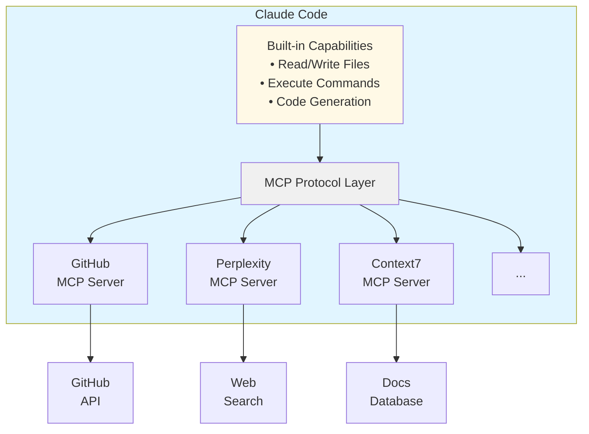
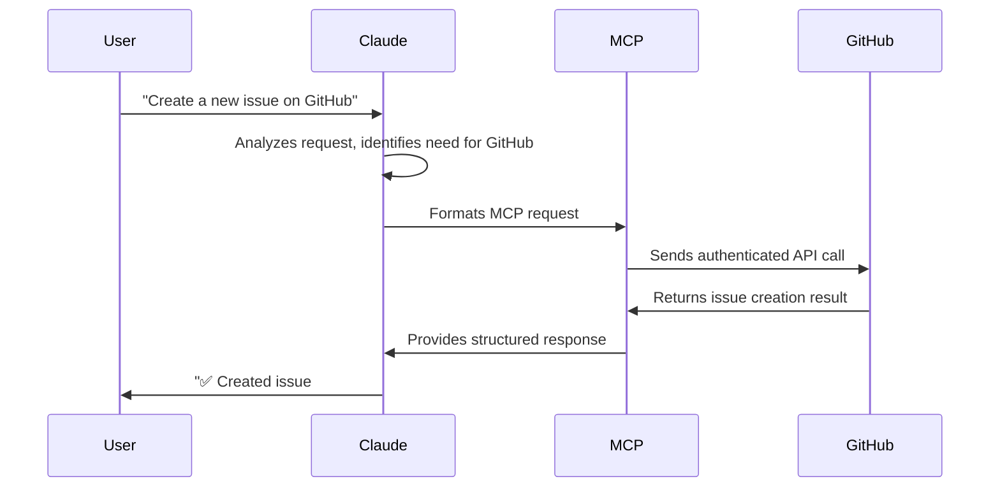

# MCP Servers: Extending Claude Code's Capabilities

⏱️ **Time**: 15 minutes
📊 **Level**: Beginner
**Prerequisites**: [Plugin Ecosystem Overview](../06-plugins/1-overview.md) (recommended)
🎯 **You'll Learn**: What MCP servers are, how they work, why they matter, and when to use them

> **📌 Plugin Type 1 of 4**: MCP Servers extend Claude Code's capabilities by connecting to external tools and APIs. See [Plugin Ecosystem Overview](../06-plugins/1-overview.md) to understand how MCP Servers fit with Skills, Hooks, and Slash Commands.

---

## What Are MCP Servers?

Think of Claude Code as a brilliant assistant who lives in your terminal. Right out of the box, Claude can read files, write code, and run commands. But what if you want Claude to interact with GitHub, query databases, or access external APIs? That's where MCP servers come in.

**MCP (Model Context Protocol)** is an open standard created by Anthropic that lets Claude Code connect to external tools and services. MCP servers are like power-ups—they extend Claude's capabilities beyond its built-in knowledge by providing real-time access to the outside world.

### The Simple Analogy

Imagine Claude Code is like a skilled craftsperson:
- **Built-in tools**: Hammer, screwdriver, saw (read files, write code, run bash)
- **MCP servers**: Power drill, laser level, pneumatic nailer (GitHub integration, database access, web search)

Just as power tools dramatically expand what a craftsperson can build, MCP servers dramatically expand what Claude Code can do.

### Visual Model



## Why Should You Care?

Let me show you three real scenarios where MCP servers transform your workflow:

### Scenario 1: GitHub Integration (No More Context Switching!)

**Without MCP**:
```bash
# You're working in Claude Code
> "Create a new feature branch"
Claude: "I can't access GitHub. Please run: git checkout -b feature-name"

# You switch to terminal
$ git checkout -b new-feature
$ git push -u origin new-feature

# Back to Claude Code
> "Now create a pull request"
Claude: "I can't create PRs. Please visit github.com..."

# You switch to browser, manually create PR...
```

**With GitHub MCP Server**:
```bash
> "Create a new feature branch called 'user-auth' and set up a PR"
Claude:
  ✅ Created branch 'user-auth'
  ✅ Pushed to origin
  ✅ Created PR #42: "Add user authentication"

  PR URL: https://github.com/you/repo/pull/42
```

**Time saved**: 5-10 minutes per PR creation
**Context switches**: Eliminated

### Scenario 2: Real-Time Research (Always Current Information)

**Without MCP**:
```bash
> "What's the latest best practice for React Server Components?"
Claude: "Based on my training data from early 2024..."
# Information might be outdated!
```

**With Perplexity MCP Server**:
```bash
> "What's the latest best practice for React Server Components?"
Claude:
  [Searches web via Perplexity]

  "According to the React docs updated last week and recent blog posts:
   1. Always use 'use server' directive...
   2. New async/await patterns introduced in React 19..."

  Sources: [Links to latest articles]
```

**Benefit**: Always current, sourced information
**Confidence**: Know your answers are up-to-date

### Scenario 3: Code Documentation (Instant Context)

**Without MCP**:
```bash
> "How does the authentication flow work in Next.js 14?"
Claude: "Let me search through your local files..."
# Might miss recent changes, external dependencies
```

**With Context7 MCP Server**:
```bash
> "How does the authentication flow work in Next.js 14?"
Claude:
  [Queries Context7 for latest Next.js docs]

  "In Next.js 14, the authentication flow uses:
   - Middleware for route protection
   - Server actions for login/logout
   - Cookies via next/headers

  Here's how your code should implement it..."

  [Shows current, accurate examples from official docs]
```

**Accuracy**: Always matches latest framework versions
**Productivity**: No manual doc searching

## Prerequisites

Before diving deeper, make sure you're comfortable with:
- ✅ [Basic Claude Code usage](../../INTRODUCTION.md) - You know how to interact with Claude
- ✅ Command-line basics - Comfortable running terminal commands

**Not sure?** Start with the [Introduction](../../INTRODUCTION.md) to get oriented.

---

## How MCP Works

Let's build up your understanding step by step.

### Step 1: The Protocol

MCP (Model Context Protocol) is a standardized way for AI assistants to communicate with external services. Think of it like HTTP for AI tools—just as websites use HTTP to communicate, Claude Code uses MCP to talk to external tools.

**Key Components**:
1. **Client**: Claude Code (initiates requests)
2. **Protocol**: MCP (standardized communication)
3. **Server**: External tool (GitHub, Perplexity, etc.)
4. **Data**: Structured information exchange

```
Claude Code  →  MCP Request   →  GitHub Server
             ←  MCP Response  ←
```

### Step 2: Server Types

MCP servers come in different flavors:

| Server Type | Purpose | Examples |
|-------------|---------|----------|
| **API Integrations** | Connect to web services | GitHub, GitLab, Jira |
| **Search Tools** | Query knowledge bases | Perplexity, Context7 |
| **Database Access** | Query/modify data | PostgreSQL, MongoDB connectors |
| **File Systems** | Access external files | Cloud storage (S3, Dropbox) |
| **Custom Tools** | Your specific needs | Internal APIs, proprietary systems |

### Step 3: How Requests Flow

Here's what happens when you ask Claude to use an MCP server:



**What's happening**:
1. You make a request naturally ("Create a GitHub issue")
2. Claude determines it needs the GitHub MCP server
3. MCP protocol handles authentication and communication
4. GitHub API performs the action
5. Results flow back through MCP to Claude
6. Claude presents the results to you clearly

### Step 4: Authentication & Security

MCP servers handle sensitive operations, so security matters:

**Authentication Methods**:
- **API Tokens**: Personal access tokens (GitHub, GitLab)
- **OAuth**: User authorization flows (Google, Microsoft)
- **Environment Variables**: Secure credential storage
- **Config Files**: Encrypted local configuration

**Security Best Practices**:
```bash
# ✅ Good: Store tokens in environment variables
export GITHUB_TOKEN="ghp_..."

# ❌ Bad: Hardcode tokens in config files
{
  "github_token": "ghp_..."  # Don't do this!
}
```

We'll cover secure configuration in the [Installation Guide](2-installation.md).

---

## Visual Comparison

Let's see the difference MCP servers make:

| Task | Without MCP | With MCP | Time Saved |
|------|-------------|----------|------------|
| Create GitHub PR | Manual: checkout, push, browser | `One Claude command` | ~5-10 min |
| Research latest docs | Search manually, verify date | `Auto-fetched, current` | ~10-15 min |
| Update Jira ticket | Switch to Jira, find ticket, update | `Claude updates directly` | ~3-5 min |
| Query database | Write SQL, run query, parse | `Ask in natural language` | ~5-10 min |
| Check CI/CD status | Open browser, navigate, check | `Ask Claude for status` | ~2-3 min |

**Daily Impact**: 30-60 minutes saved per developer
**Yearly Impact**: 125-250 hours saved per developer
**Context Switches**: Reduced by 70-80%

---

## Common Use Cases

### Development Workflow

**Git Operations**:
```bash
# Create feature branch, commit, push, PR - all in one
> "Implement the new login feature, commit it, and create a PR"
```

**Code Reviews**:
```bash
# Fetch PR, review code, leave comments
> "Review PR #42 and check for security issues"
```

**CI/CD**:
```bash
# Check build status, view logs, trigger deployments
> "Did the last deployment succeed? Show me any errors"
```

### Research & Documentation

**API Documentation**:
```bash
# Get latest API specs
> "Show me the current Stripe API for subscription management"
```

**Framework Updates**:
```bash
# Check for breaking changes
> "What changed in Next.js 14 vs 13 for data fetching?"
```

**Best Practices**:
```bash
# Current recommendations
> "What's the current best practice for React state management?"
```

### Data Access

**Database Queries**:
```bash
# Natural language to SQL
> "Show me users who signed up this week"
```

**Analytics**:
```bash
# Business metrics
> "What's our error rate in production today?"
```

**Logs & Monitoring**:
```bash
# Troubleshooting
> "Find errors in the last hour related to authentication"
```

---

## 🔍 Deep Dive: The MCP Architecture

*This section is for advanced users. Skip if you're just getting started!*

⏱️ **Time**: 10 minutes
📊 **Level**: Advanced

### Protocol Specification

MCP uses JSON-RPC 2.0 for communication:

```json
{
  "jsonrpc": "2.0",
  "method": "tools/call",
  "params": {
    "name": "create_issue",
    "arguments": {
      "repo": "owner/repo",
      "title": "Bug: Login fails",
      "body": "Description of the issue"
    }
  },
  "id": 1
}
```

**Response**:
```json
{
  "jsonrpc": "2.0",
  "result": {
    "issue_number": 123,
    "url": "https://github.com/owner/repo/issues/123"
  },
  "id": 1
}
```

### Server Implementation

MCP servers expose tools and resources:

**Tools**: Actions the server can perform
```json
{
  "tools": [
    {
      "name": "create_issue",
      "description": "Create a new GitHub issue",
      "inputSchema": {
        "type": "object",
        "properties": {
          "title": { "type": "string" },
          "body": { "type": "string" }
        }
      }
    }
  ]
}
```

**Resources**: Data the server can provide
```json
{
  "resources": [
    {
      "uri": "github://repo/owner/repo",
      "name": "Repository metadata",
      "mimeType": "application/json"
    }
  ]
}
```

### Claude's Tool Selection

When you make a request, Claude:
1. **Analyzes intent**: What are you trying to do?
2. **Evaluates available tools**: Which MCP servers can help?
3. **Selects optimal tool**: Best match for the task
4. **Constructs parameters**: Formats the request
5. **Interprets results**: Presents response clearly

This happens automatically—you just ask naturally!

---

## Popular MCP Servers

Here are the most commonly used MCP servers:

### Official Servers

**GitHub** ([Installation](installation.md#github))
- Create/manage issues and PRs
- Review code and leave comments
- Check CI/CD status
- Manage repositories

**Perplexity** ([Installation](installation.md#perplexity))
- Web search with citations
- Real-time information retrieval
- Research assistance
- Fact-checking with sources

**Context7** ([Installation](installation.md#context7))
- Up-to-date code documentation
- Framework-specific guidance
- API references
- Version-aware examples

### Community Servers

**Sequential Thinking**
- Break down complex tasks
- Multi-step problem solving
- Planning and architecture

**Database Connectors**
- PostgreSQL, MySQL, MongoDB
- Natural language queries
- Schema exploration

**Cloud Services**
- AWS, Google Cloud, Azure
- Resource management
- Deployment automation

**200+ More via Docker**
- Pre-built, containerized
- One-click installation
- Automatic updates

See the complete catalog in [Popular MCP Servers](3-popular-servers.md).

---

## When to Use MCP Servers

### ✅ Use MCP Servers When:

**You need real-time data**:
- Current documentation
- Live system status
- Recent changes/updates

**You're switching contexts frequently**:
- Between code and GitHub
- Between terminal and browser
- Between different tools

**You want natural interaction**:
- Ask in plain English
- No memorizing commands
- Fewer manual steps

**You're working with external systems**:
- APIs and databases
- Cloud services
- Third-party tools

### ⚠️ Consider Alternatives When:

**Built-in tools suffice**:
- Local file operations → Use Claude's native capabilities
- Simple bash commands → Use built-in command execution
- Code generation → Use Claude's native coding ability

**You need offline work**:
- MCP requires network connection
- Some servers have rate limits
- Consider caching strategies

**Security constraints**:
- Can't expose credentials
- Air-gapped environments
- Compliance requirements

---

## Next Steps

Great! Now you understand what MCP servers are and why they matter. You're ready to:

**→ [Install Your First MCP Server](2-installation.md)** - Hands-on setup guide
**→ [Explore Popular Servers](3-popular-servers.md)** - See what's available
**→ [Create Custom Servers](4-creating-custom-servers.md)** - Build your own (advanced)

---

## Quick Reference

**One-Sentence Summary**:
MCP servers extend Claude Code by connecting it to external tools and services through a standardized protocol.

**Key Benefits**:
- 🔌 Connect Claude to GitHub, databases, APIs
- ⏱️ Save 30-60 minutes daily
- 🔄 Eliminate context switching
- 📚 Access real-time information

**Common Servers**:
- GitHub (code hosting)
- Perplexity (web search)
- Context7 (documentation)
- 200+ via Docker

**Security**:
- Use environment variables for tokens
- Never hardcode credentials
- Review server permissions

---

## Check Your Understanding

Before moving on, can you answer these questions?

**Question 1**: What problem do MCP servers solve?

<details>
<summary>Answer</summary>
MCP servers solve the limitation of Claude Code being confined to local file operations and built-in capabilities. They extend Claude's reach to external services like GitHub, databases, and APIs, enabling real-time data access and eliminating context switching.
</details>

**Question 2**: How does MCP differ from just using APIs directly?

<details>
<summary>Answer</summary>
MCP provides a standardized protocol that Claude Code understands natively. Instead of you writing code to call APIs, you ask Claude in natural language and it handles the API interaction through MCP. It's the difference between "run this curl command" and "create a GitHub issue."
</details>

**Question 3**: Name three scenarios where MCP servers save significant time.

<details>
<summary>Answer</summary>
1. Creating GitHub PRs (saves ~5-10 min per PR)
2. Researching current documentation (saves ~10-15 min per search)
3. Querying databases in natural language (saves ~5-10 min per query)
</details>

---

## References & Further Reading

Want to dive deeper? Here are some excellent resources:

### 📚 Official Documentation
- [Model Context Protocol Specification](https://modelcontextprotocol.io) - Complete protocol reference
- [Claude Code MCP Guide](https://code.claude.com/docs/en/mcp) - Official Claude Code integration docs
- [Introducing MCP](https://anthropic.com/news/model-context-protocol) - Anthropic's announcement
- [Code Execution with MCP](https://www.anthropic.com/engineering/code-execution-with-mcp) - Architecture and optimization patterns
- [Introduction to MCP Course](https://anthropic.skilljar.com/introduction-to-model-context-protocol) - Official Anthropic course
- [Build an MCP Server Tutorial](https://modelcontextprotocol.io/docs/develop/build-server) - Step-by-step guide

### 🔗 Related Topics
- [Installing MCP Servers](2-installation.md) - Hands-on setup next
- [Agents Overview](../02-agents/1-overview.md) - How agents use MCP tools
- [Skills Overview](../03-skills/1-overview.md) - Skills that leverage MCP capabilities

### 💬 Community & Support
- [MCP GitHub Discussions](https://github.com/modelcontextprotocol/specification/discussions) - Ask questions
- [Claude Code Discord](https://discord.gg/anthropic) - Community help
- [Stack Overflow Tag: mcp](https://stackoverflow.com/questions/tagged/mcp) - Q&A

### 📖 Academic/Technical Papers (Advanced)
- [Model Context Protocol: Specification v1.0](https://modelcontextprotocol.io/spec) - Technical specification

---

**Ready to get hands-on?** Continue to [MCP Server Installation](2-installation.md) to set up your first server!
