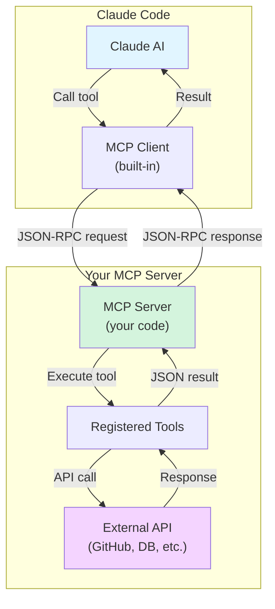

# Creating Custom MCP Servers

**Reading Time**: 60 minutes
**Skill Level**: Advanced
**Prerequisites**: [MCP Overview](1-overview.md), [Installation Guide](2-installation.md), TypeScript/JavaScript knowledge

---

## Welcome to MCP Server Development! 🛠️

You've learned what MCP servers are and how to use existing ones. Now it's time to **build your own MCP server** to connect Claude Code to any external service or API.

By the end of this guide, you'll be able to:
- Understand the MCP protocol architecture
- Create MCP servers in TypeScript/JavaScript
- Implement tools (functions) that Claude can call
- Add authentication and security
- Test and debug your MCP server
- Publish your server to npm or Docker Hub
- Share your server with the community

---

## MCP Architecture Overview

### How MCP Servers Work



### Key Concepts

1. **JSON-RPC Protocol**: MCP uses JSON-RPC 2.0 for communication
2. **Tools**: Functions that Claude can call (like `searchCode`, `createIssue`, etc.)
3. **Resources**: Data that Claude can access (like files, database records)
4. **Prompts**: Pre-defined prompts your server can provide
5. **Stdio Transport**: Communication over stdin/stdout

---

## Your First MCP Server: Step-by-Step

### Example: Simple Calculator MCP Server

Let's build a calculator MCP server that provides math tools to Claude.

#### Step 1: Project Setup

```bash
# Create project directory
mkdir mcp-calculator-server
cd mcp-calculator-server

# Initialize npm project
npm init -y

# Install MCP SDK
npm install @modelcontextprotocol/sdk

# Install TypeScript dependencies
npm install --save-dev typescript @types/node

# Initialize TypeScript
npx tsc --init
```

#### Step 2: Configure TypeScript

`tsconfig.json`:
```json
{
  "compilerOptions": {
    "target": "ES2022",
    "module": "NodeNext",
    "moduleResolution": "NodeNext",
    "lib": ["ES2022"],
    "outDir": "./dist",
    "rootDir": "./src",
    "strict": true,
    "esModuleInterop": true,
    "skipLibCheck": true,
    "forceConsistentCasingInFileNames": true
  },
  "include": ["src/**/*"],
  "exclude": ["node_modules"]
}
```

> 💡 `module: "NodeNext"` pairs with `"type": "module"` in `package.json` (Step 4). It's also what makes the `.js` extensions in the SDK's import paths — `@modelcontextprotocol/sdk/server/index.js` — resolve correctly. Those extensions are not a typo; they're required in ESM.

#### Step 3: Create Server Entry Point

`src/index.ts`:
```typescript
#!/usr/bin/env node

import { Server } from '@modelcontextprotocol/sdk/server/index.js';
import { StdioServerTransport } from '@modelcontextprotocol/sdk/server/stdio.js';
import {
  CallToolRequestSchema,
  ListToolsRequestSchema,
  Tool,
} from '@modelcontextprotocol/sdk/types.js';

// Create MCP server instance
const server = new Server(
  {
    name: 'calculator-server',
    version: '1.0.0',
  },
  {
    capabilities: {
      tools: {},
    },
  }
);

// Define available tools
const TOOLS: Tool[] = [
  {
    name: 'add',
    description: 'Add two numbers together',
    inputSchema: {
      type: 'object',
      properties: {
        a: {
          type: 'number',
          description: 'First number',
        },
        b: {
          type: 'number',
          description: 'Second number',
        },
      },
      required: ['a', 'b'],
    },
  },
  {
    name: 'multiply',
    description: 'Multiply two numbers',
    inputSchema: {
      type: 'object',
      properties: {
        a: {
          type: 'number',
          description: 'First number',
        },
        b: {
          type: 'number',
          description: 'Second number',
        },
      },
      required: ['a', 'b'],
    },
  },
];

// Handle tool list requests
server.setRequestHandler(ListToolsRequestSchema, async () => {
  return {
    tools: TOOLS,
  };
});

// Handle tool execution requests
server.setRequestHandler(CallToolRequestSchema, async (request) => {
  const { name, arguments: args } = request.params;

  switch (name) {
    case 'add': {
      const { a, b } = args as { a: number; b: number };
      const result = a + b;
      return {
        content: [
          {
            type: 'text',
            text: `${a} + ${b} = ${result}`,
          },
        ],
      };
    }

    case 'multiply': {
      const { a, b } = args as { a: number; b: number };
      const result = a * b;
      return {
        content: [
          {
            type: 'text',
            text: `${a} × ${b} = ${result}`,
          },
        ],
      };
    }

    default:
      throw new Error(`Unknown tool: ${name}`);
  }
});

// Start server
async function main() {
  const transport = new StdioServerTransport();
  await server.connect(transport);
  console.error('Calculator MCP server running on stdio');
}

main().catch((error) => {
  console.error('Fatal error:', error);
  process.exit(1);
});
```

#### Step 4: Add Package Scripts

`package.json`:
```json
{
  "name": "mcp-calculator-server",
  "version": "1.0.0",
  "description": "MCP server providing calculator tools",
  "main": "dist/index.js",
  "type": "module",
  "bin": {
    "mcp-calculator-server": "./dist/index.js"
  },
  "scripts": {
    "build": "tsc",
    "dev": "tsc && node dist/index.js",
    "prepare": "npm run build"
  },
  "keywords": ["mcp", "calculator", "claude-code"],
  "author": "Your Name",
  "license": "MIT",
  "dependencies": {
    "@modelcontextprotocol/sdk": "^1.30.0"
  },
  "devDependencies": {
    "@types/node": "^20.0.0",
    "typescript": "^5.0.0"
  }
}
```

#### Step 5: Build and Test

```bash
# Build TypeScript
npm run build

# Smoke test: this should start and hang, waiting for a client on stdin
node dist/index.js
```

> 🚨 **Don't try to test with `echo '{"jsonrpc":...}' | node dist/index.js`.** MCP requires an `initialize` handshake before any other request, so a bare `tools/list` piped in gets an error rather than your tool list. Use the [MCP Inspector](#manual-testing-with-mcp-inspector) or the SDK client instead.

#### Step 6: Configure in Claude Code

Create `.mcp.json` at your project root:
```json
{
  "mcpServers": {
    "calculator": {
      "type": "stdio",
      "command": "node",
      "args": ["/absolute/path/to/mcp-calculator-server/dist/index.js"]
    }
  }
}
```

Or let the CLI write it for you:

```bash
claude mcp add --scope project calculator -- node /absolute/path/to/dist/index.js
```

Restart your session. Because this is a project-scoped server, Claude Code prompts you to approve it the first time — that prompt is what stops a cloned repository from launching processes on your machine unasked.

#### Step 7: Use in Claude Code

```
You: What is 42 plus 37?
Claude: [Uses calculator MCP server's "add" tool]
        42 + 37 = 79

You: What is 12 times 15?
Claude: [Uses calculator MCP server's "multiply" tool]
        12 × 15 = 180
```

**Success!** You've created your first MCP server! 🎉

---

## Real-World Example: GitHub Issues MCP Server

### Complete Implementation

`src/github-issues-server.ts`:
```typescript
#!/usr/bin/env node

import { Server } from '@modelcontextprotocol/sdk/server/index.js';
import { StdioServerTransport } from '@modelcontextprotocol/sdk/server/stdio.js';
import {
  CallToolRequestSchema,
  ListToolsRequestSchema,
  Tool,
} from '@modelcontextprotocol/sdk/types.js';
import { Octokit } from '@octokit/rest';

// GitHub API client
let octokit: Octokit;

// Initialize with token from environment
function initializeOctokit() {
  const token = process.env.GITHUB_TOKEN;
  if (!token) {
    throw new Error('GITHUB_TOKEN environment variable is required');
  }
  octokit = new Octokit({ auth: token });
}

// Define tools
const TOOLS: Tool[] = [
  {
    name: 'list_issues',
    description: 'List issues in a GitHub repository',
    inputSchema: {
      type: 'object',
      properties: {
        owner: {
          type: 'string',
          description: 'Repository owner (username or organization)',
        },
        repo: {
          type: 'string',
          description: 'Repository name',
        },
        state: {
          type: 'string',
          description: 'Issue state (open, closed, all)',
          enum: ['open', 'closed', 'all'],
          default: 'open',
        },
        labels: {
          type: 'string',
          description: 'Comma-separated list of labels to filter by',
        },
      },
      required: ['owner', 'repo'],
    },
  },
  {
    name: 'create_issue',
    description: 'Create a new issue in a GitHub repository',
    inputSchema: {
      type: 'object',
      properties: {
        owner: {
          type: 'string',
          description: 'Repository owner',
        },
        repo: {
          type: 'string',
          description: 'Repository name',
        },
        title: {
          type: 'string',
          description: 'Issue title',
        },
        body: {
          type: 'string',
          description: 'Issue description/body',
        },
        labels: {
          type: 'array',
          items: { type: 'string' },
          description: 'Labels to apply',
        },
      },
      required: ['owner', 'repo', 'title'],
    },
  },
  {
    name: 'add_comment',
    description: 'Add a comment to an existing issue',
    inputSchema: {
      type: 'object',
      properties: {
        owner: {
          type: 'string',
          description: 'Repository owner',
        },
        repo: {
          type: 'string',
          description: 'Repository name',
        },
        issue_number: {
          type: 'number',
          description: 'Issue number',
        },
        body: {
          type: 'string',
          description: 'Comment text',
        },
      },
      required: ['owner', 'repo', 'issue_number', 'body'],
    },
  },
];

// Create server
const server = new Server(
  {
    name: 'github-issues-server',
    version: '1.0.0',
  },
  {
    capabilities: {
      tools: {},
    },
  }
);

// Handle tool list
server.setRequestHandler(ListToolsRequestSchema, async () => {
  return { tools: TOOLS };
});

// Handle tool calls
server.setRequestHandler(CallToolRequestSchema, async (request) => {
  const { name, arguments: args } = request.params;

  try {
    switch (name) {
      case 'list_issues': {
        const { owner, repo, state = 'open', labels } = args as any;

        const response = await octokit.issues.listForRepo({
          owner,
          repo,
          state: state as 'open' | 'closed' | 'all',
          labels: labels ? labels.split(',').map((l: string) => l.trim()) : undefined,
        });

        const issueList = response.data
          .map((issue) => `#${issue.number}: ${issue.title} (${issue.state})`)
          .join('\n');

        return {
          content: [
            {
              type: 'text',
              text: `Found ${response.data.length} issues:\n\n${issueList}`,
            },
          ],
        };
      }

      case 'create_issue': {
        const { owner, repo, title, body, labels } = args as any;

        const response = await octokit.issues.create({
          owner,
          repo,
          title,
          body,
          labels,
        });

        return {
          content: [
            {
              type: 'text',
              text: `Created issue #${response.data.number}: ${response.data.html_url}`,
            },
          ],
        };
      }

      case 'add_comment': {
        const { owner, repo, issue_number, body } = args as any;

        const response = await octokit.issues.createComment({
          owner,
          repo,
          issue_number,
          body,
        });

        return {
          content: [
            {
              type: 'text',
              text: `Added comment to issue #${issue_number}: ${response.data.html_url}`,
            },
          ],
        };
      }

      default:
        throw new Error(`Unknown tool: ${name}`);
    }
  } catch (error: any) {
    return {
      content: [
        {
          type: 'text',
          text: `Error: ${error.message}`,
        },
      ],
      isError: true,
    };
  }
});

// Main
async function main() {
  initializeOctokit();
  const transport = new StdioServerTransport();
  await server.connect(transport);
  console.error('GitHub Issues MCP server running');
}

main().catch((error) => {
  console.error('Fatal error:', error);
  process.exit(1);
});
```

### Configuration

`.mcp.json` (at your project root):
```json
{
  "mcpServers": {
    "github-issues": {
      "type": "stdio",
      "command": "node",
      "args": ["${CLAUDE_PROJECT_DIR:-.}/dist/github-issues-server.js"],
      "env": {
        "GITHUB_TOKEN": "${GITHUB_TOKEN}"
      }
    }
  }
}
```

> 🚨 **Never put the literal token here.** `.mcp.json` is checked into version control. `${GITHUB_TOKEN}` expands from each developer's own environment; `${VAR:-default}` gives a fallback. Claude Code expands these in `command`, `args`, `env`, `url`, and `headers`.
>
> `CLAUDE_PROJECT_DIR` is set in the *spawned server's* environment, not Claude Code's, so referencing it in `args` needs the `:-.` default shown above. Inside your server code, read it directly: `process.env.CLAUDE_PROJECT_DIR`.

### Usage

```
You: List open issues in anthropics/claude-code
Claude: [Calls list_issues tool]
        Found 42 issues:

        #123: Add dark mode support (open)
        #122: Fix bug in agent selection (open)
        #121: Improve documentation (open)
        ...

You: Create a new issue titled "Add keyboard shortcuts" with label "enhancement"
Claude: [Calls create_issue tool]
        Created issue #124: https://github.com/anthropics/claude-code/issues/124
```

---

## Advanced Features

### Feature 1: Resources (Read-Only Data)

Resources allow Claude to read data from your server without calling tools.

```typescript
import {
  ListResourcesRequestSchema,
  ReadResourceRequestSchema,
} from '@modelcontextprotocol/sdk/types.js';

// Declare resource support
const server = new Server(
  {
    name: 'my-server',
    version: '1.0.0',
  },
  {
    capabilities: {
      tools: {},
      resources: {},  // Add resources capability
    },
  }
);

// List available resources
server.setRequestHandler(ListResourcesRequestSchema, async () => {
  return {
    resources: [
      {
        uri: 'file:///config.json',
        name: 'Configuration',
        description: 'Server configuration',
        mimeType: 'application/json',
      },
      {
        uri: 'github://issues/recent',
        name: 'Recent Issues',
        description: 'Last 10 issues',
        mimeType: 'application/json',
      },
    ],
  };
});

// Read resource content
server.setRequestHandler(ReadResourceRequestSchema, async (request) => {
  const { uri } = request.params;

  if (uri === 'file:///config.json') {
    return {
      contents: [
        {
          uri,
          mimeType: 'application/json',
          text: JSON.stringify({ setting1: 'value1' }, null, 2),
        },
      ],
    };
  }

  if (uri === 'github://issues/recent') {
    const issues = await octokit.issues.listForRepo({
      owner: 'myorg',
      repo: 'myrepo',
      per_page: 10,
    });

    return {
      contents: [
        {
          uri,
          mimeType: 'application/json',
          text: JSON.stringify(issues.data, null, 2),
        },
      ],
    };
  }

  throw new Error(`Unknown resource: ${uri}`);
});
```

---

### Feature 2: Prompts (Pre-defined Templates)

Prompts provide pre-defined prompt templates to Claude.

```typescript
import {
  ListPromptsRequestSchema,
  GetPromptRequestSchema,
} from '@modelcontextprotocol/sdk/types.js';

// Declare prompt support
const server = new Server(
  {
    name: 'my-server',
    version: '1.0.0',
  },
  {
    capabilities: {
      tools: {},
      prompts: {},  // Add prompts capability
    },
  }
);

// List available prompts
server.setRequestHandler(ListPromptsRequestSchema, async () => {
  return {
    prompts: [
      {
        name: 'analyze-code',
        description: 'Analyze code for issues',
        arguments: [
          {
            name: 'file',
            description: 'File path to analyze',
            required: true,
          },
        ],
      },
    ],
  };
});

// Get prompt content
server.setRequestHandler(GetPromptRequestSchema, async (request) => {
  const { name, arguments: args } = request.params;

  if (name === 'analyze-code') {
    const { file } = args as { file: string };

    return {
      messages: [
        {
          role: 'user',
          content: {
            type: 'text',
            text: `Analyze the code in ${file} and provide:
1. Security vulnerabilities
2. Performance issues
3. Code quality suggestions
4. Best practice violations`,
          },
        },
      ],
    };
  }

  throw new Error(`Unknown prompt: ${name}`);
});
```

---

### Feature 3: Progress Notifications for Long Operations

A `tools/call` returns exactly once. There is no way to stream partial *results* back as multiple returns from a single call — a handler that tries to `return` and then keep yielding is unreachable code.

What you can do for a long operation is send **progress notifications** while the call is still running. The client passes a `progressToken` in the request's `_meta`, and your handler sends notifications referencing that token until it returns its single final result:

```typescript
server.setRequestHandler(CallToolRequestSchema, async (request, extra) => {
  const { name } = request.params;

  if (name === 'analyze_large_codebase') {
    const progressToken = request.params._meta?.progressToken;
    const files = await listFiles();

    for (const [i, file] of files.entries()) {
      await analyze(file);

      if (progressToken !== undefined) {
        await server.notification({
          method: 'notifications/progress',
          params: {
            progressToken,
            progress: i + 1,
            total: files.length,
          },
        });
      }
    }

    // One return, at the end
    return {
      content: [{ type: 'text', text: `Analyzed ${files.length} files.` }],
    };
  }

  throw new Error(`Unknown tool: ${name}`);
});
```

Two Claude Code behaviors make this worth doing:

- **Progress notifications reset the idle timeout.** A call that sends nothing at all for the idle window — 5 minutes for remote servers, 30 minutes for stdio — is aborted. Notifications keep it alive.
- **They do not extend the wall-clock limit.** The per-server `timeout` field, or `MCP_TOOL_TIMEOUT`, is a hard ceiling regardless of how much progress you report.

For genuinely large results, see [Handling large outputs](#handling-large-outputs) below rather than trying to stream them.

---

## Building for Claude Code Specifically

The MCP protocol is client-agnostic, but a few Claude Code behaviors materially change how you should design a server.

### Write Server Instructions

Because Claude Code defers tool definitions by default, Claude often decides whether to *look* at your server based on your server instructions alone. This makes the `instructions` field far more load-bearing than it used to be — it works much like a skill description.

```typescript
const server = new Server(
  {
    name: 'inventory-server',
    version: '1.0.0',
  },
  {
    capabilities: { tools: {} },
    instructions:
      'Tools for querying and updating the warehouse inventory database. ' +
      'Use these when the user asks about stock levels, SKUs, suppliers, ' +
      'or reorder thresholds. Read-only queries need no confirmation; ' +
      'stock adjustments write to production.',
  }
);
```

Explain **what category of tasks** your tools handle, **when Claude should search for them**, and **what your server can do**.

> ⚠️ Claude Code truncates tool descriptions and server instructions at **2KB each**. Keep them concise and put the critical details first.

### Handling Large Outputs

Claude Code warns when a tool's output exceeds 10,000 tokens and truncates at 25,000 by default. Results past a size threshold get persisted to disk and replaced with a file reference in the conversation.

If a tool legitimately returns something large — a full database schema, a complete file tree — annotate it in your `tools/list` entry:

```json
{
  "name": "get_schema",
  "description": "Returns the full database schema",
  "_meta": {
    "anthropic/maxResultSizeChars": 200000
  }
}
```

Claude Code raises that tool's threshold to the annotated value, up to a hard ceiling of 500,000 characters. This applies to text content and works independently of the user's `MAX_MCP_OUTPUT_TOKENS`. Tools returning image data are still bound by the token limit.

**Better still, paginate.** An annotation lets a large response through; it doesn't make it cheap.

### Requiring Explicit Approval

For a tool where the permission prompt *is* the point — a consent step, an access grant — mark it so it always prompts:

```json
{
  "name": "grant_access",
  "description": "Requests access to a protected resource",
  "_meta": {
    "anthropic/requiresUserInteraction": true
  }
}
```

Claude Code then prompts on every call, even in `acceptEdits`, `auto`, and `bypassPermissions` modes, offers no "don't ask again", and ignores matching allow rules. The value must be the JSON boolean `true`. Other tools from the same server keep normal permission behavior.

### Keeping a Tool Always Loaded

A tool Claude needs on essentially every turn can opt out of deferral:

```json
{
  "name": "get_current_context",
  "description": "Returns the active workspace and user",
  "_meta": {
    "anthropic/alwaysLoad": true
  }
}
```

Use this sparingly — every always-loaded tool spends context that would otherwise be available for the conversation.

### Resolving Project-Relative Paths

Claude Code sets `CLAUDE_PROJECT_DIR` in a stdio server's environment, pointing at the project root:

```typescript
const projectRoot = process.env.CLAUDE_PROJECT_DIR ?? process.cwd();
```

This is stable and doesn't change when working directories are added mid-session. If your server needs to *limit* its own filesystem access to allowed directories, implement the MCP `roots/list` request instead — Claude Code answers it with the session's launch directory plus every additional working directory the user has granted, and sends `notifications/roots/list_changed` when that set changes.

### Avoid Root-Level Schema Combinators

The Claude API does not accept `anyOf`, `oneOf`, or `allOf` at the **top level** of a tool's `inputSchema`. Combinators nested inside `properties` are fine and passed through unchanged.

```typescript
// ❌ Risky: union at the schema root
inputSchema: {
  oneOf: [
    { type: 'object', properties: { id: { type: 'string' } }, required: ['id'] },
    { type: 'object', properties: { slug: { type: 'string' } }, required: ['slug'] },
  ],
}

// ✅ Safe: one object, validated server-side
inputSchema: {
  type: 'object',
  properties: {
    id:   { type: 'string', description: 'Look up by ID. Provide this or slug.' },
    slug: { type: 'string', description: 'Look up by slug. Provide this or id.' },
  },
}
```

Recent Claude Code versions flatten a root-level combinator automatically and describe the parameter groupings in the tool description, but older versions and some deployments skip the tool entirely. Write the flat form yourself and validate the combination in your handler.

### Announcing Capability Changes

If your server's tool list changes at runtime, send a `list_changed` notification. Claude Code refreshes that server's tools, prompts, and resources without a reconnect.

---

## Let Claude Scaffold It For You

Anthropic publishes an official plugin that generates a server skeleton for you:

```text
/plugin install mcp-server-dev@claude-plugins-official
```

If Claude Code reports `Marketplace "claude-plugins-official" not found`, add it first with `/plugin marketplace add anthropics/claude-plugins-official`. Once installed, run `/reload-plugins`, then:

```text
/mcp-server-dev:build-mcp-server
```

Claude asks about your use case and scaffolds either a remote HTTP or a local stdio server. Useful as a starting point even if you rewrite most of it.

---

## Testing Your MCP Server

### Unit Tests

> 🚨 **You cannot unit-test a handler by calling `server.request(...)`.** On a `Server` instance, `request()` sends a request *out to the connected client* — it is not a way to feed a request in. There's no in-process "invoke my own handler" method.

The fix is a design choice, not a testing trick: **keep your tool logic in plain functions** and let the request handler be a thin dispatcher. Then the logic is trivially testable and the handler has almost nothing left to get wrong.

`src/tools.ts`:
```typescript
export type ToolResult = {
  content: Array<{ type: 'text'; text: string }>;
  isError?: boolean;
};

export function callTool(name: string, args: unknown): ToolResult {
  switch (name) {
    case 'add': {
      const { a, b } = args as { a: number; b: number };
      return { content: [{ type: 'text', text: `${a} + ${b} = ${a + b}` }] };
    }
    case 'multiply': {
      const { a, b } = args as { a: number; b: number };
      return { content: [{ type: 'text', text: `${a} × ${b} = ${a * b}` }] };
    }
    default:
      throw new Error(`Unknown tool: ${name}`);
  }
}
```

`src/index.ts` becomes a one-liner dispatcher:
```typescript
import { callTool } from './tools.js';

server.setRequestHandler(CallToolRequestSchema, async (request) =>
  callTool(request.params.name, request.params.arguments)
);
```

`src/__tests__/tools.test.ts`:
```typescript
import { describe, it, expect } from '@jest/globals';
import { callTool } from '../tools.js';

describe('Calculator tools', () => {
  it('adds two numbers', () => {
    expect(callTool('add', { a: 5, b: 3 }).content[0].text).toBe('5 + 3 = 8');
  });

  it('multiplies two numbers', () => {
    expect(callTool('multiply', { a: 4, b: 7 }).content[0].text).toBe('4 × 7 = 28');
  });

  it('rejects unknown tools', () => {
    expect(() => callTool('unknown-tool', {})).toThrow('Unknown tool');
  });
});
```

### Integration Tests

To exercise the real protocol, drive your server with the SDK's own client over an in-memory or stdio transport. Doing this by hand-writing JSON-RPC to a spawned process is a trap: **MCP requires an `initialize` handshake before any other request**, so a bare `tools/list` written straight to stdin gets an error, not a tool list. The client handles that for you.

`tests/integration.test.ts`:
```typescript
import { describe, it, expect } from '@jest/globals';
import { Client } from '@modelcontextprotocol/sdk/client/index.js';
import { StdioClientTransport } from '@modelcontextprotocol/sdk/client/stdio.js';

describe('MCP Protocol Integration', () => {
  it('lists and calls tools over stdio', async () => {
    const transport = new StdioClientTransport({
      command: 'node',
      args: ['dist/index.js'],
    });

    const client = new Client({ name: 'test-client', version: '1.0.0' });
    await client.connect(transport);   // performs the initialize handshake

    const { tools } = await client.listTools();
    expect(tools.map((t) => t.name)).toContain('add');

    const result = await client.callTool({
      name: 'add',
      arguments: { a: 5, b: 3 },
    });
    expect(result.content[0].text).toBe('5 + 3 = 8');

    await client.close();
  });
});
```

This is also the closest thing to a real Claude Code session you can get in CI: same handshake, same transport, same result shape.

### Manual Testing with MCP Inspector

```bash
# Run your server under the inspector (no global install needed)
npx @modelcontextprotocol/inspector node dist/index.js
```

The inspector prints the local URL to open in your browser. From there you can list tools, call them with arbitrary arguments, and inspect raw request/response JSON — which is the fastest way to find a schema mismatch.

### A Quick Smoke Test

To confirm the process starts at all, without the protocol:

```bash
node dist/index.js
```

A stdio MCP server communicates over stdin and stdout, so **a silent, blocked terminal means it's working** — it's waiting for a client. Anything printed to stdout that isn't JSON-RPC will corrupt the stream; use `console.error` for logging, never `console.log`.

---

## Security Best Practices

### 1. ✅ Authentication

> 🚨 **Claude Code does not pass an API key in `request.params._meta`.** A handler that reads `_meta.apiKey` and rejects the call when it's missing will reject *every* call. There is no client-supplied per-request credential in the MCP request shape.

Where authentication actually lives depends on your transport:

| Transport | Who authenticates | How your server gets the credential |
|-----------|-------------------|-------------------------------------|
| **stdio** | The user, at config time | Your process environment — the `env` field of the server entry, or `--env` on `claude mcp add`. The trust boundary is the machine: your server already runs as the user |
| **HTTP / SSE** | The user, per connection | The `Authorization` header, either from OAuth (Claude Code manages the token) or a static `--header`. Read it off the incoming HTTP request |

For a **stdio** server, authenticate to the *upstream service* and validate configuration at startup — not per request:

```typescript
function getUpstreamToken(): string {
  const token = process.env.GITHUB_TOKEN;
  if (!token) {
    // Fail loudly at startup, so the user sees it in `claude mcp get`
    throw new Error('GITHUB_TOKEN environment variable is required');
  }
  return token;
}

const octokit = new Octokit({ auth: getUpstreamToken() });
```

For an **HTTP** server, validate the bearer token in your HTTP layer, before the request ever reaches an MCP handler. Claude Code supports OAuth 2.0 with automatic discovery, so implementing the standard flow means users get browser sign-in and automatic token refresh for free.

If you need per-call human approval rather than per-call credentials — a consent step, an access grant — that's [`anthropic/requiresUserInteraction`](#requiring-explicit-approval), not an auth check.

### 2. ✅ Input Validation

```typescript
import { z } from 'zod';

// Define validation schema
const AddInputSchema = z.object({
  a: z.number().min(-1000000).max(1000000),
  b: z.number().min(-1000000).max(1000000),
});

// Validate inputs
server.setRequestHandler(CallToolRequestSchema, async (request) => {
  if (request.params.name === 'add') {
    // Validate
    const validated = AddInputSchema.parse(request.params.arguments);

    // Use validated data
    const result = validated.a + validated.b;
    // ...
  }
});
```

### 3. ✅ Rate Limiting

A stdio server has exactly one client — the Claude Code session that spawned it. So there's no `clientId` to key on, and no client-supplied identifier in the request. What you're really protecting is the **upstream API's** quota, so limit per process:

```typescript
// Simple in-memory rate limiter for this server process
class RateLimiter {
  private timestamps: number[] = [];

  check(maxRequests: number, windowMs: number): boolean {
    const now = Date.now();
    this.timestamps = this.timestamps.filter((t) => now - t < windowMs);

    if (this.timestamps.length >= maxRequests) {
      return false; // Rate limit exceeded
    }

    this.timestamps.push(now);
    return true;
  }
}

const limiter = new RateLimiter();

// In handler
server.setRequestHandler(CallToolRequestSchema, async (request) => {
  if (!limiter.check(100, 60_000)) {
    return {
      content: [{ type: 'text', text: 'Rate limit reached: 100 calls/minute. Try again shortly.' }],
      isError: true,
    };
  }

  // Process request...
});
```

> 💡 Return `isError: true` rather than throwing. Claude sees the message and can back off or explain the wait; an uncaught throw is far less legible.

For a **remote HTTP** server serving many users, key the limiter on the authenticated identity from the `Authorization` header — the thing you actually authenticated — not on anything in the MCP payload.

### 4. ✅ Error Handling

```typescript
server.setRequestHandler(CallToolRequestSchema, async (request) => {
  try {
    // Process request
    const result = await processRequest(request);
    return { content: [{ type: 'text', text: result }] };
  } catch (error: any) {
    // Log error (but don't expose internal details)
    console.error('Tool execution error:', error);

    // Return safe error message
    return {
      content: [
        {
          type: 'text',
          text: 'An error occurred while processing your request.',
        },
      ],
      isError: true,
    };
  }
});
```

---

## Publishing Your MCP Server

### Option 1: Publish to npm

```bash
# 1. Prepare package.json
{
  "name": "@yourname/mcp-calculator",
  "version": "1.0.0",
  "description": "Calculator MCP server for Claude Code",
  "main": "dist/index.js",
  "bin": {
    "mcp-calculator": "./dist/index.js"
  },
  "files": ["dist", "README.md", "LICENSE"],
  "keywords": ["mcp", "claude-code", "calculator"],
  "repository": {
    "type": "git",
    "url": "https://github.com/yourname/mcp-calculator"
  }
}

# 2. Create README
echo "# MCP Calculator Server" > README.md

# 3. Build
npm run build

# 4. Test installation locally
npm pack
npm install -g ./yourname-mcp-calculator-1.0.0.tgz

# 5. Publish to npm
npm login
npm publish --access public
```

**Users install with:**
```bash
npm install -g @yourname/mcp-calculator
```

---

### Option 2: Publish to Docker Hub

`Dockerfile`:
```dockerfile
FROM node:20-alpine

WORKDIR /app

# Copy package files
COPY package*.json ./

# Install dependencies
RUN npm ci --only=production

# Copy built code
COPY dist ./dist

# Run server
CMD ["node", "dist/index.js"]
```

```bash
# Build image
docker build -t yourname/mcp-calculator:1.0.0 .

# Test locally
docker run -i yourname/mcp-calculator:1.0.0

# Push to Docker Hub
docker login
docker push yourname/mcp-calculator:1.0.0
```

**Users install with:**
```json
{
  "mcpServers": {
    "calculator": {
      "command": "docker",
      "args": ["run", "-i", "yourname/mcp-calculator:1.0.0"]
    }
  }
}
```

---

### Option 3: GitHub Repository

```bash
# 1. Create repository on GitHub
# 2. Push code
git init
git add .
git commit -m "Initial commit"
git remote add origin https://github.com/yourname/mcp-calculator
git push -u origin main

# 3. Create release
git tag v1.0.0
git push --tags
```

**Users install with:**
```bash
git clone https://github.com/yourname/mcp-calculator
cd mcp-calculator
npm install
npm run build
```

Then reference in `.mcp.json` at your project root:
```json
{
  "mcpServers": {
    "calculator": {
      "command": "node",
      "args": ["/path/to/mcp-calculator/dist/index.js"]
    }
  }
}
```

---

## Complete Examples

### Example 1: Database Query MCP Server

```typescript
#!/usr/bin/env node

import { Server } from '@modelcontextprotocol/sdk/server/index.js';
import { StdioServerTransport } from '@modelcontextprotocol/sdk/server/stdio.js';
import { CallToolRequestSchema, ListToolsRequestSchema } from '@modelcontextprotocol/sdk/types.js';
import { Pool } from 'pg';

// PostgreSQL connection
const pool = new Pool({
  host: process.env.DB_HOST,
  port: parseInt(process.env.DB_PORT || '5432'),
  database: process.env.DB_NAME,
  user: process.env.DB_USER,
  password: process.env.DB_PASSWORD,
});

const TOOLS = [
  {
    name: 'query_database',
    description: 'Execute read-only SQL query',
    inputSchema: {
      type: 'object',
      properties: {
        query: {
          type: 'string',
          description: 'SQL SELECT query',
        },
      },
      required: ['query'],
    },
  },
];

const server = new Server(
  { name: 'database-server', version: '1.0.0' },
  { capabilities: { tools: {} } }
);

server.setRequestHandler(ListToolsRequestSchema, async () => ({
  tools: TOOLS,
}));

server.setRequestHandler(CallToolRequestSchema, async (request) => {
  const { name, arguments: args } = request.params;

  if (name === 'query_database') {
    const { query } = args as { query: string };

    // Security: Only allow SELECT queries
    if (!query.trim().toLowerCase().startsWith('select')) {
      throw new Error('Only SELECT queries are allowed');
    }

    try {
      const result = await pool.query(query);

      return {
        content: [
          {
            type: 'text',
            text: JSON.stringify(result.rows, null, 2),
          },
        ],
      };
    } catch (error: any) {
      return {
        content: [
          {
            type: 'text',
            text: `Database error: ${error.message}`,
          },
        ],
        isError: true,
      };
    }
  }

  throw new Error(`Unknown tool: ${name}`);
});

async function main() {
  const transport = new StdioServerTransport();
  await server.connect(transport);
  console.error('Database MCP server running');
}

main().catch((error) => {
  console.error('Fatal error:', error);
  process.exit(1);
});
```

---

### Example 2: Slack Integration MCP Server

```typescript
#!/usr/bin/env node

import { Server } from '@modelcontextprotocol/sdk/server/index.js';
import { StdioServerTransport } from '@modelcontextprotocol/sdk/server/stdio.js';
import { CallToolRequestSchema, ListToolsRequestSchema } from '@modelcontextprotocol/sdk/types.js';
import { WebClient } from '@slack/web-api';

const slack = new WebClient(process.env.SLACK_TOKEN);

const TOOLS = [
  {
    name: 'send_message',
    description: 'Send a message to a Slack channel',
    inputSchema: {
      type: 'object',
      properties: {
        channel: { type: 'string', description: 'Channel ID or name' },
        text: { type: 'string', description: 'Message text' },
      },
      required: ['channel', 'text'],
    },
  },
  {
    name: 'list_channels',
    description: 'List all Slack channels',
    inputSchema: {
      type: 'object',
      properties: {},
    },
  },
];

const server = new Server(
  { name: 'slack-server', version: '1.0.0' },
  { capabilities: { tools: {} } }
);

server.setRequestHandler(ListToolsRequestSchema, async () => ({
  tools: TOOLS,
}));

server.setRequestHandler(CallToolRequestSchema, async (request) => {
  const { name, arguments: args } = request.params;

  switch (name) {
    case 'send_message': {
      const { channel, text } = args as { channel: string; text: string };

      const result = await slack.chat.postMessage({
        channel,
        text,
      });

      return {
        content: [
          {
            type: 'text',
            text: `Message sent to ${channel}: ${result.ts}`,
          },
        ],
      };
    }

    case 'list_channels': {
      const result = await slack.conversations.list();

      const channels = result.channels
        ?.map((c) => `#${c.name} (${c.id})`)
        .join('\n');

      return {
        content: [
          {
            type: 'text',
            text: `Channels:\n${channels}`,
          },
        ],
      };
    }

    default:
      throw new Error(`Unknown tool: ${name}`);
  }
});

async function main() {
  const transport = new StdioServerTransport();
  await server.connect(transport);
  console.error('Slack MCP server running');
}

main().catch(console.error);
```

---

## Troubleshooting

### Problem: Server won't start

```bash
# Check if executable
chmod +x dist/index.js

# Check shebang
head -n1 dist/index.js
# Should show: #!/usr/bin/env node

# Test directly
node dist/index.js

# Check logs
console.error('Server starting...');
```

---

### Problem: Tools not appearing in Claude Code

Work through these in order — each rules out a different layer:

```bash
# 1. Does the server report its tools at all?
npx @modelcontextprotocol/inspector node dist/index.js
#    An empty tool list here means the bug is in your server, not the config.

# 2. Is Claude Code even reading your config?
cat .mcp.json          # must be at the PROJECT ROOT, not .claude/mcp.json
claude mcp list        # does the server appear, and with what status?
claude mcp get <name>  # what command/scope did Claude Code actually record?

# 3. Did you restart? .mcp.json is read at session start.
```

Then, inside a session:

```text
/mcp
```

Select the server to see its tool list. Claude Code flags a server that advertises the tools capability but exposes none. An empty list with a healthy connection almost always means a missing required environment variable.

> 💡 **"No tools in context" is not the same as "no tools available."** With tool search on by default, MCP tool *definitions* are deferred — Claude loads them on demand. If `/mcp` shows a non-zero tool count, the server is fine even though the schemas aren't sitting in your context window.

---

### Problem: Authentication errors

```bash
# Verify environment variables
env | grep TOKEN

# Check token validity
curl -H "Authorization: Bearer $GITHUB_TOKEN" https://api.github.com/user

# Add logging
console.error('Using token:', process.env.GITHUB_TOKEN?.substring(0, 4) + '...');
```

---

## Next Steps

Congratulations! You now know how to create custom MCP servers.

**Next Guide**: [MCP Best Practices](5-best-practices.md) (20 min)
Learn security, performance, and error handling best practices.

**Also Explore**:
- [Model Context Protocol Specification](https://modelcontextprotocol.io)
- [MCP TypeScript SDK](https://github.com/modelcontextprotocol/typescript-sdk)
- [Official MCP Servers Examples](https://github.com/modelcontextprotocol/servers)

---

## Quick Reference

### Minimal MCP Server Template

```typescript
#!/usr/bin/env node
import { Server } from '@modelcontextprotocol/sdk/server/index.js';
import { StdioServerTransport } from '@modelcontextprotocol/sdk/server/stdio.js';
import { CallToolRequestSchema, ListToolsRequestSchema } from '@modelcontextprotocol/sdk/types.js';

const server = new Server(
  { name: 'my-server', version: '1.0.0' },
  { capabilities: { tools: {} } }
);

server.setRequestHandler(ListToolsRequestSchema, async () => ({
  tools: [
    {
      name: 'my_tool',
      description: 'My tool description',
      inputSchema: {
        type: 'object',
        properties: {
          param: { type: 'string', description: 'Parameter' },
        },
        required: ['param'],
      },
    },
  ],
}));

server.setRequestHandler(CallToolRequestSchema, async (request) => {
  const { name, arguments: args } = request.params;

  if (name === 'my_tool') {
    const { param } = args as { param: string };

    return {
      content: [
        {
          type: 'text',
          text: `Result: ${param}`,
        },
      ],
    };
  }

  throw new Error(`Unknown tool: ${name}`);
});

async function main() {
  const transport = new StdioServerTransport();
  await server.connect(transport);
}

main().catch(console.error);
```

---

## References and Further Reading

### Official Resources
- [Model Context Protocol Specification](https://modelcontextprotocol.io)
- [MCP TypeScript SDK Repository](https://github.com/modelcontextprotocol/typescript-sdk)
- [Official MCP Servers](https://github.com/modelcontextprotocol/servers)

### TypeScript Resources
- [TypeScript Handbook](https://www.typescriptlang.org/docs/handbook/intro.html)
- [Node.js Documentation](https://nodejs.org/docs/)

### JSON-RPC
- [JSON-RPC 2.0 Specification](https://www.jsonrpc.org/specification)

### Community
- [MCP TypeScript SDK issues and discussions](https://github.com/modelcontextprotocol/typescript-sdk)
- [Reference server implementations](https://github.com/modelcontextprotocol/servers)

---

**Questions or Feedback?**
Found a mistake? Have a suggestion? [Open an issue](https://github.com/anthropics/claude-code/issues) or contribute to this documentation!
