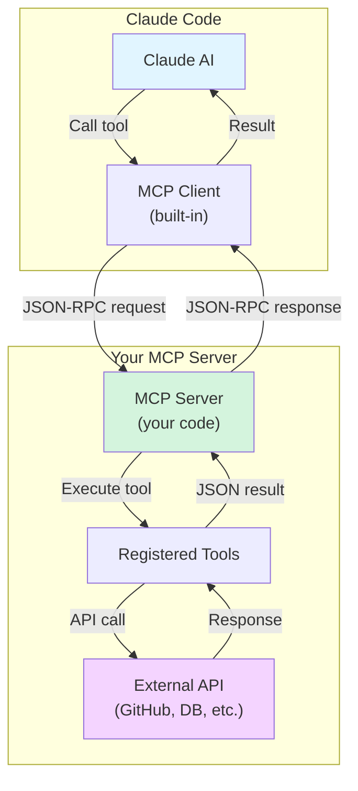

# Creating Custom MCP Servers

**Reading Time**: 60 minutes
**Skill Level**: Advanced
**Prerequisites**: [MCP Overview](1-overview.md), [Installation Guide](2-installation.md), TypeScript/JavaScript knowledge

---

## Welcome to MCP Server Development! 🛠️

You've learned what MCP servers are and how to use existing ones. Now it's time to **build your own MCP server** to connect Claude Code to any external service or API.

By the end of this guide, you'll be able to:
- Understand the MCP protocol architecture
- Create MCP servers in TypeScript/JavaScript
- Implement tools (functions) that Claude can call
- Add authentication and security
- Test and debug your MCP server
- Publish your server to npm or Docker Hub
- Share your server with the community

---

## MCP Architecture Overview

### How MCP Servers Work



### Key Concepts

1. **JSON-RPC Protocol**: MCP uses JSON-RPC 2.0 for communication
2. **Tools**: Functions that Claude can call (like `searchCode`, `createIssue`, etc.)
3. **Resources**: Data that Claude can access (like files, database records)
4. **Prompts**: Pre-defined prompts your server can provide
5. **Stdio Transport**: Communication over stdin/stdout

---

## Your First MCP Server: Step-by-Step

### Example: Simple Calculator MCP Server

Let's build a calculator MCP server that provides math tools to Claude.

#### Step 1: Project Setup

```bash
# Create project directory
mkdir mcp-calculator-server
cd mcp-calculator-server

# Initialize npm project
npm init -y

# Install MCP SDK
npm install @modelcontextprotocol/sdk

# Install TypeScript dependencies
npm install --save-dev typescript @types/node

# Initialize TypeScript
npx tsc --init
```

#### Step 2: Configure TypeScript

`tsconfig.json`:
```json
{
  "compilerOptions": {
    "target": "ES2020",
    "module": "commonjs",
    "lib": ["ES2020"],
    "outDir": "./dist",
    "rootDir": "./src",
    "strict": true,
    "esModuleInterop": true,
    "skipLibCheck": true,
    "forceConsistentCasingInFileNames": true
  },
  "include": ["src/**/*"],
  "exclude": ["node_modules"]
}
```

#### Step 3: Create Server Entry Point

`src/index.ts`:
```typescript
#!/usr/bin/env node

import { Server } from '@modelcontextprotocol/sdk/server/index.js';
import { StdioServerTransport } from '@modelcontextprotocol/sdk/server/stdio.js';
import {
  CallToolRequestSchema,
  ListToolsRequestSchema,
  Tool,
} from '@modelcontextprotocol/sdk/types.js';

// Create MCP server instance
const server = new Server(
  {
    name: 'calculator-server',
    version: '1.0.0',
  },
  {
    capabilities: {
      tools: {},
    },
  }
);

// Define available tools
const TOOLS: Tool[] = [
  {
    name: 'add',
    description: 'Add two numbers together',
    inputSchema: {
      type: 'object',
      properties: {
        a: {
          type: 'number',
          description: 'First number',
        },
        b: {
          type: 'number',
          description: 'Second number',
        },
      },
      required: ['a', 'b'],
    },
  },
  {
    name: 'multiply',
    description: 'Multiply two numbers',
    inputSchema: {
      type: 'object',
      properties: {
        a: {
          type: 'number',
          description: 'First number',
        },
        b: {
          type: 'number',
          description: 'Second number',
        },
      },
      required: ['a', 'b'],
    },
  },
];

// Handle tool list requests
server.setRequestHandler(ListToolsRequestSchema, async () => {
  return {
    tools: TOOLS,
  };
});

// Handle tool execution requests
server.setRequestHandler(CallToolRequestSchema, async (request) => {
  const { name, arguments: args } = request.params;

  switch (name) {
    case 'add': {
      const { a, b } = args as { a: number; b: number };
      const result = a + b;
      return {
        content: [
          {
            type: 'text',
            text: `${a} + ${b} = ${result}`,
          },
        ],
      };
    }

    case 'multiply': {
      const { a, b } = args as { a: number; b: number };
      const result = a * b;
      return {
        content: [
          {
            type: 'text',
            text: `${a} × ${b} = ${result}`,
          },
        ],
      };
    }

    default:
      throw new Error(`Unknown tool: ${name}`);
  }
});

// Start server
async function main() {
  const transport = new StdioServerTransport();
  await server.connect(transport);
  console.error('Calculator MCP server running on stdio');
}

main().catch((error) => {
  console.error('Fatal error:', error);
  process.exit(1);
});
```

#### Step 4: Add Package Scripts

`package.json`:
```json
{
  "name": "mcp-calculator-server",
  "version": "1.0.0",
  "description": "MCP server providing calculator tools",
  "main": "dist/index.js",
  "type": "module",
  "bin": {
    "mcp-calculator-server": "./dist/index.js"
  },
  "scripts": {
    "build": "tsc",
    "dev": "tsc && node dist/index.js",
    "prepare": "npm run build"
  },
  "keywords": ["mcp", "calculator", "claude-code"],
  "author": "Your Name",
  "license": "MIT",
  "dependencies": {
    "@modelcontextprotocol/sdk": "^0.5.0"
  },
  "devDependencies": {
    "@types/node": "^20.0.0",
    "typescript": "^5.0.0"
  }
}
```

#### Step 5: Build and Test

```bash
# Build TypeScript
npm run build

# Test locally
npm run dev

# In another terminal, send test request
echo '{"jsonrpc":"2.0","id":1,"method":"tools/list"}' | node dist/index.js
```

#### Step 6: Configure in Claude Code

`.claude/mcp.json`:
```json
{
  "mcpServers": {
    "calculator": {
      "command": "node",
      "args": ["/absolute/path/to/mcp-calculator-server/dist/index.js"]
    }
  }
}
```

#### Step 7: Use in Claude Code

```
You: What is 42 plus 37?
Claude: [Uses calculator MCP server's "add" tool]
        42 + 37 = 79

You: What is 12 times 15?
Claude: [Uses calculator MCP server's "multiply" tool]
        12 × 15 = 180
```

**Success!** You've created your first MCP server! 🎉

---

## Real-World Example: GitHub Issues MCP Server

### Complete Implementation

`src/github-issues-server.ts`:
```typescript
#!/usr/bin/env node

import { Server } from '@modelcontextprotocol/sdk/server/index.js';
import { StdioServerTransport } from '@modelcontextprotocol/sdk/server/stdio.js';
import {
  CallToolRequestSchema,
  ListToolsRequestSchema,
  Tool,
} from '@modelcontextprotocol/sdk/types.js';
import { Octokit } from '@octokit/rest';

// GitHub API client
let octokit: Octokit;

// Initialize with token from environment
function initializeOctokit() {
  const token = process.env.GITHUB_TOKEN;
  if (!token) {
    throw new Error('GITHUB_TOKEN environment variable is required');
  }
  octokit = new Octokit({ auth: token });
}

// Define tools
const TOOLS: Tool[] = [
  {
    name: 'list_issues',
    description: 'List issues in a GitHub repository',
    inputSchema: {
      type: 'object',
      properties: {
        owner: {
          type: 'string',
          description: 'Repository owner (username or organization)',
        },
        repo: {
          type: 'string',
          description: 'Repository name',
        },
        state: {
          type: 'string',
          description: 'Issue state (open, closed, all)',
          enum: ['open', 'closed', 'all'],
          default: 'open',
        },
        labels: {
          type: 'string',
          description: 'Comma-separated list of labels to filter by',
        },
      },
      required: ['owner', 'repo'],
    },
  },
  {
    name: 'create_issue',
    description: 'Create a new issue in a GitHub repository',
    inputSchema: {
      type: 'object',
      properties: {
        owner: {
          type: 'string',
          description: 'Repository owner',
        },
        repo: {
          type: 'string',
          description: 'Repository name',
        },
        title: {
          type: 'string',
          description: 'Issue title',
        },
        body: {
          type: 'string',
          description: 'Issue description/body',
        },
        labels: {
          type: 'array',
          items: { type: 'string' },
          description: 'Labels to apply',
        },
      },
      required: ['owner', 'repo', 'title'],
    },
  },
  {
    name: 'add_comment',
    description: 'Add a comment to an existing issue',
    inputSchema: {
      type: 'object',
      properties: {
        owner: {
          type: 'string',
          description: 'Repository owner',
        },
        repo: {
          type: 'string',
          description: 'Repository name',
        },
        issue_number: {
          type: 'number',
          description: 'Issue number',
        },
        body: {
          type: 'string',
          description: 'Comment text',
        },
      },
      required: ['owner', 'repo', 'issue_number', 'body'],
    },
  },
];

// Create server
const server = new Server(
  {
    name: 'github-issues-server',
    version: '1.0.0',
  },
  {
    capabilities: {
      tools: {},
    },
  }
);

// Handle tool list
server.setRequestHandler(ListToolsRequestSchema, async () => {
  return { tools: TOOLS };
});

// Handle tool calls
server.setRequestHandler(CallToolRequestSchema, async (request) => {
  const { name, arguments: args } = request.params;

  try {
    switch (name) {
      case 'list_issues': {
        const { owner, repo, state = 'open', labels } = args as any;

        const response = await octokit.issues.listForRepo({
          owner,
          repo,
          state: state as 'open' | 'closed' | 'all',
          labels: labels ? labels.split(',').map((l: string) => l.trim()) : undefined,
        });

        const issueList = response.data
          .map((issue) => `#${issue.number}: ${issue.title} (${issue.state})`)
          .join('\n');

        return {
          content: [
            {
              type: 'text',
              text: `Found ${response.data.length} issues:\n\n${issueList}`,
            },
          ],
        };
      }

      case 'create_issue': {
        const { owner, repo, title, body, labels } = args as any;

        const response = await octokit.issues.create({
          owner,
          repo,
          title,
          body,
          labels,
        });

        return {
          content: [
            {
              type: 'text',
              text: `Created issue #${response.data.number}: ${response.data.html_url}`,
            },
          ],
        };
      }

      case 'add_comment': {
        const { owner, repo, issue_number, body } = args as any;

        const response = await octokit.issues.createComment({
          owner,
          repo,
          issue_number,
          body,
        });

        return {
          content: [
            {
              type: 'text',
              text: `Added comment to issue #${issue_number}: ${response.data.html_url}`,
            },
          ],
        };
      }

      default:
        throw new Error(`Unknown tool: ${name}`);
    }
  } catch (error: any) {
    return {
      content: [
        {
          type: 'text',
          text: `Error: ${error.message}`,
        },
      ],
      isError: true,
    };
  }
});

// Main
async function main() {
  initializeOctokit();
  const transport = new StdioServerTransport();
  await server.connect(transport);
  console.error('GitHub Issues MCP server running');
}

main().catch((error) => {
  console.error('Fatal error:', error);
  process.exit(1);
});
```

### Configuration

`.claude/mcp.json`:
```json
{
  "mcpServers": {
    "github-issues": {
      "command": "node",
      "args": ["./dist/github-issues-server.js"],
      "env": {
        "GITHUB_TOKEN": "your-github-token-here"
      }
    }
  }
}
```

### Usage

```
You: List open issues in anthropics/claude-code
Claude: [Calls list_issues tool]
        Found 42 issues:

        #123: Add dark mode support (open)
        #122: Fix bug in agent selection (open)
        #121: Improve documentation (open)
        ...

You: Create a new issue titled "Add keyboard shortcuts" with label "enhancement"
Claude: [Calls create_issue tool]
        Created issue #124: https://github.com/anthropics/claude-code/issues/124
```

---

## Advanced Features

### Feature 1: Resources (Read-Only Data)

Resources allow Claude to read data from your server without calling tools.

```typescript
import {
  ListResourcesRequestSchema,
  ReadResourceRequestSchema,
} from '@modelcontextprotocol/sdk/types.js';

// Declare resource support
const server = new Server(
  {
    name: 'my-server',
    version: '1.0.0',
  },
  {
    capabilities: {
      tools: {},
      resources: {},  // Add resources capability
    },
  }
);

// List available resources
server.setRequestHandler(ListResourcesRequestSchema, async () => {
  return {
    resources: [
      {
        uri: 'file:///config.json',
        name: 'Configuration',
        description: 'Server configuration',
        mimeType: 'application/json',
      },
      {
        uri: 'github://issues/recent',
        name: 'Recent Issues',
        description: 'Last 10 issues',
        mimeType: 'application/json',
      },
    ],
  };
});

// Read resource content
server.setRequestHandler(ReadResourceRequestSchema, async (request) => {
  const { uri } = request.params;

  if (uri === 'file:///config.json') {
    return {
      contents: [
        {
          uri,
          mimeType: 'application/json',
          text: JSON.stringify({ setting1: 'value1' }, null, 2),
        },
      ],
    };
  }

  if (uri === 'github://issues/recent') {
    const issues = await octokit.issues.listForRepo({
      owner: 'myorg',
      repo: 'myrepo',
      per_page: 10,
    });

    return {
      contents: [
        {
          uri,
          mimeType: 'application/json',
          text: JSON.stringify(issues.data, null, 2),
        },
      ],
    };
  }

  throw new Error(`Unknown resource: ${uri}`);
});
```

---

### Feature 2: Prompts (Pre-defined Templates)

Prompts provide pre-defined prompt templates to Claude.

```typescript
import {
  ListPromptsRequestSchema,
  GetPromptRequestSchema,
} from '@modelcontextprotocol/sdk/types.js';

// Declare prompt support
const server = new Server(
  {
    name: 'my-server',
    version: '1.0.0',
  },
  {
    capabilities: {
      tools: {},
      prompts: {},  // Add prompts capability
    },
  }
);

// List available prompts
server.setRequestHandler(ListPromptsRequestSchema, async () => {
  return {
    prompts: [
      {
        name: 'analyze-code',
        description: 'Analyze code for issues',
        arguments: [
          {
            name: 'file',
            description: 'File path to analyze',
            required: true,
          },
        ],
      },
    ],
  };
});

// Get prompt content
server.setRequestHandler(GetPromptRequestSchema, async (request) => {
  const { name, arguments: args } = request.params;

  if (name === 'analyze-code') {
    const { file } = args as { file: string };

    return {
      messages: [
        {
          role: 'user',
          content: {
            type: 'text',
            text: `Analyze the code in ${file} and provide:
1. Security vulnerabilities
2. Performance issues
3. Code quality suggestions
4. Best practice violations`,
          },
        },
      ],
    };
  }

  throw new Error(`Unknown prompt: ${name}`);
});
```

---

### Feature 3: Streaming Responses

For long-running operations, stream results back to Claude:

```typescript
server.setRequestHandler(CallToolRequestSchema, async (request) => {
  const { name, arguments: args } = request.params;

  if (name === 'analyze-large-codebase') {
    // Return initial response
    return {
      content: [
        {
          type: 'text',
          text: 'Starting codebase analysis...',
        },
      ],
      // Indicate more data is coming
      _meta: {
        progressToken: 'analysis-123',
      },
    };

    // Continue sending progress updates
    // (Implementation depends on MCP SDK version)
  }
});
```

---

## Testing Your MCP Server

### Unit Tests

`src/__tests__/server.test.ts`:
```typescript
import { describe, it, expect, beforeEach } from '@jest/globals';
import { Server } from '@modelcontextprotocol/sdk/server/index.js';

describe('Calculator MCP Server', () => {
  let server: Server;

  beforeEach(() => {
    // Initialize server
    server = new Server(
      { name: 'calculator-server', version: '1.0.0' },
      { capabilities: { tools: {} } }
    );
  });

  it('should add two numbers correctly', async () => {
    const request = {
      method: 'tools/call',
      params: {
        name: 'add',
        arguments: { a: 5, b: 3 },
      },
    };

    const response = await server.request(request);

    expect(response.content[0].text).toBe('5 + 3 = 8');
  });

  it('should multiply two numbers correctly', async () => {
    const request = {
      method: 'tools/call',
      params: {
        name: 'multiply',
        arguments: { a: 4, b: 7 },
      },
    };

    const response = await server.request(request);

    expect(response.content[0].text).toBe('4 × 7 = 28');
  });

  it('should handle unknown tools', async () => {
    const request = {
      method: 'tools/call',
      params: {
        name: 'unknown-tool',
        arguments: {},
      },
    };

    await expect(server.request(request)).rejects.toThrow('Unknown tool');
  });
});
```

### Integration Tests

`tests/integration.test.ts`:
```typescript
import { spawn } from 'child_process';
import { describe, it, expect } from '@jest/globals';

describe('MCP Server Integration', () => {
  it('should respond to tools/list request', (done) => {
    const server = spawn('node', ['dist/index.js']);

    const request = JSON.stringify({
      jsonrpc: '2.0',
      id: 1,
      method: 'tools/list',
    });

    server.stdin.write(request + '\n');

    server.stdout.on('data', (data) => {
      const response = JSON.parse(data.toString());
      expect(response.result.tools).toHaveLength(2);
      expect(response.result.tools[0].name).toBe('add');
      server.kill();
      done();
    });
  });
});
```

### Manual Testing with MCP Inspector

```bash
# Install MCP Inspector
npm install -g @modelcontextprotocol/inspector

# Run your server with inspector
npx @modelcontextprotocol/inspector node dist/index.js

# Open browser to http://localhost:5173
# Test tools interactively
```

---

## Security Best Practices

### 1. ✅ Authentication

```typescript
// Require API key
function validateApiKey(key: string): boolean {
  const validKey = process.env.API_KEY;
  if (!validKey) {
    throw new Error('API_KEY not configured');
  }
  return key === validKey;
}

// In tool handler
server.setRequestHandler(CallToolRequestSchema, async (request) => {
  // Check for API key in metadata
  const apiKey = request.params._meta?.apiKey;
  if (!validateApiKey(apiKey)) {
    throw new Error('Invalid API key');
  }

  // Process request...
});
```

### 2. ✅ Input Validation

```typescript
import { z } from 'zod';

// Define validation schema
const AddInputSchema = z.object({
  a: z.number().min(-1000000).max(1000000),
  b: z.number().min(-1000000).max(1000000),
});

// Validate inputs
server.setRequestHandler(CallToolRequestSchema, async (request) => {
  if (request.params.name === 'add') {
    // Validate
    const validated = AddInputSchema.parse(request.params.arguments);

    // Use validated data
    const result = validated.a + validated.b;
    // ...
  }
});
```

### 3. ✅ Rate Limiting

```typescript
import rateLimit from 'express-rate-limit';

// Simple in-memory rate limiter
class RateLimiter {
  private requests = new Map<string, number[]>();

  check(clientId: string, maxRequests: number, windowMs: number): boolean {
    const now = Date.now();
    const requests = this.requests.get(clientId) || [];

    // Remove old requests
    const recentRequests = requests.filter((time) => now - time < windowMs);

    if (recentRequests.length >= maxRequests) {
      return false; // Rate limit exceeded
    }

    recentRequests.push(now);
    this.requests.set(clientId, recentRequests);
    return true;
  }
}

const limiter = new RateLimiter();

// In handler
server.setRequestHandler(CallToolRequestSchema, async (request) => {
  const clientId = request.params._meta?.clientId || 'default';

  if (!limiter.check(clientId, 100, 60000)) {
    throw new Error('Rate limit exceeded (100 requests per minute)');
  }

  // Process request...
});
```

### 4. ✅ Error Handling

```typescript
server.setRequestHandler(CallToolRequestSchema, async (request) => {
  try {
    // Process request
    const result = await processRequest(request);
    return { content: [{ type: 'text', text: result }] };
  } catch (error: any) {
    // Log error (but don't expose internal details)
    console.error('Tool execution error:', error);

    // Return safe error message
    return {
      content: [
        {
          type: 'text',
          text: 'An error occurred while processing your request.',
        },
      ],
      isError: true,
    };
  }
});
```

---

## Publishing Your MCP Server

### Option 1: Publish to npm

```bash
# 1. Prepare package.json
{
  "name": "@yourname/mcp-calculator",
  "version": "1.0.0",
  "description": "Calculator MCP server for Claude Code",
  "main": "dist/index.js",
  "bin": {
    "mcp-calculator": "./dist/index.js"
  },
  "files": ["dist", "README.md", "LICENSE"],
  "keywords": ["mcp", "claude-code", "calculator"],
  "repository": {
    "type": "git",
    "url": "https://github.com/yourname/mcp-calculator"
  }
}

# 2. Create README
echo "# MCP Calculator Server" > README.md

# 3. Build
npm run build

# 4. Test installation locally
npm pack
npm install -g ./yourname-mcp-calculator-1.0.0.tgz

# 5. Publish to npm
npm login
npm publish --access public
```

**Users install with:**
```bash
npm install -g @yourname/mcp-calculator
```

---

### Option 2: Publish to Docker Hub

`Dockerfile`:
```dockerfile
FROM node:20-alpine

WORKDIR /app

# Copy package files
COPY package*.json ./

# Install dependencies
RUN npm ci --only=production

# Copy built code
COPY dist ./dist

# Run server
CMD ["node", "dist/index.js"]
```

```bash
# Build image
docker build -t yourname/mcp-calculator:1.0.0 .

# Test locally
docker run -i yourname/mcp-calculator:1.0.0

# Push to Docker Hub
docker login
docker push yourname/mcp-calculator:1.0.0
```

**Users install with:**
```json
{
  "mcpServers": {
    "calculator": {
      "command": "docker",
      "args": ["run", "-i", "yourname/mcp-calculator:1.0.0"]
    }
  }
}
```

---

### Option 3: GitHub Repository

```bash
# 1. Create repository on GitHub
# 2. Push code
git init
git add .
git commit -m "Initial commit"
git remote add origin https://github.com/yourname/mcp-calculator
git push -u origin main

# 3. Create release
git tag v1.0.0
git push --tags
```

**Users install with:**
```bash
git clone https://github.com/yourname/mcp-calculator
cd mcp-calculator
npm install
npm run build
```

Then reference in `.claude/mcp.json`:
```json
{
  "mcpServers": {
    "calculator": {
      "command": "node",
      "args": ["/path/to/mcp-calculator/dist/index.js"]
    }
  }
}
```

---

## Complete Examples

### Example 1: Database Query MCP Server

```typescript
#!/usr/bin/env node

import { Server } from '@modelcontextprotocol/sdk/server/index.js';
import { StdioServerTransport } from '@modelcontextprotocol/sdk/server/stdio.js';
import { CallToolRequestSchema, ListToolsRequestSchema } from '@modelcontextprotocol/sdk/types.js';
import { Pool } from 'pg';

// PostgreSQL connection
const pool = new Pool({
  host: process.env.DB_HOST,
  port: parseInt(process.env.DB_PORT || '5432'),
  database: process.env.DB_NAME,
  user: process.env.DB_USER,
  password: process.env.DB_PASSWORD,
});

const TOOLS = [
  {
    name: 'query_database',
    description: 'Execute read-only SQL query',
    inputSchema: {
      type: 'object',
      properties: {
        query: {
          type: 'string',
          description: 'SQL SELECT query',
        },
      },
      required: ['query'],
    },
  },
];

const server = new Server(
  { name: 'database-server', version: '1.0.0' },
  { capabilities: { tools: {} } }
);

server.setRequestHandler(ListToolsRequestSchema, async () => ({
  tools: TOOLS,
}));

server.setRequestHandler(CallToolRequestSchema, async (request) => {
  const { name, arguments: args } = request.params;

  if (name === 'query_database') {
    const { query } = args as { query: string };

    // Security: Only allow SELECT queries
    if (!query.trim().toLowerCase().startsWith('select')) {
      throw new Error('Only SELECT queries are allowed');
    }

    try {
      const result = await pool.query(query);

      return {
        content: [
          {
            type: 'text',
            text: JSON.stringify(result.rows, null, 2),
          },
        ],
      };
    } catch (error: any) {
      return {
        content: [
          {
            type: 'text',
            text: `Database error: ${error.message}`,
          },
        ],
        isError: true,
      };
    }
  }

  throw new Error(`Unknown tool: ${name}`);
});

async function main() {
  const transport = new StdioServerTransport();
  await server.connect(transport);
  console.error('Database MCP server running');
}

main().catch((error) => {
  console.error('Fatal error:', error);
  process.exit(1);
});
```

---

### Example 2: Slack Integration MCP Server

```typescript
#!/usr/bin/env node

import { Server } from '@modelcontextprotocol/sdk/server/index.js';
import { StdioServerTransport } from '@modelcontextprotocol/sdk/server/stdio.js';
import { CallToolRequestSchema, ListToolsRequestSchema } from '@modelcontextprotocol/sdk/types.js';
import { WebClient } from '@slack/web-api';

const slack = new WebClient(process.env.SLACK_TOKEN);

const TOOLS = [
  {
    name: 'send_message',
    description: 'Send a message to a Slack channel',
    inputSchema: {
      type: 'object',
      properties: {
        channel: { type: 'string', description: 'Channel ID or name' },
        text: { type: 'string', description: 'Message text' },
      },
      required: ['channel', 'text'],
    },
  },
  {
    name: 'list_channels',
    description: 'List all Slack channels',
    inputSchema: {
      type: 'object',
      properties: {},
    },
  },
];

const server = new Server(
  { name: 'slack-server', version: '1.0.0' },
  { capabilities: { tools: {} } }
);

server.setRequestHandler(ListToolsRequestSchema, async () => ({
  tools: TOOLS,
}));

server.setRequestHandler(CallToolRequestSchema, async (request) => {
  const { name, arguments: args } = request.params;

  switch (name) {
    case 'send_message': {
      const { channel, text } = args as { channel: string; text: string };

      const result = await slack.chat.postMessage({
        channel,
        text,
      });

      return {
        content: [
          {
            type: 'text',
            text: `Message sent to ${channel}: ${result.ts}`,
          },
        ],
      };
    }

    case 'list_channels': {
      const result = await slack.conversations.list();

      const channels = result.channels
        ?.map((c) => `#${c.name} (${c.id})`)
        .join('\n');

      return {
        content: [
          {
            type: 'text',
            text: `Channels:\n${channels}`,
          },
        ],
      };
    }

    default:
      throw new Error(`Unknown tool: ${name}`);
  }
});

async function main() {
  const transport = new StdioServerTransport();
  await server.connect(transport);
  console.error('Slack MCP server running');
}

main().catch(console.error);
```

---

## Troubleshooting

### Problem: Server won't start

```bash
# Check if executable
chmod +x dist/index.js

# Check shebang
head -n1 dist/index.js
# Should show: #!/usr/bin/env node

# Test directly
node dist/index.js

# Check logs
console.error('Server starting...');
```

---

### Problem: Tools not appearing in Claude Code

```bash
# Verify tools/list response
echo '{"jsonrpc":"2.0","id":1,"method":"tools/list"}' | node dist/index.js

# Check .claude/mcp.json configuration
cat .claude/mcp.json

# Restart Claude Code
# (Configuration changes require restart)
```

---

### Problem: Authentication errors

```bash
# Verify environment variables
env | grep TOKEN

# Check token validity
curl -H "Authorization: Bearer $GITHUB_TOKEN" https://api.github.com/user

# Add logging
console.error('Using token:', process.env.GITHUB_TOKEN?.substring(0, 4) + '...');
```

---

## Next Steps

Congratulations! You now know how to create custom MCP servers.

**Next Guide**: [MCP Best Practices](5-best-practices.md) (20 min)
Learn security, performance, and error handling best practices.

**Also Explore**:
- [Model Context Protocol Specification](https://modelcontextprotocol.io)
- [MCP SDK Documentation](https://github.com/modelcontextprotocol/sdk)
- [Official MCP Servers Examples](https://github.com/modelcontextprotocol/servers)

---

## Quick Reference

### Minimal MCP Server Template

```typescript
#!/usr/bin/env node
import { Server } from '@modelcontextprotocol/sdk/server/index.js';
import { StdioServerTransport } from '@modelcontextprotocol/sdk/server/stdio.js';
import { CallToolRequestSchema, ListToolsRequestSchema } from '@modelcontextprotocol/sdk/types.js';

const server = new Server(
  { name: 'my-server', version: '1.0.0' },
  { capabilities: { tools: {} } }
);

server.setRequestHandler(ListToolsRequestSchema, async () => ({
  tools: [
    {
      name: 'my_tool',
      description: 'My tool description',
      inputSchema: {
        type: 'object',
        properties: {
          param: { type: 'string', description: 'Parameter' },
        },
        required: ['param'],
      },
    },
  ],
}));

server.setRequestHandler(CallToolRequestSchema, async (request) => {
  const { name, arguments: args } = request.params;

  if (name === 'my_tool') {
    const { param } = args as { param: string };

    return {
      content: [
        {
          type: 'text',
          text: `Result: ${param}`,
        },
      ],
    };
  }

  throw new Error(`Unknown tool: ${name}`);
});

async function main() {
  const transport = new StdioServerTransport();
  await server.connect(transport);
}

main().catch(console.error);
```

---

## References and Further Reading

### Official Resources
- [Model Context Protocol Specification](https://modelcontextprotocol.io)
- [MCP SDK Repository](https://github.com/modelcontextprotocol/sdk)
- [Official MCP Servers](https://github.com/modelcontextprotocol/servers)

### TypeScript Resources
- [TypeScript Handbook](https://www.typescriptlang.org/docs/handbook/intro.html)
- [Node.js Documentation](https://nodejs.org/docs/)

### JSON-RPC
- [JSON-RPC 2.0 Specification](https://www.jsonrpc.org/specification)

### Community
- [MCP Community Forum](https://community.anthropic.com/mcp)
- [GitHub Discussions](https://github.com/modelcontextprotocol/sdk/discussions)

---

**Questions or Feedback?**
Found a mistake? Have a suggestion? [Open an issue](https://github.com/anthropics/claude-code/issues) or contribute to this documentation!
