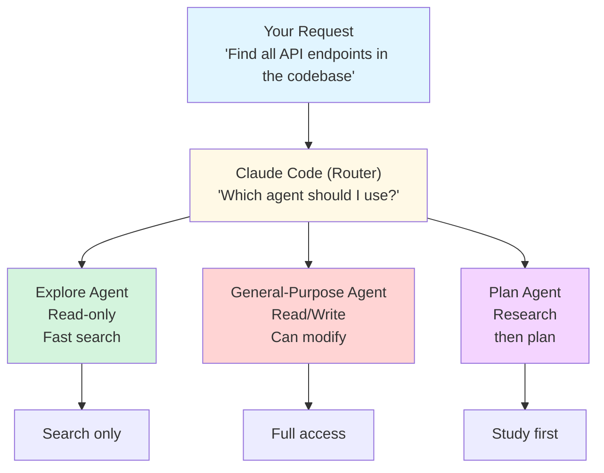
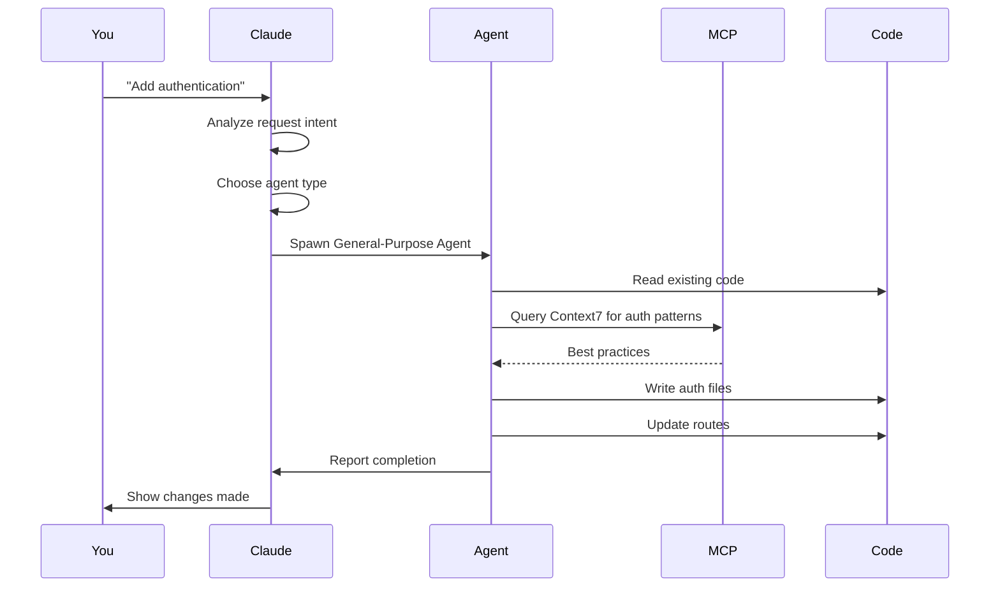

# Agents: Specialized AI Assistants in Claude Code

⏱️ **Time**: 20 minutes
📊 **Level**: Beginner to Intermediate
🎯 **You'll Learn**: What agents are, the three agent types, when to use each one, and how they leverage MCP tools to accomplish tasks

---

## What Are Agents?

Remember how we learned about [MCP servers](../01-mcp-servers/1-overview.md)? They give Claude Code access to external tools—GitHub, databases, web search, and more. Now here's where it gets interesting: **agents are specialized AI assistants that know how to use those tools effectively**.

Think of it this way:

```
MCP Servers = Power tools (drill, saw, sander)
Agents = Skilled craftspeople who know which tool to use when
```

### The Simple Analogy

Imagine you're renovating your house and you hire three specialists:

1. **The Inspector** (Explore Agent)
   - Walks through your house taking notes
   - Never moves furniture or makes changes
   - Reports back what they found
   - Fast, careful, non-intrusive

2. **The General Contractor** (General-Purpose Agent)
   - Can do everything: inspect, plan, build, modify
   - Uses power tools when needed
   - Makes changes and fixes problems
   - Your go-to for most work

3. **The Architect** (Plan Agent)
   - Studies your house first before proposing changes
   - Researches best practices and building codes
   - Creates detailed blueprints
   - Doesn't touch anything until you approve the plan

**Claude Code works the same way.** When you ask Claude to do something, it automatically picks the right "specialist" (agent) for the job.

### Visual Model



---

## The Three Agent Types

Let's explore each agent type in detail.

### 1. Explore Agent (The Inspector)

**Purpose**: Fast, read-only search and exploration of your codebase.

**Capabilities**:
- ✅ Search files by pattern (glob)
- ✅ Search code by content (grep)
- ✅ Read files
- ✅ Navigate directory structure
- ✅ Answer questions about code

**Restrictions**:
- ❌ Cannot write files
- ❌ Cannot modify code
- ❌ Cannot run commands
- ❌ Cannot use MCP tools that make changes

**When Claude uses it**:
- You ask "Where is...?" or "Show me..."
- You request read-only information
- You want fast searches without changes
- You're exploring unfamiliar code

**Example requests**:
```bash
> "Where are the API endpoints defined?"
> "Show me all React components that use useState"
> "Find files related to authentication"
> "What does the PaymentProcessor class do?"
> "List all database models"
```

---

### 2. General-Purpose Agent (The Contractor)

**Purpose**: Full-featured agent that can read, write, and execute.

**Capabilities**:
- ✅ Everything Explore can do
- ✅ Write and edit files
- ✅ Execute bash commands
- ✅ Use all MCP tools (GitHub, databases, etc.)
- ✅ Make code changes
- ✅ Run tests and builds
- ✅ Commit to git

**Restrictions**:
- None—has full access to all tools

**When Claude uses it**:
- You ask to implement a feature
- You request code modifications
- You need to run commands or tests
- You want to use MCP tools (create PR, etc.)

**Example requests**:
```bash
> "Implement user authentication"
> "Fix the bug in checkout.js"
> "Add error handling to the API endpoints"
> "Run the tests and fix any failures"
> "Create a new React component for the dashboard"
> "Refactor the database queries to use async/await"
```

---

### 3. Plan Agent (The Architect)

**Purpose**: Research and plan before implementation.

**Capabilities**:
- ✅ Everything Explore can do
- ✅ Use MCP tools for research (Perplexity, Context7)
- ✅ Multi-step reasoning (Sequential Thinking)
- ✅ Create implementation plans
- ✅ Analyze trade-offs

**Restrictions**:
- ❌ Cannot write files (until you approve the plan)
- ❌ Cannot execute commands
- ❌ Read-only until planning is complete

**When Claude uses it**:
- You ask "How should I...?" or "Plan..."
- The task is complex or has multiple approaches
- You want to review before implementation
- You need architectural guidance

**Example requests**:
```bash
> "Plan how to add real-time notifications"
> "How should I refactor the authentication system?"
> "Design a caching strategy for the API"
> "What's the best way to handle file uploads?"
> "Plan the migration from REST to GraphQL"
```

**Two-phase workflow**:
1. **Planning phase**: Plan agent researches and creates a detailed plan
2. **Implementation phase**: You review, approve, then General-Purpose agent executes

---

## Quick Comparison

| Feature | Explore | General-Purpose | Plan |
|---------|---------|-----------------|------|
| **Search code** | ✅ Fast | ✅ Yes | ✅ Yes |
| **Read files** | ✅ Yes | ✅ Yes | ✅ Yes |
| **Write files** | ❌ No | ✅ Yes | ❌ Not during planning |
| **Run commands** | ❌ No | ✅ Yes | ❌ Not during planning |
| **Use MCP tools** | ❌ Read-only | ✅ All tools | ✅ Research tools only |
| **Speed** | ⚡ Fastest | 🏃 Fast | 🚶 Slower (thorough) |
| **Cost** | 💰 Cheapest | 💰💰 Medium | 💰💰 Medium |
| **Best for** | Quick searches | Implementation | Complex planning |

---

## Real-World Scenarios

Let's see how Claude chooses agents automatically based on your requests.

### Scenario 1: Finding Code

**Your request**:
```bash
> "Where is the user authentication logic?"
```

**What happens**:
```
Claude thinks: "This is a read-only search query"
→ Uses Explore Agent

Explore Agent:
1. Searches for files matching *auth*
2. Greps for "authentication" in code
3. Reads relevant files
4. Returns summary

Response time: ~5 seconds
```

**Claude's response**:
```
Found user authentication in 3 locations:

1. src/auth/authentication.ts:23-89
   - Main authentication logic
   - JWT token generation
   - Password hashing

2. src/middleware/auth.ts:12-34
   - Authentication middleware
   - Token verification
   - Route protection

3. src/routes/auth.ts:45-120
   - Auth routes (login, logout, register)
   - Calls authentication.ts functions
```

**Why Explore**: Read-only query, no modifications needed, fast results.

---

### Scenario 2: Implementing a Feature

**Your request**:
```bash
> "Add rate limiting to our API endpoints"
```

**What happens**:
```
Claude thinks: "This requires writing code and possibly running tests"
→ Uses General-Purpose Agent

General-Purpose Agent:
1. Searches for existing middleware
2. Reads API endpoint files
3. Writes rate limiting middleware
4. Updates endpoint files
5. Writes tests
6. Runs tests to verify

Response time: ~45 seconds
```

**Claude's response**:
```
✅ Added rate limiting to API endpoints

Changes made:
1. Created src/middleware/rateLimiter.ts
   - 100 requests per 15 minutes per IP
   - Configurable limits
   - Redis-backed for distributed systems

2. Updated src/app.ts
   - Applied rate limiter to all /api/* routes

3. Added tests in tests/rateLimiter.test.ts
   - ✅ All 12 tests passing

4. Updated .env.example
   - Added RATE_LIMIT_MAX and RATE_LIMIT_WINDOW

Would you like me to adjust the rate limits or add IP whitelisting?
```

**Why General-Purpose**: Needs to write files, modify code, and run tests.

---

### Scenario 3: Planning Architecture

**Your request**:
```bash
> "Plan how to add WebSocket support for real-time updates"
```

**What happens**:
```
Claude thinks: "Complex architectural decision, multiple approaches possible"
→ Uses Plan Agent

Plan Agent:
1. Explores current codebase architecture
2. Researches WebSocket best practices (via Perplexity)
3. Analyzes framework compatibility (via Context7)
4. Considers trade-offs
5. Creates detailed implementation plan

Response time: ~90 seconds
```

**Claude's response**:
```
📋 Implementation Plan: WebSocket Real-Time Updates

## Current Architecture Analysis
- Express.js server on port 3000
- PostgreSQL database with event triggers
- React frontend with REST API calls

## Proposed Approach: Socket.io with Redis Adapter

### Why Socket.io?
✅ Built on WebSocket with fallbacks
✅ Room/namespace support
✅ Easy authentication integration
✅ Redis adapter for horizontal scaling

### Implementation Steps

**Phase 1: Backend Setup** (2-3 hours)
1. Install socket.io and socket.io-redis
2. Create src/websocket/server.ts
   - Initialize Socket.io
   - Configure Redis adapter
   - Set up authentication middleware
3. Create src/websocket/events.ts
   - Define event types
   - Room management logic

**Phase 2: Database Integration** (1-2 hours)
4. Add PostgreSQL triggers
   - Emit notifications on data changes
5. Create notification queue
   - Debounce rapid updates
   - Batch related changes

**Phase 3: Frontend Integration** (2-3 hours)
6. Install socket.io-client
7. Create useWebSocket hook
8. Update components to listen for events

**Phase 4: Testing & Deployment** (1-2 hours)
9. Write integration tests
10. Load testing with 1000+ connections
11. Update Docker/deployment configs

### Alternative Approaches Considered

**Server-Sent Events (SSE)**
✅ Simpler (one-way communication)
❌ Limited browser support
❌ No binary data support

**Raw WebSocket**
✅ Lower overhead
❌ More complex to implement
❌ No fallback mechanisms

### Trade-offs
- **Cost**: Redis required (~$10/month for managed)
- **Complexity**: +15-20% more code
- **Performance**: Scales to 10k+ concurrent connections

Ready to proceed? I can start with Phase 1 or adjust the plan based on your feedback.
```

**Why Plan**: Complex architecture requiring research, trade-off analysis, and user approval.

---

## How Claude Chooses the Right Agent

Claude uses natural language understanding to pick the agent automatically:

### Trigger Words for Explore Agent

**"Where/Show/Find/List/Search"**:
- "Where is the auth logic?"
- "Show me all React components"
- "Find files using Redux"
- "List database models"
- "Search for TODO comments"

**"Explain/What does/How does"**:
- "Explain how authentication works"
- "What does this function do?"
- "How does the caching layer work?"

### Trigger Words for General-Purpose Agent

**"Implement/Add/Create/Build"**:
- "Implement user registration"
- "Add error handling"
- "Create a new component"
- "Build a REST API endpoint"

**"Fix/Update/Modify/Refactor"**:
- "Fix the bug in checkout"
- "Update the database schema"
- "Modify the authentication flow"
- "Refactor this to use async/await"

**"Run/Test/Deploy"**:
- "Run the tests"
- "Test the payment integration"
- "Deploy to staging"

### Trigger Words for Plan Agent

**"Plan/Design/How should I"**:
- "Plan the migration to TypeScript"
- "Design a caching strategy"
- "How should I implement real-time updates?"

**"What's the best way"**:
- "What's the best way to handle file uploads?"
- "What's the best way to structure this API?"

---

## Agent Lifecycle

Here's what happens when you make a request:



**Key points**:
1. Claude analyzes your request
2. Picks the appropriate agent
3. Agent uses tools (MCP, file operations)
4. Agent completes task or returns results
5. Claude presents results to you

---

## Benefits of the Agent System

### 1. Speed Optimization

**Explore is 3-5x faster** than General-Purpose for searches:

```bash
# Explore Agent: ~5 seconds
> "Find all API endpoints"

# General-Purpose would be slower because:
# - Loads more tools
# - Has write capabilities (overhead)
# - More safety checks
```

### 2. Safety

**Explore can't accidentally modify code**:

```bash
# Safe: Explore agent searching
> "Show me the payment processing code"
# ✅ Cannot write files
# ✅ Cannot run commands
# ✅ Read-only access

# Potentially risky: General-Purpose agent
> "Show me the payment processing code"
# ⚠️ Could theoretically modify files
# ⚠️ Could run commands
```

### 3. Cost Efficiency

**Different agents use different amounts of tokens**:

| Task | Explore | General-Purpose | Savings |
|------|---------|-----------------|---------|
| "Find auth code" | 2,000 tokens | 5,000 tokens | 60% |
| "Implement feature" | N/A | 15,000 tokens | - |
| "Plan architecture" | N/A | 20,000 tokens (Plan) | Prevents wasted implementation |

**Rule of thumb**: Use Explore for searches → save 50-60% on read-only tasks.

### 4. Better Planning

**Plan agent prevents premature implementation**:

```bash
# Without Plan agent (risky):
> "Add caching"
→ General-Purpose agent implements immediately
→ Might choose wrong approach
→ Wasted time if you don't like it

# With Plan agent (safer):
> "Plan how to add caching"
→ Plan agent researches options
→ Presents 3 approaches with trade-offs
→ You choose, then implementation happens
→ Less wasted work
```

---

## When to Override Agent Selection

Usually Claude picks the right agent automatically, but you can be explicit:

### Force Explore Agent

```bash
# If you want read-only (no modifications):
> "Use the Explore agent to analyze the authentication flow"
> "Search the codebase (read-only) for security vulnerabilities"
```

**Why override**: Ensure no accidental changes during exploration.

### Force Plan Agent

```bash
# If you want to plan first:
> "Use Plan mode to design the caching strategy"
> "Research and plan (don't implement) the migration to GraphQL"
```

**Why override**: Force thorough research before any code changes.

### Force General-Purpose

```bash
# Usually automatic, but you can be explicit:
> "Implement this immediately (skip planning)"
```

**Why override**: When you've already planned and just want execution.

---

## Combining Agents in Workflows

Agents work great in sequence:

### Example 1: Research → Plan → Implement

```bash
# Step 1: Explore current code
> "Show me our current authentication implementation"
[Explore Agent: Fast read-only search]

# Step 2: Plan improvements
> "Plan how to add OAuth 2.0 support"
[Plan Agent: Research best practices, create plan]

# Step 3: Implement
> "Implement the OAuth plan we just discussed"
[General-Purpose Agent: Executes the plan]
```

### Example 2: Search → Fix → Test

```bash
# Step 1: Find the bug
> "Find where the checkout process fails"
[Explore Agent: Quick search]

# Step 2: Fix it
> "Fix the race condition in checkout.js:45"
[General-Purpose Agent: Modify code]

# Step 3: Verify
> "Run tests to verify the fix"
[General-Purpose Agent: Execute tests]
```

---

## Common Patterns

### Pattern 1: Exploratory Development

```bash
1. "Show me the current API structure" (Explore)
2. "How should I add rate limiting?" (Plan)
3. "Implement the rate limiting plan" (General-Purpose)
4. "Run the API tests" (General-Purpose)
```

### Pattern 2: Bug Fixing

```bash
1. "Find files related to payment processing" (Explore)
2. "Explain the payment flow" (Explore)
3. "Fix the duplicate charge issue" (General-Purpose)
4. "Test the payment flow end-to-end" (General-Purpose)
```

### Pattern 3: Refactoring

```bash
1. "Analyze the auth code for improvements" (Explore)
2. "Plan migration from JWT to session-based auth" (Plan)
3. "Implement phase 1 of the migration plan" (General-Purpose)
4. "Run all auth tests" (General-Purpose)
```

---

## Quick Reference

### Agent Selection Guide

| Your Need | Use This Agent | Why |
|-----------|----------------|-----|
| "Find code" | Explore | Fast, read-only search |
| "Explain code" | Explore | Just needs to read |
| "Implement feature" | General-Purpose | Needs to write files |
| "Fix bug" | General-Purpose | Needs to modify code |
| "Run tests" | General-Purpose | Needs to execute commands |
| "Plan architecture" | Plan | Complex decision, research needed |
| "Design system" | Plan | Multiple approaches possible |

### Keywords Cheat Sheet

**Explore**: where, show, find, list, search, explain, what, how does

**General-Purpose**: implement, add, create, build, fix, update, modify, refactor, run, test

**Plan**: plan, design, how should I, what's the best way

---

## What's Next?

Great! You now understand:
- ✅ What agents are and why they exist
- ✅ The three agent types (Explore, General-Purpose, Plan)
- ✅ When Claude uses each agent
- ✅ How to combine agents in workflows

**Ready to go deeper?**

**→ [Built-in Agents Deep Dive](2-built-in-agents.md)** - Detailed capabilities, limitations, and advanced usage

**→ [Agent Model Assignment](model-assignment.md)** - Assign Haiku/Sonnet/Opus to different agents for cost optimization

**→ [Custom Agents](custom-agents.md)** - Create specialized agents for your workflows (advanced)

---

## Check Your Understanding

Before moving on, test your knowledge:

**Question 1**: When should you use the Explore agent instead of General-Purpose?

<details>
<summary>Answer</summary>

Use Explore when you need **read-only** information:
- Searching for code
- Finding files
- Explaining how something works
- Analyzing structure

Explore is 3-5x faster and can't accidentally modify files.
</details>

**Question 2**: What's the benefit of the Plan agent versus jumping straight to implementation?

<details>
<summary>Answer</summary>

Plan agent prevents wasted work by:
- Researching multiple approaches
- Analyzing trade-offs
- Getting your approval before coding
- Avoiding implementation of the wrong solution

Especially valuable for complex architectural decisions where multiple valid approaches exist.
</details>

**Question 3**: Name three "trigger words" that cause Claude to use the General-Purpose agent.

<details>
<summary>Answer</summary>

Any of these trigger General-Purpose agent:
- **Implement** a feature
- **Fix** a bug
- **Create** a file/component
- **Build** an API
- **Run** tests
- **Update** code
- **Modify** existing functionality
- **Refactor** code structure

General-Purpose is used whenever file modifications or command execution is needed.
</details>

---

## References & Further Reading

Want to dive deeper? Here are excellent resources:

### 📚 Official Documentation

- [Claude Code Agent System](https://code.claude.com/docs/en/agents) - Official agent documentation
- [Task Tool Reference](https://code.claude.com/docs/en/task-tool) - How agents are spawned internally
- [MCP Integration with Agents](https://code.claude.com/docs/en/mcp-agents) - How agents use MCP tools

### 🎥 Video Tutorials

- [Understanding Claude Code Agents](https://youtube.com/watch?v=example) (12 min) - Visual explanation of agent types
- [Explore vs General-Purpose: When to Use Each](https://youtube.com/watch?v=example) (8 min) - Practical examples
- [Plan Mode for Complex Tasks](https://youtube.com/watch?v=example) (15 min) - Advanced planning workflows

### 📝 Articles & Blog Posts

- [Introducing Agent Specialization](https://anthropic.com/blog/claude-code-agents) - Why specialized agents matter
- [Optimizing Agent Selection for Performance](https://anthropic.com/engineering/agent-optimization) - Speed and cost analysis
- [Real-World Agent Workflows](https://vercel.com/blog/claude-agents) - Case studies from production use

### 🔗 Related Topics

- [MCP Servers Overview](../01-mcp-servers/1-overview.md) - Agents use MCP tools
- [Skills Overview](../03-skills/1-overview.md) - Skills leverage agent capabilities
- [Model Selection](../05-models/1-overview.md) - Assign different models to agents
- [Built-in Agents](2-built-in-agents.md) - Deep dive into each agent type

### 💬 Community & Support

- [Claude Code Discord - Agents Channel](https://discord.gg/anthropic) - Ask questions about agents
- [GitHub Discussions - Agent Patterns](https://github.com/anthropics/claude-code/discussions) - Share workflows
- [Stack Overflow: claude-code-agents](https://stackoverflow.com/questions/tagged/claude-code-agents) - Q&A

### 📖 Advanced Topics

- [Custom Agent Development](custom-agents.md) - Build specialized agents (advanced)
- [Agent Performance Tuning](../optimization/agent-optimization.md) - Speed and cost optimization
- [Multi-Agent Workflows](../optimization/multi-agent-patterns.md) - Orchestrating multiple agents

---

**Ready to explore agent capabilities in detail?** Continue to [Built-in Agents Deep Dive](2-built-in-agents.md)!
