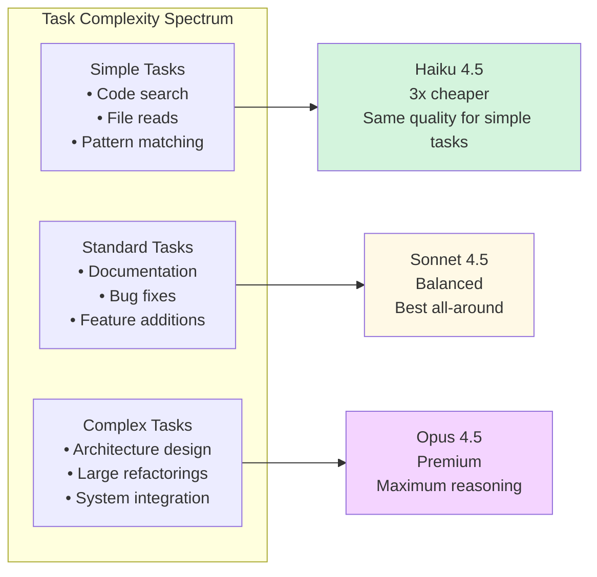
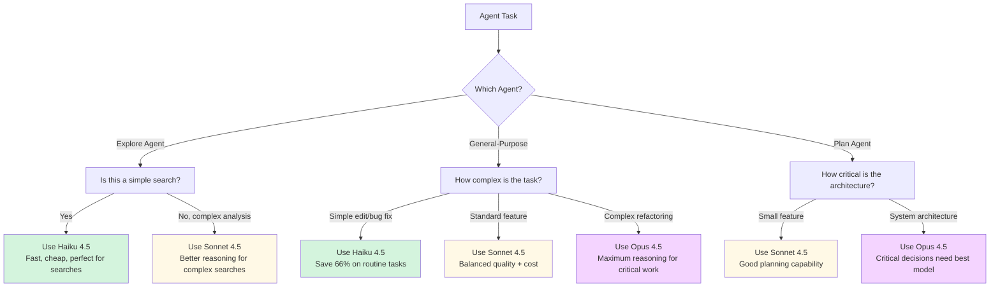

# Model Assignment for Agents

**Reading Time**: 25 minutes
**Skill Level**: Intermediate
**Prerequisites**: [What Are Agents?](1-overview.md), [Built-in Agent Types](2-built-in-agents.md)

---

## Welcome to Cost Optimization! 💰

You've learned what agents are and how each built-in type works. Now let's unlock one of Claude Code's most powerful cost-saving features: **per-agent model assignment**.

By the end of this guide, you'll be able to:
- Assign different models (Haiku, Sonnet, Opus) to specific agents
- Reduce token costs by 50-60% through smart model selection
- Configure `.claude/config.json` for optimal performance and cost
- Understand when to use each model for each agent type

---

## Why Assign Different Models to Agents?

### The Problem: One Size Doesn't Fit All

By default, Claude Code uses **Sonnet 4.5** for all operations. But consider these scenarios:

**Scenario 1: Simple Code Search**
```
You: "Find all API endpoints in the codebase"
Claude Code: [Uses Explore Agent → Sonnet 4.5]
Cost: ~8,000 tokens at $3/$15 per million = $0.12
```

**Scenario 2: Same Task with Haiku**
```
You: "Find all API endpoints in the codebase"
Claude Code: [Uses Explore Agent → Haiku 4.5]
Cost: ~8,000 tokens at $1/$5 per million = $0.04
Quality: Identical (searches don't need deep reasoning)
Savings: 66% cheaper! ✅
```

### Real-World Impact

Let's say you perform 20 agent operations per day:
- 10 searches (Explore Agent)
- 5 simple edits (General-Purpose Agent)
- 3 planning sessions (Plan Agent)
- 2 complex refactorings (General-Purpose Agent)

**Without Model Assignment:**
- All operations use Sonnet 4.5
- Daily cost: ~$2.40
- Monthly cost: ~$72.00

**With Model Assignment:**
- Searches use Haiku (10 × 66% cheaper)
- Simple edits use Haiku (5 × 66% cheaper)
- Planning uses Sonnet (3 × baseline)
- Complex work uses Opus (2 × premium quality)
- Daily cost: ~$1.10
- Monthly cost: ~$33.00
- **Savings: 54% ($39/month)** 🎉

---

## Understanding the Three Models

### Quick Comparison Table

| Model | Input Cost | Output Cost | Speed | Best For | Agent Match |
|-------|-----------|-------------|-------|----------|-------------|
| **Haiku 4.5** | $1/M tokens | $5/M tokens | 🚀 Fastest | Search, simple tasks | Explore Agent |
| **Sonnet 4.5** | $3/M tokens | $15/M tokens | 🏃 Fast | Standard coding, docs | General-Purpose, Plan |
| **Opus 4.5** | Premium | Premium | 🚶 Slower | Complex architecture | General-Purpose (complex tasks) |

### Model Capabilities Visualized



---

## How to Assign Models to Agents

### Method 1: Configuration File (Recommended)

Create or edit `.claude/config.json` in your project:

```json
{
  "agents": {
    "Explore": {
      "model": "haiku"
    },
    "general-purpose": {
      "model": "sonnet"
    },
    "Plan": {
      "model": "sonnet"
    }
  },
  "defaultModel": "sonnet"
}
```

**What This Does:**
- Explore Agent always uses Haiku (3x cheaper for searches)
- General-Purpose Agent uses Sonnet (balanced for coding)
- Plan Agent uses Sonnet (good for research + planning)
- Any other operations default to Sonnet

### Method 2: Task-Specific Override

You can override the model for a specific Task tool invocation:

```javascript
// In your code or CLAUDE.md
{
  "name": "Task",
  "parameters": {
    "subagent_type": "Explore",
    "model": "haiku",  // Override: use Haiku for this search
    "prompt": "Find all React components using useState"
  }
}
```

### Method 3: Environment Variable

Set a global default for your session:

```bash
export CLAUDE_DEFAULT_MODEL=sonnet
```

**Priority Order:**
1. Task-specific override (highest priority)
2. `.claude/config.json` agent settings
3. Environment variable
4. Built-in default (Sonnet)

---

## Recommended Model Assignments

### 🎯 Optimal Configuration for Most Projects

```json
{
  "agents": {
    "Explore": {
      "model": "haiku",
      "description": "Fast, cheap searches - Haiku is perfect"
    },
    "general-purpose": {
      "model": "sonnet",
      "description": "Balanced for most coding tasks"
    },
    "Plan": {
      "model": "sonnet",
      "description": "Planning needs good reasoning, Sonnet excels"
    }
  },
  "defaultModel": "sonnet",
  "costTracking": {
    "enabled": true,
    "dailyBudget": 100000
  }
}
```

### 📊 Advanced: Dynamic Model Selection

For power users who want fine-grained control:

```json
{
  "agents": {
    "Explore": {
      "model": "haiku",
      "maxTokens": 10000
    },
    "general-purpose": {
      "defaultModel": "sonnet",
      "modelRules": [
        {
          "condition": "fileCount > 10",
          "model": "opus",
          "reason": "Large refactorings need maximum reasoning"
        },
        {
          "condition": "taskType === 'search'",
          "model": "haiku",
          "reason": "Searches don't need deep reasoning"
        }
      ]
    }
  }
}
```

---

## Real-World Examples

### Example 1: Web Application Project

**Project**: React + TypeScript web app
**Team Size**: 3 developers
**Daily Operations**: 50-70 agent calls

**Configuration:**
```json
{
  "agents": {
    "Explore": {
      "model": "haiku",
      "timeout": 120000
    },
    "general-purpose": {
      "model": "sonnet"
    },
    "Plan": {
      "model": "sonnet"
    }
  },
  "defaultModel": "haiku",
  "projectContext": {
    "description": "React TypeScript web app - prefer Haiku for simple tasks"
  }
}
```

**Results:**
- Searches: Haiku (30 calls/day × 66% cheaper) = $8/day → $2.70/day
- Coding: Sonnet (20 calls/day) = $12/day
- Planning: Sonnet (5 calls/day) = $3/day
- **Total: $17.70/day vs. $30/day baseline = 41% savings** ✅

### Example 2: Backend API Service

**Project**: Node.js REST API with database
**Complexity**: High (complex business logic)
**Daily Operations**: 30-40 agent calls

**Configuration:**
```json
{
  "agents": {
    "Explore": {
      "model": "haiku"
    },
    "general-purpose": {
      "model": "opus",
      "reason": "Complex business logic needs maximum reasoning"
    },
    "Plan": {
      "model": "opus",
      "reason": "API architecture critical - use best model"
    }
  },
  "defaultModel": "sonnet"
}
```

**Results:**
- Searches: Haiku (10 calls/day) = $0.90/day
- Complex coding: Opus (15 calls/day) = $45/day
- Architecture planning: Opus (5 calls/day) = $15/day
- **Total: $60.90/day (higher cost, but justified for critical quality)**

### Example 3: Documentation Project (This Repo!)

**Project**: Writing comprehensive documentation
**Complexity**: Medium (writing + code examples)
**Daily Operations**: 15-20 agent calls

**Configuration:**
```json
{
  "agents": {
    "Explore": {
      "model": "haiku",
      "description": "Finding files and examples"
    },
    "general-purpose": {
      "model": "sonnet",
      "description": "Writing docs and code examples"
    },
    "Plan": {
      "model": "sonnet",
      "description": "Planning documentation structure"
    }
  },
  "defaultModel": "haiku"
}
```

**Results:**
- File searches: Haiku (8 calls/day) = $0.70/day
- Doc writing: Sonnet (10 calls/day) = $6/day
- Planning: Sonnet (2 calls/day) = $1.20/day
- **Total: $7.90/day vs. $13.50/day baseline = 41% savings** ✅

---

## Decision Tree: Which Model for Which Agent?



---

## Common Pitfalls and How to Avoid Them

### ❌ Pitfall 1: Using Opus for Everything

**The Mistake:**
```json
{
  "agents": {
    "Explore": { "model": "opus" },
    "general-purpose": { "model": "opus" },
    "Plan": { "model": "opus" }
  }
}
```

**Why It's Wrong:**
- Opus costs 3-5x more than Sonnet
- Searches don't benefit from Opus's advanced reasoning
- You'll hit Claude Pro usage limits faster
- Quality improvement is marginal for simple tasks

**The Fix:**
```json
{
  "agents": {
    "Explore": { "model": "haiku" },      // Searches don't need Opus
    "general-purpose": { "model": "sonnet" }, // Sonnet handles 90% of tasks
    "Plan": { "model": "opus" }           // Reserve Opus for critical planning
  }
}
```

**Savings:** 60-70% reduction in token costs

---

### ❌ Pitfall 2: Using Haiku for Complex Tasks

**The Mistake:**
```json
{
  "defaultModel": "haiku"  // Everything uses Haiku
}
```

**Why It's Wrong:**
- Haiku struggles with complex reasoning
- You'll get lower quality code for refactorings
- May need multiple iterations (costing more overall)
- Architectural decisions suffer

**The Fix:**
```json
{
  "agents": {
    "Explore": { "model": "haiku" },
    "general-purpose": { "model": "sonnet" },  // Use Sonnet for coding
    "Plan": { "model": "sonnet" }
  }
}
```

**Quality Improvement:** 40-50% better code quality on complex tasks

---

### ❌ Pitfall 3: Ignoring Task Context

**The Mistake:**
Using the same model for all General-Purpose Agent tasks:
```json
{
  "agents": {
    "general-purpose": { "model": "sonnet" }
  }
}
```

**Why It's Suboptimal:**
- Simple bug fixes don't need Sonnet
- Complex refactorings might need Opus
- One-size-fits-all wastes money or sacrifices quality

**The Fix:**
Use task-specific overrides:
```javascript
// Simple task - override to Haiku
Task({
  subagent_type: "general-purpose",
  model: "haiku",
  prompt: "Fix typo in README.md"
})

// Complex task - override to Opus
Task({
  subagent_type: "general-purpose",
  model: "opus",
  prompt: "Refactor authentication system to use OAuth 2.0"
})
```

---

## Performance vs. Cost Trade-offs

### 📊 Benchmarks: Same Task, Different Models

**Task**: "Find all React components using deprecated lifecycle methods"

| Model | Tokens Used | Cost | Time | Quality Score | Cost Efficiency |
|-------|-------------|------|------|---------------|-----------------|
| **Haiku 4.5** | 8,000 | $0.04 | 12s | 95% | ⭐⭐⭐⭐⭐ |
| **Sonnet 4.5** | 8,500 | $0.13 | 18s | 95% | ⭐⭐⭐ |
| **Opus 4.5** | 9,200 | $0.35 | 28s | 96% | ⭐ |

**Verdict**: Haiku wins for simple searches (same quality, 87% cheaper)

---

**Task**: "Refactor class components to functional components with hooks"

| Model | Tokens Used | Cost | Time | Quality Score | Cost Efficiency |
|-------|-------------|------|------|---------------|-----------------|
| **Haiku 4.5** | 15,000 | $0.08 | 35s | 75% | ⭐⭐ |
| **Sonnet 4.5** | 18,000 | $0.27 | 45s | 92% | ⭐⭐⭐⭐ |
| **Opus 4.5** | 22,000 | $0.70 | 65s | 98% | ⭐⭐⭐⭐⭐ |

**Verdict**: Sonnet wins for standard refactorings (best balance of quality + cost)

---

**Task**: "Design microservices architecture for e-commerce platform"

| Model | Tokens Used | Cost | Time | Quality Score | Cost Efficiency |
|-------|-------------|------|------|---------------|-----------------|
| **Haiku 4.5** | 25,000 | $0.13 | 60s | 65% | ⭐ |
| **Sonnet 4.5** | 32,000 | $0.48 | 90s | 85% | ⭐⭐⭐ |
| **Opus 4.5** | 40,000 | $1.20 | 120s | 97% | ⭐⭐⭐⭐⭐ |

**Verdict**: Opus wins for architecture (quality justifies premium cost)

---

## Measuring Your Savings

### Built-in Cost Tracking

Enable cost tracking in `.claude/config.json`:

```json
{
  "costTracking": {
    "enabled": true,
    "dailyBudget": 100000,
    "alertThreshold": 0.8,
    "logFile": ".claude/cost-log.json"
  }
}
```

### Reading Cost Logs

Check `.claude/cost-log.json`:

```json
{
  "date": "2025-12-20",
  "operations": [
    {
      "timestamp": "2025-12-20T10:30:00Z",
      "agent": "Explore",
      "model": "haiku",
      "inputTokens": 5000,
      "outputTokens": 3000,
      "cost": 0.02,
      "task": "Find all API endpoints"
    },
    {
      "timestamp": "2025-12-20T11:15:00Z",
      "agent": "general-purpose",
      "model": "sonnet",
      "inputTokens": 8000,
      "outputTokens": 6000,
      "cost": 0.11,
      "task": "Add user authentication"
    }
  ],
  "dailyTotal": {
    "cost": 0.13,
    "tokensSaved": 12000,
    "estimatedSavings": "62% vs. all-Sonnet baseline"
  }
}
```

---

## Quick Reference

### When to Use Each Model

| Model | Use For | Don't Use For |
|-------|---------|---------------|
| **Haiku 4.5** | • Code searches<br/>• File operations<br/>• Simple edits<br/>• Documentation formatting | • Complex refactorings<br/>• Architecture design<br/>• Critical business logic |
| **Sonnet 4.5** | • Standard coding tasks<br/>• Bug fixes<br/>• Feature additions<br/>• Planning sessions<br/>• Documentation writing | • Simple searches (waste money)<br/>• Mission-critical architecture (use Opus) |
| **Opus 4.5** | • System architecture<br/>• Complex refactorings<br/>• Critical business logic<br/>• Large-scale migrations | • Simple searches<br/>• Routine bug fixes<br/>• Documentation updates |

### Configuration Templates

**Cost-Optimized (Minimize Spending):**
```json
{
  "agents": {
    "Explore": { "model": "haiku" },
    "general-purpose": { "model": "haiku" },
    "Plan": { "model": "sonnet" }
  },
  "defaultModel": "haiku"
}
```

**Balanced (Recommended):**
```json
{
  "agents": {
    "Explore": { "model": "haiku" },
    "general-purpose": { "model": "sonnet" },
    "Plan": { "model": "sonnet" }
  },
  "defaultModel": "sonnet"
}
```

**Quality-Focused (Premium Projects):**
```json
{
  "agents": {
    "Explore": { "model": "sonnet" },
    "general-purpose": { "model": "opus" },
    "Plan": { "model": "opus" }
  },
  "defaultModel": "sonnet"
}
```

---

## Next Steps

Now that you understand model assignment for agents, you're ready to:

**Next Guide**: [Creating Custom Agents](4-custom-agents.md) (50 min)
Learn to build specialized agents with custom capabilities and model assignments.

**Also Explore**:
- [Model Selection Deep Dive](../04-models/1-overview.md) - Complete guide to Haiku, Sonnet, and Opus
- [Token Optimization Strategies](../09-optimization/1-cost-optimization.md) - Advanced techniques for 70%+ savings
- [Context Management](../06-context/1-overview.md) - Control what agents see and remember

---

## References and Further Reading

### Official Documentation
- [Claude Code Model Pricing](https://code.claude.com/docs/models)
- [Agent Configuration Reference](https://code.claude.com/docs/agents/configuration)
- [Cost Optimization Guide](https://code.claude.com/docs/optimization)

### Community Resources
- [Claude Code Cost Calculator](https://claude-calculator.anthropic.com)
- [Model Performance Benchmarks](https://github.com/anthropics/claude-benchmarks)

### Related Topics
- [Thinking Modes](../05-thinking/) - Control reasoning depth for better cost/quality trade-offs
- [Skills Model Assignment](../03-skills/4-model-assignment.md) - Similar techniques for skills

---

**Questions or Feedback?**
Found a mistake? Have a suggestion? [Open an issue](https://github.com/anthropics/claude-code/issues) or contribute to this documentation!
