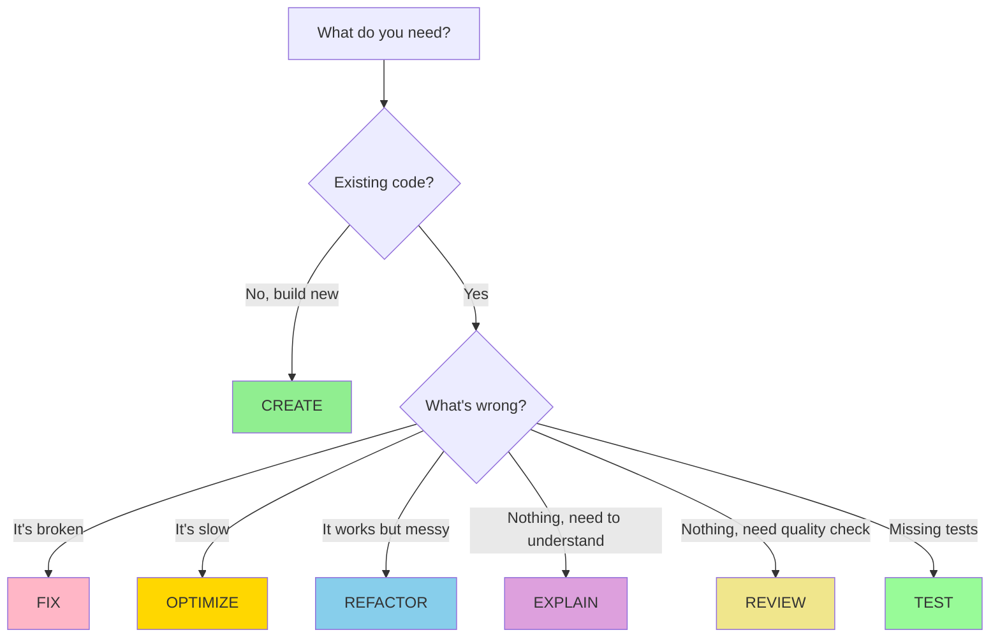

# Core Prompt Patterns

**Reading Time**: 30-35 minutes
**Skill Level**: Beginner
**Prerequisites**: [Prompt Basics Overview](1-overview.md)

---

## The 7 Essential Patterns 🎨

Every coding task falls into one of these seven patterns. Master these templates and you'll handle 95% of your work efficiently.

---

## Pattern 1: CREATE 🔨

**Use when**: Building something new from scratch

### Template

```
Create [what] in [where] using [technology/approach].

Requirements:
- [Requirement 1]
- [Requirement 2]
- [Requirement 3]

Style/Conventions:
- [Convention 1]
- [Convention 2]
```

### Example 1: Simple Component

```
Create a LoadingSpinner component in src/components/LoadingSpinner.tsx.

Requirements:
- Accepts 'size' prop ('small', 'medium', 'large')
- Accepts optional 'color' prop (defaults to blue)
- Uses CSS animations (no external libraries)

Style/Conventions:
- Functional component with TypeScript
- Use Tailwind CSS for styling
- Export as default
```

### Example 2: API Endpoint

```
Create a POST endpoint for user registration at /api/auth/register.

Requirements:
- Accept email, password, name in request body
- Validate email format and password strength (min 8 chars)
- Hash password with bcrypt before storing
- Return JWT token on success
- Return 400 with error details on validation failure

Style/Conventions:
- Use Express Router pattern
- Follow the error handling pattern in existing endpoints
- Store in src/api/auth/register.ts
```

### Example 3: Database Schema

```
Create a 'posts' table in the database using Prisma schema.

Requirements:
- Fields: id, title, content, authorId, published, createdAt, updatedAt
- title: required, max 200 chars
- content: required, text type
- authorId: foreign key to users table
- published: boolean, defaults to false

Style/Conventions:
- Add to prisma/schema.prisma
- Follow existing model naming conventions
- Add indexes on authorId and createdAt
```

### Common Variations

| Variation | When to Use |
|-----------|-------------|
| "Create a minimal..." | When you want the simplest version first |
| "Create a production-ready..." | When you need error handling, validation, logging |
| "Create a template for..." | When you'll make multiple similar items |

---

## Pattern 2: FIX 🔧

**Use when**: Something is broken and needs repair

### Template

```
Fix [specific error/bug] in [file]:[line or function].

Error details:
- [What's happening]
- [Expected behavior]
- [When it occurs]

Constraints:
- [What not to change]
- [Requirements to maintain]
```

### Example 1: Runtime Error

```
Fix the "TypeError: Cannot read property 'email' of undefined" error
in src/auth/login.ts:42.

Error details:
- Happens when user object from database is null
- Expected: Should return error message "Invalid credentials"
- Occurs when: User enters non-existent email

Constraints:
- Don't change the function signature
- Keep the existing password validation logic
```

### Example 2: Logic Bug

```
Fix the duplicate order creation bug in src/checkout/processOrder.ts.

Error details:
- Multiple orders are created when user clicks "Checkout" quickly twice
- Expected: Only one order should be created per checkout session
- Occurs when: User double-clicks the checkout button

Constraints:
- Don't modify the database schema
- Keep the existing order validation
- Solution should work with current React state management
```

### Example 3: Performance Issue

```
Fix the slow query in src/api/users/search.ts causing timeouts.

Error details:
- Query takes 5+ seconds for 10,000 users
- Expected: Should complete in under 500ms
- Occurs when: Searching by partial email match

Constraints:
- Don't change the API response format
- Must still return all matching users (no pagination changes)
- Can add database indexes if needed
```

### Common Variations

| Variation | When to Use |
|-----------|-------------|
| "Debug and fix..." | When you're not sure of the exact cause |
| "Fix the failing test..." | When a test is failing |
| "Fix the security issue..." | When addressing security vulnerabilities |

---

## Pattern 3: REFACTOR ♻️

**Use when**: Code works but needs improvement

### Template

```
Refactor [file/function] to [improvement goal].

Current issue:
- [What's wrong with current code]

Desired state:
- [How it should be improved]

Constraints:
- Keep [existing behavior] unchanged
- Don't [what to avoid]
```

### Example 1: Extract Logic

```
Refactor the user data fetching logic in src/components/UserDashboard.tsx.

Current issue:
- API calls are mixed with component logic
- Hard to test and reuse

Desired state:
- Extract all API calls to src/services/userService.ts
- Component should only handle UI and state
- Service should be reusable across components

Constraints:
- Keep existing component props interface unchanged
- Don't change the loading/error state behavior
- Maintain current error handling
```

### Example 2: Simplify Complex Code

```
Refactor the nested conditionals in src/utils/permissions.ts checkAccess function.

Current issue:
- 5 levels of nested if/else statements
- Hard to read and maintain

Desired state:
- Use early returns for clarity
- Extract permission checks into separate functions
- Add comments for complex business logic

Constraints:
- Keep the exact same permission logic (no behavior changes)
- Don't change function signature
- Maintain backwards compatibility
```

### Example 3: Modernize Code

```
Refactor src/api/fetchData.js to use async/await instead of promises.

Current issue:
- Uses .then().catch() chaining
- Error handling is scattered

Desired state:
- Use async/await syntax
- Centralized try/catch error handling
- More readable sequential flow

Constraints:
- Keep the same API response format
- Don't change function exports
- Maintain error message format
```

### Common Variations

| Variation | When to Use |
|-----------|-------------|
| "Refactor for readability..." | When code is hard to understand |
| "Refactor to follow..." | When adopting new patterns/conventions |
| "Refactor to reduce duplication..." | When there's copy-pasted code |

---

## Pattern 4: REVIEW 👀

**Use when**: Need code analysis, feedback, or quality checks

### Template

```
Review [file/files] for [specific aspects].

Focus areas:
- [Area 1: e.g., security]
- [Area 2: e.g., performance]
- [Area 3: e.g., best practices]

Priority: [what matters most]

Output format:
- [How you want the feedback: list, severity levels, etc.]
```

### Example 1: Security Review

```
Review src/api/auth/*.ts for security vulnerabilities.

Focus areas:
- SQL injection risks
- XSS vulnerabilities
- Password handling
- Token security
- Input validation

Priority: Critical security issues first

Output format:
- List issues by severity (Critical, High, Medium, Low)
- Include specific line numbers
- Suggest fixes for each issue
```

### Example 2: Code Quality Review

```
Review src/components/ProductList.tsx for code quality improvements.

Focus areas:
- Component structure and organization
- TypeScript type safety
- React best practices (hooks, re-renders)
- Code duplication
- Missing error handling

Priority: Type safety and performance issues first

Output format:
- Categorize by issue type
- Include code examples for suggestions
- Note any breaking changes
```

### Example 3: Pre-Production Review

```
Review the entire src/checkout/ directory for production readiness.

Focus areas:
- Error handling completeness
- Logging and monitoring
- Edge case coverage
- Input validation
- Database transaction safety

Priority: Anything that could cause data corruption or payment issues

Output format:
- Blocker issues (must fix before deploy)
- Important issues (should fix soon)
- Nice-to-have improvements
```

### Common Variations

| Variation | When to Use |
|-----------|-------------|
| "Quick review..." | When you want high-level feedback only |
| "Detailed review..." | When you want comprehensive analysis |
| "Review for..." | When focusing on specific aspect (perf, security, etc.) |

---

## Pattern 5: EXPLAIN 📚

**Use when**: Need to understand how code works

### Template

```
Explain how [specific part] works in [file].

Focus on:
- [Specific aspect you don't understand]
- [Another aspect]

Context:
- [Your current understanding or confusion]
```

### Example 1: Algorithm Explanation

```
Explain how the caching algorithm works in src/cache/LRUCache.ts.

Focus on:
- How items are evicted when cache is full
- How the "least recently used" tracking works
- The role of the doubly-linked list

Context:
- I understand basic caching but not the LRU eviction strategy
```

### Example 2: Data Flow Explanation

```
Explain how data flows through the authentication system in src/auth/.

Focus on:
- Journey from login form submission to JWT token creation
- Where password hashing happens
- How refresh tokens are validated

Context:
- I'm new to the codebase and need to understand the auth flow
  to add social login
```

### Example 3: Configuration Explanation

```
Explain the webpack configuration in webpack.config.js.

Focus on:
- Why we have multiple entry points
- How the code splitting works
- What the optimization settings do

Context:
- I need to add a new bundle but don't want to break existing setup
```

### Common Variations

| Variation | When to Use |
|-----------|-------------|
| "Explain like I'm five..." | When you need very simple explanation |
| "Explain the trade-offs..." | When understanding design decisions |
| "Explain step-by-step..." | When you need detailed walkthrough |

---

## Pattern 6: TEST 🧪

**Use when**: Need to create or fix tests

### Template

```
Write [test type] tests for [function/component] in [test file].

Test cases to cover:
- [Case 1]
- [Case 2]
- [Case 3]

Testing approach:
- [Framework/library to use]
- [Mocking strategy if needed]
```

### Example 1: Unit Tests

```
Write unit tests for the validateEmail function in src/utils/validation.test.ts.

Test cases to cover:
- Valid emails (user@example.com, user+tag@example.com)
- Invalid emails (missing @, missing domain, spaces)
- Edge cases (empty string, null, very long emails)
- International domains (user@例え.jp)

Testing approach:
- Use Jest
- Test both return value and error messages
- Group related tests in describe blocks
```

### Example 2: Component Tests

```
Write React component tests for UserProfile in src/components/UserProfile.test.tsx.

Test cases to cover:
- Renders user name, email, and avatar correctly
- Shows loading state while fetching data
- Shows error message when API fails
- Clicking "Edit" button opens edit modal

Testing approach:
- Use React Testing Library
- Mock the API calls with MSW
- Test user interactions with fireEvent
```

### Example 3: Integration Tests

```
Write integration tests for the checkout flow in src/tests/integration/checkout.test.ts.

Test cases to cover:
- Complete checkout from cart to order confirmation
- Applying discount code reduces total
- Payment failure shows error and doesn't create order
- Inventory is decremented after successful order

Testing approach:
- Use Supertest for API calls
- Use test database (not production)
- Clean up test data after each test
- Test the full flow end-to-end
```

### Common Variations

| Variation | When to Use |
|-----------|-------------|
| "Write minimal tests..." | When you want basic coverage first |
| "Write comprehensive tests..." | When you need exhaustive coverage |
| "Update existing tests..." | When modifying tests for changed code |

---

## Pattern 7: OPTIMIZE ⚡

**Use when**: Code is slow or using too many resources

### Template

```
Optimize [file/function] to [performance goal].

Current performance:
- [Metric: time, memory, etc.]

Target performance:
- [Goal metric]

Constraints:
- [What can't change: API, behavior, etc.]
```

### Example 1: Query Optimization

```
Optimize the getAllUsers query in src/api/users.ts to reduce database load.

Current performance:
- Takes 3 seconds for 10,000 users
- Makes N+1 queries for user profiles

Target performance:
- Should complete in under 500ms
- Single query or efficient join

Constraints:
- Don't change the API response format
- Must return all user fields currently returned
```

### Example 2: Bundle Size Optimization

```
Optimize the JavaScript bundle size for src/app.tsx.

Current performance:
- Main bundle: 2.5 MB (uncompressed)
- Loads in 8 seconds on 3G

Target performance:
- Main bundle under 500 KB
- Load time under 3 seconds on 3G

Constraints:
- Don't remove any functionality
- Can use code splitting and lazy loading
- Must work in all supported browsers
```

### Example 3: Rendering Optimization

```
Optimize the ProductList component in src/components/ProductList.tsx
to reduce re-renders.

Current performance:
- Re-renders on every keystroke in search box
- Renders 500+ products on each render
- UI feels sluggish

Target performance:
- Only re-render visible products
- Debounce search input
- Smooth 60fps scrolling

Constraints:
- Keep existing product card design
- Don't change the search API
- Maintain current filtering functionality
```

### Common Variations

| Variation | When to Use |
|-----------|-------------|
| "Optimize for speed..." | When latency is the issue |
| "Optimize for memory..." | When memory usage is too high |
| "Optimize for size..." | When bundle/package size matters |

---

## Mixing Patterns: Advanced Combos

Sometimes you need to combine patterns. Here's how:

### Combo 1: CREATE + TEST

```
Create a user authentication function in src/auth/authenticate.ts
that validates JWT tokens.

Requirements:
- Accepts token string, returns user object or null
- Validates token signature and expiration
- Returns null for invalid/expired tokens

Also write tests in src/auth/authenticate.test.ts covering:
- Valid token returns correct user
- Expired token returns null
- Invalid signature returns null
- Malformed token returns null
```

### Combo 2: FIX + EXPLAIN

```
Fix the memory leak in src/websocket/connection.ts and explain:
1. What was causing the leak
2. Why the fix works
3. How to prevent similar issues

Error details:
- Memory usage grows continuously
- Happens when WebSocket connections are closed
- Event listeners are not being cleaned up
```

### Combo 3: REFACTOR + REVIEW

```
Refactor src/api/dataProcessor.ts to improve readability,
then review the refactored code for:
- Maintainability improvements
- Any new issues introduced
- Remaining technical debt

Current issue:
- 500-line function with nested loops
- Hard to understand business logic
```

---

## Anti-Patterns to Avoid

### ❌ Anti-Pattern 1: The Everything Prompt

```
"Create a user authentication system with login, registration, password
reset, email verification, 2FA, OAuth integration with Google and GitHub,
admin dashboard, user management, audit logs, and make it all secure and
performant and write tests"
```

**Why bad**: Too many tasks in one prompt leads to incomplete or inconsistent results.

**Better**: Break into 7-10 focused prompts, one per feature.

---

### ❌ Anti-Pattern 2: The Treasure Hunt

```
"Fix the bug somewhere in the app"
```

**Why bad**: Claude has to search the entire codebase.

**Better**: Specify file, function, or line number.

---

### ❌ Anti-Pattern 3: The Time Traveler

```
"Make it like how we did it before"
```

**Why bad**: Claude doesn't remember previous sessions.

**Better**: Be explicit about the pattern/approach you want.

---

### ❌ Anti-Pattern 4: The Mind Reader

```
"You know what I mean, fix it"
```

**Why bad**: Assumptions lead to wrong solutions.

**Better**: State exactly what "fix it" means to you.

---

## Pattern Selection Decision Tree



---

## Practice Exercises

Match the task to the pattern:

### Exercise 1
**Task**: "The login page crashes when password field is empty"

**Pattern**: ________

<details>
<summary>💡 Answer</summary>

**FIX** - Something is broken and needs repair

**Good prompt**:
```
Fix the crash in src/pages/Login.tsx when password field is empty.

Error details:
- TypeError: Cannot read property 'length' of undefined
- Happens on line 45 in validateForm function
- Expected: Show "Password required" error message

Constraints:
- Don't change the form validation logic for other fields
```

</details>

---

### Exercise 2
**Task**: "We need a shopping cart component"

**Pattern**: ________

<details>
<summary>💡 Answer</summary>

**CREATE** - Building something new

**Good prompt**:
```
Create a ShoppingCart component in src/components/ShoppingCart.tsx.

Requirements:
- Display list of cart items (name, price, quantity)
- Show total price
- Allow quantity adjustment (+ / - buttons)
- Allow item removal
- Show "Cart is empty" message when no items

Style/Conventions:
- Use React + TypeScript
- Use Redux for cart state
- Follow existing component pattern in src/components/
- Use Tailwind CSS for styling
```

</details>

---

### Exercise 3
**Task**: "I don't understand how the caching works"

**Pattern**: ________

<details>
<summary>💡 Answer</summary>

**EXPLAIN** - Need to understand code

**Good prompt**:
```
Explain how the caching mechanism works in src/cache/CacheManager.ts.

Focus on:
- When cached data is used vs fresh API calls
- How cache invalidation works
- The TTL (time-to-live) configuration

Context:
- I need to add caching to a new API endpoint
- Want to follow the existing pattern
```

</details>

---

## Quick Reference: Pattern Cheat Sheet

| Pattern | Template Start | Best For |
|---------|---------------|----------|
| **CREATE** | "Create [what] in [where]..." | New features, components, files |
| **FIX** | "Fix [error] in [file]..." | Bugs, errors, broken functionality |
| **REFACTOR** | "Refactor [file] to [goal]..." | Improving working code |
| **REVIEW** | "Review [file] for [aspects]..." | Code quality, security, readiness |
| **EXPLAIN** | "Explain how [part] works..." | Understanding code |
| **TEST** | "Write tests for [function]..." | Creating or fixing tests |
| **OPTIMIZE** | "Optimize [file] to [goal]..." | Performance improvements |

---

## Next Steps

You now have the seven essential patterns. Next, you'll learn how to apply these patterns across different features of Claude Code:

**Later topics** (after learning core Claude Code features):
- How to use these patterns with specialized agents
- Advanced prompting techniques
- Cost-aware prompt optimization

**Recommended next reading**:
- [MCP Servers](../01-mcp-servers/1-overview.md) - Learn about external tool integrations
- [Table of Contents](../../TABLE_OF_CONTENTS.md) - Explore all guides

---

## Key Takeaways

✅ **7 patterns cover 95% of tasks**: CREATE, FIX, REFACTOR, REVIEW, EXPLAIN, TEST, OPTIMIZE
✅ **Each pattern has a template**: Use them as starting points
✅ **One pattern per prompt**: Don't mix unless intentional
✅ **Patterns + Formula = Success**: Combine patterns with the 4-part formula from Overview
✅ **Practice makes perfect**: The more you use these, the more natural they become

---

## References and Further Reading

### Official Documentation

**Anthropic Resources** (Most Current):
- [Anthropic Prompt Library](https://docs.anthropic.com/claude/page/prompts) - 50+ production-ready examples organized by pattern (CREATE, FIX, REFACTOR, REVIEW, etc.)
- [Anthropic Prompt Engineering Guide](https://docs.anthropic.com/claude/docs/prompt-engineering) - Official techniques for all prompt patterns

### Books

**Prompt Patterns**:
- **"Prompt Engineering for Generative AI"** by James Phoenix & Mike Taylor (O'Reilly, 2024)
  - *Chapter 5*: Advanced prompting patterns
  - *Chapter 6*: Chain-of-thought and reasoning patterns
  - *Chapter 8*: Pattern composition and reuse

### Security

**Safe Prompt Usage**:
- **"AI Security"** by Sean Murphy & Patrick Hall (O'Reilly, 2024)
  - *Chapter 4*: Prompt injection attacks and defenses
- [OWASP Top 10 for LLMs](https://owasp.org/www-project-top-10-for-large-language-model-applications/) (Updated 2024)
  - LLM01: Prompt Injection - Security implications of prompt patterns
  - LLM06: Sensitive Information Disclosure - Safe code review practices

### Community Resources

- [Claude Code Examples](https://github.com/anthropics/claude-code/tree/main/examples) - Real-world pattern usage
- [Model Context Protocol](https://modelcontextprotocol.io) - Extending Claude Code with custom tools

---

**Questions or Feedback?**
[Open an issue](https://github.com/anthropics/claude-code/issues)
