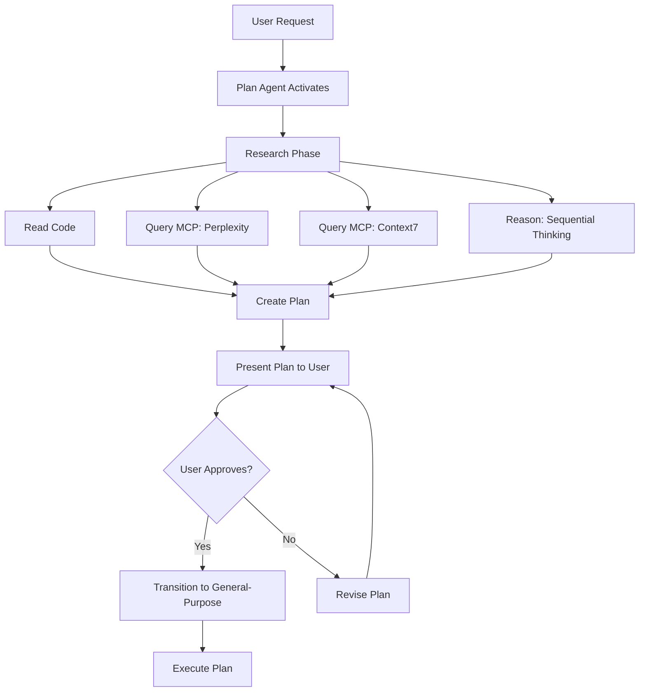

# Built-in Agents: Deep Dive

⏱️ **Time**: 30 minutes
📊 **Level**: Intermediate
🎯 **You'll Learn**: Detailed capabilities of each agent, practical limitations, tool selection logic, advanced usage patterns, and performance characteristics

---

## Prerequisites

Before diving into this guide, make sure you've read:
- ✅ [Agents Overview](1-overview.md) - Basic understanding of agent types
- ✅ [MCP Servers Overview](../01-mcp-servers/1-overview.md) - Agents use MCP tools

**New to agents?** Start with the [Overview](1-overview.md) first—this guide goes much deeper.

---

## What You'll Learn

This guide provides comprehensive coverage of Claude Code's three built-in agents:

**Explore Agent**: Fast codebase search and analysis
**General-Purpose Agent**: Full-featured implementation and modification
**Plan Agent**: Research-first architectural planning

For each agent, we'll cover:
- Exact tool access and capabilities
- Performance characteristics
- Real-world examples with token counts
- Best practices and anti-patterns
- When to use vs. when to avoid

---

## Explore Agent: Deep Dive

### Philosophy

The Explore agent embodies a single principle: **read-only speed**. It's designed for one thing—finding and analyzing information in your codebase as fast as possible.

**Design constraints**:
- Zero ability to modify files
- No command execution
- Minimal tool set for maximum speed
- Optimized for search operations

### Exact Tool Access

The Explore agent has access to exactly **4 tools**:

| Tool | Purpose | Performance |
|------|---------|-------------|
| **Glob** | Find files by pattern | ~50-200ms |
| **Grep** | Search file contents | ~100-500ms |
| **Read** | Read file contents | ~50-100ms per file |
| **BashOutput** | Read bash output (passive) | ~20-50ms |

**What's NOT available**:
- ❌ Edit tool
- ❌ Write tool
- ❌ Bash tool (command execution)
- ❌ MCP tools that write (GitHub create, database insert, etc.)
- ❌ Any tool that modifies state

### Performance Characteristics

**Speed comparison**:
```
Explore Agent:     2-8 seconds (typical search)
General-Purpose:   8-15 seconds (same search)
Speedup:          3-5x faster
```

**Token usage**:
```
Simple search:
- Explore: ~1,500-3,000 tokens
- General-Purpose: ~4,000-7,000 tokens
- Savings: 50-60%

Complex search (multiple files):
- Explore: ~5,000-8,000 tokens
- General-Purpose: ~12,000-18,000 tokens
- Savings: 40-55%
```

**Why so much faster?**
1. Loads fewer tools (4 vs. 12+)
2. No safety checks for writes
3. Optimized prompt for search
4. Can't accidentally trigger complex operations

### Real-World Examples

#### Example 1: Finding API Endpoints

**Request**:
```bash
> "Find all API endpoints in the codebase"
```

**What Explore does** (step-by-step):

```typescript
// Step 1: Glob for likely files (~100ms)
Glob pattern: "**/*.{ts,js}"
Filter: Files in routes/, api/, endpoints/
Found: 23 files

// Step 2: Grep for route definitions (~300ms)
Pattern: "(app|router|api)\\.(get|post|put|delete|patch)"
Found: 47 matches across 12 files

// Step 3: Read relevant files (~200ms)
Read: routes/users.ts, routes/auth.ts, routes/products.ts
Parse endpoint definitions

// Step 4: Structure results (~50ms)
Group by resource (users, auth, products)
List HTTP methods for each

Total time: ~650ms
```

**Response**:
```
Found 47 API endpoints across 12 files:

**/api/users**
- GET    /api/users           (routes/users.ts:12)
- GET    /api/users/:id       (routes/users.ts:23)
- POST   /api/users           (routes/users.ts:34)
- PUT    /api/users/:id       (routes/users.ts:45)
- DELETE /api/users/:id       (routes/users.ts:56)

**/api/auth**
- POST   /api/auth/login      (routes/auth.ts:8)
- POST   /api/auth/logout     (routes/auth.ts:19)
- POST   /api/auth/refresh    (routes/auth.ts:30)
- GET    /api/auth/me         (routes/auth.ts:41)

**/api/products**
- GET    /api/products        (routes/products.ts:15)
- GET    /api/products/:id    (routes/products.ts:28)
- POST   /api/products        (routes/products.ts:42)
- PUT    /api/products/:id    (routes/products.ts:59)
- DELETE /api/products/:id    (routes/products.ts:73)

[... 32 more endpoints]
```

**Token usage**: ~2,800 tokens

---

#### Example 2: Code Analysis

**Request**:
```bash
> "Explain how the authentication middleware works"
```

**What Explore does**:

```typescript
// Step 1: Find auth middleware
Glob: "**/middleware/*auth*.{ts,js}"
Found: middleware/auth.ts

// Step 2: Read the file
Read: middleware/auth.ts (120 lines)

// Step 3: Analyze dependencies
Grep: "import.*from" in auth.ts
Read: lib/jwt.ts, lib/database.ts

// Step 4: Trace the flow
Parse middleware function
Identify:
- Input: HTTP request
- Steps: Token extraction → Verification → User lookup
- Output: Authenticated request or 401 error

Total time: ~800ms
```

**Response**:
```
The authentication middleware works in 4 steps:

**1. Token Extraction** (auth.ts:15-23)
```typescript
const token = req.headers.authorization?.replace('Bearer ', '')
if (!token) return res.status(401).json({ error: 'No token' })
```
Extracts JWT from Authorization header

**2. Token Verification** (auth.ts:25-35)
```typescript
const payload = jwt.verify(token, process.env.JWT_SECRET)
```
Uses lib/jwt.ts to verify signature and expiration

**3. User Lookup** (auth.ts:37-45)
```typescript
const user = await db.users.findById(payload.userId)
if (!user) return res.status(401).json({ error: 'User not found' })
```
Queries database for user (lib/database.ts)

**4. Attach to Request** (auth.ts:47-50)
```typescript
req.user = user
next()
```
Makes user available to route handlers

**Error handling**: Returns 401 for invalid tokens, expired tokens, or missing users
```

**Token usage**: ~4,200 tokens

---

### Best Practices

**✅ Use Explore When:**

```bash
# Searching for code
> "Find all React components using useEffect"
> "Show me files that import lodash"
> "List all database models"

# Understanding code
> "Explain the payment processing flow"
> "How does the caching layer work?"
> "What does the UserService class do?"

# Analyzing structure
> "What's the directory structure of this project?"
> "Show me the component hierarchy"
> "List all test files"
```

**❌ Don't Use Explore For:**

```bash
# Anything requiring modifications
> "Fix the bug in auth.ts"           # ❌ Needs General-Purpose
> "Add error handling"                # ❌ Needs General-Purpose
> "Refactor this to use async/await"  # ❌ Needs General-Purpose

# Running commands
> "Run the tests"                     # ❌ Needs General-Purpose
> "Install this package"              # ❌ Needs General-Purpose

# Using write MCP tools
> "Create a GitHub issue"             # ❌ Needs General-Purpose
> "Insert into database"              # ❌ Needs General-Purpose
```

### Performance Tips

**1. Be specific in requests**:
```bash
# ⚡ Fast: Specific pattern
> "Find React components in src/components"

# 🐌 Slow: Too broad
> "Find all React stuff"
```

**2. Use file patterns when possible**:
```bash
# ⚡ Fast: Narrow search
> "Search for 'authentication' in src/auth/*.ts"

# 🐌 Slower: Search everything
> "Search for 'authentication' everywhere"
```

**3. Batch related questions**:
```bash
# ⚡ Efficient: One agent call
> "Find all API endpoints and explain how authentication works"

# 🐌 Inefficient: Two agent calls
> "Find all API endpoints"
> [Wait for response]
> "Explain how authentication works"
```

---

## General-Purpose Agent: Deep Dive

### Philosophy

The General-Purpose agent is Claude Code's **workhorse**—it can do everything. If Explore is a librarian, General-Purpose is a full development team.

**Design principle**: Maximum capability, reasonable safety.

### Exact Tool Access

The General-Purpose agent has access to **all available tools**:

| Category | Tools | Purpose |
|----------|-------|---------|
| **File Operations** | Glob, Grep, Read, Edit, Write | Full file manipulation |
| **Execution** | Bash, BashOutput, KillShell | Run commands, manage processes |
| **MCP Tools** | All configured MCP servers | External integrations |
| **Specialized** | Task, Skill, SlashCommand | Launch sub-agents, skills |
| **Jupyter** | NotebookEdit | Notebook editing |

**Total**: 12+ built-in tools + all MCP tools you've installed.

### Performance Characteristics

**Speed**:
```
Simple modification:   5-15 seconds
Complex feature:       30-90 seconds
Multi-file refactor:   60-180 seconds
```

**Token usage**:
```
Small change (1-2 files):     5,000-10,000 tokens
Medium feature (5-8 files):   15,000-30,000 tokens
Large feature (15+ files):    40,000-80,000 tokens
```

**Why slower than Explore?**
1. More tools to consider
2. Writes require validation
3. Command execution takes real time
4. Safety checks for destructive operations

### Real-World Examples

#### Example 1: Implementing a Feature

**Request**:
```bash
> "Add rate limiting to the API endpoints"
```

**What General-Purpose does** (step-by-step):

```typescript
// Step 1: Understand current structure (~5s)
Glob: Find API route files
Read: Main application file, middleware setup
Analyze: How middleware is currently applied

// Step 2: Research best practices (~3s)
// (If Context7 MCP available)
MCP Context7: Query Express.js rate limiting docs

// Step 3: Write rate limiter (~8s)
Write: src/middleware/rateLimiter.ts
Content:
  - Import express-rate-limit
  - Configure limits (100 req/15min)
  - Export middleware

// Step 4: Update application (~5s)
Edit: src/app.ts
Add: Import rate limiter
Add: Apply to /api/* routes

// Step 5: Create tests (~10s)
Write: tests/rateLimiter.test.ts
Content:
  - Test within limits (✅)
  - Test exceeding limits (✅)
  - Test reset after window (✅)

// Step 6: Verify (~8s)
Bash: npm test -- rateLimiter.test.ts
Parse: Test results

Total time: ~39 seconds
```

**Files modified**:
```
✅ Created: src/middleware/rateLimiter.ts (45 lines)
✅ Modified: src/app.ts (3 lines added)
✅ Created: tests/rateLimiter.test.ts (89 lines)
✅ Modified: package.json (1 dependency added)
```

**Token usage**: ~18,500 tokens

---

#### Example 2: Bug Fix with Testing

**Request**:
```bash
> "Fix the race condition in checkout.js line 45"
```

**What General-Purpose does**:

```typescript
// Step 1: Read and understand (~3s)
Read: src/checkout.js (focus on line 45)
Read: Related files (payment processor, database)
Identify: Race condition between payment and inventory check

// Step 2: Plan fix (~2s)
Solution: Use database transaction with row locking
Ensure: Payment and inventory update are atomic

// Step 3: Implement fix (~7s)
Edit: src/checkout.js
Change:
  - Wrap in transaction
  - Add SELECT ... FOR UPDATE
  - Ensure rollback on failure

// Step 4: Add test for race condition (~8s)
Edit: tests/checkout.test.ts
Add test:
  - Simulate concurrent checkouts
  - Verify no double-charge
  - Verify correct inventory decrement

// Step 5: Run tests (~12s)
Bash: npm test -- checkout.test.ts
Result: ✅ All 15 tests passing (including new race condition test)

Total time: ~32 seconds
```

**Changes**:
```typescript
// Before (race condition):
async function checkout(userId, productId) {
  const product = await db.products.findById(productId)
  if (product.inventory > 0) {
    await processPayment(userId, product.price)
    // ⚠️ Race condition here! Another request could check inventory
    await db.products.update(productId, {
      inventory: product.inventory - 1
    })
  }
}

// After (fixed):
async function checkout(userId, productId) {
  await db.transaction(async (trx) => {
    // Lock row until transaction completes
    const product = await trx.products
      .findById(productId)
      .forUpdate()

    if (product.inventory > 0) {
      await processPayment(userId, product.price)
      // ✅ Safe: Row is locked, inventory can't change
      await trx.products.update(productId, {
        inventory: product.inventory - 1
      })
    }
  })
}
```

**Token usage**: ~12,300 tokens

---

#### Example 3: Using MCP Tools

**Request**:
```bash
> "Create a GitHub issue for the checkout bug we just fixed"
```

**What General-Purpose does**:

```typescript
// Step 1: Gather context (~2s)
Read: Recent git commits
Read: src/checkout.js to understand fix
Summarize: What was fixed and how

// Step 2: Use GitHub MCP (~4s)
MCP GitHub: Create issue
  Title: "Fix race condition in checkout flow"
  Body:
    - Description of bug
    - Impact (potential double charges)
    - Fix implemented (database transactions)
    - Link to commit

// Step 3: Confirm (~1s)
Return: Issue URL and number

Total time: ~7 seconds
```

**Response**:
```
✅ Created GitHub issue #142

**Title**: Fix race condition in checkout flow

**Description**:
Fixed a race condition in the checkout process that could lead to:
- Double charges for the same product
- Inventory count becoming negative
- Inconsistent database state

**Resolution**:
Implemented database transactions with row locking using SELECT ... FOR UPDATE
to ensure atomic payment processing and inventory updates.

**Commit**: abc1234

🔗 https://github.com/yourorg/yourrepo/issues/142
```

**Token usage**: ~3,800 tokens

---

### Best Practices

**✅ Use General-Purpose When:**

```bash
# Implementing features
> "Add user authentication"
> "Create a new API endpoint for products"
> "Build a React component for the dashboard"

# Fixing bugs
> "Fix the error in payment.ts line 67"
> "Debug why tests are failing"
> "Resolve the TypeScript errors"

# Refactoring
> "Refactor auth to use async/await"
> "Convert this class to functional components"
> "Extract common logic into utils"

# Testing
> "Run the test suite"
> "Add tests for the payment flow"
> "Fix failing tests"

# Using MCP tools
> "Create a GitHub PR"
> "Query the database for recent users"
> "Deploy to staging"
```

**❌ Avoid General-Purpose For:**

```bash
# Simple searches (use Explore)
> "Find all React components"         # ❌ Use Explore (faster)
> "Show me the auth logic"            # ❌ Use Explore

# Complex planning (use Plan)
> "Design a microservices architecture"  # ❌ Use Plan
> "Plan the migration to GraphQL"        # ❌ Use Plan
```

### Safety Features

**1. Confirmation for destructive operations**:
```bash
> "Delete all test files"

⚠️ Warning: This will delete 47 files. Continue? (y/n)
```

**2. Validation before file writes**:
```typescript
// General-Purpose checks:
- Is syntax valid? (linting)
- Does it break existing code? (TypeScript errors)
- Are tests still passing?
```

**3. Git integration**:
```bash
# General-Purpose tracks changes:
Modified: src/auth.ts
Created: src/middleware/rateLimiter.ts
Deleted: src/old/legacy.ts

# Creates clear git commits:
git commit -m "Add rate limiting middleware with tests"
```

---

## Plan Agent: Deep Dive

### Philosophy

The Plan agent embodies **research-driven development**: understand thoroughly before implementing.

**Core principle**: Never write code until the plan is approved.

### Exact Tool Access

The Plan agent has a **hybrid toolset**:

| Category | Tools | Write Access? |
|----------|-------|---------------|
| **Search** | Glob, Grep, Read | ✅ Read-only |
| **Research MCP** | Perplexity, Context7 | ✅ Read-only |
| **Reasoning** | Sequential Thinking | ✅ Yes |
| **File Ops** | Edit, Write | ❌ **Locked until plan approved** |
| **Execution** | Bash | ❌ **Locked until plan approved** |

**Key restriction**: Plan agent **cannot modify files or run commands** during the planning phase.

**After approval**: Transitions to General-Purpose agent with full access.

### Workflow Phases



### Performance Characteristics

**Speed**:
```
Planning phase:        30-120 seconds (research-heavy)
Implementation phase:  60-300 seconds (depends on complexity)
Total:                 90-420 seconds
```

**Token usage**:
```
Research and planning:  15,000-40,000 tokens
Implementation:         20,000-60,000 tokens
Total:                  35,000-100,000 tokens
```

**Why use it despite high cost?**
- Prevents implementing the wrong solution (saves more than it costs)
- Explores multiple approaches systematically
- Provides learning/context for user
- Ensures architectural consistency

### Real-World Examples

#### Example 1: Caching Strategy

**Request**:
```bash
> "Plan how to add caching to our API"
```

**What Plan agent does** (detailed):

```typescript
// Phase 1: Understand Current System (~15s)
Read: src/app.ts, routes/*.ts, database config
Analyze:
  - Express.js on Node.js
  - PostgreSQL database
  - ~2000 requests/min during peak
  - No current caching

// Phase 2: Research Best Practices (~25s)
MCP Perplexity:
  Query: "API caching strategies Node.js Express 2024"
  Results: Redis, in-memory, HTTP caching headers

MCP Context7:
  Query: "Express.js caching middleware patterns"
  Results: Official patterns, middleware options

// Phase 3: Evaluate Options (~20s)
Sequential Thinking:
  - Identify constraints (read-heavy vs write-heavy)
  - Evaluate Redis vs in-memory vs CDN
  - Consider scaling requirements
  - Analyze cache invalidation complexity

// Phase 4: Create Implementation Plan (~15s)
Structure:
  1. Recommended approach
  2. Alternative approaches considered
  3. Trade-offs analysis
  4. Step-by-step implementation
  5. Testing strategy
  6. Rollback plan

Total planning time: ~75 seconds
```

**Response**:
```markdown
# Caching Strategy Implementation Plan

## Current System Analysis

**Architecture**: Express.js + PostgreSQL
**Load**: ~2,000 req/min peak, ~800 req/min average
**Bottleneck**: Database queries (80% of response time)
**Cache Hit Potential**: 65-70% (many duplicate queries)

## Recommended Approach: Two-Tier Caching

### Tier 1: In-Memory LRU Cache
- Library: `lru-cache` (node.js)
- Size: 500MB max
- TTL: 60 seconds
- Purpose: Hot data (user sessions, frequent queries)

### Tier 2: Redis Cache
- TTL: 5 minutes for dynamic data, 1 hour for static
- Purpose: Shared across server instances
- Invalidation: Pub/Sub on data changes

**Why this approach?**
✅ Tier 1 handles 40-50% of requests (sub-1ms)
✅ Tier 2 handles another 20-25% (~5-10ms)
✅ Only 30-35% hit database
✅ 60-70% reduction in database load
✅ Scales horizontally with Redis cluster

## Alternative Approaches Considered

### A. In-Memory Only
✅ Simplest implementation
✅ No external dependencies
❌ Not shared across instances
❌ Cache cleared on restart
**Verdict**: Good for single-instance deploys, not for production

### B. Redis Only
✅ Shared across all instances
✅ Persistent across restarts
❌ Network latency (5-10ms per request)
❌ Redis infrastructure cost
**Verdict**: Good but slower than two-tier

### C. HTTP Caching (CDN)
✅ Handles static content excellently
❌ Can't cache personalized API responses
❌ Limited control over invalidation
**Verdict**: Complement, not replacement

## Implementation Plan

### Phase 1: In-Memory Cache (2-3 hours)
**Step 1.1**: Install `lru-cache`
```bash
npm install lru-cache @types/lru-cache
```

**Step 1.2**: Create cache service
File: `src/services/cache.ts`
- Initialize LRU cache with 500MB limit
- Implement get/set/delete methods
- Add cache hit/miss metrics

**Step 1.3**: Create caching middleware
File: `src/middleware/cache.ts`
- Cache GET requests only
- Use URL + query params as key
- Skip caching if Authorization header present

**Step 1.4**: Apply to routes
File: `src/app.ts`
- Add middleware to `/api/products*`
- Add middleware to `/api/categories*`

### Phase 2: Redis Cache (2-3 hours)
**Step 2.1**: Set up Redis
```bash
# Local development
docker run -d -p 6379:6379 redis:alpine

# Production: Use managed Redis (AWS ElastiCache, etc.)
```

**Step 2.2**: Install client
```bash
npm install ioredis @types/ioredis
```

**Step 2.3**: Update cache service
File: `src/services/cache.ts`
- Add Redis as L2 cache
- Waterfall: Check L1 → Check L2 → Hit database → Store in L2 and L1

**Step 2.4**: Implement pub/sub invalidation
File: `src/services/cacheInvalidation.ts`
- Publish on data updates
- Subscribe to invalidate local cache

### Phase 3: Testing & Monitoring (1-2 hours)
**Step 3.1**: Add tests
```typescript
// tests/cache.test.ts
- Test cache hit/miss
- Test TTL expiration
- Test invalidation
- Test waterfall behavior
```

**Step 3.2**: Add metrics
```typescript
// src/services/cache.ts
- Log cache hit rate
- Monitor memory usage
- Track Redis latency
```

**Step 3.3**: Load testing
```bash
# Use autocannon or similar
autocannon -c 100 -d 60 http://localhost:3000/api/products
```

## Success Metrics

**Before Caching**:
- Average response time: 180ms
- Database queries: 2,000/min
- 95th percentile: 450ms

**Target After Caching**:
- Average response time: <50ms (72% improvement)
- Database queries: <700/min (65% reduction)
- 95th percentile: <120ms (73% improvement)
- Cache hit rate: >65%

## Trade-offs & Considerations

**Infrastructure Cost**:
- Redis: ~$30/month (managed, 1GB)
- Worth it: Reduces database load, saves on database scaling costs

**Complexity**:
- +300-400 lines of code
- Cache invalidation requires careful design
- Monitoring adds operational overhead

**Stale Data Risk**:
- Mitigation: Short TTLs (60s in-memory, 5min Redis)
- Mitigation: Pub/sub invalidation on writes

**Memory Usage**:
- In-memory: 500MB per instance
- 3 instances = 1.5GB total
- Monitor and adjust based on hit rate

## Rollback Plan

If caching causes issues:

1. **Immediate**: Remove cache middleware from routes (1 min)
2. **Short-term**: Reduce TTL to 10 seconds (2 min)
3. **Full rollback**: Revert to pre-caching deployment (5 min)

## Questions to Consider

Before I implement:

1. **Redis infrastructure**: Self-hosted or managed? (Recommend managed: AWS ElastiCache)
2. **TTL values**: Are 60s/5min acceptable, or should they be shorter?
3. **Personalized data**: Which routes should skip caching due to user-specific data?
4. **Monitoring**: Do you have a preferred monitoring tool (Datadog, New Relic)?

---

**Ready to proceed?** I can start implementation immediately, or we can adjust the plan based on your feedback.
```

**Token usage**: ~28,000 tokens (planning only)

---

**If user approves**, Plan agent transitions to General-Purpose and executes the plan, consuming another ~35,000-45,000 tokens for implementation.

**Total**: ~63,000-73,000 tokens

**Value**: Prevented potential waste from implementing the wrong approach. User gets to review and approve first.

---

### When to Use Plan Agent

**✅ Use Plan When:**

```bash
# Architectural decisions
> "Plan how to migrate from monolith to microservices"
> "Design a caching strategy"
> "Plan the database schema for multi-tenancy"

# Multiple valid approaches
> "What's the best way to handle file uploads?"
> "Plan how to add real-time features"
> "Design an authentication system"

# High-impact changes
> "Plan the migration from JavaScript to TypeScript"
> "Design a new CI/CD pipeline"
> "Plan how to add internationalization"

# Research needed
> "How should I implement WebSocket support?"
> "Plan integration with a payment processor"
> "Design a plugin system for the app"
```

**❌ Don't Use Plan For:**

```bash
# Simple, obvious tasks
> "Add a new API endpoint"              # ❌ Just use General-Purpose
> "Fix this syntax error"               # ❌ Just fix it
> "Add a console.log for debugging"     # ❌ Trivial

# When you've already decided
> "Implement Redis caching as we discussed"  # ❌ Skip planning
> "Use the approach from the docs"           # ❌ Direct implementation
```

### Best Practices

**1. Ask open-ended questions**:
```bash
# ✅ Good: Let Plan explore options
> "What's the best way to handle file uploads in our app?"

# ⚠️ Less useful: Already decided
> "Add multer for file uploads"
```

**2. Provide context**:
```bash
# ✅ Good: Gives Plan agent context
> "Plan how to add caching. We get 10k req/min and need sub-100ms responses."

# ⚠️ Less useful: Plan has to guess
> "Plan how to add caching"
```

**3. Review plans carefully**:
```bash
# Plan presents approach
> "Recommended: Redis caching with..."

# ✅ Good: Review and provide feedback
> "Can we use an in-memory cache instead to avoid Redis costs?"

# ⚠️ Skip review: Might implement wrong approach
> "Go ahead and implement"
```

---

## Agent Performance Comparison

### Speed Benchmark

**Task**: "Find all TODO comments in the codebase"

| Agent | Time | Why |
|-------|------|-----|
| Explore | 3.2s | ⚡ Optimal (grep + read) |
| General-Purpose | 9.7s | 🐌 3x slower (loads extra tools) |
| Plan | N/A | ❌ Wrong tool for this task |

**Task**: "Implement rate limiting middleware"

| Agent | Time | Why |
|-------|------|-----|
| Explore | N/A | ❌ Can't write files |
| General-Purpose | 28s | ⚡ Optimal (write + test) |
| Plan | 65s + 45s | 🐌 Slower but more thorough |

**Task**: "Design a microservices architecture"

| Agent | Time | Why |
|-------|------|-----|
| Explore | N/A | ❌ Can't research |
| General-Purpose | 45s | ⚠️ Might rush, miss considerations |
| Plan | 120s | ⚡ Optimal (research + analyze) |

### Cost Comparison

**Task**: "Search for authentication code"

| Agent | Tokens | Cost (Sonnet 4.5) |
|-------|--------|-------------------|
| Explore | 2,300 | $0.0069 |
| General-Purpose | 6,800 | $0.0204 |
| **Savings** | **66%** | **$0.0135** |

**Task**: "Add a feature"

| Agent | Tokens | Cost (Sonnet 4.5) |
|-------|--------|-------------------|
| Explore | N/A | N/A |
| General-Purpose | 18,500 | $0.0555 |
| Plan | 65,000 | $0.195 |

**When is Plan worth it?**
If Plan prevents implementing the wrong approach that would cost 50,000+ tokens to redo, it pays for itself.

---

## Quick Reference

### Agent Selection Matrix

| Task Type | Agent | Rationale |
|-----------|-------|-----------|
| Find code | Explore | 3-5x faster, read-only |
| Understand code | Explore | Sufficient for analysis |
| Simple bug fix | General-Purpose | Needs file modification |
| Add feature | General-Purpose | Needs write + test |
| Refactor | General-Purpose | Clear approach |
| Architecture | Plan | Multiple approaches, high impact |
| Migration | Plan | Research needed, reversible |
| Design system | Plan | Complex trade-offs |

### Performance Guide

**Optimize for speed**:
- Use Explore for all searches
- Use General-Purpose only when writes needed
- Avoid Plan for simple tasks

**Optimize for cost**:
- Use Explore (50-60% cheaper for searches)
- Use Plan for complex tasks (prevents waste)
- Assign Haiku to Explore (see [Model Assignment](3-model-assignment.md))

**Optimize for quality**:
- Use Plan for architectural decisions
- Use General-Purpose with explicit requirements
- Combine: Explore → Plan → General-Purpose

---

## What's Next?

Excellent! You now understand:
- ✅ Detailed capabilities of each agent
- ✅ Exact tool access and restrictions
- ✅ Performance characteristics and trade-offs
- ✅ When to use which agent

**Ready to optimize costs?**

**→ [Agent Model Assignment](3-model-assignment.md)** - Assign Haiku/Sonnet/Opus to different agents for 3x cost savings

**→ [Custom Agents](4-custom-agents.md)** - Create specialized agents for your workflows (advanced)

**→ [Skills Overview](../04-skills/1-overview.md)** - Learn how skills leverage agent capabilities

---

## Troubleshooting Common Agent Issues

### Issue 1: Agent Selection Not Working as Expected

**Symptom**: Wrong agent being used for a task or agent not auto-selected

**Common Causes**:
- Ambiguous task description
- Agent configuration conflicts
- Manual agent override interfering

**Solutions**:
```bash
# Be explicit in your request
"Use the Explore agent to search for React components"

# Check agent configuration
grep -r "^model:" .claude/agents/

# Manually specify agent
claude --agent=Explore "Find all TypeScript files"

# Reset to default agent selection
claude --reset-agents
```

---

### Issue 2: Agent Timeout Errors

**Symptom**: "Agent timeout" or "Task took too long" errors

**Common Causes**:
- Task too complex for time limit
- Network latency
- Large codebase scan
- Agent stuck in loop

**Solutions**:
```json
// Subagents have no timeout setting; narrow the task scope instead
{
  "agents": {
    "general-purpose": {
      "timeout": 300000  // 5 minutes (default: 120000)
    }
  }
}
```

**Or break task into smaller pieces:**
```bash
# Instead of:
"Analyze entire codebase for performance issues"

# Use:
"Analyze src/api/ for performance issues"
"Analyze src/components/ for performance issues"
```

---

### Issue 3: Agent Running Out of Context

**Symptom**: "Context window full" or incomplete responses

**Common Causes**:
- Large files being read
- Too many files in scope
- Inefficient agent usage

**Solutions**:
```bash
# Use Explore agent first to narrow scope
claude --agent=Explore "Find authentication files"

# Then use General-Purpose agent on specific files
claude --agent=general-purpose "Refactor auth.ts"

# Reduce CLAUDE.md size
# Keep it under 500 lines for better context management
```

---

### Issue 4: Agent Cost Higher Than Expected

**Symptom**: High token usage or unexpected costs

**Common Causes**:
- Using wrong model for task
- Agent reading unnecessary files
- No cost optimization configured

**Solutions**:
```json
// Set model: in each subagent's own frontmatter (.claude/agents/<name>.md)
{
  "agents": {
    "Explore": { "model": "haiku" },      // Cheap for searches
    "general-purpose": { "model": "sonnet" }  // Balanced
  }
}
```

**See**: [Agent Model Assignment](3-model-assignment.md) for detailed cost optimization

---

### Issue 5: Plan Agent Not Creating Plans

**Symptom**: Plan agent starts implementation without planning

**Common Causes**:
- Task too simple (doesn't need planning)
- User approved plan too quickly
- Agent misclassified task complexity

**Solutions**:
```bash
# Explicitly request planning
"Create a detailed implementation plan for adding user authentication"

# Use EnterPlanMode explicitly
claude --plan "Implement dark mode across the application"

# Wait for plan before approving
# Review plan carefully before saying "proceed"
```

---

### Still Having Issues?

1. **Check logs**: `claude agent logs` to see what agents are doing
2. **Verify configuration**: `claude agent validate` to check config syntax
3. **Review guide**: [Agent Troubleshooting](../14-reference/2-troubleshooting.md#agent-issues)
4. **Ask community**: [Discord #agents channel](https://discord.gg/anthropic)

---

## References & Further Reading

### 📚 Official Documentation

- [Task Tool Documentation](https://code.claude.com/docs/en/task-tool) - How agents are spawned
- [Agent Configuration](https://code.claude.com/docs/en/agent-config) - Customizing agent behavior
- [Tool Reference](https://code.claude.com/docs/en/tools) - Complete tool documentation
- [Enabling Claude Code Autonomy](https://www.anthropic.com/news/enabling-claude-code-to-work-more-autonomously) - Subagents and checkpoints
- [Agent API Capabilities](https://www.anthropic.com/news/agent-capabilities-api) - Code execution and MCP connector
- [Claude Code Best Practices](https://www.anthropic.com/engineering/claude-code-best-practices) - Tips for effective agentic coding
- [Practical Guide to Main Agent and Sub-agents](https://jewelhuq.medium.com/practical-guide-to-mastering-claude-codes-main-agent-and-sub-agents-fd52952dcf00) - Community tutorial

### 🔗 Related Topics

- [Agents Overview](1-overview.md) - Conceptual foundation
- [Model Assignment](3-model-assignment.md) - Assign models to agents for cost optimization
- [MCP Servers](../01-mcp-servers/1-overview.md) - Tools that agents use
- [Skills Overview](../04-skills/1-overview.md) - Skills that leverage agents

### 💬 Community & Support

- [Agent Performance Discussion](https://github.com/anthropics/claude-code/discussions/agent-performance) - Share benchmarks
- [Discord: Agent Tips Channel](https://discord.gg/anthropic) - Best practices from users
- [Stack Overflow: claude-agents](https://stackoverflow.com/questions/tagged/claude-agents) - Q&A

---

**Ready to save costs by assigning models to agents?** Continue to [Agent Model Assignment](3-model-assignment.md)!
