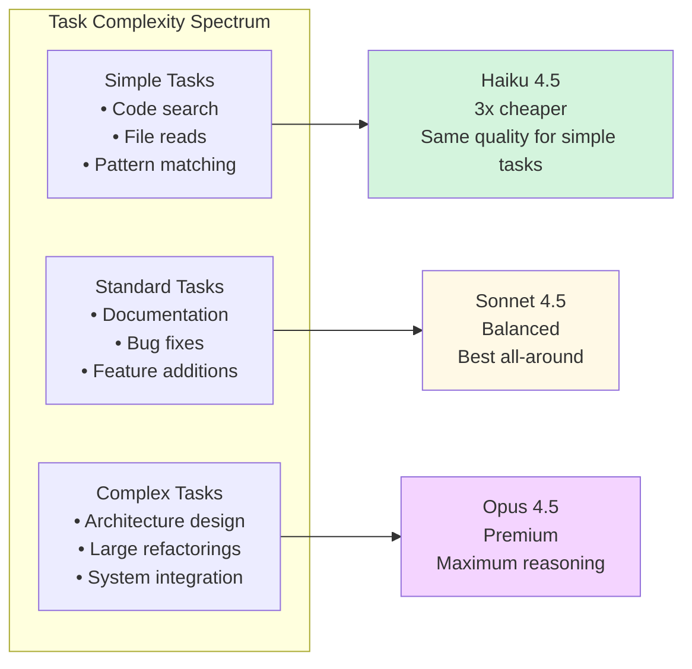
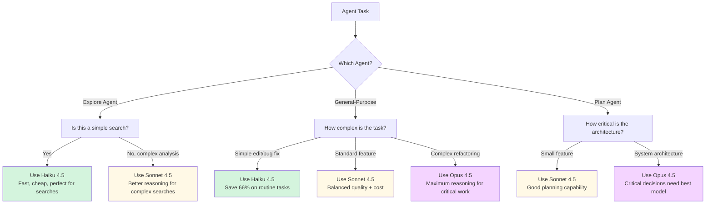

# Model Assignment for Agents

**Reading Time**: 25 minutes
**Skill Level**: Intermediate
**Prerequisites**: [What Are Agents?](1-overview.md), [Built-in Agent Types](2-built-in-agents.md)

---

## Welcome to Cost Optimization! 💰

You've learned what agents are and how each built-in type works. Now let's unlock one of Claude Code's most powerful cost-saving features: **per-agent model assignment**.

By the end of this guide, you'll be able to:
- Assign different models (Haiku, Sonnet, Opus) to specific agents
- Reduce token costs by 50-60% through smart model selection
- Set `model:` in a subagent's frontmatter for optimal performance and cost
- Understand when to use each model for each agent type

---

## Why Assign Different Models to Agents?

### The Problem: One Size Doesn't Fit All

By default, Claude Code uses **Sonnet 4.5** for all operations. But consider these scenarios:

**Scenario 1: Simple Code Search**
```
You: "Find all API endpoints in the codebase"
Claude Code: [Uses Explore Agent → Sonnet 4.5]
Cost: ~8,000 tokens at $3/$15 per million = $0.12
```

**Scenario 2: Same Task with Haiku**
```
You: "Find all API endpoints in the codebase"
Claude Code: [Uses Explore Agent → Haiku 4.5]
Cost: ~8,000 tokens at $1/$5 per million = $0.04
Quality: Identical (searches don't need deep reasoning)
Savings: 66% cheaper! ✅
```

### Real-World Impact

Let's say you perform 20 agent operations per day:
- 10 searches (Explore Agent)
- 5 simple edits (General-Purpose Agent)
- 3 planning sessions (Plan Agent)
- 2 complex refactorings (General-Purpose Agent)

**Without Model Assignment:**
- All operations use Sonnet 4.5
- Daily cost: ~$2.40
- Monthly cost: ~$72.00

**With Model Assignment:**
- Searches use Haiku (10 × 66% cheaper)
- Simple edits use Haiku (5 × 66% cheaper)
- Planning uses Sonnet (3 × baseline)
- Complex work uses Opus (2 × premium quality)
- Daily cost: ~$1.10
- Monthly cost: ~$33.00
- **Savings: 54% ($39/month)** 🎉

---

## Understanding the Three Models

### Quick Comparison Table

**Pricing as of January 2025** - [Verify current rates](https://www.anthropic.com/pricing)

| Model | Input Cost | Output Cost | Speed | Best For | Agent Match |
|-------|-----------|-------------|-------|----------|-------------|
| **Haiku 4.5** | $1/M tokens | $5/M tokens | 🚀 Fastest | Search, simple tasks | Explore Agent |
| **Sonnet 4.5** | $3/M tokens | $15/M tokens | 🏃 Fast | Standard coding, docs | General-Purpose, Plan |
| **Opus 4.5** | Premium | Premium | 🚶 Slower | Complex architecture | General-Purpose (complex tasks) |

> ⚠️ **Note**: Pricing is subject to change. Always verify current rates at [anthropic.com/pricing](https://www.anthropic.com/pricing).

### Model Capabilities Visualized



---

## How to Assign Models to Agents

### Method 1: `model:` in the Subagent's Frontmatter

A subagent is a single Markdown file with YAML frontmatter, and the `model` field in that frontmatter decides which model the subagent runs on. There is no registry and no central agent list — **the file is the configuration.**

`.claude/agents/code-searcher.md`:

```markdown
---
name: code-searcher
description: Locates files, symbols, and usage patterns across the codebase. Use for any "where is X" question.
model: haiku
---

Search the codebase and report file paths with line numbers. Do not modify files.
```

**What This Does:**
- Every delegation to `code-searcher` runs on Haiku, whatever the main session is using
- Searches cost roughly a third as much, with no quality loss on mechanical lookups
- Nothing else in your setup changes

`model` accepts `sonnet`, `opus`, `haiku`, `fable`, a full model ID, or `inherit`. It defaults to `inherit`, meaning the subagent runs on whichever model the main session is on.

Where you put the file decides its reach:

| Location | Scope |
|----------|-------|
| `.claude/agents/<name>.md` | This project. Committed to git, so the whole team gets it. |
| `~/.claude/agents/<name>.md` | Every project on your machine. |

> 💡 **Built-in agents have no file to edit.** Explore, Plan, and general-purpose ship with Claude Code, so you cannot reassign their models this way — Explore already runs on a fast, cheap model for exactly the reason described above. When you want a search-style agent pinned to a particular model, define your own subagent as shown here.

### Method 2: `model` in `.claude/settings.json`

The `model` key in settings sets the default for the main thread, and therefore for every subagent left at `inherit`:

```json
{
  "model": "sonnet"
}
```

**Priority Order** (highest first):

1. Command line arguments
2. `model:` in the subagent's own frontmatter — for that subagent only
3. `model` in `.claude/settings.local.json` (personal, gitignored)
4. `model` in `.claude/settings.json` (project, committed)
5. `model` in `~/.claude/settings.json` (user, all projects)
6. Built-in default

A managed `managed-settings.json` deployed by IT sits above all of these and cannot be overridden.

---

## Recommended Model Assignments

### 🎯 Optimal Configuration for Most Projects

A good starting set is three subagent files plus one settings key. Each file is complete as shown — the body is the agent's instructions.

`.claude/agents/code-searcher.md` — searching is mechanical, so Haiku:

```markdown
---
name: code-searcher
description: Locates files, symbols, and usage patterns. Use for any "where is X" question.
model: haiku
tools: Read, Glob, Grep
---

Report file paths with line numbers. Do not modify files.
```

`.claude/agents/feature-builder.md` — implementation needs judgment, so Sonnet:

```markdown
---
name: feature-builder
description: Implements features and fixes bugs inside existing modules.
model: sonnet
---

Follow existing conventions in the files you touch. Run the test suite before reporting done.
```

`.claude/agents/architect.md` — design mistakes compound, so Opus:

```markdown
---
name: architect
description: Designs system architecture and plans cross-cutting refactorings. Use before writing code for anything touching many modules.
model: opus
---

Produce a written plan with trade-offs before proposing any code.
```

`.claude/settings.json` — everything not delegated to one of the above:

```json
{
  "model": "sonnet"
}
```

**On budgets:** there is no cost-tracking or daily-budget key in settings — no configuration will cap your spend. Track it after the fact with `/usage`, which reports session token counts, a locally computed cost, and (on Pro, Max, Team, and Enterprise plans) how much of your recent usage each individual subagent accounts for. See [Measuring Your Savings](#measuring-your-savings) below.

### 📊 Advanced: Routing Between Models

There is no conditional-rule mechanism — you cannot express "if this touches more than ten files, use Opus." Routing happens through **descriptions**, not rules. Claude reads each subagent's `description` and delegates based on it, so the way to get different models for different task shapes is to define one subagent per shape and make each description state precisely when it applies:

| Subagent file | `model` | What its `description` should claim |
|---------------|---------|-------------------------------------|
| `.claude/agents/code-searcher.md` | `haiku` | Locating files and symbols; read-only |
| `.claude/agents/feature-builder.md` | `sonnet` | Implementing features inside existing modules |
| `.claude/agents/architect.md` | `opus` | Cross-cutting design, migrations, anything spanning many modules |

Vague or overlapping descriptions are the usual reason a cheap agent gets handed work it cannot do. Be explicit about the boundary between them.

Two related settings keys are worth knowing:

```json
{
  "model": "sonnet",
  "fallbackModel": "haiku",
  "availableModels": ["sonnet", "haiku"],
  "enforceAvailableModels": true
}
```

- `fallbackModel` — what to use when the primary model is unavailable.
- `availableModels` with `enforceAvailableModels` — restricts which models can be selected at all, which is how you keep a team from reaching for Opus by accident.

---

## Real-World Examples

### Example 1: Web Application Project

**Project**: React + TypeScript web app
**Team Size**: 3 developers
**Daily Operations**: 50-70 agent calls

**Configuration:**

| Subagent file | `model` |
|---------------|---------|
| `.claude/agents/code-searcher.md` | `haiku` |
| `.claude/agents/component-builder.md` | `sonnet` |
| `.claude/agents/architect.md` | `sonnet` |

With `.claude/settings.json` committed to the repo so all three developers share the default:

```json
{
  "model": "haiku"
}
```

**Results (based on January 2025 pricing)**:
- Searches: Haiku (30 calls/day × 66% cheaper) = $8/day → $2.70/day
- Coding: Sonnet (20 calls/day) = $12/day
- Planning: Sonnet (5 calls/day) = $3/day
- **Total: $17.70/day vs. $30/day baseline = 41% savings** ✅

> 💡 Verify current pricing at [anthropic.com/pricing](https://www.anthropic.com/pricing)

### Example 2: Backend API Service

**Project**: Node.js REST API with database
**Complexity**: High (complex business logic)
**Daily Operations**: 30-40 agent calls

**Configuration:**

| Subagent file | `model` | Why |
|---------------|---------|-----|
| `.claude/agents/code-searcher.md` | `haiku` | Lookups stay cheap |
| `.claude/agents/service-builder.md` | `opus` | Complex business logic needs maximum reasoning |
| `.claude/agents/api-architect.md` | `opus` | API contracts are hard to change later |

`.claude/settings.json`:

```json
{
  "model": "sonnet"
}
```

**Results (based on January 2025 pricing)**:
- Searches: Haiku (10 calls/day) = $0.90/day
- Complex coding: Opus (15 calls/day) = $45/day
- Architecture planning: Opus (5 calls/day) = $15/day
- **Total: $60.90/day (higher cost, but justified for critical quality)**

> 💡 Verify current pricing at [anthropic.com/pricing](https://www.anthropic.com/pricing)

### Example 3: Documentation Project (This Repo!)

**Project**: Writing comprehensive documentation
**Complexity**: Medium (writing + code examples)
**Daily Operations**: 15-20 agent calls

**Configuration:**

| Subagent file | `model` | Role |
|---------------|---------|------|
| `.claude/agents/example-finder.md` | `haiku` | Finding files and existing examples |
| `.claude/agents/doc-writer.md` | `sonnet` | Writing prose and code examples |
| `.claude/agents/outline-planner.md` | `sonnet` | Planning documentation structure |

`.claude/settings.json`:

```json
{
  "model": "haiku"
}
```

**Results (based on January 2025 pricing)**:
- File searches: Haiku (8 calls/day) = $0.70/day
- Doc writing: Sonnet (10 calls/day) = $6/day
- Planning: Sonnet (2 calls/day) = $1.20/day
- **Total: $7.90/day vs. $13.50/day baseline = 41% savings** ✅

> 💡 Verify current pricing at [anthropic.com/pricing](https://www.anthropic.com/pricing)

---

## Decision Tree: Which Model for Which Agent?



---

## Common Pitfalls and How to Avoid Them

### ❌ Pitfall 1: Using Opus for Everything

**The Mistake:**

`model: opus` in every agent file, or `"model": "opus"` in `.claude/settings.json` so that every `inherit` agent picks it up too.

**Why It's Wrong:**
- Opus costs 3-5x more than Sonnet
- Searches don't benefit from Opus's advanced reasoning
- You'll hit Claude Pro usage limits faster
- Quality improvement is marginal for simple tasks

**The Fix:** differentiate, and reserve Opus for the work where the gap actually shows.

| Subagent file | `model` | Reasoning |
|---------------|---------|-----------|
| `.claude/agents/code-searcher.md` | `haiku` | Searches don't need Opus |
| `.claude/agents/feature-builder.md` | `sonnet` | Sonnet handles 90% of tasks |
| `.claude/agents/architect.md` | `opus` | Reserve Opus for critical planning |

**Savings:** 60-70% reduction in token costs

---

### ❌ Pitfall 2: Using Haiku for Complex Tasks

**The Mistake:**

```json
{
  "model": "haiku"
}
```

Set in `.claude/settings.json` with no per-agent overrides, this hands *everything* to Haiku — including every subagent left at the default `inherit`.

**Why It's Wrong:**
- Haiku struggles with complex reasoning
- You'll get lower quality code for refactorings
- May need multiple iterations (costing more overall)
- Architectural decisions suffer

**The Fix:** keep the cheap default if most of your work is mechanical, but pin the agents that do real reasoning so they stop inheriting it.

```markdown
<!-- .claude/agents/feature-builder.md -->
---
name: feature-builder
description: Implements features and fixes bugs inside existing modules.
model: sonnet
---
```

An explicit `model:` in frontmatter always wins over the settings default, so one line per agent is enough.

**Quality Improvement:** 40-50% better code quality on complex tasks

---

### ❌ Pitfall 3: Ignoring Task Context

**The Mistake:**
Funnelling everything through one general-purpose agent on one model, whether the task is a typo fix or an auth rewrite.

**Why It's Suboptimal:**
- Simple bug fixes don't need Sonnet
- Complex refactorings might need Opus
- One-size-fits-all wastes money or sacrifices quality

**The Fix:**
A subagent's model is fixed by its frontmatter — you cannot swap it per invocation. So split the work into two agents whose descriptions make the boundary obvious, and let Claude route.

`.claude/agents/quick-fixer.md`:

```markdown
---
name: quick-fixer
description: Small, self-contained edits — typos, renames, formatting, single-line fixes. Use when the change is obvious and confined to one file.
model: haiku
---

Make the smallest change that satisfies the request. Do not refactor surrounding code.
```

`.claude/agents/architect.md`:

```markdown
---
name: architect
description: Large refactorings and cross-cutting redesigns, such as migrating an auth system. Use when the change spans several modules or alters a contract.
model: opus
---

Produce a written plan with trade-offs before proposing any code.
```

The descriptions are doing the routing work here, so the more concretely they describe their own boundary, the better the delegation.

---

## Performance vs. Cost Trade-offs

The useful pattern is not a fixed score per model — it is that **the quality gap between models widens as the task requires more judgment.** On mechanical work the models converge and the cheapest one wins. On open-ended design work they diverge sharply and paying more is rational.

### How the gap behaves by task type

**Locating things** — "find all React components using deprecated lifecycle methods"

The answer is verifiable and largely mechanical: search, filter, report. Models converge here because there is little room for judgment, so the cheapest model that can drive the search tools is usually the right call. This is why the Explore agent defaults to Haiku.

**Applying a known transformation** — "refactor class components to functional components with hooks"

There is a correct general approach, but each file presents choices: what to do with lifecycle side effects, how to handle stale closures, when a `useCallback` is warranted. Weaker models tend to produce code that runs but subtly changes behavior. Sonnet is the usual starting point.

**Open-ended design** — "design a microservices architecture for an e-commerce platform"

No verifiable answer exists, the output is long, and early mistakes compound through everything downstream. This is where the strongest model earns its cost, because the expensive failure is not a wrong token — it is a plausible-looking design you build on for a month.

### Measure the gap on your own work

Task-type guidance tells you where to start, not what to ship. Quality depends on your codebase, your conventions, and how specific your prompts are, so the crossover point moves.

To find yours, run the same representative tasks through each candidate model and compare. What you are looking for:

| Signal | Reading |
|--------|---------|
| Output is equivalent on the cheaper model | Use the cheaper model |
| Cheaper model fails only on your hardest cases | Cascade — cheap first, escalate on those |
| Cheaper model fails broadly | The task needs the stronger model, or your prompt needs to be more specific |

Use `/usage` to capture the token and cost side of the comparison. For skills specifically, the `skill-creator` plugin automates this into a pass-rate-versus-tokens benchmark; see [Evaluating Your Skills](../04-skills/3-creating-skills.md#evaluating-your-skills).

---

## Measuring Your Savings

### Check usage with `/usage`

`/usage` is the built-in view. The Session block reports token counts and a locally computed cost for the current session, broken down by model:

```text
Total cost:            $0.55
Total duration (API):  6m 20s
Usage by model:
   claude-sonnet-4-6:  1.2k input, 5.3k output, 940.0k cache read, 50.0k cache write ($0.55)
```

On a Pro, Max, Team, or Enterprise plan, `/usage` also attributes recent usage to subagents, skills, plugins, and individual MCP servers as a percentage of the total, and flags any behavior accounting for 10% or more — long context and cache misses being the common culprits. Press `d` or `w` to switch between 24-hour and 7-day windows.

The dollar figure is computed locally at standard list rates, so it does not account for promotional or contracted pricing and may differ from your bill. Treat it as a comparison tool rather than an invoice; for authoritative billing use the [Console usage page](https://platform.claude.com/usage).

Session totals reset when `/clear` starts a new session.

### Establishing a baseline

To know whether a model assignment saved anything, you need a before-and-after on comparable work:

1. Run a representative day with your current assignment and record the `/usage` total.
2. Change one assignment.
3. Run comparable work and compare.

Change one thing at a time. Switching three agents at once tells you the total moved but not which change was responsible.

For per-user metrics across a team, use OpenTelemetry export, which streams token and cost data into your own observability stack and works regardless of how you authenticate.

---

## Quick Reference

### When to Use Each Model

| Model | Use For | Don't Use For |
|-------|---------|---------------|
| **Haiku 4.5** | • Code searches<br/>• File operations<br/>• Simple edits<br/>• Documentation formatting | • Complex refactorings<br/>• Architecture design<br/>• Critical business logic |
| **Sonnet 4.5** | • Standard coding tasks<br/>• Bug fixes<br/>• Feature additions<br/>• Planning sessions<br/>• Documentation writing | • Simple searches (waste money)<br/>• Mission-critical architecture (use Opus) |
| **Opus 4.5** | • System architecture<br/>• Complex refactorings<br/>• Critical business logic<br/>• Large-scale migrations | • Simple searches<br/>• Routine bug fixes<br/>• Documentation updates |

### Configuration Templates

Each template is the `model:` value to put in three subagent frontmatters, plus the `model` key for `.claude/settings.json`.

| | `code-searcher.md` | `feature-builder.md` | `architect.md` | `settings.json` `model` |
|---|---|---|---|---|
| **Cost-optimized** (minimize spending) | `haiku` | `haiku` | `sonnet` | `"haiku"` |
| **Balanced** (recommended) | `haiku` | `sonnet` | `sonnet` | `"sonnet"` |
| **Quality-focused** (premium projects) | `sonnet` | `opus` | `opus` | `"sonnet"` |

Agent files live in `.claude/agents/`. Omitting `model:` entirely leaves that agent at `inherit`, following the settings default.

To hold a team to a cost ceiling, pair the cost-optimized row with:

```json
{
  "model": "haiku",
  "availableModels": ["haiku", "sonnet"],
  "enforceAvailableModels": true
}
```

---

## Next Steps

Now that you understand model assignment for agents, you're ready to:

**Next Guide**: [Creating Custom Agents](4-custom-agents.md) (50 min)
Learn to build specialized agents with custom capabilities and model assignments.

**Also Explore**:
- [Model Selection Deep Dive](../06-models/1-overview.md) - Complete guide to Haiku, Sonnet, and Opus
- [Token Optimization Strategies](../12-optimization/1-cost-optimization.md) - Advanced techniques for 70%+ savings
- [Context Management](../09-context/1-overview.md) - Control what agents see and remember

---

## References and Further Reading

### Official Documentation
- [Claude Code Model Pricing](https://code.claude.com/docs/models)
- [Agent Configuration Reference](https://code.claude.com/docs/agents/configuration)
- [Cost Optimization Guide](https://code.claude.com/docs/optimization)

### Community Resources
- **Cost Estimation**: Use [Anthropic Pricing](https://www.anthropic.com/pricing) with formula: (input_tokens × input_rate + output_tokens × output_rate)
- **Model Comparisons**: See [Anthropic Model Overview](https://www.anthropic.com/claude) for latest capabilities
- **Community Discussions**: Search [GitHub Discussions](https://github.com/anthropics/claude-code/discussions) for real-world model performance experiences

### Related Topics
- [Thinking Modes](../08-thinking/1-overview.md) - Control reasoning depth for better cost/quality trade-offs
- [Skills Model Assignment](../04-skills/4-model-assignment.md) - Similar techniques for skills

---

**Questions or Feedback?**
Found a mistake? Have a suggestion? [Open an issue](https://github.com/anthropics/claude-code/issues) or contribute to this documentation!
