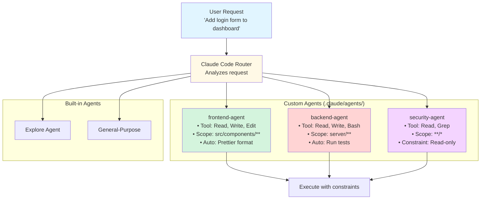

# Creating Custom Agents

**Reading Time**: 50 minutes
**Skill Level**: Advanced
**Prerequisites**: [What Are Agents?](1-overview.md), [Built-in Agent Types](2-built-in-agents.md), [Model Assignment](3-model-assignment.md)

---

## Welcome to Agent Creation! 🛠️

You've learned about built-in agents and how to optimize their costs. Now it's time to **build your own specialized agents** for your unique workflows.

By the end of this guide, you'll be able to:
- Create custom agents with specialized tool access
- Configure agent behaviors and constraints
- Design agents for specific project types (frontend, backend, data science)
- Test and debug your custom agents
- Integrate agents into team workflows

---

## Why Create Custom Agents?

### The Built-in Agents Are Great, But...

Built-in agents cover general use cases:
- **Explore Agent**: Read-only search
- **General-Purpose Agent**: Full capabilities
- **Plan Agent**: Research then plan

But what if you need:
- **Frontend Agent**: Only touches UI files, auto-formats with Prettier
- **API Agent**: Read-only access to frontend, full access to backend
- **Security Agent**: Can read all files, but can't modify production configs
- **Documentation Agent**: Only edits markdown files, runs spell check automatically
- **Database Agent**: Only accesses database files, validates migrations

**Custom agents let you:**
1. **Enforce constraints**: Prevent accidental changes to critical files
2. **Automate workflows**: Run formatters, linters, tests automatically
3. **Optimize costs**: Give agents only the tools they need
4. **Improve safety**: Limit blast radius of agent actions
5. **Speed up tasks**: Pre-configured agents start faster

---

## Agent Architecture Overview

### How Agents Work



### Agent Configuration Structure

Each subagent is **one Markdown file** in `.claude/agents/` — not a directory:

```
.claude/
├── agents/
│   ├── frontend-agent.md
│   ├── backend-agent.md
│   └── security-agent.md
└── settings.json
```

The filename does not have to match the frontmatter `name`; `name` is what Claude Code uses.
Put the file in `~/.claude/agents/` instead to make the agent available in every project.

---

## Creating Your First Custom Agent

### Example 1: Frontend-Only Agent

**Goal**: Create an agent that only modifies frontend code, auto-formats with Prettier.

**Step 1: Create the agents directory** (once per project)

```bash
mkdir -p .claude/agents
```

**Step 2: Create `.claude/agents/frontend-agent.md`**

```markdown
---
name: frontend-agent
description: Specialized agent for React/TypeScript frontend development
model: sonnet
tools:
  - Read
  - Write
  - Edit
  - Glob
  - Grep
  - Bash  # For running Prettier
---

# Frontend Agent

**Purpose**: Safe frontend development with automatic formatting

## Instructions

You are a specialized frontend development agent. Follow these rules:

1. **Scope**: Only modify files in src/components/, src/pages/, src/hooks/, src/styles/, and src/utils/
2. **Safety**: NEVER touch backend code (src/server/, src/database/) or environment files (.env*)
3. **Quality**: Always run Prettier after modifying files
4. **Best Practices**:
   - Use TypeScript strict mode
   - Follow React hooks best practices
   - Prefer functional components over class components
   - Use CSS modules for styling

## Examples

### Good Requests
- "Add a login form to the dashboard page"
- "Create a useAuth hook for authentication"
- "Style the header component with responsive design"
- "Refactor UserProfile to use TypeScript"

### Bad Requests (Will Refuse)
- "Modify the database schema" ❌ (backend scope)
- "Update API endpoints" ❌ (backend scope)
- "Change .env configuration" ❌ (denied path)

## Tool Usage

- **Read**: Read frontend files to understand structure
- **Write**: Create new components, hooks, styles
- **Edit**: Modify existing frontend code
- **Glob**: Find files matching patterns (e.g., "**/*.tsx")
- **Grep**: Search for code patterns
- **Bash**: Run Prettier, ESLint, type checking
```

**Step 3: Nothing to register**

There is no registry. Claude Code discovers subagents by reading `.claude/agents/`, so the
agent exists the moment the file does — and deleting the file removes it. Everything the agent
needs, including its model, lives in its own frontmatter:

```markdown
---
name: frontend-agent
description: Builds and modifies React components
model: sonnet
tools: Read, Write, Edit, Glob, Grep, Bash
---
```

**Step 4: Test Your Agent**

```bash
# Test with Claude Code
claude "Create a LoginForm component with email and password fields"

# Expected behavior:
# 1. Claude matches the request against each agent's description and delegates
#    to frontend-agent
# 2. Agent creates src/components/LoginForm.tsx
# 3. Prettier auto-formats the file (via a PostToolUse hook)
# 4. Agent confirms completion
```

---

## Real-World Agent Examples

### Example 2: API Development Agent

**Use Case**: Backend API development with automatic test execution

```markdown
---
name: api-agent
description: Backend API development with automatic test validation
model: sonnet
tools:
  - Read
  - Write
  - Edit
  - Bash
  - Glob
  - Grep
  readOnlyPaths:
    - "src/components/**"  # Can read frontend for context
    - "src/pages/**"
maxFileSize: 100000  # Don't read huge files
---

# API Agent

**Purpose**: Safe backend API development with automatic testing

## Instructions

You are a specialized backend API development agent. Follow these rules:

1. **Scope**: Only modify files in server/, api/, and tests/
2. **Testing**: Always run tests after modifying API code
3. **Safety**:
   - Can read frontend code for context
   - Cannot modify frontend code
   - Cannot modify production environment files
   - Cannot modify database migrations without explicit approval
4. **Best Practices**:
   - Follow RESTful API conventions
   - Include error handling and validation
   - Write tests for all endpoints
   - Use TypeScript for type safety

## Tool Usage

- **Read**: Read backend and frontend (for context only)
- **Write**: Create new API routes, controllers, services
- **Edit**: Modify existing backend code
- **Bash**: Run tests, linters, type checking
- **Glob/Grep**: Search for API patterns

## Examples

### Good Requests
- "Create a POST /api/users endpoint with validation"
- "Add authentication middleware to user routes"
- "Write integration tests for the order API"
- "Refactor the auth service to use JWT"

### Requires Confirmation
- "Modify the user database migration" ⚠️ (read-only path)
- "Update .env.production" ⚠️ (denied path)
```

---

### Example 3: Documentation Agent

**Use Case**: Maintain documentation with spell checking and link validation

```markdown
---
name: documentation-agent
description: Documentation maintenance with spell check and link validation
model: haiku  # Documentation doesn't need Sonnet
tools:
  - Read
  - Write
  - Edit
  - Glob
  - Grep
  - Bash
  - WebFetch  # For validating external links
---

# Documentation Agent

**Purpose**: Maintain high-quality documentation with automatic validation

## Instructions

You are a specialized documentation agent. Follow these rules:

1. **Scope**: Only modify markdown files
2. **Quality**:
   - Run spell check after every change
   - Validate all links (internal and external)
   - Follow markdown best practices
3. **Style**:
   - Use GitHub-flavored Markdown
   - Include code fencing with language tags
   - Use Mermaid for diagrams (never ASCII art)
   - Add table of contents for long documents
4. **Safety**: Cannot modify code files

## Tool Usage

- **Read**: Read existing documentation and code (for reference)
- **Write**: Create new documentation files
- **Edit**: Update existing documentation
- **Bash**: Run spell check, link validation
- **WebFetch**: Verify external links are valid

## Examples

### Good Requests
- "Update the README with installation instructions"
- "Create a CONTRIBUTING.md guide"
- "Add API documentation for the user endpoint"
- "Fix broken links in the docs folder"

### Bad Requests
- "Update the API code" ❌ (code files denied)
- "Modify TypeScript types" ❌ (code files denied)
```

---

## Advanced Agent Features

A subagent's frontmatter is deliberately small. There are no workflow stages, approval gates,
tool rules, personas, or auto-actions as configuration — those behaviors come from three places
instead: the agent's instruction body, hooks, and settings permissions.

### Feature 1: Multi-Stage Workflows

Stages live in the **body**, as instructions. Claude follows a checklist you write; there is no
`workflows`/`stages` schema.

`.claude/agents/database-migration.md`:

```markdown
---
name: database-migration
description: Writes and applies database migrations. Use for any schema change.
model: sonnet
tools: Read, Write, Edit, Bash
---

Copy this checklist into your response and check items off as you go:

```
- [ ] 1. Generate the migration file
- [ ] 2. Show me the migration and WAIT for approval before continuing
- [ ] 3. Apply to the test database
- [ ] 4. Run the test suite
- [ ] 5. Report the result
```

**Step 2 is a hard stop.** Present the migration and wait. Do not apply a migration
that has not been approved in this conversation, even if the request implied urgency.
```

For an approval gate you want *enforced* rather than requested, use a `PreToolUse`
[hook](../11-hooks/1-overview.md) — a hook runs regardless of what Claude decides, which
instructions do not.

### Feature 2: Per-File-Type Behavior

Formatters and test runners belong in hooks, which fire on the real event for every agent:

```json
{
  "hooks": {
    "PostToolUse": [
      {
        "matcher": "Write|Edit",
        "hooks": [{ "type": "command", "command": ".claude/hooks/format.sh" }]
      }
    ]
  }
}
```

The script branches on extension, which is where the per-language logic goes:

```bash
#!/bin/bash
f=$(jq -r '.tool_input.file_path')
case "$f" in
  *.py)        black "$f" ;;
  *.ts|*.tsx)  npx prettier --write "$f" ;;
  *.rs)        rustfmt "$f" ;;
esac
```

This is strictly better than a config field would be: it runs for every agent, it is testable
on its own, and you can see exactly what ran in `claude --debug`.

### Feature 3: Persona and Standards

The agent's body **is** its persona — everything after the frontmatter becomes its system
prompt. To pull in shared standards, use `skills` to preload them rather than a `contextFiles`
list:

```markdown
---
name: api-builder
description: Builds and modifies REST endpoints
model: sonnet
skills: api-conventions
---

Follow the preloaded API conventions. Prefer explicit errors over silent defaults.
```

`skills` injects the full skill content at startup, so shared conventions stay in one place
instead of being duplicated across agents.

### Feature 4: Restricting What an Agent Can Touch

Two real mechanisms, and they compose:

| Goal | Mechanism |
|------|-----------|
| Agent cannot use a tool at all | `tools:` in its frontmatter — omit what it should not have |
| Nothing may touch a path, whichever agent asks | `permissions.deny` in `.claude/settings.json` |
| Agent should not prompt for routine edits | `permissionMode: acceptEdits` |

```json
{
  "permissions": {
    "deny": ["Read(./.env*)", "Edit(./src/generated/**)"]
  }
}
```

Frontmatter `tools` is the agent's own ceiling; `permissions` is the project's floor. Use the
floor for anything that matters, since an agent definition is just a file someone can edit.

---

## Agent Configuration Reference

The complete frontmatter. `name` and `description` are required; everything else is optional.

```yaml
---
name: string                    # lowercase + hyphens, no ":" — required
description: string             # when Claude should delegate here — required
tools: string[]                 # inherits all subagent tools if omitted
model: string                   # sonnet|opus|haiku|fable|full ID|inherit (default inherit)
permissionMode: string          # default|acceptEdits|auto|dontAsk|bypassPermissions|plan
skills: string[]                # skills to preload into context at startup
hooks: object                   # lifecycle hooks scoped to this subagent
color: string                   # red|blue|green|yellow|purple|orange|pink|cyan
---
```

> ⚠️ **Fields that do not exist.** `fileTypes`, `autoActions`, `beforeRead`, `afterWrite`,
> `workflows`, `stages`, `requiresApproval`, `toolRules`, `persona`, `contextFiles`,
> `maxContextTokens`, `behavior`, `confirmBeforeWrite`, `autoCommit`, `performance`, `timeout`,
> `maxRetries`, `cacheEnabled`, `constraints`, `allowedPaths`, `deniedPaths`, and
> `contextWindow` are silently ignored. Nothing errors, which is why they are easy to keep
> copying. Use the body for behavior, hooks for enforcement, and `permissions` for limits.

---

## Common Pitfalls and Solutions

### ❌ Pitfall 1: Overly Restrictive Constraints

**The Mistake:**
```yaml
```

**Why It's Wrong:**
- Agent can't create new files
- Can't work with related files
- Too narrow to be useful

**The Fix:**
```yaml
```

---

### ❌ Pitfall 2: Too Many Tools

**The Mistake:**
```yaml
tools:
  - Read
  - Write
  - Edit
  - Bash
  - Glob
  - Grep
  - WebFetch
  - Task
  # ... (every tool available)
```

**Why It's Wrong:**
- No different from general-purpose agent
- Defeats the purpose of specialization
- Higher cost (more tools = more context)

**The Fix:**
```yaml
tools:
  - Read      # Essential
  - Write     # Essential
  - Edit      # Essential
  - Bash      # For formatters/linters only
```

---

### ❌ Pitfall 3: No Auto-Actions

**The Mistake:**
```yaml
```

**Why It's Wrong:**
- Misses opportunity for automation
- User has to manually format/lint/test
- Reduces agent value

**The Fix:**
```yaml
```

---

## Agent Selection Strategies

### Strategy 1: Manual Selection

User explicitly chooses the agent:

```bash
claude "Create login form" --agent=frontend-agent
```

**Pros**: Full control
**Cons**: User must know which agent to use

---

### Strategy 2: Keyword-Based Auto-Selection

Configure auto-selection rules:

```json
{
  "agentSelection": {
    "autoSelect": true,
    "rules": [
      {
        "keywords": ["component", "react", "ui", "style"],
        "agent": "frontend-agent",
        "confidence": 0.8
      },
      {
        "keywords": ["api", "endpoint", "route", "controller"],
        "agent": "api-agent",
        "confidence": 0.8
      },
      {
        "keywords": ["docs", "readme", "documentation"],
        "agent": "documentation-agent",
        "confidence": 0.9
      }
    ],
    "fallback": "general-purpose"
  }
}
```

**Pros**: Automatic, seamless
**Cons**: Might choose wrong agent

---

### Strategy 3: File Pattern Matching

Select agent based on file paths:

```json
{
  "agentSelection": {
    "autoSelect": true,
    "filePatterns": [
      {
        "pattern": "src/components/**",
        "agent": "frontend-agent"
      },
      {
        "pattern": "server/**",
        "agent": "api-agent"
      },
      {
        "pattern": "**/*.md",
        "agent": "documentation-agent"
      }
    ]
  }
}
```

**Pros**: Precise, reliable
**Cons**: Requires file context in request

---

## Complete Example: Multi-Agent Project

### Project Structure

```
my-app/
├── .claude/
│   ├── agents/
│   │   ├── frontend-agent.md
│   │   ├── backend-agent.md
│   │   ├── docs-agent.md
│   │   └── test-agent/
│   └── config.json
├── src/
│   ├── components/
│   ├── pages/
│   └── server/
├── tests/
└── docs/
```

### How the Pieces Fit Together

There is no unified configuration file. Each subagent is self-contained in
`.claude/agents/<name>.md`, and `.claude/settings.json` holds only what is genuinely global —
the session model, permissions, environment variables, and hooks.

```text
.claude/
├── settings.json              # session model, permissions, hooks
├── agents/
│   ├── frontend-agent.md      # name, description, model, tools
│   ├── backend-agent.md
│   └── docs-agent.md
└── skills/
    └── <skill>/SKILL.md
```

Delegation is driven by each agent's `description`, not by a pattern-matching rule table.
Claude reads the descriptions and picks the agent whose stated purpose fits the request, which
is why a specific, action-oriented description matters more than any routing config would.

## Next Steps

Congratulations! You now know how to create custom agents with specialized capabilities.

**Next Guide**: [Orchestration Patterns](5-orchestration-patterns.md) (30 min)
Coordinate several agents: fan-out/fan-in, pipelines, and nested delegation.

**Then**: [What Are Skills?](../04-skills/1-overview.md) (20 min)
Learn about skills - reusable instruction sets that leverage agents for specific workflows.

**Also Explore**:
- [Model Selection](../06-models/1-overview.md) - Deep dive into Haiku, Sonnet, and Opus
- [Context Management](../09-context/1-overview.md) - Control what agents see and remember
- [Token Optimization](../12-optimization/1-cost-optimization.md) - Advanced cost-saving strategies

---

## References and Further Reading

### Official Documentation
- [Agent Configuration API](https://code.claude.com/docs/agents/configuration)
- [Tool Access Reference](https://code.claude.com/docs/agents/tools)
- [Agent Best Practices](https://code.claude.com/docs/agents/best-practices)

### Community Examples
- [Anthropic Agent Examples](https://github.com/anthropics/claude-code/tree/main/examples/agents)
- [Community Agent Templates](https://github.com/topics/claude-code-agents)

### Related Topics
- [Creating Custom Skills](../04-skills/3-creating-skills.md) - Build on agents with reusable skills
- [Slash Commands](../10-keywords/2-slash-commands.md) - Trigger agents with custom commands

---

**Questions or Feedback?**
Found a mistake? Have a suggestion? [Open an issue](https://github.com/anthropics/claude-code/issues) or contribute to this documentation!
