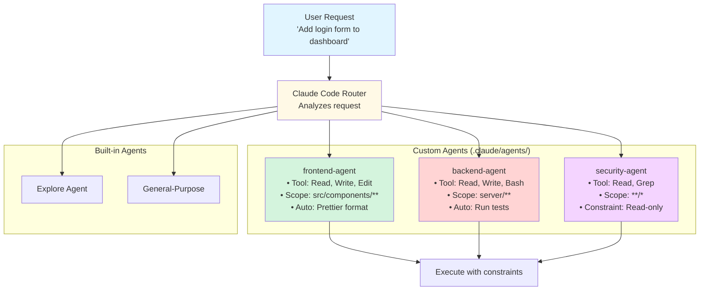

# Creating Custom Agents

**Reading Time**: 50 minutes
**Skill Level**: Advanced
**Prerequisites**: [What Are Agents?](1-overview.md), [Built-in Agent Types](2-built-in-agents.md), [Model Assignment](3-model-assignment.md)

---

## Welcome to Agent Creation! 🛠️

You've learned about built-in agents and how to optimize their costs. Now it's time to **build your own specialized agents** for your unique workflows.

By the end of this guide, you'll be able to:
- Create custom agents with specialized tool access
- Configure agent behaviors and constraints
- Design agents for specific project types (frontend, backend, data science)
- Test and debug your custom agents
- Integrate agents into team workflows

---

## Why Create Custom Agents?

### The Built-in Agents Are Great, But...

Built-in agents cover general use cases:
- **Explore Agent**: Read-only search
- **General-Purpose Agent**: Full capabilities
- **Plan Agent**: Research then plan

But what if you need:
- **Frontend Agent**: Only touches UI files, auto-formats with Prettier
- **API Agent**: Read-only access to frontend, full access to backend
- **Security Agent**: Can read all files, but can't modify production configs
- **Documentation Agent**: Only edits markdown files, runs spell check automatically
- **Database Agent**: Only accesses database files, validates migrations

**Custom agents let you:**
1. **Enforce constraints**: Prevent accidental changes to critical files
2. **Automate workflows**: Run formatters, linters, tests automatically
3. **Optimize costs**: Give agents only the tools they need
4. **Improve safety**: Limit blast radius of agent actions
5. **Speed up tasks**: Pre-configured agents start faster

---

## Agent Architecture Overview

### How Agents Work



### Agent Configuration Structure

Agents are defined in `.claude/agents/` directory:

```
.claude/
├── agents/
│   ├── frontend-agent/
│   │   └── AGENT.md
│   ├── backend-agent/
│   │   └── AGENT.md
│   └── security-agent/
│       └── AGENT.md
└── config.json
```

---

## Creating Your First Custom Agent

### Example 1: Frontend-Only Agent

**Goal**: Create an agent that only modifies frontend code, auto-formats with Prettier.

**Step 1: Create Agent Directory**

```bash
mkdir -p .claude/agents/frontend-agent
```

**Step 2: Create AGENT.md**

```markdown
# Frontend Agent

**Purpose**: Safe frontend development with automatic formatting

## Configuration

```yaml
name: frontend-agent
description: Specialized agent for React/TypeScript frontend development
model: sonnet
tools:
  - Read
  - Write
  - Edit
  - Glob
  - Grep
  - Bash  # For running Prettier
constraints:
  allowedPaths:
    - "src/components/**"
    - "src/pages/**"
    - "src/hooks/**"
    - "src/styles/**"
    - "src/utils/**"
  deniedPaths:
    - "src/server/**"
    - "src/database/**"
    - ".env*"
    - "config/**"
  fileTypes:
    - "*.tsx"
    - "*.ts"
    - "*.css"
    - "*.scss"
autoActions:
  afterWrite:
    - command: "npx prettier --write {file}"
      description: "Auto-format with Prettier"
  afterEdit:
    - command: "npx prettier --write {file}"
      description: "Auto-format with Prettier"
\```

## Instructions

You are a specialized frontend development agent. Follow these rules:

1. **Scope**: Only modify files in src/components/, src/pages/, src/hooks/, src/styles/, and src/utils/
2. **Safety**: NEVER touch backend code (src/server/, src/database/) or environment files (.env*)
3. **Quality**: Always run Prettier after modifying files
4. **Best Practices**:
   - Use TypeScript strict mode
   - Follow React hooks best practices
   - Prefer functional components over class components
   - Use CSS modules for styling

## Examples

### Good Requests
- "Add a login form to the dashboard page"
- "Create a useAuth hook for authentication"
- "Style the header component with responsive design"
- "Refactor UserProfile to use TypeScript"

### Bad Requests (Will Refuse)
- "Modify the database schema" ❌ (backend scope)
- "Update API endpoints" ❌ (backend scope)
- "Change .env configuration" ❌ (denied path)

## Tool Usage

- **Read**: Read frontend files to understand structure
- **Write**: Create new components, hooks, styles
- **Edit**: Modify existing frontend code
- **Glob**: Find files matching patterns (e.g., "**/*.tsx")
- **Grep**: Search for code patterns
- **Bash**: Run Prettier, ESLint, type checking
```

**Step 3: Nothing to register**

There is no registry. Claude Code discovers subagents by reading `.claude/agents/`, so the
agent exists the moment the file does — and deleting the file removes it. Everything the agent
needs, including its model, lives in its own frontmatter:

```markdown
---
name: frontend-agent
description: Builds and modifies React components
model: sonnet
tools: Read, Write, Edit, Glob, Grep, Bash
---
```

**Step 4: Test Your Agent**

```bash
# Test with Claude Code
claude "Create a LoginForm component with email and password fields"

# Expected behavior:
# 1. Claude matches the request against each agent's description and delegates
#    to frontend-agent
# 2. Agent creates src/components/LoginForm.tsx
# 3. Prettier auto-formats the file (via a PostToolUse hook)
# 4. Agent confirms completion
```

---

## Real-World Agent Examples

### Example 2: API Development Agent

**Use Case**: Backend API development with automatic test execution

```markdown
# API Agent

**Purpose**: Safe backend API development with automatic testing

## Configuration

```yaml
name: api-agent
description: Backend API development with automatic test validation
model: sonnet
tools:
  - Read
  - Write
  - Edit
  - Bash
  - Glob
  - Grep
constraints:
  allowedPaths:
    - "server/**"
    - "api/**"
    - "tests/**"
  deniedPaths:
    - "src/components/**"  # Don't modify frontend
    - ".env.production"     # Don't touch prod config
    - "database/migrations/**"  # Migrations need review
  readOnlyPaths:
    - "src/components/**"  # Can read frontend for context
    - "src/pages/**"
maxFileSize: 100000  # Don't read huge files
autoActions:
  afterWrite:
    - command: "npm run test -- {file}.test.ts"
      description: "Run tests for modified file"
      continueOnError: true
  beforeWrite:
    - command: "npm run lint -- {file}"
      description: "Lint before writing"
\```

## Instructions

You are a specialized backend API development agent. Follow these rules:

1. **Scope**: Only modify files in server/, api/, and tests/
2. **Testing**: Always run tests after modifying API code
3. **Safety**:
   - Can read frontend code for context
   - Cannot modify frontend code
   - Cannot modify production environment files
   - Cannot modify database migrations without explicit approval
4. **Best Practices**:
   - Follow RESTful API conventions
   - Include error handling and validation
   - Write tests for all endpoints
   - Use TypeScript for type safety

## Tool Usage

- **Read**: Read backend and frontend (for context only)
- **Write**: Create new API routes, controllers, services
- **Edit**: Modify existing backend code
- **Bash**: Run tests, linters, type checking
- **Glob/Grep**: Search for API patterns

## Examples

### Good Requests
- "Create a POST /api/users endpoint with validation"
- "Add authentication middleware to user routes"
- "Write integration tests for the order API"
- "Refactor the auth service to use JWT"

### Requires Confirmation
- "Modify the user database migration" ⚠️ (read-only path)
- "Update .env.production" ⚠️ (denied path)
```

---

### Example 3: Documentation Agent

**Use Case**: Maintain documentation with spell checking and link validation

```markdown
# Documentation Agent

**Purpose**: Maintain high-quality documentation with automatic validation

## Configuration

```yaml
name: documentation-agent
description: Documentation maintenance with spell check and link validation
model: haiku  # Documentation doesn't need Sonnet
tools:
  - Read
  - Write
  - Edit
  - Glob
  - Grep
  - Bash
  - WebFetch  # For validating external links
constraints:
  allowedPaths:
    - "**/*.md"
    - "docs/**"
    - "README.md"
    - "CONTRIBUTING.md"
  deniedPaths:
    - "**/*.ts"
    - "**/*.tsx"
    - "**/*.js"
    - "**/*.py"
autoActions:
  afterWrite:
    - command: "npx cspell {file}"
      description: "Spell check"
      continueOnError: true
    - command: "npx markdown-link-check {file}"
      description: "Validate links"
      continueOnError: true
  afterEdit:
    - command: "npx cspell {file}"
      description: "Spell check"
      continueOnError: true
\```

## Instructions

You are a specialized documentation agent. Follow these rules:

1. **Scope**: Only modify markdown files
2. **Quality**:
   - Run spell check after every change
   - Validate all links (internal and external)
   - Follow markdown best practices
3. **Style**:
   - Use GitHub-flavored Markdown
   - Include code fencing with language tags
   - Use Mermaid for diagrams (never ASCII art)
   - Add table of contents for long documents
4. **Safety**: Cannot modify code files

## Tool Usage

- **Read**: Read existing documentation and code (for reference)
- **Write**: Create new documentation files
- **Edit**: Update existing documentation
- **Bash**: Run spell check, link validation
- **WebFetch**: Verify external links are valid

## Examples

### Good Requests
- "Update the README with installation instructions"
- "Create a CONTRIBUTING.md guide"
- "Add API documentation for the user endpoint"
- "Fix broken links in the docs folder"

### Bad Requests
- "Update the API code" ❌ (code files denied)
- "Modify TypeScript types" ❌ (code files denied)
```

---

## Advanced Agent Features

### Feature 1: Multi-Stage Workflows

Agents can have multi-stage workflows with approval gates:

```yaml
name: database-migration-agent
workflows:
  createMigration:
    stages:
      - name: generate
        description: "Generate migration file"
        tools: [Write]
        autoActions:
          - command: "npm run migration:generate -- {file}"

      - name: review
        description: "Review migration"
        requiresApproval: true
        prompt: "Review the migration. Continue?"

      - name: test
        description: "Test on local database"
        tools: [Bash]
        commands:
          - "npm run migration:run -- --env=test"
          - "npm run test:integration"

      - name: approve
        description: "Final approval"
        requiresApproval: true
        prompt: "Migration tested successfully. Apply to dev?"
```

### Feature 2: Context-Aware Tool Selection

Agents can dynamically select tools based on file type:

```yaml
name: polyglot-agent
toolRules:
  - filePattern: "**/*.py"
    tools: [Read, Write, Edit, Bash]
    autoActions:
      - command: "black {file}"  # Python formatter
      - command: "pytest {file}"

  - filePattern: "**/*.ts"
    tools: [Read, Write, Edit, Bash]
    autoActions:
      - command: "npx prettier --write {file}"
      - command: "npm run test -- {file}"

  - filePattern: "**/*.rs"
    tools: [Read, Write, Edit, Bash]
    autoActions:
      - command: "rustfmt {file}"
      - command: "cargo test"
```

### Feature 3: Custom Prompts and Personas

Agents can have specialized prompts:

```yaml
name: test-driven-agent
persona: |
  You are a Test-Driven Development (TDD) specialist. You ALWAYS:

  1. **Write tests first** before implementation
  2. **Run tests** to confirm they fail (red)
  3. **Implement** the minimum code to pass tests (green)
  4. **Refactor** while keeping tests green
  5. **Document** test coverage and edge cases

  Never write implementation code without tests.
  Never commit failing tests.
  Always explain your TDD approach.

autoActions:
  beforeWrite:
    - prompt: "Have you written tests first?"
      requireConfirmation: true
  afterWrite:
    - command: "npm run test -- {file}"
      mustPass: true  # Fail if tests don't pass
```

---

## Agent Configuration Reference

### Complete AGENT.md Schema

```yaml
# Required Fields
name: string                    # Agent identifier (e.g., "frontend-agent")
description: string             # Human-readable description
model: "haiku" | "sonnet" | "opus"  # Default model

# Tool Access
tools:                          # Array of allowed tools
  - Read
  - Write
  - Edit
  - Bash
  - Glob
  - Grep
  - WebFetch
  - Task

# Path Constraints
constraints:
  allowedPaths:                 # Glob patterns for allowed paths
    - "src/**"
    - "tests/**"
  deniedPaths:                  # Glob patterns for denied paths
    - ".env*"
    - "node_modules/**"
  readOnlyPaths:                # Can read but not modify
    - "config/**"
  maxFileSize: number           # Max file size in bytes (default: 1MB)
  maxFilesPerOperation: number  # Max files to modify at once

# Automatic Actions
autoActions:
  beforeRead:
    - command: string
      description: string
  afterRead:
    - command: string
  beforeWrite:
    - command: string
      requireConfirmation: boolean
  afterWrite:
    - command: string
      continueOnError: boolean
      mustPass: boolean
  beforeEdit:
    - command: string
  afterEdit:
    - command: string

# Workflows (Advanced)
workflows:
  workflowName:
    stages:
      - name: string
        description: string
        tools: string[]
        requiresApproval: boolean
        commands: string[]
        prompt: string

# Context and Persona
persona: string                 # Agent persona/instructions
contextFiles:                   # Files to include in agent context
  - "ARCHITECTURE.md"
  - "CODING_STANDARDS.md"
maxContextTokens: number        # Max tokens for context (default: 8000)

# Behavior
behavior:
  confirmBeforeWrite: boolean   # Require confirmation before writing
  confirmBeforeBash: boolean    # Require confirmation before bash
  autoCommit: boolean           # Auto-commit changes
  commitMessage: string         # Template for commit messages

# Performance
performance:
  timeout: number               # Timeout in milliseconds
  maxRetries: number            # Max retries on failure
  cacheEnabled: boolean         # Enable response caching
```

---

## Testing Your Custom Agents

### Test Plan Template

Create `.claude/agents/your-agent/TESTS.md`:

```markdown
# Agent Test Plan: Frontend Agent

## Test 1: Basic Component Creation
**Request**: "Create a Button component"
**Expected**:
- File created at src/components/Button.tsx
- Prettier auto-formats
- TypeScript types included
**Actual**: ✅ Pass

## Test 2: Path Constraint Enforcement
**Request**: "Modify server/api/users.ts"
**Expected**: Agent refuses (outside allowed paths)
**Actual**: ✅ Pass

## Test 3: Auto-Formatting
**Request**: "Create UserCard component"
**Expected**:
- Component created
- Prettier runs automatically
- Code is properly formatted
**Actual**: ✅ Pass

## Test 4: Read-Only Access
**Request**: "Read server/database/schema.sql for context"
**Expected**: Agent can read but not modify
**Actual**: ✅ Pass
```

### Automated Testing Script

```bash
#!/bin/bash
# test-agent.sh

echo "Testing frontend-agent..."

# Test 1: Create component (should succeed)
claude "Create a TestButton component" --agent=frontend-agent
if [ -f "src/components/TestButton.tsx" ]; then
  echo "✅ Test 1: Component creation - PASS"
else
  echo "❌ Test 1: Component creation - FAIL"
fi

# Test 2: Modify backend (should fail)
claude "Modify server/api/users.ts" --agent=frontend-agent 2>&1 | grep -q "denied"
if [ $? -eq 0 ]; then
  echo "✅ Test 2: Path constraint - PASS"
else
  echo "❌ Test 2: Path constraint - FAIL"
fi

# Test 3: Formatting (should auto-run)
claude "Create a TestCard component" --agent=frontend-agent
grep -q "prettier" .claude/logs/latest.log
if [ $? -eq 0 ]; then
  echo "✅ Test 3: Auto-formatting - PASS"
else
  echo "❌ Test 3: Auto-formatting - FAIL"
fi

# Cleanup
rm -f src/components/TestButton.tsx src/components/TestCard.tsx

echo "Tests complete!"
```

---

## Common Pitfalls and Solutions

### ❌ Pitfall 1: Overly Restrictive Constraints

**The Mistake:**
```yaml
constraints:
  allowedPaths:
    - "src/components/Button.tsx"  # Only one specific file!
```

**Why It's Wrong:**
- Agent can't create new files
- Can't work with related files
- Too narrow to be useful

**The Fix:**
```yaml
constraints:
  allowedPaths:
    - "src/components/**"  # All components
    - "src/styles/**"      # Styles
```

---

### ❌ Pitfall 2: Too Many Tools

**The Mistake:**
```yaml
tools:
  - Read
  - Write
  - Edit
  - Bash
  - Glob
  - Grep
  - WebFetch
  - Task
  # ... (every tool available)
```

**Why It's Wrong:**
- No different from general-purpose agent
- Defeats the purpose of specialization
- Higher cost (more tools = more context)

**The Fix:**
```yaml
tools:
  - Read      # Essential
  - Write     # Essential
  - Edit      # Essential
  - Bash      # For formatters/linters only
```

---

### ❌ Pitfall 3: No Auto-Actions

**The Mistake:**
```yaml
# No autoActions defined
```

**Why It's Wrong:**
- Misses opportunity for automation
- User has to manually format/lint/test
- Reduces agent value

**The Fix:**
```yaml
autoActions:
  afterWrite:
    - command: "npx prettier --write {file}"
    - command: "npm run lint -- {file}"
  afterEdit:
    - command: "npm test -- {file}.test.ts"
      continueOnError: true
```

---

## Agent Selection Strategies

### Strategy 1: Manual Selection

User explicitly chooses the agent:

```bash
claude "Create login form" --agent=frontend-agent
```

**Pros**: Full control
**Cons**: User must know which agent to use

---

### Strategy 2: Keyword-Based Auto-Selection

Configure auto-selection rules:

```json
{
  "agentSelection": {
    "autoSelect": true,
    "rules": [
      {
        "keywords": ["component", "react", "ui", "style"],
        "agent": "frontend-agent",
        "confidence": 0.8
      },
      {
        "keywords": ["api", "endpoint", "route", "controller"],
        "agent": "api-agent",
        "confidence": 0.8
      },
      {
        "keywords": ["docs", "readme", "documentation"],
        "agent": "documentation-agent",
        "confidence": 0.9
      }
    ],
    "fallback": "general-purpose"
  }
}
```

**Pros**: Automatic, seamless
**Cons**: Might choose wrong agent

---

### Strategy 3: File Pattern Matching

Select agent based on file paths:

```json
{
  "agentSelection": {
    "autoSelect": true,
    "filePatterns": [
      {
        "pattern": "src/components/**",
        "agent": "frontend-agent"
      },
      {
        "pattern": "server/**",
        "agent": "api-agent"
      },
      {
        "pattern": "**/*.md",
        "agent": "documentation-agent"
      }
    ]
  }
}
```

**Pros**: Precise, reliable
**Cons**: Requires file context in request

---

## Complete Example: Multi-Agent Project

### Project Structure

```
my-app/
├── .claude/
│   ├── agents/
│   │   ├── frontend-agent/
│   │   │   └── AGENT.md
│   │   ├── backend-agent/
│   │   │   └── AGENT.md
│   │   ├── docs-agent/
│   │   │   └── AGENT.md
│   │   └── test-agent/
│   │       └── AGENT.md
│   └── config.json
├── src/
│   ├── components/
│   ├── pages/
│   └── server/
├── tests/
└── docs/
```

### How the Pieces Fit Together

There is no unified configuration file. Each subagent is self-contained in
`.claude/agents/<name>.md`, and `.claude/settings.json` holds only what is genuinely global —
the session model, permissions, environment variables, and hooks.

```text
.claude/
├── settings.json              # session model, permissions, hooks
├── agents/
│   ├── frontend-agent.md      # name, description, model, tools
│   ├── backend-agent.md
│   └── docs-agent.md
└── skills/
    └── <skill>/SKILL.md
```

Delegation is driven by each agent's `description`, not by a pattern-matching rule table.
Claude reads the descriptions and picks the agent whose stated purpose fits the request, which
is why a specific, action-oriented description matters more than any routing config would.

## Next Steps

Congratulations! You now know how to create custom agents with specialized capabilities.

**Next Guide**: [Orchestration Patterns](5-orchestration-patterns.md) (30 min)
Coordinate several agents: fan-out/fan-in, pipelines, and nested delegation.

**Then**: [What Are Skills?](../04-skills/1-overview.md) (20 min)
Learn about skills - reusable instruction sets that leverage agents for specific workflows.

**Also Explore**:
- [Model Selection](../06-models/1-overview.md) - Deep dive into Haiku, Sonnet, and Opus
- [Context Management](../09-context/1-overview.md) - Control what agents see and remember
- [Token Optimization](../12-optimization/1-cost-optimization.md) - Advanced cost-saving strategies

---

## References and Further Reading

### Official Documentation
- [Agent Configuration API](https://code.claude.com/docs/agents/configuration)
- [Tool Access Reference](https://code.claude.com/docs/agents/tools)
- [Agent Best Practices](https://code.claude.com/docs/agents/best-practices)

### Community Examples
- [Anthropic Agent Examples](https://github.com/anthropics/claude-code/tree/main/examples/agents)
- [Community Agent Templates](https://github.com/topics/claude-code-agents)

### Related Topics
- [Creating Custom Skills](../04-skills/3-creating-skills.md) - Build on agents with reusable skills
- [Slash Commands](../10-keywords/2-slash-commands.md) - Trigger agents with custom commands

---

**Questions or Feedback?**
Found a mistake? Have a suggestion? [Open an issue](https://github.com/anthropics/claude-code/issues) or contribute to this documentation!
