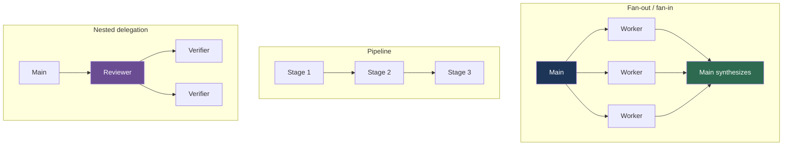

# Orchestration Patterns

**Reading Time**: 30 minutes
**Skill Level**: Advanced
**Prerequisites**: [What Are Agents?](1-overview.md), [Custom Agents](4-custom-agents.md), [Context Engineering](../09-context/4-context-engineering.md)

---

## From One Loop to Many Nodes

Most work with Claude Code is a single loop: you ask, Claude reads and edits and runs things,
you review. One agent, one context, one thread of reasoning. This handles the large majority of
tasks and you should not reach past it without a reason.

Some work does not fit that shape. When a task splits into parts that are genuinely independent,
or when different parts want different models, tools, or permissions, you are no longer
designing a loop — you are designing a **topology**. Which units of work exist, which run
concurrently, what each one receives, and what it hands back.

That design activity has picked up a name: **graph engineering** — the practice of arranging
multiple agents or steps as a graph, where nodes do work, edges route between them, and state
flows along the edges. The contrast is with **loop engineering**, which designs how a single
node executes.

The relationship is worth stating plainly, because it is easy to over-read:

> A loop is one node. A graph is several. Every node in a graph is still a loop.

Graph engineering does not replace loop engineering, and adopting the vocabulary does not mean
your problems need graphs. The useful question it prompts is just: **how many nodes does this
task actually have?** For most tasks, the honest answer is one.

### A naming collision worth clearing up

"Graph" appears in two unrelated conversations about AI systems:

| Term | What it models | Relevant here? |
|------|---------------|----------------|
| **Graph engineering** / task graphs | Execution — which agent runs next and what state it gets | Yes, this guide |
| **Knowledge graphs** / GraphRAG | Data — entities and relations, for retrieval | No, different problem |

They share a word and nothing else. This guide is entirely about execution topology.

---

## What Claude Code Actually Provides

Claude Code is not a graph orchestration engine. There is no graph definition file, no node
registry, and no built-in checkpoint-and-resume across a multi-agent run. What it provides is a
delegation primitive — subagents — plus enough control over concurrency and nesting to build
real topologies out of it.

Knowing the actual limits matters, because they bound what shapes are practical:

| Limit | Default | Override |
|-------|---------|----------|
| Subagents spawned per session | 200 | `CLAUDE_CODE_MAX_SUBAGENTS_PER_SESSION` |
| Concurrently running subagents | 20 | `CLAUDE_CODE_MAX_CONCURRENT_SUBAGENTS` |
| Nesting depth below the main conversation | 3 layers | `CLAUDE_CODE_MAX_SUBAGENT_SPAWN_DEPTH` |

Environment variables go in the `env` block of settings.json:

```json
{
  "env": {
    "CLAUDE_CODE_MAX_SUBAGENT_SPAWN_DEPTH": "2"
  }
}
```

Three behaviors worth internalizing:

- **Finished subagents still count** toward the per-session total. `/clear` resets it.
- **At the depth limit**, Claude Code withholds the Agent tool from subagents, so a subagent
  that would have delegated instead does the work itself and returns one summary. The topology
  silently flattens rather than failing.
- **Hitting the concurrent limit** fails the spawn with `Concurrent subagent limit reached` and
  tells Claude not to retry. Design fan-out widths below the limit rather than relying on
  queueing.

---

## The Patterns



---

### Pattern 1: Fan-Out / Fan-In

**Use when** several pieces of work are independent and you need all the answers before
deciding anything.

The wins are two: wall-clock time, because the pieces run concurrently, and context, because
each worker reads in its own window and returns only a conclusion.

```text
Audit our API surface for auth gaps. Split it by area and run those in parallel:
  - authentication middleware
  - session handling
  - permission checks on write endpoints
Then reconcile the findings and tell me which gaps are real.
```

**Design notes:**

- **Partition so the parts do not overlap.** Overlapping workers duplicate reads and produce
  contradictory findings you then have to arbitrate.
- **Keep the width under the concurrency limit.** Twelve workers is fine; forty will start
  failing spawns.
- **Fan-in is where the reasoning happens.** The workers gather; the main conversation decides.
  Do not push the judgment into the workers, because each sees only its own slice.

**Anti-use:** if the parts are not actually independent — if part 2 needs part 1's answer — this
is a pipeline, not a fan-out. Running them concurrently just means part 2 works from a guess.

---

### Pattern 2: Pipeline

**Use when** each stage genuinely depends on the previous one's output.

```text
Migrate the legacy date handling:
1. Find every call site (report paths and line numbers)
2. For each, classify whether it needs the timezone-aware variant
3. Apply the change to the timezone-aware ones only
4. Run the test suite and report failures
```

A pipeline is the shape most people over-reach for. Before building one, check whether the
stages are really sequential or whether you assumed sequence out of habit. Stage 1 producing a
list and stage 2 processing each item independently means stage 2 is a fan-out, and the pipeline
is only two nodes deep.

**The useful discipline** is to make the hand-off between stages explicit and small. A stage
that returns "here is everything I read" defeats the purpose; a stage that returns a list of
paths and classifications does not.

---

### Pattern 3: Supervisor Delegation

**Use when** you have several specialized agents and want the right one chosen per task.

This is the pattern people most often try to build with a routing table, and it is already
built in. Claude matches a request against each subagent's `description` and delegates
accordingly. There is no rule engine, no keyword patterns, and no confidence thresholds —
**the description *is* the routing logic.**

Which means routing quality is description quality:

```yaml
# Routes reliably — states the work and the trigger
description: Reviews database migrations for destructive operations and missing rollbacks. Use before applying any migration.

# Routes unpredictably — no action, no trigger
description: Helps with databases
```

When delegation goes to the wrong agent, fix the descriptions before reaching for anything more
elaborate. Overlapping descriptions are the usual cause.

---

### Pattern 4: Nested Delegation

**Use when** a delegated task itself splits into parallel subtasks, and you want the
intermediate output kept away from your main conversation.

The canonical shape is a reviewer that dispatches a verifier per finding:

```text
Main conversation
└── code-reviewer subagent
    ├── verifier subagent  (finding 1: is this real?)
    ├── verifier subagent  (finding 2: is this real?)
    └── verifier subagent  (finding 3: is this real?)
```

**Only the top-level subagent's summary reaches you.** Every candidate finding, every
verification transcript, and every rejected false positive stays in the intermediate windows.
You get the confirmed findings.

This is the strongest context play available, and it is why the three-layer default depth is
usually plenty. If you find yourself wanting more layers, that is often a sign the work should
be several sequential top-level delegations instead.

---

### Pattern 5: Verify Before Trusting

**Use when** a plausible-but-wrong answer is expensive.

A single agent that finds problems and also judges its own findings has an obvious conflict.
Splitting the roles helps:

```text
Find the race condition in the request handler. Then, separately, try to
disprove the explanation — if the mechanism you propose cannot actually
produce the symptom, say so rather than defending it.
```

Two refinements worth knowing:

- **Prompt the verifier to refute, not to confirm.** A verifier asked "is this right?" tends to
  agree. Asked to find the flaw, it looks for one.
- **Give multiple verifiers different lenses** when a finding can fail in more than one way —
  correctness, security, does-it-reproduce. Diverse perspectives catch failure modes that three
  identical checks will not.

---

## Where Claude Code Stops

The patterns above are all achievable with the delegation primitive. Several things people
expect from graph frameworks are not part of it:

| Not available | Implication |
|---------------|-------------|
| Declarative graph definition | Topology lives in your prompt or a skill, not a config file |
| Checkpoint and resume mid-graph | A failed multi-agent run restarts; use git commits and a progress file for durable state |
| Typed shared state with reducers | State passes as text in prompts and summaries |
| Conditional edges as first-class objects | Branching is Claude's judgment, not a routed transition |

**For deterministic control flow** — loops, conditionals, fan-out you specify rather than
request — Claude Code has workflows, which run a script that orchestrates subagents with
explicit `parallel()` and `pipeline()` stages. That is the right tool when you need the topology
guaranteed rather than inferred.

**For genuine graph execution** with persistence, resumption, and human-in-the-loop
interruption, use a purpose-built framework — the Claude Agent SDK for custom agents, or a graph
runtime such as LangGraph, whose checkpointers save state at each step and support interruption,
resumption, history inspection, and recovery.

Do not try to reconstruct these in a prompt. A prompt that describes a checkpointed graph does
not produce one; it produces an agent that has read a description of a checkpointed graph.

---

## Related Multi-Agent Features

Two features go beyond single-session delegation:

**Agent teams** spawn multiple Claude Code instances that can communicate. They are disabled by
default and enabled with `CLAUDE_CODE_EXPERIMENTAL_AGENT_TEAMS=1`. Note the cost: each teammate
maintains its own context window, and teams use roughly **7x the tokens** of a standard session
when teammates run in plan mode. Keep teams small, keep tasks self-contained, and shut teammates
down when their work is done.

**Background agents** run many independent sessions in parallel, monitored from one place. Use
these when the sessions genuinely do not need to talk to each other.

---

## Failure Modes

**Orchestrating a one-node problem.** The most common mistake. Delegation costs a spawn, a
prompt, and a summary round-trip. For a task one loop handles, that is pure overhead plus a
layer of telephone.

**Partitioning into overlapping parts.** Workers duplicate reads and return contradictory
findings, and now you are arbitrating instead of deciding.

**Fat hand-offs.** A stage or worker that returns everything it read cancels the context benefit
that motivated the delegation.

**Silent flattening at the depth limit.** At maximum depth, subagents lose the Agent tool and do
the work themselves. The run succeeds, the topology is not what you designed, and nothing
announces the difference.

**Assuming parallel means independent.** Running dependent work concurrently does not remove the
dependency; it just means the later stage proceeds from a guess.

**Trusting a self-graded result.** An agent that both produces and evaluates its own findings
will rate them generously.

---

## Choosing a Shape

| Situation | Shape |
|-----------|-------|
| One coherent task | Single loop — no delegation |
| Read-heavy exploration, need the conclusion | One subagent |
| Independent parts, need all answers | Fan-out / fan-in |
| Each step needs the previous step's output | Pipeline |
| Several specialized agents, varying tasks | Supervisor delegation via descriptions |
| Delegated task splits again; keep intermediates out | Nested delegation |
| A wrong answer is expensive | Verify with a refutation prompt |
| Topology must be guaranteed, not inferred | A workflow script |
| Need persistence, resumption, human-in-the-loop | Agent SDK or a graph runtime |

---

## Key Takeaways

✅ **Ask how many nodes the task has** — for most tasks the answer is one, and a single loop wins
✅ **Graph engineering is about execution topology**, not knowledge graphs or GraphRAG
✅ **Descriptions are the routing logic** — no rule engine exists, so fix descriptions first
✅ **Nested delegation is the strongest context play** — only the top-level summary returns
✅ **Know the real limits** — 200 per session, 20 concurrent, 3 layers deep, all overridable
✅ **Claude Code has no resumable graph engine** — use workflows for deterministic control flow, or a purpose-built framework for persistence

---

## Next Steps

- [Loops and Scheduling](6-loops-and-scheduling.md) — the other half of this framing: how a single node keeps going
- [Context Engineering](../09-context/4-context-engineering.md) — the context economics that make delegation worth it
- [Custom Agents](4-custom-agents.md) — defining the nodes
- [Skills Overview](../04-skills/1-overview.md) — packaging a topology as a reusable workflow
- [Cost Optimization](../12-optimization/1-cost-optimization.md) — what fan-out costs

---

**Questions or Feedback?**
[Open an issue](https://github.com/anthropics/claude-code/issues)
