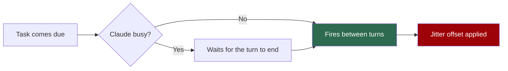

# Loops and Scheduling

**Reading Time**: 30 minutes
**Skill Level**: Intermediate to Advanced
**Prerequisites**: [What Are Agents?](1-overview.md), [Orchestration Patterns](5-orchestration-patterns.md)

---

## The Loop You Are Already In

Every Claude Code session is a loop. You prompt, Claude gathers what it needs, acts, observes
the result, and either acts again or hands control back to you. A turn ends when Claude judges
the work done.

That last clause is the interesting one, because **you** are the thing that restarts the loop.
Claude finishes, you look at the result, you type the next prompt. For most work that is
exactly right. For some work it is the bottleneck: you end up babysitting a build, retyping
"check again", or watching a queue you could have been away from.

The features in this guide all answer the same question — **what starts the next turn?** — and
they answer it differently:

| Approach | Next turn starts when | Stops when |
|----------|----------------------|------------|
| **You** (default) | You send a prompt | You stop typing |
| **`/goal`** | The previous turn finishes | A model confirms your condition is met |
| **`/loop`** | A time interval elapses | You stop it, or Claude decides the work is done |
| **Stop hook** | The previous turn finishes | Your own script or prompt decides |

This is the counterpart to [Orchestration Patterns](5-orchestration-patterns.md). That guide is
about **how many nodes** your problem has. This one is about **how a single node keeps going**.

---

## Condition-Driven: `/goal`

**Use when** the work has a verifiable end state and you do not know how many turns it will
take to get there.

```text
/goal all tests in test/auth pass and the lint step is clean
```

Setting a goal starts a turn immediately, using the condition itself as the directive. After
each turn a separate evaluator checks whether the condition holds. If not, Claude starts
another turn. If it does, the goal clears itself and Claude hands control back.

While it runs, a `◎ /goal active` indicator shows how long it has been going.

Good candidates share a shape: a migration until every call site compiles, a design doc until
all acceptance criteria hold, a file split until each module is under a size budget, an issue
backlog until the queue is empty.

### Writing a condition that works

This is where goals succeed or fail, and it depends on one mechanic:

> **The evaluator does not run commands or read files.** It judges the condition against what
> Claude has already surfaced in the conversation.

So the condition must be something Claude's own output can demonstrate. "All tests in
`test/auth` pass" works because Claude runs the tests and the result lands in the transcript.
"The code is well factored" does not, because nothing in the transcript settles it.

A condition that holds up over many turns usually has three parts:

| Part | Example |
|------|---------|
| **One measurable end state** | a test result, a build exit code, a file count, an empty queue |
| **A stated check** | "`npm test` exits 0", "`git status` is clean" |
| **Constraints that must hold** | "no other test file is modified" |

Conditions can be up to 4,000 characters. To bound the run, put a limit in the condition
itself — `or stop after 20 turns` — and Claude reports progress against it each turn.

### Managing a goal

```text
/goal              # status: condition, duration, turns evaluated, tokens, last reason
/goal clear        # remove an active goal (aliases: stop, off, reset, none, cancel)
```

The evaluator returns a short reason each turn explaining why the condition is or is not met,
and that reason becomes guidance for the next turn. It shows in the status view and the
transcript, so you can see what Claude is working toward rather than guessing.

One goal is active per session; setting a new one replaces it. `/clear` also removes it. A goal
still active when a session ends is restored by `--resume` or `--continue`, though the turn
count, timer, and token baseline reset.

### Running unattended

**A goal does not change permissions.** In the default permission mode Claude still stops to
ask before tool calls your settings do not already allow — which means an unattended goal
stalls on the first prompt. Pair it with auto mode so each turn runs through.

Non-interactively, a goal runs to completion in one invocation:

```bash
claude -p "/goal CHANGELOG.md has an entry for every PR merged this week"
```

With default text output nothing prints until the condition is met, so a long goal looks hung.
Add `--output-format stream-json --verbose` to watch it work. Ctrl+C stops it.

### How evaluation actually works

`/goal` is a wrapper around a session-scoped, prompt-based **Stop hook**. After each turn,
Claude Code sends your condition plus the conversation to the configured small fast model
(Haiku by default on the Claude API), which answers yes or no with a reason.

Two consequences worth knowing:

- **It requires the hooks system.** `/goal` is unavailable in an untrusted workspace, and when
  `disableAllHooks` or `allowManagedHooksOnly` is set. It tells you why rather than silently
  doing nothing.
- **Evaluation tokens are cheap** — they run on the small fast model and are usually negligible
  next to the turns themselves.

If you need evaluation logic the model can't express — a real command exit code, a database
check — write your own [Stop hook](../11-hooks/1-overview.md) instead. That is what `/goal`
is built on, and a script-based hook can check things the evaluator cannot see.

---

## Interval-Driven: `/loop`

**Use when** you are waiting on something external and want to check back periodically.

`/loop` behaves differently depending on what you give it:

| You provide | Example | What happens |
|-------------|---------|--------------|
| Interval and prompt | `/loop 5m check the deploy` | Runs on a fixed cron schedule |
| Prompt only | `/loop check the deploy` | Claude picks each delay dynamically |
| Neither | `/loop` | Runs the built-in maintenance prompt, or your `loop.md` |

### Fixed interval

```text
/loop 5m check if the deployment finished and tell me what happened
```

The interval can lead as a bare token (`30m`) or trail as a clause (`every 2 hours`). Units are
`s`, `m`, `h`, `d`. Seconds round up to the nearest minute, since cron has one-minute
granularity, and intervals that do not map cleanly — `7m`, `90m` — are rounded to one that
does, with Claude telling you what it picked.

### Dynamic interval

Omit the interval and Claude chooses each delay itself, between one minute and one hour, based
on what it just observed: short waits while a build is finishing, longer once things go quiet.
It prints the delay and its reason at the end of each iteration.

```text
/loop check whether CI passed and address any review comments
```

This is usually the better default for anything whose pace varies. A fixed five-minute poll on
a job that takes forty minutes spends seven wasted iterations getting there.

### The built-in maintenance prompt

A bare `/loop` runs a built-in prompt that works through, in order:

1. Continue any unfinished work from the conversation
2. Tend the current branch's PR — review comments, failed CI, merge conflicts
3. Run cleanup passes such as bug hunts or simplification when nothing else is pending

It deliberately does **not** start new initiatives outside that scope, and irreversible actions
like pushing only proceed when they continue something the transcript already authorized.

### Customizing with `loop.md`

Replace the built-in prompt with your own:

| Path | Scope |
|------|-------|
| `.claude/loop.md` | Project-level; wins when both exist |
| `~/.claude/loop.md` | User-level; applies where no project file exists |

```markdown
Check the `release/next` PR. If CI is red, pull the failing job log,
diagnose, and push a minimal fix. If new review comments have arrived,
address each one and resolve the thread. If everything is green and
quiet, say so in one line.
```

Edits take effect on the **next iteration**, so you can refine instructions while a loop runs.
Keep it short — content beyond 25,000 bytes is truncated. The file defines one default prompt
for bare `/loop`; it is ignored whenever you supply a prompt yourself.

### Looping a skill

```text
/loop 20m /review-pr 1234
```

With one restriction worth understanding: a scheduled fire only runs skills **Claude is allowed
to invoke on its own**. These arrive as plain text instead of executing:

- Built-in commands such as `/permissions`, `/model`, `/clear`
- Skills with `disable-model-invocation: true` — including the bundled `/verify` and `/code-review`
- Skills hidden by a `skillOverrides` setting or a `Skill` deny rule
- MCP prompts such as `/mcp__github__list_prs`

If a looped skill silently does nothing, this is almost always why.

### Stopping

Press **`Esc`** while the loop is waiting to clear the pending wakeup. In dynamic mode Claude
can also end the loop itself once the work is done. If an iteration ends without rescheduling
or stopping, Claude Code schedules one fallback wakeup about 20 minutes later and ends the loop
if that one does not reschedule either.

Fixed-interval loops run until you stop them or seven days pass.

---

## One-Time Reminders

No command needed — describe it:

```text
remind me at 3pm to push the release branch
in 45 minutes, check whether the integration tests passed
```

Claude schedules a single-fire task that deletes itself after running.

---

## Managing Scheduled Tasks

Ask in natural language:

```text
what scheduled tasks do I have?
cancel the deploy check job
```

Underneath, Claude uses `CronCreate`, `CronList`, and `CronDelete`. Each task has an 8-character
ID, and a session holds at most **50** at once.

### Behavior that will surprise you



**Jitter.** So every session does not hit the API at the same wall-clock moment, the scheduler
adds a deterministic offset derived from the task ID. Recurring tasks fire up to 30 minutes
after their scheduled time — or up to half the interval, for anything sub-hourly. One-shot tasks
at the top or bottom of the hour fire up to 90 seconds early.

If exact timing matters, **pick a minute that is not `:00` or `:30`** — `3 9 * * *` rather than
`0 9 * * *` — and the one-shot jitter does not apply.

**No catch-up.** If a task's time passes while Claude is mid-request, it fires once when Claude
goes idle, not once per missed interval.

**Seven-day expiry.** Recurring tasks fire one last time seven days after creation, then delete
themselves. This bounds how long a forgotten loop can run.

**Session scope.** Tasks live in the current conversation. A new conversation clears them;
`--resume` or `--continue` restores unexpired ones. They only fire while Claude Code is running
and idle, so closing the terminal stops them — though backgrounding the session carries `/loop`
tasks over.

To disable scheduling entirely, set `CLAUDE_CODE_DISABLE_CRON=1`.

### Cron reference

Standard 5-field expressions: `minute hour day-of-month month day-of-week`. All fields take
wildcards (`*`), values (`5`), steps (`*/15`), ranges (`1-5`), and lists (`1,15,30`).

| Expression | Meaning |
|------------|---------|
| `*/5 * * * *` | Every 5 minutes |
| `7 * * * *` | Every hour at 7 minutes past |
| `0 9 * * 1-5` | Weekdays at 9am local |
| `30 14 15 3 *` | March 15 at 2:30pm local |

Times are **local**, not UTC. Day-of-week is `0` or `7` for Sunday through `6` for Saturday.
Extended syntax — `L`, `W`, `?`, and aliases like `MON` or `JAN` — is not supported. When both
day-of-month and day-of-week are constrained, a date matches if **either** does, following
vixie-cron semantics.

---

## Don't Poll What You Can Observe

Polling is the blunt instrument. Two alternatives are cheaper and more responsive:

**The Monitor tool** runs a background script and streams each output line back as it appears.
For anything that emits to a log or stdout, this beats re-running a prompt on an interval —
no wasted iterations, no interval to tune, and the result arrives when it happens rather than
up to one interval late. Claude may reach for it directly when you ask for a dynamic `/loop`.

**Channels** let an external system push events into a running session. Instead of asking
Claude to check whether CI failed, CI tells the session it failed.

The rule of thumb: **poll only what cannot notify you.** A remote queue with no webhook is a
genuine polling case. Your own build is not.

---

## Beyond the Session

`/goal` and `/loop` both need an open session. For work that should run without one:

| | Routines (cloud) | Desktop tasks | `/loop` |
|--|--|--|--|
| **Runs on** | Anthropic cloud | Your machine | Your machine |
| **Machine on?** | No | Yes | Yes |
| **Session open?** | No | No | Yes |
| **Survives restart** | Yes | Yes | Restored on `--resume` if unexpired |
| **Local files** | No — fresh clone | Yes | Yes |
| **Permission prompts** | None; runs autonomously | Configurable | Inherits from session |
| **Minimum interval** | 1 hour | 1 minute | 1 minute |

Use **routines** for work that must run reliably without your laptop — nightly triage, scheduled
reports. Use **desktop tasks** when it needs local files and tools. Use **`/loop`** for polling
during a session you are already in.

GitHub Actions with a `schedule` trigger is the fourth option, and often the right one when the
work is already CI-shaped.

---

## Cost and Safety

An unattended loop spends money while you are not watching. Three habits keep that bounded:

**Bound the run in the condition or the interval.** `or stop after 20 turns` in a goal; a
realistic interval in a loop. The seven-day expiry is a backstop, not a budget.

**Prefer dynamic intervals over aggressive fixed ones.** A one-minute poll on a twenty-minute
job is nineteen wasted iterations, each carrying the full conversation.

**Watch what accumulates.** Every iteration adds to the context window, so a long-running loop
degrades in exactly the way [Context Engineering](../09-context/4-context-engineering.md)
describes. Check `/usage` after your first unattended run rather than assuming.

On safety: the built-in maintenance prompt is deliberately conservative — no new initiatives,
and irreversible actions only where the transcript already authorized them. **A `loop.md` you
write yourself has no such guardrail.** If your loop can push, deploy, or delete, say explicitly
when it may and may not.

---

## Anti-Patterns

**Conditions the evaluator cannot see.** "The refactor is clean" gives it nothing to judge, so
the goal runs until you stop it. Anchor on something that lands in the transcript.

**A goal without auto mode, left unattended.** It stalls on the first permission prompt and you
come back to a session that did nothing.

**Polling something that could notify you.** If it writes to a log, monitor it. If it can call a
webhook, use a channel.

**Fixed intervals on variable work.** Tune the interval or let Claude choose it.

**Forgetting `Esc` only stops the waiting loop.** Tasks you scheduled by asking Claude directly
are unaffected and stay until deleted.

**Expecting `/loop` to survive a new conversation.** It will not. Use routines or desktop tasks
for anything that must outlive the session.

---

## Key Takeaways

✅ **The question is what starts the next turn** — you, a condition, an interval, or a hook
✅ **`/goal` for a verifiable end state**; the evaluator only sees the conversation, so make the condition demonstrable
✅ **`/loop` for waiting on something external**; omit the interval and let Claude pace it
✅ **`loop.md` replaces the default prompt** and re-reads on each iteration
✅ **Jitter, no catch-up, and seven-day expiry** all shape when tasks actually fire
✅ **Poll only what cannot notify you** — Monitor and Channels beat an interval
✅ **`/goal` and `/loop` need an open session**; routines and desktop tasks do not

---

## Next Steps

- [Orchestration Patterns](5-orchestration-patterns.md) — how many nodes the problem has, once one loop is not enough
- [Hooks](../11-hooks/1-overview.md) — Stop hooks, the mechanism `/goal` is built on
- [Context Engineering](../09-context/4-context-engineering.md) — why long-running loops degrade
- [Cost Optimization](../12-optimization/1-cost-optimization.md) — what unattended work costs

---

**Questions or Feedback?**
[Open an issue](https://github.com/anthropics/claude-code/issues)
