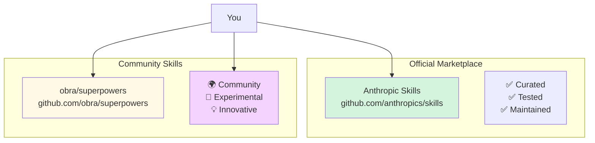

# Marketplace Skills

**Reading Time**: 20 minutes
**Skill Level**: Beginner
**Prerequisites**: [What Are Skills?](1-overview.md)

---

## Welcome to the Skills Marketplace! 🛍️

Before creating your own skills, explore hundreds of ready-to-use skills from the official marketplace and community.

By the end of this guide, you'll be able to:
- Discover skills in the official marketplace
- Install skills from the community
- Configure installed skills for your project
- Update and manage your skill collection
- Contribute skills back to the community

---

## What Is the Skills Marketplace?

### Two Main Sources



**Official Marketplace**: [github.com/anthropics/skills](https://github.com/anthropics/skills)
- Curated by Anthropic
- Thoroughly tested
- Well-documented
- Regularly updated
- Production-ready

**Community Skills**: [github.com/obra/superpowers](https://github.com/obra/superpowers)
- Community-contributed
- Experimental features
- Rapid innovation
- Diverse use cases
- May need testing

---

## Browsing Available Skills

### Method 1: CLI Browse

```bash
# List all available skills
claude skills browse

# Search for specific skills
claude skills search "code review"

# Show skill details
claude skills info code-review

# Filter by category
claude skills browse --category=testing
claude skills browse --category=documentation
claude skills browse --category=security
```

### Method 2: Web Interface

Visit the marketplace website:
- [Official Marketplace](https://skills.claude.com) ← (if available)
- [GitHub Skills Repository](https://github.com/anthropics/skills)
- [Community Skills](https://github.com/obra/superpowers)

### Method 3: GitHub Topics

Search GitHub for:
- `topic:claude-code-skills`
- `topic:claude-skills`
- `topic:anthropic-skills`

---

## Installing Skills

### Quick Install: Official Skills

```bash
# Install a single skill
claude skills install code-review

# Install multiple skills
claude skills install code-review tdd-workflow api-docs

# Install all skills in a category
claude skills install --category=testing

# Install with specific version
claude skills install code-review@1.2.0
```

**What happens:**
1. Skill downloaded to `.claude/skills/code-review/`
2. Skill registered in `.claude/config.json`
3. Dependencies installed (if any)
4. Skill ready to use immediately

### Custom Install: Community Skills

```bash
# Install from GitHub URL
claude skills install github.com/obra/superpowers/skills/tdd-master

# Install from local directory
claude skills install ./my-custom-skill

# Install from git repository
claude skills install git@github.com:yourname/your-skill.git
```

---

## Popular Official Skills Catalog

### 🧪 Testing & Quality

#### **code-review**
**Purpose**: Automated code review with configurable depth
**Usage**: `/code-review [--deep] [--security]`
**Model**: Sonnet (default)
**Cost**: ~5K-20K tokens depending on depth

```bash
# Install
claude skills install code-review

# Use
/code-review               # Quick review
/code-review --deep        # Comprehensive review
/code-review --security    # Security-focused
```

**Features**:
- ✅ Syntax and style checking
- ✅ Security vulnerability detection
- ✅ Performance analysis
- ✅ Test coverage review
- ✅ Progressive disclosure (quick → deep)

---

#### **tdd-workflow**
**Purpose**: Test-Driven Development with guided workflow
**Usage**: `/tdd "feature description"`
**Model**: Sonnet
**Cost**: ~8K-15K tokens per TDD cycle

```bash
# Install
claude skills install tdd-workflow

# Use
/tdd "Add user authentication"

# Guides you through:
# 1. Write failing test (Red)
# 2. Implement minimum code (Green)
# 3. Refactor (Blue)
```

**Features**:
- ✅ Enforces TDD cycle
- ✅ Automatic test running
- ✅ Coverage tracking
- ✅ Refactoring suggestions

---

#### **test-generator**
**Purpose**: Generate comprehensive test suites
**Usage**: `/generate-tests <file>`
**Model**: Sonnet
**Cost**: ~10K-25K tokens

```bash
# Install
claude skills install test-generator

# Use
/generate-tests src/auth.ts

# Generates:
# - Unit tests
# - Integration tests
# - Edge case tests
# - Mocks and fixtures
```

---

### 📚 Documentation

#### **api-docs**
**Purpose**: Generate API documentation from code
**Usage**: `/api-docs <file or directory>`
**Model**: Sonnet
**Cost**: ~8K-20K tokens

```bash
# Install
claude skills install api-docs

# Use
/api-docs api/users.ts              # Single file
/api-docs api/**                    # Entire directory
/api-docs api/** --interactive      # With examples
```

**Features**:
- ✅ OpenAPI/Swagger generation
- ✅ JSDoc/TSDoc extraction
- ✅ Code examples
- ✅ Interactive playground links

---

#### **readme-generator**
**Purpose**: Create comprehensive README files
**Usage**: `/readme-gen`
**Model**: Sonnet
**Cost**: ~12K-30K tokens

```bash
# Install
claude skills install readme-generator

# Use
/readme-gen

# Generates:
# - Project overview
# - Installation instructions
# - Usage examples
# - API reference
# - Contributing guidelines
```

---

### 🔒 Security

#### **security-audit**
**Purpose**: Comprehensive security vulnerability scan
**Usage**: `/security-audit [--quick | --deep]`
**Model**: Opus (deep), Sonnet (quick)
**Cost**: ~15K-50K tokens

```bash
# Install
claude skills install security-audit

# Use
/security-audit --quick     # Fast scan
/security-audit --deep      # OWASP Top 10 + more

# Checks:
# - SQL injection
# - XSS vulnerabilities
# - Authentication issues
# - Secrets in code
# - Dependency vulnerabilities
```

---

#### **secrets-scanner**
**Purpose**: Detect hardcoded secrets and credentials
**Usage**: `/scan-secrets`
**Model**: Haiku (fast, cheap)
**Cost**: ~3K-8K tokens

```bash
# Install
claude skills install secrets-scanner

# Use
/scan-secrets

# Detects:
# - API keys
# - Passwords
# - Private keys
# - Tokens
# - Certificates
```

---

### 🎨 Frontend Development

#### **component-generator**
**Purpose**: Generate React/Vue/Svelte components
**Usage**: `/component <ComponentName> [--framework=react]`
**Model**: Sonnet
**Cost**: ~8K-15K tokens

```bash
# Install
claude skills install component-generator

# Use
/component LoginForm --framework=react
/component UserCard --framework=vue
/component Modal --framework=svelte

# Generates:
# - Component file
# - Styles (CSS modules)
# - TypeScript types
# - Tests
# - Storybook story
```

---

#### **css-optimizer**
**Purpose**: Optimize and refactor CSS/SCSS
**Usage**: `/optimize-css <file>`
**Model**: Sonnet
**Cost**: ~6K-12K tokens

```bash
# Install
claude skills install css-optimizer

# Use
/optimize-css src/styles/app.css

# Optimizations:
# - Remove duplicates
# - Consolidate rules
# - Improve specificity
# - Add CSS variables
# - Mobile-first approach
```

---

### ⚙️ Backend Development

#### **api-scaffold**
**Purpose**: Generate REST/GraphQL API boilerplate
**Usage**: `/api-scaffold <resource> [--type=rest]`
**Model**: Sonnet
**Cost**: ~15K-30K tokens

```bash
# Install
claude skills install api-scaffold

# Use
/api-scaffold User --type=rest

# Generates:
# - Routes
# - Controllers
# - Services
# - Models
# - Validation
# - Tests
# - OpenAPI docs
```

---

#### **database-migration**
**Purpose**: Generate and validate database migrations
**Usage**: `/migration <description>`
**Model**: Sonnet
**Cost**: ~10K-20K tokens

```bash
# Install
claude skills install database-migration

# Use
/migration "Add email verification to users table"

# Generates:
# - Migration file (up/down)
# - Model updates
# - Validation
# - Rollback plan
# - Tests
```

---

## Community Skills Highlights

### obra/superpowers

Visit: [github.com/obra/superpowers](https://github.com/obra/superpowers)

**Notable Skills**:

#### **commit-message-generator**
```bash
claude skills install github.com/obra/superpowers/skills/commit-msg

# Auto-generates conventional commit messages
/commit-msg

# Example output:
# feat(auth): add JWT token validation
#
# - Implement JWT middleware
# - Add token expiration checks
# - Update tests for auth flow
```

#### **pr-description-generator**
```bash
claude skills install github.com/obra/superpowers/skills/pr-desc

# Generates comprehensive PR descriptions
/pr-desc

# Includes:
# - Summary of changes
# - Breaking changes
# - Test plan
# - Screenshots (for UI changes)
# - Checklist for reviewers
```

#### **refactor-assistant**
```bash
claude skills install github.com/obra/superpowers/skills/refactor

# Interactive refactoring guide
/refactor src/legacy-code.ts

# Suggests:
# - Design pattern improvements
# - Code smell fixes
# - Performance optimizations
# - Test coverage additions
```

---

## Configuring Installed Skills

### Per-Project Configuration

Edit `.claude/config.json`:

```json
{
  "skills": {
    "code-review": {
      "enabled": true,
      "model": "sonnet",
      "defaultMode": "quick",
      "autoTrigger": true,
      "options": {
        "minTestCoverage": 80,
        "securityLevel": "high",
        "styleGuide": "airbnb"
      }
    },
    "tdd-workflow": {
      "enabled": true,
      "model": "sonnet",
      "options": {
        "testFramework": "jest",
        "coverageThreshold": 90,
        "strictMode": true
      }
    },
    "api-docs": {
      "enabled": true,
      "model": "haiku",  // Cheaper for docs
      "options": {
        "format": "openapi",
        "includeExamples": true,
        "interactive": false
      }
    }
  }
}
```

### Skill-Specific Configuration

Some skills use their own config files:

`.claude/skills/code-review/config.json`:
```json
{
  "rules": {
    "max-line-length": 100,
    "require-tests": true,
    "no-console-log": "warn",
    "security-scan": "always"
  },
  "ignore": [
    "**/*.test.ts",
    "**/vendor/**",
    "**/.generated/**"
  ]
}
```

---

## Managing Your Skills

### List Installed Skills

```bash
# Show all installed skills
claude skills list

# Output:
# Installed Skills:
# ✅ code-review (v1.2.0)
# ✅ tdd-workflow (v2.0.1)
# ✅ api-docs (v1.5.0)
# ⚠️  security-audit (v3.0.0) - update available (v3.1.0)
```

### Update Skills

```bash
# Update single skill
claude skills update code-review

# Update all skills
claude skills update --all

# Check for updates without installing
claude skills outdated
```

### Uninstall Skills

```bash
# Remove single skill
claude skills uninstall code-review

# Remove multiple skills
claude skills uninstall code-review tdd-workflow

# Remove all skills in category
claude skills uninstall --category=testing
```

### Disable/Enable Skills

```bash
# Temporarily disable a skill
claude skills disable code-review

# Re-enable a skill
claude skills enable code-review

# Disable all skills
claude skills disable --all
```

---

## Creating a Skills Collection

### Team Skills Bundle

Create a bundle for your team:

`team-skills.json`:
```json
{
  "name": "MyCompany Development Stack",
  "version": "1.0.0",
  "skills": [
    "code-review@1.2.0",
    "tdd-workflow@2.0.1",
    "security-audit@3.1.0",
    "api-scaffold@1.0.0",
    "github.com/mycompany/custom-skill"
  ],
  "config": {
    "code-review": {
      "styleGuide": "mycompany",
      "minCoverage": 85
    }
  }
}
```

**Install bundle:**
```bash
claude skills install --bundle=team-skills.json
```

---

## Skill Quality Indicators

### Official Skills

All official skills are:
- ✅ **Tested**: Automated test coverage
- ✅ **Documented**: Complete usage guides
- ✅ **Maintained**: Regular updates
- ✅ **Versioned**: Semantic versioning
- ✅ **Reviewed**: Code review by Anthropic

### Community Skills

Check these indicators:
- ⭐ **Stars**: Community popularity
- 🍴 **Forks**: Active usage
- 📝 **README**: Documentation quality
- 🧪 **Tests**: Test coverage
- 📅 **Last Updated**: Recent maintenance
- 💬 **Issues**: Responsiveness

**Quality Checklist:**
```bash
# Before installing community skill, check:
- [ ] Has README with clear usage examples
- [ ] Updated within last 3 months
- [ ] Has tests (look for __tests__ or *.test.*)
- [ ] Has multiple contributors
- [ ] Has semantic versioning
- [ ] Issues are addressed (not ignored)
```

---

## Troubleshooting

### Skill Won't Install

```bash
# Check Claude Code version
claude --version

# Ensure you have latest version
npm install -g @anthropic/claude-code

# Install with verbose logging
claude skills install code-review --verbose

# Try manual install
git clone https://github.com/anthropics/skills
cp -r skills/code-review ~/.claude/skills/
```

### Skill Not Triggering

```bash
# Check if skill is enabled
claude skills list

# Verify skill trigger patterns
cat .claude/skills/code-review/SKILL.md | grep "autoTrigger"

# Force skill invocation
claude --skill=code-review "Review my code"
```

### Skill Errors

```bash
# Check skill logs
cat .claude/logs/skills/code-review.log

# Validate skill configuration
claude skills validate code-review

# Reset skill to defaults
claude skills reset code-review
```

### Conflicting Skills

```bash
# Two skills might trigger on same pattern
# Check which skill is selected
claude skills test "review my code"

# Output:
# Matched skills:
# 1. code-review (confidence: 0.9)
# 2. security-audit (confidence: 0.7)
# Selected: code-review

# Explicitly choose skill
claude --skill=security-audit "Review my code"
```

---

## Best Practices

### 1. Start with Official Skills

✅ **Do**: Install official skills first
```bash
claude skills install code-review tdd-workflow api-docs
```

❌ **Don't**: Install untested community skills right away

---

### 2. Configure for Your Project

✅ **Do**: Customize skill settings
```json
{
  "skills": {
    "code-review": {
      "options": {
        "styleGuide": "your-company-guide",
        "minCoverage": 85
      }
    }
  }
}
```

❌ **Don't**: Use default settings for everything

---

### 3. Keep Skills Updated

✅ **Do**: Regular updates
```bash
# Weekly or monthly
claude skills update --all
```

❌ **Don't**: Let skills get outdated (security risks)

---

### 4. Disable Unused Skills

✅ **Do**: Disable skills you're not using
```bash
claude skills disable unused-skill
```

❌ **Don't**: Keep all skills enabled (slows down selection)

---

## Contributing Skills to the Marketplace

Want to share your skill? See: [Creating Custom Skills](3-creating-skills.md)

**Contribution Process:**

1. **Create your skill** following best practices
2. **Test thoroughly** with automated tests
3. **Document** with clear examples
4. **Submit** to GitHub repository
5. **Review** by community/Anthropic
6. **Publish** to marketplace

**Official Skills Submission:**
- Fork: [github.com/anthropics/skills](https://github.com/anthropics/skills)
- Create skill in `/skills/your-skill/`
- Submit pull request
- Pass CI/CD checks
- Community review
- Merge and publish

**Community Skills:**
- Any GitHub repository
- Tag with `claude-code-skills`
- Share on community forums

---

## Quick Reference

### Essential Commands

```bash
# Browse and search
claude skills browse
claude skills search "keyword"
claude skills info <skill-name>

# Install and manage
claude skills install <skill-name>
claude skills update --all
claude skills uninstall <skill-name>

# List and status
claude skills list
claude skills outdated

# Control
claude skills enable <skill-name>
claude skills disable <skill-name>
```

### Recommended Starter Pack

For most projects, install:
```bash
claude skills install \
  code-review \
  tdd-workflow \
  api-docs \
  readme-generator \
  secrets-scanner
```

**Cost**: ~$0.50-2.00/day depending on usage
**Benefit**: Comprehensive development workflow automation

---

## Troubleshooting Skill Issues

### Issue 1: Skill Not Found or Won't Load

**Symptom**: "Skill not found" or skill doesn't execute

**Common Causes**:
- Skill not installed correctly
- Wrong skill name
- Skill file in wrong directory
- Syntax error in SKILL.md

**Solutions**:
```bash
# List installed skills
claude skill list

# Check skill location
ls .claude/skills/

# Reinstall skill from marketplace
claude skill install <skill-name>

# Validate skill syntax
claude skill validate .claude/skills/my-skill/SKILL.md
```

---

### Issue 2: Skill Produces Incorrect Results

**Symptom**: Skill runs but output doesn't match expectations

**Common Causes**:
- Wrong model assigned (too simple for task)
- Incomplete skill instructions
- Skill designed for different context

**Solutions**:
```yaml
# Check skill's model assignment
---
name: my-skill
model: sonnet  # Try upgrading to opus for better quality
---

# Use model override when invoking
claude --skill=my-skill --model=opus "Complex task"

# Review skill instructions for clarity
# Skills should have specific, actionable steps
```

---

### Issue 3: Skill Too Expensive

**Symptom**: Skill uses more tokens/costs more than expected

**Common Causes**:
- Skill using Opus when Haiku sufficient
- No progressive disclosure
- Reading too many files

**Solutions**:
```yaml
# Assign cheaper model for simple tasks
---
name: my-skill
model: haiku  # Use haiku instead of sonnet
modelOverrides:
  deep: sonnet  # Only use sonnet for --deep flag
---
```

**Optimize skill structure:**
```markdown
# Core instructions (always loaded)
Quick steps for simple use case

<details>
<summary>Advanced Options (loaded only when needed)</summary>

Detailed instructions for complex scenarios

</details>
```

---

### Issue 4: Skill Conflicts with Another Skill

**Symptom**: Multiple skills triggering or interference

**Common Causes**:
- Similar auto-trigger patterns
- Skills modifying same files
- Namespace collisions

**Solutions**:
```yaml
# Make auto-trigger patterns more specific
---
autoTrigger:
  - pattern: "review.*security"  # Specific
  # NOT: pattern: "review"       # Too broad
---

# Disable conflicting skill temporarily
claude skill disable <other-skill-name>

# Manually specify which skill to use
claude --skill=security-review "Review my code"
```

---

### Issue 5: Skill Dependencies Not Met

**Symptom**: "Missing dependency" or skill fails to run

**Common Causes**:
- Required skill not installed
- Required MCP server not configured
- Required tools not available

**Solutions**:
```yaml
# Check skill dependencies in frontmatter
---
dependencies:
  - code-review  # Must install this skill first
  - github-mcp   # Must configure GitHub MCP
---

# Install missing dependencies
claude skill install code-review
claude mcp add github

# Verify all dependencies
claude skill check-deps my-skill
```

---

### Still Having Issues?

1. **Check skill documentation**: Each marketplace skill should have detailed README
2. **Test with simple example**: Try skill on minimal test case first
3. **Review skill source**: Open `.claude/skills/<skill-name>/SKILL.md` to understand behavior
4. **Ask community**: [Skills Discussion Forum](https://github.com/anthropics/skills/discussions)
5. **Report bugs**: [Open an issue](https://github.com/anthropics/skills/issues) for marketplace skills

---

## Next Steps

Now that you know how to discover and use marketplace skills, you're ready to:

**Next Guide**: [Creating Custom Skills](3-creating-skills.md) (70 min)
Learn to build your own custom skills for your unique workflows.

**Also Explore**:
- [Model Assignment for Skills](4-model-assignment.md) - Optimize skill costs
- [Advanced Skill Patterns](5-advanced-patterns.md) - Master progressive disclosure
- [Skills API Reference](https://code.claude.com/docs/skills) - Complete API docs

---

## References and Further Reading

### Official Resources
- [Official Skills Marketplace](https://github.com/anthropics/skills)
- [Skills Documentation](https://code.claude.com/docs/skills)
- [Skills API Reference](https://code.claude.com/docs/skills/api)

### Community Resources
- [obra/superpowers](https://github.com/obra/superpowers)
- [Community Skills Forum](https://community.claude.com/skills)
- [GitHub Topic: claude-code-skills](https://github.com/topics/claude-code-skills)

### Tutorials
- [Building Your First Skill](https://code.claude.com/tutorials/first-skill)
- [Contributing to the Marketplace](https://code.claude.com/docs/contributing)

---

**Questions or Feedback?**
Found a mistake? Have a suggestion? [Open an issue](https://github.com/anthropics/claude-code/issues) or contribute to this documentation!
