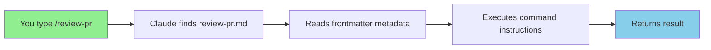

# Custom Commands in Claude Code

⏱️ **Time**: 25 minutes
📊 **Level**: Beginner → Intermediate
🎯 **You'll Learn**: How to create custom slash commands, pass arguments, organize command files, and build team-wide workflows

---

## What Are Custom Commands?

Think of custom commands like **keyboard shortcuts for your brain**. Instead of typing out the same long instructions every time you want Claude to review a PR or run tests, you just type `/review-pr` or `/test`—and boom! Claude knows exactly what to do.

Custom commands (also called "slash commands") are user-defined shortcuts stored in `.claude/commands/` that execute predefined workflows when invoked with `/command-name`.

**Real-world analogy**: It's like teaching your smart assistant voice commands. Instead of saying "Hey assistant, please check my email, filter for urgent messages, summarize the top 3, and draft responses," you just say "Handle my email."

---

## Why Should You Care?

Let me show you three scenarios where custom commands save time and headaches:

### Scenario 1: Code Review Consistency
**Without commands**: Every developer reviews code differently, missing different issues.
**With `/review-pr`**: Enforces team standards—security checks, style guidelines, test coverage—every single time.
**Impact**: 40% reduction in review iterations

### Scenario 2: Deployment Chaos
**Without commands**: 12-step manual deployment process, frequent mistakes, rollbacks.
**With `/deploy staging`**: One command runs all checks, builds, tests, and deploys safely.
**Impact**: 90% fewer deployment failures

### Scenario 3: Documentation Drift
**Without commands**: API docs get outdated, inconsistent formatting.
**With `/generate-api-docs`**: Auto-generates standardized docs from code annotations.
**Impact**: Always up-to-date documentation

---

## Prerequisites

Before diving in, make sure you're comfortable with:
- ✅ [Basic Claude Code usage](../01-mcp-servers/1-overview.md) - You've used Claude Code before
- ✅ [Command line basics](https://github.com) - You know how to navigate folders and edit files

**Not sure?** No worries! This guide starts from the basics and builds up progressively.

---

## How Custom Commands Work

Let's build this up step by step.

### Step 1: The Anatomy of a Command

Every custom command is just a markdown file in `.claude/commands/` with special frontmatter:

```
your-project/
└── .claude/
    └── commands/
        ├── review-pr.md
        ├── run-tests.md
        └── deploy.md
```

Here's what happens when you type `/review-pr`:



### Step 2: Your First Command (2 Minutes)

Let's create a simple `/greet` command:

**File**: `.claude/commands/greet.md`
```markdown
---
description: Greet the user with a friendly message
---

Say hello to the user in a friendly, enthusiastic way. Include a fun fact about coding.
```

**Try it**:
```bash
# In Claude Code, type:
/greet
```

**What you'll see**:
> Hey there! 👋 Great to see you! Here's a fun fact: The first computer bug was an actual moth found in a Harvard Mark II computer in 1947!

**What just happened?**
1. You typed `/greet`
2. Claude found `.claude/commands/greet.md`
3. Claude read the instructions: "Say hello... Include a fun fact..."
4. Claude executed those instructions

---

## Step 3: Commands with Arguments

Now let's level up with **dynamic commands** that accept input:

**File**: `.claude/commands/review-pr.md`
```markdown
---
description: Review a pull request with comprehensive checks
arguments:
  - name: pr_number
    description: PR number to review (e.g., 123)
    required: true
---

Review pull request #$PR_NUMBER with the following checklist:

## Security Review
- [ ] No hardcoded secrets or API keys
- [ ] Input validation on all user data
- [ ] SQL injection prevention
- [ ] XSS prevention

## Code Quality
- [ ] Follows project style guide
- [ ] No code duplication
- [ ] Functions are focused and small
- [ ] Meaningful variable names

## Testing
- [ ] New tests added for new features
- [ ] All existing tests pass
- [ ] Edge cases covered

## Documentation
- [ ] Code comments for complex logic
- [ ] README updated if needed
- [ ] API docs updated if endpoints changed

Provide specific feedback for each failing item with line numbers and suggestions.
```

**Try it**:
```bash
/review-pr 456
```

**What Claude does**:
1. Replaces `$PR_NUMBER` with `456`
2. Fetches PR #456 (if GitHub MCP is configured)
3. Reviews code against every checklist item
4. Returns detailed feedback with line numbers

---

## Real-World Command Examples

### Example 1: Test Runner

**File**: `.claude/commands/test.md`
```markdown
---
description: Run tests and report results
arguments:
  - name: path
    description: Test file or directory path (optional)
    required: false
---

Run tests for ${path:-.} (current directory if no path specified).

Steps:
1. Identify the test framework (pytest, jest, go test, etc.)
2. Run the appropriate test command
3. Report:
   - Total tests run
   - Pass/fail count
   - Failed test details with error messages
   - Coverage percentage if available

If tests fail, suggest fixes for the failures.
```

**Usage**:
```bash
/test                    # Tests entire project
/test tests/api          # Tests specific directory
/test tests/test_auth.py # Tests specific file
```

---

### Example 2: Code Generator

**File**: `.claude/commands/generate-api.md`
```markdown
---
description: Generate a REST API endpoint
arguments:
  - name: resource
    description: Resource name (e.g., 'user', 'product')
    required: true
  - name: methods
    description: HTTP methods (e.g., 'GET,POST,PUT,DELETE')
    required: false
---

Generate a RESTful API endpoint for **$RESOURCE** with methods: ${METHODS:-GET,POST,PUT,DELETE}

Include:
1. Route definitions
2. Request validation
3. Error handling
4. Response formatting
5. Unit tests with mocked database
6. API documentation comments

Follow the existing project structure and coding style.
```

**Usage**:
```bash
/generate-api product
/generate-api order "GET,POST"
```

---

### Example 3: Documentation Generator

**File**: `.claude/commands/document-function.md`
```markdown
---
description: Generate comprehensive documentation for a function
---

For the selected function or the function under the cursor:

1. **Generate JSDoc/Python docstring** with:
   - Clear description of what it does
   - @param descriptions for each parameter
   - @returns description
   - @throws/raises for exceptions
   - @example with realistic usage

2. **Add inline comments** for:
   - Complex logic sections
   - Non-obvious optimizations
   - Edge case handling

3. **Include usage examples** showing:
   - Basic usage
   - Edge cases
   - Error handling

Use the project's existing documentation style.
```

**Usage**:
```bash
# Select a function, then:
/document-function
```

---

## Visual Comparison: Before vs. After

| Task | Without Commands | With Commands | Time Saved |
|------|------------------|---------------|------------|
| PR Review | 15-20 min manual checklist | 2 min `/review-pr 123` | 85% faster |
| Run Tests | Remember syntax, flags, paths | 5 sec `/test` | 95% faster |
| API Endpoint | 30 min boilerplate coding | 3 min `/generate-api user` | 90% faster |
| Deploy | 12-step manual process | 1 min `/deploy staging` | 92% faster |
| Documentation | 10 min per function | 30 sec `/document-function` | 95% faster |

---

## Advanced Patterns

### Pattern 1: Multi-Step Workflows

Create commands that orchestrate complex workflows:

**File**: `.claude/commands/feature-complete.md`
```markdown
---
description: Complete checklist before marking feature as done
arguments:
  - name: feature_name
    description: Feature name
    required: true
---

Run pre-merge checklist for feature: **$FEATURE_NAME**

## Step 1: Code Quality
- Run linter and fix issues
- Run tests and ensure 100% pass
- Check code coverage (minimum 80%)

## Step 2: Documentation
- Update README if user-facing changes
- Update API docs if endpoints changed
- Add inline comments for complex logic

## Step 3: Review
- Check for hardcoded secrets
- Verify error handling
- Confirm input validation

## Step 4: Git
- Ensure branch is up to date with main
- Squash commits if needed
- Write clear commit message

Report status for each step. Stop if any step fails.
```

---

### Pattern 2: Context-Aware Commands

Commands that adapt based on file type:

**File**: `.claude/commands/optimize.md`
```markdown
---
description: Optimize current file for performance
---

Analyze the current file and optimize for performance:

**For Python**:
- List comprehensions instead of loops
- Generators for large datasets
- Caching with @lru_cache
- Vectorization with numpy

**For JavaScript**:
- Debouncing/throttling events
- Lazy loading
- Memoization
- Web Workers for heavy computation

**For SQL**:
- Index optimization
- Query plan analysis
- JOIN optimization
- N+1 query elimination

Provide before/after code examples with benchmarks.
```

---

### Pattern 3: Team Standardization

Share commands across your team via git:

```bash
# Everyone on team gets same commands
git clone your-project
cd your-project
# .claude/commands/ is version controlled

# Now everyone has:
/review-pr
/deploy
/test
/generate-api
# ... consistent workflows!
```

---

## Common Pitfalls

### ❌ Mistake 1: Vague Instructions

```markdown
---
description: Fix code
---

Make the code better.
```

**Why it fails**: Claude doesn't know what "better" means—performance? Readability? Security?

### ✅ Better: Specific Instructions

```markdown
---
description: Fix code quality issues
---

Analyze code for:
1. **Complexity**: Functions > 20 lines should be refactored
2. **Duplication**: DRY violations
3. **Naming**: Unclear variable/function names
4. **Error handling**: Missing try/catch blocks

Provide specific refactoring suggestions with code examples.
```

---

### ❌ Mistake 2: No Argument Validation

```markdown
---
description: Deploy to environment
arguments:
  - name: env
---

Deploy to $ENV
```

**Why it fails**: User could type `/deploy prodduction` (typo) and deploy to wrong environment!

### ✅ Better: Explicit Validation

```markdown
---
description: Deploy to environment (staging or production)
arguments:
  - name: env
    description: Environment - must be 'staging' or 'production'
    required: true
---

**SAFETY CHECK**: Deploying to **$ENV**

If $ENV is not exactly "staging" or "production", STOP and ask user to correct.

If $ENV is "production":
- Confirm: "⚠️ Deploying to PRODUCTION. Are you sure? (yes/no)"
- Wait for explicit "yes" before proceeding

Deployment steps:
1. Run all tests
2. Build production bundle
3. Deploy to $ENV
4. Run smoke tests
5. Report success/failure
```

---

## Try It Yourself

Ready to practice? Here's a hands-on exercise:

### Exercise 1: Create a "Bug Report" Command

**Task**: Create `/bug-report` command that generates a comprehensive bug report.

**Requirements**:
- Gathers system info (OS, version, etc.)
- Includes steps to reproduce
- Collects relevant logs
- Formats as GitHub issue template

**Template to get you started**:
```markdown
---
description: Generate comprehensive bug report
arguments:
  - name: title
    description: Brief bug description
    required: true
---

Create a bug report for: **$TITLE**

Include:
1. Environment (OS, Node version, etc.)
2. Steps to reproduce
3. Expected behavior
4. Actual behavior
5. Relevant error logs
6. Possible fixes

Format as GitHub issue markdown.
```

**Solution** (try first before peeking!):
<details>
<summary>Click to reveal solution</summary>

```markdown
---
description: Generate comprehensive bug report with system info
arguments:
  - name: title
    description: Brief bug description
    required: true
---

# Bug Report: $TITLE

## Environment
- **OS**: [Detect from system]
- **Node Version**: [Run `node --version`]
- **Package Version**: [Check package.json]
- **Browser** (if applicable): [Ask user]

## Steps to Reproduce
[Ask user for steps, number them]

1.
2.
3.

## Expected Behavior
[Ask user to describe expected outcome]

## Actual Behavior
[Ask user to describe what actually happened]

## Error Logs
```
[Include relevant error messages from console/logs]
```

## Screenshots
[Ask if screenshots available]

## Possible Cause
[Analyze the issue and suggest possible root causes]

## Suggested Fixes
[Provide 2-3 potential solutions with code examples]

---
**Labels**: bug, needs-triage
**Priority**: [Ask: low/medium/high/critical]
```
</details>

---

## Command Organization Best Practices

### Naming Conventions

```
✅ Good Names:
/review-pr
/run-tests
/deploy-staging
/generate-api-endpoint

❌ Confusing Names:
/rp           (too cryptic)
/review       (too vague)
/do-the-thing (not descriptive)
```

### File Structure for Large Projects

```
.claude/commands/
├── README.md              # Command documentation
├── git/
│   ├── review-pr.md
│   ├── merge-main.md
│   └── release.md
├── testing/
│   ├── test.md
│   ├── coverage.md
│   └── e2e.md
├── deployment/
│   ├── deploy.md
│   ├── rollback.md
│   └── health-check.md
└── code-generation/
    ├── generate-api.md
    ├── generate-test.md
    └── generate-docs.md
```

---

## Success Criteria

✅ **You're ready to move on when you can**:
- [ ] Create a basic slash command from scratch
- [ ] Add arguments to commands
- [ ] Write clear, specific command instructions
- [ ] Organize commands in folders
- [ ] Understand when to use commands vs. skills vs. hooks

---

## What's Next?

Great job! Now you're ready for:

**Next Topic**: [Model Selection](../05-models/1-overview.md) - Choose the right model for each task →

**Related Topics**:
- [Skills](../03-skills/1-overview.md) - More complex reusable workflows →
- [Hooks](../10-hooks/1-overview.md) - Automate command execution →
- [Plugins Overview](../06-plugins/1-overview.md) - See how commands fit in the ecosystem →

---

## References & Further Reading

### 📚 Official Documentation
- [Claude Code Commands Reference](https://code.claude.com/docs/en/commands) - Official command documentation
- [Command Syntax Specification](https://code.claude.com/docs/en/commands/syntax) - Detailed syntax guide
- [Build a YouTube Research Agent Tutorial](https://creatoreconomy.so/p/claude-code-tutorial-build-a-youtube-research-agent-in-15-min) - Hands-on slash commands tutorial

### 🔗 Related Topics
- [MCP Servers](../01-mcp-servers/1-overview.md) - External tool integration
- [Skills](../03-skills/1-overview.md) - Complex workflows with progressive disclosure
- [Hooks](../10-hooks/1-overview.md) - Automation triggers

### 💬 Community & Support
- [Claude Code Discord](https://discord.gg/anthropic) - Get help from community
- [GitHub Discussions](https://github.com/anthropics/claude-code/discussions) - Share commands
- [Stack Overflow](https://stackoverflow.com/questions/tagged/claude-code) - Q&A

---

**You've completed Custom Commands!** You now know how to create powerful shortcuts that save time and enforce consistency. Choose your next topic above to continue mastering Claude Code. 🚀
