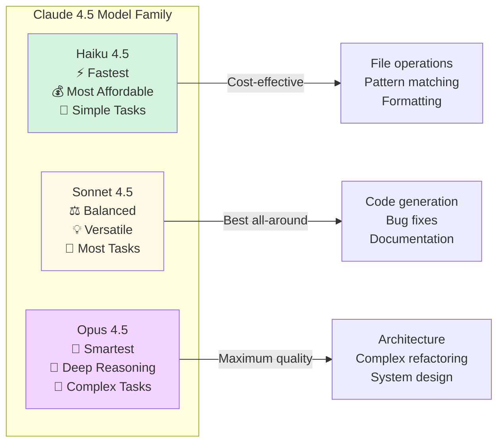
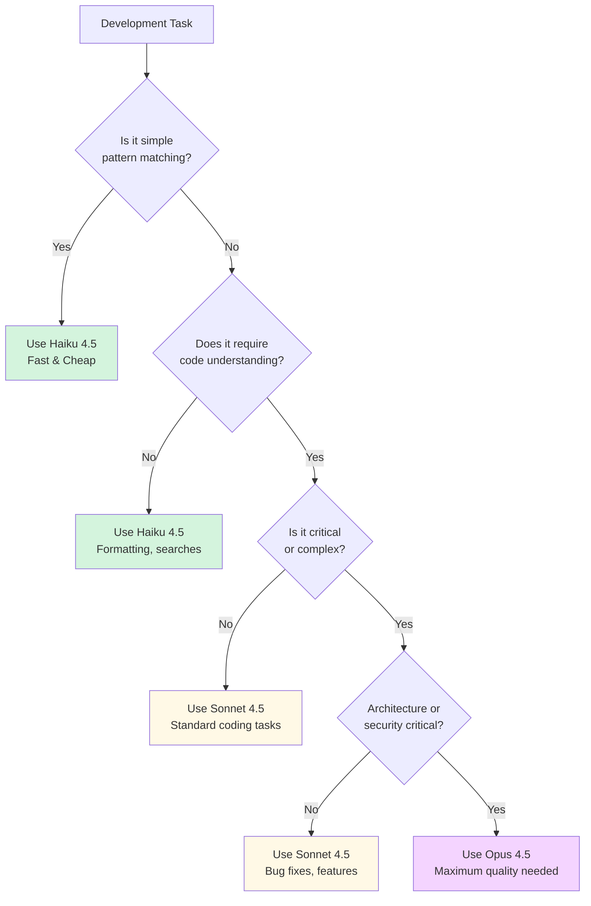

# Model Overview

**Reading Time**: 25 minutes
**Skill Level**: Beginner to Intermediate
**Prerequisites**: Basic understanding of Claude Code

---

## Welcome to Model Selection! 🤖

You've been using Claude Code with different models (Haiku, Sonnet, Opus), but what are the real differences? How do you choose the right model for your task?

By the end of this guide, you'll understand:
- The three Claude models and their capabilities
- Pricing and performance trade-offs
- When to use each model
- How models impact your Claude Pro usage
- Real-world performance benchmarks

---

## The Three Models



---

## Quick Comparison Table

| Feature | Haiku 4.5 | Sonnet 4.5 | Opus 4.5 |
|---------|-----------|------------|----------|
| **Speed** | 🚀🚀🚀 Fastest | 🚀🚀 Fast | 🚀 Slower |
| **Cost (Input)** | $1/M tokens | $3/M tokens | Premium* |
| **Cost (Output)** | $5/M tokens | $15/M tokens | Premium* |
| **Reasoning** | ⭐⭐ Basic | ⭐⭐⭐⭐ Strong | ⭐⭐⭐⭐⭐ Exceptional |
| **Code Quality** | ⭐⭐⭐ Good | ⭐⭐⭐⭐ Excellent | ⭐⭐⭐⭐⭐ Outstanding |
| **Context Window** | 200K tokens | 200K tokens | 200K tokens |
| **Best For** | Simple operations | Most coding tasks | Complex analysis |
| **Claude Pro Impact** | ✅ Minimal | ⚠️ Moderate | ❌ High |

*Premium pricing - approximately 2-3x Sonnet cost

---

## Detailed Model Characteristics

### Haiku 4.5: The Speed Demon ⚡

**Philosophy**: Fast, efficient, cost-effective for straightforward tasks

**Strengths:**
- ✅ **Speed**: Responses in seconds (3-5x faster than Sonnet)
- ✅ **Cost**: 66% cheaper than Sonnet
- ✅ **Simple tasks**: Excellent for pattern matching, formatting, file operations
- ✅ **Claude Pro**: Uses minimal daily quota

**Limitations:**
- ⚠️ **Complex reasoning**: Struggles with multi-step logic
- ⚠️ **Architecture**: Not suitable for system design
- ⚠️ **Edge cases**: May miss subtle bugs

**Ideal Use Cases:**
- File searches and pattern matching
- Code formatting (Prettier, Black, etc.)
- Spell checking and linting
- Simple documentation generation
- Import organization
- Basic code transformations

**Example Tasks:**
```bash
# Perfect for Haiku
"Format this file with Prettier"
"Find all files importing React"
"Fix spelling errors in comments"
"Sort these imports alphabetically"
"Convert var to const"
```

**Performance Metrics:**
- Average response time: 2-5 seconds
- Typical token usage: 3,000-8,000 tokens
- Cost per operation: $0.02-$0.05
- Quality for simple tasks: 95%+

---

### Sonnet 4.5: The Workhorse ⚖️

**Philosophy**: Balanced performance, quality, and cost for most development tasks

**Strengths:**
- ✅ **Versatility**: Handles 90% of coding tasks well
- ✅ **Code understanding**: Strong comprehension of code structure
- ✅ **Quality**: Excellent code generation and bug fixing
- ✅ **Speed**: Fast enough for interactive development
- ✅ **Cost**: Reasonable for daily use

**Limitations:**
- ⚠️ **Complex architecture**: May oversimplify design decisions
- ⚠️ **Novel problems**: Less creative than Opus
- ⚠️ **Edge cases**: Might miss very subtle issues

**Ideal Use Cases:**
- Feature implementation
- Bug fixing and debugging
- Code refactoring
- Test generation
- API development
- Documentation writing
- Code reviews (standard depth)

**Example Tasks:**
```bash
# Perfect for Sonnet
"Add user authentication to this API"
"Refactor this class to use composition"
"Write tests for this component"
"Fix the race condition in this code"
"Generate OpenAPI documentation"
```

**Performance Metrics:**
- Average response time: 8-15 seconds
- Typical token usage: 8,000-20,000 tokens
- Cost per operation: $0.10-$0.30
- Quality for standard tasks: 92%+

---

### Opus 4.5: The Genius 🧠

**Philosophy**: Maximum reasoning power for complex, critical tasks

**Strengths:**
- ✅ **Deep reasoning**: Exceptional analytical capabilities
- ✅ **Architecture**: Excellent system design insights
- ✅ **Edge cases**: Catches subtle bugs and security issues
- ✅ **Creativity**: Novel solutions to complex problems
- ✅ **Quality**: Highest code quality and best practices

**Limitations:**
- ⚠️ **Speed**: Slower responses (2-3x Sonnet)
- ⚠️ **Cost**: 2-3x more expensive than Sonnet
- ⚠️ **Claude Pro**: Consumes significant daily quota
- ⚠️ **Overkill**: Wasted on simple tasks

**Ideal Use Cases:**
- System architecture and design
- Complex refactoring (large-scale)
- Security audits (deep analysis)
- Performance optimization
- Algorithm design
- Technical decision-making
- Code reviews (deep/expert level)

**Example Tasks:**
```bash
# Perfect for Opus
"Design a scalable microservices architecture"
"Perform deep security audit for OWASP Top 10"
"Refactor this monolith to event-driven architecture"
"Optimize this algorithm for O(n log n)"
"Review architectural trade-offs for caching strategy"
```

**Performance Metrics:**
- Average response time: 20-40 seconds
- Typical token usage: 15,000-40,000 tokens
- Cost per operation: $0.40-$1.20
- Quality for complex tasks: 97%+

---

## Pricing Deep Dive

### Cost Breakdown

**Haiku 4.5:**
- Input: $1 per million tokens
- Output: $5 per million tokens
- Average operation: 5,000 tokens total
- Cost: ~$0.03 per operation

**Sonnet 4.5:**
- Input: $3 per million tokens
- Output: $15 per million tokens
- Average operation: 12,000 tokens total
- Cost: ~$0.18 per operation

**Opus 4.5:**
- Input: Premium (est. $6-9 per million)
- Output: Premium (est. $30-45 per million)
- Average operation: 25,000 tokens total
- Cost: ~$0.70 per operation

### Real-World Cost Comparison

**Scenario: Daily Development Work**

| Task Type | Count/Day | Haiku | Sonnet | Opus |
|-----------|-----------|-------|--------|------|
| File searches | 20 | $0.60 | $3.60 | $14.00 |
| Code formatting | 15 | $0.45 | $2.70 | $10.50 |
| Bug fixes | 10 | - | $1.80 | $7.00 |
| Feature dev | 5 | - | $0.90 | $3.50 |
| Code reviews | 3 | - | $0.54 | $2.10 |
| Architecture | 1 | - | - | $0.70 |
| **Daily Total** | | **$1.05** | **$9.54** | **$37.80** |

**Optimized Mix (Haiku + Sonnet + Opus):**
- Searches: Haiku ($0.60)
- Formatting: Haiku ($0.45)
- Bug fixes: Sonnet ($1.80)
- Features: Sonnet ($0.90)
- Reviews: Sonnet ($0.54)
- Architecture: Opus ($0.70)
- **Daily Total: $4.99** (47% savings!)

---

## Claude Pro Usage Impact

Claude Pro has usage-based limits. Different models consume different amounts of your quota.

### Usage Percentage Estimates

**Typical Operation:**

| Model | Tokens | % of Daily Limit |
|-------|--------|------------------|
| **Haiku** | 5,000 | ~1% |
| **Sonnet** | 12,000 | ~3% |
| **Opus** | 25,000 | ~8% |

**Daily Development (50 operations):**

| Mix | Total Usage | Days Until Limit |
|-----|-------------|------------------|
| **All Haiku** | ~50% | 2 days |
| **All Sonnet** | ~150% | < 1 day (limited) |
| **All Opus** | ~400% | Severely limited |
| **Smart Mix** | ~85% | 1+ days comfortably |

**Smart Mix Example:**
- 25 Haiku operations (25%)
- 20 Sonnet operations (60%)
- 5 Opus operations (40%)
- **Total: 125% over 2 days = sustainable**

---

## Performance Benchmarks

### Benchmark 1: Simple File Search

**Task**: "Find all React components using useState"

| Model | Time | Tokens | Cost | Quality |
|-------|------|--------|------|---------|
| **Haiku** | 3s | 4,000 | $0.02 | 98% |
| **Sonnet** | 7s | 5,000 | $0.08 | 98% |
| **Opus** | 12s | 6,000 | $0.21 | 98% |

**Winner**: Haiku (same quality, 6x cheaper, 4x faster)

---

### Benchmark 2: Bug Fix

**Task**: "Fix the race condition in this async code"

| Model | Time | Tokens | Cost | Quality |
|-------|------|--------|------|---------|
| **Haiku** | 8s | 6,000 | $0.03 | 75% (misses edge cases) |
| **Sonnet** | 15s | 12,000 | $0.18 | 92% (solid fix) |
| **Opus** | 30s | 20,000 | $0.60 | 97% (comprehensive) |

**Winner**: Sonnet (best quality/cost balance)

---

### Benchmark 3: Architecture Design

**Task**: "Design a scalable event processing system"

| Model | Time | Tokens | Cost | Quality |
|-------|------|--------|------|---------|
| **Haiku** | 10s | 8,000 | $0.04 | 60% (oversimplified) |
| **Sonnet** | 25s | 18,000 | $0.27 | 82% (good but misses edge cases) |
| **Opus** | 60s | 35,000 | $1.05 | 96% (comprehensive, scalable) |

**Winner**: Opus (quality justifies premium cost)

---

### Benchmark 4: Code Review

**Task**: "Review this PR for issues"

| Model | Depth | Time | Tokens | Cost | Issues Found |
|-------|-------|------|--------|------|--------------|
| **Haiku** | Quick | 5s | 5,000 | $0.03 | 5 (obvious only) |
| **Sonnet** | Standard | 20s | 15,000 | $0.23 | 12 (thorough) |
| **Opus** | Deep | 50s | 30,000 | $0.90 | 15 (comprehensive) |

**Winner**: Depends on importance
- Daily PRs: Sonnet
- Critical releases: Opus
- Quick checks: Haiku

---

## Model Selection Decision Tree



---

## Common Mistakes and How to Avoid Them

### ❌ Mistake 1: Using Opus for Everything

```bash
# Bad: Using Opus to format code
$ claude --model=opus "Format this file with Prettier"
Cost: $0.20, Time: 15s

# Good: Using Haiku
$ claude --model=haiku "Format this file with Prettier"
Cost: $0.02, Time: 3s
Quality: Identical!
```

**Why it's wrong**: Opus is overkill for simple tasks. You're paying 10x more for the same result.

---

### ❌ Mistake 2: Using Haiku for Complex Analysis

```bash
# Bad: Using Haiku for architecture review
$ claude --model=haiku "Design microservices architecture"
Result: Oversimplified, misses critical considerations

# Good: Using Opus
$ claude --model=opus "Design microservices architecture"
Result: Comprehensive, considers scalability, trade-offs, edge cases
```

**Why it's wrong**: Haiku lacks the reasoning depth for complex decisions.

---

### ❌ Mistake 3: Not Configuring Default Models

```json
// Bad: No model configuration
{
  "agents": {
    "Explore": {},
    "general-purpose": {}
  }
}
// Everything uses Sonnet (expensive for searches!)

// Good: Strategic model assignment
{
  "agents": {
    "Explore": { "model": "haiku" },  // Searches don't need Sonnet
    "general-purpose": { "model": "sonnet" }
  },
  "skills": {
    "code-formatter": { "model": "haiku" },
    "code-review": { "model": "sonnet" },
    "system-design": { "model": "opus" }
  }
}
```

**Result**: 50-60% cost savings with smart defaults!

---

## When to Upgrade/Downgrade Models

### Upgrade from Haiku to Sonnet When:
- ✅ Task requires code understanding
- ✅ Generating new code (not just transforming)
- ✅ Need to handle edge cases
- ✅ Writing tests or documentation

### Upgrade from Sonnet to Opus When:
- ✅ Designing system architecture
- ✅ Security-critical code
- ✅ Complex refactoring (>1000 lines)
- ✅ Performance optimization requiring deep analysis
- ✅ Making critical technical decisions

### Downgrade from Sonnet to Haiku When:
- ✅ Simple pattern matching or searches
- ✅ Code formatting (Prettier, Black, etc.)
- ✅ Organizing imports
- ✅ Spell checking
- ✅ Running linters

### Downgrade from Opus to Sonnet When:
- ✅ Standard feature implementation
- ✅ Typical bug fixes
- ✅ Regular code reviews
- ✅ Documentation writing

---

## Model Capabilities Matrix

| Capability | Haiku | Sonnet | Opus |
|------------|-------|--------|------|
| **File Operations** | ⭐⭐⭐ | ⭐⭐⭐ | ⭐⭐⭐ |
| **Pattern Matching** | ⭐⭐⭐ | ⭐⭐⭐ | ⭐⭐⭐ |
| **Code Formatting** | ⭐⭐⭐ | ⭐⭐⭐ | ⭐⭐⭐ |
| **Simple Transformations** | ⭐⭐⭐ | ⭐⭐⭐ | ⭐⭐⭐ |
| **Code Generation** | ⭐⭐ | ⭐⭐⭐ | ⭐⭐⭐⭐⭐ |
| **Bug Fixing** | ⭐⭐ | ⭐⭐⭐⭐ | ⭐⭐⭐⭐⭐ |
| **Refactoring** | ⭐ | ⭐⭐⭐ | ⭐⭐⭐⭐⭐ |
| **Test Writing** | ⭐⭐ | ⭐⭐⭐⭐ | ⭐⭐⭐⭐⭐ |
| **Documentation** | ⭐⭐ | ⭐⭐⭐⭐ | ⭐⭐⭐⭐⭐ |
| **Architecture Design** | ⭐ | ⭐⭐ | ⭐⭐⭐⭐⭐ |
| **Security Analysis** | ⭐ | ⭐⭐⭐ | ⭐⭐⭐⭐⭐ |
| **Performance Optimization** | ⭐ | ⭐⭐⭐ | ⭐⭐⭐⭐⭐ |
| **Algorithm Design** | ⭐ | ⭐⭐ | ⭐⭐⭐⭐⭐ |
| **System Design** | ⭐ | ⭐⭐ | ⭐⭐⭐⭐⭐ |

---

## Quick Reference

### Model Selection Cheat Sheet

**Use Haiku for:**
- 🔍 Searches and file operations
- 🎨 Formatting (Prettier, Black, etc.)
- 📝 Spell checking
- 🔄 Import organization
- 🧹 Linting

**Use Sonnet for:**
- 💻 Feature implementation
- 🐛 Bug fixes
- 🧪 Test generation
- 📚 Documentation
- 🔄 Standard refactoring
- 👀 Code reviews (standard)

**Use Opus for:**
- 🏗️ System architecture
- 🔒 Security audits
- ⚡ Performance optimization
- 🧠 Algorithm design
- 🔍 Deep code reviews
- 🎯 Critical decisions

---

## Cost Optimization Formula

**Optimal Daily Mix:**
```
Total Cost = (H × $0.03) + (S × $0.18) + (O × $0.70)

Where:
H = Haiku operations (searches, formatting)
S = Sonnet operations (features, bugs, tests)
O = Opus operations (architecture, security)

Target: H:S:O ratio of 5:3:1
```

**Example Breakdown:**
- 25 Haiku ops: $0.75
- 15 Sonnet ops: $2.70
- 5 Opus ops: $3.50
- **Total: $6.95/day** (vs. $21/day all-Sonnet)
- **Savings: 67%**

---

## Next Steps

Now that you understand the three models, dive deeper:

**Detailed Model Guides:**
- [Haiku 4.5 Deep Dive](2-haiku.md) (20 min) - Master fast, cost-effective development
- [Sonnet 4.5 Deep Dive](3-sonnet.md) (20 min) - Maximize the all-around workhorse
- [Opus 4.5 Deep Dive](4-opus.md) (20 min) - Harness maximum reasoning power

**Practical Applications:**
- [Model Selection Guide](5-selection-guide.md) (25 min) - Decision frameworks and real-world examples

**Related Topics:**
- [Agent Model Assignment](../02-agents/3-model-assignment.md) - Optimize agent costs
- [Skill Model Assignment](../03-skills/4-model-assignment.md) - Optimize skill costs
- [Token Optimization](../09-optimization/1-cost-optimization.md) - Advanced cost-saving strategies

---

## Summary

**Key Takeaways:**

1. **Haiku**: 3x faster, 3x cheaper than Sonnet for simple tasks
2. **Sonnet**: Best all-around for 90% of coding tasks
3. **Opus**: Premium quality for complex reasoning and architecture
4. **Smart Mix**: Use all three strategically for 50-70% cost savings
5. **Claude Pro**: Model choice significantly impacts daily quota

**Remember**: The best model is the **least powerful model that gets the job done well**.

---

## References and Further Reading

### Official Documentation
- [Claude Model Pricing](https://www.anthropic.com/pricing)
- [Claude Model Comparison](https://www.anthropic.com/models)
- [Claude Pro Usage Limits](https://support.anthropic.com/en/articles/claude-pro)

### Performance Research
- [Claude 4.5 Benchmarks](https://www.anthropic.com/news/claude-4-5)
- [Model Selection Best Practices](https://code.claude.com/docs/models)

### Community
- [Model Performance Discussions](https://community.anthropic.com/models)
- [Cost Optimization Strategies](https://community.anthropic.com/optimization)

---

**Questions or Feedback?**
Found a mistake? Have a suggestion? [Open an issue](https://github.com/anthropics/claude-code/issues) or contribute to this documentation!
