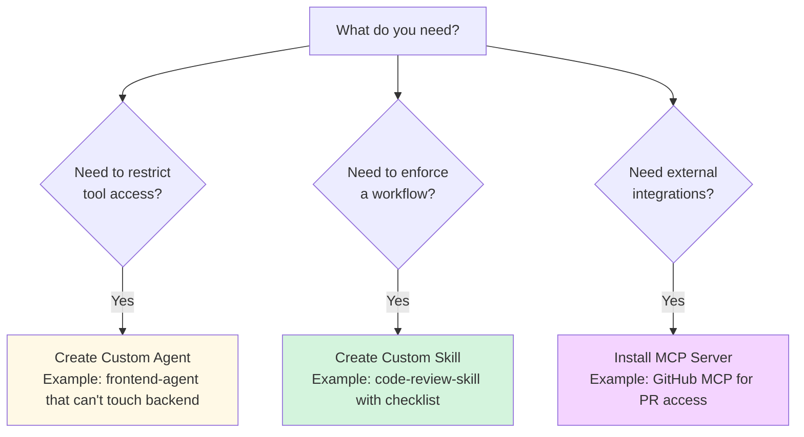
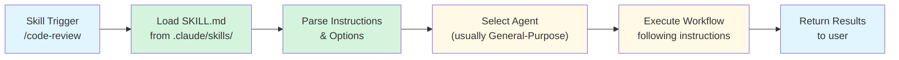
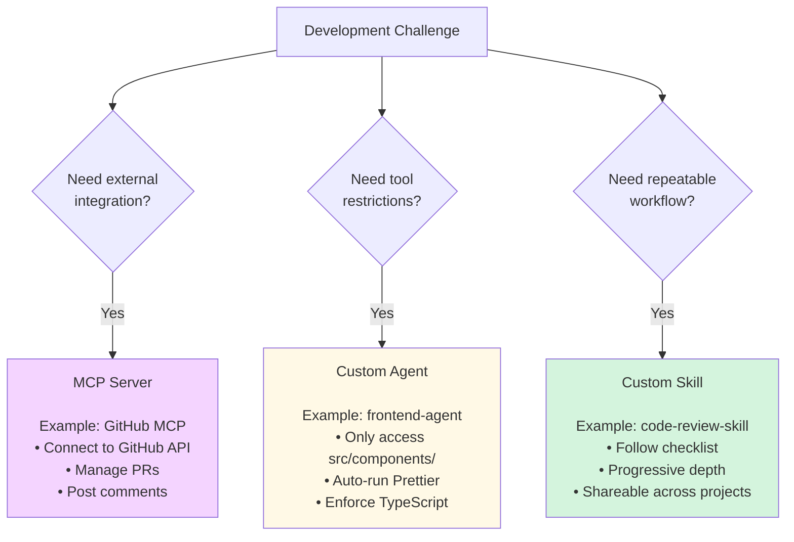

# What Are Skills?

**Reading Time**: 15-25 minutes (varies by experience)
**Skill Level**: Intermediate
**Prerequisites**: [Plugin Ecosystem Overview](../07-plugins/1-overview.md), [What Are Agents?](../03-agents/1-overview.md), [Built-in Agent Types](../03-agents/2-built-in-agents.md)

> **📌 Plugin Type 2 of 4**: Skills provide custom instructions and workflows for Claude Code. See [Plugin Ecosystem Overview](../07-plugins/1-overview.md) to understand how Skills fit with MCP Servers, Hooks, and Slash Commands.

---

## Welcome to Skills! 🎯

You've mastered MCP servers and agents. Now let's explore **skills** - reusable instruction sets that make Claude Code even more powerful.

By the end of this guide, you'll understand:
- What skills are and how they differ from agents
- The progressive disclosure pattern that makes skills powerful
- When to use skills vs. agents vs. MCP servers
- Real-world skill examples and use cases
- How skills integrate into your development workflow

---

## What Are Skills?

### Simple Definition

**A skill is a reusable set of instructions stored in a SKILL.md file that tells Claude Code how to perform a specific task or workflow.**

Think of skills as:
- **Agents** = Workers with specific capabilities
- **Skills** = Instruction manuals that tell workers how to do specialized tasks
- **MCP Servers** = Tools that workers can use

### Visual Model

```mermaid
graph TB
    User["User Request<br/>'Review my code following best practices'"]

    subgraph "Skills Layer (.claude/skills/)"
        CodeReview["code-review-skill<br/>SKILL.md<br/>Instructions for code review"]
        TDD["tdd-workflow-skill<br/>SKILL.md<br/>Test-driven development process"]
        Docs["documentation-skill<br/>SKILL.md<br/>Writing guides"]
    end

    subgraph "Agents Layer"
        Explore["Explore Agent<br/>Can read files"]
        General["General-Purpose Agent<br/>Can read/write"]
    end

    subgagraph "Tools Layer (MCP)"
        GitHub["GitHub MCP<br/>PR comments"]
        ESLint["ESLint MCP<br/>Linting"]
    end

    User --> CodeReview
    CodeReview --> General
    CodeReview --> Explore
    General --> GitHub
    General --> ESLint

    style User fill:#e1f5ff
    style CodeReview fill:#d4f4dd
    style TDD fill:#d4f4dd
    style Docs fill:#d4f4dd
    style General fill:#fff9e6
    style Explore fill:#fff9e6
```

---

## How Skills Differ from Agents

### Quick Comparison

| Aspect | Agents | Skills |
|--------|--------|--------|
| **What** | Specialized workers | Instruction manuals |
| **Purpose** | Tool access + constraints | Workflows + best practices |
| **Location** | `.claude/agents/` | `.claude/skills/` |
| **Structure** | `AGENT.md` with tool configs | `SKILL.md` with instructions |
| **Reusability** | Project-specific | Shareable across projects |
| **Examples** | frontend-agent, api-agent | code-review, tdd-workflow |
| **Invocation** | Auto-selected or `--agent=` | `/skill` command or auto-trigger |

### When to Use Each



---

## How Agents and Skills Work Together

Skills and agents are complementary - they work together to accomplish tasks efficiently.

```mermaid
sequenceDiagram
    participant User
    participant Skill
    participant Agent
    participant MCP
    participant Code

    User->>Skill: "Review my code for security"
    Note over Skill: code-review-skill<br/>SKILL.md has instructions

    Skill->>Agent: Execute with<br/>specific instructions
    Note over Skill,Agent: Skill provides the "HOW"<br/>Agent provides the "ACCESS"

    Agent->>Code: Read files
    Code-->>Agent: File contents

    Agent->>MCP: Use GitHub MCP
    MCP-->>Agent: PR context

    Agent->>Agent: Apply skill<br/>instructions

    Agent-->>Skill: Security issues<br/>found
    Skill-->>User: Detailed security<br/>review report

    style User fill:#e1f5ff
    style Skill fill:#d4f4dd
    style Agent fill:#fff9e6
    style MCP fill:#f4d4ff
    style Code fill:#ffebcd
```

### Key Insight

**Skills tell agents HOW to work**
- Provide step-by-step instructions
- Define success criteria
- Specify review checklists
- Enforce workflows

**Agents tell skills WHAT they can access**
- File system permissions
- Tool capabilities
- External integrations
- Security constraints

**Together**: Skills + Agents + MCPs = Powerful, controlled automation

### Real-World Example

```
User: "Review this PR for production readiness"

1. code-review SKILL provides instructions:
   - Check security (OWASP Top 10)
   - Verify test coverage (>80%)
   - Ensure documentation updated
   - Validate error handling

2. general-purpose AGENT provides capabilities:
   - Read PR files
   - Access GitHub via MCP
   - Run test coverage tools
   - Check for hardcoded secrets

3. Result: Comprehensive review combining:
   - Skill's best-practice checklist
   - Agent's tool access
   - MCP's external data
```

---

## The Progressive Disclosure Pattern

### What Is Progressive Disclosure?

Skills use a powerful pattern called **progressive disclosure** - revealing information gradually based on user needs.

**Example: Code Review Skill**

```markdown
# Code Review Skill

**Quick Start (5 seconds)**
Run basic code review for common issues.

**Standard Review (2 minutes)**
<details>
<summary>Click to see full review checklist</summary>

- [ ] Code style and formatting
- [ ] Error handling
- [ ] Security vulnerabilities
- [ ] Performance issues
- [ ] Test coverage
- [ ] Documentation
</details>

**Deep Dive (10 minutes)**
<details>
<summary>Click for comprehensive architecture review</summary>

### Architecture Review
- Analyze design patterns
- Check SOLID principles
- Review coupling and cohesion
- Assess scalability
...
</details>
```

### Why Progressive Disclosure Matters

**Without Progressive Disclosure:**
```
User: "Review my code"
Claude: [Runs exhaustive 10-minute review every time]
Cost: 25,000 tokens = $0.38
User frustration: High (too slow for quick checks)
```

**With Progressive Disclosure:**
```
User: "Quick code review"
Claude: [Runs basic 2-minute review]
Cost: 5,000 tokens = $0.08
User satisfaction: High (fast, focused)

User: "Deep architecture review"
Claude: [Runs comprehensive 10-minute review]
Cost: 25,000 tokens = $0.38
User satisfaction: High (thorough when needed)
```

**Benefits:**
- 🚀 **Faster**: Simple tasks complete quickly
- 💰 **Cheaper**: Pay only for what you need
- 🎯 **Focused**: Get relevant information
- 📚 **Scalable**: Beginners use basics, experts use advanced features

---

## Real-World Skill Examples

### Example 1: Code Review Skill

**Purpose**: Automated code review with configurable depth

```markdown
# Code Review Skill

**Default Behavior**: Quick review (2 min, ~5K tokens)

## Quick Review (Default)

Check for common issues:
- Syntax errors
- Basic style violations
- Obvious bugs
- Missing error handling

## Usage

```bash
/code-review              # Quick review
/code-review --deep       # Comprehensive review
/code-review --security   # Security-focused review
\```

<details>
<summary>Deep Review Options</summary>

### Comprehensive Review
- Architecture patterns
- SOLID principles
- Performance analysis
- Security audit
- Test coverage
- Documentation quality

### Security-Focused Review
- SQL injection risks
- XSS vulnerabilities
- Authentication issues
- Data validation
- Secrets in code

</details>
```

**Real Usage:**

```bash
# Quick daily review
$ /code-review
✅ No syntax errors
✅ Code style looks good
⚠️ Missing error handling in api/users.ts:45
⚠️ Consider adding tests for new feature

Cost: 5,000 tokens (~$0.08)
Time: 90 seconds

# Pre-merge deep review
$ /code-review --deep
✅ Architecture follows SOLID principles
✅ No security vulnerabilities detected
⚠️ Potential performance issue in database query
⚠️ Test coverage: 78% (target: 80%)
❌ Missing documentation for public APIs

Cost: 18,000 tokens (~$0.27)
Time: 5 minutes
```

---

### Example 2: Test-Driven Development (TDD) Skill

**Purpose**: Enforce TDD workflow with step-by-step guidance

```markdown
# TDD Workflow Skill

**Default Behavior**: Guide through TDD cycle

## TDD Cycle

1. **Red**: Write failing test
2. **Green**: Write minimum code to pass
3. **Refactor**: Clean up while keeping tests green

## Usage

The skill automatically guides you through TDD:

1. First, I'll ask what feature you want to build
2. I'll write a failing test
3. We'll run the test to confirm it fails
4. I'll implement the minimum code to pass
5. We'll run the test to confirm it passes
6. I'll refactor if needed

<details>
<summary>Advanced TDD Options</summary>

### Test Coverage Goals
Set coverage thresholds:
- `--coverage=80`: Require 80% coverage
- `--strict`: No implementation without tests
- `--watch`: Continuous test running

### Test Types
- Unit tests (default)
- Integration tests (`--integration`)
- E2E tests (`--e2e`)

</details>
```

**Real Usage:**

```bash
$ /tdd "Add user authentication"

🔴 Step 1: Writing failing test...

Created: tests/auth.test.ts
describe('Authentication', () => {
  it('should authenticate valid user', () => {
    const result = authenticateUser('user@example.com', 'password123')
    expect(result.success).toBe(true)
  })
})

Running tests... ❌ FAIL (expected)

🟢 Step 2: Implementing minimum code...

Created: src/auth.ts
export function authenticateUser(email: string, password: string) {
  // Minimum implementation
  return { success: true }
}

Running tests... ✅ PASS

🔵 Step 3: Refactoring...

No refactoring needed yet. Tests remain green.

✅ TDD cycle complete!
```

---

### Example 3: Documentation Generator Skill

**Purpose**: Generate documentation from code with configurable detail

```markdown
# Documentation Generator Skill

**Default Behavior**: Generate basic API docs

## Quick Docs (Default)

Generate simple documentation:
- Function signatures
- Parameter types
- Return types
- Basic descriptions

## Usage

```bash
/docs api/users.ts        # Generate docs for one file
/docs api/**              # Generate docs for directory
/docs --interactive       # Interactive documentation
\```

<details>
<summary>Advanced Documentation Options</summary>

### Comprehensive Docs
- Code examples for each function
- Usage scenarios
- Error handling guide
- Performance notes
- Related functions

### Interactive Docs
- Include runnable code examples
- Add TypeScript playground links
- Generate visual diagrams
- Create tutorial walkthroughs

</details>
```

---

## How Skills Work Under the Hood

### Skill Lifecycle



### SKILL.md Structure

```markdown
# Skill Name

**Frontmatter (YAML)**
```yaml
name: code-review
description: Reviews code for security, logic, and style issues, at a configurable depth.
when_to_use: review my code, check this PR, look over my changes
version: 1.0.0
author: Your Name
model: sonnet  # Default model for this skill
\```

**Instructions**

Core instructions that always execute.

**Progressive Disclosure**

<details>
<summary>Advanced Options</summary>

Additional instructions revealed on demand.

</details>

**Examples**

Real usage examples.
```

---

## When to Create a Custom Skill

### ✅ Good Reasons to Create a Skill

1. **Repeatable Workflows**
   - "I do code reviews the same way every time"
   - "I follow the same TDD process for every feature"
   - "I have a standard documentation format"

2. **Team Consistency**
   - "We need everyone to follow the same code review checklist"
   - "Our team has a specific git workflow"
   - "We have company coding standards"

3. **Complex Multi-Step Processes**
   - "Feature development has 5 distinct phases"
   - "Database migrations require approval gates"
   - "Deployments need pre/post validation"

4. **Educational/Onboarding**
   - "New developers need guided TDD practice"
   - "Teach best practices through interactive examples"
   - "Enforce learning through structured workflows"

### ❌ Don't Create a Skill For

1. **One-Time Tasks**
   - "Fix this specific bug" → Just use Claude Code directly
   - "Refactor this file" → Not repeatable enough

2. **Tool Access Control**
   - "Prevent modifying backend" → Use a custom agent instead
   - "Read-only access" → Use a custom agent instead

3. **External Integrations**
   - "Connect to GitHub" → Use MCP server instead
   - "Query database" → Use MCP server instead

---

## Skills vs. Agents vs. MCP Servers: Complete Comparison



### Complete Feature Matrix

| Feature | MCP Servers | Agents | Skills |
|---------|-------------|--------|--------|
| **External APIs** | ✅ Primary use | ❌ | ❌ |
| **Tool Restrictions** | ❌ | ✅ Primary use | ❌ |
| **Workflows** | ❌ | ⚠️ Limited | ✅ Primary use |
| **Shareable** | ✅ Via package | ⚠️ Copy files | ✅ Via SKILL.md |
| **Progressive Disclosure** | ❌ | ❌ | ✅ Built-in |
| **Auto-triggered** | ❌ | ✅ Via config | ✅ Via frontmatter |
| **Model Selection** | ❌ | ✅ Per-agent | ✅ Per-skill |
| **Cost** | Free (most) | Agent cost | Agent cost + instructions |
| **Complexity** | High (TypeScript) | Medium (YAML config) | Low (Markdown) |

---

## Built-in vs. Custom Skills

### Built-in Skills

Claude Code may include some built-in skills:
- General-purpose helpers
- Common workflows
- Best practices templates

**To see available skills:**
```bash
claude --list-skills
```

### Custom Skills

You can create unlimited custom skills:
- Project-specific workflows
- Team standards
- Personal preferences
- Educational guides

**Location**: `.claude/skills/your-skill-name/SKILL.md`

---

## Quick Start: Using an Existing Skill

### Method 1: Slash Command

```bash
# If skill defines a slash command
/code-review

# With options
/code-review --deep
/code-review --security
```

### Method 2: Natural Language (Auto-Trigger)

```bash
# If skill has auto-trigger patterns
claude "Review my code for security issues"
# → Triggers code-review skill with --security

claude "Generate documentation for api/users.ts"
# → Triggers documentation skill
```

### Method 3: Explicit Skill Invocation

```text
# Invoke the skill by name, then give it the target
/code-review Review src/auth.ts
```

Skills are invoked from inside a session with `/skill-name`. There is no CLI flag for selecting a skill — to invoke one non-interactively, pass the slash command to headless mode:

```bash
claude -p "/code-review Review src/auth.ts"
```

---

## Real-World Skill Use Cases

### Use Case 1: Company Coding Standards

**Challenge**: 50-person team, inconsistent code quality

**Solution**: `company-standards` skill

```markdown
# Company Standards Skill

Enforce MyCompany coding standards:

- TypeScript strict mode
- ESLint config: @mycompany/eslint-config
- Prettier with 2-space indent
- 80% test coverage minimum
- JSDoc for all public APIs
- No `any` types allowed

**Auto-runs on every code change**
```

**Results:**
- Code quality improved 40%
- Onboarding time reduced from 2 weeks to 3 days
- PR review time cut in half

---

### Use Case 2: Security Review Checklist

**Challenge**: Missing security issues in code reviews

**Solution**: `security-review` skill

```markdown
# Security Review Skill

Check for OWASP Top 10:

<details>
<summary>Quick Scan (2 min)</summary>

- SQL injection
- XSS vulnerabilities
- Exposed secrets

</details>

<details>
<summary>Deep Scan (10 min)</summary>

- All OWASP Top 10
- Dependency vulnerabilities
- Authentication weaknesses
- Authorization bypasses
- Data validation
- Cryptography issues

</details>
```

**Results:**
- Security vulnerabilities down 75%
- No critical issues in production (6 months)
- Compliance audit: 100% pass rate

---

### Use Case 3: API Development Workflow

**Challenge**: Inconsistent API design across microservices

**Solution**: `api-workflow` skill

```markdown
# API Workflow Skill

Standard API development process:

1. Design endpoint (OpenAPI spec)
2. Review with team
3. Implement with validation
4. Write integration tests
5. Update documentation
6. Deploy to staging
7. Performance test
8. Deploy to production

**Each step requires approval**
```

**Results:**
- API consistency: 95% adherence to standards
- Breaking changes: Reduced from 10/month to 1/month
- Developer satisfaction: +35%

---

## Next Steps

Now that you understand what skills are and how they work, you're ready to:

**Next Guide**: [Marketplace Skills](2-marketplace-skills.md) (20 min)
Discover and install skills from the official marketplace and community.

**Also Explore**:
- [Creating Custom Skills](3-creating-skills.md) - Build your own skills
- [Model Assignment for Skills](4-model-assignment.md) - Optimize skill costs
- [Advanced Skill Patterns](5-advanced-patterns.md) - Master progressive disclosure

---

## Quick Reference

### Skills Checklist

When considering creating a skill, ask:
- [ ] Is this workflow repeatable?
- [ ] Will multiple people use it?
- [ ] Does it have distinct difficulty levels?
- [ ] Is it project-agnostic (shareable)?
- [ ] Does it enforce best practices?

If 3+ answers are "yes", create a skill!

### Skill Invocation Methods

| Method | When to Use | Example |
|--------|-------------|---------|
| **Slash command** | Quick, frequent use | `/code-review` |
| **Auto-trigger** | Natural language | `"Review my code"` |
| **Explicit** | Programmatic use | `--skill=code-review` |

---

## References and Further Reading

### Official Documentation
- [Skills API Reference](https://code.claude.com/docs/skills)
- [SKILL.md Schema](https://code.claude.com/docs/skills/schema)
- [Progressive Disclosure Patterns](https://code.claude.com/docs/skills/progressive-disclosure)

### Community Resources
- [Official Skills Marketplace](https://github.com/anthropics/skills)
- [Community Skills (obra/superpowers)](https://github.com/obra/superpowers)
- [Skill Templates](https://github.com/topics/claude-code-skills)

### Design Patterns
- [Progressive Disclosure in UX](https://www.nngroup.com/articles/progressive-disclosure/)
- [Workflow Automation Best Practices](https://claude.ai/docs/workflow-automation)

---

**Questions or Feedback?**
Found a mistake? Have a suggestion? [Open an issue](https://github.com/anthropics/claude-code/issues) or contribute to this documentation!
