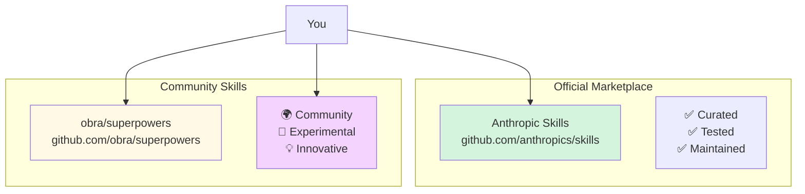

# Marketplace Skills

**Reading Time**: 20 minutes
**Skill Level**: Beginner
**Prerequisites**: [What Are Skills?](1-overview.md)

---

## Welcome to the Skills Marketplace! 🛍️

Before creating your own skills, explore hundreds of ready-to-use skills from the official marketplace and community.

By the end of this guide, you'll be able to:
- Discover skills in the official marketplace
- Install skills from the community
- Configure installed skills for your project
- Update and manage your skill collection
- Contribute skills back to the community

---

## What Is the Skills Marketplace?

### Two Main Sources



**Official Marketplace**: [github.com/anthropics/skills](https://github.com/anthropics/skills)
- Curated by Anthropic
- Thoroughly tested
- Well-documented
- Regularly updated
- Production-ready

**Community Skills**: [github.com/obra/superpowers](https://github.com/obra/superpowers)
- Community-contributed
- Experimental features
- Rapid innovation
- Diverse use cases
- May need testing

---

## Browsing Available Skills

Skills reach you two ways, and it is worth knowing which you are dealing with before you go
looking:

| Source | What you get | Invoked as |
|--------|-------------|-----------|
| **A plugin from a marketplace** | Versioned, updatable, may bundle agents and hooks too | `/plugin-name:skill-name` |
| **A directory you place yourself** | Whatever you wrote or copied in | `/skill-name` |

There is no `claude skills` command and no separate skills registry. Marketplace skills ship
inside **plugins**, so browsing and installing go through the plugin manager.

### Method 1: The plugin manager

```text
/plugin
```

This opens the manager, where you can browse the marketplaces you have added, install and
remove plugins, and check the **Errors** tab when something fails to load.

Anthropic maintains two marketplaces:

| Marketplace | Contents | How to get it |
|-------------|----------|---------------|
| `claude-plugins-official` | Curated by Anthropic | Registered automatically on first interactive start |
| `claude-community` | Third-party submissions, after review | `/plugin marketplace add anthropics/claude-plugins-community` |

If a script runs before your first interactive session, add the official marketplace
explicitly:

```bash
claude plugin marketplace add anthropics/claude-plugins-official
```

### Method 2: Browse the catalogs on GitHub

- [Anthropic skills](https://github.com/anthropics/skills) — reference skills, including `skill-creator`
- [Official plugin marketplace](https://github.com/anthropics/claude-plugins-official) — the curated catalog
- [Community catalog](https://github.com/anthropics/claude-plugins-community) — the reviewed community marketplace
- [obra/superpowers](https://github.com/obra/superpowers) — a large community collection

Reading `marketplace.json` in either Anthropic catalog is the reliable way to check whether a
plugin is installable yet, since the public catalog syncs on a delay.

### Method 3: GitHub topics

Search GitHub for `topic:claude-code-skills`, `topic:claude-skills`, or
`topic:anthropic-skills`.

---

## Installing Skills

### From a marketplace

```text
/plugin install <plugin>@<marketplace>
/reload-plugins
```

For example, to install the skill-creator plugin from the official marketplace:

```text
/plugin install skill-creator@claude-plugins-official
/reload-plugins
```

`/reload-plugins` makes the plugin's skills available in the current session without
restarting. Without it you will not see the new skills until your next session.

**If the install fails**, two errors are common and both have specific fixes:

| Error | Fix |
|-------|-----|
| `Marketplace "claude-plugins-official" not found` | `/plugin marketplace add anthropics/claude-plugins-official` |
| Plugin not found in the marketplace | Your local copy is stale: `/plugin marketplace update claude-plugins-official`, then retry |

**Namespacing**: plugin skills are always invoked as `/plugin-name:skill-name`, never as the
bare name. This is deliberate — it prevents two plugins that both ship a `review` skill from
colliding.

### By placing a directory

For a skill you wrote, copied from a repo, or are still iterating on, there is no install step
at all. Put the directory where Claude Code looks:

| Scope | Path |
|-------|------|
| Just you, every project | `~/.claude/skills/<name>/SKILL.md` |
| This project, shared via git | `.claude/skills/<name>/SKILL.md` |

```bash
# Copy a skill out of a cloned collection
git clone https://github.com/obra/superpowers /tmp/superpowers
cp -r /tmp/superpowers/skills/tdd-master .claude/skills/
```

The skill exists the moment its directory does. Nothing registers it, nothing enables it, and
**deleting the directory uninstalls it.** Copying one in by hand installs it. Nothing else has
to agree.

The command name comes from the **directory name**, so `.claude/skills/tdd-master/SKILL.md`
gives you `/tdd-master` regardless of what the frontmatter `name` field says.

### Trying a plugin without installing it

To evaluate a plugin, or to test one you are developing, load it for a single session:

```bash
claude --plugin-dir ./my-plugin      # a local directory, or a .zip
claude --plugin-url https://example.com/my-plugin.zip
```

A `--plugin-dir` copy takes precedence over an installed plugin of the same name for that
session, which lets you test a change without uninstalling anything first.

> ⚠️ **Plugins run code.** A plugin can bundle hooks, MCP servers, and executables that run on
> your machine. Apply the same scrutiny you would to any dependency, and prefer the curated
> marketplace or repositories you can read.

---

## Popular Official Skills Catalog

### 🧪 Testing & Quality

#### **code-review**
**Purpose**: Automated code review with configurable depth
**Usage**: `/code-review [--deep] [--security]`
**Model**: Sonnet (default)
**Cost**: ~5K-20K tokens depending on depth

```text
/code-review               # Quick review
/code-review --deep        # Comprehensive review
/code-review --security    # Security-focused
```

**Features**:
- ✅ Syntax and style checking
- ✅ Security vulnerability detection
- ✅ Performance analysis
- ✅ Test coverage review
- ✅ Progressive disclosure (quick → deep)

---

#### **tdd-workflow**
**Purpose**: Test-Driven Development with guided workflow
**Usage**: `/tdd "feature description"`
**Model**: Sonnet
**Cost**: ~8K-15K tokens per TDD cycle

```text
/tdd "Add user authentication"

# Guides you through:
# 1. Write failing test (Red)
# 2. Implement minimum code (Green)
# 3. Refactor (Blue)
```

**Features**:
- ✅ Enforces TDD cycle
- ✅ Automatic test running
- ✅ Coverage tracking
- ✅ Refactoring suggestions

---

#### **test-generator**
**Purpose**: Generate comprehensive test suites
**Usage**: `/generate-tests <file>`
**Model**: Sonnet
**Cost**: ~10K-25K tokens

```text
/generate-tests src/auth.ts

# Generates:
# - Unit tests
# - Integration tests
# - Edge case tests
# - Mocks and fixtures
```

---

### 📚 Documentation

#### **api-docs**
**Purpose**: Generate API documentation from code
**Usage**: `/api-docs <file or directory>`
**Model**: Sonnet
**Cost**: ~8K-20K tokens

```text
/api-docs api/users.ts              # Single file
/api-docs api/**                    # Entire directory
/api-docs api/** --interactive      # With examples
```

**Features**:
- ✅ OpenAPI/Swagger generation
- ✅ JSDoc/TSDoc extraction
- ✅ Code examples
- ✅ Interactive playground links

---

#### **readme-generator**
**Purpose**: Create comprehensive README files
**Usage**: `/readme-gen`
**Model**: Sonnet
**Cost**: ~12K-30K tokens

```text
/readme-gen

# Generates:
# - Project overview
# - Installation instructions
# - Usage examples
# - API reference
# - Contributing guidelines
```

---

### 🔒 Security

#### **security-audit**
**Purpose**: Comprehensive security vulnerability scan
**Usage**: `/security-audit [--quick | --deep]`
**Model**: Opus (deep), Sonnet (quick)
**Cost**: ~15K-50K tokens

```text
/security-audit --quick     # Fast scan
/security-audit --deep      # OWASP Top 10 + more

# Checks:
# - SQL injection
# - XSS vulnerabilities
# - Authentication issues
# - Secrets in code
# - Dependency vulnerabilities
```

---

#### **secrets-scanner**
**Purpose**: Detect hardcoded secrets and credentials
**Usage**: `/scan-secrets`
**Model**: Haiku (fast, cheap)
**Cost**: ~3K-8K tokens

```text
/scan-secrets

# Detects:
# - API keys
# - Passwords
# - Private keys
# - Tokens
# - Certificates
```

---

### 🎨 Frontend Development

#### **component-generator**
**Purpose**: Generate React/Vue/Svelte components
**Usage**: `/component <ComponentName> [--framework=react]`
**Model**: Sonnet
**Cost**: ~8K-15K tokens

```text
/component LoginForm --framework=react
/component UserCard --framework=vue
/component Modal --framework=svelte

# Generates:
# - Component file
# - Styles (CSS modules)
# - TypeScript types
# - Tests
# - Storybook story
```

---

#### **css-optimizer**
**Purpose**: Optimize and refactor CSS/SCSS
**Usage**: `/optimize-css <file>`
**Model**: Sonnet
**Cost**: ~6K-12K tokens

```text
/optimize-css src/styles/app.css

# Optimizations:
# - Remove duplicates
# - Consolidate rules
# - Improve specificity
# - Add CSS variables
# - Mobile-first approach
```

---

### ⚙️ Backend Development

#### **api-scaffold**
**Purpose**: Generate REST/GraphQL API boilerplate
**Usage**: `/api-scaffold <resource> [--type=rest]`
**Model**: Sonnet
**Cost**: ~15K-30K tokens

```text
/api-scaffold User --type=rest

# Generates:
# - Routes
# - Controllers
# - Services
# - Models
# - Validation
# - Tests
# - OpenAPI docs
```

---

#### **database-migration**
**Purpose**: Generate and validate database migrations
**Usage**: `/migration <description>`
**Model**: Sonnet
**Cost**: ~10K-20K tokens

```text
/migration "Add email verification to users table"

# Generates:
# - Migration file (up/down)
# - Model updates
# - Validation
# - Rollback plan
# - Tests
```

---

## Community Skills Highlights

### obra/superpowers

Visit: [github.com/obra/superpowers](https://github.com/obra/superpowers)

**Notable Skills**:

#### **commit-message-generator**
```text
# Copy it in: cp -r superpowers/skills/commit-msg .claude/skills/

# Auto-generates conventional commit messages
/commit-msg

# Example output:
# feat(auth): add JWT token validation
#
# - Implement JWT middleware
# - Add token expiration checks
# - Update tests for auth flow
```

#### **pr-description-generator**
```text
# Copy it in: cp -r superpowers/skills/pr-desc .claude/skills/

# Generates comprehensive PR descriptions
/pr-desc

# Includes:
# - Summary of changes
# - Breaking changes
# - Test plan
# - Screenshots (for UI changes)
# - Checklist for reviewers
```

#### **refactor-assistant**
```text
# Copy it in: cp -r superpowers/skills/refactor .claude/skills/

# Interactive refactoring guide
/refactor src/legacy-code.ts

# Suggests:
# - Design pattern improvements
# - Code smell fixes
# - Performance optimizations
# - Test coverage additions
```

---

## Configuring Installed Skills

### Per-Skill Configuration

A skill is configured in its own `SKILL.md` frontmatter. There is no central file listing your
skills and their options.

`.claude/skills/api-docs/SKILL.md`:
```yaml
---
name: api-docs
description: Generate OpenAPI documentation from route handlers
model: haiku
allowed-tools: Read, Glob, Grep, Write
---
```

Useful frontmatter fields when tuning an installed skill:

| Field | What it does |
|-------|--------------|
| `model` | Which model runs the skill (`haiku`, `sonnet`, `opus`, `fable`, or a full model ID) |
| `effort` | Reasoning effort: `low`, `medium`, `high`, `xhigh`, `max` |
| `allowed-tools` / `disallowed-tools` | Narrow what the skill is permitted to touch |
| `disable-model-invocation` | Make the skill manual-only, never auto-selected |
| `user-invocable` | Whether it appears as a slash command |
| `paths` | File patterns the skill is relevant to |

Note that `model` is scoped to the current turn — it does not rewrite your session model. The
next prompt goes back to whatever model the session was on.

### Behavior That Isn't a Frontmatter Field

Things like a style guide, a coverage threshold, or which files to skip are not settings — they
are instructions. Put them in the skill's markdown body, where the model actually reads them:

`.claude/skills/code-review/SKILL.md`:
```markdown
## Review Rules

- Enforce the Airbnb style guide; flag lines over 100 characters
- Require tests for any new exported function
- Treat `console.log` in committed code as a warning, not an error
- Always run the security checks, even on small diffs

Skip `**/*.test.ts`, `**/vendor/**`, and `**/.generated/**`.
```

If a skill needs machine-readable data of its own, it can ship files alongside `SKILL.md` and
reference them from its instructions. Claude Code does not look for a config file in the skill
directory.

### Project-Wide Settings

Genuinely project-wide choices go in `.claude/settings.json` — committed to git, shared by the
team:

```json
{
  "model": "sonnet",
  "permissions": {
    "allow": ["Bash(npm test:*)"],
    "ask": ["Bash(git push:*)"]
  }
}
```

Keep personal, uncommitted overrides in `.claude/settings.local.json`, which takes precedence
and is gitignored.

---

## Managing Your Skills

How you manage a skill depends on how it got there. Plugin skills go through the plugin
manager; skills you placed yourself are just files.

### See what you have

```text
/plugin      # installed plugins, per marketplace, with an Errors tab
/context     # what actually loaded this session, including skills
/help        # the Custom commands tab lists every invocable skill
```

For skills you placed yourself, the filesystem is the source of truth:

```bash
ls ~/.claude/skills/     # personal
ls .claude/skills/       # project
```

### Update

Plugin skills update through the manager. Refresh the marketplace catalog first, since a stale
local copy is the usual reason an update appears unavailable:

```text
/plugin marketplace update claude-plugins-official
/plugin
```

Whether a plugin offers an update depends on its `version` field. If the author omits it and
distributes via git, every commit counts as a new version.

Skills you placed yourself do not update — they are your files. Re-copy from upstream if you
pulled one from a collection.

### Remove

```text
/plugin      # uninstall a plugin from the manager
```

```bash
rm -rf .claude/skills/code-review     # a skill you placed yourself
```

Deleting the directory is the uninstall. There is no separate registry to clean up.

### Turn a skill off without deleting it

Three options, in increasing scope:

| Goal | How |
|------|-----|
| Stop Claude auto-invoking it, keep `/name` | `disable-model-invocation: true` in its frontmatter |
| Hide it from the `/` menu entirely | `user-invocable: false` |
| Block skills by name across the project | `permissions.deny` in `.claude/settings.json` |

For a plugin, disabling it in `/plugin` turns off everything it ships — skills, agents, hooks,
and MCP servers together.

---

## Creating a Skills Collection

### Team Skills Bundle

Create a bundle for your team:

`team-skills.json`:
```json
{
  "name": "MyCompany Development Stack",
  "version": "1.0.0",
  "skills": [
    "code-review@1.2.0",
    "tdd-workflow@2.0.1",
    "security-audit@3.1.0",
    "api-scaffold@1.0.0",
    "github.com/mycompany/custom-skill"
  ],
  "config": {
    "code-review": {
      "styleGuide": "mycompany",
      "minCoverage": 85
    }
  }
}
```

**Share the collection**: there is no bundle installer. Two real options:

- **Commit `.claude/skills/`** to the project repo. Teammates get every skill on clone, and
  nothing has to be installed.
- **Package them as a plugin** and distribute through a marketplace, which gives you versioning
  and updates. See [Plugin Ecosystem](../07-plugins/1-overview.md).

---

## Skill Quality Indicators

### Official Skills

All official skills are:
- ✅ **Tested**: Automated test coverage
- ✅ **Documented**: Complete usage guides
- ✅ **Maintained**: Regular updates
- ✅ **Versioned**: Semantic versioning
- ✅ **Reviewed**: Code review by Anthropic

### Community Skills

Check these indicators:
- ⭐ **Stars**: Community popularity
- 🍴 **Forks**: Active usage
- 📝 **README**: Documentation quality
- 🧪 **Tests**: Test coverage
- 📅 **Last Updated**: Recent maintenance
- 💬 **Issues**: Responsiveness

**Quality Checklist:**
```bash
# Before installing community skill, check:
- [ ] Has README with clear usage examples
- [ ] Updated within last 3 months
- [ ] Has tests (look for __tests__ or *.test.*)
- [ ] Has multiple contributors
- [ ] Has semantic versioning
- [ ] Issues are addressed (not ignored)
```

---

## Troubleshooting

### Skill Won't Install

```bash
# Check Claude Code version
claude --version

# Ensure you have latest version
npm install -g @anthropic/claude-code

# For a plugin, check the /plugin manager's Errors tab, then see why with:
claude --debug

# For a skill you place yourself, "installing" is a copy — so verify the copy:
git clone https://github.com/anthropics/skills
cp -r skills/code-review ~/.claude/skills/
ls ~/.claude/skills/code-review/SKILL.md
```

### Skill Not Triggering

```bash
# Confirm the skill actually loaded this session
/context

# Check what the skill advertises — `description` (plus `when_to_use`) is what Claude
# reads to decide whether to invoke it. A vague description is the usual cause.
head -10 .claude/skills/code-review/SKILL.md

# Force skill invocation
/code-review Review my code
```

### Skill Errors

```bash
# Check skill logs
cat .claude/logs/skills/code-review.log

# Validate a plugin's structure (plugins only; add --strict to fail on warnings)
claude plugin validate ./my-plugin

# For a skill you placed yourself there is nothing to validate or reset —
# check the frontmatter parses as YAML and that the file is where you think:
head -10 .claude/skills/code-review/SKILL.md
ls -la .claude/skills/code-review/
```

### Conflicting Skills

Two skills whose descriptions overlap ("review my code") compete for the same requests. Claude
picks one by reading the descriptions — there is no ranking or confidence score to inspect.

```bash
# Fix 1: Skip the guessing and name the skill you want
/security-audit Review my code
```

```yaml
# Fix 2: Narrow the descriptions so they no longer overlap
# .claude/skills/code-review/SKILL.md
description: Reviews code for logic errors, style, and maintainability.

# .claude/skills/security-audit/SKILL.md
description: Audits code for security vulnerabilities: injection, authn, secret handling.
```

---

## Best Practices

### 1. Start with Official Skills

✅ **Do**: Start from the curated marketplace
```text
/plugin marketplace update claude-plugins-official
/plugin
```

❌ **Don't**: Copy in untested community skills right away — a skill can carry hooks and
scripts that run on your machine

---

### 2. Configure for Your Project

✅ **Do**: Customize skill settings
```json
{
  "skills": {
    "code-review": {
      "options": {
        "styleGuide": "your-company-guide",
        "minCoverage": 85
      }
    }
  }
}
```

❌ **Don't**: Use default settings for everything

---

### 3. Keep Skills Updated

✅ **Do**: Regular updates
```bash
# Weekly or monthly: refresh catalogs, then review updates in the manager
/plugin marketplace update claude-plugins-official
/plugin
```

❌ **Don't**: Let skills get outdated (security risks)

---

### 4. Disable Unused Skills

✅ **Do**: Turn off what you are not using. Every enabled skill's description sits in your
context at startup, and a crowded listing makes Claude's selection less accurate.

```text
/plugin      # disable a whole plugin
```

```bash
rm -rf .claude/skills/unused-skill    # or just delete it
```

To keep a skill but stop Claude reaching for it, set `disable-model-invocation: true` in its
frontmatter — it stays available as `/unused-skill`.

❌ **Don't**: Keep dozens of skills enabled and wonder why the wrong one fires

---

## Contributing Skills to the Marketplace

Want to share your skill? See: [Creating Custom Skills](3-creating-skills.md)

**Contribution Process:**

1. **Create your skill** following best practices
2. **Test thoroughly** with automated tests
3. **Document** with clear examples
4. **Submit** to GitHub repository
5. **Review** by community/Anthropic
6. **Publish** to marketplace

**Official Skills Submission:**
- Fork: [github.com/anthropics/skills](https://github.com/anthropics/skills)
- Create skill in `/skills/your-skill/`
- Submit pull request
- Pass CI/CD checks
- Community review
- Merge and publish

**Community Skills:**
- Any GitHub repository
- Tag with `claude-code-skills`
- Share on community forums

---

## Quick Reference

### Essential Commands

In-session, for plugin skills:

```text
/plugin                                    # browse, install, remove; Errors tab
/plugin marketplace add <owner/repo>       # add a marketplace
/plugin marketplace update <marketplace>   # refresh a stale catalog
/plugin install <plugin>@<marketplace>     # install
/reload-plugins                            # load without restarting
/context                                   # confirm what loaded
```

From the shell, for plugin development:

```bash
claude plugin init <name>            # scaffold a plugin
claude plugin validate ./my-plugin   # validate; --strict fails on warnings
claude --plugin-dir ./my-plugin      # load for one session, no install
claude --debug                        # see why a plugin failed to load
```

For skills you place yourself, the shell commands are just file operations:

```bash
ls .claude/skills/                    # what you have
cp -r <source> .claude/skills/        # install
rm -rf .claude/skills/<name>          # uninstall
```

### Recommended Starter Pack

Most of the workflows people reach for first are things you write rather than install — a
review checklist, a TDD loop, a docs generator. The fastest way to get a good version of each
is to let `skill-creator` build and measure them:

```text
/plugin install skill-creator@claude-plugins-official
/reload-plugins
```

Then ask Claude to create the skill you want. See
[Creating Custom Skills](3-creating-skills.md) for the authoring workflow and
[Advanced Patterns](5-advanced-patterns.md#advanced-evaluation-patterns) for evaluating them.

**Benefit**: skills matched to your codebase and conventions, rather than generic ones

---

## Troubleshooting Skill Issues

### Issue 1: Skill Not Found or Won't Load

**Symptom**: "Skill not found" or skill doesn't execute

**Common Causes**:
- Skill not installed correctly
- Wrong skill name
- Skill file in wrong directory
- Syntax error in SKILL.md

**Solutions**:
```bash
# Is the file where Claude Code looks?
ls .claude/skills/<name>/SKILL.md
ls ~/.claude/skills/<name>/SKILL.md

# Does the frontmatter parse? A broken --- block silently drops the skill
head -10 .claude/skills/<name>/SKILL.md

# For plugin skills, check the manager's Errors tab, then:
claude --debug
```

---

### Issue 2: Skill Produces Incorrect Results

**Symptom**: Skill runs but output doesn't match expectations

**Common Causes**:
- Wrong model assigned (too simple for task)
- Incomplete skill instructions
- Skill designed for different context

**Solutions**:
```yaml
# Check skill's model assignment
---
name: my-skill
model: sonnet  # Try upgrading to opus for better quality
---

# Switch the session model with /model, then invoke the skill
/model opus
/my-skill Complex task

# Review skill instructions for clarity
# Skills should have specific, actionable steps
```

---

### Issue 3: Skill Too Expensive

**Symptom**: Skill uses more tokens/costs more than expected

**Common Causes**:
- Skill using Opus when Haiku sufficient
- No progressive disclosure
- Reading too many files

**Solutions**:
```yaml
# Assign cheaper model for simple tasks
---
description: What the skill does and when to use it
model: haiku     # Use haiku instead of sonnet
effort: low      # Lower the effort dial before lowering the model tier
---
```

**Optimize skill structure:**
```markdown
# Core instructions (always loaded)
Quick steps for simple use case

<details>
<summary>Advanced Options (loaded only when needed)</summary>

Detailed instructions for complex scenarios

</details>
```

---

### Issue 4: Skill Conflicts with Another Skill

**Symptom**: Multiple skills triggering or interference

**Common Causes**:
- Similar auto-trigger patterns
- Skills modifying same files
- Namespace collisions

**Solutions**:
```yaml
# Make the description more specific — it is what Claude matches on
---
description: Reviews code for security vulnerabilities (injection, authn, secrets).  # Specific
# NOT: description: Reviews code                                                     # Too broad
paths:
  - "**/auth/**"   # Optional: only activate for the files this skill cares about
---

# Sharpen the descriptions so they stop overlapping — this is the real fix, since
# description is what Claude matches on. Or set disable-model-invocation: true on
# the one you want to invoke manually only.

# Meanwhile, name the skill you want explicitly:
/security-review Review my code
```

---

### Issue 5: Skill Dependencies Not Met

**Symptom**: "Missing dependency" or skill fails to run

**Common Causes**:
- Required skill not installed
- Required MCP server not configured
- Required tools not available

**Solutions**:

There is no `dependencies` field and no dependency resolution between skills. A skill that
needs another one's behavior should say so in its instructions, and a skill that needs an MCP
server should name the tool with its server prefix.

Name MCP tools with their server prefix so the right one resolves:

```markdown
Use the GitHub:create_issue tool to open the issue.
```

> 📌 **Two prefixes, two contexts — both correct.** In a skill's written instructions, use
> `ServerName:tool_name` as above. In anything that *matches* a tool by name — a permission
> rule, a subagent's `tools` list, a hook matcher — use the runtime form
> `mcp__<server>__<tool>`, so `mcp__github__create_issue`. Seeing both is not a typo. See
> [MCP Servers](../01-mcp-servers/1-overview.md) for the runtime naming.

Then make sure the server is actually configured:

```bash
claude mcp list
claude mcp add github
```

---

### Still Having Issues?

1. **Check skill documentation**: Each marketplace skill should have detailed README
2. **Test with simple example**: Try skill on minimal test case first
3. **Review skill source**: Open `.claude/skills/<skill-name>/SKILL.md` to understand behavior
4. **Ask community**: [Skills Discussion Forum](https://github.com/anthropics/skills/discussions)
5. **Report bugs**: [Open an issue](https://github.com/anthropics/skills/issues) for marketplace skills

---

## Next Steps

Now that you know how to discover and use marketplace skills, you're ready to:

**Next Guide**: [Creating Custom Skills](3-creating-skills.md) (70 min)
Learn to build your own custom skills for your unique workflows.

**Also Explore**:
- [Model Assignment for Skills](4-model-assignment.md) - Optimize skill costs
- [Advanced Skill Patterns](5-advanced-patterns.md) - Master progressive disclosure
- [Skills API Reference](https://code.claude.com/docs/skills) - Complete API docs

---

## References and Further Reading

### Official Resources
- [Official Skills Marketplace](https://github.com/anthropics/skills)
- [Skills Documentation](https://code.claude.com/docs/skills)
- [Skills API Reference](https://code.claude.com/docs/skills/api)

### Community Resources
- [obra/superpowers](https://github.com/obra/superpowers)
- [Community Skills Forum](https://community.claude.com/skills)
- [GitHub Topic: claude-code-skills](https://github.com/topics/claude-code-skills)

### Tutorials
- [Building Your First Skill](https://code.claude.com/tutorials/first-skill)
- [Contributing to the Marketplace](https://code.claude.com/docs/contributing)

---

**Questions or Feedback?**
Found a mistake? Have a suggestion? [Open an issue](https://github.com/anthropics/claude-code/issues) or contribute to this documentation!
