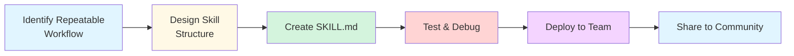
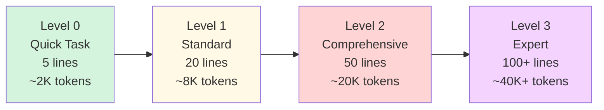

# Creating Custom Skills

**Reading Time**: 70 minutes
**Skill Level**: Advanced
**Prerequisites**: [What Are Skills?](1-overview.md), [Marketplace Skills](2-marketplace-skills.md), [Creating Custom Agents](../03-agents/4-custom-agents.md)

---

## Welcome to Skill Creation! 🛠️

You've learned what skills are and how to use marketplace skills. Now it's time to **build your own custom skills** for your unique workflows.

By the end of this guide, you'll be able to:
- Create SKILL.md files with proper structure
- Configure frontmatter for auto-triggering and model selection
- Implement progressive disclosure patterns
- Test and debug your custom skills
- Share skills with your team or the community
- Follow best practices for maintainable skills

---

## Skill Creation Overview

### The Skill Development Workflow



---

## Your First Skill: Step-by-Step

### Example: Simple Code Formatter Skill

Let's build a skill that formats code according to your project's standards.

#### Step 1: Create Skill Directory

```bash
mkdir -p .claude/skills/code-formatter
cd .claude/skills/code-formatter
```

#### Step 2: Create SKILL.md

```bash
touch SKILL.md
```

#### Step 3: Add Basic Structure

`.claude/skills/code-formatter/SKILL.md`:

```markdown
# Code Formatter Skill

**Description**: Automatically format code according to project standards

---

## Instructions

You are a code formatting specialist. When invoked, you should:

1. **Identify the file type** (JavaScript, TypeScript, Python, etc.)
2. **Detect the appropriate formatter**:
   - JavaScript/TypeScript → Prettier
   - Python → Black
   - Rust → rustfmt
   - Go → gofmt
3. **Run the formatter** on the specified files
4. **Report the results** (files formatted, any errors)

## Examples

### Format a Single File
```bash
/format src/app.ts
```

Expected output:
- Run Prettier on src/app.ts
- Report success or errors

### Format Multiple Files
```bash
/format "src/**/*.ts"
```

Expected output:
- Run Prettier on all TypeScript files in src/
- Report summary (X files formatted)

## Tool Usage

- **Read**: Read files to determine type
- **Bash**: Run formatters (prettier, black, rustfmt, etc.)
- **Glob**: Find files matching patterns
```

#### Step 4: Test Your Skill

```bash
# From your project root
claude "Format my TypeScript files using the code-formatter skill"

# Or with slash command (if configured)
/format src/app.ts
```

**Expected Behavior:**
1. Skill loads from `.claude/skills/code-formatter/SKILL.md`
2. Claude reads the instructions
3. Identifies file types
4. Runs appropriate formatters
5. Reports results

---

## SKILL.md Complete Structure

### Anatomy of a SKILL.md File

```markdown
# Skill Name

[Frontmatter - YAML configuration]

---

[Core Instructions - Always executed]

---

[Progressive Disclosure - Optional advanced content]

---

[Examples - Usage demonstrations]

---

[Configuration - Skill-specific settings]
```

### Complete Example with All Sections

`.claude/skills/code-review/SKILL.md`:

````markdown
---
description: Reviews code for correctness, style, security, and missing error handling. Use when the user asks for a code review, mentions reviewing a PR, or asks to check changes before committing.
when_to_use: review this code, check my PR, look over these changes
model: sonnet
effort: medium
argument-hint: "[file-or-directory]"
allowed-tools: Read Grep Glob Bash(npx eslint *) Bash(npx prettier *)
---

# Code Review Skill

**Quick Start**: Run basic code review for common issues (2 min, ~5K tokens)

## Core Instructions

You are an expert code reviewer. When invoked, perform a code review following these steps:

### 1. **Default: Quick Review** (unless `--deep` specified)

Check for common issues:
- ✅ Syntax errors and type issues
- ✅ Code style violations (ESLint/Prettier)
- ✅ Obvious bugs and logic errors
- ✅ Missing error handling
- ✅ Basic security issues (hardcoded secrets)

### 2. **Output Format**

Use this structure:
```
## Code Review Results

### ✅ Passed Checks
- List what looks good

### ⚠️ Warnings
- List potential issues (file:line)

### ❌ Errors
- List critical issues (file:line)

### 💡 Suggestions
- List improvements (file:line)
```

### 3. **Tool Usage**

- **Read**: Read files being reviewed
- **Grep**: Search for patterns (e.g., hardcoded secrets)
- **Bash**: Run linters (ESLint, Prettier)
- **Glob**: Find files matching patterns

---

## Progressive Disclosure

<details>
<summary><strong>Deep Review Mode</strong> (--deep flag)</summary>

### Comprehensive Review Checklist

When `--deep` flag is provided, perform comprehensive review:

#### Architecture & Design
- [ ] Design patterns appropriate for use case
- [ ] SOLID principles followed
- [ ] Proper separation of concerns
- [ ] Low coupling, high cohesion
- [ ] Consistent with existing codebase patterns

#### Code Quality
- [ ] Functions are small and focused (< 50 lines)
- [ ] Meaningful variable and function names
- [ ] No code duplication (DRY principle)
- [ ] Proper error handling and logging
- [ ] Edge cases handled

#### Testing
- [ ] Test coverage meets threshold (80%+)
- [ ] Tests are meaningful (not just coverage)
- [ ] Edge cases tested
- [ ] Mocks used appropriately
- [ ] Integration tests for critical paths

#### Security
- [ ] No SQL injection vulnerabilities
- [ ] No XSS vulnerabilities
- [ ] Input validation present
- [ ] Authentication/authorization correct
- [ ] No secrets in code
- [ ] Dependencies up to date (no known vulnerabilities)

#### Performance
- [ ] No obvious performance bottlenecks
- [ ] Database queries optimized (N+1 avoided)
- [ ] Caching used where appropriate
- [ ] Large data sets handled efficiently
- [ ] No memory leaks

#### Documentation
- [ ] Public APIs documented
- [ ] Complex logic has comments
- [ ] README updated (if needed)
- [ ] Breaking changes documented

</details>

<details>
<summary><strong>Security-Focused Review</strong> (--security flag)</summary>

### OWASP Top 10 Checklist

Perform comprehensive security audit:

#### 1. Injection Attacks
- [ ] SQL queries use parameterized statements
- [ ] No shell injection vulnerabilities
- [ ] No code injection possibilities

#### 2. Broken Authentication
- [ ] Passwords properly hashed (bcrypt, scrypt)
- [ ] Session management secure
- [ ] Multi-factor authentication supported
- [ ] No weak credentials allowed

#### 3. Sensitive Data Exposure
- [ ] Sensitive data encrypted at rest
- [ ] HTTPS enforced for data in transit
- [ ] No sensitive data in logs
- [ ] Proper key management

#### 4. XML External Entities (XXE)
- [ ] XML parsers configured securely
- [ ] DTD processing disabled

#### 5. Broken Access Control
- [ ] Authorization checks present
- [ ] Users can only access their own data
- [ ] Admin functions properly protected

#### 6. Security Misconfiguration
- [ ] Error messages don't leak info
- [ ] Debug mode disabled in production
- [ ] Default passwords changed
- [ ] Unnecessary features disabled

#### 7. Cross-Site Scripting (XSS)
- [ ] User input properly escaped
- [ ] Content Security Policy in place
- [ ] No innerHTML with user data

#### 8. Insecure Deserialization
- [ ] Deserialization uses safe libraries
- [ ] Input validation before deserialization

#### 9. Using Components with Known Vulnerabilities
- [ ] Dependencies up to date
- [ ] No critical vulnerabilities in npm audit

#### 10. Insufficient Logging & Monitoring
- [ ] Security events logged
- [ ] Logs include sufficient context
- [ ] Sensitive data not logged

</details>

<details>
<summary><strong>Performance-Focused Review</strong> (--performance flag)</summary>

### Performance Analysis

Analyze code for performance issues:

#### Database Performance
- [ ] Queries use indexes
- [ ] N+1 queries avoided
- [ ] Batch operations used where appropriate
- [ ] Connection pooling configured

#### Frontend Performance
- [ ] Large lists virtualized
- [ ] Images optimized and lazy-loaded
- [ ] Code splitting implemented
- [ ] Unnecessary re-renders avoided

#### Backend Performance
- [ ] Caching strategy implemented
- [ ] Async operations for I/O
- [ ] Rate limiting in place
- [ ] Background jobs for heavy processing

#### Memory Management
- [ ] No memory leaks
- [ ] Large objects cleaned up
- [ ] Event listeners removed
- [ ] Streams used for large data

</details>

---

## Examples

### Example 1: Quick Review

```bash
/code-review
```

**Input**: Current git diff
**Output**:
```
## Code Review Results

### ✅ Passed Checks
- No syntax errors detected
- Code style follows Prettier standards
- TypeScript types look good

### ⚠️ Warnings
- src/auth.ts:45 - Missing error handling for API call
- src/utils.ts:12 - Function complexity high (consider refactoring)

### ❌ Errors
- src/api/users.ts:78 - Potential SQL injection vulnerability

### 💡 Suggestions
- Consider adding tests for src/auth.ts
- Documentation missing for public API in src/api/
```

### Example 2: Deep Review

```bash
/code-review --deep
```

**Input**: Current git diff
**Output**:
```
## Comprehensive Code Review

### Architecture ⭐⭐⭐⭐☆ (4/5)
✅ SOLID principles generally followed
✅ Good separation of concerns
⚠️ Some coupling between auth and user modules
💡 Consider extracting common interface

### Code Quality ⭐⭐⭐⭐⭐ (5/5)
✅ Functions are small and focused
✅ Meaningful names throughout
✅ No code duplication detected

### Testing ⭐⭐⭐☆☆ (3/5)
✅ Test coverage: 78%
❌ Missing tests for error cases
❌ Integration tests needed for API

### Security ⭐⭐⭐⭐☆ (4/5)
✅ No XSS vulnerabilities
✅ Input validation present
❌ Potential SQL injection in users.ts:78
💡 Consider using parameterized queries

### Performance ⭐⭐⭐⭐⭐ (5/5)
✅ No obvious bottlenecks
✅ Database queries optimized
✅ Proper caching implemented

### Documentation ⭐⭐⭐☆☆ (3/5)
⚠️ Missing JSDoc for public APIs
💡 Add usage examples to README
```

### Example 3: Security-Focused Review

```bash
/code-review --security
```

**Output**:
```
## Security Audit Results

### 🔴 Critical Issues (Fix Immediately)
1. **SQL Injection** - src/api/users.ts:78
   - String concatenation in SQL query
   - Fix: Use parameterized queries

2. **Hardcoded Secret** - src/config/database.ts:12
   - Database password in source code
   - Fix: Move to environment variables

### 🟡 Medium Issues (Address Soon)
1. **Weak Password Policy** - src/auth/password.ts:34
   - Minimum length only 6 characters
   - Fix: Increase to 12+ characters

2. **Missing Rate Limiting** - src/api/login.ts
   - No rate limiting on login endpoint
   - Fix: Add express-rate-limit

### 🟢 Low Issues (Consider)
1. **Session Timeout** - src/auth/session.ts:22
   - Session timeout is 7 days (long)
   - Consider: Reduce to 24 hours for sensitive apps
```

---

## Configuration

Customize behavior in `.claude/skills/code-review/config.json`:

```json
{
  "rules": {
    "maxLineLength": 100,
    "requireTests": true,
    "minTestCoverage": 80,
    "securityLevel": "high"
  },
  "ignore": [
    "**/*.test.ts",
    "**/vendor/**",
    "**/.generated/**"
  ],
  "linters": {
    "eslint": {
      "enabled": true,
      "config": ".eslintrc.json"
    },
    "prettier": {
      "enabled": true,
      "config": ".prettierrc"
    }
  }
}
```

---

## Notes for AI

When executing this skill:

1. **Default to quick review** unless flags specified
2. **Always provide actionable feedback** with file:line references
3. **Use emoji indicators** (✅ ⚠️ ❌ 💡) for visual clarity
4. **Prioritize issues** by severity
5. **Include fix suggestions** not just problem identification

---

## Changelog

### v1.0.0 (2024-12-20)
- Initial release
- Quick, deep, security, performance modes
- Progressive disclosure pattern
- Comprehensive checklists
````

---

## Frontmatter Schema Reference

### Complete Frontmatter Options

```yaml
---
# Required Fields
name: string                    # Skill identifier (kebab-case)
version: string                 # Semantic version (1.0.0)
description: string             # Short description (< 100 chars)

# Optional Metadata
author: string                  # Author name <email>
license: string                 # License (MIT, Apache-2.0, etc.)
repository: string              # Git repository URL
homepage: string                # Documentation URL
category: string                # Category (quality, testing, docs, etc.)
tags: string[]                  # Search tags

# Model Configuration
model: "haiku" | "sonnet" | "opus"  # Default model
maxTokens: number               # Max tokens for skill execution
temperature: number             # Model temperature (0.0-1.0)

# Auto-Triggering
autoTrigger:
  patterns: string[]            # Regex patterns to match
  confidence: number            # Match threshold (0.0-1.0)
  enabled: boolean              # Enable auto-trigger

# Slash Command
slashCommand: string            # Slash command (e.g., /code-review)
aliases: string[]               # Command aliases

# Options/Flags
options:
  - name: string                # Option name
    type: "boolean" | "string" | "number"
    default: any                # Default value
    description: string         # Help text
    required: boolean           # Is required?

# Dependencies
allowed-tools: string | string[]  # Tools pre-approved for the invoking turn
disallowed-tools: string | string[]  # Tools removed while this skill is active

# Execution context
context: string                 # "fork" runs it in an isolated subagent context
agent: string                   # Which subagent type, when context: fork
background: boolean             # With context: fork, false waits for the result
  tools: string[]               # Required tools for agent
  constraints:
    allowedPaths: string[]
    deniedPaths: string[]

# Testing
testFiles: string[]             # Test file paths
examples: string[]              # Example usage files
---
```

---

## Progressive Disclosure Patterns

Progressive disclosure reveals complexity gradually - start simple, add detail as needed.

### Visualization: How It Works



**How Claude Uses This**:
- **Simple task** → Claude reads Level 0 only (fast, cheap)
- **Complex task** → Claude progressively reveals Levels 1, 2, 3 (thorough, higher cost)
- **User control** → Flags like `--deep` force higher levels

**Benefits**:
- 🚀 80% faster for simple tasks
- 💰 70% cheaper for routine operations
- 🎯 Full power available when needed

---

### Pattern 1: Collapsible Sections

```markdown
## Core Instructions

Basic instructions here (always visible)

<details>
<summary>Advanced Options</summary>

Advanced content here (hidden by default)

</details>
```

### Pattern 2: Tiered Modes

```markdown
## Default Mode (Quick)

Fast, basic functionality

---

## --standard Flag

Medium complexity

---

## --deep Flag

Comprehensive, thorough analysis
```

### Pattern 3: Difficulty Levels

```markdown
## Beginner Mode (Default)

Simple, guided experience

<details>
<summary>Intermediate Mode (--intermediate)</summary>

More options, less hand-holding

</details>

<details>
<summary>Expert Mode (--expert)</summary>

Full control, advanced features

</details>
```

### Pattern 4: Conditional Sections

```markdown
## Instructions

Core instructions

## If --security Flag

Additional security-specific instructions

## If --performance Flag

Additional performance-specific instructions
```

---

## Real-World Skill Examples

### Example 1: Test-Driven Development (TDD) Skill

`.claude/skills/tdd-workflow/SKILL.md`:

````markdown
---
name: tdd-workflow
version: 2.0.0
description: Test-Driven Development workflow with strict enforcement
model: sonnet
category: testing
autoTrigger:
  patterns:
    - "tdd.*"
    - "test.*driven"
  confidence: 0.9
slashCommand: /tdd
options:
  - name: coverage
    type: number
    default: 80
    description: Minimum test coverage percentage
  - name: strict
    type: boolean
    default: true
    description: Enforce TDD cycle strictly
---

# TDD Workflow Skill

**Purpose**: Enforce Test-Driven Development best practices

## TDD Cycle

I will guide you through the TDD cycle:

### 🔴 Red: Write Failing Test

1. Ask what feature you want to implement
2. Write a test that describes the desired behavior
3. Run the test to confirm it fails
4. Show the failing test output

### 🟢 Green: Make It Pass

1. Write the MINIMUM code to make the test pass
2. No extra features or "nice-to-haves"
3. Run the test to confirm it passes
4. Show the passing test output

### 🔵 Refactor: Clean Up

1. Improve code quality while keeping tests green
2. Remove duplication
3. Improve names and structure
4. Run tests after each refactoring to ensure they still pass

## Rules

- ❌ **Never write implementation code before tests**
- ❌ **Never write more code than needed to pass tests**
- ✅ **Always run tests after each step**
- ✅ **Refactor only when tests are green**

## Example

```bash
/tdd "Add user authentication"
```

**Step 1: 🔴 Red**
```typescript
// tests/auth.test.ts
describe('authenticateUser', () => {
  it('should return true for valid credentials', () => {
    const result = authenticateUser('user@example.com', 'password123')
    expect(result.success).toBe(true)
  })
})

// Running tests...
// ❌ FAIL: authenticateUser is not defined
```

**Step 2: 🟢 Green**
```typescript
// src/auth.ts
export function authenticateUser(email: string, password: string) {
  return { success: true }  // Minimum code to pass
}

// Running tests...
// ✅ PASS: All tests passing
```

**Step 3: 🔵 Refactor**
```typescript
// src/auth.ts
export function authenticateUser(email: string, password: string) {
  // Add real implementation now that we have tests
  const user = findUserByEmail(email)
  if (!user) return { success: false, error: 'User not found' }

  const isValid = comparePassword(password, user.passwordHash)
  return { success: isValid, user: isValid ? user : undefined }
}

// Running tests...
// ✅ PASS: All tests still passing
```

<details>
<summary>Advanced TDD Options</summary>

## Coverage Tracking

When `--coverage=X` is set:
- Run tests with coverage reporting
- Fail if coverage < X%
- Show uncovered lines

## Strict Mode

When `--strict=true` (default):
- Block implementation without tests
- Require test failure before implementation
- Enforce refactor only when green

## Test Types

Support different test types:
- Unit tests (default)
- Integration tests (`--integration`)
- E2E tests (`--e2e`)

</details>
````

---

### Example 2: API Scaffold Skill

`.claude/skills/api-scaffold/SKILL.md`:

````markdown
---
name: api-scaffold
version: 1.0.0
description: Generate REST API boilerplate with tests
model: sonnet
category: backend
slashCommand: /api
options:
  - name: type
    type: string
    default: "rest"
    description: API type (rest, graphql)
  - name: auth
    type: boolean
    default: true
    description: Include authentication
  - name: tests
    type: boolean
    default: true
    description: Generate tests
dependencies:
  - express
  - jest
---

# API Scaffold Skill

**Purpose**: Generate complete API endpoints with boilerplate

## Instructions

When invoked with a resource name (e.g., `/api User`), generate:

### 1. Route File

Create `routes/[resource].ts` with:
- GET /api/[resources] (list)
- GET /api/[resources]/:id (get one)
- POST /api/[resources] (create)
- PUT /api/[resources]/:id (update)
- DELETE /api/[resources]/:id (delete)

### 2. Controller File

Create `controllers/[resource]Controller.ts` with:
- Validation logic
- Business logic
- Error handling
- Response formatting

### 3. Service File

Create `services/[resource]Service.ts` with:
- Database operations
- Business rules
- Data transformations

### 4. Model/Type File

Create `models/[resource].ts` with:
- TypeScript interfaces
- Validation schemas (Zod, Joi, etc.)
- Database schema (if applicable)

### 5. Tests

Create `tests/[resource].test.ts` with:
- Unit tests for controller
- Integration tests for routes
- Test fixtures and mocks

### 6. Documentation

Generate OpenAPI/Swagger documentation

## Example

```bash
/api User --auth=true --tests=true
```

**Generated Files:**

```
routes/user.ts
controllers/userController.ts
services/userService.ts
models/user.ts
tests/user.test.ts
docs/openapi/user.yaml
```

**routes/user.ts:**
```typescript
import express from 'express'
import { UserController } from '../controllers/userController'
import { authMiddleware } from '../middleware/auth'

const router = express.Router()
const controller = new UserController()

// GET /api/users - List all users
router.get('/', authMiddleware, controller.list)

// GET /api/users/:id - Get single user
router.get('/:id', authMiddleware, controller.get)

// POST /api/users - Create user
router.post('/', authMiddleware, controller.create)

// PUT /api/users/:id - Update user
router.put('/:id', authMiddleware, controller.update)

// DELETE /api/users/:id - Delete user
router.delete('/:id', authMiddleware, controller.delete)

export default router
```

**controllers/userController.ts:**
```typescript
import { Request, Response } from 'express'
import { UserService } from '../services/userService'
import { CreateUserSchema, UpdateUserSchema } from '../models/user'

export class UserController {
  private service = new UserService()

  list = async (req: Request, res: Response) => {
    try {
      const users = await this.service.findAll()
      res.json({ success: true, data: users })
    } catch (error) {
      res.status(500).json({ success: false, error: error.message })
    }
  }

  get = async (req: Request, res: Response) => {
    try {
      const user = await this.service.findById(req.params.id)
      if (!user) {
        return res.status(404).json({ success: false, error: 'User not found' })
      }
      res.json({ success: true, data: user })
    } catch (error) {
      res.status(500).json({ success: false, error: error.message })
    }
  }

  create = async (req: Request, res: Response) => {
    try {
      const validated = CreateUserSchema.parse(req.body)
      const user = await this.service.create(validated)
      res.status(201).json({ success: true, data: user })
    } catch (error) {
      res.status(400).json({ success: false, error: error.message })
    }
  }

  update = async (req: Request, res: Response) => {
    try {
      const validated = UpdateUserSchema.parse(req.body)
      const user = await this.service.update(req.params.id, validated)
      res.json({ success: true, data: user })
    } catch (error) {
      res.status(400).json({ success: false, error: error.message })
    }
  }

  delete = async (req: Request, res: Response) => {
    try {
      await this.service.delete(req.params.id)
      res.status(204).send()
    } catch (error) {
      res.status(500).json({ success: false, error: error.message })
    }
  }
}
```

**tests/user.test.ts:**
```typescript
import request from 'supertest'
import { app } from '../app'
import { UserService } from '../services/userService'

describe('User API', () => {
  describe('GET /api/users', () => {
    it('should return all users', async () => {
      const response = await request(app)
        .get('/api/users')
        .set('Authorization', 'Bearer test-token')

      expect(response.status).toBe(200)
      expect(response.body.success).toBe(true)
      expect(Array.isArray(response.body.data)).toBe(true)
    })
  })

  describe('POST /api/users', () => {
    it('should create a new user', async () => {
      const userData = {
        name: 'John Doe',
        email: 'john@example.com'
      }

      const response = await request(app)
        .post('/api/users')
        .set('Authorization', 'Bearer test-token')
        .send(userData)

      expect(response.status).toBe(201)
      expect(response.body.success).toBe(true)
      expect(response.body.data).toMatchObject(userData)
    })

    it('should validate required fields', async () => {
      const response = await request(app)
        .post('/api/users')
        .set('Authorization', 'Bearer test-token')
        .send({})

      expect(response.status).toBe(400)
    })
  })
})
```

<details>
<summary>GraphQL Option</summary>

When `--type=graphql`:

Generate GraphQL schema, resolvers, and type definitions instead of REST routes.

**Example:**

```bash
/api User --type=graphql
```

Generates:
- `schema/user.graphql`
- `resolvers/user.ts`
- `types/user.ts`
- `tests/user.graphql.test.ts`

</details>
````

---

## Evaluating Your Skills

### Write Evaluations First

The instinct is to write the skill, then check whether it works. Reverse that. Evaluations written first tell you what the skill needs to fix; evaluations written last tend to describe whatever the skill already happens to do.

1. **Find the gap.** Run Claude on a few representative tasks with no skill loaded. Write down the specific failures — the context it lacked, the step it skipped, the convention it got wrong.
2. **Turn each failure into a test case.** Three is enough to start.
3. **Record the baseline.** Note how Claude performed without the skill, so you have something to compare against.
4. **Write the minimum instructions** that close those gaps and pass the cases.
5. **Iterate.** Re-run, compare to baseline, refine.

This keeps you from documenting problems you imagined instead of the ones you have.

### Test Case Format

Evaluations live in an `evals/` directory inside the skill:

```text
code-review/
├── SKILL.md
├── evals/
│   ├── evals.json          # Test cases
│   └── fixtures/           # Input files the cases reference
│       ├── clean-code.ts
│       └── sql-injection.ts
└── reference/
```

`evals/evals.json` holds the prompt, the expected result described in prose, and any input files:

```json
{
  "skill_name": "code-review",
  "evals": [
    {
      "id": 1,
      "prompt": "Review this file for security issues",
      "expected_output": "Flags the string-interpolated SQL query and recommends parameterized queries",
      "files": ["fixtures/sql-injection.ts"]
    },
    {
      "id": 2,
      "prompt": "Review this file for security issues",
      "expected_output": "Reports no security issues; does not invent problems in correct code",
      "files": ["fixtures/clean-code.ts"]
    }
  ]
}
```

Note what `expected_output` is: a description of what a good answer contains, not the answer itself. Model output varies between runs, so a skill that works correctly will word the same finding differently each time. Comparing against fixed text — with `diff`, exact string match, or a snapshot — fails on rewording while missing real regressions in substance.

The second case above matters as much as the first. A review skill that flags problems in clean code is worse than no skill, and you will only notice if you test for it.

### Running Evaluations

The `skill-creator` plugin runs the comparison loop for you:

```text
/plugin install skill-creator@claude-plugins-official
/reload-plugins
```

Then ask Claude to evaluate the skill by name, such as `evaluate my code-review skill with skill-creator`. For each case it runs two subagents — one with the skill, one without — grades each assertion with evidence, and aggregates pass rate, token count, and duration so you can weigh the quality gain against the token cost.

Run evaluations in a fresh session. Testing in the session where you wrote the skill measures your conversation rather than your SKILL.md, and hides exactly the instructions you forgot to write down.

**Before you share a skill**, verify:

- At least three evaluations exist and pass
- The skill has been tested with every model you plan to run it on — instructions sufficient for Opus often underspecify for Haiku
- The skill triggers on prompts it should, and stays quiet on prompts it should not

For baseline comparison, assertion design, trigger accuracy, and benchmarking in depth, see [Advanced Patterns](5-advanced-patterns.md#advanced-evaluation-patterns).

---

## Best Practices

### 1. ✅ Single Responsibility

**Good:**
```markdown
# Code Formatter Skill

Formats code according to project standards.
```

**Bad:**
```markdown
# Ultimate Dev Skill

Formats code, reviews code, writes tests, generates docs, deploys to production...
```

**Why:** Single-purpose skills are easier to maintain, test, and share.

---

### 2. ✅ Progressive Disclosure

**Good:**
```markdown
## Quick Mode (Default)

Fast, basic functionality

<details>
<summary>Deep Mode</summary>

Comprehensive analysis

</details>
```

**Bad:**
```markdown
## Instructions

[10,000 words of every possible option...]
```

**Why:** Users get overwhelmed. Start simple, offer more depth optionally.

---

### 3. ✅ Clear Examples

**Good:**
```markdown
## Examples

### Format TypeScript File
```bash
/format src/app.ts
```

Expected output:
- Runs Prettier
- Reports success
```

**Bad:**
```markdown
## Examples

Just run the skill and it works!
```

**Why:** Concrete examples reduce confusion and support learning.

---

### 4. ✅ Version Your Skills

**Good:**
```yaml
---
name: code-review
version: 1.2.0
---
```

Keep CHANGELOG.md:
```markdown
## v1.2.0 (2024-12-20)
- Added security-focused mode
- Improved performance analysis
- Fixed bug in test coverage calculation

## v1.1.0 (2024-12-01)
- Added deep review mode
```

**Bad:**
```yaml
---
name: code-review
# No version
---
```

**Why:** Versioning enables users to pin versions, track changes, and safely update.

---

### 5. ✅ Choose the Cheapest Model That Passes Your Evals

There is no `costEstimate` field, and a number you wrote by hand would drift anyway. Declare
the model and effort you actually want, then verify the choice against your eval set.

**Good:**
```yaml
---
description: Formats code with Prettier. Use when the user asks to format or clean up formatting.
model: haiku
effort: low
---
```

Measure the result with `/usage`, which attributes recent usage to individual skills.

**Bad:**
```yaml
# No cost information
```

**Why:** Users need to budget their Claude Pro usage.

---

### 6. ✅ Provide Configuration Options

**Good:**
```yaml
---
options:
  - name: coverage
    type: number
    default: 80
    description: Minimum test coverage percentage
---
```

Plus config file support:
```json
{
  "rules": {
    "minCoverage": 90
  }
}
```

**Bad:**
```markdown
# Hardcoded values everywhere
```

**Why:** Teams have different standards and requirements.

---

## Common Pitfalls

### ❌ Pitfall 1: Too Generic

```markdown
# Helper Skill

I help with various tasks.
```

**Problem:** No clear purpose, overlaps with general Claude Code.

**Fix:** Be specific about what the skill does.

---

### ❌ Pitfall 2: No Error Handling

```markdown
## Instructions

Run the formatter on the file.
```

**Problem:** What if the formatter isn't installed? What if the file doesn't exist?

**Fix:**
```markdown
## Instructions

1. Check if formatter is installed (prettier, black, etc.)
2. If not installed, inform user and suggest installation
3. Check if file exists
4. If not, report error with helpful message
5. Run formatter and handle errors gracefully
```

---

### ❌ Pitfall 3: Unclear Options

```yaml
options:
  - name: mode
    type: string
```

**Problem:** What modes are valid? What do they do?

**Fix:**
```yaml
options:
  - name: mode
    type: string
    default: "quick"
    description: "Review mode: quick, standard, deep"
    enum: ["quick", "standard", "deep"]
```

---

## Sharing Skills

### Preparing for Release

**Checklist:**
- [ ] SKILL.md complete with all sections
- [ ] Version number in frontmatter
- [ ] README.md with installation instructions
- [ ] Examples tested and working
- [ ] Tests written and passing
- [ ] CHANGELOG.md with version history
- [ ] LICENSE file (MIT recommended)
- [ ] No hardcoded paths or secrets

### Publishing to Community

**Option 1: Add to Official Marketplace**

1. Fork [github.com/anthropics/skills](https://github.com/anthropics/skills)
2. Add your skill to `/skills/your-skill/`
3. Submit pull request
4. Pass review and CI/CD
5. Merged and published

**Option 2: Create Your Own Repository**

1. Create GitHub repository
2. Add skill files
3. Tag with `claude-code-skills` topic
4. Share on community forums

**Option 3: Team/Company Internal**

1. Create internal Git repository
2. Share install instructions:
   ```bash
   claude skills install git@internal.company.com/skills/company-standards
   ```

---

## Skill Templates

### Template 1: Simple Utility Skill

```markdown
---
name: my-utility
version: 1.0.0
description: Short description of what it does
model: haiku
slashCommand: /utility
---

# My Utility Skill

**Purpose**: [One sentence]

## Instructions

[Clear, step-by-step instructions]

## Examples

[Real usage examples]

## Tool Usage

- **Read**: [When to use]
- **Bash**: [When to use]
```

### Template 2: Code Generation Skill

```markdown
---
name: generator-name
version: 1.0.0
description: Generate [what]
model: sonnet
slashCommand: /generate
options:
  - name: framework
    type: string
    default: "react"
  - name: tests
    type: boolean
    default: true
---

# [Generator Name] Skill

**Purpose**: Generate [what] with [features]

## Instructions

When invoked, generate:

1. [File 1] with [contents]
2. [File 2] with [contents]
3. [Tests] if --tests=true

## Template

[Show template/boilerplate]

## Examples

[Show before/after]
```

### Template 3: Review/Audit Skill

```markdown
---
name: review-type
version: 1.0.0
description: Review [what] for [criteria]
model: sonnet
slashCommand: /review
options:
  - name: deep
    type: boolean
    default: false
---

# [Review Type] Skill

**Purpose**: Review [what] for [criteria]

## Checklist (Quick Mode)

- [ ] [Check 1]
- [ ] [Check 2]
- [ ] [Check 3]

<details>
<summary>Deep Mode</summary>

## Comprehensive Checklist

- [ ] [Detailed check 1]
- [ ] [Detailed check 2]
...

</details>

## Examples

[Show review output examples]
```

---

## Next Steps

Congratulations! You now know how to create custom skills from scratch.

**Next Guide**: [Model Assignment for Skills](4-model-assignment.md) (20 min)
Learn to assign different models to skills for cost optimization.

**Also Explore**:
- [Advanced Skill Patterns](5-advanced-patterns.md) - Master progressive disclosure and testing
- [Contributing to Marketplace](https://github.com/anthropics/skills) - Share your skills

---

## Quick Reference

### SKILL.md Minimal Template

```markdown
---
name: skill-name
version: 1.0.0
description: One-line description
model: sonnet
slashCommand: /command
---

# Skill Name

## Instructions

Step-by-step instructions for Claude

## Examples

Real usage examples

## Tool Usage

Which tools to use and when
```

### Testing Checklist

- [ ] Test with default options
- [ ] Test with each flag/option
- [ ] Test error cases (missing files, etc.)
- [ ] Test with different file types
- [ ] Test cost estimates are accurate
- [ ] Test auto-trigger patterns work

---

## References and Further Reading

### Official Documentation
- [SKILL.md Schema](https://code.claude.com/docs/skills/schema)
- [Progressive Disclosure Patterns](https://code.claude.com/docs/skills/patterns)
- [Skill Testing Guide](https://code.claude.com/docs/skills/testing)

### Community Resources
- [Official Skills Repository](https://github.com/anthropics/skills)
- [Skill Templates](https://github.com/anthropics/skills/tree/main/templates)
- [Community Examples](https://github.com/topics/claude-code-skills)

### Best Practices
- [Semantic Versioning](https://semver.org)
- [Conventional Commits](https://www.conventionalcommits.org)
- [Progressive Disclosure in UX](https://www.nngroup.com/articles/progressive-disclosure/)

---

**Questions or Feedback?**
Found a mistake? Have a suggestion? [Open an issue](https://github.com/anthropics/claude-code/issues) or contribute to this documentation!
