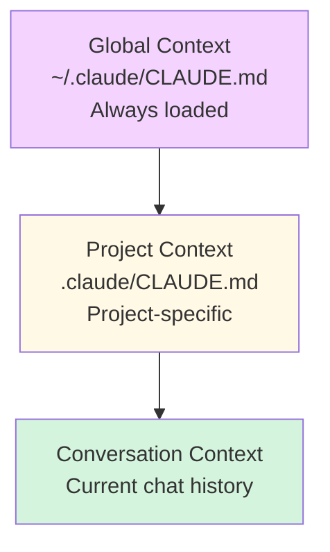

# Context Management Overview

**Reading Time**: 20 minutes
**Skill Level**: Intermediate to Advanced
**Prerequisites**: Basic Claude Code usage

---

## Master Context Control 🎯

Context management lets you control what information Claude sees and remembers across conversations.

---

## Context Hierarchy



---

## The Three Levels

### 1. Global Context
**Location**: `~/.claude/CLAUDE.md`

**Purpose**: Preferences that apply to ALL projects

**Examples**:
```markdown
# My Global Preferences

## Coding Style
- Use TypeScript strict mode
- Prefer functional programming
- 100-character line limit

## Communication
- Be concise
- Always explain trade-offs
- Show cost estimates
```

---

### 2. Project Context
**Location**: `.claude/CLAUDE.md` (in project root)

**Purpose**: Project-specific instructions

**Examples**:
```markdown
# Project: E-commerce Platform

## Tech Stack
- React 18 + TypeScript
- Node.js + Express
- PostgreSQL + Prisma
- Redis for caching

## Coding Standards
- Follow company style guide
- 80% test coverage minimum
- All APIs use REST conventions

## Project Structure
- `/src/server` - Backend code
- `/src/client` - Frontend code
- `/src/shared` - Shared types
```

---

### 3. Conversation Context
**Automatic**: Claude remembers the current conversation

**Control**: Use context management keywords

**Examples**:
```bash
# Reference previous context
"As we discussed earlier, refactor the auth system"

# Reset context
"Forget the previous approach, let's try a different design"

# Explicit context
"Remember: we're using PostgreSQL, not MongoDB"
```

---

## Why Context Matters

**Without Context**:
```bash
You: "Add authentication"
Claude: [Asks 10 questions about tech stack, requirements, etc.]
```

**With Context** (.claude/CLAUDE.md defines tech stack):
```bash
You: "Add authentication"
Claude: [Immediately implements JWT auth for your Express + PostgreSQL stack]
```

**Time saved**: 5-10 minutes per task!

---

## Cost Impact

**Token Usage**:
- Global CLAUDE.md: ~500-2,000 tokens per request
- Project CLAUDE.md: ~1,000-5,000 tokens per request
- Conversation history: ~5,000-20,000 tokens

**Optimization**:
- Keep CLAUDE.md files concise
- Use bullet points over paragraphs
- Include only relevant information

---

## Next Steps

- [CLAUDE.md Structure](2-claude-md.md) - Complete file structure guide
- [Memory Hierarchy](3-memory-hierarchy.md) - Advanced context strategies

---

**Questions or Feedback?**
[Open an issue](https://github.com/anthropics/claude-code/issues)
