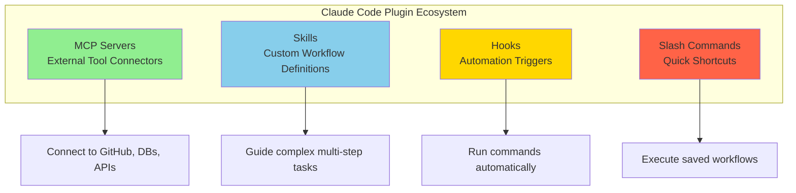

# Claude Code Plugins

⏱️ **Time**: 30 minutes
📊 **Level**: Beginner → Intermediate
🎯 **You'll Learn**: What plugins are, how to install and manage them, and how to extend Claude Code with custom functionality

---

## What Are Plugins?

Think of Claude Code as your smartphone, and **plugins** as the apps you install to make it more powerful. Out of the box, Claude Code is already capable, but plugins unlock specialized features, integrations, and workflows that make you exponentially more productive.

Plugins let you:
- **Connect to external tools** (GitHub, databases, APIs) via MCP servers
- **Define custom workflows** via skills
- **Automate repetitive tasks** via hooks
- **Create quick shortcuts** via slash commands

**Real-world analogy**: It's like having a Swiss Army knife. The base tool is useful, but each attachment (plugin) adds a specialized capability—screwdriver, scissors, bottle opener. Together, they make you unstoppable.

---

## Why Should You Care?

Let me show you three scenarios where plugins transform your workflow:

### Scenario 1: Full-Stack Developer
**Without plugins**: Manually switch between Claude Code, GitHub web UI, database client, API docs browser.
**With plugins**: Claude directly queries your database, creates GitHub issues, and references API docs—all in one conversation.
**Time saved**: ~2-3 hours per day

### Scenario 2: Team Lead
**Without plugins**: Inconsistent code reviews, different approaches per developer, missed security issues.
**With plugins**: Custom skills enforce team standards, hooks automate testing, commands standardize workflows.
**Impact**: 60% fewer code review iterations, 0 security incidents

### Scenario 3: Solo Developer on Budget
**Without plugins**: Using expensive Opus model for everything.
**With plugins**: Skills auto-select cheap Haiku for searches, Sonnet for coding, Opus only when needed.
**Cost savings**: 73% reduction in token costs

---

## The Four Types of Plugins

Claude Code has **four plugin types**, each serving a different purpose:



### Quick Decision Matrix

**I need to...**
- Access external data (GitHub, databases)? → **MCP Server** ([Section 1](../01-mcp-servers/1-overview.md))
- Repeat a complex workflow consistently? → **Skill** ([Section 3](../03-skills/1-overview.md))
- Automate on every file save/commit? → **Hook** ([Section 10](../10-hooks/1-overview.md))
- Quick shortcut for common task? → **Command** ([Section 4](../04-commands/1-overview.md))

---

## Prerequisites

Before diving in, you should:
- ✅ Have [Claude Code installed](https://code.claude.com/docs/en/get-started)
- ✅ Be familiar with command-line basics
- ✅ Understand basic git concepts (helpful but not required)

---

## How Plugins Work Together

The magic happens when you **combine** plugin types. Here's a real-world example:

### Example: Automated Code Review Workflow

```
1. MCP Server (GitHub)
   └─ Connects Claude to your repository

2. Skill (Code Review)
   └─ Guides Claude through security checks, quality analysis

3. Hook (Pre-commit)
   └─ Automatically triggers review before commits

4. Slash Command (/review-pr)
   └─ Manual trigger for PR reviews
```

**Result**: Claude automatically reviews code before commits (hook + skill + MCP), and you can manually trigger PR reviews with `/review-pr` (command + skill + MCP). Everything works together seamlessly!

---

## Installing Plugins

### Method 1: Via CLI (Recommended for MCP)

```bash
# Add GitHub MCP server
claude mcp add github

# List installed MCP servers
claude mcp list

# Remove an MCP server
claude mcp remove github
```

### Method 2: Manual Installation

**For Skills**:
```bash
# Create skill directory
mkdir -p .claude/skills/my-skill

# Create SKILL.md file
cat > .claude/skills/my-skill/SKILL.md <<EOF
---
name: my-skill
description: Description of what this skill does
model: claude-sonnet-4-5
---

Skill instructions here...
EOF
```

**For Hooks**:
Add to `.claude/settings.json`:
```json
{
  "hooks": {
    "preToolUse": ["npm test"],
    "postToolUse": ["npm run format"]
  }
}
```

**For Commands**:
```bash
# Create command file
cat > .claude/commands/review.md <<EOF
---
description: Review code with security checks
---

Review the selected code for:
- Security vulnerabilities
- Code quality issues
- Test coverage
EOF
```

---

## Plugin Discovery

### Official Sources

**MCP Servers**:
- [Anthropic MCP Registry](https://github.com/anthropics/mcp-servers) - Official MCP servers
- [Model Context Protocol](https://modelcontextprotocol.io) - MCP specification

**Skills**:
- [Anthropic Skills](https://github.com/anthropics/skills) - Official skills
- [Community Superpowers](https://github.com/obra/superpowers) - Community skills collection

### Community Resources

- **GitHub Topics**: Search for `claude-code-plugin`, `mcp-server`, `claude-skill`
- **Discord**: [Anthropic Discord](https://discord.gg/anthropic) - #claude-code channel
- **Package Managers**: npm, pip for language-specific MCP servers

---

## Plugin Architecture

Here's how plugins fit into Claude Code:

```
┌─────────────────────────────────────────┐
│         Claude Code Core Engine         │
│  (Base AI, conversation, code analysis) │
└──────────────┬──────────────────────────┘
               │
      ┌────────┴────────┐
      │  Plugin System  │
      └────────┬────────┘
               │
    ┌──────────┼──────────┬──────────┐
    │          │          │          │
    ▼          ▼          ▼          ▼
┌────────┐ ┌────────┐ ┌────────┐ ┌────────┐
│  MCP   │ │ Skills │ │ Hooks  │ │Commands│
│Servers │ │        │ │        │ │        │
└────┬───┘ └───┬────┘ └───┬────┘ └───┬────┘
     │         │          │          │
     ▼         ▼          ▼          ▼
  GitHub   Workflows  Auto-run   Quick
   APIs    Guidance   Scripts   Shortcuts
```

---

## Plugin Configuration

All plugin configuration lives in `.claude/`:

```
your-project/
└── .claude/
    ├── mcp.json          # MCP server configuration
    ├── settings.json     # General settings, hooks
    ├── skills/           # Skill definitions
    │   └── skill-name/
    │       └── SKILL.md
    └── commands/         # Slash commands
        └── command.md
```

### MCP Configuration Example

**File**: `.claude/mcp.json`
```json
{
  "mcpServers": {
    "github": {
      "command": "npx",
      "args": ["-y", "@modelcontextprotocol/server-github"],
      "env": {
        "GITHUB_TOKEN": "${GITHUB_TOKEN}"
      }
    },
    "postgres": {
      "command": "npx",
      "args": ["-y", "@modelcontextprotocol/server-postgres"],
      "env": {
        "POSTGRES_CONNECTION": "${DATABASE_URL}"
      }
    }
  }
}
```

### Settings Configuration Example

**File**: `.claude/settings.json`
```json
{
  "defaultModel": "claude-sonnet-4-5",
  "hooks": {
    "preToolUse": [
      "npm run lint",
      "npm test"
    ],
    "postToolUse": [
      "npm run format"
    ]
  },
  "experimental": {
    "thinking": true
  }
}
```

---

## Best Practices

### Do's ✅

**1. Version Control Plugins**
```bash
# Commit .claude/ to git
git add .claude/
git commit -m "Add code review skill"
```
Your whole team gets the same plugins!

**2. Document Plugin Usage**
```markdown
# In .claude/skills/my-skill/README.md
## Usage

Invoke: "Use the my-skill skill to..."

## Examples

Example 1: ...
Example 2: ...
```

**3. Test Plugins Thoroughly**
- Test happy path
- Test edge cases
- Test error conditions
- Test with different models (Haiku, Sonnet, Opus)

**4. Use Descriptive Names**
```
✅ Good: code-review-security, deploy-staging, test-integration
❌ Bad: cr, deploy, test
```

### Don'ts ❌

**1. Don't Hardcode Secrets**
```json
❌ Bad:
{
  "env": {
    "API_KEY": "sk-1234567890"
  }
}

✅ Good:
{
  "env": {
    "API_KEY": "${API_KEY}"
  }
}
```

**2. Don't Create Overly Complex Plugins**
Keep plugins focused on one task. If it's getting complex, break into multiple plugins.

**3. Don't Skip Error Handling**
```markdown
✅ Good skill instructions:
"If the file doesn't exist, notify the user and ask for the correct path."

❌ Bad:
"Process the file."
```

---

## Success Criteria

✅ **You're ready to move on when you can**:
- [ ] Explain the four plugin types and when to use each
- [ ] Install an MCP server via CLI
- [ ] Create a basic skill from scratch
- [ ] Configure a hook in settings.json
- [ ] Create a simple slash command
- [ ] Understand the `.claude/` directory structure
- [ ] Debug plugin issues using logs and configuration

---

## What's Next?

Great job! Now you're ready for:

**Deep Dives**:
- [MCP Servers](../01-mcp-servers/1-overview.md) - External tool integration (Plugin Type 1) →
- [Skills](../03-skills/1-overview.md) - Complex workflows (Plugin Type 2) →
- [Commands](../04-commands/1-overview.md) - Quick shortcuts (Plugin Type 3) →
- [Hooks](../10-hooks/1-overview.md) - Automation (Plugin Type 4) →

**Related Topics**:
- [Model Selection](../05-models/1-overview.md) - Choose models for skills →
- [Context Management](../08-context/1-overview.md) - Organize plugin behavior →

---

## References & Further Reading

### 📚 Official Documentation
- [Claude Code Plugins](https://code.claude.com/docs/en/plugins) - Official plugin documentation
- [Model Context Protocol](https://modelcontextprotocol.io) - MCP specification
- [Plugin API Reference](https://code.claude.com/docs/en/api) - Technical reference
- [MCP Server Templates](https://github.com/anthropics/mcp-servers) - Starter templates

### 🎓 Learning Resources
- [Claude Code Best Practices](https://www.anthropic.com/engineering/claude-code-best-practices) - Official best practices guide
- [Complete Guide to Claude Code](https://www.siddharthbharath.com/claude-code-the-complete-guide/) - Comprehensive tutorial by Sid Bharath
- [DataCamp Claude Code Tutorial](https://www.datacamp.com/tutorial/claude-code) - Refactor, document, and debug guide
- [Awesome Claude Code](https://github.com/hesreallyhim/awesome-claude-code) - Curated community resources

### 🔗 Related Topics
- [MCP Servers Deep Dive](../01-mcp-servers/1-overview.md) - Build custom integrations
- [Skills Development Guide](../03-skills/3-creating-skills.md) - Advanced skill patterns
- [Hooks Configuration](../10-hooks/1-overview.md) - Automation strategies

### 💬 Community & Support
- [Claude Code Discord](https://discord.gg/anthropic) - Get help from community
- [GitHub Discussions](https://github.com/anthropics/claude-code/discussions) - Share plugins
- [Plugin Registry](https://github.com/anthropics/mcp-servers) - Browse official plugins

---

**You've completed Plugins Overview!** You now understand the four plugin types and how to extend Claude Code with custom functionality. Choose a deep dive topic above to master specific plugin types. 🚀
