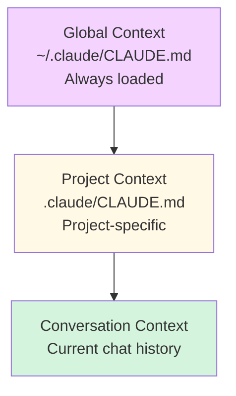

# Context Management Overview

**Reading Time**: 20 minutes
**Skill Level**: Intermediate to Advanced
**Prerequisites**: Basic Claude Code usage

---

## Master Context Control 🎯

Context management lets you control what information Claude sees and remembers across conversations.

---

## Context Hierarchy



---

## The Three Levels

### 1. Global Context
**Location**: `~/.claude/CLAUDE.md`

**Purpose**: Preferences that apply to ALL projects

**Examples**:
```markdown
# My Global Preferences

## Coding Style
- Use TypeScript strict mode
- Prefer functional programming
- 100-character line limit

## Communication
- Be concise
- Always explain trade-offs
- Show cost estimates
```

---

### 2. Project Context
**Location**: `.claude/CLAUDE.md` (in project root)

**Purpose**: Project-specific instructions

**Examples**:
```markdown
# Project: E-commerce Platform

## Tech Stack
- React 18 + TypeScript
- Node.js + Express
- PostgreSQL + Prisma
- Redis for caching

## Coding Standards
- Follow company style guide
- 80% test coverage minimum
- All APIs use REST conventions

## Project Structure
- `/src/server` - Backend code
- `/src/client` - Frontend code
- `/src/shared` - Shared types
```

---

### 3. Conversation Context
**Automatic**: Claude remembers the current conversation

**Control**: Use context management keywords

**Examples**:
```bash
# Reference previous context
"As we discussed earlier, refactor the auth system"

# Reset context
"Forget the previous approach, let's try a different design"

# Explicit context
"Remember: we're using PostgreSQL, not MongoDB"
```

---

## Why Context Matters

**Without Context**:
```bash
You: "Add authentication"
Claude: [Asks 10 questions about tech stack, requirements, etc.]
```

**With Context** (.claude/CLAUDE.md defines tech stack):
```bash
You: "Add authentication"
Claude: [Immediately implements JWT auth for your Express + PostgreSQL stack]
```

**Time saved**: 5-10 minutes per task!

---

## Real-World Examples: Good vs Bad Context

### Example 1: Web Application

**❌ Bad CLAUDE.md (Too Verbose)**

```markdown
# My Amazing E-commerce Platform

This is a really cool e-commerce platform that I've been building for the past 6 months. It started as a simple idea but has grown into a full-featured application with many different components and features.

## Complete Technology Stack with Detailed Explanations

We're using React for the frontend because it's popular and has great community support. Specifically, we're using React version 18.2.0 which includes all the latest features like concurrent rendering and automatic batching. We chose React over Vue and Angular because our team is most familiar with it and there are lots of libraries available.

For the backend, we're using Node.js with Express framework. Express is a minimal and flexible Node.js web application framework that provides a robust set of features for web and mobile applications. It's version 4.18.2 specifically. We also considered Fastify and Koa but went with Express because of its maturity and ecosystem.

[... continues for 2000+ lines ...]
```

**Problems**:
- 📈 2,500+ lines → ~20,000 tokens per request
- 💰 Cost: $0.30 per request (context alone!)
- ⏱️ Slow: Claude spends time reading irrelevant details
- 😵 Confusing: Important info buried in narrative

**✅ Good CLAUDE.md (Concise & Structured)**

```markdown
# E-commerce Platform

## Tech Stack
- **Frontend**: React 18 + TypeScript + Vite
- **Backend**: Node.js + Express + TypeScript
- **Database**: PostgreSQL 15 + Prisma ORM
- **Cache**: Redis
- **Testing**: Vitest + React Testing Library

## Project Structure
```
src/
├── client/        # React frontend
├── server/        # Express backend
└── shared/        # Shared types
```

## Coding Standards
- TypeScript strict mode
- Functional components with hooks
- 80% test coverage minimum
- API versioning (/api/v1/)

## Key Decisions
- Use Prisma migrations (not raw SQL)
- JWT auth (refresh + access tokens)
- Stripe for payments
- Cloudinary for images

## Don't
- Don't use class components
- Don't bypass Prisma ORM
- Don't commit secrets to .env
```

**Benefits**:
- 📉 50 lines → ~400 tokens per request
- 💰 Cost: $0.006 per request (50x cheaper!)
- ⚡ Fast: Claude gets context instantly
- ✨ Clear: Essential info upfront

**Savings**: $0.29 per request × 100 requests/day = **$29/day saved!**

---

### Example 2: API Service

**❌ Bad CLAUDE.md**

```markdown
# REST API for Customer Management

## Long History
This API was originally built in 2020 using JavaScript but we migrated to TypeScript in 2021. During the migration, we faced several challenges including...

[Narrative history for 500 lines]

## Complete Database Schema
```sql
CREATE TABLE customers (
  id SERIAL PRIMARY KEY,
  first_name VARCHAR(255),
  last_name VARCHAR(255),
  email VARCHAR(255) UNIQUE NOT NULL,
  phone VARCHAR(20),
  address_line_1 VARCHAR(255),
  address_line_2 VARCHAR(255),
  city VARCHAR(100),
  state VARCHAR(50),
  zip_code VARCHAR(10),
  country VARCHAR(100),
  created_at TIMESTAMP DEFAULT NOW(),
  updated_at TIMESTAMP DEFAULT NOW(),
  deleted_at TIMESTAMP,
  -- [50+ more columns...]
);

-- [Complete schema for 20 tables...]
```

[... continues for 1500+ lines ...]
```

**Problems**:
- ❌ Full database schema (not needed for most tasks)
- ❌ Project history (irrelevant)
- ❌ Overly detailed configuration
- 💰 ~15,000 tokens per request

**✅ Good CLAUDE.md**

```markdown
# Customer Management API

## Stack
- Node.js 20 + TypeScript
- Express + Zod validation
- PostgreSQL + TypeORM
- Jest + Supertest

## API Conventions
- RESTful endpoints: `/api/v1/customers`
- Validation: Zod schemas in `/src/schemas`
- Auth: Bearer JWT tokens
- Pagination: `?page=1&limit=20`
- Error format: `{ error: string, details?: any }`

## Database
- See `schema.sql` for full details
- Main entities: customers, orders, products
- Use TypeORM migrations (not raw SQL)

## Key Rules
- ✅ Always validate input with Zod
- ✅ Return 400 for validation errors
- ✅ Log all errors to CloudWatch
- ❌ Never expose internal IDs in responses
- ❌ Never skip authentication middleware
```

**Benefits**:
- 📉 30 lines vs 1,500 lines
- 💰 ~300 tokens vs ~15,000 tokens (50x reduction)
- 🎯 Focused on what matters

---

### Example 3: Data Science Project

**❌ Bad CLAUDE.md**

```markdown
# Machine Learning Model for Customer Churn Prediction

## Detailed Background
Customer churn is a major problem in the telecommunications industry. Studies show that acquiring a new customer costs 5-7x more than retaining existing ones. In our analysis of customer data from 2019-2024, we discovered several interesting patterns...

[Academic-style introduction for 300 lines]

## Complete Data Dictionary
```python
# customers.csv
# Column 1: customer_id (string, format: CUST-XXXXX)
# Column 2: signup_date (datetime, ISO 8601)
# Column 3: monthly_charge (float, USD)
# [... 100+ columns explained in detail ...]
```

## Mathematical Foundations
The model uses a gradient boosting algorithm based on the following mathematical principles:

[LaTeX equations for 200 lines]
```

**Problems**:
- ❌ Academic background (not needed for coding)
- ❌ Complete data dictionary (link to it instead)
- ❌ Mathematical theory (not needed for implementation)
- 💰 ~12,000 tokens per request

**✅ Good CLAUDE.md**

```markdown
# Customer Churn Prediction

## Environment
- Python 3.11 + UV package manager
- Jupyter notebooks in `/notebooks`
- Production code in `/src`

## Stack
- pandas, numpy for data processing
- scikit-learn, xgboost for ML
- matplotlib, seaborn for viz
- pytest for testing

## Data
- Input: `data/customers.csv` (see data_dictionary.md)
- Features: 25 engineered features (see `/src/features.py`)
- Target: `churned` (binary)

## Model Pipeline
1. Preprocessing: `/src/preprocessing.py`
2. Feature engineering: `/src/features.py`
3. Training: `/src/train.py`
4. Evaluation: `/src/evaluate.py`

## Key Rules
- ✅ Random seed: 42 (for reproducibility)
- ✅ 80/20 train/test split
- ✅ Use cross-validation (5-fold)
- ❌ Don't modify raw data files
- ❌ Don't commit model binaries to git

## Deployment
- Model served via FastAPI
- Prediction endpoint: `/predict`
- See `deployment/README.md`
```

**Benefits**:
- 📉 40 lines vs 1,200+ lines
- 💰 ~400 tokens vs ~12,000 tokens (30x reduction)
- 🎯 Actionable info only

---

## Common Context Mistakes

### ❌ Mistake 1: Including Complete Codebase

**Bad**:
```markdown
# CLAUDE.md

## All Our React Components

### Button.tsx
```typescript
// [Complete 200-line Button component]
```

### Modal.tsx
```typescript
// [Complete 300-line Modal component]
```

[... 50 more components ...]
```

**Why bad**: CLAUDE.md should describe the codebase, not duplicate it. Claude can read files when needed.

**Better**:
```markdown
## Component Library
- Location: `/src/components`
- Style: Functional components + hooks
- Styling: Tailwind CSS
- See `/src/components/README.md` for details
```

---

### ❌ Mistake 2: Personal Opinions & History

**Bad**:
```markdown
We chose MongoDB because I really like NoSQL databases and I heard they're fast. We tried PostgreSQL first but I didn't like writing SQL queries. We also considered Firebase but it was too expensive in my opinion...
```

**Why bad**: Claude doesn't need your reasoning history—just the decision.

**Better**:
```markdown
- Database: MongoDB
- Reason: Document-based data model fits our use case
```

---

### ❌ Mistake 3: Outdated Information

**Bad**:
```markdown
# Project Setup (Last updated: January 2022)

## Tech Stack
- React 16
- Node.js 12
- MongoDB 4.2
```

**Why bad**: Outdated context leads to outdated suggestions.

**Better**: Keep CLAUDE.md up to date OR use dynamic references:
```markdown
## Tech Stack
See `package.json` for current versions
- React (v18+)
- Node.js (v20+)
- MongoDB (v7+)
```

---

### ❌ Mistake 4: Copy-Paste from Documentation

**Bad**:
```markdown
# Express.js

Express is a minimal and flexible Node.js web application framework that provides a robust set of features for web and mobile applications. APIs With a myriad of HTTP utility methods and middleware at your disposal, creating a robust API is quick and easy...

[Entire Express.js documentation copied]
```

**Why bad**: Claude already knows Express.js documentation.

**Better**:
```markdown
## Backend
- Framework: Express.js
- Custom middleware: Auth, logging, error handling
- See `/src/middleware` for implementations
```

---

## Context Optimization Tips

### Tip 1: Use Progressive Disclosure

Instead of this:
```markdown
# CLAUDE.md - Everything about the project
[10,000 lines of every detail]
```

Do this:
```markdown
# CLAUDE.md - Essential context (200 lines)

For detailed information:
- Architecture: See `/docs/architecture.md`
- API Specs: See `/docs/api-spec.yaml`
- Database: See `/docs/database-schema.md`
- Deployment: See `/docs/deployment.md`
```

**Benefit**: Claude loads detailed docs only when needed.

---

### Tip 2: Bullet Points Over Paragraphs

**Verbose** (300 tokens):
```markdown
Our project uses a microservices architecture where each service is responsible for a specific domain. We have the user service which handles all user-related operations, the payment service which processes all payments using Stripe, and the inventory service which manages product inventory.
```

**Concise** (50 tokens):
```markdown
## Architecture: Microservices
- User service: Authentication, profiles
- Payment service: Stripe integration
- Inventory service: Product stock management
```

**Savings**: 83% fewer tokens

---

### Tip 3: Essential Info Only

**Ask yourself**: "Will Claude need this to write code?"

**Include**:
- ✅ Tech stack
- ✅ Project structure
- ✅ Coding conventions
- ✅ Key architectural decisions

**Exclude**:
- ❌ Project history
- ❌ Meeting notes
- ❌ Personal opinions
- ❌ Complete documentation
- ❌ Detailed logs

---

### Tip 4: Use Sections Strategically

**Good CLAUDE.md Template**:
```markdown
# [Project Name]

## Tech Stack (10 lines max)
- Essential technologies only

## Project Structure (5-10 lines)
- Key directories

## Coding Standards (10-15 lines)
- Most important rules

## Key Decisions (5-10 lines)
- Non-obvious choices

## Don't (5 lines)
- Common mistakes to avoid
```

**Total**: ~50 lines (~500 tokens)

---

## Cost Impact

**Token Usage**:
- Global CLAUDE.md: ~500-2,000 tokens per request
- Project CLAUDE.md: ~1,000-5,000 tokens per request
- Conversation history: ~5,000-20,000 tokens

**Optimization**:
- Keep CLAUDE.md files concise
- Use bullet points over paragraphs
- Include only relevant information

---

## Next Steps

- [CLAUDE.md Structure](2-claude-md.md) - Complete file structure guide
- [Memory Hierarchy](3-memory-hierarchy.md) - Advanced context strategies

---

**Questions or Feedback?**
[Open an issue](https://github.com/anthropics/claude-code/issues)
