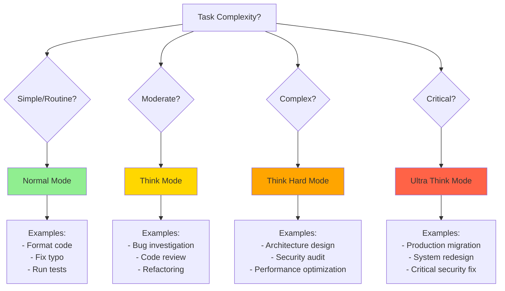

# Thinking Modes Overview

**Reading Time**: 15 minutes
**Skill Level**: Intermediate
**Prerequisites**: [Model Overview](../06-models/1-overview.md)

---

## Control Claude's Reasoning Depth 🧠

Thinking modes let you control how deeply Claude reasons about your requests using special keywords.

---

## What Are Thinking Modes?

**Normal Mode** (default):
- Fast, direct answers
- Minimal internal reasoning
- Lower token usage

**Thinking Mode** (activated by keywords):
- Extended reasoning process
- Shows thought process
- Higher quality for complex tasks
- More tokens used

---

## Quick Comparison

| Mode | Keywords | Speed | Tokens | Best For |
|------|----------|-------|--------|----------|
| **Normal** | (none) | Fast | Low | Simple tasks |
| **Think** | "think", "reason" | Medium | Medium | Standard complexity |
| **Think Hard** | "think hard", "carefully" | Slow | High | Complex analysis |
| **Ultra Think** | "ultrathink", "deeply analyze" | Slowest | Highest | Critical decisions |

---

## When to Use Each Mode

### Normal Mode (Default)
```bash
# Simple, straightforward tasks
"Format this code with Prettier"
"Find all React components"
"Fix the typo in line 42"
```

### Think Mode
```bash
# Moderate complexity
"Think about the best way to refactor this"
"Reason through this bug and suggest fixes"
"Consider edge cases for this feature"
```

### Think Hard Mode
```bash
# Complex problems
"Think hard about the security implications"
"Carefully design the database schema"
"Analyze the performance bottlenecks"
```

### Ultra Think Mode
```bash
# Critical decisions
"Ultrathink: Design the system architecture"
"Deeply analyze: Security audit for production"
"Thoroughly reason: Migration strategy"
```

---

## Real-World Examples

### Example 1: Bug Fix

**Task**: Fix a null pointer exception in user authentication

**Normal Mode:**
```
User: "Fix the null pointer in auth.ts line 42"

Claude: I'll update line 42 to add a null check:
```typescript
if (user && user.profile) {
  return user.profile.email
}
```
Done! The null pointer is fixed.

Tokens: ~3,000 | Time: 5 seconds | Quality: ✅ Good
```

**Think Mode:**
```
User: "Think about how to fix the null pointer in auth.ts line 42"

Claude: <thinking>
Let me reason through this:
1. Why is user.profile null?
2. Should we fail gracefully or throw an error?
3. Are there other places with similar issues?
</thinking>

I recommend:
1. Add null check at line 42
2. Also check lines 56 and 89 (similar pattern)
3. Consider adding TypeScript strict mode

Tokens: ~6,000 | Time: 12 seconds | Quality: ✅✅ Better
```

**Think Hard Mode:**
```
User: "Think hard about the null pointer in auth.ts line 42"

Claude: <thinking>
Deep analysis:
1. Root cause: User object from auth middleware can be undefined
2. Similar pattern exists in 7 other files
3. Type definitions are incomplete
4. This is a systemic issue, not isolated bug

Architecture implications:
- Need middleware contract enforcement
- Add type guards for user objects
- Consider Optional chaining (?.)
</thinking>

Comprehensive fix:
1. Immediate: Null check at line 42
2. Short-term: Add 7 similar checks in other files
3. Long-term: Refactor auth middleware with strict types
4. Add integration test for unauthenticated requests

Tokens: ~12,000 | Time: 25 seconds | Quality: ✅✅✅ Comprehensive
```

**When to use each**:
- **Normal**: Quick fix, one-off bug
- **Think**: Want to understand why it happened
- **Think Hard**: Systemic issue, want to prevent recurrence

---

### Example 2: Code Review

**Task**: Review a pull request with new API endpoint

**Normal Mode:**
```
User: "Review this PR"

Claude: Looks good! Code follows conventions.
Minor: Add error handling on line 23.

Tokens: ~2,000
```

**Think Mode:**
```
User: "Think through this PR review"

Claude: <thinking>
Checking:
- Code style ✓
- Error handling - missing in 2 places
- Input validation - needs improvement
- Tests - present but incomplete
</thinking>

Feedback:
1. ✅ Code style consistent
2. ⚠️ Add error handling (lines 23, 45)
3. ⚠️ Validate input schema
4. ⚠️ Add test for 400 response case

Tokens: ~5,000
```

**Think Hard Mode:**
```
User: "Carefully review this PR for production readiness"

Claude: <thinking>
Comprehensive analysis:
1. Security: SQL injection risk? ✓ Safe (parameterized)
2. Performance: N+1 query problem? ⚠️ Yes, line 34
3. Error handling: All paths covered? ❌ Missing
4. Tests: Edge cases? ⚠️ Missing rate limit test
5. Documentation: API docs updated? ❌ No
6. Monitoring: Logging adequate? ⚠️ No error logs
7. Database: Migration needed? ✓ Yes, included
8. Backwards compatibility: Breaking change? ❌ Yes!
</thinking>

Critical issues:
1. 🔴 Breaking change - version the API endpoint
2. 🔴 N+1 query performance issue (line 34)
3. 🟡 Missing error handling paths
4. 🟡 Incomplete test coverage

Recommendations:
[Detailed recommendations for each issue...]

Tokens: ~15,000
```

**When to use each**:
- **Normal**: Routine PR, small change
- **Think**: Standard feature PR
- **Think Hard**: Production-critical, security-sensitive

---

### Example 3: Architecture Design

**Task**: Design a caching strategy

**Normal Mode:**
```
User: "Add caching to the API"

Claude: Use Redis for caching:

```typescript
const cached = await redis.get(key)
if (cached) return cached

const result = await fetchData()
await redis.set(key, result, 'EX', 3600)
```

Tokens: ~4,000
```

**Think Mode:**
```
User: "Think about the best caching strategy"

Claude: <thinking>
Considerations:
1. What to cache? (API responses, DB queries, computed values)
2. Cache invalidation strategy?
3. Cache layer? (Redis, in-memory, CDN)
4. TTL values?
</thinking>

Recommendation:
- Use Redis for shared cache
- Cache GET endpoints only
- TTL: 5 min for frequently changing, 1 hour for stable
- Invalidate on writes

Tokens: ~8,000
```

**Think Hard Mode:**
```
User: "Think hard about caching for this system"

Claude: <thinking>
Deep architectural analysis:

Current system:
- 10K requests/min
- 60% read, 40% write
- Data freshness tolerance: 5 minutes
- Multiple app servers
- PostgreSQL backend

Caching options:
1. Application-level (in-memory)
   Pros: Fast, simple
   Cons: Inconsistent across servers, memory pressure

2. Redis (shared cache)
   Pros: Consistent, scalable
   Cons: Network hop, additional infrastructure

3. CDN (for public APIs)
   Pros: Global distribution
   Cons: Only for public endpoints

4. Database query cache
   Pros: Transparent to app
   Cons: Limited control

Multi-layer strategy analysis:
- Layer 1: In-memory LRU (frequently accessed, 100ms TTL)
- Layer 2: Redis (shared state, 5min TTL)
- Layer 3: CDN (public endpoints, 1 hour TTL)

Cache invalidation strategies:
- Time-based (TTL)
- Event-based (pub/sub on writes)
- Manual (admin purge)

Recommendation: Hybrid approach
</thinking>

Comprehensive caching architecture:

**Layer 1: In-Memory Cache** (node-cache)
- Hot data only (top 1000 requests)
- 100ms TTL
- Per-server instance
- Reduces Redis load

**Layer 2: Redis Cache**
- All GET endpoints
- 5 min TTL (configurable per endpoint)
- Pub/sub invalidation on writes
- Cache stampede protection

**Layer 3: CDN Cache** (CloudFront)
- Public API endpoints only
- 1 hour TTL
- Cache-Control headers

**Implementation plan**:
1. Week 1: Add Redis layer
2. Week 2: Implement cache invalidation
3. Week 3: Add in-memory hot cache
4. Week 4: CDN integration

**Monitoring**:
- Cache hit rate (target: >80%)
- Latency reduction (target: 50%)
- Memory usage
- Redis connection pool

Tokens: ~25,000
```

**When to use each**:
- **Normal**: Simple caching, well-defined requirements
- **Think**: Standard caching needs, multiple options
- **Think Hard**: Complex system, high stakes, multiple trade-offs

---

### Example 4: Simple Formatting Task

**Task**: Format code with Prettier

**Normal Mode:**
```
User: "Format this code"

Claude: Running prettier...
```typescript
// Formatted code
```
Done!

Tokens: ~1,500 | Cost: $0.02
```

**Think Mode (WASTEFUL):**
```
User: "Think about formatting this code"

Claude: <thinking>
Let me consider the best formatting approach:
1. Should I use Prettier or ESLint?
2. What configuration should I use?
3. Are there any special formatting rules?
4. Should I also fix linting issues?
</thinking>

I'll use Prettier with standard config...
```typescript
// Formatted code
```

Tokens: ~6,000 | Cost: $0.09
⚠️ 4x more expensive for same result!
```

**Lesson**: Don't overthink simple tasks! Use normal mode for straightforward operations.

---

## Common Mistakes

### ❌ Mistake 1: Over-Thinking Simple Tasks

```bash
# WASTEFUL
"Think hard about adding a console.log statement"

# BETTER
"Add console.log for debugging on line 42"
```

**Why wasteful**: Simple tasks don't benefit from deep reasoning. You're paying 3-5x more for the same output.

---

### ❌ Mistake 2: Under-Thinking Complex Tasks

```bash
# RISKY
"Add user authentication to the app"

# BETTER
"Think hard about implementing secure user authentication. Consider:
- Password hashing (bcrypt)
- Session management
- CSRF protection
- Rate limiting
- Password reset flow"
```

**Why risky**: Complex tasks need thorough reasoning. Skipping thinking mode can lead to security issues or poor architecture.

---

### ❌ Mistake 3: Using Ultra Think for Everything

```bash
# WASTEFUL
"Ultrathink: Fix typo in README"

# BETTER
"Fix typo in README line 12"
```

**Why wasteful**: Ultra think mode can cost 10-20x more than normal mode. Reserve it for critical decisions only.

---

## Mode Selection Decision Tree



---

## Cost Impact

**Example Task**: "Refactor this authentication system"

| Mode | Tokens | Cost | Quality |
|------|--------|------|---------|
| Normal | 12,000 | $0.18 | 80% |
| Think | 18,000 | $0.27 | 90% |
| Think Hard | 25,000 | $0.38 | 95% |
| Ultra Think | 35,000 | $0.53 | 97% |

---

## Next Steps

- [Thinking Keywords Reference](2-keywords.md) - Complete keyword guide
- [Output Modes](3-output-modes.md) - Understanding thinking output

---

**Questions or Feedback?**
[Open an issue](https://github.com/anthropics/claude-code/issues)
