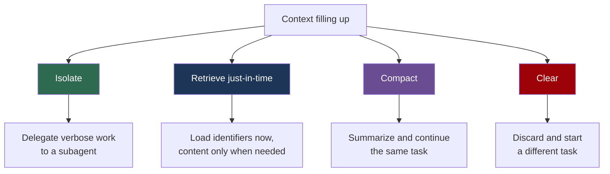

# Context Engineering

**Reading Time**: 35 minutes
**Skill Level**: Intermediate to Advanced
**Prerequisites**: [Context Overview](1-overview.md), [CLAUDE.md Structure](2-claude-md.md)

---

## Context Management vs. Context Engineering

The previous guides in this section covered **context management**: what to write in your
CLAUDE.md files, how the three levels compose, and how to keep them short. That is authoring
work. You do it once and revisit it occasionally.

**Context engineering** is the runtime counterpart. A session's context window is not a
static document you wrote — it is a live, finite resource that fills as Claude works, and
that you actively curate while working. Every file read, tool result, and test run adds to
it. Nothing leaves unless you make it leave.

The distinction matters because the two have different failure modes:

| Discipline | Failure looks like | Fix |
|------------|-------------------|-----|
| Context management | Claude doesn't know your conventions | Write it in CLAUDE.md |
| Context engineering | Claude knew your conventions an hour ago and has stopped following them | Curate the window |

If you have ever had a long session where Claude got progressively worse at things it
handled fine at the start, you have met the second failure mode. This guide is about that.

---

## What Is Actually in Your Context Window

The window holds 200,000 tokens. Before you type anything, a portion is already spent on
content loaded automatically at startup:

| Loaded at startup | Typical tokens | Visible to you? |
|-------------------|---------------|-----------------|
| System prompt | ~4,200 | No |
| Auto memory (`MEMORY.md`) | ~680 | No |
| Environment info (cwd, platform, git state) | ~280 | No |
| MCP tool names (schemas deferred) | ~120 | No |
| Skill descriptions (one line each) | ~450 | No |
| `~/.claude/CLAUDE.md` | ~320 | No |
| Project `CLAUDE.md` | ~1,800 | No |

That is roughly 8,000 tokens before your first prompt — about 4% of the window. Comfortable.

The problem is what happens next. A single moderately complex task adds far more:

```text
Your prompt                          45
Read src/api/auth.ts              2,400
Read src/lib/tokens.ts            1,100
Rule: api-conventions.md            380
Read middleware.ts                1,800
Read auth.test.ts                 1,600
grep "refreshToken"                 600
Claude's analysis                   800
Edit auth.ts                        400
Edit auth.test.ts                   600
npm test output                   1,200
Summary                             400
```

One task, roughly 11,000 tokens. Ten tasks in a session and you are at 40–50% before
counting anything unusual — and a single large log file or verbose test suite can add 20,000
tokens on its own.

Run `/context` at any point to see the actual breakdown for your session. The result is
frequently surprising; the thing consuming the most is rarely the thing you were thinking
about.

---

## Why a Full Window Degrades Quality

The instinct is that a bigger context window is strictly better — more information, better
answers. That is not how it works in practice.

**Attention is the scarce resource, not space.** A model attends across everything in its
context. As the token count grows, attention spreads thinner, and the model's ability to
reliably recall and act on any specific piece of information declines. This degradation is
often called **context rot**: the window has room, but the signal you care about is
competing with tens of thousands of tokens of stale tool output.

Practically, this means:

- The convention you stated in CLAUDE.md at token 2,000 competes with a 15,000-token test
  log at token 90,000
- Files Claude read forty minutes ago and will never reference again still occupy attention
- Instructions given early in a long session get followed less consistently later

The goal, then, is not to fill the window efficiently. It is to **keep only what the current
task needs in it**. Curation beats accumulation.

There is a cost dimension too. Claude Code sends the full conversation with every request,
and each tool call sends another request carrying the accumulated results. Prompt caching
means repeated content is billed at the cheaper cached rate, but a one-line question in a
session that has been open all day still carries the whole conversation.

---

## The Four Levers



Compaction and clearing are often confused. The rule is simple: **compact when you want to
continue, clear when you want to move on.**

---

### Lever 1: Isolate with Subagents

This is the highest-leverage technique in this guide, and the most underused.

A subagent runs in its **own context window**. It does its work there and returns only a
summary to your main conversation. The intermediate reads never touch your window.

Consider a research task requiring three file reads:

```text
Without a subagent — everything lands in your window:
  Read session.ts        1,400
  Read timeouts.ts         900
  Read config/*.ts       2,100
  ────────────────────────────
  Cost to your context   4,400 tokens

With a subagent — the reads happen elsewhere:
  Spawn subagent            80
  Subagent returns summary 420
  ────────────────────────────
  Cost to your context     500 tokens
```

Same work, same answer, an order of magnitude less context consumed. The subagent read all
three files — in its own window, which is then discarded.

**Delegate to a subagent when the work is read-heavy and you need the conclusion, not the
material:**

- Searching for where something is implemented across many files
- Reading documentation to answer one question
- Running a verbose test suite or processing a large log
- Any exploration where you will not reference the raw content again

**Keep it in the main conversation when you need the material itself**, because you are about
to edit those files and want them in context.

You can also run a skill in a forked context by setting `context: fork` in its frontmatter,
which gives the same isolation for a packaged workflow:

```yaml
---
name: deep-research
description: Research a topic thoroughly across the codebase
context: fork
---
```

See [Agents Overview](../03-agents/1-overview.md) for defining subagents, and
[Skills](../04-skills/1-overview.md) for `context: fork`.

---

### Lever 2: Retrieve Just-in-Time

The intuition from traditional software is to load your data up front, then work on it. For
agents, that is usually wrong.

**Just-in-time retrieval** keeps lightweight identifiers in context — file paths, symbol
names, query strings — and pulls actual content only at the moment it is needed. Claude Code
works this way by default, and you can lean into it.

The pattern generalizes well beyond files. To analyze a large dataset, do not load it:

```bash
# Loads 40,000 tokens of CSV you mostly do not need
cat data/events.csv

# Loads what the question actually requires
head -3 data/events.csv                    # shape
wc -l data/events.csv                       # size
grep -c "checkout_failed" data/events.csv   # the answer
```

The same applies to logs, where a filter is almost always better than the file:

```bash
grep -A 5 "ERROR" build.log | head -50      # not: cat build.log
```

**Hooks can enforce this automatically.** A `PreToolUse` hook that rewrites test commands to
show only failures turns a 20,000-token test log into a few hundred tokens, on every run,
without you remembering to do it. See [Hooks](../11-hooks/1-overview.md).

---

### Lever 3: Compact

When a session approaches the context limit, **auto-compaction** replaces the conversation
with a structured summary and continues. You can also trigger it deliberately with
`/compact` before quality starts slipping.

What survives compaction:

- Startup content is re-injected — system prompt, CLAUDE.md files, environment info
- The conversation becomes a summary, preserving decisions and unresolved problems
- Raw tool output, file contents, and intermediate reasoning are dropped

**One gotcha worth knowing**: the skill descriptions listing is *not* re-injected after
compaction. Only skills you actually invoked during the session are preserved. If Claude
seems to stop reaching for a skill it was using earlier in a long session, this is why —
invoke it explicitly with `/skill-name`.

**Steer what compaction keeps.** A bare `/compact` summarizes generically. Tell it what
matters for your task:

```text
/compact Focus on the schema decisions and the failing migration, drop the file listings
```

You can make that preference permanent for a project by adding a section to CLAUDE.md:

```markdown
# Compact instructions

When compacting, preserve architectural decisions, unresolved bugs, and any
commands we established work. Drop file listings and passing test output.
```

**Compaction is itself a large request** — it reads the conversation it summarizes. When you
want a fresh start rather than continuity, `/clear` costs nothing and is the better choice.

Auto-compaction is on by default. It can be disabled with `"autoCompactEnabled": false` in
settings.json, though doing so means long sessions will hit the context limit instead.

---

### Lever 4: Clear

`/clear` discards the conversation and starts fresh. It is the correct move whenever you
switch to unrelated work, and it is free.

The habit is worth building deliberately, because the default behavior is to keep going and
carry an entire morning of irrelevant context into an afternoon task.

```text
/rename auth-refactor    # label the session so you can find it
/clear                   # start clean on the next task
/resume                  # come back to it later
```

Session cost totals reset with `/clear`, which also makes it a natural measurement boundary
if you are comparing approaches.

---

## Reducing What Loads in the First Place

The four levers manage context during a session. These reduce the baseline.

### Move procedures from CLAUDE.md into skills

This is the highest-value change most projects can make.

CLAUDE.md is loaded at session start and stays for the entire session. A skill's body loads
only when it is used. So a 40-line PR-review procedure in CLAUDE.md costs you tokens all day
while you work on unrelated things; the same procedure as a skill costs nothing until you
invoke it.

**Keep in CLAUDE.md**: facts that are always relevant — tech stack, conventions, structure.
**Move to a skill**: any multi-step procedure for a specific occasion.

The signal is grammatical. If a CLAUDE.md section has become a numbered list of steps rather
than a statement of fact, it wants to be a skill. Aim to keep CLAUDE.md under about 200
lines.

### Prefer CLI tools over MCP servers

MCP tool schemas are deferred by default — only names load at startup, with full schemas
fetched on demand. That keeps the cost low but nonzero. A CLI tool like `gh`, `aws`, or
`gcloud` adds no per-tool listing at all, and Claude can run it directly.

Run `/mcp` to see configured servers and disable ones you are not using.

### Install code intelligence plugins for typed languages

Symbol navigation replaces text search. One "go to definition" call replaces a grep plus
reading several candidate files to find the right one — which is both faster and dramatically
cheaper in context.

### Preprocess with hooks

A hook can filter data before Claude ever sees it. Instead of Claude reading a 10,000-line
log to find the errors, the hook returns the matching lines.

---

## Diagnosing Context Problems

| Symptom | Command | What to look for |
|---------|---------|------------------|
| Session feels sluggish or forgetful | `/context` | What is actually occupying the window |
| Costs higher than expected | `/usage` | Long context or cache misses flagged at 10%+ |
| Unsure what a skill is costing | `/usage` | Per-skill, per-subagent, per-MCP-server attribution |

`/usage` on a paid plan attributes recent usage across skills, subagents, plugins, and
individual MCP servers, and explicitly flags behaviors accounting for 10% or more of usage.
"Long context" appearing there is a direct instruction to clear or compact more often.

You can also display context usage continuously in your status line, which turns this from a
thing you check into a thing you notice.

---

## Long-Horizon Tasks

For work spanning hours or multiple compactions, context alone is not a durable place to keep
state. Pair it with storage that survives:

**Commit as checkpoints.** A commit is a state snapshot that no amount of compaction
destroys. Committing at each working milestone means a compacted session can reconstruct
where it is from `git log` rather than from a summary.

**Keep a progress file.** A short `PROGRESS.md` recording what is done, what is in flight,
and what was decided lets Claude re-establish state after compaction by reading one small
file instead of relying on a summary that may have dropped the detail that mattered.

```markdown
# Migration progress

## Done
- Schema migration written and applied to staging
- User table backfilled

## In flight
- Order table backfill — script written, not yet run

## Decided
- Keep the legacy `status` column until Q3, reads still depend on it
```

The pairing matters: compaction preserves the shape of a long session, while commits and a
progress file preserve the specifics it drops.

---

## Anti-Patterns

**Treating the window as free until it errors.** Quality degrades well before you hit the
limit. By the time you see a context warning, you have been getting worse answers for a
while.

**Preloading "so Claude has everything."** Reading twelve files up front to save time
later means the model is attending across eleven irrelevant files while working on the
twelfth. Read what the current step needs.

**Never clearing.** A session open since morning carries the morning. `/clear` between
unrelated tasks is the cheapest quality improvement available.

**Using CLAUDE.md as documentation.** CLAUDE.md is a runtime cost paid on every session, not
a place to be thorough. Long-form reference belongs in a skill's supporting files, where it
costs nothing until read.

**Compacting when you meant to clear.** Compaction is a large request that preserves
continuity you may not need. Switching tasks? Clear.

---

## Key Takeaways

✅ **Attention, not space, is the constraint** — quality degrades as the window fills, before any limit is reached
✅ **Subagents are the strongest lever** — read-heavy work in an isolated window returns a summary, not the material
✅ **Retrieve just-in-time** — keep identifiers in context, pull content when needed
✅ **Compact to continue, clear to move on** — and steer compaction with explicit instructions
✅ **Procedures belong in skills, facts belong in CLAUDE.md** — one loads on demand, the other loads always
✅ **Measure with `/context` and `/usage`** — the biggest consumer is rarely what you assumed

---

## Next Steps

- [Agents Overview](../03-agents/1-overview.md) — defining subagents for context isolation
- [Skills Overview](../04-skills/1-overview.md) — moving procedures out of CLAUDE.md
- [Hooks](../11-hooks/1-overview.md) — preprocessing data before it reaches context
- [Cost Optimization](../12-optimization/1-cost-optimization.md) — the spend side of the same problem

---

**Questions or Feedback?**
[Open an issue](https://github.com/anthropics/claude-code/issues)
