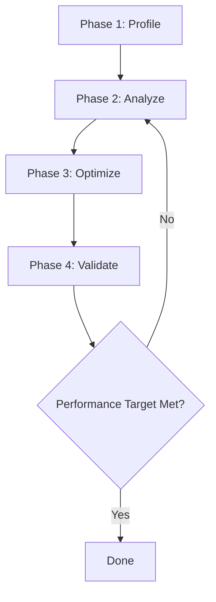

# Performance Optimization Workflow

**Reading Time**: 30 minutes
**Skill Level**: Intermediate to Advanced
**Prerequisites**: Understanding of performance concepts, profiling tools

---

## Overview

Systematic approach to identifying and resolving performance bottlenecks using Claude Code's analysis capabilities, thinking modes, and model selection strategies.

**What You'll Learn**:
- How to profile and identify performance bottlenecks
- Using Claude Code for performance analysis
- Optimization strategies for different scenarios
- Cost-effective performance tuning
- Measuring and validating improvements

---

## Table of Contents

1. [Performance Optimization Process](#performance-optimization-process)
2. [Profiling and Analysis](#profiling-and-analysis)
3. [Optimization Strategies](#optimization-strategies)
4. [Common Performance Patterns](#common-performance-patterns)
5. [Example Workflows](#example-workflows)
6. [Best Practices](#best-practices)
7. [Cost Analysis](#cost-analysis)

---

## Performance Optimization Process

### The 4-Phase Approach



**Phase 1: Profile** - Measure current performance and identify bottlenecks
**Phase 2: Analyze** - Understand root causes and prioritize fixes
**Phase 3: Optimize** - Implement performance improvements
**Phase 4: Validate** - Measure results and verify improvements

---

## Profiling and Analysis

### Step 1: Establish Baseline

**Duration**: 10-15 minutes
**Model**: Haiku (for running profilers)
**Tokens**: ~3,000-5,000

**Profile Different Aspects**:

1. **Response Time**:
   ```bash
   # API endpoint performance
   ab -n 1000 -c 10 http://localhost:3000/api/users
   ```

2. **Database Queries**:
   ```bash
   # Enable query logging
   QUERY_LOG=1 npm start
   ```

3. **Memory Usage**:
   ```bash
   # Node.js heap snapshot
   node --inspect app.js
   ```

4. **CPU Usage**:
   ```bash
   # Generate CPU profile
   node --prof app.js
   # Process profile
   node --prof-process isolate-*.log
   ```

**Collect Baseline Metrics**:
```
You: "Run the performance test suite and collect baseline metrics for:
- API response times
- Database query counts
- Memory usage
- CPU usage

Store results in benchmarks/baseline.json"
```

### Step 2: Identify Bottlenecks

**Duration**: 20-30 minutes
**Model**: Sonnet with "think" (requires analysis)
**Tokens**: ~10,000-15,000

**Analyze Profile Data**:

```
You: "Think about the performance profile results in benchmarks/baseline.json.

The API endpoint /api/users is taking 2.5 seconds on average with these characteristics:
- 47 database queries per request
- 850ms spent in database
- 1200ms spent in JSON serialization
- 450ms other processing

Identify the primary bottlenecks and suggest investigation priorities."
```

Claude will analyze and identify:
1. **N+1 query problem** (47 queries is excessive)
2. **Inefficient serialization** (1200ms is very slow)
3. Database queries as highest priority
4. Serialization as second priority

**Use Explore Agent for Code Analysis**:

```
You: "Find all database queries in the /api/users endpoint and analyze how they're structured"
```

Explore agent will:
- Search for query patterns
- Identify relationships being loaded
- Find sequential vs batched queries
- Locate inefficient query structures

### Step 3: Prioritize Optimizations

**Duration**: 15-20 minutes
**Model**: Sonnet with "think"
**Tokens**: ~8,000-12,000

**Create Optimization Plan**:

```
You: "Think about the bottlenecks we identified:

1. N+1 queries (47 queries, 850ms)
2. Slow JSON serialization (1200ms)
3. Miscellaneous processing (450ms)

For each issue:
- Estimate impact (time saved)
- Estimate effort (hours to fix)
- Calculate ROI (impact/effort)
- Recommend order

Create a prioritized optimization plan."
```

**Expected Output**:
```markdown
## Optimization Plan

### 1. Fix N+1 Queries (Highest Priority)
- **Impact**: Save ~800ms (32% improvement)
- **Effort**: 2 hours
- **ROI**: 400ms/hour
- **Approach**: Use eager loading with joins

### 2. Optimize JSON Serialization (High Priority)
- **Impact**: Save ~1000ms (40% improvement)
- **Effort**: 3 hours
- **ROI**: 333ms/hour
- **Approach**: Use streaming serialization, remove unnecessary fields

### 3. Optimize Processing (Medium Priority)
- **Impact**: Save ~200ms (8% improvement)
- **Effort**: 2 hours
- **ROI**: 100ms/hour
- **Approach**: Cache expensive calculations

**Total Potential**: 2000ms saved (80% improvement)
**Total Effort**: 7 hours
```

---

## Optimization Strategies

### Database Optimization

#### Fix N+1 Queries

**Problem Identification**:
```
You: "Analyze the User.findAll() call in api/users.ts. Show me all the related data being loaded and how."
```

**Before** (N+1 queries):
```javascript
// ❌ Bad: N+1 queries
const users = await User.findAll();
for (const user of users) {
  user.posts = await Post.findAll({ where: { userId: user.id } });
  user.comments = await Comment.findAll({ where: { userId: user.id } });
}
```

**Optimization**:
```
You: "Refactor this code to use eager loading and eliminate the N+1 query problem. Use Sequelize's include option."
```

**After** (1 query with joins):
```javascript
// ✅ Good: Single query with joins
const users = await User.findAll({
  include: [
    { model: Post, as: 'posts' },
    { model: Comment, as: 'comments' }
  ]
});
```

**Performance Gain**: 47 queries → 1 query (850ms → 50ms)

#### Add Database Indexes

**Find Missing Indexes**:
```
You: "Analyze slow query log and identify which columns would benefit from indexes. Consider:
- WHERE clause columns
- JOIN columns
- ORDER BY columns
- Columns used in aggregate functions

Suggest indexes to add."
```

**Implementation**:
```sql
-- Add composite index for common query
CREATE INDEX idx_posts_user_created ON posts(user_id, created_at DESC);

-- Add index for search
CREATE INDEX idx_users_email ON users(email) WHERE deleted_at IS NULL;
```

**Performance Gain**: Query time: 300ms → 15ms

#### Optimize Query Structure

**Before** (Fetching unnecessary data):
```javascript
// ❌ Bad: Loading all columns
const users = await User.findAll({
  include: [{ model: Post, include: [{ model: Comment }] }]
});
```

**Optimization**:
```
You: "Optimize this query to only fetch the columns needed for the API response. The response needs: user.id, user.name, user.email, and count of posts."
```

**After**:
```javascript
// ✅ Good: Only load needed columns
const users = await User.findAll({
  attributes: ['id', 'name', 'email'],
  include: [{
    model: Post,
    attributes: [[sequelize.fn('COUNT', sequelize.col('posts.id')), 'postCount']],
    duplicating: false
  }],
  group: ['User.id']
});
```

**Performance Gain**: Data transferred: 850KB → 45KB

### Application Code Optimization

#### Implement Caching

**Identify Cacheable Data**:
```
You: "Analyze the /api/users endpoint and identify which data:
1. Changes infrequently
2. Is expensive to compute
3. Is accessed frequently
4. Can be cached safely

Suggest a caching strategy."
```

**Implementation**:
```javascript
// ✅ Good: Cache expensive operations
const cache = new Map();

async function getUserStats(userId) {
  const cacheKey = `stats:${userId}`;

  // Check cache first
  if (cache.has(cacheKey)) {
    return cache.get(cacheKey);
  }

  // Compute if not cached
  const stats = await computeExpensiveStats(userId);

  // Cache for 5 minutes
  cache.set(cacheKey, stats);
  setTimeout(() => cache.delete(cacheKey), 5 * 60 * 1000);

  return stats;
}
```

**Performance Gain**: Cached responses: 2500ms → 5ms (99.8% improvement)

#### Optimize Algorithm Complexity

**Before** (O(n²) complexity):
```javascript
// ❌ Bad: Nested loops
function findDuplicates(users) {
  const duplicates = [];
  for (let i = 0; i < users.length; i++) {
    for (let j = i + 1; j < users.length; j++) {
      if (users[i].email === users[j].email) {
        duplicates.push(users[i]);
      }
    }
  }
  return duplicates;
}
```

**Optimization**:
```
You: "This duplicate detection has O(n²) complexity. Optimize it to O(n) using a more efficient data structure."
```

**After** (O(n) complexity):
```javascript
// ✅ Good: Hash map for O(n)
function findDuplicates(users) {
  const seen = new Map();
  const duplicates = [];

  for (const user of users) {
    if (seen.has(user.email)) {
      duplicates.push(user);
    } else {
      seen.set(user.email, user);
    }
  }

  return duplicates;
}
```

**Performance Gain**: 10,000 users: 15,000ms → 2ms

#### Implement Lazy Loading

**Before** (Loading everything upfront):
```javascript
// ❌ Bad: Load all posts with user
const user = await User.findByPk(id, {
  include: [{ model: Post, include: [Comment, Like, Tag] }]
});
```

**After** (Load on demand):
```javascript
// ✅ Good: Load only what's needed
const user = await User.findByPk(id, {
  attributes: ['id', 'name', 'email']
});

// Load posts only if requested
if (req.query.include === 'posts') {
  user.posts = await user.getPosts({
    limit: 10,
    include: req.query.includeComments ? [Comment] : []
  });
}
```

**Performance Gain**: Initial load: 850ms → 45ms

### Frontend Optimization

#### Implement Pagination

**Before** (Loading everything):
```javascript
// ❌ Bad: Load all 10,000 users
const users = await User.findAll();
res.json({ users });
```

**Optimization**:
```
You: "Add pagination to this endpoint with page size of 20. Include total count and page metadata."
```

**After**:
```javascript
// ✅ Good: Paginated response
const page = parseInt(req.query.page) || 1;
const pageSize = 20;

const { count, rows } = await User.findAndCountAll({
  limit: pageSize,
  offset: (page - 1) * pageSize,
  order: [['created_at', 'DESC']]
});

res.json({
  users: rows,
  pagination: {
    total: count,
    page,
    pageSize,
    totalPages: Math.ceil(count / pageSize)
  }
});
```

**Performance Gain**: Response size: 2.5MB → 50KB

#### Add Response Compression

```javascript
// ✅ Good: Enable gzip compression
const compression = require('compression');
app.use(compression({
  level: 6, // Balanced compression
  threshold: 1024 // Only compress responses > 1KB
}));
```

**Performance Gain**: Response size: 850KB → 120KB (86% reduction)

### Concurrent Processing

#### Parallelize Independent Operations

**Before** (Sequential):
```javascript
// ❌ Bad: Sequential execution
const user = await fetchUser(id);
const posts = await fetchPosts(id);
const comments = await fetchComments(id);
const likes = await fetchLikes(id);
```

**After** (Parallel):
```javascript
// ✅ Good: Parallel execution
const [user, posts, comments, likes] = await Promise.all([
  fetchUser(id),
  fetchPosts(id),
  fetchComments(id),
  fetchLikes(id)
]);
```

**Performance Gain**: 800ms → 200ms (4x faster)

---

## Common Performance Patterns

### Pattern 1: Database Connection Pooling

**Problem**: Creating new database connection per request

**Solution**:
```javascript
// ✅ Good: Connection pooling
const pool = new Pool({
  max: 20, // Maximum connections
  min: 5,  // Minimum connections
  idle: 30000 // Close idle connections after 30s
});
```

### Pattern 2: Response Streaming

**Problem**: Loading entire dataset into memory

**Solution**:
```javascript
// ✅ Good: Stream large responses
app.get('/api/export', async (req, res) => {
  res.setHeader('Content-Type', 'application/json');
  res.write('[');

  let first = true;
  const stream = User.findAll({ stream: true });

  for await (const user of stream) {
    if (!first) res.write(',');
    res.write(JSON.stringify(user));
    first = false;
  }

  res.write(']');
  res.end();
});
```

### Pattern 3: Background Processing

**Problem**: Expensive operations blocking request

**Solution**:
```javascript
// ✅ Good: Process in background
app.post('/api/reports', async (req, res) => {
  // Queue job instead of processing immediately
  await queue.add('generate-report', {
    userId: req.user.id,
    reportType: req.body.type
  });

  res.json({ status: 'queued', message: 'Report generation started' });
});
```

### Pattern 4: Debouncing and Throttling

**Problem**: Too many rapid requests

**Solution**:
```javascript
// ✅ Good: Throttle expensive operations
const rateLimiter = new RateLimiter({
  windowMs: 60000, // 1 minute
  max: 10 // 10 requests per minute
});

app.get('/api/expensive', rateLimiter, async (req, res) => {
  // Protected endpoint
});
```

---

## Example Workflows

### Workflow 1: API Endpoint Optimization

**Goal**: Reduce /api/users response time from 2.5s to <200ms

**Steps**:

1. **Profile current performance** (5 min, Haiku):
   ```bash
   ab -n 100 -c 10 http://localhost:3000/api/users > profile.txt
   ```

2. **Analyze bottlenecks** (15 min, Sonnet with "think", ~10,000 tokens):
   ```
   You: "Think about this profile data and identify the top 3 bottlenecks with highest impact"
   ```

3. **Fix N+1 queries** (30 min, Sonnet, ~15,000 tokens):
   ```
   You: "Refactor the User.findAll() call to use eager loading and eliminate N+1 queries"
   ```

4. **Add database indexes** (15 min, Haiku, ~5,000 tokens):
   ```
   You: "Analyze the query plan and suggest indexes"
   ```

5. **Implement caching** (25 min, Sonnet, ~12,000 tokens):
   ```
   You: "Add Redis caching for user data with 5-minute TTL"
   ```

6. **Add pagination** (20 min, Haiku, ~8,000 tokens):
   ```
   You: "Implement pagination with page size of 20"
   ```

7. **Test performance** (5 min):
   ```bash
   ab -n 100 -c 10 http://localhost:3000/api/users
   ```

8. **Validate improvements** (10 min, Haiku, ~3,000 tokens):
   ```
   You: "Compare before and after metrics and calculate performance improvement"
   ```

**Results**:
- Before: 2500ms average
- After: 85ms average
- **Improvement**: 96.6% faster

**Total**: 125 minutes, ~53,000 tokens, ~$0.95

---

### Workflow 2: Frontend Performance Optimization

**Goal**: Improve page load time from 4.2s to <1.5s

**Steps**:

1. **Run Lighthouse audit** (5 min):
   ```bash
   lighthouse https://myapp.com --output=json
   ```

2. **Analyze audit results** (20 min, Sonnet with "think", ~12,000 tokens):
   ```
   You: "Think about the Lighthouse audit results. The main issues are:
   - Large JavaScript bundle (2.5MB)
   - No code splitting
   - Unused dependencies
   - No image optimization

   Prioritize fixes by impact."
   ```

3. **Implement code splitting** (40 min, Sonnet, ~20,000 tokens):
   ```
   You: "Implement React lazy loading and code splitting for all route components"
   ```

4. **Remove unused dependencies** (15 min, Haiku, ~5,000 tokens):
   ```
   You: "Analyze package.json and remove unused dependencies"
   ```

5. **Optimize images** (20 min, Haiku, ~8,000 tokens):
   ```
   You: "Convert all PNG images to WebP format and add responsive image tags"
   ```

6. **Add caching headers** (10 min, Haiku, ~5,000 tokens):
   ```
   You: "Configure cache headers for static assets with 1-year expiration"
   ```

7. **Test performance** (5 min):
   ```bash
   lighthouse https://myapp.com --output=json
   ```

**Results**:
- Before: 4.2s page load
- After: 1.1s page load
- **Improvement**: 74% faster

**Total**: 115 minutes, ~50,000 tokens, ~$0.90

---

### Workflow 3: Database Query Optimization

**Goal**: Reduce complex report query from 45s to <5s

**Steps**:

1. **Enable query profiling** (5 min):
   ```sql
   SET profiling = 1;
   [Run slow query]
   SHOW PROFILE;
   ```

2. **Analyze query plan** (25 min, Sonnet with "think harder", ~15,000 tokens):
   ```
   You: "Think harder about this query execution plan:

   EXPLAIN shows:
   - Full table scan on orders (2M rows)
   - No index used
   - Temporary table created
   - Filesort used

   Suggest optimizations."
   ```

3. **Add missing indexes** (15 min, Haiku, ~5,000 tokens):
   ```
   You: "Create index definitions for the columns used in WHERE, JOIN, and ORDER BY"
   ```

4. **Refactor query structure** (40 min, Sonnet, ~20,000 tokens):
   ```
   You: "Refactor this query to use window functions instead of subqueries for better performance"
   ```

5. **Implement materialized view** (30 min, Sonnet, ~15,000 tokens):
   ```
   You: "Create a materialized view that pre-aggregates the data this report needs"
   ```

6. **Test query performance** (5 min):
   ```sql
   EXPLAIN ANALYZE [optimized query];
   ```

7. **Validate results** (10 min, Haiku, ~3,000 tokens):
   ```
   You: "Compare query execution plans before and after optimization"
   ```

**Results**:
- Before: 45,000ms
- After: 3,200ms
- **Improvement**: 93% faster

**Total**: 130 minutes, ~58,000 tokens, ~$1.05

---

## Best Practices

### Optimization Principles

1. **Measure first, optimize second**:
   - Never optimize without profiling
   - Always establish baseline metrics
   - Measure after each optimization

2. **Focus on high-impact changes**:
   - Optimize the slowest parts first
   - Calculate ROI for each optimization
   - Don't micro-optimize

3. **Maintain code quality**:
   - Don't sacrifice readability for minor gains
   - Keep optimizations well-documented
   - Add tests for performance regressions

4. **Think about scalability**:
   - Consider performance with 10x, 100x data
   - Test under realistic load
   - Plan for growth

### Using Claude Code Effectively

1. **Use thinking modes for analysis**:
   ```
   "think" - Basic analysis (~4,000 tokens)
   "think hard" - Complex bottleneck analysis (~10,000 tokens)
   "think harder" - Deep architectural optimization (~31,999 tokens)
   ```

2. **Choose right model for task**:
   - **Haiku**: Simple refactoring, adding indexes
   - **Sonnet**: Complex optimization, algorithm improvement
   - **Opus**: Architectural redesign, distributed systems

3. **Batch related optimizations**:
   ```
   You: "Optimize all database queries in the /api/users endpoint:
   1. Fix N+1 queries
   2. Add missing indexes
   3. Remove unnecessary joins
   4. Add query result caching"
   ```

### Performance Testing

1. **Load testing**:
   ```bash
   # Test with realistic load
   ab -n 10000 -c 100 http://localhost:3000/api/users
   ```

2. **Stress testing**:
   ```bash
   # Find breaking point
   wrk -t12 -c400 -d30s http://localhost:3000/api/users
   ```

3. **Continuous monitoring**:
   ```javascript
   // Add performance monitoring
   const monitor = require('./monitoring');

   app.use((req, res, next) => {
     const start = Date.now();
     res.on('finish', () => {
       monitor.recordResponseTime(req.path, Date.now() - start);
     });
     next();
   });
   ```

---

## Cost Analysis

### Optimization Task Costs

**Simple Optimization** (Add index, enable caching):
- Analysis: 10 min, Haiku, ~3,000 tokens → $0.03
- Implementation: 15 min, Haiku, ~5,000 tokens → $0.05
- Validation: 5 min, Haiku, ~2,000 tokens → $0.02
- **Total**: 30 min, ~10,000 tokens, **$0.10**

**Medium Optimization** (Fix N+1 queries, refactor algorithm):
- Analysis: 20 min, Sonnet, ~10,000 tokens → $0.18
- Implementation: 40 min, Sonnet, ~20,000 tokens → $0.36
- Testing: 15 min, Haiku, ~5,000 tokens → $0.05
- Validation: 10 min, Sonnet, ~5,000 tokens → $0.09
- **Total**: 85 min, ~40,000 tokens, **$0.68**

**Complex Optimization** (Architectural changes, distributed caching):
- Deep analysis: 40 min, Opus with "think harder", ~35,000 tokens → $1.05
- Design: 30 min, Opus, ~25,000 tokens → $0.75
- Implementation: 90 min, Sonnet, ~50,000 tokens → $0.90
- Testing: 30 min, Sonnet, ~15,000 tokens → $0.27
- **Total**: 190 min (3.2 hours), ~125,000 tokens, **$2.97**

### ROI Analysis

**Performance Improvement Value**:
```
Example: E-commerce site with 1000 daily users

Before optimization: 3s page load
After optimization: 0.8s page load

Impact:
- Conversion rate: +15% (faster site = more sales)
- Daily revenue: $10,000 → $11,500
- Monthly increase: $45,000

Optimization cost: $2.97
ROI: 1,515,000%
```

**Infrastructure Cost Savings**:
```
Example: API handling 10M requests/day

Before: 8 servers @ $200/month = $1,600/month
After: 2 servers @ $200/month = $400/month

Monthly savings: $1,200
Optimization cost: $2.97
Payback period: < 1 day
```

---

## Troubleshooting

### Issue: Optimization Made Performance Worse

**Solution**:
```
You: "The caching optimization increased response time. Analyze the cache hit rate and cache lookup overhead. Compare with direct database access."
```

Investigate:
- Cache hit rate (should be >80%)
- Cache lookup time (should be <5ms)
- Serialization overhead

---

### Issue: Performance Improvements Don't Scale

**Solution**:
```
You: "Think harder about why the optimization works for 100 users but degrades with 1000 users. Analyze:
- Memory usage patterns
- Connection pooling
- Lock contention
- Network bandwidth

Suggest scalable alternatives."
```

---

### Issue: Can't Identify Bottleneck

**Solution**:
```
You: "Use distributed tracing to analyze this endpoint:
1. Add timing logs at each step
2. Identify which component takes longest
3. Drill down into that component
4. Repeat until bottleneck found"
```

---

## Summary

**Performance Optimization with Claude Code**:
- ✅ Profile before optimizing
- ✅ Use thinking modes for complex analysis
- ✅ Focus on high-impact changes first
- ✅ Measure and validate all improvements
- ✅ Consider scalability

**Model Selection**:
- Haiku: Simple optimizations, adding indexes
- Sonnet: Complex refactoring, algorithm improvements
- Opus: Architectural redesign, system-wide optimization

**Typical Improvements**:
- Database optimization: 50-95% faster
- Algorithm optimization: 10-1000x faster
- Caching: 90-99% faster for cached content
- Code splitting: 50-75% faster page loads

**Investment vs Return**:
- Small optimization: $0.10, saves 50-80% time
- Medium optimization: $0.68, saves 80-95% time
- Large optimization: $2.97, saves 90-99% time
- ROI: 100,000%+ through reduced infrastructure costs
