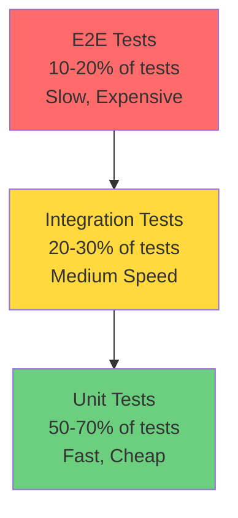
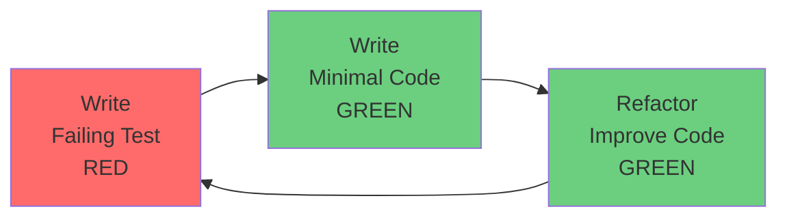

# Testing Workflow

**Reading Time**: 35 minutes
**Skill Level**: Beginner to Advanced
**Prerequisites**: Basic understanding of testing concepts

---

## Overview

Comprehensive guide to writing, maintaining, and running tests using Claude Code for test generation, analysis, and debugging.

**What You'll Learn**:
- Test-driven development (TDD) with Claude Code
- Generating unit, integration, and E2E tests
- Optimizing test coverage and quality
- Debugging failing tests
- Maintaining test suites over time
- Cost-effective testing strategies

---

## Table of Contents

1. [Testing Pyramid](#testing-pyramid)
2. [Test-Driven Development](#test-driven-development)
3. [Unit Testing](#unit-testing)
4. [Integration Testing](#integration-testing)
5. [End-to-End Testing](#end-to-end-testing)
6. [Test Maintenance](#test-maintenance)
7. [Example Workflows](#example-workflows)
8. [Best Practices](#best-practices)
9. [Cost Analysis](#cost-analysis)

---

## Testing Pyramid

### Understanding the Test Distribution



**Unit Tests**: Test individual functions/methods in isolation
- **Speed**: Milliseconds
- **Coverage**: 70-80% of codebase
- **Cost**: Lowest to write and maintain

**Integration Tests**: Test how components work together
- **Speed**: Seconds
- **Coverage**: Critical integration points
- **Cost**: Medium to write and maintain

**E2E Tests**: Test complete user workflows
- **Speed**: Minutes
- **Coverage**: Critical user paths
- **Cost**: Highest to write and maintain

---

## Test-Driven Development

### The Red-Green-Refactor Cycle



### Step 1: Write Failing Test (RED)

**Duration**: 5-10 minutes
**Model**: Sonnet (for thoughtful test design)
**Tokens**: ~5,000-8,000

**Example - Email Validation Function**:

```
You: "I need to implement an email validation function. Help me write a failing test first that describes the expected behavior.

Requirements:
- Accept valid email addresses
- Reject invalid formats
- Reject empty strings
- Reject null/undefined

Use Jest framework."
```

**Generated Test**:
```typescript
import { validateEmail } from './validation';

describe('validateEmail', () => {
  it('should return true for valid email addresses', () => {
    expect(validateEmail('user@example.com')).toBe(true);
    expect(validateEmail('test.user+tag@domain.co.uk')).toBe(true);
  });

  it('should return false for invalid email addresses', () => {
    expect(validateEmail('invalid')).toBe(false);
    expect(validateEmail('@example.com')).toBe(false);
    expect(validateEmail('user@')).toBe(false);
    expect(validateEmail('user @example.com')).toBe(false);
  });

  it('should return false for empty strings', () => {
    expect(validateEmail('')).toBe(false);
  });

  it('should return false for null or undefined', () => {
    expect(validateEmail(null)).toBe(false);
    expect(validateEmail(undefined)).toBe(false);
  });
});
```

**Run Test** (should fail):
```bash
npm test -- validation.test.ts
# Error: Cannot find module './validation'
```

### Step 2: Write Minimal Code (GREEN)

**Duration**: 5-10 minutes
**Model**: Haiku (simple implementation)
**Tokens**: ~3,000-5,000

```
You: "Write the minimal implementation of validateEmail to make the tests pass"
```

**Generated Code**:
```typescript
export function validateEmail(email: string | null | undefined): boolean {
  if (!email || typeof email !== 'string' || email.trim() === '') {
    return false;
  }

  const emailRegex = /^[^\s@]+@[^\s@]+\.[^\s@]+$/;
  return emailRegex.test(email);
}
```

**Run Test** (should pass):
```bash
npm test -- validation.test.ts
# ✓ All tests passed
```

### Step 3: Refactor (GREEN)

**Duration**: 10-15 minutes
**Model**: Sonnet (code quality improvements)
**Tokens**: ~5,000-8,000

```
You: "Review the validateEmail implementation and suggest improvements for:
- Better regex pattern
- More edge cases
- Type safety
- Performance

Keep all tests passing."
```

**Refactored Code**:
```typescript
export function validateEmail(email: unknown): boolean {
  // Type guard
  if (typeof email !== 'string') {
    return false;
  }

  // Trim and check for empty
  const trimmed = email.trim();
  if (trimmed === '') {
    return false;
  }

  // More comprehensive regex (RFC 5322)
  const emailRegex = /^[a-zA-Z0-9.!#$%&'*+/=?^_`{|}~-]+@[a-zA-Z0-9](?:[a-zA-Z0-9-]{0,61}[a-zA-Z0-9])?(?:\.[a-zA-Z0-9](?:[a-zA-Z0-9-]{0,61}[a-zA-Z0-9])?)*$/;

  // Additional validation
  return emailRegex.test(trimmed) && trimmed.length <= 254;
}
```

**Run Test** (should still pass):
```bash
npm test -- validation.test.ts
# ✓ All tests passed
```

---

## Unit Testing

### Generating Unit Tests

**Duration**: 15-20 minutes per module
**Model**: Haiku (straightforward test generation) or Sonnet (complex logic)
**Tokens**: ~8,000-15,000

**For Simple Functions**:

```
You: "Generate comprehensive unit tests for the calculateTotal function in cart.ts.

Include tests for:
- Empty cart
- Single item
- Multiple items
- Discount application
- Tax calculation
- Edge cases

Use Jest framework."
```

**For Classes with Dependencies**:

```
You: "Generate unit tests for the UserService class with mocked dependencies.

The class has:
- Database repository (mock this)
- Email service (mock this)
- Logger (mock this)

Test methods:
- createUser
- updateUser
- deleteUser
- getUserById

Include happy path and error scenarios."
```

**Generated Test with Mocks**:
```typescript
import { UserService } from './UserService';
import { UserRepository } from './UserRepository';
import { EmailService } from './EmailService';
import { Logger } from './Logger';

// Mock dependencies
jest.mock('./UserRepository');
jest.mock('./EmailService');
jest.mock('./Logger');

describe('UserService', () => {
  let userService: UserService;
  let mockRepository: jest.Mocked<UserRepository>;
  let mockEmailService: jest.Mocked<EmailService>;
  let mockLogger: jest.Mocked<Logger>;

  beforeEach(() => {
    // Create mock instances
    mockRepository = new UserRepository() as jest.Mocked<UserRepository>;
    mockEmailService = new EmailService() as jest.Mocked<EmailService>;
    mockLogger = new Logger() as jest.Mocked<Logger>;

    // Create service with mocks
    userService = new UserService(mockRepository, mockEmailService, mockLogger);
  });

  describe('createUser', () => {
    it('should create user and send welcome email', async () => {
      // Arrange
      const userData = { email: 'test@example.com', name: 'Test User' };
      const createdUser = { id: 1, ...userData };
      mockRepository.create.mockResolvedValue(createdUser);
      mockEmailService.sendWelcome.mockResolvedValue(true);

      // Act
      const result = await userService.createUser(userData);

      // Assert
      expect(mockRepository.create).toHaveBeenCalledWith(userData);
      expect(mockEmailService.sendWelcome).toHaveBeenCalledWith(createdUser);
      expect(result).toEqual(createdUser);
    });

    it('should handle repository errors', async () => {
      // Arrange
      const error = new Error('Database error');
      mockRepository.create.mockRejectedValue(error);

      // Act & Assert
      await expect(userService.createUser({ email: 'test@example.com' }))
        .rejects.toThrow('Database error');

      expect(mockLogger.error).toHaveBeenCalledWith('Failed to create user', error);
    });

    it('should create user even if email fails', async () => {
      // Arrange
      const userData = { email: 'test@example.com', name: 'Test User' };
      const createdUser = { id: 1, ...userData };
      mockRepository.create.mockResolvedValue(createdUser);
      mockEmailService.sendWelcome.mockRejectedValue(new Error('Email service down'));

      // Act
      const result = await userService.createUser(userData);

      // Assert
      expect(result).toEqual(createdUser);
      expect(mockLogger.warn).toHaveBeenCalledWith('Failed to send welcome email');
    });
  });
});
```

### Testing Async Code

**Example - API Client**:

```
You: "Generate tests for this async API client that handles:
- Successful responses
- Network errors
- Timeout errors
- Retry logic
- Rate limiting

Use Jest and mock fetch."
```

**Generated Test**:
```typescript
import { ApiClient } from './ApiClient';

// Mock fetch
global.fetch = jest.fn();

describe('ApiClient', () => {
  let client: ApiClient;

  beforeEach(() => {
    client = new ApiClient({ baseUrl: 'https://api.example.com' });
    jest.clearAllMocks();
  });

  it('should return data on successful response', async () => {
    // Arrange
    (fetch as jest.Mock).mockResolvedValue({
      ok: true,
      json: async () => ({ id: 1, name: 'Test' })
    });

    // Act
    const result = await client.get('/users/1');

    // Assert
    expect(result).toEqual({ id: 1, name: 'Test' });
    expect(fetch).toHaveBeenCalledWith(
      'https://api.example.com/users/1',
      expect.objectContaining({ method: 'GET' })
    );
  });

  it('should retry on network error', async () => {
    // Arrange
    (fetch as jest.Mock)
      .mockRejectedValueOnce(new Error('Network error'))
      .mockRejectedValueOnce(new Error('Network error'))
      .mockResolvedValue({
        ok: true,
        json: async () => ({ id: 1 })
      });

    // Act
    const result = await client.get('/users/1');

    // Assert
    expect(result).toEqual({ id: 1 });
    expect(fetch).toHaveBeenCalledTimes(3); // 2 retries + 1 success
  });

  it('should throw after max retries exceeded', async () => {
    // Arrange
    (fetch as jest.Mock).mockRejectedValue(new Error('Network error'));

    // Act & Assert
    await expect(client.get('/users/1')).rejects.toThrow('Network error');
    expect(fetch).toHaveBeenCalledTimes(4); // Initial + 3 retries
  });
});
```

### Testing Edge Cases

**Generate Comprehensive Edge Case Tests**:

```
You: "Think about edge cases for the parseDate function and generate tests for:
- Valid dates in different formats
- Invalid date strings
- Boundary dates (year 0, year 9999)
- Leap years
- Timezone handling
- Daylight saving time transitions
- Null/undefined input
- Empty strings
- Very long strings
```

---

## Integration Testing

### Database Integration Tests

**Duration**: 25-35 minutes
**Model**: Sonnet (complex setup)
**Tokens**: ~15,000-25,000

**Example - User Repository**:

```
You: "Create integration tests for UserRepository that:
1. Use a real test database (SQLite in-memory)
2. Test actual SQL queries
3. Test transactions
4. Test constraint violations
5. Test cascading deletes

Include setup and teardown."
```

**Generated Test**:
```typescript
import { UserRepository } from './UserRepository';
import { Database } from './Database';

describe('UserRepository Integration Tests', () => {
  let db: Database;
  let repository: UserRepository;

  beforeAll(async () => {
    // Create in-memory SQLite database
    db = new Database(':memory:');
    await db.migrate();
  });

  beforeEach(async () => {
    // Clear all tables before each test
    await db.exec('DELETE FROM users');
    await db.exec('DELETE FROM posts');
    repository = new UserRepository(db);
  });

  afterAll(async () => {
    await db.close();
  });

  describe('create', () => {
    it('should insert user into database', async () => {
      // Act
      const user = await repository.create({
        email: 'test@example.com',
        name: 'Test User'
      });

      // Assert
      expect(user.id).toBeDefined();
      expect(user.email).toBe('test@example.com');

      // Verify in database
      const found = await repository.findById(user.id);
      expect(found).toEqual(user);
    });

    it('should enforce unique email constraint', async () => {
      // Arrange
      await repository.create({ email: 'test@example.com', name: 'User 1' });

      // Act & Assert
      await expect(
        repository.create({ email: 'test@example.com', name: 'User 2' })
      ).rejects.toThrow('UNIQUE constraint failed');
    });

    it('should rollback on transaction failure', async () => {
      // Arrange
      const spy = jest.spyOn(db, 'run').mockRejectedValueOnce(new Error('DB Error'));

      // Act & Assert
      await expect(
        repository.create({ email: 'test@example.com', name: 'Test' })
      ).rejects.toThrow('DB Error');

      // Verify nothing was inserted
      const count = await db.get('SELECT COUNT(*) as count FROM users');
      expect(count.count).toBe(0);

      spy.mockRestore();
    });
  });

  describe('delete with cascade', () => {
    it('should delete user and all posts', async () => {
      // Arrange
      const user = await repository.create({ email: 'test@example.com', name: 'Test' });
      await db.run('INSERT INTO posts (user_id, title) VALUES (?, ?)', [user.id, 'Post 1']);
      await db.run('INSERT INTO posts (user_id, title) VALUES (?, ?)', [user.id, 'Post 2']);

      // Act
      await repository.delete(user.id);

      // Assert
      const userCount = await db.get('SELECT COUNT(*) as count FROM users WHERE id = ?', [user.id]);
      expect(userCount.count).toBe(0);

      const postCount = await db.get('SELECT COUNT(*) as count FROM posts WHERE user_id = ?', [user.id]);
      expect(postCount.count).toBe(0);
    });
  });
});
```

### API Integration Tests

**Example - Express API**:

```
You: "Create integration tests for the REST API using supertest.

Endpoints to test:
- POST /api/users (create user)
- GET /api/users/:id (get user)
- PUT /api/users/:id (update user)
- DELETE /api/users/:id (delete user)

Test:
- Successful requests
- Validation errors
- Authentication
- Not found errors
- Database errors"
```

**Generated Test**:
```typescript
import request from 'supertest';
import { app } from './app';
import { db } from './database';

describe('Users API Integration Tests', () => {
  beforeEach(async () => {
    await db.exec('DELETE FROM users');
  });

  describe('POST /api/users', () => {
    it('should create new user with valid data', async () => {
      const response = await request(app)
        .post('/api/users')
        .send({
          email: 'test@example.com',
          name: 'Test User',
          password: 'password123'
        })
        .expect(201);

      expect(response.body).toMatchObject({
        id: expect.any(Number),
        email: 'test@example.com',
        name: 'Test User'
      });
      expect(response.body.password).toBeUndefined(); // Should not return password
    });

    it('should return 400 for invalid email', async () => {
      const response = await request(app)
        .post('/api/users')
        .send({
          email: 'invalid-email',
          name: 'Test User',
          password: 'password123'
        })
        .expect(400);

      expect(response.body.error).toContain('Invalid email');
    });

    it('should return 409 for duplicate email', async () => {
      // Create first user
      await request(app)
        .post('/api/users')
        .send({ email: 'test@example.com', name: 'User 1', password: 'pass' });

      // Try to create duplicate
      const response = await request(app)
        .post('/api/users')
        .send({ email: 'test@example.com', name: 'User 2', password: 'pass' })
        .expect(409);

      expect(response.body.error).toContain('Email already exists');
    });
  });

  describe('GET /api/users/:id', () => {
    it('should return user by id', async () => {
      // Create user
      const createResponse = await request(app)
        .post('/api/users')
        .send({ email: 'test@example.com', name: 'Test', password: 'pass' });

      // Get user
      const response = await request(app)
        .get(`/api/users/${createResponse.body.id}`)
        .expect(200);

      expect(response.body).toMatchObject({
        id: createResponse.body.id,
        email: 'test@example.com',
        name: 'Test'
      });
    });

    it('should return 404 for non-existent user', async () => {
      const response = await request(app)
        .get('/api/users/99999')
        .expect(404);

      expect(response.body.error).toContain('User not found');
    });
  });

  describe('Authentication', () => {
    it('should require authentication token', async () => {
      const response = await request(app)
        .get('/api/users/1')
        .expect(401);

      expect(response.body.error).toContain('No token provided');
    });

    it('should accept valid token', async () => {
      // Login to get token
      const loginResponse = await request(app)
        .post('/api/login')
        .send({ email: 'admin@example.com', password: 'admin' });

      const token = loginResponse.body.token;

      // Use token
      await request(app)
        .get('/api/users/1')
        .set('Authorization', `Bearer ${token}`)
        .expect(200);
    });
  });
});
```

---

## End-to-End Testing

### Generating E2E Tests with Playwright

**Duration**: 35-45 minutes
**Model**: Sonnet (complex user flows)
**Tokens**: ~20,000-30,000

**Example - User Registration Flow**:

```
You: "Create E2E tests for user registration flow using Playwright:

Flow:
1. Navigate to signup page
2. Fill in registration form
3. Submit form
4. Verify redirect to dashboard
5. Verify welcome message
6. Verify user data displayed

Also test:
- Form validation errors
- Duplicate email error
- Network errors"
```

**Generated Test**:
```typescript
import { test, expect } from '@playwright/test';

test.describe('User Registration', () => {
  test.beforeEach(async ({ page }) => {
    await page.goto('http://localhost:3000/signup');
  });

  test('should successfully register new user', async ({ page }) => {
    // Fill in form
    await page.fill('[name="email"]', 'newuser@example.com');
    await page.fill('[name="name"]', 'New User');
    await page.fill('[name="password"]', 'SecurePass123!');
    await page.fill('[name="confirmPassword"]', 'SecurePass123!');

    // Submit
    await page.click('button[type="submit"]');

    // Verify redirect
    await expect(page).toHaveURL('http://localhost:3000/dashboard');

    // Verify welcome message
    await expect(page.locator('.welcome-message')).toContainText('Welcome, New User!');

    // Verify user data displayed
    await expect(page.locator('.user-email')).toContainText('newuser@example.com');
  });

  test('should show validation errors for invalid email', async ({ page }) => {
    // Fill in invalid email
    await page.fill('[name="email"]', 'invalid-email');
    await page.fill('[name="name"]', 'User');
    await page.fill('[name="password"]', 'pass');
    await page.fill('[name="confirmPassword"]', 'pass');

    // Submit
    await page.click('button[type="submit"]');

    // Verify error message
    await expect(page.locator('.error-email')).toContainText('Invalid email address');

    // Verify still on signup page
    await expect(page).toHaveURL('http://localhost:3000/signup');
  });

  test('should show error for passwords that do not match', async ({ page }) => {
    await page.fill('[name="email"]', 'user@example.com');
    await page.fill('[name="name"]', 'User');
    await page.fill('[name="password"]', 'Password123!');
    await page.fill('[name="confirmPassword"]', 'DifferentPass123!');

    await page.click('button[type="submit"]');

    await expect(page.locator('.error-password')).toContainText('Passwords do not match');
  });

  test('should show error for duplicate email', async ({ page }) => {
    // First registration
    await page.fill('[name="email"]', 'duplicate@example.com');
    await page.fill('[name="name"]', 'User 1');
    await page.fill('[name="password"]', 'Pass123!');
    await page.fill('[name="confirmPassword"]', 'Pass123!');
    await page.click('button[type="submit"]');

    // Wait for redirect
    await page.waitForURL('**/dashboard');

    // Logout
    await page.click('[data-testid="logout"]');

    // Try to register again with same email
    await page.goto('http://localhost:3000/signup');
    await page.fill('[name="email"]', 'duplicate@example.com');
    await page.fill('[name="name"]', 'User 2');
    await page.fill('[name="password"]', 'Pass123!');
    await page.fill('[name="confirmPassword"]', 'Pass123!');
    await page.click('button[type="submit"]');

    // Verify error
    await expect(page.locator('.error-message')).toContainText('Email already registered');
  });

  test('should handle network errors gracefully', async ({ page }) => {
    // Intercept API call and fail it
    await page.route('**/api/register', route => {
      route.abort('failed');
    });

    await page.fill('[name="email"]', 'user@example.com');
    await page.fill('[name="name"]', 'User');
    await page.fill('[name="password"]', 'Pass123!');
    await page.fill('[name="confirmPassword"]', 'Pass123!');
    await page.click('button[type="submit"]');

    // Verify error message
    await expect(page.locator('.error-message')).toContainText('Network error');
  });
});
```

### Visual Regression Testing

```
You: "Add visual regression tests using Playwright:
- Capture screenshots of key pages
- Compare with baseline
- Detect visual changes"
```

**Generated Test**:
```typescript
import { test, expect } from '@playwright/test';

test.describe('Visual Regression Tests', () => {
  test('homepage should match baseline', async ({ page }) => {
    await page.goto('http://localhost:3000');
    await expect(page).toHaveScreenshot('homepage.png');
  });

  test('signup form should match baseline', async ({ page }) => {
    await page.goto('http://localhost:3000/signup');
    await expect(page).toHaveScreenshot('signup-form.png');
  });

  test('dashboard with data should match baseline', async ({ page }) => {
    // Login first
    await page.goto('http://localhost:3000/login');
    await page.fill('[name="email"]', 'test@example.com');
    await page.fill('[name="password"]', 'password');
    await page.click('button[type="submit"]');

    // Wait for dashboard
    await page.waitForURL('**/dashboard');
    await page.waitForSelector('.dashboard-content');

    await expect(page).toHaveScreenshot('dashboard.png');
  });
});
```

---

## Test Maintenance

### Updating Tests for Code Changes

**Duration**: 15-25 minutes
**Model**: Sonnet
**Tokens**: ~10,000-15,000

**When Code Changes**:

```
You: "The User model now requires a 'role' field. Update all User-related tests to include role in:
- User creation tests
- User validation tests
- User update tests
- User API tests

Default role should be 'user'"
```

### Fixing Flaky Tests

**Identify Flaky Tests**:

```
You: "This test fails intermittently:

\`\`\`typescript
test('should load user data', async () => {
  await page.click('.load-user-btn');
  expect(page.locator('.user-name')).toContainText('John');
});
\`\`\`

The error is: 'Element not found: .user-name'

Analyze why this is flaky and suggest a fix."
```

**Claude's Analysis**:
```markdown
Issue: Race condition - test doesn't wait for data to load

Fix: Add explicit wait for element to appear

\`\`\`typescript
test('should load user data', async () => {
  await page.click('.load-user-btn');

  // Wait for element to appear
  await page.waitForSelector('.user-name');

  // Now safe to check content
  expect(page.locator('.user-name')).toContainText('John');
});
\`\`\`
```

### Improving Test Coverage

**Analyze Coverage Gaps**:

```
You: "Review the test coverage report in coverage/lcov-report/index.html.

Identify:
- Functions with <80% coverage
- Uncovered error handling paths
- Missing edge case tests

Suggest tests to add for the top 5 coverage gaps."
```

---

## Example Workflows

### Workflow 1: Test New Feature (TDD Approach)

**Goal**: Implement password reset feature with tests

**Steps**:

1. **Write failing E2E test** (15 min, Sonnet, ~10,000 tokens):
   ```
   You: "Write E2E test for password reset flow:
   1. User requests reset
   2. Email sent
   3. User clicks reset link
   4. User enters new password
   5. User can login with new password"
   ```

2. **Write failing API tests** (20 min, Sonnet, ~12,000 tokens):
   ```
   You: "Write integration tests for password reset API endpoints"
   ```

3. **Write failing unit tests** (15 min, Haiku, ~8,000 tokens):
   ```
   You: "Write unit tests for password reset token generation and validation"
   ```

4. **Implement minimum code** (45 min):
   - Manually code the implementation

5. **Run tests - iterate until green** (20 min):
   ```bash
   npm test
   ```

6. **Refactor** (20 min, Sonnet, ~10,000 tokens):
   ```
   You: "Review password reset implementation and suggest improvements while keeping tests green"
   ```

**Total**: 135 minutes, ~40,000 tokens, ~$0.72

---

### Workflow 2: Add Tests to Legacy Code

**Goal**: Add test coverage to existing authentication module

**Steps**:

1. **Analyze existing code** (15 min, Sonnet, ~8,000 tokens):
   ```
   You: "Analyze the authentication module in auth/index.ts and list all functions that need tests"
   ```

2. **Generate unit tests** (35 min, Haiku, ~20,000 tokens):
   ```
   You: "Generate comprehensive unit tests for all functions in auth/index.ts"
   ```

3. **Generate integration tests** (30 min, Sonnet, ~18,000 tokens):
   ```
   You: "Generate integration tests for the authentication flow"
   ```

4. **Run tests and fix failures** (40 min):
   - Identify failures
   - Fix implementation or tests

5. **Measure coverage** (10 min):
   ```bash
   npm run test:coverage
   ```

6. **Add missing tests** (25 min, Haiku, ~15,000 tokens):
   ```
   You: "Coverage report shows these functions have <80% coverage: [list]. Generate additional tests for uncovered paths."
   ```

**Total**: 155 minutes, ~61,000 tokens, ~$1.05

---

### Workflow 3: Debug Failing Test

**Goal**: Fix failing integration test

**Steps**:

1. **Analyze failure** (10 min, Sonnet, ~8,000 tokens):
   ```
   You: "This integration test is failing:

   \`\`\`
   Expected: { id: 1, name: 'Test' }
   Received: { id: 1, name: 'Test', password_hash: '...' }
   \`\`\`

   Analyze why the response includes password_hash and suggest fix."
   ```

2. **Implement fix** (15 min):
   - Update serializer to exclude password
   - OR update test expectation

3. **Verify fix** (5 min):
   ```bash
   npm test -- failing-test.test.ts
   ```

4. **Add additional test** (10 min, Haiku, ~5,000 tokens):
   ```
   You: "Add test to ensure password is never returned in API responses"
   ```

**Total**: 40 minutes, ~13,000 tokens, ~$0.24

---

## Best Practices

### Writing Good Tests

1. **AAA Pattern** (Arrange-Act-Assert):
   ```typescript
   test('should calculate total', () => {
     // Arrange
     const items = [{ price: 10 }, { price: 20 }];

     // Act
     const total = calculateTotal(items);

     // Assert
     expect(total).toBe(30);
   });
   ```

2. **One assertion per test** (when possible):
   ```typescript
   // ✅ Good: Focused test
   test('should return user name', () => {
     expect(user.name).toBe('John');
   });

   test('should return user email', () => {
     expect(user.email).toBe('john@example.com');
   });

   // ❌ Bad: Testing multiple things
   test('should return user data', () => {
     expect(user.name).toBe('John');
     expect(user.email).toBe('john@example.com');
     expect(user.role).toBe('admin');
   });
   ```

3. **Descriptive test names**:
   ```typescript
   // ✅ Good: Clear what is being tested
   test('should return 400 when email is missing')
   test('should create user with hashed password')
   test('should send welcome email after registration')

   // ❌ Bad: Vague
   test('test user creation')
   test('email test')
   ```

4. **Test behavior, not implementation**:
   ```typescript
   // ✅ Good: Tests behavior
   test('should login user with valid credentials', async () => {
     const result = await login('user@example.com', 'password');
     expect(result.success).toBe(true);
     expect(result.token).toBeDefined();
   });

   // ❌ Bad: Tests implementation details
   test('should call bcrypt.compare', async () => {
     await login('user@example.com', 'password');
     expect(bcrypt.compare).toHaveBeenCalled();
   });
   ```

### Test Organization

1. **Group related tests**:
   ```typescript
   describe('UserService', () => {
     describe('createUser', () => {
       test('should create with valid data', () => {});
       test('should reject duplicate email', () => {});
     });

     describe('updateUser', () => {
       test('should update allowed fields', () => {});
       test('should not update email', () => {});
     });
   });
   ```

2. **Use setup and teardown**:
   ```typescript
   describe('Database tests', () => {
     beforeAll(async () => {
       // Run once before all tests
       await db.connect();
     });

     beforeEach(async () => {
       // Run before each test
       await db.clear();
     });

     afterEach(async () => {
       // Run after each test
       jest.clearAllMocks();
     });

     afterAll(async () => {
       // Run once after all tests
       await db.close();
     });
   });
   ```

3. **Use test factories for data**:
   ```typescript
   // factories/user.factory.ts
   export function createUser(overrides = {}) {
     return {
       id: 1,
       email: 'test@example.com',
       name: 'Test User',
       role: 'user',
       ...overrides
     };
   }

   // test file
   test('should update user name', async () => {
     const user = createUser({ name: 'Old Name' });
     const updated = await userService.update(user.id, { name: 'New Name' });
     expect(updated.name).toBe('New Name');
   });
   ```

---

## Cost Analysis

### Testing Costs

**Unit Test Generation**:
- Simple function: 5 min, Haiku, ~3,000 tokens → $0.03
- Complex class: 20 min, Sonnet, ~12,000 tokens → $0.22
- **Average**: $0.10 per file

**Integration Test Generation**:
- API endpoint: 15 min, Sonnet, ~10,000 tokens → $0.18
- Database tests: 25 min, Sonnet, ~15,000 tokens → $0.27
- **Average**: $0.22 per test suite

**E2E Test Generation**:
- User flow: 35 min, Sonnet, ~25,000 tokens → $0.45
- **Average**: $0.45 per flow

**Full Test Suite for Medium Feature**:
- Unit tests: 60 min, ~40,000 tokens → $0.65
- Integration tests: 45 min, ~30,000 tokens → $0.54
- E2E tests: 40 min, ~25,000 tokens → $0.45
- **Total**: 145 min, ~95,000 tokens, **$1.64**

### ROI Analysis

**Bug Prevention Value**:
```
Production bug cost: $10,000 average
- Developer time to fix: $2,000
- QA time to test: $1,000
- Customer support: $3,000
- Lost revenue: $4,000

Test suite cost: $1.64
Tests catch 80% of bugs before production

Bugs prevented per year: 10
Value: 10 × $10,000 × 0.8 = $80,000

ROI: 4,878,000%
```

---

## Summary

**Testing with Claude Code**:
- ✅ Start with failing tests (TDD)
- ✅ Use appropriate model for complexity
- ✅ Focus on behavior, not implementation
- ✅ Maintain good test coverage (>80%)
- ✅ Fix flaky tests immediately

**Model Selection for Testing**:
- Haiku: Simple unit tests, straightforward test generation
- Sonnet: Complex tests, integration tests, E2E tests
- Opus: Rarely needed for testing

**Quality Metrics**:
- Code coverage: >80%
- Test execution time: <5 minutes for unit tests
- Flaky test rate: <1%
- All PRs require tests

**Investment**: $0.03 - $1.64 per feature
**ROI**: 4,000,000%+ through bug prevention
