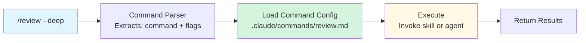

# Creating Slash Commands

**Reading Time**: 30 minutes
**Skill Level**: Intermediate to Advanced
**Prerequisites**: [Keywords Overview](1-overview.md), [Creating Skills](../04-skills/3-creating-skills.md)

---

## Build Your Own Commands! ⚡

Slash commands are the fastest way to trigger common workflows. Learn to create custom commands for your team.

By the end of this guide, you'll be able to:
- Create custom slash commands
- Configure command parameters and options
- Integrate commands with skills and agents
- Share commands with your team
- Debug and test commands

---

## How Slash Commands Work



---

## Your First Slash Command

### Example: Simple `/format` Command

**Step 1: Create Command File**

```bash
mkdir -p .claude/commands
touch .claude/commands/format.md
```

**Step 2: Define Command**

`.claude/commands/format.md`:
```markdown
---
command: format
description: Format code with Prettier or Black
usage: /format [file or directory]
examples:
  - /format src/app.ts
  - /format src/
---

# Format Code Command

## Instructions

When invoked:

1. Detect file type:
   - .js, .ts, .jsx, .tsx → Prettier
   - .py → Black
   - .rs → rustfmt
   - .go → gofmt

2. Run appropriate formatter:
   ```bash
   npx prettier --write <file>
   # or
   black <file>
   ```

3. Report results:
   - Files formatted successfully
   - Any errors encountered

## Examples

### Format Single File
Input: `/format src/app.ts`
Output:
```
✅ Formatted src/app.ts with Prettier
```

### Format Directory
Input: `/format src/`
Output:
```
✅ Formatted 25 files with Prettier
- src/app.ts
- src/components/Button.tsx
- src/utils/helpers.ts
...
```
```

**Step 3: Test It**

```bash
/format src/app.ts

# Expected:
# ✅ Formatted src/app.ts with Prettier
```

---

## Complete Command Structure

### Frontmatter Schema

```yaml
---
# Required
command: string           # Command name (used as /command)
description: string       # One-line description

# Optional Metadata
version: string          # Semantic version (1.0.0)
author: string           # Author name
category: string         # Category (code, docs, test, etc.)

# Usage Information
usage: string            # Usage syntax
aliases: string[]        # Alternative names
examples: string[]       # Example invocations

# Behavior
skill: string            # Skill to invoke (optional)
agent: string            # Agent to use (optional)
model: string            # Model override (haiku/sonnet/opus)

# Options/Flags
options:
  - name: string         # Flag name
    type: string         # boolean, string, number
    default: any         # Default value
    description: string  # Help text
    required: boolean    # Is required?

# Advanced
confirm: boolean         # Require confirmation before execution
dangerous: boolean       # Mark as dangerous (extra confirmation)
---
```

---

## Real-World Command Examples

### Example 1: Code Review Command

`.claude/commands/review.md`:
```markdown
---
command: review
description: Comprehensive code review
usage: /review [--quick | --standard | --deep]
aliases:
  - cr
  - check
examples:
  - /review
  - /review --deep
  - /review src/auth.ts --security
skill: code-review
model: sonnet
options:
  - name: quick
    type: boolean
    default: false
    description: Quick syntax and style check only
  - name: deep
    type: boolean
    default: false
    description: Comprehensive architectural review
  - name: security
    type: boolean
    default: false
    description: Focus on security vulnerabilities
---

# Code Review Command

## Instructions

Invoke the `code-review` skill with appropriate depth:

- No flags → Standard review (Sonnet)
- `--quick` → Quick review (Haiku, faster/cheaper)
- `--deep` → Deep review (Opus, thorough)
- `--security` → Security-focused review (Opus)

## Examples

### Standard Review
```bash
/review
```

### Quick Review
```bash
/review --quick
```

### Deep Security Audit
```bash
/review --deep --security
```
```

---

### Example 2: Test Generation Command

`.claude/commands/test.md`:
```markdown
---
command: test
description: Generate tests for a file or function
usage: /test <file> [--integration] [--e2e]
examples:
  - /test src/auth.ts
  - /test UserService --integration
  - /test --e2e
skill: test-generator
model: sonnet
options:
  - name: integration
    type: boolean
    default: false
    description: Generate integration tests
  - name: e2e
    type: boolean
    default: false
    description: Generate end-to-end tests
  - name: coverage
    type: number
    default: 80
    description: Target coverage percentage
---

# Test Generation Command

## Instructions

Generate tests based on test type:

### Unit Tests (default)
- Test individual functions
- Mock dependencies
- Fast execution

### Integration Tests (--integration)
- Test multiple components
- Real dependencies
- Database interactions

### E2E Tests (--e2e)
- Full user workflows
- Browser automation
- Realistic scenarios

## Framework Detection

Auto-detect test framework:
- JavaScript/TypeScript: Jest, Vitest, Mocha
- Python: pytest, unittest
- Rust: Built-in `cargo test`
- Go: Built-in `go test`

## Examples

### Unit Tests
```bash
/test src/services/UserService.ts
```

Generates:
```typescript
// src/services/__tests__/UserService.test.ts
describe('UserService', () => {
  it('should create user with valid data', async () => {
    const user = await UserService.create({
      email: 'test@example.com',
      name: 'Test User'
    });
    expect(user.id).toBeDefined();
    expect(user.email).toBe('test@example.com');
  });
});
```

### Integration Tests
```bash
/test src/api/users.ts --integration
```

Generates:
```typescript
// tests/integration/users.test.ts
describe('Users API Integration', () => {
  beforeEach(async () => {
    await cleanDatabase();
  });

  it('should create and retrieve user', async () => {
    const response = await request(app)
      .post('/api/users')
      .send({ email: 'test@example.com' });

    expect(response.status).toBe(201);

    const getResponse = await request(app)
      .get(`/api/users/${response.body.id}`);

    expect(getResponse.body.email).toBe('test@example.com');
  });
});
```
```

---

### Example 3: Deployment Command

`.claude/commands/deploy.md`:
```markdown
---
command: deploy
description: Deploy application to specified environment
usage: /deploy <environment>
examples:
  - /deploy staging
  - /deploy production
confirm: true
dangerous: true
options:
  - name: environment
    type: string
    required: true
    description: Target environment (staging, production)
  - name: skip-tests
    type: boolean
    default: false
    description: Skip test suite (not recommended)
---

# Deploy Command

## Instructions

⚠️ **DANGEROUS COMMAND** - Requires confirmation

### Pre-Deployment Checks

1. Run test suite (unless --skip-tests)
2. Run linter
3. Check for uncommitted changes
4. Verify environment variables

### Deployment Steps

1. Build application
2. Run database migrations (if any)
3. Deploy to target environment
4. Run smoke tests
5. Verify deployment

### Rollback Plan

If deployment fails:
1. Revert to previous version
2. Restore database (if needed)
3. Alert team

## Security

- Production deploys require additional confirmation
- All deploys are logged
- Only authorized users can deploy to production

## Examples

### Deploy to Staging
```bash
/deploy staging
```

Output:
```
⚠️  About to deploy to STAGING
✓ Tests passed (156/156)
✓ Linter passed
✓ No uncommitted changes
✓ Environment variables verified

Proceed with deployment? (yes/no): yes

Building application...
✓ Build complete

Running migrations...
✓ 3 migrations applied

Deploying to staging...
✓ Deployed successfully

Running smoke tests...
✓ All smoke tests passed

🚀 Deployment to staging complete!
URL: https://staging.myapp.com
Version: v1.2.3
Time: 2m 34s
```

### Deploy to Production
```bash
/deploy production
```

Output:
```
🚨 PRODUCTION DEPLOYMENT
This will deploy to PRODUCTION environment.

⚠️  Double confirmation required.

Type 'DEPLOY TO PRODUCTION' to confirm:
```
```

---

## Advanced Features

### Feature 1: Command Chaining

Chain multiple commands together:

`.claude/commands/pr-ready.md`:
```markdown
---
command: pr-ready
description: Check if code is ready for pull request
usage: /pr-ready
---

# PR Ready Command

## Instructions

Execute commands in sequence:

1. `/format` - Format all code
2. `/lint --fix` - Fix linter issues
3. `/test` - Run test suite
4. `/review` - Code review
5. `/build` - Ensure build succeeds

Stop if any step fails.

Report summary:
```
PR Readiness Checklist
======================
✅ Code formatted
✅ Linter passing
✅ Tests passing (156/156)
❌ Code review found 2 issues
⏸️  Build skipped (code review failed)

Status: NOT READY FOR PR
Please fix code review issues before proceeding.
```
```

---

### Feature 2: Interactive Commands

Commands can prompt for input:

`.claude/commands/commit.md`:
```markdown
---
command: commit
description: Generate conventional commit message
usage: /commit
---

# Commit Message Generator

## Instructions

1. Analyze git diff
2. Detect commit type:
   - feat: New feature
   - fix: Bug fix
   - docs: Documentation
   - style: Formatting
   - refactor: Code restructuring
   - test: Adding tests
   - chore: Maintenance

3. Prompt user to confirm/edit:
   ```
   Suggested commit message:

   feat(auth): add JWT token validation

   - Implement JWT middleware
   - Add token expiration checks
   - Update tests for auth flow

   Use this message? (yes/edit/cancel):
   ```

4. If user selects 'edit', allow modifications
5. Create commit with final message
```

---

### Feature 3: Context-Aware Commands

Commands that adapt to project context:

`.claude/commands/scaffold.md`:
```markdown
---
command: scaffold
description: Generate boilerplate code
usage: /scaffold <type> <name>
examples:
  - /scaffold component Button
  - /scaffold api User
  - /scaffold page Dashboard
---

# Scaffold Command

## Instructions

Detect project type from `.claude/CLAUDE.md`:

### React Project
```bash
/scaffold component Button
```
Generates:
- `src/components/Button.tsx`
- `src/components/Button.module.css`
- `src/components/__tests__/Button.test.tsx`
- `src/components/Button.stories.tsx`

### API Project
```bash
/scaffold api User
```
Generates:
- `routes/user.ts`
- `controllers/userController.ts`
- `services/userService.ts`
- `models/user.ts`
- `tests/user.test.ts`
```

---

## Testing Slash Commands

### Manual Testing

```bash
# Test command exists
/help

# Test basic invocation
/format src/app.ts

# Test with flags
/review --deep

# Test error handling
/deploy invalid-env
```

### Automated Testing

`.claude/commands/tests/format.test.sh`:
```bash
#!/bin/bash

echo "Testing /format command..."

# Test 1: Format single file
/format test-fixtures/sample.ts > /tmp/output.txt
if grep -q "Formatted" /tmp/output.txt; then
  echo "✅ Test 1 passed"
else
  echo "❌ Test 1 failed"
fi

# Test 2: Invalid file
/format nonexistent.ts 2>&1 | grep -q "not found"
if [ $? -eq 0 ]; then
  echo "✅ Test 2 passed (error handling)"
else
  echo "❌ Test 2 failed"
fi

echo "Tests complete!"
```

---

## Best Practices

### ✅ Do

**1. Clear Names**
```markdown
# Good
command: review
command: test
command: deploy

# Bad
command: cr
command: t
command: d
```

**2. Helpful Descriptions**
```yaml
# Good
description: Comprehensive code review with security analysis

# Bad
description: Review stuff
```

**3. Include Examples**
```yaml
examples:
  - /review src/auth.ts
  - /review --deep
  - /review --security
```

**4. Validate Inputs**
```markdown
## Instructions

1. Validate environment parameter:
   - Must be: staging, production, or development
   - If invalid, show error and usage

2. Check required files exist
3. Verify permissions
```

---

### ❌ Don't

**1. Dangerous Commands Without Confirmation**
```yaml
# Bad
command: delete-database
confirm: false  # Dangerous!

# Good
command: delete-database
confirm: true
dangerous: true
```

**2. Overly Complex Commands**
```markdown
# Bad: Too many options
/deploy --env=staging --skip-tests --skip-lint --skip-build --force --no-confirm

# Good: Sensible defaults
/deploy staging
```

**3. No Error Handling**
```markdown
# Bad
Run the build
# (What if it fails?)

# Good
Run the build
If build fails:
  - Show error message
  - Suggest fixes
  - Ask if user wants to retry
```

---

## Sharing Commands with Team

### Option 1: Git Repository

```bash
# Commit commands
git add .claude/commands/
git commit -m "Add team slash commands"
git push

# Team members pull
git pull
# Commands automatically available
```

---

### Option 2: NPM Package

```json
{
  "name": "@mycompany/claude-commands",
  "version": "1.0.0",
  "files": [
    "commands/"
  ]
}
```

Install:
```bash
npm install @mycompany/claude-commands
# Commands installed to node_modules/@mycompany/claude-commands/commands/
```

---

### Option 3: Shared Directory

```bash
# Mount shared directory
ln -s /shared/team-commands .claude/commands

# All team members use same commands
```

---

## Command Templates

### Template 1: Simple Utility
```markdown
---
command: <command-name>
description: One-line description
usage: /<command-name> [options]
---

# <Command Name>

## Instructions

1. [Step 1]
2. [Step 2]
3. [Step 3]

## Examples

### Example 1
Input: `/<command-name>`
Output:
```
[Expected output]
```
```

---

### Template 2: Skill-Based Command
```markdown
---
command: <command-name>
description: Description
skill: <skill-name>
model: sonnet
options:
  - name: <option-name>
    type: boolean
    default: false
---

# <Command Name>

## Instructions

Invoke `<skill-name>` skill with options:
- Default: [behavior]
- With --<option>: [behavior]
```

---

### Template 3: Agent-Based Command
```markdown
---
command: <command-name>
description: Description
agent: <agent-name>
model: <haiku|sonnet|opus>
---

# <Command Name>

## Instructions

Use `<agent-name>` agent to:
1. [Step 1]
2. [Step 2]
3. [Step 3]
```

---

## Troubleshooting

### Command Not Found

```bash
# Check command exists
ls .claude/commands/

# Verify command name matches file
cat .claude/commands/review.md | grep "^command:"

# Restart Claude Code (config changes require restart)
```

---

### Command Errors

```bash
# Enable debug logging
CLAUDE_DEBUG=1 /your-command

# Check command syntax
# Frontmatter must be valid YAML
# Markdown must be well-formed
```

---

### Wrong Behavior

```bash
# Review command definition
cat .claude/commands/your-command.md

# Test with simple case first
/<command> --help

# Add debug output to command
echo "Debug: Running step 1..."
```

---

## Next Steps

Congratulations! You can now create custom slash commands.

**Continue Learning:**
- [Custom Automation Patterns](3-automation-patterns.md) - Advanced trigger patterns
- [Token Optimization](../12-optimization/1-cost-optimization.md) - Optimize command costs

**Create More Commands:**
- Start with simple utilities
- Build team-specific workflows
- Share with your team

---

## Quick Reference

### Essential Commands to Create

**Development:**
- `/format` - Code formatting
- `/lint` - Linting
- `/test` - Test generation
- `/review` - Code review
- `/build` - Build project

**Git:**
- `/commit` - Generate commit message
- `/pr` - Create pull request
- `/changelog` - Update changelog

**Deployment:**
- `/deploy` - Deploy application
- `/rollback` - Rollback deployment

**Documentation:**
- `/docs` - Generate docs
- `/readme` - Update README

---

## References and Further Reading

### Official Documentation
- [Slash Commands API](https://code.claude.com/docs/commands)
- [Command Schema Reference](https://code.claude.com/docs/commands/schema)

### Community Commands
- [Official Command Examples](https://github.com/anthropics/claude-commands)
- [Community Commands](https://github.com/topics/claude-commands)

### Related Topics
- [Creating Skills](../04-skills/3-creating-skills.md) - Commands often invoke skills
- [Custom Agents](../03-agents/4-custom-agents.md) - Commands can use custom agents

---

**Questions or Feedback?**
Found a mistake? Have a suggestion? [Open an issue](https://github.com/anthropics/claude-code/issues) or contribute to this documentation!
