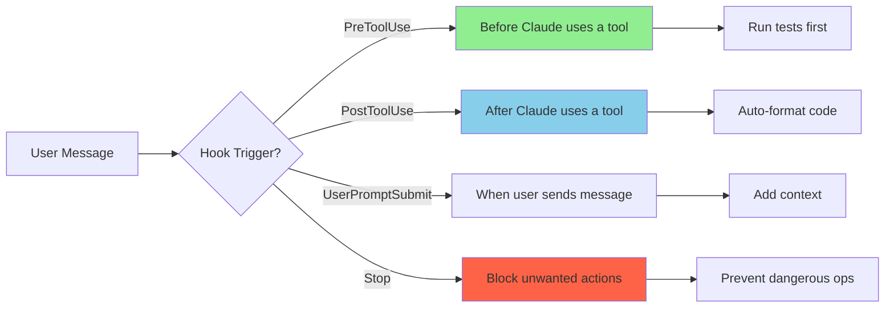

# Hooks & Automation

⏱️ **Time**: 25 minutes
📊 **Level**: Intermediate to Advanced
🎯 **What You'll Learn**: How to automate Claude Code workflows with hooks, configure triggers, and implement common automation patterns

---

## What Are Hooks?

Hooks are **automation triggers** that run at specific points in Claude Code's workflow. Think of them as "if this, then that" rules that execute automatically without manual intervention.

**Real-World Analogy**: Hooks are like motion-sensor lights in your home. When you walk through a doorway (trigger event), the lights automatically turn on (automated action). No need to flip switches!

With hooks, you can:
- ✅ Run tests automatically before committing code
- ✅ Format code automatically after writing files
- ✅ Lint code before any git operations
- ✅ Inject context into conversations
- ✅ Prevent dangerous operations

---

## Hook Types

Claude Code supports several hook types that trigger at different points in the workflow:



### Available Hook Events

Thirty events exist. These are the ones you will reach for first:

| Event | When It Runs | Common Uses |
|-------|--------------|-------------|
| **PreToolUse** | Before a tool call executes — **can block it** | Validate inputs, deny dangerous commands, rewrite arguments |
| **PostToolUse** | After a tool call succeeds | Auto-format, run tests, notify |
| **PostToolUseFailure** | After a tool call fails | Log, retry guidance |
| **UserPromptSubmit** | Before Claude processes your prompt | Inject context |
| **Stop** | When Claude finishes responding | Verify work, decide whether to continue |
| **SubagentStart` / `SubagentStop** | A subagent spawns or finishes | Per-agent setup and teardown |
| **SessionStart` / `SessionEnd** | Session begins, resumes, or terminates | Environment setup, cleanup |
| **PreCompact` / `PostCompact** | Around context compaction | Preserve state across a compact |
| **InstructionsLoaded** | A CLAUDE.md or rules file loads | Debug which instruction files actually loaded |
| **FileChanged** | A watched file changes on disk | React to external edits |

Others include `Setup`, `UserPromptExpansion`, `PermissionRequest`, `PermissionDenied`,
`PostToolBatch`, `Notification`, `MessageDisplay`, `TaskCreated`, `TaskCompleted`,
`StopFailure`, `TeammateIdle`, `ConfigChange`, `CwdChanged`, `WorktreeCreate`,
`WorktreeRemove`, `Elicitation`, and `ElicitationResult`.

> ⚠️ **Event names are case-sensitive and PascalCase.** `postToolUse` is not `PostToolUse`,
> and a hook under a misspelled event **silently never fires** — no error, no warning. If a
> hook you wrote seems to do nothing, check the casing first, then run `/hooks` to confirm
> Claude Code actually loaded it.

---

## Hook Configuration

Hooks live in `.claude/settings.json` under the `hooks` key.

### Basic Hook Configuration

The structure is **two levels deep**: each event holds a list of *matchers*, and each matcher
holds a list of *handlers*.

```json
{
  "hooks": {
    "PostToolUse": [
      {
        "matcher": "Write|Edit",
        "hooks": [
          {
            "type": "command",
            "command": "npx prettier --write ."
          }
        ]
      }
    ]
  }
}
```

Read it as: *on `PostToolUse`, for tool calls matching `Write|Edit`, run this command.*

The nesting exists so several handlers can share one matcher, and several matchers can share
one event.

### Matcher Patterns

| Pattern | Example | Behavior |
|---------|---------|----------|
| Exact | `Bash` | That tool only |
| Pipe list | `Edit\|Write` | Any in the list |
| Comma list | `Edit, Write` | Any in the list |
| Regex | `^Notebook` | Unanchored regex |
| Everything | `*`, `""`, or omitted | Fires every time |

For MCP tools, match `mcp__<server>__<tool>`, or `mcp__memory__.*` for every tool from one
server.

### Handler Types

| `type` | What it does |
|--------|-------------|
| `command` | Runs a shell command. The most common. |
| `http` | POSTs to a URL |
| `mcp_tool` | Calls an MCP tool |
| `prompt` | Sends a single-turn prompt to a model for a yes/no decision |
| `agent` | Spawns a subagent that can use Read, Grep, and Glob to verify before deciding (experimental) |

A **prompt-based hook** is how `/goal` is implemented — a `Stop` hook whose prompt asks a small
fast model whether a condition holds. See [Loops and Scheduling](../03-agents/6-loops-and-scheduling.md).

```json
{
  "hooks": {
    "PreToolUse": [
      {
        "matcher": "Bash",
        "hooks": [
          {
            "type": "prompt",
            "prompt": "Is this command destructive? $ARGUMENTS"
          }
        ]
      }
    ]
  }
}
```

### Handler Options

| Option | Type | Description |
|--------|------|-------------|
| `type` | string | `command`, `http`, `mcp_tool`, `prompt`, or `agent` |
| `command` | string | The command to run, for `type: command` |
| `timeout` | number | Timeout in **seconds** |
| `if` | string | Extra condition, such as `Bash(git *)` |
| `once` | boolean | Run only the first time it matches |
| `statusMessage` | string | Custom message shown while it runs |
| `async` | boolean | Do not block on completion |
| `shell` | string | Shell to use |

> ⚠️ **Fields that do not exist.** `name`, `description`, `tool`, `filter`, `blocking`, and
> `onError` are not read. Use `matcher` rather than `tool`, exit codes rather than `onError`,
> and `async` rather than `blocking`. A hook that appears configured but never runs is usually
> using the flat shape rather than the matcher/hooks nesting.

### Input and Exit Codes

Command hooks receive a JSON object on **stdin** and signal intent through the **exit code**:

| Exit code | Meaning |
|-----------|---------|
| `0` | Success. stdout is parsed for JSON output. |
| `2` | Blocking error. stdout ignored; **stderr becomes the reason.** |
| anything else | Non-blocking error. First line of stderr shows in the transcript. |

Every event supplies `session_id`, `transcript_path`, `cwd`, `permission_mode`, and
`hook_event_name`; tool events add `tool_name`, `tool_input`, and `tool_use_id`. Parse with
`jq`:

```bash
#!/bin/bash
input=$(cat)
file=$(echo "$input" | jq -r '.tool_input.file_path')
[[ "$file" == *.ts ]] && npx prettier --write "$file"
```

To return structured decisions, print JSON on exit 0:

```json
{
  "hookSpecificOutput": {
    "hookEventName": "PreToolUse",
    "permissionDecision": "deny",
    "permissionDecisionReason": "Refusing to force-push to main"
  }
}
```

`permissionDecision` accepts `allow`, `deny`, `ask`, or `defer`. `updatedInput` rewrites the
tool's arguments before it runs — this is how a hook turns a full test run into a filtered one.

Useful variables inside hook commands: `$CLAUDE_PROJECT_DIR`, `$CLAUDE_PLUGIN_ROOT`, and
`$CLAUDE_EFFORT`.

---

## Real-World Examples

### Example 1: Pre-Commit Linting

Automatically lint code before any git commit:

```json
{
  "hooks": {
    "PreToolUse": [
      {
        "matcher": "Bash",
        "hooks": [
          {
            "type": "command",
            "command": "npm run lint",
            "timeout": 10
          }
        ]
      }
    ]
  }
}
```

**How it works**:
1. User asks Claude to commit code
2. Before `git commit` runs, hook triggers
3. `npm run lint` executes
4. If linting fails (`onError: "stop"`), commit is blocked
5. If linting passes, commit proceeds

### Example 2: Auto-Format on File Save

Automatically format code after writing any TypeScript file:

```json
{
  "hooks": {
    "PostToolUse": [
      {
        "matcher": "Write",
        "hooks": [
          {
            "type": "command",
            "command": "prettier --write {{file}}",
            "timeout": 5,
            "async": true
          }
        ]
      }
    ]
  }
}
```

**How it works**:
1. Claude writes a `.ts` file
2. After write completes, hook triggers
3. Prettier formats the file
4. Non-blocking, so Claude continues working

**Variable substitution**: `{{file}}` is replaced with the actual filename.

### Example 3: Run Tests After Code Changes

Run relevant tests after modifying code files:

```json
{
  "hooks": {
    "PostToolUse": [
      {
        "matcher": "Write",
        "hooks": [
          {
            "type": "command",
            "command": "npm test -- {{file}}",
            "async": true
          }
        ]
      }
    ]
  }
}
```

**Why non-blocking?**: Tests can be slow. Non-blocking lets Claude continue while tests run in background.

### Example 4: Prevent Dangerous Operations

Block force pushes to main branch:

```json
{
  "hooks": {
    "PreToolUse": [
      {
        "matcher": "Bash",
        "hooks": [
          {
            "type": "command",
            "command": "echo 'Force push to main/master is blocked' && exit 1"
          }
        ]
      }
    ]
  }
}
```

**How it works**: Uses regex filter to match dangerous commands and blocks them.

---

## Common Automation Patterns

### Pattern 1: Test-Driven Development (TDD)

Enforce tests before any code changes:

```json
{
  "hooks": {
    "PreToolUse": [
      {
        "matcher": "Write",
        "hooks": [
          {
            "type": "command",
            "command": "npm test"
          }
        ]
      }
    ]
  }
}
```

### Pattern 2: Continuous Integration

Simulate CI pipeline locally:

```json
{
  "hooks": {
    "PreToolUse": [
      {
        "matcher": "Bash",
        "hooks": [
          {
            "type": "command",
            "command": "npm run lint && npm test && npm run build",
            "timeout": 60
          }
        ]
      }
    ]
  }
}
```

### Pattern 3: Context Injection

Automatically add project context to conversations:

```json
{
  "hooks": {
    "UserPromptSubmit": [
      {
        "matcher": "*",
        "hooks": [
          {
            "type": "command",
            "command": "cat .claude/CONTEXT.md"
          }
        ]
      }
    ]
  }
}
```

---

## Testing Your Hooks

It's important to test hooks before relying on them. Here's how:

### Testing Hook Configuration

There is no hook simulator, and a schema-validation test would only confirm your JSON parses —
not that Claude Code accepted it. Two checks are worth more:

**1. Confirm Claude Code loaded the hook.** Run `/hooks` inside a session. It lists every event
with the hooks registered under it and the settings file each came from. A hook missing here was
never loaded, which is almost always a misspelled event name or the flat shape instead of the
matcher/hooks nesting.

**2. Watch it fire.**

```bash
claude --debug
```

Trigger the real event — ask Claude to edit a file for a `PostToolUse` hook — and the debug log
records which hooks matched, their exit codes, and their output. A hook that rewrites tool input
shows `modified tool input keys: [command]`.

**Test the script separately**, since it is just a program reading JSON on stdin:

```bash
echo '{"tool_input":{"file_path":"src/app.ts"},"hook_event_name":"PostToolUse"}' \
  | .claude/hooks/format.sh
echo "exit: $?"
```

This is the fastest loop by far: no session, no waiting for an event, and you can assert on the
exit code and stdout directly.

### Manual Testing

1. **Add a simple hook**:
```json
{
  "hooks": {
    "PostToolUse": [
      {
        "matcher": "Write",
        "hooks": [
          {
            "type": "command",
            "command": "echo 'Hook triggered!'"
          }
        ]
      }
    ]
  }
}
```

2. **Trigger it**: Ask Claude to write a file

3. **Verify**: Check that you see "Hook triggered!" in output

4. **Iterate**: Refine hook configuration based on results

---

## Common Pitfalls

### ❌ Mistake 1: Blocking Hooks That Are Too Slow

```json
{
  "hooks": {
    "PreToolUse": [
      {
        "matcher": "Write",
        "hooks": [
          {
            "type": "command",
            "command": "npm test"
          }
        ]
      }
    ]
  }
}
```

**Problem**: Running full test suite before every file write makes development painfully slow.

### ✅ Better: Targeted, Fast Hooks

```json
{
  "hooks": {
    "PreToolUse": [
      {
        "matcher": "Write",
        "hooks": [
          {
            "type": "command",
            "command": "eslint {{file}}",
            "timeout": 5
          }
        ]
      }
    ],
    "PostToolUse": [
      {
        "matcher": "Write",
        "hooks": [
          {
            "type": "command",
            "command": "npm test -- {{file}}",
            "async": true
          }
        ]
      }
    ]
  }
}
```

**Why better**:
- Pre-hook: Fast linting (< 5 seconds) catches syntax errors
- Post-hook: Tests run in background, doesn't block development
- File filtering: Only runs for relevant files

### ❌ Mistake 2: No Error Handling

```json
{
  "hooks": {
    "PreToolUse": [
      {
        "matcher": "Write",
        "hooks": [
          {
            "type": "command",
            "command": "npm test"
          }
        ]
      }
    ]
  }
}
```

**Problem**: Hook failure behavior is undefined.

### ✅ Better: Explicit Error Handling

```json
{
  "hooks": {
    "PreToolUse": [
      {
        "matcher": "Write",
        "hooks": [
          {
            "type": "command",
            "command": "npm test",
            "timeout": 30
          }
        ]
      }
    ]
  }
}
```

---

## Performance Considerations

### Hook Execution Order

When multiple hooks match, they execute in order:

```json
{
  "hooks": {
    "PreToolUse": [
      {
        "matcher": "Write",
        "hooks": [
          {
            "type": "command",
            "command": "eslint {{file}}"
          },
          {
            "type": "command",
            "command": "npm test"
          }
        ]
      }
    ]
  }
}
```

**Execution**: lint → then → test (sequential)

### Optimization Tips

1. **Use filters**: Narrow hook scope to relevant files
2. **Set timeouts**: Prevent hooks from hanging
3. **Non-blocking when possible**: Keep workflow responsive
4. **Fast commands first**: Put quick checks in pre-hooks
5. **Slow commands in background**: Use non-blocking post-hooks

---

## Hook Conflicts and Resolution

### What Happens When Multiple Hooks Match?

When multiple hooks have the same trigger and match the same tool or file pattern, they **execute sequentially in the order defined** in your configuration.

**Example - Two formatting hooks:**
```json
{
  "hooks": {
    "PostToolUse": [
      {
        "matcher": "Write",
        "hooks": [
          {
            "type": "command",
            "command": "prettier --write {{file}}"
          },
          {
            "type": "command",
            "command": "eslint --fix {{file}}"
          }
        ]
      }
    ]
  }
}
```

**Execution flow**:
1. Claude writes a `.ts` file
2. `prettier-format` runs first
3. `eslint-fix` runs second
4. Both modify the same file → **Potential conflict!**

### A note on the examples below

There is no `filter` field. File-type conditions live in the command itself, and since a hook
receives its input as JSON on stdin, the path has to be extracted first. The examples below
write `"$f"` for brevity; in a real hook that is:

```bash
#!/bin/bash
f=$(jq -r '.tool_input.file_path')
[[ "$f" == *.ts ]] && npx prettier --write "$f"
```

Point the `command` at that script rather than inlining shell in settings.json — it is easier to
test, and you can run it standalone by piping JSON to it.

### Types of Hook Conflicts

#### 1. Formatting Conflicts

**Problem**: Multiple formatters modifying the same file can undo each other's changes.

```json
// ❌ CONFLICT: Prettier and ESLint both modify formatting
{
  "hooks": {
    "PostToolUse": [
      {
        "matcher": "Write",
        "hooks": [
          {
            "type": "command",
            "command": "[[ \"$f\" == *.ts ]] && prettier --write \"$f\""
          },
          {
            "type": "command",
            "command": "[[ \"$f\" == *.ts ]] && eslint --fix \"$f\""
          }
        ]
      }
    ]
  }
}
```

**Solution**: Combine into a single hook:
```json
// ✅ BETTER: Single formatting pipeline
{
  "hooks": {
    "PostToolUse": [
      {
        "matcher": "Write",
        "hooks": [
          {
            "type": "command",
            "command": "[[ \"$f\" == *.ts ]] && prettier --write \"$f\" && eslint --fix \"$f\""
          }
        ]
      }
    ]
  }
}
```

#### 2. Validation Conflicts

**Problem**: Multiple validation hooks with different `onError` behaviors.

```json
// ❌ CONFLICT: First hook stops, second never runs
{
  "hooks": {
    "PreToolUse": [
      {
        "matcher": "Bash",
        "hooks": [
          {
            "type": "command",
            "command": "# only for git commit\nnpm run lint"
          },
          {
            "type": "command",
            "command": "# only for git commit\nnpm test"
          }
        ]
      }
    ]
  }
}
```

**Solution**: Combine checks:
```json
// ✅ BETTER: Combined validation
{
  "hooks": {
    "PreToolUse": [
      {
        "matcher": "Bash",
        "hooks": [
          {
            "type": "command",
            "command": "# only for git commit\nnpm run lint && npm test"
          }
        ]
      }
    ]
  }
}
```

#### 3. File Path Conflicts

**Problem**: Overlapping file filters causing unintended hook execution.

```json
// ❌ CONFLICT: Both hooks match components/Button.tsx
{
  "hooks": {
    "PostToolUse": [
      {
        "matcher": "Write",
        "hooks": [
          {
            "type": "command",
            "command": "# only for src/components/*.tsx\nnpm test"
          },
          {
            "type": "command",
            "command": "# only for */Button.tsx\nnpm test -- Button"
          }
        ]
      }
    ]
  }
}
```

**Solution**: Make filters mutually exclusive:
```json
// ✅ BETTER: Non-overlapping filters
{
  "hooks": {
    "PostToolUse": [
      {
        "matcher": "Write",
        "hooks": [
          {
            "type": "command",
            "command": "# only for */Button.tsx\nnpm test -- Button"
          },
          {
            "type": "command",
            "command": "# only for src/components/*.tsx\nnpm test"
          }
        ]
      }
    ]
  }
}
```

### Detecting Hook Conflicts

Use these techniques to identify conflicts before they cause issues:

#### 1. Enable Hook Debugging
```bash
export CLAUDE_DEBUG_HOOKS=true
claude <your-command>
```

**Output shows**:
- Which hooks matched
- Execution order
- Hook results

#### 2. Confirm Your Hooks Registered

```text
/hooks
```

This lists the hooks Claude Code actually loaded, grouped by event. If a hook you wrote is not
listed here, the problem is your settings file, not your script.

#### 3. Watch a Hook Fire

There is no hook simulator. Trigger the real event and read the debug log:

```bash
claude --debug
```

Then do the thing the hook matches — ask Claude to edit a file for a `PostToolUse` hook, for
example. The debug log records which hooks matched, their exit codes, and their output. For a
hook that rewrites tool input, you will see `modified tool input keys: [command]`.

To check whether two hooks overlap, read the `matcher` patterns in `/hooks` output: any event
where more than one hook matches the same tool will run both, in the order they are defined.

### Best Practices for Avoiding Conflicts

#### ✅ 1. Use Specific Filters

```json
// Good: Specific filters minimize conflicts
{
  "hooks": {
    "PostToolUse": [
      {
        "matcher": "Write",
        "hooks": [
          {
            "type": "command",
            "command": "[[ \"$f\" == *.ts ]] && ..."
          },
          {
            "type": "command",
            "command": "[[ \"$f\" == *.css ]] && ..."
          },
          {
            "type": "command",
            "command": "[[ \"$f\" == *.json ]] && ..."
          }
        ]
      }
    ]
  }
}
```

#### ✅ 2. Combine Related Hooks

```json
// Better: Combine related operations
{
  "hooks": {
    "PostToolUse": [
      {
        "matcher": "Write",
        "hooks": [
          {
            "type": "command",
            "command": "[[ \"$f\" == *.{ts,tsx,js,jsx} ]] && prettier --write \"$f\" && eslint --fix \"$f\""
          }
        ]
      }
    ]
  }
}
```

#### ✅ 3. Document Hook Dependencies

```json
{
  "hooks": {
    "PreToolUse": [
      {
        "matcher": "Bash",
        "hooks": [
          {
            "type": "command",
            "command": "npm run lint && npm test && npm run build"
          }
        ]
      }
    ]
  }
}
```

#### ✅ 4. Use Hook Priority (if available)

```json
{
  "hooks": {
    "PostToolUse": [
      {
        "matcher": "Write",
        "hooks": [
          {
            "type": "command",
            "command": "prettier --write {{file}}"
          },
          {
            "type": "command",
            "command": "eslint --fix {{file}}"
          }
        ]
      }
    ]
  }
}
```

### Real-World Conflict Example

**Scenario**: Team wants both code formatting and license header injection.

**❌ Conflicting approach:**
```json
{
  "hooks": {
    "PostToolUse": [
      {
        "matcher": "Write",
        "hooks": [
          {
            "type": "command",
            "command": "prepend-license {{file}}"
          },
          {
            "type": "command",
            "command": "prettier --write {{file}}"
          }
        ]
      }
    ]
  }
}
```

**Problem**: Prettier might reformat the license header added by the first hook.

**✅ Solution - Correct order:**
```json
{
  "hooks": {
    "PostToolUse": [
      {
        "matcher": "Write",
        "hooks": [
          {
            "type": "command",
            "command": "prettier --write {{file}} && prepend-license {{file}}"
          }
        ]
      }
    ]
  }
}
```

**Why it works**: Format first, then add license header. License script is aware of Prettier's formatting.

---

## Success Criteria

✅ **You're ready to use hooks when you can**:
- [ ] Explain what hooks are and when they trigger
- [ ] Configure a basic hook in `.claude/settings.json`
- [ ] Understand blocking vs non-blocking hooks
- [ ] Use filters to target specific files/commands
- [ ] Test hook configuration before relying on it
- [ ] Debug hook failures
- [ ] Identify and resolve hook conflicts

---

## Troubleshooting Hook Issues

### Issue 1: Hook Not Triggering

**Symptom**: Hook defined but never executes

**Common Causes**:
- Matcher pattern doesn't match
- Hook in wrong section of config.json
- Syntax error in configuration

**Solutions**:
```bash
# Confirm the hook loaded at all
# (run /hooks inside the session and look for it under Stop)

# Validate your settings file parses
cat .claude/settings.json | jq .

# See what actually happened when the event fired
claude --debug
claude <your-command>
```

**Check matcher pattern:**
```json
// Too specific - won't match
{
  "matcher": "Write.*src/components/Button.tsx"  // Only matches exact file
}

// Better - matches category
{
  "matcher": "Write"  // Matches all Write tool uses
}
```

---

### Issue 2: Hook Failing Silently

**Symptom**: Hook runs but command fails without visible error

**Common Causes**:
- Command returns non-zero exit code
- Command not in PATH
- Permission denied

**Solutions**:
```bash
# Test hook command directly
~/.claude/hooks/my-hook.sh

# Check command exists
which prettier
which eslint

# Add explicit error handling to hook
#!/bin/bash
set -e  # Exit on any error
prettier --write "$FILE" || {
  echo "Prettier failed on $FILE"
  exit 1
}
```

---

### Issue 3: Hook Causing Performance Issues

**Symptom**: Claude Code becomes slow after adding hooks

**Common Causes**:
- Hook runs synchronously and takes too long
- Hook processes too many files
- No timeout configured

**Solutions**:
```json
{
  "hooks": {
    "PostToolUse": [
      {
        "matcher": "Write",
        "hooks": [
          {
            "type": "command",
            "command": "prettier --write $FILE",
            "timeout": 5000
          }
        ]
      }
    ]
  }
}
```

**Or make hook async:**
```bash
# Run hook in background (use with caution)
prettier --write "$FILE" &
```

---

### Issue 4: Stop Hook Blocking Workflow

**Symptom**: Can't continue until fixing git issues

**Common Causes**:
- Stop hook returns non-zero exit code
- Hook has strict validation

**Solutions**:
```bash
# Temporarily disable Stop hooks
export CLAUDE_SKIP_HOOKS=Stop

# Or make hook non-blocking
#!/bin/bash
# Check for uncommitted changes but don't block
if git diff --quiet; then
  echo "✅ No uncommitted changes"
else
  echo "⚠️ Warning: Uncommitted changes found"
fi
exit 0  # Always succeed
```

---

### Issue 5: Hook Environment Variables Not Available

**Symptom**: Hook can't access $FILE, $TOOL, or custom variables

**Common Causes**:
- Variable not exported
- Hook runs in different shell context
- Variable name incorrect

**Solutions**:
```json
{
  "hooks": {
    "PostToolUse": [
      {
        "matcher": "Write",
        "hooks": [
          {
            "type": "command",
            "command": "echo 'Modified: $FILE with $TOOL' >> /tmp/hooks.log"
          }
        ]
      }
    ]
  }
}
```

**Debug variables:**
```bash
#!/bin/bash
# Debug hook script
echo "TOOL: $TOOL" >> /tmp/hook-debug.log
echo "FILE: $FILE" >> /tmp/hook-debug.log
echo "STATUS: $STATUS" >> /tmp/hook-debug.log
echo "OUTPUT: $OUTPUT" >> /tmp/hook-debug.log
```

---

### Still Having Issues?

1. **Enable debug mode**: `export CLAUDE_DEBUG_HOOKS=true`
2. **Check hook logs**: `~/.claude/logs/hooks.log`
3. **Validate configuration**: `cat .claude/settings.json | jq .`, then check `/hooks`
4. **Test hooks in isolation**: Run hook script manually with test inputs
5. **Review examples**: See [Hook Examples](../13-examples/workflows/3-code-review.md)
6. **Ask community**: [Discord #hooks channel](https://discord.gg/anthropic)

---

## What's Next?

**Related Topics**:
- **[Slash Commands](../10-keywords/2-slash-commands.md)** → Manual workflow triggers
- **[Skills](../04-skills/1-overview.md)** → Custom instructions (combine with hooks)
- **[Token Optimization](../12-optimization/2-advanced-techniques.md)** → Efficient automation

**Examples**:
- **[Testing Workflow](../13-examples/workflows/7-testing.md)** → TDD with automated hooks
- **[Code Review Workflow](../13-examples/workflows/3-code-review.md)** → Pre-commit quality checks

**Complete Reference**:
- **[Plugin Ecosystem Guide](../07-plugins/1-overview.md)** → All plugin types in detail

---

## References

- [Claude Code Hooks Documentation](https://code.claude.com/docs/hooks) - Official reference
- [Automation Patterns](../10-keywords/3-automation-patterns.md) - Advanced automation techniques
- [Best Practices Catalog](../16-community/3-best-practices-catalog.md) - Community hook examples

---

**You've completed the Hooks & Automation guide!** You now understand how to automate Claude Code workflows with hooks. Time to set up your first hook! 🎣
