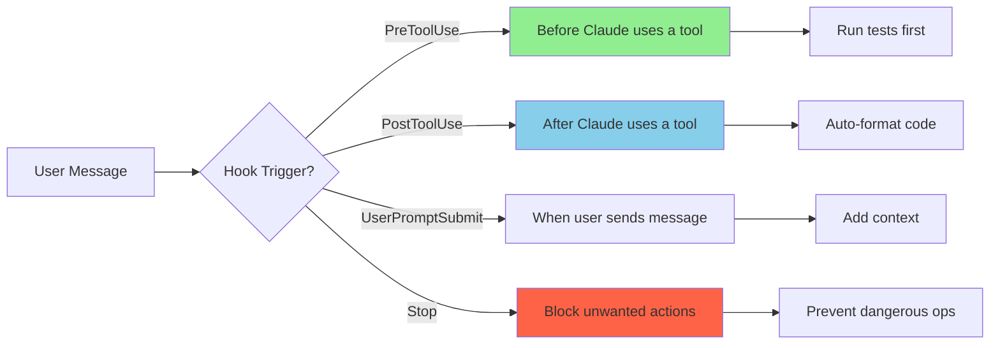

# Hooks & Automation

⏱️ **Time**: 25 minutes
📊 **Level**: Intermediate to Advanced
🎯 **What You'll Learn**: How to automate Claude Code workflows with hooks, configure triggers, and implement common automation patterns

---

## What Are Hooks?

Hooks are **automation triggers** that run at specific points in Claude Code's workflow. Think of them as "if this, then that" rules that execute automatically without manual intervention.

**Real-World Analogy**: Hooks are like motion-sensor lights in your home. When you walk through a doorway (trigger event), the lights automatically turn on (automated action). No need to flip switches!

With hooks, you can:
- ✅ Run tests automatically before committing code
- ✅ Format code automatically after writing files
- ✅ Lint code before any git operations
- ✅ Inject context into conversations
- ✅ Prevent dangerous operations

---

## Hook Types

Claude Code supports several hook types that trigger at different points in the workflow:



### Available Hook Types

| Hook Type | When It Runs | Common Uses |
|-----------|--------------|-------------|
| **PreToolUse** | Before Claude uses a tool (Write, Bash, etc.) | Run tests, lint code, validate inputs |
| **PostToolUse** | After Claude uses a tool | Auto-format, run tests, notify team |
| **UserPromptSubmit** | When user submits a message | Inject context, modify prompts |
| **Stop** | Blocks specific actions | Prevent force push, block dangerous commands |

---

## Hook Configuration

Hooks are configured in `.claude/settings.json`. Here's the basic structure:

### Basic Hook Configuration

```json
{
  "hooks": {
    "preToolUse": [
      {
        "name": "hook-name",
        "description": "What this hook does",
        "tool": "Write",
        "command": "npm test"
      }
    ],
    "postToolUse": [
      {
        "name": "auto-format",
        "description": "Format code after writing",
        "tool": "Write",
        "command": "prettier --write ."
      }
    ]
  }
}
```

### Hook Configuration Options

| Option | Type | Description | Example |
|--------|------|-------------|---------|
| `name` | string | Unique hook identifier | `"pre-commit-lint"` |
| `description` | string | What the hook does | `"Run linting before commits"` |
| `tool` | string | Which tool triggers this | `"Write"`, `"Bash"`, `"Edit"` |
| `filter` | string | Pattern to match | `"*.ts"`, `"git commit"` |
| `command` | string | Command to execute | `"npm test"` |
| `blocking` | boolean | Wait for completion? | `true` or `false` |
| `timeout` | number | Max execution time (ms) | `5000` |
| `onError` | string | What to do on error | `"stop"`, `"warn"`, `"continue"` |

---

## Real-World Examples

### Example 1: Pre-Commit Linting

Automatically lint code before any git commit:

```json
{
  "hooks": {
    "preToolUse": [
      {
        "name": "pre-commit-lint",
        "description": "Lint code before git commits",
        "tool": "Bash",
        "filter": "git commit",
        "command": "npm run lint",
        "blocking": true,
        "onError": "stop",
        "timeout": 10000
      }
    ]
  }
}
```

**How it works**:
1. User asks Claude to commit code
2. Before `git commit` runs, hook triggers
3. `npm run lint` executes
4. If linting fails (`onError: "stop"`), commit is blocked
5. If linting passes, commit proceeds

### Example 2: Auto-Format on File Save

Automatically format code after writing any TypeScript file:

```json
{
  "hooks": {
    "postToolUse": [
      {
        "name": "auto-format-ts",
        "description": "Format TypeScript files after writing",
        "tool": "Write",
        "filter": "*.ts",
        "command": "prettier --write {{file}}",
        "blocking": false,
        "timeout": 5000
      }
    ]
  }
}
```

**How it works**:
1. Claude writes a `.ts` file
2. After write completes, hook triggers
3. Prettier formats the file
4. Non-blocking, so Claude continues working

**Variable substitution**: `{{file}}` is replaced with the actual filename.

### Example 3: Run Tests After Code Changes

Run relevant tests after modifying code files:

```json
{
  "hooks": {
    "postToolUse": [
      {
        "name": "post-write-test",
        "description": "Run tests after modifying files",
        "tool": "Write",
        "filter": "src/**/*.ts",
        "command": "npm test -- {{file}}",
        "blocking": false
      }
    ]
  }
}
```

**Why non-blocking?**: Tests can be slow. Non-blocking lets Claude continue while tests run in background.

### Example 4: Prevent Dangerous Operations

Block force pushes to main branch:

```json
{
  "hooks": {
    "preToolUse": [
      {
        "name": "prevent-force-push-main",
        "description": "Block force push to main/master",
        "tool": "Bash",
        "filter": "git push.*--force.*main|git push.*--force.*master",
        "command": "echo 'Force push to main/master is blocked' && exit 1",
        "blocking": true,
        "onError": "stop"
      }
    ]
  }
}
```

**How it works**: Uses regex filter to match dangerous commands and blocks them.

---

## Common Automation Patterns

### Pattern 1: Test-Driven Development (TDD)

Enforce tests before any code changes:

```json
{
  "hooks": {
    "preToolUse": [
      {
        "name": "tdd-test-first",
        "description": "Run tests before writing code",
        "tool": "Write",
        "filter": "src/**/*.ts",
        "command": "npm test",
        "blocking": true,
        "onError": "warn"
      }
    ]
  }
}
```

### Pattern 2: Continuous Integration

Simulate CI pipeline locally:

```json
{
  "hooks": {
    "preToolUse": [
      {
        "name": "local-ci",
        "description": "Run CI checks before commits",
        "tool": "Bash",
        "filter": "git commit",
        "command": "npm run lint && npm test && npm run build",
        "blocking": true,
        "timeout": 60000
      }
    ]
  }
}
```

### Pattern 3: Context Injection

Automatically add project context to conversations:

```json
{
  "hooks": {
    "userPromptSubmit": [
      {
        "name": "inject-context",
        "description": "Add project context to prompts",
        "command": "cat .claude/CONTEXT.md"
      }
    ]
  }
}
```

---

## Testing Your Hooks

It's important to test hooks before relying on them. Here's how:

### Testing Hook Configuration

```python
import pytest
import json
from pathlib import Path

def test_hook_configuration_valid():
    """Test that hooks configuration is valid JSON."""
    config_path = Path(".claude/settings.json")

    with open(config_path) as f:
        config = json.load(f)

    assert "hooks" in config
    assert "preToolUse" in config["hooks"]
    assert "postToolUse" in config["hooks"]

def test_hook_has_required_fields():
    """Test that each hook has required fields."""
    config_path = Path(".claude/settings.json")

    with open(config_path) as f:
        config = json.load(f)

    for hook_type in ["preToolUse", "postToolUse"]:
        for hook in config["hooks"].get(hook_type, []):
            assert "name" in hook, f"Hook missing name: {hook}"
            assert "command" in hook, f"Hook missing command: {hook}"
            assert "tool" in hook, f"Hook missing tool: {hook}"

def test_hook_commands_exist():
    """Test that hook commands are executable."""
    import subprocess

    config_path = Path(".claude/settings.json")

    with open(config_path) as f:
        config = json.load(f)

    for hook_type in ["preToolUse", "postToolUse"]:
        for hook in config["hooks"].get(hook_type, []):
            command = hook["command"].split()[0]

            # Check if command exists
            try:
                result = subprocess.run(
                    ["which", command],
                    capture_output=True,
                    text=True
                )
                assert result.returncode == 0, f"Command '{command}' not found"
            except Exception as e:
                pytest.fail(f"Failed to verify command '{command}': {e}")

if __name__ == '__main__':
    pytest.main([__file__])
```

### Manual Testing

1. **Add a simple hook**:
```json
{
  "hooks": {
    "postToolUse": [
      {
        "name": "test-hook",
        "tool": "Write",
        "command": "echo 'Hook triggered!'"
      }
    ]
  }
}
```

2. **Trigger it**: Ask Claude to write a file

3. **Verify**: Check that you see "Hook triggered!" in output

4. **Iterate**: Refine hook configuration based on results

---

## Common Pitfalls

### ❌ Mistake 1: Blocking Hooks That Are Too Slow

```json
{
  "hooks": {
    "preToolUse": [
      {
        "name": "slow-test",
        "tool": "Write",
        "command": "npm test",
        "blocking": true  // ❌ Blocks every file write!
      }
    ]
  }
}
```

**Problem**: Running full test suite before every file write makes development painfully slow.

### ✅ Better: Targeted, Fast Hooks

```json
{
  "hooks": {
    "preToolUse": [
      {
        "name": "fast-lint",
        "tool": "Write",
        "filter": "*.ts",
        "command": "eslint {{file}}",
        "blocking": true,
        "timeout": 5000  // ✅ Fast lint only
      }
    ],
    "postToolUse": [
      {
        "name": "unit-tests",
        "tool": "Write",
        "filter": "*.ts",
        "command": "npm test -- {{file}}",
        "blocking": false  // ✅ Non-blocking tests
      }
    ]
  }
}
```

**Why better**:
- Pre-hook: Fast linting (< 5 seconds) catches syntax errors
- Post-hook: Tests run in background, doesn't block development
- File filtering: Only runs for relevant files

### ❌ Mistake 2: No Error Handling

```json
{
  "hooks": {
    "preToolUse": [
      {
        "name": "test",
        "tool": "Write",
        "command": "npm test"
        // ❌ No onError, no timeout
      }
    ]
  }
}
```

**Problem**: Hook failure behavior is undefined.

### ✅ Better: Explicit Error Handling

```json
{
  "hooks": {
    "preToolUse": [
      {
        "name": "test",
        "tool": "Write",
        "command": "npm test",
        "blocking": true,
        "timeout": 30000,
        "onError": "stop"  // ✅ Clear behavior
      }
    ]
  }
}
```

---

## Performance Considerations

### Hook Execution Order

When multiple hooks match, they execute in order:

```json
{
  "hooks": {
    "preToolUse": [
      {"name": "lint", "tool": "Write", "command": "eslint {{file}}"},
      {"name": "test", "tool": "Write", "command": "npm test"}
    ]
  }
}
```

**Execution**: lint → then → test (sequential)

### Optimization Tips

1. **Use filters**: Narrow hook scope to relevant files
2. **Set timeouts**: Prevent hooks from hanging
3. **Non-blocking when possible**: Keep workflow responsive
4. **Fast commands first**: Put quick checks in pre-hooks
5. **Slow commands in background**: Use non-blocking post-hooks

---

## Hook Conflicts and Resolution

### What Happens When Multiple Hooks Match?

When multiple hooks have the same trigger and match the same tool or file pattern, they **execute sequentially in the order defined** in your configuration.

**Example - Two formatting hooks:**
```json
{
  "hooks": {
    "postToolUse": [
      {
        "name": "prettier-format",
        "tool": "Write",
        "filter": "*.ts",
        "command": "prettier --write {{file}}"
      },
      {
        "name": "eslint-fix",
        "tool": "Write",
        "filter": "*.ts",
        "command": "eslint --fix {{file}}"
      }
    ]
  }
}
```

**Execution flow**:
1. Claude writes a `.ts` file
2. `prettier-format` runs first
3. `eslint-fix` runs second
4. Both modify the same file → **Potential conflict!**

### Types of Hook Conflicts

#### 1. Formatting Conflicts

**Problem**: Multiple formatters modifying the same file can undo each other's changes.

```json
// ❌ CONFLICT: Prettier and ESLint both modify formatting
{
  "hooks": {
    "postToolUse": [
      {"name": "prettier", "tool": "Write", "filter": "*.ts", "command": "prettier --write {{file}}"},
      {"name": "eslint", "tool": "Write", "filter": "*.ts", "command": "eslint --fix {{file}}"}
    ]
  }
}
```

**Solution**: Combine into a single hook:
```json
// ✅ BETTER: Single formatting pipeline
{
  "hooks": {
    "postToolUse": [
      {
        "name": "format-and-lint",
        "tool": "Write",
        "filter": "*.ts",
        "command": "prettier --write {{file}} && eslint --fix {{file}}"
      }
    ]
  }
}
```

#### 2. Validation Conflicts

**Problem**: Multiple validation hooks with different `onError` behaviors.

```json
// ❌ CONFLICT: First hook stops, second never runs
{
  "hooks": {
    "preToolUse": [
      {"name": "lint", "tool": "Bash", "filter": "git commit", "command": "npm run lint", "onError": "stop"},
      {"name": "test", "tool": "Bash", "filter": "git commit", "command": "npm test", "onError": "stop"}
    ]
  }
}
```

**Solution**: Combine checks:
```json
// ✅ BETTER: Combined validation
{
  "hooks": {
    "preToolUse": [
      {
        "name": "pre-commit-checks",
        "tool": "Bash",
        "filter": "git commit",
        "command": "npm run lint && npm test",
        "onError": "stop"
      }
    ]
  }
}
```

#### 3. File Path Conflicts

**Problem**: Overlapping file filters causing unintended hook execution.

```json
// ❌ CONFLICT: Both hooks match components/Button.tsx
{
  "hooks": {
    "postToolUse": [
      {"name": "component-test", "tool": "Write", "filter": "src/components/*.tsx", "command": "npm test"},
      {"name": "button-test", "tool": "Write", "filter": "*/Button.tsx", "command": "npm test -- Button"}
    ]
  }
}
```

**Solution**: Make filters mutually exclusive:
```json
// ✅ BETTER: Non-overlapping filters
{
  "hooks": {
    "postToolUse": [
      {
        "name": "button-test",
        "tool": "Write",
        "filter": "*/Button.tsx",
        "command": "npm test -- Button"
      },
      {
        "name": "other-components-test",
        "tool": "Write",
        "filter": "src/components/*.tsx",
        "exclude": "*/Button.tsx",  // Exclude Button.tsx
        "command": "npm test"
      }
    ]
  }
}
```

### Detecting Hook Conflicts

Use these techniques to identify conflicts before they cause issues:

#### 1. Enable Hook Debugging
```bash
export CLAUDE_DEBUG_HOOKS=true
claude <your-command>
```

**Output shows**:
- Which hooks matched
- Execution order
- Hook results

#### 2. Confirm Your Hooks Registered

```text
/hooks
```

This lists the hooks Claude Code actually loaded, grouped by event. If a hook you wrote is not
listed here, the problem is your settings file, not your script.

#### 3. Watch a Hook Fire

There is no hook simulator. Trigger the real event and read the debug log:

```bash
claude --debug
```

Then do the thing the hook matches — ask Claude to edit a file for a `PostToolUse` hook, for
example. The debug log records which hooks matched, their exit codes, and their output. For a
hook that rewrites tool input, you will see `modified tool input keys: [command]`.

To check whether two hooks overlap, read the `matcher` patterns in `/hooks` output: any event
where more than one hook matches the same tool will run both, in the order they are defined.

### Best Practices for Avoiding Conflicts

#### ✅ 1. Use Specific Filters

```json
// Good: Specific filters minimize conflicts
{
  "hooks": {
    "postToolUse": [
      {"name": "ts-format", "tool": "Write", "filter": "*.ts", "command": "..."},
      {"name": "css-format", "tool": "Write", "filter": "*.css", "command": "..."},
      {"name": "json-format", "tool": "Write", "filter": "*.json", "command": "..."}
    ]
  }
}
```

#### ✅ 2. Combine Related Hooks

```json
// Better: Combine related operations
{
  "hooks": {
    "postToolUse": [
      {
        "name": "format-code",
        "tool": "Write",
        "filter": "*.{ts,tsx,js,jsx}",
        "command": "prettier --write {{file}} && eslint --fix {{file}}"
      }
    ]
  }
}
```

#### ✅ 3. Document Hook Dependencies

```json
{
  "hooks": {
    "preToolUse": [
      {
        "name": "pre-commit-pipeline",
        "description": "Runs lint, then test, then build (must execute in order)",
        "tool": "Bash",
        "filter": "git commit",
        "command": "npm run lint && npm test && npm run build"
      }
    ]
  }
}
```

#### ✅ 4. Use Hook Priority (if available)

```json
{
  "hooks": {
    "postToolUse": [
      {
        "name": "format-first",
        "priority": 1,  // Runs first
        "tool": "Write",
        "command": "prettier --write {{file}}"
      },
      {
        "name": "lint-second",
        "priority": 2,  // Runs after formatting
        "tool": "Write",
        "command": "eslint --fix {{file}}"
      }
    ]
  }
}
```

### Real-World Conflict Example

**Scenario**: Team wants both code formatting and license header injection.

**❌ Conflicting approach:**
```json
{
  "hooks": {
    "postToolUse": [
      {"name": "add-license", "tool": "Write", "filter": "*.ts", "command": "prepend-license {{file}}"},
      {"name": "format", "tool": "Write", "filter": "*.ts", "command": "prettier --write {{file}}"}
    ]
  }
}
```

**Problem**: Prettier might reformat the license header added by the first hook.

**✅ Solution - Correct order:**
```json
{
  "hooks": {
    "postToolUse": [
      {
        "name": "format-then-license",
        "tool": "Write",
        "filter": "*.ts",
        "command": "prettier --write {{file}} && prepend-license {{file}}"
      }
    ]
  }
}
```

**Why it works**: Format first, then add license header. License script is aware of Prettier's formatting.

---

## Success Criteria

✅ **You're ready to use hooks when you can**:
- [ ] Explain what hooks are and when they trigger
- [ ] Configure a basic hook in `.claude/settings.json`
- [ ] Understand blocking vs non-blocking hooks
- [ ] Use filters to target specific files/commands
- [ ] Test hook configuration before relying on it
- [ ] Debug hook failures
- [ ] Identify and resolve hook conflicts

---

## Troubleshooting Hook Issues

### Issue 1: Hook Not Triggering

**Symptom**: Hook defined but never executes

**Common Causes**:
- Matcher pattern doesn't match
- Hook in wrong section of config.json
- Syntax error in configuration

**Solutions**:
```bash
# Confirm the hook loaded at all
# (run /hooks inside the session and look for it under Stop)

# Validate your settings file parses
cat .claude/settings.json | jq .

# See what actually happened when the event fired
claude --debug
claude <your-command>
```

**Check matcher pattern:**
```json
// Too specific - won't match
{
  "matcher": "Write.*src/components/Button.tsx"  // Only matches exact file
}

// Better - matches category
{
  "matcher": "Write"  // Matches all Write tool uses
}
```

---

### Issue 2: Hook Failing Silently

**Symptom**: Hook runs but command fails without visible error

**Common Causes**:
- Command returns non-zero exit code
- Command not in PATH
- Permission denied

**Solutions**:
```bash
# Test hook command directly
~/.claude/hooks/my-hook.sh

# Check command exists
which prettier
which eslint

# Add explicit error handling to hook
#!/bin/bash
set -e  # Exit on any error
prettier --write "$FILE" || {
  echo "Prettier failed on $FILE"
  exit 1
}
```

---

### Issue 3: Hook Causing Performance Issues

**Symptom**: Claude Code becomes slow after adding hooks

**Common Causes**:
- Hook runs synchronously and takes too long
- Hook processes too many files
- No timeout configured

**Solutions**:
```json
{
  "hooks": {
    "PostToolUse": [{
      "matcher": "Write",
      "hooks": [{
        "type": "command",
        "command": "prettier --write $FILE",
        "timeout": 5000  // Add 5-second timeout
      }]
    }]
  }
}
```

**Or make hook async:**
```bash
# Run hook in background (use with caution)
prettier --write "$FILE" &
```

---

### Issue 4: Stop Hook Blocking Workflow

**Symptom**: Can't continue until fixing git issues

**Common Causes**:
- Stop hook returns non-zero exit code
- Hook has strict validation

**Solutions**:
```bash
# Temporarily disable Stop hooks
export CLAUDE_SKIP_HOOKS=Stop

# Or make hook non-blocking
#!/bin/bash
# Check for uncommitted changes but don't block
if git diff --quiet; then
  echo "✅ No uncommitted changes"
else
  echo "⚠️ Warning: Uncommitted changes found"
fi
exit 0  # Always succeed
```

---

### Issue 5: Hook Environment Variables Not Available

**Symptom**: Hook can't access $FILE, $TOOL, or custom variables

**Common Causes**:
- Variable not exported
- Hook runs in different shell context
- Variable name incorrect

**Solutions**:
```json
{
  "hooks": {
    "PostToolUse": [{
      "matcher": "Write",
      "hooks": [{
        "type": "command",
        // Use exact variable names: $FILE, $TOOL, $OUTPUT
        "command": "echo 'Modified: $FILE with $TOOL' >> /tmp/hooks.log"
      }]
    }]
  }
}
```

**Debug variables:**
```bash
#!/bin/bash
# Debug hook script
echo "TOOL: $TOOL" >> /tmp/hook-debug.log
echo "FILE: $FILE" >> /tmp/hook-debug.log
echo "STATUS: $STATUS" >> /tmp/hook-debug.log
echo "OUTPUT: $OUTPUT" >> /tmp/hook-debug.log
```

---

### Still Having Issues?

1. **Enable debug mode**: `export CLAUDE_DEBUG_HOOKS=true`
2. **Check hook logs**: `~/.claude/logs/hooks.log`
3. **Validate configuration**: `cat .claude/settings.json | jq .`, then check `/hooks`
4. **Test hooks in isolation**: Run hook script manually with test inputs
5. **Review examples**: See [Hook Examples](../13-examples/workflows/3-code-review.md)
6. **Ask community**: [Discord #hooks channel](https://discord.gg/anthropic)

---

## What's Next?

**Related Topics**:
- **[Slash Commands](../10-keywords/2-slash-commands.md)** → Manual workflow triggers
- **[Skills](../04-skills/1-overview.md)** → Custom instructions (combine with hooks)
- **[Token Optimization](../12-optimization/2-advanced-techniques.md)** → Efficient automation

**Examples**:
- **[Testing Workflow](../13-examples/workflows/7-testing.md)** → TDD with automated hooks
- **[Code Review Workflow](../13-examples/workflows/3-code-review.md)** → Pre-commit quality checks

**Complete Reference**:
- **[Plugin Ecosystem Guide](../07-plugins/1-overview.md)** → All plugin types in detail

---

## References

- [Claude Code Hooks Documentation](https://code.claude.com/docs/hooks) - Official reference
- [Automation Patterns](../10-keywords/3-automation-patterns.md) - Advanced automation techniques
- [Best Practices Catalog](../16-community/3-best-practices-catalog.md) - Community hook examples

---

**You've completed the Hooks & Automation guide!** You now understand how to automate Claude Code workflows with hooks. Time to set up your first hook! 🎣
