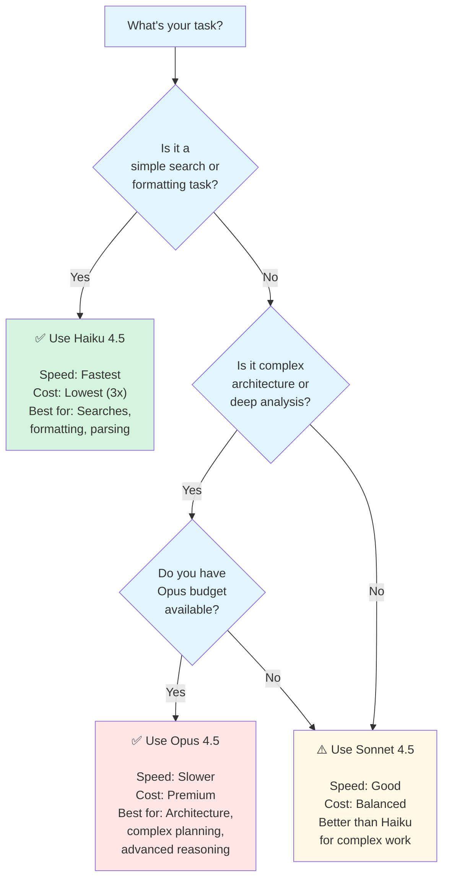

# Model Selection Decision Tree

**Reading Time**: 15 minutes
**Skill Level**: Intermediate
**Prerequisites**: [Model Comparison](../04-models/model-comparison.md)

---

## Quick Model Selection

Can't decide which model to use? Use this interactive decision tree.



---

## Decision Factors

### Factor 1: Task Complexity

**Simple Tasks (5K tokens)**
- Code formatting
- Search and exploration
- Documentation lookups
- Quick refactoring
- **→ Use Haiku**

**Standard Tasks (10-15K tokens)**
- Feature implementation
- Test writing
- Code review
- Database schema design
- **→ Use Sonnet**

**Complex Tasks (20K+ tokens)**
- Architecture design
- Major refactoring
- Complex algorithm design
- System optimization
- **→ Use Opus**

### Factor 2: Cost Sensitivity

**Cost-First Approach**
```
Start with Haiku
↓
If results are insufficient
↓
Upgrade to Sonnet
↓
Only use Opus when absolutely necessary
```

**Example Workflow:**
```
1. Search for existing code → Haiku ($0.05)
2. Implement feature → Sonnet ($0.15)
3. Design architecture → Opus ($0.40)
Monthly budget: ~$10 (very efficient)
```

### Factor 3: Speed Requirements

**Time-Sensitive Tasks**
- Unblock a developer
- Emergency bug fix
- Production issue
- **→ Use Haiku (fastest)**

**Standard Timeline**
- Regular feature development
- Code review
- Refactoring
- **→ Use Sonnet (balanced)**

**Thorough Analysis**
- Architecture review
- Complex optimization
- Security audit
- **→ Use Opus (best quality)**

### Factor 4: Quality Requirements

**"Good Enough" Quality**
- Internal scripts
- Prototyping
- Learning/practice
- **→ Haiku**

**Production Quality**
- API endpoints
- Business logic
- User-facing features
- **→ Sonnet**

**Critical Quality**
- Security-sensitive code
- Financial calculations
- Healthcare data
- **→ Opus**

---

## Quick Reference Table

| Task | Model | Time | Cost | Use Case |
|------|-------|------|------|----------|
| Find file | Haiku | 30s | $0.01 | Exploration |
| Understand code | Haiku | 1m | $0.03 | Learning |
| Refactor method | Sonnet | 3m | $0.08 | Standard work |
| Implement feature | Sonnet | 10m | $0.25 | Development |
| Design architecture | Opus | 20m | $0.75 | Planning |
| Security audit | Opus | 30m | $1.10 | Compliance |

---

## Real-World Scenarios

### Scenario 1: Building a New API

**Phase 1: Design** (Opus)
```
Task: "Design REST API for user management"
Model: Opus (complex architecture)
Cost: ~$0.40
Time: 20 minutes
Output: Complete OpenAPI spec with best practices
```

**Phase 2: Implementation** (Sonnet)
```
Task: "Implement /users endpoint with auth"
Model: Sonnet (standard development)
Cost: ~$0.20
Time: 15 minutes
Output: Complete, tested endpoint
```

**Phase 3: Search** (Haiku)
```
Task: "Find all API endpoints"
Model: Haiku (simple search)
Cost: ~$0.02
Time: 2 minutes
Output: List of all endpoints with descriptions
```

**Total Cost**: ~$0.62 (vs. ~$1.50 if all Opus)

### Scenario 2: Bug Fix

**Analysis** (Haiku)
```
Task: "Find where the authentication bug occurs"
Model: Haiku (search and understanding)
Cost: ~$0.05
Result: Located in src/auth/jwt.ts:45
```

**Fix** (Sonnet)
```
Task: "Fix JWT validation in jwt.ts"
Model: Sonnet (standard coding)
Cost: ~$0.10
Result: Fix implemented and tested
```

**Total Cost**: ~$0.15 (focused, efficient)

### Scenario 3: Performance Optimization

**Profiling** (Haiku)
```
Task: "Identify slow database queries"
Model: Haiku (search, analysis)
Cost: ~$0.08
```

**Deep Analysis** (Opus)
```
Task: "Design optimal query strategies"
Model: Opus (complex optimization)
Cost: ~$0.50
```

**Implementation** (Sonnet)
```
Task: "Implement optimized queries"
Model: Sonnet (standard coding)
Cost: ~$0.15
```

**Total Cost**: ~$0.73

---

## When to Use Extended Thinking

### Thinking Keywords

| Keyword | Budget | Best For |
|---------|--------|----------|
| (none) | 0 | Simple tasks |
| `"think"` | ~4K | Moderate complexity |
| `"think hard"` | ~10K | Complex reasoning |
| `"ultrathink"` | ~32K | Maximum depth |

### Decision Matrix

```
Task Complexity vs. Thinking Budget

                    No Thinking    "think"    "think hard"   "ultrathink"
Simple (Haiku)         ✅            ❌           ❌             ❌
Standard (Sonnet)      ✅            ✅           ✅             ⚠️
Complex (Opus)         ✅            ✅           ✅             ✅
```

### Examples

**✅ Use "think" with Sonnet:**
```
"Think and then implement a cache-busting strategy"
Model: Sonnet + "think"
Cost: ~$0.25 (vs. $0.15 without thinking)
Value: Better architectural decision
```

**✅ Use "think hard" with Opus:**
```
"Think hard about scalability and then design a database schema"
Model: Opus + "think hard"
Cost: ~$0.65 (complex + thinking)
Value: Excellent schema design with scalability built in
```

**❌ Don't use "think" with Haiku:**
```
❌ "Think and find the file"
Wastes tokens on simple search

✅ Better: "Find the file" (no thinking needed)
```

---

## Cost Optimization Rules

### Rule 1: Start with Haiku

Default to Haiku for everything except:
- Complex architecture (→ Opus)
- Standard development (→ Sonnet)

```python
if task.isArchitecture:
    return Opus
elif task.isComplexCoding:
    return Sonnet
else:
    return Haiku  # Default
```

### Rule 2: One Model per Task Phase

Don't switch models mid-task:
```
✅ Good: Haiku (search) → Sonnet (implement)
❌ Bad: Sonnet (search) → Sonnet (implement)
```

### Rule 3: Use Thinking Sparingly

Only add thinking when you need:
- Complex algorithm design
- Architectural decisions
- Critical bug fixes

### Rule 4: Batch Similar Tasks

```
✅ Good:
"Review these 5 files: [files]"

❌ Bad:
"Review file 1"
"Review file 2"
"Review file 3"
```

---

## Model Capabilities Matrix

### What Each Model Can Do

| Task | Haiku | Sonnet | Opus |
|------|-------|--------|------|
| Find files | ✅ Excellent | ✅ Great | ✅ Excellent |
| Understand code | ✅ Good | ✅ Excellent | ✅ Excellent |
| Write simple code | ✅ Good | ✅ Excellent | ✅ Excellent |
| Write complex code | ⚠️ Sometimes | ✅ Very Good | ✅ Excellent |
| Architecture design | ⚠️ Basic | ✅ Good | ✅ Excellent |
| System optimization | ❌ Limited | ✅ Good | ✅ Excellent |
| Security analysis | ⚠️ Basic | ✅ Good | ✅ Excellent |
| Novel problems | ❌ Limited | ✅ Good | ✅ Excellent |

---

## Cost Comparison Calculator

### Daily Usage Estimate

**Scenario: Solo Developer**

```
Haiku only:
- 20 searches × 5K tokens = 100K tokens
- Cost: $0.30/day = $9/month

Sonnet only:
- 8 tasks × 15K tokens = 120K tokens
- Cost: $1.80/day = $54/month

Opus only:
- 4 tasks × 25K tokens = 100K tokens
- Cost: $3.00/day = $90/month

Optimized Mix:
- 20 searches (Haiku) = 100K tokens = $0.30
- 8 features (Sonnet) = 120K tokens = $1.80
- 1 architecture (Opus) = 25K tokens = $0.75
- Total: $2.85/day = $85.50/month
- Savings vs. Opus: $4.50/month, vs. Sonnet: $48.50/month
```

---

## Common Mistakes to Avoid

### ❌ Mistake 1: Using Opus for Searches

```
❌ Bad:
"Find all API endpoints" → Opus
Cost: $0.25, Time: 5 min

✅ Good:
"Find all API endpoints" → Haiku
Cost: $0.02, Time: 2 min
```

### ❌ Mistake 2: Using Haiku for Architecture

```
❌ Bad:
"Design a distributed caching layer" → Haiku
Result: Incomplete, requires revision

✅ Good:
"Design a distributed caching layer" → Opus
Result: Comprehensive architecture
```

### ❌ Mistake 3: Using Thinking for Simple Tasks

```
❌ Bad:
"Think and find this function" → Sonnet + "think"
Cost: $0.20, no real benefit

✅ Good:
"Find this function" → Haiku
Cost: $0.02, same result
```

### ❌ Mistake 4: Not Batching Similar Tasks

```
❌ Bad:
"Fix bug 1" → Sonnet
"Fix bug 2" → Sonnet
"Fix bug 3" → Sonnet
Cost: 3 sessions × overhead

✅ Good:
"Fix these bugs: 1, 2, 3" → Sonnet
Cost: 1 session + less overhead
```

---

## Configuration Tips

### In CLAUDE.md

```markdown
# Model Selection Strategy

## For This Project
- Searches: Always use Haiku
- Development: Use Sonnet, escalate to Opus if stuck
- Architecture: Always use Opus
- Emergency fixes: Use Sonnet (compromise speed/quality)
```

### In .claude/config.json

```json
{
  "agents": {
    "Explore": {
      "model": "haiku",
      "purpose": "Fast code exploration"
    },
    "general-purpose": {
      "model": "sonnet",
      "purpose": "Standard development"
    },
    "Plan": {
      "model": "opus",
      "purpose": "Architecture and planning"
    }
  },
  "modelOverrides": {
    "search": "haiku",
    "implementation": "sonnet",
    "architecture": "opus"
  }
}
```

### In Skills

```yaml
---
name: code-review-skill
version: 1.0.0
model: sonnet
modelOverrides:
  quick: haiku
  deep: opus
---
```

---

## Next Steps

**Learn More**:
- [Full Model Comparison](../04-models/model-comparison.md) - Detailed capabilities
- [Token Optimization](../09-optimization/strategies.md) - Cost strategies
- [Cheat Sheet](2-optimization-checklist.md) - Quick reference

**Action Items**:
1. Bookmark this decision tree
2. Apply to your next task
3. Track actual costs vs. estimates
4. Adjust thresholds based on results

---

## Quick Decision Guide

**You have 30 seconds:**

1. **Is it a search/format?** → Haiku
2. **Complex architecture?** → Opus
3. **Everything else?** → Sonnet

**You have 2 minutes:**

1. What's the task complexity? (Simple/Standard/Complex)
2. What's the cost sensitivity? (Low/Medium/High)
3. Pick from table above

**You have 5 minutes:**

Use the full decision tree at the top of this guide.

---

**Questions? See [FAQ](../11-reference/3-faq.md#model-selection)**
