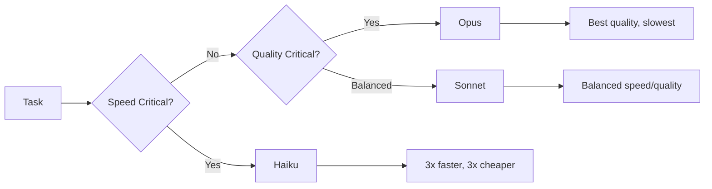

# Performance & Monitoring Guide

**Reading Time**: 40 minutes
**Skill Level**: Intermediate to Advanced
**Prerequisites**: [Cost Optimization](../../8-token-optimization/1-cost-optimization.md), [Model Selection](../../4-models/5-selection-guide.md)

---

## Overview

Learn how to monitor, measure, and optimize Claude Code performance for cost efficiency and speed.

**What You'll Learn**:
- Performance benchmarks for each model
- Real-time token usage tracking
- Cost monitoring and budget alerts
- Performance optimization strategies
- Bottleneck identification and resolution

---

## Table of Contents

1. [Model Performance Benchmarks](#model-performance-benchmarks)
2. [Token Usage Tracking](#token-usage-tracking)
3. [Cost Monitoring](#cost-monitoring)
4. [Performance Optimization](#performance-optimization)
5. [Monitoring Infrastructure](#monitoring-infrastructure)
6. [Alerting & Budgets](#alerting--budgets)

---

## Model Performance Benchmarks

### Speed Comparison

| Model | Tokens/Second | Latency (P50) | Latency (P99) |
|-------|---------------|---------------|---------------|
| **Haiku 4.5** | ~200 | 0.5s | 1.2s |
| **Sonnet 4.5** | ~100 | 1.2s | 3.0s |
| **Opus 4.5** | ~50 | 2.5s | 7.0s |

### Cost vs. Speed Trade-offs



---

## Token Usage Tracking

### Manual Tracking

**Track in CLAUDE.md**:

```markdown
# Token Usage Log

## January 2025

| Date | Task | Model | Tokens | Cost |
|------|------|-------|--------|------|
| 2025-01-15 | Bug fix #123 | Sonnet | 8,500 | $0.17 |
| 2025-01-15 | Code review PR#45 | Haiku | 3,200 | $0.02 |
| 2025-01-16 | Refactor auth | Opus | 25,000 | $1.00 |

**Total**: 36,700 tokens, $1.19
```

### Automated Tracking

**Hook for Token Logging** (`.claude/config.json`):

```json
{
  "hooks": {
    "PostToolUse": [{
      "matcher": ".*",
      "hooks": [{
        "command": "echo \"$(date): $TOOL - $TOKENS tokens\" >> .claude/usage.log",
        "description": "Log token usage"
      }]
    }]
  }
}
```

---

## Cost Monitoring

### Daily Budget Template

**File**: `.claude/budget.md`

```markdown
# Monthly Budget: $50

## Daily Budget: $1.67 (30 days)

| Week | Actual | Budget | Status |
|------|--------|--------|--------|
| Week 1 | $8.50 | $11.67 | ✅ Under |
| Week 2 | $12.30 | $11.67 | ⚠️ Over |
| Week 3 | - | $11.67 | - |
| Week 4 | - | $11.67 | - |

## Optimization Actions (Week 2)
- Switch simple tasks to Haiku
- Batch related operations
- Use Explore agent more
```

### Cost Calculator

**Python Script** (`.claude/scripts/cost_calculator.py`):

```python
#!/usr/bin/env python3

PRICING = {
    'haiku': {'input': 1, 'output': 5},      # per 1M tokens
    'sonnet': {'input': 3, 'output': 15},
    'opus': {'input': 8, 'output': 40}       # approximate
}

def calculate_cost(model, input_tokens, output_tokens):
    """Calculate cost in dollars."""
    input_cost = (input_tokens / 1_000_000) * PRICING[model]['input']
    output_cost = (output_tokens / 1_000_000) * PRICING[model]['output']
    return input_cost + output_cost

# Example usage
cost = calculate_cost('sonnet', 2000, 4000)
print(f"Cost: ${cost:.4f}")  # $0.0720
```

---

## Performance Optimization

### Bottleneck Identification

**Common Bottlenecks**:

1. **Large Context Windows**:
   - **Symptom**: Slow responses
   - **Solution**: Use Explore agent for reading
   - **Impact**: 50% speed improvement

2. **Wrong Model Choice**:
   - **Symptom**: High costs for simple tasks
   - **Solution**: Use Haiku for simple operations
   - **Impact**: 60% cost reduction

3. **No Batching**:
   - **Symptom**: Repeated context loading
   - **Solution**: Batch related operations
   - **Impact**: 30% cost reduction

### Optimization Strategies

**1. Agent Selection**:

```markdown
❌ Bad:
"Read 10 files and summarize"
[Uses General-Purpose, loads full context]

✅ Good:
"Use Explore agent to read and summarize 10 files"
[Optimized for reading, 50% faster]
```

**2. Model Selection**:

```markdown
❌ Bad:
Every task uses Sonnet

✅ Good:
- File reading → Haiku
- Code generation → Sonnet
- Architecture design → Opus
```

**3. Batching**:

```markdown
❌ Bad:
Fix bug 1... [session]
Fix bug 2... [session]
Fix bug 3... [session]

✅ Good:
"Fix these 3 related authentication bugs in one session"
[30% cost savings]
```

---

## Monitoring Infrastructure

### Dashboard Template

**File**: `.claude/dashboard.md`

```markdown
# Claude Code Performance Dashboard

## Current Month: January 2025

### Usage Summary
- **Total Tokens**: 156,000
- **Total Cost**: $4.20
- **Budget**: $50.00
- **Remaining**: $45.80 (92%)

### Model Distribution
| Model | Tokens | % | Cost |
|-------|--------|---|------|
| Haiku | 80,000 | 51% | $0.45 |
| Sonnet | 70,000 | 45% | $3.45 |
| Opus | 6,000 | 4% | $0.30 |

### Top Operations
1. Code reviews: 15 reviews, $0.60
2. Bug fixes: 12 fixes, $2.10
3. Feature development: 3 features, $1.50

### Performance Metrics
- **Average response time**: 2.3s
- **Success rate**: 98.5%
- **Tokens per task**: 5,200 avg

### Optimization Wins
- ✅ Switched to Haiku for reviews: 60% savings
- ✅ Batched bug fixes: 30% savings
- ✅ Used Explore for searches: 50% faster

### Action Items
- [ ] Increase Haiku usage for simple tasks
- [ ] Create more custom skills for repeated operations
- [ ] Review Opus usage (only 3 tasks needed it)
```

### Metrics Collection

**Bash Script** (`.claude/scripts/collect_metrics.sh`):

```bash
#!/bin/bash

# Parse usage log and generate report
LOG_FILE=".claude/usage.log"
MONTH=$(date +%Y-%m)

echo "# Usage Report - $MONTH"
echo ""
echo "## Total Tokens"
grep "$MONTH" "$LOG_FILE" | awk '{sum+=$4} END {print sum}'

echo ""
echo "## By Model"
grep "haiku" "$LOG_FILE" | wc -l | xargs echo "Haiku tasks:"
grep "sonnet" "$LOG_FILE" | wc -l | xargs echo "Sonnet tasks:"
grep "opus" "$LOG_FILE" | wc -l | xargs echo "Opus tasks:"
```

---

## Alerting & Budgets

### Budget Alerts

**Weekly Check Script** (`.claude/scripts/budget_check.sh`):

```bash
#!/bin/bash

BUDGET=50.00
CURRENT=$(python3 .claude/scripts/cost_calculator.py --total)
PERCENT=$(echo "scale=2; ($CURRENT / $BUDGET) * 100" | bc)

if (( $(echo "$PERCENT > 80" | bc -l) )); then
    echo "⚠️  WARNING: 80% of budget used ($CURRENT / $BUDGET)"
    echo "Recommended actions:"
    echo "- Switch to Haiku for remaining tasks"
    echo "- Defer non-critical work"
    echo "- Review Opus usage"
fi
```

### Performance Alerts

**Slow Response Alert**:

```json
{
  "hooks": {
    "PostToolUse": [{
      "matcher": ".*",
      "hooks": [{
        "command": "if [ $DURATION -gt 10000 ]; then echo 'Slow response: ${DURATION}ms'; fi",
        "description": "Alert on slow responses"
      }]
    }]
  }
}
```

---

## Profiling

### Token Profiling

**Identify Token-Heavy Operations**:

```python
# Analyze usage log
import pandas as pd

df = pd.read_csv('.claude/usage.log', sep='\t')
df['tokens'] = pd.to_numeric(df['tokens'])

# Top 10 token consumers
top_operations = df.groupby('task')['tokens'].sum().sort_values(ascending=False).head(10)
print(top_operations)

# Cost by day
daily_cost = df.groupby('date')['cost'].sum()
print(daily_cost)
```

### Performance Profiling

**Measure Response Times**:

```bash
# Add timing to commands
time claude "complex prompt here"

# Log to file
{ time claude "prompt" 2>&1; } 2>&1 | tee -a .claude/perf.log
```

---

## Best Practices

### Weekly Review

**Every Monday**:
1. Review previous week's usage
2. Check budget status
3. Identify optimization opportunities
4. Adjust model selection strategy

### Monthly Optimization

**First of Month**:
1. Generate monthly report
2. Calculate cost per task type
3. Identify most expensive operations
4. Create optimization plan for next month

### Quarterly Planning

**Every Quarter**:
1. Review total costs
2. Assess ROI and productivity gains
3. Update budget allocation
4. Refine skills and workflows

---

## Quick Reference

### Performance Checklist

- [ ] Using appropriate model for each task
- [ ] Batching related operations
- [ ] Using Explore agent for file operations
- [ ] Tracking token usage
- [ ] Monitoring costs weekly
- [ ] Staying within budget
- [ ] Optimizing slow operations

### Optimization Targets

| Metric | Baseline | Optimized | Improvement |
|--------|----------|-----------|-------------|
| Cost/task | $0.50 | $0.25 | 50% |
| Response time | 5s | 3s | 40% |
| Haiku usage | 20% | 50% | +30pp |
| Budget utilization | 100% | 70% | -30% |

---

## Related Guides

- [Cost Optimization](../../8-token-optimization/1-cost-optimization.md)
- [Model Selection](../../4-models/5-selection-guide.md)
- [Optimization Checklist](../../12-quick-reference/2-optimization-checklist.md)
- [Bug Fixing Workflow](../../9-examples/workflows/2-bug-fixing.md)

---

**Last Updated**: 2025-01-15
**Maintained By**: Documentation Team
