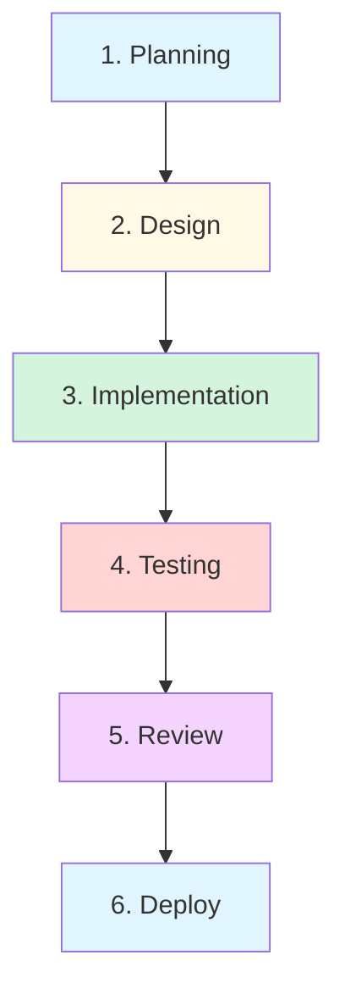

# Feature Development Workflow

Complete workflow for developing new features with Claude Code.

---

## Workflow Overview



---

## Phase 1: Planning (5-10 min)

**Goal**: Define feature requirements and approach

**Commands**:
```bash
# Create feature branch
git checkout -b feature/user-authentication

# Document feature in CLAUDE.md
claude "Add feature context: User authentication with JWT"

# Generate feature plan
claude --model=sonnet "Think through implementation plan for user auth"
```

**Deliverables**:
- Feature branch created
- Requirements documented
- Implementation plan

---

## Phase 2: Design (10-20 min)

**Goal**: Design API, data models, components

**Commands**:
```bash
# Design API endpoints
claude "/api-design user authentication endpoints"

# Design database schema
claude "Design user schema with Prisma"

# Create API spec
claude "Generate OpenAPI spec for auth endpoints"
```

**Deliverables**:
- API specification
- Database schema
- Component designs

---

## Phase 3: Implementation (30-90 min)

**Goal**: Build the feature

### Backend

```bash
# Generate API endpoint
/endpoint User POST

# Generate service logic
claude "Implement JWT token generation in userService"

# Add validation
claude "Add Zod validation for user registration"
```

### Frontend

```bash
# Generate component
/component LoginForm

# Add form handling
claude "Add React Hook Form to LoginForm"

# Integrate API
claude "Connect LoginForm to auth API"
```

**Deliverables**:
- Working backend endpoints
- Frontend components
- Integration complete

---

## Phase 4: Testing (20-40 min)

**Goal**: Comprehensive test coverage

```bash
# Generate tests
/test src/services/userService.ts
/test src/components/LoginForm.tsx

# Run tests
npm test

# Check coverage
npm run coverage
# Target: 80%+
```

**Deliverables**:
- Unit tests passing
- Integration tests passing
- 80%+ coverage

---

## Phase 5: Review (15-30 min)

**Goal**: Code quality and security

```bash
# Quick review
/review

# Deep review for critical code
/review --deep src/services/userService.ts

# Security audit
/security-audit --focus=auth
```

**Deliverables**:
- Code reviewed
- Security validated
- Issues fixed

---

## Phase 6: Deploy (10-20 min)

**Goal**: Ship to production

```bash
# Pre-deployment checks
/pr-ready

# Create PR
/pr "Add user authentication"

# Deploy to staging
/deploy staging

# Run smoke tests
/smoke-test staging

# Deploy to production
/deploy production
```

**Deliverables**:
- PR created
- Staging deployed
- Production deployed

---

## Complete Example

**Feature**: Add user profile editing

```bash
# 1. Planning
git checkout -b feature/profile-editing
claude "Plan implementation: user profile editing"

# 2. Design  
/api-design profile PUT /api/users/:id

# 3. Implementation
# Backend
/endpoint User PUT
claude "Add profile validation with Zod"

# Frontend
/component ProfileForm
claude "Add form fields: name, email, bio"

# 4. Testing
/test src/services/userService.ts
/test src/components/ProfileForm.tsx
npm test

# 5. Review
/review --deep

# 6. Deploy
/pr-ready
git add .
git commit -m "feat(profile): add user profile editing"
git push
/pr "Add user profile editing"
```

---

## Time Estimates

| Phase | Time | Claude Cost |
|-------|------|-------------|
| Planning | 10 min | $0.10 |
| Design | 20 min | $0.30 |
| Implementation | 60 min | $2.50 |
| Testing | 30 min | $1.20 |
| Review | 20 min | $0.40 |
| Deploy | 15 min | $0.20 |
| **Total** | **2h 35min** | **$4.70** |

**Without Claude**: 4-6 hours
**Time Saved**: 1.5-3.5 hours
**ROI**: 200-300%

---

**Next**: [Bug Fix Workflow](2-bug-fixing.md)
