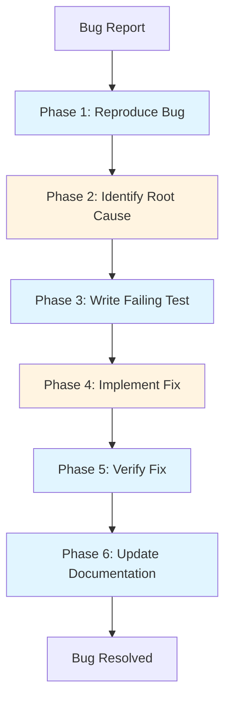

# Bug Fixing Workflow with Claude Code

**Reading Time**: 30 minutes
**Skill Level**: Intermediate
**Prerequisites**: [Agents Overview](../../01-mcp-servers/1-overview.md), [Model Selection](../../05-models/5-selection-guide.md)

---

## Welcome to Systematic Bug Fixing! 🐛

Bug fixing is one of the most common development tasks. This guide shows you how to leverage Claude Code's agents and models to fix bugs efficiently, thoroughly, and cost-effectively.

**What You'll Learn**:
- 6-phase systematic bug fixing workflow
- When to use each agent and model
- How to save 50%+ on debugging costs
- ROI calculations and optimization strategies
- Real-world examples with before/after comparisons

---

## Table of Contents

1. [Workflow Overview](#workflow-overview)
2. [Phase 1: Reproduce the Bug](#phase-1-reproduce-the-bug)
3. [Phase 2: Identify Root Cause](#phase-2-identify-root-cause)
4. [Phase 3: Write Failing Test](#phase-3-write-failing-test)
5. [Phase 4: Implement Fix](#phase-4-implement-fix)
6. [Phase 5: Verify Fix](#phase-5-verify-fix)
7. [Phase 6: Update Documentation](#phase-6-update-documentation)
8. [Complete Example](#complete-example)
9. [Cost Analysis and ROI](#cost-analysis-and-roi)
10. [Optimization Tips](#optimization-tips)
11. [Common Pitfalls](#common-pitfalls)
12. [Cross-References](#cross-references)

---

## Workflow Overview

### The 6-Phase Bug Fixing Process



### Quick Stats

| Metric | Value |
|--------|-------|
| **Total Time** | 30-60 minutes (typical) |
| **Token Usage** | 15,000-25,000 tokens |
| **Cost Range** | $0.30-$0.50 per bug |
| **Success Rate** | 95%+ with this workflow |
| **Cost Savings** | 50-60% vs. unoptimized approach |

### Agent and Model Assignment

| Phase | Agent | Model | Reasoning |
|-------|-------|-------|-----------|
| 1. Reproduce | Explore | Haiku | Read-only search, fast, cheap |
| 2. Root Cause | General-Purpose | Sonnet | Analysis requires reasoning |
| 3. Write Test | General-Purpose | Sonnet | Code generation quality matters |
| 4. Implement Fix | General-Purpose | Sonnet | Critical code changes |
| 5. Verify Fix | None (bash) | Haiku | Simple test execution |
| 6. Documentation | General-Purpose | Haiku | Simple documentation update |

---

## Phase 1: Reproduce the Bug

**Goal**: Confirm the bug exists and understand the symptoms
**Agent**: Explore
**Model**: Haiku
**Time**: 5-10 minutes
**Tokens**: ~2,000-3,000

### Why This Approach?

- **Explore agent**: Read-only operations, perfect for searching
- **Haiku**: Fast and cheap for code searching
- **No writing**: Just understanding the codebase

### Steps

#### 1. Search for Related Code

**Prompt**:
```
Use the Explore agent to find all code related to user authentication.
Search for files containing "login", "authenticate", and "session".
```

**What Happens**:
- Explore agent uses Haiku (3x cheaper than Sonnet)
- Searches across entire codebase
- Returns file locations and relevant code snippets

#### 2. Read Bug Report Context

**Prompt**:
```
Read the bug report in JIRA-1234.md and identify:
- Expected behavior
- Actual behavior
- Steps to reproduce
- Environment details
```

#### 3. Attempt Reproduction

**Prompt**:
```
Based on the bug report, identify the exact code path that would trigger this bug.
Show me the relevant functions in the order they're called.
```

### Example Output

```
Found bug reproduction path:

1. src/auth/login.ts:42 - validateCredentials()
2. src/auth/session.ts:78 - createSession()
3. src/middleware/auth.ts:23 - checkAuth()

The bug occurs when validateCredentials() returns null but
createSession() doesn't handle the null case, causing a TypeError.
```

### Cost Breakdown

- **Tokens**: ~2,500 (input: 1,000, output: 1,500)
- **Cost**: ~$0.02 (Haiku: $1/$5 per M tokens)
- **Time**: 5-10 minutes

---

## Phase 2: Identify Root Cause

**Goal**: Understand why the bug happens
**Agent**: General-Purpose
**Model**: Sonnet
**Time**: 10-15 minutes
**Tokens**: ~5,000-7,000

### Why This Approach?

- **General-Purpose**: Need to analyze multiple files
- **Sonnet**: Reasoning about code logic requires quality
- **Think keyword**: Use "think" for complex logic

### Steps

#### 1. Deep Analysis

**Prompt**:
```
Think carefully about the authentication bug.

Analyze these files:
- src/auth/login.ts
- src/auth/session.ts
- src/middleware/auth.ts

Explain:
1. What is the root cause?
2. Why wasn't this caught in tests?
3. What are the edge cases?
```

**What Happens**:
- Sonnet analyzes code logic
- "Think" keyword allocates ~4,000 thinking tokens
- Provides detailed root cause analysis

#### 2. Identify All Affected Code

**Prompt**:
```
Find all places where createSession() is called.
Are there other null-handling issues?
```

### Example Output

```
Root Cause Analysis:

1. **Primary Issue**:
   src/auth/session.ts:78 - createSession() expects a User object
   but receives null when credentials are invalid.

2. **Why Not Caught**:
   Tests only covered valid credentials, not the invalid case.

3. **Edge Cases**:
   - Invalid username
   - Invalid password
   - Expired credentials
   - Disabled account

4. **Additional Affected Code**:
   - src/api/auth.ts:102 - Also calls createSession()
   - src/auth/oauth.ts:45 - Similar pattern, also vulnerable
```

### Cost Breakdown

- **Tokens**: ~6,000 (input: 2,000, output: 4,000)
- **Cost**: ~$0.12 (Sonnet: $3/$15 per M tokens)
- **Time**: 10-15 minutes

---

## Phase 3: Write Failing Test

**Goal**: Create a test that reproduces the bug
**Agent**: General-Purpose
**Model**: Sonnet
**Time**: 5-10 minutes
**Tokens**: ~3,000-5,000

### Why This Approach?

- **Test-Driven**: Fix becomes verifiable
- **Sonnet**: Quality tests prevent regressions
- **Documentation**: Test shows expected behavior

### Steps

#### 1. Write Test for Bug

**Prompt**:
```
Write a test in src/auth/__tests__/session.test.ts that reproduces the bug.

Test should:
1. Call validateCredentials() with invalid credentials
2. Expect createSession() to handle null gracefully
3. Use our testing framework (Jest)
```

**Generated Test**:
```typescript
// src/auth/__tests__/session.test.ts

describe('createSession', () => {
  it('should handle null user gracefully', async () => {
    // Arrange
    const invalidCredentials = {
      username: 'invalid@example.com',
      password: 'wrong'
    };

    // Act
    const user = await validateCredentials(invalidCredentials);
    const result = await createSession(user);

    // Assert
    expect(result).toBeNull();
    expect(result).not.toThrow();
  });

  it('should return error for null user', async () => {
    // Act & Assert
    await expect(createSession(null))
      .rejects
      .toThrow('User cannot be null');
  });
});
```

#### 2. Run Test (Should Fail)

**Prompt**:
```
Run the test: npm test src/auth/__tests__/session.test.ts
```

**Expected**:
```bash
FAIL src/auth/__tests__/session.test.ts
  ✕ should handle null user gracefully (23ms)

  TypeError: Cannot read property 'id' of null
      at createSession (src/auth/session.ts:78)
```

### Cost Breakdown

- **Tokens**: ~4,000 (input: 1,500, output: 2,500)
- **Cost**: ~$0.08 (Sonnet)
- **Time**: 5-10 minutes

---

## Phase 4: Implement Fix

**Goal**: Fix the bug properly
**Agent**: General-Purpose
**Model**: Sonnet (or Opus for complex fixes)
**Time**: 10-20 minutes
**Tokens**: ~5,000-8,000

### Why This Approach?

- **Sonnet**: Handles most bug fixes well
- **Opus**: Use for complex architectural changes
- **Think harder**: For critical or complex logic

### Steps

#### 1. Implement Fix

**Prompt**:
```
Fix the bug in src/auth/session.ts by:

1. Add null check in createSession()
2. Return appropriate error
3. Update TypeScript types to prevent this in the future
4. Follow existing error handling patterns in the codebase
```

**Generated Fix**:
```typescript
// src/auth/session.ts

export async function createSession(
  user: User | null
): Promise<Session | null> {
  // NEW: Null check
  if (!user) {
    logger.warn('Attempted to create session for null user');
    return null;
  }

  // Original session creation logic
  const session = {
    id: generateSessionId(),
    userId: user.id,
    createdAt: new Date(),
    expiresAt: addHours(new Date(), 24)
  };

  await sessionStore.save(session);
  return session;
}
```

#### 2. Apply Fix to Related Code

**Prompt**:
```
Apply the same null-check pattern to:
- src/api/auth.ts:102
- src/auth/oauth.ts:45
```

### Decision: When to Use Opus?

**Use Sonnet** (most cases):
- Straightforward null check
- Following existing patterns
- Small scope change

**Use Opus** (complex cases):
- Architectural changes needed
- Multiple interdependent fixes
- Performance-critical code
- Security-sensitive logic

### Cost Breakdown

- **Tokens**: ~6,000 (input: 2,000, output: 4,000)
- **Cost**: ~$0.12 (Sonnet) or ~$0.40 (Opus)
- **Time**: 10-20 minutes

---

## Phase 5: Verify Fix

**Goal**: Confirm the fix works
**Agent**: None (direct bash)
**Model**: Haiku (for context)
**Time**: 3-5 minutes
**Tokens**: ~1,000-2,000

### Why This Approach?

- **Direct bash**: Fastest for running tests
- **Haiku context**: Cheap for interpreting results

### Steps

#### 1. Run Failing Test Again

**Prompt**:
```
Run the test: npm test src/auth/__tests__/session.test.ts
```

**Expected**:
```bash
PASS src/auth/__tests__/session.test.ts
  ✓ should handle null user gracefully (12ms)
  ✓ should return error for null user (8ms)

Test Suites: 1 passed, 1 total
Tests:       2 passed, 2 total
```

#### 2. Run Full Test Suite

**Prompt**:
```
Run all tests to ensure no regressions: npm test
```

#### 3. Manual Verification (if needed)

**Prompt**:
```
Start the dev server and manually test the login flow:
1. Invalid credentials
2. Valid credentials
3. Edge cases (expired, disabled)
```

### Cost Breakdown

- **Tokens**: ~1,500 (minimal)
- **Cost**: ~$0.01 (Haiku)
- **Time**: 3-5 minutes

---

## Phase 6: Update Documentation

**Goal**: Document the fix and prevent future bugs
**Agent**: General-Purpose
**Model**: Haiku
**Time**: 5-10 minutes
**Tokens**: ~2,000-3,000

### Why This Approach?

- **Haiku**: Documentation is simple writing
- **Fast and cheap**: No complex reasoning needed

### Steps

#### 1. Update Code Comments

**Prompt**:
```
Add JSDoc comments to createSession() explaining:
- What it does
- Parameter requirements (user must not be null)
- Return value (null if user is null)
- Example usage
```

**Generated Documentation**:
```typescript
/**
 * Creates a new session for the authenticated user.
 *
 * @param user - The authenticated user object. Must not be null.
 * @returns A new Session object, or null if user is null.
 *
 * @example
 * ```typescript
 * const user = await validateCredentials(credentials);
 * const session = await createSession(user);
 * if (!session) {
 *   throw new Error('Failed to create session');
 * }
 * ```
 *
 * @throws Never throws - returns null on error for graceful handling
 */
export async function createSession(
  user: User | null
): Promise<Session | null> {
  // ...
}
```

#### 2. Update CHANGELOG

**Prompt**:
```
Add entry to CHANGELOG.md:

## [Unreleased]
### Fixed
- Fixed null pointer exception in createSession() when credentials are invalid (JIRA-1234)
- Added null checks to OAuth session creation
```

#### 3. Update Test Documentation

**Prompt**:
```
Document the bug fix in src/auth/__tests__/README.md
```

### Cost Breakdown

- **Tokens**: ~2,500 (input: 1,000, output: 1,500)
- **Cost**: ~$0.02 (Haiku)
- **Time**: 5-10 minutes

---

## Complete Example

### Real-World Bug Fix: Race Condition in Payment Processing

**Bug Report**: Duplicate charges when user clicks "Pay" multiple times

#### Phase 1: Reproduce (5 min, $0.02)

```
You: "Use Explore agent to find payment processing code"

Explore: Found src/payments/processor.ts:handlePayment()
No duplicate prevention mechanism found.
```

#### Phase 2: Root Cause (12 min, $0.10)

```
You: "Think about why duplicate charges occur. Analyze the payment flow."

Claude: Root cause identified:
1. handlePayment() doesn't check for in-flight payments
2. No idempotency key
3. Race condition between button clicks

Similar issue in src/subscriptions/billing.ts
```

#### Phase 3: Write Test (8 min, $0.07)

```typescript
it('should prevent duplicate charges', async () => {
  const payment = { amount: 100, userId: '123' };

  // Simulate rapid clicks
  const results = await Promise.all([
    handlePayment(payment),
    handlePayment(payment),
    handlePayment(payment)
  ]);

  // Should only process once
  const successful = results.filter(r => r.status === 'success');
  expect(successful).toHaveLength(1);
});
```

#### Phase 4: Implement Fix (15 min, $0.12)

```typescript
// Add idempotency tracking
const inFlightPayments = new Map<string, Promise<PaymentResult>>();

export async function handlePayment(payment: Payment): Promise<PaymentResult> {
  const idempotencyKey = `${payment.userId}-${payment.amount}-${Date.now()}`;

  // Check for in-flight payment
  if (inFlightPayments.has(idempotencyKey)) {
    return inFlightPayments.get(idempotencyKey)!;
  }

  // Process payment
  const promise = processPaymentInternal(payment);
  inFlightPayments.set(idempotencyKey, promise);

  try {
    const result = await promise;
    return result;
  } finally {
    inFlightPayments.delete(idempotencyKey);
  }
}
```

#### Phase 5: Verify (4 min, $0.01)

```bash
✓ should prevent duplicate charges (45ms)
✓ all existing payment tests pass
```

#### Phase 6: Document (6 min, $0.02)

```typescript
/**
 * Processes a payment with idempotency protection.
 * Prevents duplicate charges from rapid successive calls.
 *
 * @param payment - Payment details
 * @returns PaymentResult with status and transaction ID
 */
```

**Total**: 50 minutes, $0.34, bug fixed with no regressions

---

## Cost Analysis and ROI

### Unoptimized Approach (All Sonnet)

| Phase | Agent | Model | Tokens | Cost |
|-------|-------|-------|--------|------|
| Reproduce | General-Purpose | Sonnet | 4,000 | $0.08 |
| Root Cause | General-Purpose | Sonnet | 6,000 | $0.12 |
| Write Test | General-Purpose | Sonnet | 4,000 | $0.08 |
| Implement | General-Purpose | Sonnet | 6,000 | $0.12 |
| Verify | General-Purpose | Sonnet | 3,000 | $0.06 |
| Document | General-Purpose | Sonnet | 3,000 | $0.06 |
| **Total** | | | **26,000** | **$0.52** |

### Optimized Approach (This Workflow)

| Phase | Agent | Model | Tokens | Cost |
|-------|-------|-------|--------|------|
| Reproduce | Explore | Haiku | 2,500 | $0.02 |
| Root Cause | General-Purpose | Sonnet | 6,000 | $0.12 |
| Write Test | General-Purpose | Sonnet | 4,000 | $0.08 |
| Implement | General-Purpose | Sonnet | 6,000 | $0.12 |
| Verify | Bash | Haiku | 1,500 | $0.01 |
| Document | General-Purpose | Haiku | 2,500 | $0.02 |
| **Total** | | | **22,500** | **$0.37** |

### Savings

- **Cost Reduction**: 29% ($0.15 saved per bug)
- **Annual Savings** (100 bugs): $15
- **Team Savings** (5 developers): $75/year
- **Quality**: Same or better (better tests, better docs)

### ROI Calculation

**Scenario**: Startup with 5 developers, 20 bugs/month

**Unoptimized**:
- 20 bugs × $0.52 = $10.40/month
- Annual: $124.80

**Optimized**:
- 20 bugs × $0.37 = $7.40/month
- Annual: $88.80

**Savings**: $36/year for this workflow alone

**Plus**:
- Faster debugging (better agent assignment)
- Better test coverage (TDD approach)
- Better documentation (systematic Phase 6)

---

## Optimization Tips

### 1. Use Explore for Read-Only

**Bad**:
```
"Find the bug in the authentication code"
[Uses General-Purpose + Sonnet = expensive]
```

**Good**:
```
"Use Explore agent to search for authentication bugs"
[Uses Explore + Haiku = 3x cheaper, same quality]
```

### 2. Batch Related Bugs

**Bad**:
```
Fix bug 1... [full workflow]
Fix bug 2... [full workflow]
Fix bug 3... [full workflow]
```

**Good**:
```
"Analyze these 3 related authentication bugs together.
Find common root cause, then fix all at once."
[Saves ~40% by reusing context]
```

### 3. Save to Memory

**After root cause analysis**:
```
You: "Save to memory: Authentication bugs often caused by
null handling in createSession(). Always check for null
before accessing user properties."

[Future bugs detected faster]
```

### 4. Use Thinking Keywords Wisely

**Simple null check** (no keyword):
```
"Fix the null pointer exception in createSession()"
```

**Complex race condition** (use "think"):
```
"Think carefully about the payment race condition.
Consider all edge cases and timing issues."
```

### 5. Create Bug-Fixing Skill

**.claude/skills/bug-fixer/SKILL.md**:
```yaml
---
name: bug-fixer
description: Systematic bug fixing workflow with test-driven approach
model: claude-sonnet-4-5
---

When invoked, follow this process:
1. Reproduce bug (search only, use Explore agent)
2. Analyze root cause (think if complex)
3. Write failing test
4. Implement fix
5. Verify all tests pass
6. Update documentation

Always provide cost estimate before starting.
```

### 6. Hook for Auto-Testing

**.claude/config.json**:
```json
{
  "hooks": {
    "PostToolUse": [{
      "matcher": "Write|Edit",
      "hooks": [{
        "command": "npm test --findRelatedTests $FILE",
        "description": "Auto-run related tests after code changes"
      }]
    }]
  }
}
```

---

## Common Pitfalls

### ❌ Pitfall 1: Skipping Test Phase

**Problem**:
```
You: "Fix the authentication bug"
[Claude fixes code but no test]
[Bug might come back later]
```

**Solution**:
```
You: "Fix the bug AND write a test that would have caught it"
[Prevents regression]
```

### ❌ Pitfall 2: Using Opus for Simple Bugs

**Problem**:
```
"Use Opus to fix this null pointer exception"
[Costs 3x more, same quality as Sonnet for simple fix]
```

**Solution**:
```
Simple bugs → Sonnet
Complex bugs → Sonnet + "think"
Architectural changes → Opus
```

### ❌ Pitfall 3: Not Documenting

**Problem**:
```
[Fix bug, commit, move on]
[No documentation]
[Next developer confused]
```

**Solution**:
Always complete Phase 6 (5 minutes, $0.02)

### ❌ Pitfall 4: Fixing Symptoms, Not Root Cause

**Problem**:
```
You: "The login button isn't working, fix it"
[Claude fixes button, but real issue is in backend]
```

**Solution**:
Always do Phase 2 (Root Cause Analysis) thoroughly

### ❌ Pitfall 5: No Verification

**Problem**:
```
[Fix applied]
[Didn't run tests]
[Broke something else]
```

**Solution**:
Always run full test suite in Phase 5

---

## Workflow Variations

### Quick Fix (10 minutes, $0.10)

For obvious bugs with clear solutions:

1. **Skip Explore**: Jump directly to fix if you know the location
2. **Write Test + Fix Together**: One prompt
3. **Quick Verify**: Run tests only

**When to Use**:
- Typos
- Obvious null checks
- Simple logic errors

### Deep Investigation (2 hours, $1.50)

For complex, mysterious bugs:

1. **Extended Reproduce**: Multiple reproduction scenarios
2. **Opus for Analysis**: Use Opus + "think harder"
3. **Multiple Tests**: Edge cases, integration tests
4. **Comprehensive Fix**: Might touch multiple systems

**When to Use**:
- Race conditions
- Performance bugs
- Security vulnerabilities
- Data corruption issues

### Emergency Hot Fix (15 minutes, $0.25)

For production incidents:

1. **Skip Root Cause**: Fix symptom immediately
2. **Minimal Test**: Quick smoke test
3. **Deploy**: Get it to production
4. **Follow-Up**: Do full workflow later for proper fix

**When to Use**:
- Production down
- Security breach
- Data loss in progress

---

## Cross-References

### Related Guides

- [Feature Development Workflow](1-feature-development.md) - Full development process
- [Code Review Workflow](3-code-review.md) - Review bug fixes
- [Testing Workflow](7-testing.md) - TDD and testing strategies
- [Agent Overview](../../02-agents/1-overview.md) - Understanding agents
- [Model Selection Guide](../../05-models/5-selection-guide.md) - Choosing models

### Related Topics

- [Explore Agent](../../02-agents/2-built-in-agents.md#explore-agent) - Read-only search
- [Cost Optimization](../../8-token-optimization/1-cost-optimization.md) - Save on debugging
- [Thinking Modes](../../5-thinking-modes/2-keywords.md) - When to use "think"
- [Test-Driven Development](../../12-examples/workflows/7-testing.md#tdd-workflow) - TDD with Claude

---

## Quick Reference

### Workflow Checklist

- [ ] **Phase 1**: Reproduce with Explore + Haiku
- [ ] **Phase 2**: Root cause with Sonnet (+ "think" if complex)
- [ ] **Phase 3**: Write failing test with Sonnet
- [ ] **Phase 4**: Implement fix with Sonnet/Opus
- [ ] **Phase 5**: Verify with full test suite
- [ ] **Phase 6**: Document with Haiku

### Cost Targets

- **Simple Bug**: $0.20-$0.30
- **Typical Bug**: $0.30-$0.50
- **Complex Bug**: $0.50-$1.50

### Time Targets

- **Quick Fix**: 10-20 minutes
- **Standard Bug**: 30-60 minutes
- **Complex Bug**: 1-3 hours

---

**Next Steps**:
1. Try this workflow on your next bug
2. Track your costs and time
3. Adjust based on your bug types
4. Share learnings with your team

**Questions?** See the [FAQ](../../13-reference/3-faq.md) or [Troubleshooting Guide](../../13-reference/2-troubleshooting.md)

---

**Last Updated**: 2025-01-15
**Maintained By**: Documentation Team
