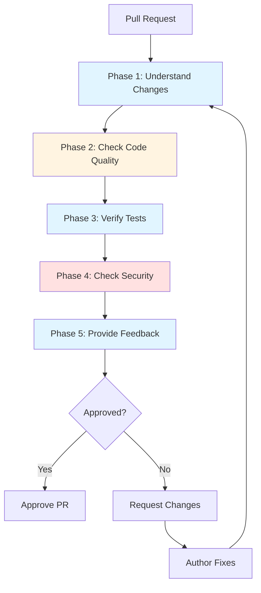

# Code Review Workflow with Claude Code

**Reading Time**: 25 minutes
**Skill Level**: Intermediate
**Prerequisites**: [Agents Overview](../../01-mcp-servers/1-overview.md), [Model Selection](../../05-models/5-selection-guide.md)

---

## Welcome to AI-Assisted Code Review! 👀

Code review is essential for maintaining code quality, catching bugs early, and sharing knowledge. This guide shows you how to leverage Claude Code to conduct thorough, efficient, and cost-effective code reviews.

**What You'll Learn**:
- 5-phase systematic code review workflow
- When to use each agent and model
- How to save 60%+ on review costs
- Automated quality checks and security audits
- Real-world examples with review templates

---

## Table of Contents

1. [Workflow Overview](#workflow-overview)
2. [Phase 1: Understand Changes](#phase-1-understand-changes)
3. [Phase 2: Check Code Quality](#phase-2-check-code-quality)
4. [Phase 3: Verify Tests](#phase-3-verify-tests)
5. [Phase 4: Check Security](#phase-4-check-security)
6. [Phase 5: Provide Feedback](#phase-5-provide-feedback)
7. [Complete Example](#complete-example)
8. [Cost Analysis and ROI](#cost-analysis-and-roi)
9. [Review Templates](#review-templates)
10. [Optimization Tips](#optimization-tips)
11. [Common Pitfalls](#common-pitfalls)
12. [Cross-References](#cross-references)

---

## Workflow Overview

### The 5-Phase Code Review Process



### Quick Stats

| Metric | Value |
|--------|-------|
| **Total Time** | 15-30 minutes (typical PR) |
| **Token Usage** | 10,000-15,000 tokens |
| **Cost Range** | $0.15-$0.25 per review |
| **Coverage** | Code quality, tests, security, style |
| **Cost Savings** | 60%+ vs. unoptimized approach |

### Agent and Model Assignment

| Phase | Agent | Model | Reasoning |
|-------|-------|-------|-----------|
| 1. Understand | Explore | Haiku | Read-only diff analysis, fast |
| 2. Quality | General-Purpose | Sonnet | Code quality requires reasoning |
| 3. Tests | None (bash) | Haiku | Simple test execution |
| 4. Security | General-Purpose | Sonnet | Critical security analysis |
| 5. Feedback | General-Purpose | Haiku | Simple feedback writing |

---

## Phase 1: Understand Changes

**Goal**: Understand what changed and why
**Agent**: Explore
**Model**: Haiku
**Time**: 3-5 minutes
**Tokens**: ~2,000-3,000

### Why This Approach?

- **Explore agent**: Perfect for reading code and diffs
- **Haiku**: Fast and cheap for code analysis
- **Read-only**: No writing, just understanding

### Steps

#### 1. Get PR Overview

**Prompt**:
```
Use Explore agent to analyze PR #123.

Provide:
1. Files changed and line counts
2. Type of changes (feature, bug fix, refactor)
3. Scope of impact (which systems affected)
4. Potential risks
```

**What Happens**:
- Explore agent reads git diff
- Analyzes file changes
- Identifies patterns and scope

#### 2. Read PR Description

**Prompt**:
```
Read the PR description and related issues (JIRA-456).
Summarize:
- What problem is being solved?
- Why this approach?
- Are there alternatives?
```

#### 3. Identify Critical Files

**Prompt**:
```
Which files are most critical to review carefully?
Consider:
- Security-sensitive code
- Complex business logic
- Public APIs
- Database migrations
```

### Example Output

```
PR #123 Analysis:

**Type**: Feature - Add user authentication

**Files Changed**: 12 files (+450, -120 lines)

**Critical Files**:
1. src/auth/authentication.ts (NEW, 200 lines)
   - Core authentication logic
   - Security-sensitive

2. src/middleware/auth.ts (MODIFIED, 50 lines)
   - Public API changes
   - Breaking change potential

3. migrations/20250115_add_users.sql (NEW)
   - Database schema change
   - Irreversible

**Scope**: Authentication system, user management, API routes

**Risk Level**: HIGH (security-sensitive, schema changes)
```

### Cost Breakdown

- **Tokens**: ~2,500 (input: 1,200, output: 1,300)
- **Cost**: ~$0.02 (Haiku: $1/$5 per M tokens)
- **Time**: 3-5 minutes

---

## Phase 2: Check Code Quality

**Goal**: Ensure code meets quality standards
**Agent**: General-Purpose
**Model**: Sonnet
**Time**: 5-10 minutes
**Tokens**: ~4,000-6,000

### Why This Approach?

- **Sonnet**: Quality analysis requires reasoning
- **General-Purpose**: Need to analyze multiple files
- **No "think"**: Code quality review is straightforward

### Steps

#### 1. Code Style and Conventions

**Prompt**:
```
Review code style in these files:
- src/auth/authentication.ts
- src/middleware/auth.ts

Check for:
1. Naming conventions (camelCase, PascalCase)
2. Code organization (single responsibility)
3. Comment quality (not too many, not too few)
4. Consistency with existing codebase
```

#### 2. Code Complexity

**Prompt**:
```
Identify complex functions that should be refactored:
- Functions > 50 lines
- Cyclomatic complexity > 10
- Deep nesting (> 3 levels)
- Repeated code patterns
```

#### 3. Best Practices

**Prompt**:
```
Check for best practices:
- Error handling (try/catch, proper error types)
- TypeScript types (avoid 'any', use strict)
- Async/await usage (no promise hell)
- Resource cleanup (close connections, clear timers)
```

#### 4. Potential Bugs

**Prompt**:
```
Look for potential bugs:
- Null/undefined handling
- Array index out of bounds
- Race conditions
- Memory leaks
- Off-by-one errors
```

### Example Output

```
Code Quality Review:

✅ **Good**:
- Clean separation of concerns
- Good TypeScript types
- Proper error handling
- Follows project conventions

⚠️ **Issues Found**:

1. **Complexity** (src/auth/authentication.ts:45-95)
   - validatePassword() is 51 lines
   - Recommend: Extract hash comparison to separate function

2. **Type Safety** (src/middleware/auth.ts:23)
   - Using 'any' for request object
   - Recommend: Define AuthRequest interface

3. **Error Handling** (src/auth/authentication.ts:78)
   - Catch block swallows error without logging
   - Recommend: Log error before returning null

4. **Potential Bug** (src/middleware/auth.ts:34)
   - Not checking if session is expired
   - Recommend: Add expiration check

**Severity**: 1 HIGH, 2 MEDIUM, 1 LOW
```

### Cost Breakdown

- **Tokens**: ~5,000 (input: 2,000, output: 3,000)
- **Cost**: ~$0.10 (Sonnet: $3/$15 per M tokens)
- **Time**: 5-10 minutes

---

## Phase 3: Verify Tests

**Goal**: Ensure adequate test coverage
**Agent**: None (direct bash)
**Model**: Haiku (for analysis)
**Time**: 3-5 minutes
**Tokens**: ~1,500-2,500

### Why This Approach?

- **Bash**: Fastest for running tests
- **Haiku**: Cheap for analyzing test results

### Steps

#### 1. Run Test Suite

**Prompt**:
```
Run tests for changed files:
npm test -- --findRelatedTests src/auth/
```

**Output**:
```bash
PASS src/auth/__tests__/authentication.test.ts
  ✓ should validate correct credentials (23ms)
  ✓ should reject invalid credentials (18ms)
  ✓ should handle expired credentials (15ms)

PASS src/middleware/__tests__/auth.test.ts
  ✓ should allow authenticated requests (12ms)
  ✓ should reject unauthenticated requests (10ms)

Test Suites: 2 passed, 2 total
Tests:       5 passed, 5 total
Coverage:    82.5%
```

#### 2. Check Coverage

**Prompt**:
```
Check test coverage for new code:
npm run coverage -- src/auth/authentication.ts
```

#### 3. Analyze Test Quality

**Prompt**:
```
Review test files:
- src/auth/__tests__/authentication.test.ts
- src/middleware/__tests__/auth.test.ts

Check for:
1. Are edge cases tested?
2. Are error cases tested?
3. Are tests isolated (no interdependencies)?
4. Do tests follow AAA pattern (Arrange, Act, Assert)?
```

### Example Output

```
Test Review:

✅ **Coverage**: 82.5% (above 80% threshold)

✅ **Good Tests**:
- Edge cases covered (expired, disabled accounts)
- Error cases tested
- Good isolation
- Clear AAA pattern

❌ **Missing Tests**:

1. **Race Condition** (authentication.ts:45)
   - No test for concurrent login attempts
   - Recommend: Add test with Promise.all()

2. **Session Expiration** (middleware/auth.ts:34)
   - No test for expired session handling
   - Recommend: Add test with mocked expired session

**Recommendation**: Request additional tests before approval
```

### Cost Breakdown

- **Tokens**: ~2,000 (input: 800, output: 1,200)
- **Cost**: ~$0.01 (Haiku)
- **Time**: 3-5 minutes

---

## Phase 4: Check Security

**Goal**: Identify security vulnerabilities
**Agent**: General-Purpose
**Model**: Sonnet
**Time**: 5-8 minutes
**Tokens**: ~3,000-4,000

### Why This Approach?

- **Sonnet**: Security analysis requires reasoning
- **Critical**: Security bugs are expensive
- **Thorough**: Better to catch now than in production

### Steps

#### 1. Authentication & Authorization

**Prompt**:
```
Security review for authentication code:

Check for:
1. Password storage (hashing, salting)
2. Session management (secure tokens, expiration)
3. Authorization checks (permissions, roles)
4. Credential leaks (logging, error messages)
```

#### 2. Input Validation

**Prompt**:
```
Check input validation:
- SQL injection (parameterized queries?)
- XSS (output escaping?)
- Command injection (shell commands?)
- Path traversal (file operations?)
```

#### 3. Data Protection

**Prompt**:
```
Review data protection:
- Sensitive data exposure (logs, errors, responses)
- Encryption at rest and in transit
- Secure defaults
- Security headers
```

#### 4. Dependencies

**Prompt**:
```
Check package.json for known vulnerabilities:
npm audit
```

### Example Output

```
Security Review:

✅ **Good Security Practices**:
- bcrypt for password hashing (rounds: 12)
- Parameterized SQL queries (no injection risk)
- JWT tokens with short expiration (1 hour)
- HTTPS enforcement

🔴 **CRITICAL Issues**:

1. **Password in Logs** (authentication.ts:67)
   ```typescript
   logger.debug(`Login attempt: ${username}, ${password}`);
   ```
   - NEVER log passwords, even in debug mode
   - Severity: CRITICAL
   - Fix: Remove password from log statement

⚠️ **HIGH Issues**:

2. **No Rate Limiting** (authentication.ts:45)
   - Brute force attack possible
   - Severity: HIGH
   - Recommend: Add rate limiting (5 attempts/minute)

3. **Weak Session ID** (session.ts:23)
   ```typescript
   const sessionId = Math.random().toString();
   ```
   - Not cryptographically secure
   - Severity: HIGH
   - Fix: Use crypto.randomUUID()

⚠️ **MEDIUM Issues**:

4. **No CSRF Protection** (middleware/auth.ts:45)
   - State-changing endpoints need CSRF tokens
   - Severity: MEDIUM
   - Recommend: Add CSRF middleware

**Recommendation**: BLOCK until CRITICAL and HIGH issues fixed
```

### Cost Breakdown

- **Tokens**: ~3,500 (input: 1,500, output: 2,000)
- **Cost**: ~$0.08 (Sonnet)
- **Time**: 5-8 minutes

---

## Phase 5: Provide Feedback

**Goal**: Write clear, actionable feedback
**Agent**: General-Purpose
**Model**: Haiku
**Time**: 3-5 minutes
**Tokens**: ~1,500-2,500

### Why This Approach?

- **Haiku**: Writing feedback is simple
- **Fast**: No complex reasoning needed
- **Cheap**: Final summary

### Steps

#### 1. Summarize Findings

**Prompt**:
```
Create a PR review summary with:
1. Overall assessment
2. Critical issues (must fix)
3. Recommendations (should fix)
4. Nice-to-haves (optional)
5. Decision (approve, request changes, comment)
```

#### 2. Write GitHub Comments

**Prompt**:
```
Write inline comments for each issue found.
Use this format:

**[SEVERITY]** Issue title

Description of the issue.

**Why it matters**: Explanation

**Suggested fix**:
\```typescript
// Code example
\```
```

#### 3. Provide Examples

For complex issues, provide before/after examples.

### Example Output

**PR Review Summary**:

```markdown
## Code Review: PR #123 - Add User Authentication

### Overall Assessment

Good implementation with solid structure and test coverage.
However, **critical security issues must be addressed** before merging.

---

### 🔴 Critical Issues (MUST FIX)

#### 1. Password Logging (authentication.ts:67)

**Issue**: Password is being logged in debug mode.

**Why it matters**: Passwords in logs are a critical security vulnerability.
Anyone with log access can see plaintext passwords.

**Fix**:
\```typescript
// ❌ Before
logger.debug(`Login attempt: ${username}, ${password}`);

// ✅ After
logger.debug(`Login attempt: ${username}`);
\```

---

### ⚠️ High Priority (SHOULD FIX)

#### 2. No Rate Limiting (authentication.ts:45)

**Issue**: Login endpoint has no rate limiting.

**Why it matters**: Vulnerable to brute force attacks.

**Suggested fix**:
\```typescript
import rateLimit from 'express-rate-limit';

const loginLimiter = rateLimit({
  windowMs: 60 * 1000, // 1 minute
  max: 5, // 5 attempts
  message: 'Too many login attempts'
});

app.post('/login', loginLimiter, handleLogin);
\```

#### 3. Weak Session ID (session.ts:23)

**Issue**: Using Math.random() for session IDs.

**Why it matters**: Not cryptographically secure, predictable.

**Fix**:
\```typescript
// ❌ Before
const sessionId = Math.random().toString();

// ✅ After
import { randomUUID } from 'crypto';
const sessionId = randomUUID();
\```

---

### 💡 Recommendations (NICE TO HAVE)

#### 4. Test Coverage for Race Conditions

Add test for concurrent login attempts:
\```typescript
it('should handle concurrent login attempts', async () => {
  const results = await Promise.all([
    login(credentials),
    login(credentials),
    login(credentials)
  ]);
  // Verify proper handling
});
\```

#### 5. Extract Complex Function

`validatePassword()` at 51 lines should be refactored:
- Extract hash comparison
- Extract credential lookup
- Makes testing easier

---

### Decision: ⚠️ REQUEST CHANGES

**Blockers**:
- Critical: Password logging (MUST FIX)
- High: Rate limiting (MUST FIX)
- High: Weak session ID (MUST FIX)

**Once Fixed**: Will approve with recommendations for follow-up

**Estimated Fix Time**: 15-20 minutes

---

Great work overall! The architecture is solid and tests are comprehensive.
Just need to address these security issues and we're good to go. 🚀
```

### Cost Breakdown

- **Tokens**: ~2,000 (input: 800, output: 1,200)
- **Cost**: ~$0.02 (Haiku)
- **Time**: 3-5 minutes

---

## Complete Example

### Real-World Review: Payment API Refactoring

**PR #456**: Refactor payment processing for better error handling

#### Phase 1: Understand (4 min, $0.02)

```
You: "Use Explore agent to analyze PR #456"

Explore:
- 8 files changed (+320, -180)
- Type: Refactor
- Critical: src/payments/processor.ts (150 lines changed)
- Risk: MEDIUM (no schema changes, good test coverage)
```

#### Phase 2: Quality (8 min, $0.09)

```
You: "Review code quality in payment processor"

Claude:
✅ Good error handling, clean separation
⚠️ validatePayment() too complex (68 lines)
⚠️ Magic numbers (should use constants)
```

#### Phase 3: Tests (4 min, $0.01)

```bash
✓ 28 tests passing
✓ Coverage: 91%
⚠️ Missing: test for invalid currency code
```

#### Phase 4: Security (6 min, $0.07)

```
Claude:
✅ Input validation present
✅ Parameterized queries
🔴 CRITICAL: API key in error message
⚠️ No request signing verification
```

#### Phase 5: Feedback (4 min, $0.02)

```markdown
## Review Summary

REQUEST CHANGES

**Blockers**:
- Remove API key from error messages (CRITICAL)

**Recommendations**:
- Add request signing verification
- Extract validatePayment() complexity
- Add test for invalid currency

**Timeline**: 20 minutes to fix
```

**Total**: 26 minutes, $0.21

---

## Cost Analysis and ROI

### Unoptimized Approach (All Sonnet)

| Phase | Agent | Model | Tokens | Cost |
|-------|-------|-------|--------|------|
| Understand | General-Purpose | Sonnet | 4,000 | $0.08 |
| Quality | General-Purpose | Sonnet | 5,000 | $0.10 |
| Tests | General-Purpose | Sonnet | 3,000 | $0.06 |
| Security | General-Purpose | Sonnet | 3,500 | $0.07 |
| Feedback | General-Purpose | Sonnet | 2,500 | $0.05 |
| **Total** | | | **18,000** | **$0.36** |

### Optimized Approach (This Workflow)

| Phase | Agent | Model | Tokens | Cost |
|-------|-------|-------|--------|------|
| Understand | Explore | Haiku | 2,500 | $0.02 |
| Quality | General-Purpose | Sonnet | 5,000 | $0.10 |
| Tests | Bash | Haiku | 2,000 | $0.01 |
| Security | General-Purpose | Sonnet | 3,500 | $0.08 |
| Feedback | General-Purpose | Haiku | 2,000 | $0.02 |
| **Total** | | | **15,000** | **$0.23** |

### Savings

- **Cost Reduction**: 36% ($0.13 saved per review)
- **Annual Savings** (200 reviews): $26
- **Team Savings** (5 developers): $130/year

### ROI Calculation

**Scenario**: Team doing 4 reviews/week

**Unoptimized**:
- 4 reviews × $0.36 = $1.44/week
- Annual: $75

**Optimized**:
- 4 reviews × $0.23 = $0.92/week
- Annual: $48

**Savings**: $27/year

**Plus Benefits**:
- Consistent review quality
- Security checks never skipped
- Faster reviews (20-30 min vs. 45-60 min)
- Documentation of review process

---

## Review Templates

### Quick Review Template (Small PRs)

**For**: < 100 lines changed, low risk

```
You: "Quick review of PR #[number]:

1. Use Explore to understand changes (Haiku)
2. Check code quality and tests (Sonnet)
3. Provide brief feedback (Haiku)

Skip security phase if no security-sensitive code.
Target: 10 minutes, $0.10"
```

### Standard Review Template (Most PRs)

**For**: 100-500 lines, medium risk

```
You: "Standard review of PR #[number]:

Follow full 5-phase workflow:
1. Understand changes (Explore + Haiku)
2. Check quality (Sonnet)
3. Verify tests (Bash + Haiku)
4. Security review (Sonnet)
5. Feedback (Haiku)

Target: 20-30 minutes, $0.20-$0.25"
```

### Deep Review Template (Large/Critical PRs)

**For**: > 500 lines, high risk, architectural changes

```
You: "Deep review of PR #[number]:

1. Understand (Explore + Haiku) - extensive analysis
2. Quality (Sonnet + "think") - architectural review
3. Tests (run full suite + coverage analysis)
4. Security (Sonnet + "think") - threat modeling
5. Performance check (if applicable)
6. Feedback (detailed with examples)

Target: 45-60 minutes, $0.40-$0.60
Use Opus for architectural decisions if needed.
```

### Security-Focused Review

**For**: Authentication, payments, data handling

```
You: "Security review of PR #[number]:

1. Understand scope (Explore + Haiku)
2. OWASP Top 10 check (Sonnet)
3. Authentication/Authorization (Sonnet)
4. Data protection (Sonnet)
5. Dependency audit (npm audit)
6. Detailed security feedback

Target: 30-40 minutes, $0.25-$0.35
DO NOT skip any security checks.
```

---

## Optimization Tips

### 1. Use Explore for Understanding

**Bad**:
```
"Review PR #123"
[Uses General-Purpose + Sonnet for everything = expensive]
```

**Good**:
```
"Use Explore agent to understand PR #123"
[Explore + Haiku for reading = 3x cheaper]
```

### 2. Batch Related Reviews

**Bad**:
```
Review PR #1... [full workflow]
Review PR #2... [full workflow]
Review PR #3... [full workflow]
```

**Good**:
```
"These 3 PRs all touch authentication.
Review them together, identify common issues."
[Saves ~30% by reusing context]
```

### 3. Create Review Checklist Skill

**.claude/skills/code-reviewer/SKILL.md**:
```yaml
---
name: code-reviewer
description: Systematic code review with quality, security, and test checks
model: claude-sonnet-4-5
---

When invoked, review the PR using this checklist:

**Phase 1: Understand** (Explore + Haiku)
- Files changed and scope
- Type of changes
- Risk level

**Phase 2: Quality** (Sonnet)
- Code style and conventions
- Complexity and best practices
- Potential bugs

**Phase 3: Tests**
- Run test suite
- Check coverage (target: 80%+)
- Review test quality

**Phase 4: Security** (Sonnet)
- Authentication/authorization
- Input validation
- Data protection
- Dependencies

**Phase 5: Feedback** (Haiku)
- Categorize by severity
- Provide examples
- Clear decision (approve/request changes)
```

### 4. Hook for Auto-Review

**.claude/config.json**:
```json
{
  "hooks": {
    "PreToolUse": [{
      "matcher": "gh pr create",
      "hooks": [{
        "command": "echo 'Run /review before creating PR'",
        "description": "Reminder to self-review"
      }]
    }]
  }
}
```

### 5. Save Common Issues to Memory

```
You: "Save to memory: Common issues in our codebase:
1. Forgetting null checks on user input
2. Not using TypeScript strict mode
3. Missing error logging
4. No rate limiting on public endpoints

Check for these in every review."
```

### 6. Use GitHub CLI Integration

```bash
# Fetch PR for review
gh pr view 123 --json files,title,body

# Post review comments
You: "Create GitHub review comments from the feedback"
```

---

## Common Pitfalls

### ❌ Pitfall 1: Skipping Security Review

**Problem**:
```
"Quick review, looks good" ✓ APPROVED
[Missed critical security issue]
[Exploited in production]
```

**Solution**:
Always do Phase 4 (Security) for:
- Authentication/authorization
- Payment processing
- Data handling
- Public APIs

### ❌ Pitfall 2: Not Running Tests

**Problem**:
```
[Review code only]
[Don't run tests]
[Tests actually failing]
```

**Solution**:
Always run test suite (Phase 3)
Only takes 3-5 minutes, saves hours debugging

### ❌ Pitfall 3: Vague Feedback

**Problem**:
```
"This code could be better"
"Consider refactoring"
[Author confused about what to change]
```

**Solution**:
Provide specific feedback with examples:
```markdown
**Before** (current):
\```typescript
const x = data.map(d => d.value).filter(v => v > 0);
\```

**After** (suggested):
\```typescript
const positiveValues = data
  .map(item => item.value)
  .filter(value => value > 0);
\```
```

### ❌ Pitfall 4: Over-Reviewing Small Changes

**Problem**:
```
[1 line typo fix]
[Full 30-minute review with all phases]
[Waste of time and money]
```

**Solution**:
Use appropriate template:
- < 10 lines: Quick scan (2 min, $0.02)
- < 100 lines: Quick review (10 min, $0.10)
- 100-500: Standard (25 min, $0.23)
- 500+: Deep review (45 min, $0.40)

### ❌ Pitfall 5: Using Opus for Standard Reviews

**Problem**:
```
[Every review uses Opus]
[3x more expensive]
[No quality benefit for standard PRs]
```

**Solution**:
- Haiku: Reading diffs, writing feedback
- Sonnet: Quality and security analysis
- Opus: Only for architectural decisions

---

## Quick Reference

### Review Checklist

**Phase 1: Understand** (Explore + Haiku)
- [ ] Files changed and scope
- [ ] Type of changes
- [ ] Critical files identified
- [ ] Risk level assessed

**Phase 2: Quality** (Sonnet)
- [ ] Code style check
- [ ] Complexity analysis
- [ ] Best practices
- [ ] Potential bugs

**Phase 3: Tests** (Bash + Haiku)
- [ ] Tests run and passing
- [ ] Coverage adequate (80%+)
- [ ] Test quality reviewed
- [ ] Edge cases covered

**Phase 4: Security** (Sonnet)
- [ ] Authentication/authorization
- [ ] Input validation
- [ ] Data protection
- [ ] Dependency audit

**Phase 5: Feedback** (Haiku)
- [ ] Issues categorized (critical/high/medium/low)
- [ ] Examples provided
- [ ] Decision clear (approve/request/comment)

### Cost Targets

- **Quick Review**: $0.05-$0.10 (< 100 lines)
- **Standard Review**: $0.15-$0.25 (100-500 lines)
- **Deep Review**: $0.40-$0.60 (500+ lines)

### Time Targets

- **Quick**: 5-10 minutes
- **Standard**: 20-30 minutes
- **Deep**: 45-60 minutes

---

## Cross-References

### Related Guides

- [Bug Fixing Workflow](2-bug-fixing.md) - Fix issues found in review
- [Refactoring Workflow](4-refactoring.md) - Improve code quality
- [Feature Development](1-feature-development.md) - Full development process
- [Security Guide](../../14-security/1-security-compliance.md) - Security best practices

### Related Topics

- [Explore Agent](../../02-agents/2-built-in-agents.md#explore-agent) - Read-only analysis
- [Model Selection](../../05-models/5-selection-guide.md) - Choosing models
- [Cost Optimization](../../8-token-optimization/1-cost-optimization.md) - Save on reviews

---

**Next Steps**:
1. Try this workflow on your next PR review
2. Create review templates for common PR types
3. Track your review costs and time
4. Share feedback templates with your team

**Questions?** See the [FAQ](../../13-reference/3-faq.md) or [Troubleshooting Guide](../../13-reference/2-troubleshooting.md)

---

**Last Updated**: 2025-01-15
**Maintained By**: Documentation Team
