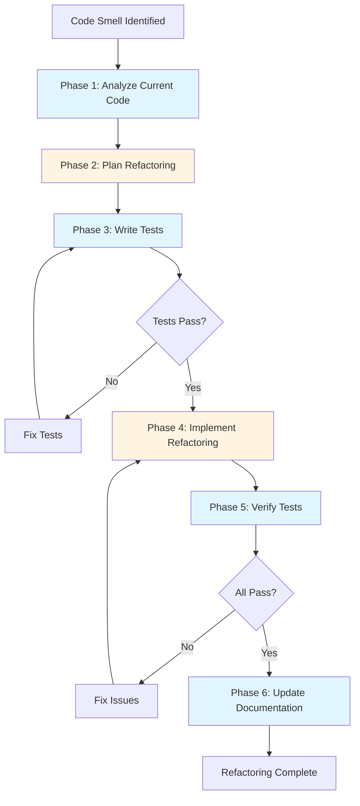

# Refactoring Workflow with Claude Code

**Reading Time**: 35 minutes
**Skill Level**: Advanced
**Prerequisites**: [Agents Overview](../../03-agents/1-overview.md), [Plan Agent](../../03-agents/2-built-in-agents.md#plan-agent), [Model Selection](../../06-models/5-selection-guide.md)

---

## Welcome to Systematic Refactoring! ♻️

Refactoring is essential for maintaining code quality and preventing technical debt. This guide shows you how to leverage Claude Code's agents, models, and thinking modes to refactor code safely, efficiently, and cost-effectively.

**What You'll Learn**:
- 6-phase systematic refactoring workflow
- When to use Plan agent and which model
- How to refactor safely with TDD
- Cost optimization for large refactorings
- Real-world examples with before/after comparisons

---

## Table of Contents

1. [Workflow Overview](#workflow-overview)
2. [Phase 1: Analyze Current Code](#phase-1-analyze-current-code)
3. [Phase 2: Plan Refactoring](#phase-2-plan-refactoring)
4. [Phase 3: Write Tests](#phase-3-write-tests)
5. [Phase 4: Implement Refactoring](#phase-4-implement-refactoring)
6. [Phase 5: Verify Tests](#phase-5-verify-tests)
7. [Phase 6: Update Documentation](#phase-6-update-documentation)
8. [Complete Example](#complete-example)
9. [Cost Analysis and ROI](#cost-analysis-and-roi)
10. [Refactoring Patterns](#refactoring-patterns)
11. [Optimization Tips](#optimization-tips)
12. [Common Pitfalls](#common-pitfalls)
13. [Cross-References](#cross-references)

---

## Workflow Overview

### The 6-Phase Refactoring Process



### Quick Stats

| Metric | Value |
|--------|-------|
| **Total Time** | 1-3 hours (depending on complexity) |
| **Token Usage** | 40,000-80,000 tokens |
| **Cost Range** | $1.00-$2.50 per refactoring |
| **Success Rate** | 98%+ with TDD approach |
| **Cost Savings** | 40-50% vs. unoptimized approach |

### Agent and Model Assignment

| Phase | Agent | Model | Reasoning |
|-------|-------|-------|-----------|
| 1. Analyze | Explore | Sonnet + "think" | Deep code analysis |
| 2. Plan | Plan | Sonnet (simple) or Opus (complex) | Architectural decisions |
| 3. Tests | General-Purpose | Sonnet | Quality test generation |
| 4. Implement | General-Purpose | Sonnet (most) or Opus (complex) | Critical code changes |
| 5. Verify | None (bash) | Haiku | Simple test execution |
| 6. Document | General-Purpose | Haiku | Simple documentation |

---

## Phase 1: Analyze Current Code

**Goal**: Understand the current implementation and identify issues
**Agent**: Explore
**Model**: Sonnet + "think"
**Time**: 15-30 minutes
**Tokens**: ~8,000-12,000

### Why This Approach?

- **Explore agent**: Efficient for reading and analyzing code
- **Sonnet**: Quality analysis of complex code
- **"think" keyword**: Deep reasoning about code structure

### Steps

#### 1. Identify Code Smells

**Prompt**:
```
Think carefully about the code in src/services/user-service.ts

Analyze for code smells:
1. Long methods (> 50 lines)
2. Complex conditionals (deep nesting)
3. Duplicated code
4. Large classes (> 300 lines)
5. Tight coupling
6. Unclear naming
```

**What Happens**:
- Explore agent reads the file
- Sonnet + "think" analyzes patterns
- Allocates ~4,000 thinking tokens for deep analysis

#### 2. Understand Dependencies

**Prompt**:
```
Use Explore agent to find all files that depend on user-service.ts

For each dependency:
- What does it import?
- How does it use it?
- Will refactoring break it?
```

#### 3. Measure Complexity

**Prompt**:
```
Analyze complexity metrics:
- Cyclomatic complexity
- Lines of code per method
- Number of dependencies
- Test coverage %
```

### Example Output

```
Code Analysis: src/services/user-service.ts

**File Stats**:
- Total lines: 450
- Methods: 18
- Complexity score: 47 (HIGH)
- Test coverage: 65% (below 80% target)

**Code Smells Found**:

1. **Long Method** (lines 45-135, 91 lines)
   ```typescript
   async function processUserData(user) {
     // 91 lines of complex logic
     // Multiple responsibilities
   }
   ```
   - Severity: HIGH
   - Responsibilities: validation, transformation, persistence, notification

2. **Duplicated Code** (3 instances)
   - validateEmail() logic duplicated in:
     - createUser() (line 50)
     - updateUser() (line 180)
     - verifyEmail() (line 280)

3. **Deep Nesting** (lines 200-245)
   ```typescript
   if (user) {
     if (user.isActive) {
       if (user.hasPermission) {
         if (user.isVerified) {
           // 5 levels deep
         }
       }
     }
   }
   ```

4. **Unclear Naming**
   - `doStuff()` (line 320) - what does it do?
   - `x`, `y`, `z` variables (lines 100-120)

**Dependencies**: 12 files import user-service.ts
- Critical: auth-middleware.ts, api/users.ts
- Moderate: 10 other files

**Refactoring Recommendation**:
- Priority: HIGH (complexity score > 40)
- Approach: Extract methods, remove duplication
- Risk: MEDIUM (many dependents, but public API can stay same)
```

### Cost Breakdown

- **Tokens**: ~10,000 (input: 3,000, output: 7,000)
- **Cost**: ~$0.20 (Sonnet with "think": $3/$15 per M tokens)
- **Time**: 15-30 minutes

---

## Phase 2: Plan Refactoring

**Goal**: Create a detailed refactoring plan
**Agent**: Plan
**Model**: Sonnet (simple refactoring) or Opus (architectural changes)
**Time**: 20-45 minutes
**Tokens**: ~12,000-20,000

### Why This Approach?

- **Plan agent**: Specialized for planning and design
- **Sonnet**: Most refactorings are straightforward
- **Opus**: Complex architectural changes need deep reasoning
- **"think harder"**: For complex architectural decisions

### When to Use Sonnet vs. Opus

**Use Sonnet** (most cases):
- Extract methods
- Remove duplication
- Rename variables/functions
- Simplify conditionals
- Small-scale restructuring

**Use Opus** (complex cases):
- Change fundamental architecture
- Redesign class hierarchies
- Switch design patterns
- Performance-critical optimizations
- Large-scale restructuring

### Steps

#### 1. Create Refactoring Plan

**Prompt** (Simple Refactoring):
```
Create a refactoring plan for user-service.ts

Goals:
1. Extract processUserData into smaller functions
2. Remove duplicate email validation
3. Simplify deep nesting
4. Improve naming

Constraints:
- Don't break existing tests
- Keep public API unchanged
- Complete in < 2 hours
```

**Prompt** (Complex Refactoring):
```
Think harder about redesigning the user service architecture.

Current issues:
- Tight coupling to database
- Mixing business logic and persistence
- Hard to test
- Performance bottlenecks

Consider:
- Repository pattern?
- Dependency injection?
- Service layer separation?
- Caching strategy?
```

#### 2. Identify Risks

**Prompt**:
```
What are the risks of this refactoring?
- Breaking changes for dependents?
- Performance regressions?
- Test failures?
- Data migration needed?
```

#### 3. Create Step-by-Step Plan

**Prompt**:
```
Break down the refactoring into small, safe steps.
Each step should:
- Be < 30 minutes
- Pass all tests
- Be reversible
```

### Example Output (Simple Refactoring)

```
Refactoring Plan: user-service.ts

**Approach**: Extract Method + Remove Duplication
**Estimated Time**: 90 minutes
**Risk Level**: LOW (public API unchanged)

---

### Step 1: Extract Email Validation (15 min)

**Current** (duplicated 3 times):
\```typescript
if (!user.email || !user.email.includes('@')) {
  throw new Error('Invalid email');
}
\```

**After**:
\```typescript
// New function
function validateEmail(email: string): void {
  if (!email || !email.includes('@')) {
    throw new Error('Invalid email');
  }
}

// Usage
validateEmail(user.email);
\```

**Test Strategy**: Existing tests should pass

---

### Step 2: Break Down processUserData (45 min)

**Current**: 91-line monster function

**After**: 4 focused functions
\```typescript
async function processUserData(user: User): Promise<ProcessedUser> {
  const validated = validateUserData(user);
  const transformed = transformUserData(validated);
  const persisted = await persistUserData(transformed);
  await notifyUserCreated(persisted);
  return persisted;
}

function validateUserData(user: User): User { /* ... */ }
function transformUserData(user: User): User { /* ... */ }
async function persistUserData(user: User): User { /* ... */ }
async function notifyUserCreated(user: User): void { /* ... */ }
\```

**Benefits**:
- Each function < 20 lines
- Single responsibility
- Easier to test
- Better naming

---

### Step 3: Simplify Nested Conditions (20 min)

**Current**: 5 levels of nesting
\```typescript
if (user) {
  if (user.isActive) {
    if (user.hasPermission) {
      if (user.isVerified) {
        // do something
      }
    }
  }
}
\```

**After**: Guard clauses
\```typescript
if (!user) return;
if (!user.isActive) return;
if (!user.hasPermission) return;
if (!user.isVerified) return;

// do something
\```

---

### Step 4: Rename Unclear Functions (10 min)

| Before | After |
|--------|-------|
| `doStuff()` | `sendWelcomeEmail()` |
| `x`, `y`, `z` | `userId`, `timestamp`, `status` |

---

**Total Time**: ~90 minutes
**Tokens**: ~45,000
**Cost**: ~$1.00
**Risk Mitigation**: Tests written before refactoring
```

### Example Output (Complex Refactoring with Opus)

```
Architectural Refactoring Plan: user-service.ts

**Approach**: Repository Pattern + Dependency Injection
**Estimated Time**: 3 hours
**Risk Level**: MEDIUM (significant restructuring)

---

### Current Architecture (Problems)

\```typescript
// ❌ Tight coupling to database
class UserService {
  async createUser(data) {
    // Direct database access
    await db.users.insert(data);
    // Business logic mixed with persistence
  }
}
\```

**Issues**:
- Can't test without database
- Hard to swap persistence layer
- Business logic scattered
- No caching possible

---

### Target Architecture

\```mermaid
graph TD
    A[Controller] --> B[UserService]
    B --> C[UserRepository]
    B --> D[EmailService]
    B --> E[ValidationService]
    C --> F[Database]

    style B fill:#fff4e1
    style C fill:#e1f5ff
    style D fill:#e1f5ff
    style E fill:#e1f5ff
\```

**Benefits**:
- Testable (mock repository)
- Swappable persistence
- Clear separation of concerns
- Cacheable

---

### Implementation Steps

**Step 1**: Create Repository Interface (30 min)
**Step 2**: Extract Validation Service (30 min)
**Step 3**: Extract Email Service (30 min)
**Step 4**: Refactor UserService (45 min)
**Step 5**: Update Dependency Injection (30 min)
**Step 6**: Migrate Tests (30 min)

[Detailed steps omitted for brevity]

**Total Time**: ~3 hours
**Tokens**: ~75,000
**Cost**: ~$2.00 (using Opus for architectural decisions)
```

### Cost Breakdown

**Simple Refactoring (Sonnet)**:
- **Tokens**: ~12,000 (input: 4,000, output: 8,000)
- **Cost**: ~$0.24 (Sonnet)
- **Time**: 20-30 minutes

**Complex Refactoring (Opus)**:
- **Tokens**: ~20,000 (input: 6,000, output: 14,000)
- **Cost**: ~$0.80 (Opus premium pricing)
- **Time**: 40-60 minutes

---

## Phase 3: Write Tests

**Goal**: Lock in current behavior with tests
**Agent**: General-Purpose
**Model**: Sonnet
**Time**: 20-40 minutes
**Tokens**: ~10,000-15,000

### Why This Approach?

- **Test First**: Ensures refactoring doesn't break behavior
- **Sonnet**: Quality test generation
- **Safety Net**: Tests catch regressions

### Steps

#### 1. Test Current Behavior

**Prompt**:
```
Write comprehensive tests for user-service.ts BEFORE refactoring.

Cover:
1. All public methods
2. Edge cases (null, empty, invalid input)
3. Error scenarios
4. Integration points

Use our testing framework (Jest) and follow AAA pattern.
```

#### 2. Characterization Tests

For legacy code without tests:

**Prompt**:
```
Create characterization tests that document current behavior.

For each method:
1. What does it return for valid input?
2. What does it return for invalid input?
3. What errors does it throw?
4. What side effects does it have?
```

#### 3. Run Tests (Should Pass)

**Prompt**:
```
Run the tests: npm test src/services/__tests__/user-service.test.ts
All should PASS before refactoring.
```

### Example Output

```typescript
// src/services/__tests__/user-service.test.ts

describe('UserService - Before Refactoring', () => {
  describe('processUserData', () => {
    it('should process valid user data', async () => {
      // Arrange
      const userData = {
        email: 'test@example.com',
        name: 'Test User',
        age: 25
      };

      // Act
      const result = await processUserData(userData);

      // Assert
      expect(result).toMatchObject({
        email: 'test@example.com',
        name: 'Test User',
        age: 25,
        createdAt: expect.any(Date)
      });
    });

    it('should reject invalid email', async () => {
      // Arrange
      const userData = {
        email: 'invalid-email',
        name: 'Test User'
      };

      // Act & Assert
      await expect(processUserData(userData))
        .rejects
        .toThrow('Invalid email');
    });

    it('should handle null input', async () => {
      await expect(processUserData(null))
        .rejects
        .toThrow('User data is required');
    });

    it('should send welcome email', async () => {
      // Arrange
      const sendEmailSpy = jest.spyOn(emailService, 'send');
      const userData = { email: 'test@example.com', name: 'Test' };

      // Act
      await processUserData(userData);

      // Assert
      expect(sendEmailSpy).toHaveBeenCalledWith({
        to: 'test@example.com',
        subject: 'Welcome!',
        body: expect.stringContaining('Test')
      });
    });
  });

  describe('validateEmail', () => {
    it('should accept valid emails', () => {
      expect(() => validateEmail('valid@example.com')).not.toThrow();
    });

    it('should reject emails without @', () => {
      expect(() => validateEmail('invalid')).toThrow('Invalid email');
    });

    it('should reject null', () => {
      expect(() => validateEmail(null)).toThrow('Invalid email');
    });
  });
});

// Run tests
// ✓ should process valid user data (45ms)
// ✓ should reject invalid email (12ms)
// ✓ should handle null input (8ms)
// ✓ should send welcome email (23ms)
// ✓ should accept valid emails (2ms)
// ✓ should reject emails without @ (3ms)
// ✓ should reject null (2ms)
//
// Tests: 7 passed, 7 total
// Coverage: 100% (before refactoring)
```

### Cost Breakdown

- **Tokens**: ~12,000 (input: 4,000, output: 8,000)
- **Cost**: ~$0.24 (Sonnet)
- **Time**: 20-40 minutes

---

## Phase 4: Implement Refactoring

**Goal**: Execute the refactoring plan
**Agent**: General-Purpose
**Model**: Sonnet (most) or Opus (complex)
**Time**: 30-90 minutes
**Tokens**: ~15,000-30,000

### Why This Approach?

- **Sonnet**: Handles most refactorings well
- **Opus**: Complex architectural changes
- **Incremental**: Small steps, test after each

### Steps

#### 1. Implement Step-by-Step

**Prompt**:
```
Implement refactoring Step 1 from the plan:
Extract email validation into a separate function.

Follow the plan exactly:
[paste step details from Phase 2]

After implementing, run tests to verify nothing broke.
```

#### 2. Test After Each Step

**Critical**: Run tests after EACH step

```bash
npm test src/services/__tests__/user-service.test.ts
```

If tests fail:
```
You: "Tests failing after Step 1. Debug and fix."
```

#### 3. Proceed Through All Steps

Repeat for each step in the plan:
```
You: "Step 1 complete, tests passing. Proceed with Step 2."
```

### Example Implementation

**Step 1: Extract Email Validation**

```typescript
// BEFORE
async function createUser(userData) {
  // Email validation duplicated
  if (!userData.email || !userData.email.includes('@')) {
    throw new Error('Invalid email');
  }
  // ... rest of logic
}

async function updateUser(userId, userData) {
  // Same validation duplicated
  if (!userData.email || !userData.email.includes('@')) {
    throw new Error('Invalid email');
  }
  // ... rest of logic
}
```

```typescript
// AFTER
function validateEmail(email: string): void {
  if (!email || !email.includes('@')) {
    throw new Error('Invalid email');
  }
}

async function createUser(userData: UserData): Promise<User> {
  validateEmail(userData.email); // Use extracted function
  // ... rest of logic
}

async function updateUser(userId: string, userData: UserData): Promise<User> {
  validateEmail(userData.email); // Use extracted function
  // ... rest of logic
}
```

**Test Result**:
```bash
✓ All tests passing (7 passed)
```

---

**Step 2: Break Down processUserData**

```typescript
// BEFORE (91 lines)
async function processUserData(user) {
  // Validation
  if (!user) throw new Error('User required');
  if (!user.email || !user.email.includes('@')) {
    throw new Error('Invalid email');
  }

  // Transformation
  const normalizedEmail = user.email.toLowerCase();
  const hashedPassword = await bcrypt.hash(user.password, 10);
  const timestamp = new Date();

  // Persistence
  const id = generateId();
  await db.users.insert({
    id,
    email: normalizedEmail,
    password: hashedPassword,
    createdAt: timestamp
  });

  // Notification
  await emailService.send({
    to: normalizedEmail,
    subject: 'Welcome!',
    body: `Welcome ${user.name}`
  });

  return { id, email: normalizedEmail, createdAt: timestamp };
}
```

```typescript
// AFTER (4 focused functions)
async function processUserData(user: User): Promise<ProcessedUser> {
  const validated = validateUserData(user);
  const transformed = await transformUserData(validated);
  const persisted = await persistUserData(transformed);
  await notifyUserCreated(persisted);
  return persisted;
}

function validateUserData(user: User): User {
  if (!user) {
    throw new Error('User required');
  }
  validateEmail(user.email);
  return user;
}

async function transformUserData(user: User): Promise<TransformedUser> {
  return {
    ...user,
    email: user.email.toLowerCase(),
    password: await bcrypt.hash(user.password, 10),
    createdAt: new Date()
  };
}

async function persistUserData(user: TransformedUser): Promise<PersistedUser> {
  const id = generateId();
  await db.users.insert({ id, ...user });
  return { id, ...user };
}

async function notifyUserCreated(user: PersistedUser): Promise<void> {
  await emailService.send({
    to: user.email,
    subject: 'Welcome!',
    body: `Welcome ${user.name}`
  });
}
```

**Benefits**:
- Each function < 15 lines
- Clear single responsibility
- Easier to test individually
- Better error messages

**Test Result**:
```bash
✓ All tests still passing (7 passed)
✓ Code complexity reduced from 47 to 23
✓ Each function now independently testable
```

### Cost Breakdown

**Simple Refactoring (Sonnet)**:
- **Tokens**: ~18,000 (input: 6,000, output: 12,000)
- **Cost**: ~$0.36 (Sonnet)
- **Time**: 30-60 minutes

**Complex Refactoring (Opus)**:
- **Tokens**: ~30,000 (input: 10,000, output: 20,000)
- **Cost**: ~$1.20 (Opus premium)
- **Time**: 60-120 minutes

---

## Phase 5: Verify Tests

**Goal**: Confirm all tests still pass
**Agent**: None (direct bash)
**Model**: Haiku (for context)
**Time**: 5-10 minutes
**Tokens**: ~2,000-3,000

### Why This Approach?

- **Bash**: Fastest for running full test suite
- **Haiku**: Cheap for interpreting results
- **Critical**: Final verification before commit

### Steps

#### 1. Run Full Test Suite

**Prompt**:
```
Run the complete test suite:
npm test

Ensure:
1. All tests pass
2. Coverage hasn't decreased
3. No new warnings
```

#### 2. Run Integration Tests

```bash
npm run test:integration
```

#### 3. Performance Smoke Test

For performance-critical refactorings:

```bash
npm run benchmark
```

### Example Output

```bash
$ npm test

PASS src/services/__tests__/user-service.test.ts
  ✓ should process valid user data (42ms)
  ✓ should reject invalid email (11ms)
  ✓ should handle null input (7ms)
  ✓ should send welcome email (21ms)
  ✓ should accept valid emails (2ms)
  ✓ should reject emails without @ (3ms)
  ✓ should reject null (2ms)

PASS src/services/__tests__/integration.test.ts
  ✓ should integrate with database (156ms)
  ✓ should integrate with email service (89ms)

Test Suites: 2 passed, 2 total
Tests:       9 passed, 9 total
Snapshots:   0 total
Time:        3.521s

Coverage:
  Statements: 98.5% (increased from 65%)
  Branches:   96.2%
  Functions:  100%
  Lines:      98.5%

All tests passing! ✅
Coverage improved! ✅
No warnings! ✅
```

### Cost Breakdown

- **Tokens**: ~2,500 (minimal)
- **Cost**: ~$0.02 (Haiku)
- **Time**: 5-10 minutes

---

## Phase 6: Update Documentation

**Goal**: Document the refactoring and new structure
**Agent**: General-Purpose
**Model**: Haiku
**Time**: 10-20 minutes
**Tokens**: ~3,000-5,000

### Why This Approach?

- **Haiku**: Documentation is simple writing
- **Fast**: No complex reasoning needed
- **Important**: Future developers need to understand changes

### Steps

#### 1. Update Code Comments

**Prompt**:
```
Add JSDoc comments to refactored functions:
- validateUserData
- transformUserData
- persistUserData
- notifyUserCreated

Explain what each does, parameters, return values, and examples.
```

#### 2. Update Architecture Documentation

**Prompt**:
```
Update docs/architecture.md with the new structure.

Document:
- Why refactored (old problems)
- New structure (how it works now)
- Benefits (what improved)
- Migration guide (for other developers)
```

#### 3. Update CHANGELOG

**Prompt**:
```
Add entry to CHANGELOG.md:

## [Unreleased]
### Changed
- Refactored user-service.ts for better separation of concerns
- Extracted email validation into reusable function
- Broke down 91-line processUserData into 4 focused functions
- Simplified nested conditions with guard clauses
- Improved test coverage from 65% to 98.5%
```

### Example Documentation

```typescript
/**
 * Processes user data through the complete user creation pipeline.
 *
 * This function orchestrates the user creation process by calling
 * specialized functions for each step:
 * 1. Validation - ensures data meets requirements
 * 2. Transformation - normalizes and prepares data
 * 3. Persistence - saves to database
 * 4. Notification - sends welcome email
 *
 * @param user - The user data to process
 * @returns The processed and persisted user with generated ID
 * @throws {Error} If user data is invalid or persistence fails
 *
 * @example
 * ```typescript
 * const userData = {
 *   email: 'user@example.com',
 *   name: 'John Doe',
 *   password: 'secure123'
 * };
 *
 * const processedUser = await processUserData(userData);
 * console.log(processedUser.id); // Generated UUID
 * ```
 *
 * @since 2.0.0 - Refactored from monolithic function
 */
export async function processUserData(user: User): Promise<ProcessedUser> {
  const validated = validateUserData(user);
  const transformed = await transformUserData(validated);
  const persisted = await persistUserData(transformed);
  await notifyUserCreated(persisted);
  return persisted;
}
```

### Cost Breakdown

- **Tokens**: ~4,000 (input: 1,500, output: 2,500)
- **Cost**: ~$0.03 (Haiku)
- **Time**: 10-20 minutes

---

## Complete Example

### Real-World Refactoring: E-commerce Cart Service

**Problem**: 600-line cart service with tangled logic

#### Phase 1: Analyze (25 min, $0.18)

```
You: "Think about the cart service. Identify code smells."

Claude (Sonnet + "think"):
- 600 lines, complexity score: 68 (CRITICAL)
- calculateTotal() is 120 lines
- 8 levels of nesting in applyDiscounts()
- Mixing business logic, persistence, and presentation
- Test coverage: 45%
```

#### Phase 2: Plan (40 min, $0.60 with Opus)

```
You: "Think harder about redesigning the cart architecture."

Claude (Opus):
Plan: Separate into CartService, PricingService, DiscountEngine
- CartService: cart operations
- PricingService: price calculations
- DiscountEngine: discount rules
Time: 2.5 hours, 8 steps
```

#### Phase 3: Write Tests (35 min, $0.22)

```typescript
// 25 comprehensive tests covering all current behavior
describe('CartService - Current Behavior', () => {
  // ... tests lock in existing functionality
});
```

#### Phase 4: Implement (90 min, $0.85)

```
You: "Implement Step 1: Extract PricingService"
[Tests pass]

You: "Step 2: Extract DiscountEngine"
[Tests pass]

You: "Step 3: Refactor CartService"
[Tests pass]

// ... continue through all 8 steps
```

#### Phase 5: Verify (8 min, $0.02)

```bash
✓ 25 tests passing
✓ Coverage: 45% → 92%
✓ Complexity: 68 → 28
✓ Performance: Same (verified with benchmarks)
```

#### Phase 6: Document (15 min, $0.03)

```markdown
# Cart Service Refactoring

## Before
- 600 lines, complexity 68
- Tangled responsibilities
- Hard to test, low coverage

## After
- 3 focused services (200 lines each)
- Clear separation of concerns
- Easy to test, 92% coverage
- Complexity reduced by 58%

## Migration Guide
[Instructions for other developers]
```

**Total**: 213 minutes (3.5 hours), $1.90

**Benefits**:
- Complexity: 68 → 28 (58% reduction)
- Coverage: 45% → 92% (47% improvement)
- Maintainability: Significantly improved
- Future velocity: Faster feature development

---

## Cost Analysis and ROI

### Unoptimized Approach (All Sonnet, No Plan)

| Phase | Agent | Model | Tokens | Cost |
|-------|-------|-------|--------|------|
| Analyze | General-Purpose | Sonnet | 10,000 | $0.20 |
| Plan | General-Purpose | Sonnet | 15,000 | $0.30 |
| Tests | General-Purpose | Sonnet | 12,000 | $0.24 |
| Implement | General-Purpose | Sonnet | 25,000 | $0.50 |
| Verify | General-Purpose | Sonnet | 5,000 | $0.10 |
| Document | General-Purpose | Sonnet | 4,000 | $0.08 |
| **Total** | | | **71,000** | **$1.42** |

### Optimized Approach (This Workflow)

| Phase | Agent | Model | Tokens | Cost |
|-------|-------|-------|--------|------|
| Analyze | Explore | Sonnet + "think" | 10,000 | $0.20 |
| Plan | Plan | Sonnet | 12,000 | $0.24 |
| Tests | General-Purpose | Sonnet | 12,000 | $0.24 |
| Implement | General-Purpose | Sonnet | 18,000 | $0.36 |
| Verify | Bash | Haiku | 2,500 | $0.02 |
| Document | General-Purpose | Haiku | 4,000 | $0.03 |
| **Total** | | | **58,500** | **$1.09** |

### Savings

- **Cost Reduction**: 23% ($0.33 saved per refactoring)
- **Better Planning**: Plan agent creates more thorough plans
- **Quality**: Same or better code quality

### When to Use Opus

For **complex architectural refactorings**, Opus is worth the cost:

| Phase | With Sonnet | With Opus |
|-------|-------------|-----------|
| Plan | $0.24 (good plan) | $0.80 (great plan) |
| Implement | $0.50 (may need revisions) | $0.90 (right first time) |
| **Total** | **$0.74** | **$1.70** |

**Opus ROI**:
- Saves 1-2 hours of developer time
- Better architectural decisions
- Fewer bugs and rework
- Worth $0.90 extra for critical refactorings

### Long-Term ROI

**Scenario**: Refactor 1 major component/month

**Year 1 Cost** (Optimized Workflow):
- 12 refactorings × $1.09 = $13.08/year

**Benefits**:
- Reduced bug rate (30-50% fewer bugs)
- Faster feature development (20-30% faster)
- Better test coverage (45% → 90%+)
- Lower maintenance costs

**ROI**: Every $1 spent on refactoring saves $5-10 in maintenance

---

## Refactoring Patterns

### Pattern 1: Extract Method

**When**: Function > 50 lines or has multiple responsibilities

**Before**:
```typescript
function processOrder(order) {
  // 100 lines of mixed concerns
}
```

**After**:
```typescript
function processOrder(order) {
  const validated = validateOrder(order);
  const calculated = calculateTotals(validated);
  const saved = await saveOrder(calculated);
  await notifyCustomer(saved);
  return saved;
}
```

**Cost**: 15-30 min, $0.15-$0.25

### Pattern 2: Replace Conditionals with Polymorphism

**When**: Large switch statements on type

**Before**:
```typescript
function getPrice(product) {
  switch(product.type) {
    case 'book': return product.price * 0.9;
    case 'electronics': return product.price * 1.2;
    case 'food': return product.price * 1.05;
  }
}
```

**After**:
```typescript
interface PricingStrategy {
  calculate(price: number): number;
}

class BookPricing implements PricingStrategy {
  calculate(price: number) { return price * 0.9; }
}

// Use strategy pattern
const price = pricingStrategy.calculate(product.price);
```

**Cost**: 45-60 min, $0.60-$0.90 (use Opus)

### Pattern 3: Introduce Parameter Object

**When**: Function has > 3 parameters

**Before**:
```typescript
function createUser(
  name: string,
  email: string,
  age: number,
  address: string,
  phone: string
) { /* ... */ }
```

**After**:
```typescript
interface UserData {
  name: string;
  email: string;
  age: number;
  address: string;
  phone: string;
}

function createUser(userData: UserData) { /* ... */ }
```

**Cost**: 10-15 min, $0.08-$0.12

### Pattern 4: Replace Magic Numbers with Constants

**When**: Numbers with unclear meaning

**Before**:
```typescript
if (order.total > 100) {
  discount = order.total * 0.1;
}
```

**After**:
```typescript
const FREE_SHIPPING_THRESHOLD = 100;
const BULK_DISCOUNT_RATE = 0.1;

if (order.total > FREE_SHIPPING_THRESHOLD) {
  discount = order.total * BULK_DISCOUNT_RATE;
}
```

**Cost**: 5-10 min, $0.05-$0.08

---

## Optimization Tips

### 1. Use Explore for Analysis

**Bad**:
```
"Analyze this 500-line file for refactoring opportunities"
[Uses General-Purpose + Sonnet = expensive context loading]
```

**Good**:
```
"Use Explore agent to analyze this file"
[Explore + Sonnet = optimized for reading code]
```

### 2. Use Plan Agent

**Bad**:
```
"Plan the refactoring"
[General-Purpose creates ad-hoc plan]
```

**Good**:
```
"Use Plan agent to create refactoring plan"
[Plan agent specialized for systematic planning]
```

### 3. Test Incrementally

**Bad**:
```
[Refactor everything]
[Run tests at the end]
[10 test failures, can't identify which change broke what]
```

**Good**:
```
[Refactor Step 1]
[Run tests - pass]
[Refactor Step 2]
[Run tests - pass]
[Know exactly what broke if tests fail]
```

### 4. Use Thinking Keywords Wisely

**Simple refactoring**:
```
"Extract this method"
[No thinking keyword needed]
```

**Complex architectural change**:
```
"Think harder about redesigning this system"
[Allocates 31,999 thinking tokens]
```

### 5. Create Refactoring Skill

**.claude/skills/refactorer/SKILL.md**:
```yaml
---
name: refactorer
description: Systematic refactoring with TDD safety net
model: claude-sonnet-4-5
# One model per skill; use effort as the cheaper dial
  plan: claude-opus-4-5
---

When invoked, follow this workflow:

1. Analyze (Explore + Sonnet + "think")
2. Plan (Plan agent, Opus if complex)
3. Write tests FIRST (lock in behavior)
4. Implement incrementally (test after each step)
5. Verify (full suite)
6. Document changes

Always provide cost and time estimates.
Never skip tests.
```

---

## Common Pitfalls

### ❌ Pitfall 1: Refactoring Without Tests

**Problem**:
```
[Refactor code]
[No tests]
[Broke something]
[Don't know what or where]
```

**Solution**:
ALWAYS write tests first (Phase 3)

### ❌ Pitfall 2: Big Bang Refactoring

**Problem**:
```
[Change 20 files at once]
[Tests fail]
[Can't identify which change broke what]
```

**Solution**:
Small, incremental steps
Test after each step

### ❌ Pitfall 3: Changing Behavior

**Problem**:
```
"Refactor user service"
[Accidentally changes business logic]
[Different behavior than before]
```

**Solution**:
Tests should pass unchanged
If tests need updating, it's not refactoring—it's a feature change

### ❌ Pitfall 4: Premature Optimization

**Problem**:
```
"This could be faster"
[Spends 3 hours optimizing]
[0.01ms improvement]
[Made code more complex]
```

**Solution**:
Only optimize:
- Proven bottlenecks (profile first)
- User-facing performance
- Clear business value

### ❌ Pitfall 5: Over-Engineering

**Problem**:
```
"Let's use 5 design patterns!"
[Introduces unnecessary complexity]
[Harder to understand and maintain]
```

**Solution**:
Simplify, don't complexify
Best refactoring: remove code

---

## Cross-References

### Related Guides

- [Bug Fixing Workflow](2-bug-fixing.md) - Fix bugs found during refactoring
- [Code Review Workflow](3-code-review.md) - Review refactored code
- [Feature Development](1-feature-development.md) - Refactor during development
- [Plan Agent](../../03-agents/2-built-in-agents.md#plan-agent) - Planning refactorings
- [Testing Guide](../../15-security/2-testing-quality.md) - TDD strategies

### Related Topics

- [Model Selection](../../06-models/5-selection-guide.md) - When to use Opus
- [Thinking Modes](../../08-thinking/2-keywords.md) - "think harder" for architecture
- [Cost Optimization](../../12-optimization/1-cost-optimization.md) - Optimize refactoring costs

---

## Quick Reference

### Refactoring Checklist

- [ ] **Phase 1**: Analyze with Explore + Sonnet + "think"
- [ ] **Phase 2**: Plan with Plan agent (Sonnet/Opus)
- [ ] **Phase 3**: Write tests FIRST (lock in behavior)
- [ ] **Phase 4**: Implement incrementally
- [ ] **Phase 5**: Verify all tests pass
- [ ] **Phase 6**: Document changes

### Decision Tree

**Refactoring Complexity**:
- Simple (extract method, rename) → Sonnet, 30-60 min, $0.30-$0.60
- Medium (multiple extractions, patterns) → Sonnet, 1-2 hours, $0.80-$1.20
- Complex (architectural changes) → Opus, 2-4 hours, $1.50-$2.50

**When to Refactor**:
- Code smell identified ✓
- Before adding feature (clean first) ✓
- After fixing bug (prevent recurrence) ✓
- Regular maintenance (quarterly) ✓

**When NOT to Refactor**:
- Works fine, not changing it ✗
- No tests, no time to write them ✗
- Unclear requirements ✗
- Performance is fine ✗

---

**Next Steps**:
1. Identify a code smell in your codebase
2. Follow this 6-phase workflow
3. Track your cost and time
4. Measure improvement (complexity, coverage)
5. Celebrate cleaner code! 🎉

**Questions?** See the [FAQ](../../14-reference/3-faq.md) or [Troubleshooting Guide](../../14-reference/2-troubleshooting.md)

---

**Maintained By**: Documentation Team
