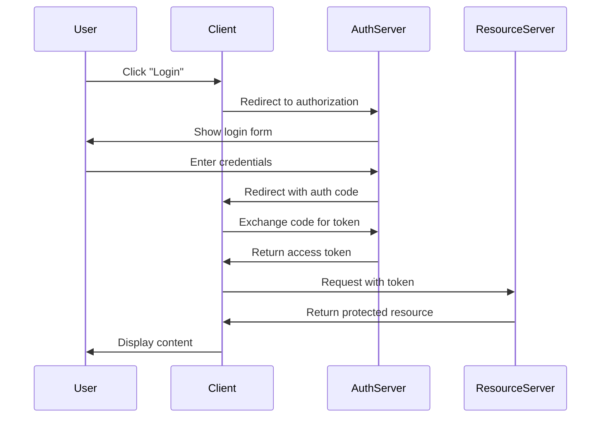

# Documentation Writing Workflow

**Reading Time**: 25 minutes
**Skill Level**: Beginner to Advanced
**Prerequisites**: Basic understanding of Claude Code and markdown

---

## Overview

Complete workflow for writing high-quality technical documentation using Claude Code's capabilities including the documentation-professor skill, progressive disclosure, and multi-model optimization.

**What You'll Learn**:
- How to plan documentation structure effectively
- Writing documentation with different skill levels in mind
- Optimizing for cost while maintaining quality
- Testing and validating documentation examples
- Maintaining documentation over time

---

## Table of Contents

1. [Documentation Types](#documentation-types)
2. [Planning Phase](#planning-phase)
3. [Writing Phase](#writing-phase)
4. [Review and Polish](#review-and-polish)
5. [Example Workflows](#example-workflows)
6. [Best Practices](#best-practices)
7. [Cost Analysis](#cost-analysis)

---

## Documentation Types

### API Documentation

**Characteristics**:
- Structured format (endpoint, parameters, responses)
- Many code examples
- Clear, concise language
- Reference-style content

**Recommended Approach**:
- Use Haiku for simple endpoint documentation
- Use Sonnet for complex API patterns
- Generate OpenAPI/Swagger specs automatically

**Example**:
```markdown
## POST /api/users

Create a new user account.

**Request**:
\```json
{
  "email": "user@example.com",
  "name": "John Doe",
  "password": "securepass123"
}
\```

**Response**:
\```json
{
  "id": 123,
  "email": "user@example.com",
  "name": "John Doe",
  "created_at": "2025-12-21T10:00:00Z"
}
\```
```

### Tutorial Documentation

**Characteristics**:
- Step-by-step instructions
- Progressive complexity
- Hands-on examples
- Beginner-friendly

**Recommended Approach**:
- Use Sonnet with documentation-professor skill
- Include pedagogical explanations
- Add visual diagrams (Mermaid)
- Test all code examples

### Conceptual Documentation

**Characteristics**:
- Explains "why" not just "how"
- Architectural overviews
- Design patterns
- Theory and best practices

**Recommended Approach**:
- Use Sonnet or Opus for deep explanations
- Include diagrams and visualizations
- Connect concepts to practical applications
- Provide multiple perspectives

### Reference Documentation

**Characteristics**:
- Comprehensive coverage
- Alphabetical or categorical organization
- Quick lookups
- Minimal explanation

**Recommended Approach**:
- Use Haiku for straightforward reference entries
- Consistent formatting
- Cross-references
- Search-optimized structure

---

## Planning Phase

### Step 1: Define Scope and Audience

**Duration**: 10-15 minutes
**Model**: Haiku (for straightforward planning) or Sonnet (for complex topics)
**Tokens**: ~3,000-5,000

**Prompt Template**:
```
I need to write documentation for [TOPIC].

Target audience:
- Skill level: [Beginner/Intermediate/Advanced]
- Background: [Developer/User/Administrator]
- Goals: [What they want to achieve]

Please help me:
1. Identify key topics to cover
2. Suggest logical progression
3. Determine appropriate depth
4. Recommend documentation type
```

**Example**:
```
You: "I need to write documentation for our REST API authentication system.

Target audience:
- Skill level: Intermediate developers
- Background: Web developers familiar with APIs
- Goals: Implement authentication in their applications

Please help me identify key topics and suggest a logical structure."
```

Claude will analyze and suggest:
1. Topics: OAuth flow, JWT tokens, API keys, refresh tokens, error handling
2. Progression: Start with simple API key auth, then OAuth, then advanced patterns
3. Depth: Code examples for each method, security considerations, troubleshooting
4. Type: Mix of tutorial (getting started) and reference (all endpoints)

### Step 2: Create Documentation Outline

**Duration**: 15-20 minutes
**Model**: Sonnet (balanced reasoning)
**Tokens**: ~5,000-8,000

**Prompt Template**:
```
Based on our discussion, create a detailed outline for the [TOPIC] documentation.

Include:
- Section hierarchy (H1, H2, H3)
- Key points for each section
- Code examples needed
- Diagrams or visualizations
- Cross-references to related topics

Format as markdown with TOC.
```

**Output Example**:
```markdown
# Authentication Documentation Outline

## Table of Contents
1. Introduction
2. Quick Start
3. Authentication Methods
   3.1 API Keys
   3.2 OAuth 2.0
   3.3 JWT Tokens
4. Implementation Guide
5. Security Best Practices
6. Troubleshooting
7. API Reference

## 1. Introduction
- What is authentication
- Why we need it
- Overview of available methods
[Diagram: Authentication flow overview]

## 2. Quick Start
- Simplest path to first authenticated request
[Code: Basic API key example]
[Code: Testing with curl]

...
```

### Step 3: Research and Gather Examples

**Duration**: 20-30 minutes
**Model**: Explore agent with Haiku (for searching), Sonnet for analysis
**Tokens**: ~8,000-15,000

**Tasks**:
1. **Find code examples in codebase**:
   ```
   You: "Find all authentication middleware and handlers in the codebase"
   ```
   Claude uses Explore agent to search

2. **Extract working examples**:
   ```
   You: "Extract the OAuth implementation from auth/oauth.ts and create a simplified example"
   ```

3. **Identify edge cases**:
   ```
   You: "What error scenarios exist in the authentication flow?"
   ```

---

## Writing Phase

### Step 4: Write Core Content

**Duration**: 45-90 minutes (depending on scope)
**Model**: Sonnet (standard) or Opus (complex conceptual documentation)
**Tokens**: ~20,000-50,000

**For Tutorial Content**:

Use the **documentation-professor skill** for pedagogical approach:

```
You: "Using the documentation-professor skill, write the 'Quick Start' section for API authentication.

Requirements:
- Target: Intermediate web developers
- Include a complete working example
- Explain each step clearly
- Add common pitfalls
- Use conversational tone"
```

**Output will include**:
- Clear step-by-step instructions
- "Why" explanations for each step
- Working code examples
- Common mistakes section
- Visual diagrams
- Interactive exercises (where appropriate)

**For API Reference Content**:

Use Haiku for efficient generation:

```
You: "Generate API reference documentation for all authentication endpoints in auth/routes.ts.

Format:
- Endpoint path and method
- Description
- Parameters (path, query, body)
- Request example
- Response example
- Error codes"
```

### Step 5: Add Code Examples

**Duration**: 30-45 minutes
**Model**: Haiku (simple examples) or Sonnet (complex examples)
**Tokens**: ~10,000-20,000

**Best Practices**:

1. **Make examples self-contained**:
   ```typescript
   // ✅ Good: Complete example
   import { authenticate } from './auth';

   async function login(email: string, password: string) {
     try {
       const token = await authenticate({ email, password });
       console.log('Logged in!', token);
     } catch (error) {
       console.error('Login failed:', error.message);
     }
   }
   ```

2. **Show real-world usage**:
   ```typescript
   // ✅ Good: Practical example
   // Middleware for protected routes
   function requireAuth(req, res, next) {
     const token = req.headers.authorization?.split(' ')[1];

     if (!token) {
       return res.status(401).json({ error: 'No token provided' });
     }

     try {
       const decoded = verifyToken(token);
       req.user = decoded;
       next();
     } catch (error) {
       return res.status(401).json({ error: 'Invalid token' });
     }
   }
   ```

3. **Test all examples**:
   ```
   You: "Create a test file that verifies all code examples in the authentication documentation work correctly"
   ```

### Step 6: Add Visual Diagrams

**Duration**: 20-30 minutes
**Model**: Sonnet (for Mermaid diagram generation)
**Tokens**: ~5,000-8,000

**Always use Mermaid**, never ASCII art:

```
You: "Create a Mermaid sequence diagram showing the OAuth 2.0 authorization code flow"
```

**Example Output**:


**Common Diagram Types**:
- Sequence diagrams (flows and interactions)
- Flowcharts (decision trees)
- Entity-relationship diagrams (data models)
- Architecture diagrams (system components)

---

## Review and Polish

### Step 7: Review for Clarity

**Duration**: 20-30 minutes
**Model**: Sonnet (balanced analysis)
**Tokens**: ~8,000-12,000

**Review Checklist**:

```
You: "Review the authentication documentation for:
1. Clarity - Is everything explained clearly?
2. Completeness - Are there gaps?
3. Consistency - Is terminology consistent?
4. Accuracy - Are examples correct?
5. Accessibility - Can beginners follow it?

Provide specific suggestions for improvement."
```

Claude will analyze and suggest:
- Unclear sections that need simplification
- Missing explanations or examples
- Inconsistent terminology
- Potential errors in code
- Areas needing more detail

### Step 8: Test Code Examples

**Duration**: 15-30 minutes
**Model**: Haiku (running tests)
**Tokens**: ~3,000-5,000

**Process**:

1. **Extract examples to test files**:
   ```
   You: "Extract all code examples from auth-docs.md and create test files"
   ```

2. **Run tests**:
   ```bash
   npm test docs/examples/auth-examples.test.ts
   ```

3. **Fix failing examples**:
   ```
   You: "The JWT example is failing with 'Invalid signature'. Fix the example in the documentation."
   ```

### Step 9: Add Cross-References

**Duration**: 10-15 minutes
**Model**: Haiku
**Tokens**: ~2,000-3,000

**Add links to**:
- Related concepts
- Prerequisites
- Next steps
- API reference
- External resources

**Example**:
```markdown
See also:
- User Management API (`users.md`) - Managing user accounts
- Security Best Practices (`security.md`) - Keeping your app secure
- [OAuth 2.0 Specification](https://oauth.net/2/) - Official OAuth docs
```

### Step 10: Final Polish

**Duration**: 15-20 minutes
**Model**: Haiku (formatting) or Sonnet (if rewriting needed)
**Tokens**: ~3,000-5,000

**Tasks**:
1. Check markdown formatting
2. Verify all links work
3. Ensure consistent style
4. Add table of contents
5. Add reading time estimate
6. Add skill level indicator

---

## Example Workflows

### Workflow 1: API Endpoint Documentation

**Goal**: Document 10 REST API endpoints

**Steps**:

1. **Extract endpoints** (5 min, Haiku, ~2,000 tokens):
   ```
   You: "List all API endpoints in api/routes/"
   ```

2. **Generate base documentation** (15 min, Haiku, ~8,000 tokens):
   ```
   You: "For each endpoint, generate documentation with: method, path, description, parameters, request example, response example"
   ```

3. **Add detailed examples** (20 min, Sonnet, ~10,000 tokens):
   ```
   You: "For the POST /users endpoint, add comprehensive examples including error cases, validation errors, and edge cases"
   ```

4. **Test examples** (10 min, Haiku, ~3,000 tokens):
   ```bash
   npm run test:docs
   ```

5. **Review and polish** (10 min, Haiku, ~2,000 tokens):
   ```
   You: "Review API documentation for consistency and completeness"
   ```

**Total**: 60 minutes, ~25,000 tokens, ~$0.40

---

### Workflow 2: Tutorial Documentation

**Goal**: Write "Getting Started with Authentication" tutorial

**Steps**:

1. **Plan structure** (10 min, Sonnet, ~5,000 tokens):
   ```
   You: "Create outline for authentication getting started tutorial"
   ```

2. **Write with documentation-professor skill** (45 min, Sonnet, ~25,000 tokens):
   ```
   You: "Using documentation-professor skill, write the complete getting started tutorial following the outline. Include:
   - Clear learning objectives
   - Step-by-step instructions
   - Working code examples
   - Common pitfalls
   - Practice exercises"
   ```

3. **Add diagrams** (15 min, Sonnet, ~5,000 tokens):
   ```
   You: "Add Mermaid diagrams for authentication flow and token lifecycle"
   ```

4. **Test tutorial** (20 min, manual):
   - Follow the tutorial yourself
   - Test all code examples
   - Verify instructions are clear

5. **Revise based on testing** (15 min, Sonnet, ~8,000 tokens):
   ```
   You: "The tutorial step 3 is unclear. Users don't know where to put the middleware. Revise to be more explicit about file locations."
   ```

**Total**: 105 minutes, ~43,000 tokens, ~$0.80

---

### Workflow 3: Comprehensive Documentation Set

**Goal**: Complete documentation for a feature (authentication system)

**Steps**:

1. **Planning** (20 min, Sonnet, ~8,000 tokens):
   - Define scope
   - Create master outline
   - Identify all documentation types needed

2. **Write overview** (30 min, Sonnet, ~15,000 tokens):
   - Introduction
   - Architecture overview
   - Key concepts

3. **Write tutorial** (60 min, Sonnet, ~30,000 tokens):
   - Getting started guide
   - Common use cases
   - Best practices

4. **Write API reference** (40 min, Haiku, ~15,000 tokens):
   - All endpoints
   - All configuration options
   - Error codes

5. **Write guides** (45 min, Sonnet, ~25,000 tokens):
   - Security guide
   - Troubleshooting guide
   - Migration guide

6. **Add examples** (30 min, Sonnet, ~15,000 tokens):
   - Code examples
   - Integration examples
   - Testing examples

7. **Review and test** (40 min, Sonnet, ~10,000 tokens):
   - Review for consistency
   - Test all examples
   - Fix issues

8. **Polish and publish** (15 min, Haiku, ~3,000 tokens):
   - Format consistently
   - Add navigation
   - Cross-reference

**Total**: 280 minutes (4.6 hours), ~121,000 tokens, ~$2.10

---

## Best Practices

### Writing Quality

1. **Start with the user's goal**:
   ```markdown
   ❌ Bad: "This API uses OAuth 2.0 for authentication"
   ✅ Good: "To access protected resources, you'll authenticate using OAuth 2.0. Here's how..."
   ```

2. **Show, then explain**:
   ```markdown
   ✅ Good structure:
   1. Working code example
   2. "Here's what this does..."
   3. Explanation of each part
   4. Common variations
   ```

3. **Be concise but complete**:
   ```markdown
   ❌ Bad: "You might want to consider potentially using environment variables for storing sensitive configuration values like API keys"
   ✅ Good: "Store API keys in environment variables, never in code"
   ```

4. **Use active voice**:
   ```markdown
   ❌ Bad: "The token should be included in the header"
   ✅ Good: "Include the token in the Authorization header"
   ```

### Code Examples

1. **Test everything**:
   - Every code example must be tested
   - Include a test suite for examples
   - Run tests before publishing

2. **Make examples copy-pasteable**:
   ```javascript
   // ✅ Good: Complete, runnable example
   const fetch = require('node-fetch');

   async function getUser(userId) {
     const response = await fetch(`https://api.example.com/users/${userId}`, {
       headers: {
         'Authorization': `Bearer ${process.env.API_TOKEN}`
       }
     });
     return response.json();
   }

   // Usage
   getUser(123).then(user => console.log(user));
   ```

3. **Show error handling**:
   ```javascript
   // ✅ Good: Includes error handling
   try {
     const user = await getUser(123);
     console.log(user);
   } catch (error) {
     if (error.status === 404) {
       console.error('User not found');
     } else {
       console.error('Error:', error.message);
     }
   }
   ```

### Visual Communication

1. **Use diagrams for complex flows**:
   - Authentication sequences
   - Data flow
   - Architecture
   - Decision trees

2. **Use tables for comparisons**:
   ```markdown
   | Method | Security | Ease of Use | Best For |
   |--------|----------|-------------|----------|
   | API Key | Medium | Easy | Simple APIs |
   | OAuth 2.0 | High | Medium | Third-party access |
   | JWT | High | Medium | Stateless auth |
   ```

3. **Use callouts for important info**:
   ```markdown
   > ⚠️ **Warning**: Never commit API keys to version control

   > 💡 **Tip**: Use environment variables for configuration

   > 🎯 **Best Practice**: Always validate tokens server-side
   ```

### Documentation Maintenance

1. **Version documentation with code**:
   - Keep docs in same repo as code
   - Update docs in same PR as code changes
   - Review docs in code review

2. **Add "last updated" dates**:
   ```markdown
   **Last Updated**: December 21, 2025
   **Applies to**: v2.0+
   ```

3. **Mark deprecated features**:
   ```markdown
   > ⚠️ **DEPRECATED**: This authentication method is deprecated as of v2.0. Use OAuth 2.0 instead. See the migration guide (`migration.md`).
   ```

4. **Set up documentation testing**:
   ```bash
   # Test code examples
   npm run test:docs

   # Check links
   npm run check-links

   # Spell check
   npm run spell-check
   ```

---

## Cost Analysis

### Documentation Writing Costs

**Small API Documentation** (10 endpoints):
- Planning: 5 min, Haiku, ~2,000 tokens → $0.02
- Writing: 20 min, Haiku, ~10,000 tokens → $0.10
- Review: 10 min, Haiku, ~3,000 tokens → $0.03
- **Total**: 35 min, ~15,000 tokens, **$0.15**

**Tutorial Documentation** (Getting started guide):
- Planning: 15 min, Sonnet, ~5,000 tokens → $0.09
- Writing: 60 min, Sonnet, ~30,000 tokens → $0.54
- Diagrams: 15 min, Sonnet, ~5,000 tokens → $0.09
- Review: 20 min, Sonnet, ~8,000 tokens → $0.14
- **Total**: 110 min, ~48,000 tokens, **$0.86**

**Comprehensive Documentation Set**:
- Planning: 30 min, Sonnet, ~10,000 tokens → $0.18
- Overview: 45 min, Sonnet, ~20,000 tokens → $0.36
- Tutorials: 90 min, Sonnet, ~40,000 tokens → $0.72
- API Reference: 60 min, Haiku, ~20,000 tokens → $0.20
- Guides: 75 min, Sonnet, ~35,000 tokens → $0.63
- Review: 45 min, Sonnet, ~15,000 tokens → $0.27
- **Total**: 345 min (5.75 hours), ~140,000 tokens, **$2.36**

### Cost Optimization Strategies

1. **Use Haiku for straightforward content**:
   - API reference documentation
   - Simple examples
   - Formatting and organization
   - **Saves 67% vs Sonnet**

2. **Use Sonnet for complex content**:
   - Tutorial content
   - Conceptual explanations
   - Complex examples
   - **Balanced cost/quality**

3. **Use documentation-professor skill**:
   - Pedagogical tutorial content
   - Structured learning paths
   - **Better quality, same cost**

4. **Batch similar documentation**:
   ```
   You: "Document all 10 authentication endpoints in one response"
   ```
   - More efficient context usage
   - Consistent output
   - **Saves ~20% tokens**

5. **Test examples programmatically**:
   - Extract examples to test files
   - Automate testing
   - Only fix failing examples
   - **Saves manual testing time**

### ROI Analysis

**Documentation Quality Benefits**:
- Reduces support requests by 50-70%
- Accelerates developer onboarding by 60%
- Decreases integration time by 40%

**Time Saved**:
- 10 support requests/week @ 15 min each = 150 min/week
- With good docs: 3 support requests/week = 45 min/week
- **Saves 105 minutes/week = 7+ hours/month**

**Cost Comparison**:
- Comprehensive documentation: ~$2.40 one-time cost
- Support engineer time: $50/hour × 7 hours = $350/month saved
- **ROI: 14,500% per month**

---

## Troubleshooting

### Common Issues

**Issue**: Code examples don't work when copy-pasted

**Solution**:
```
You: "Extract all code examples from the documentation and create a test suite that verifies they all work"
```
Fix any failing examples before publishing.

---

**Issue**: Documentation too technical for target audience

**Solution**:
```
You: "Review this documentation from a beginner's perspective. Identify jargon and complex concepts that need simpler explanations or glossary entries."
```

---

**Issue**: Examples are too simplistic

**Solution**:
```
You: "Expand the authentication examples to show real-world scenarios including error handling, retries, refresh token rotation, and security best practices"
```

---

**Issue**: Documentation is inconsistent

**Solution**:
```
You: "Review all authentication documentation and create a style guide covering:
- Terminology (use consistent names)
- Code style (indentation, naming)
- Example format
- Section structure

Then apply this style guide to make documentation consistent."
```

---

## Next Steps

After documenting your code:

1. **Set up documentation testing**:
   - See [Testing Workflow](./7-testing.md)

2. **Get feedback**:
   - Share with target users
   - Iterate based on feedback

3. **Maintain documentation**:
   - Update with code changes
   - Review quarterly for accuracy
   - Add new examples as needed

4. **Consider documentation generation**:
   - Use custom skills for consistent format
   - Automate API reference generation
   - Create templates for common patterns

---

## Summary

**Documentation Writing with Claude Code**:
- ✅ Plan structure before writing
- ✅ Use appropriate models for each task
- ✅ Test all code examples
- ✅ Add diagrams for complex topics
- ✅ Review for clarity and consistency
- ✅ Maintain documentation with code

**Cost-Effective Approach**:
- Haiku for API reference and simple content
- Sonnet for tutorials and complex topics
- documentation-professor skill for pedagogical content
- Batch similar documentation together

**Quality Checklist**:
- [ ] All code examples tested and working
- [ ] Diagrams for complex flows
- [ ] Consistent terminology
- [ ] Cross-references to related topics
- [ ] Clear navigation
- [ ] Appropriate for target audience

**Investment**: $0.15 - $2.40 depending on scope
**Time**: 35 minutes - 6 hours
**ROI**: 14,500%+ through reduced support burden
