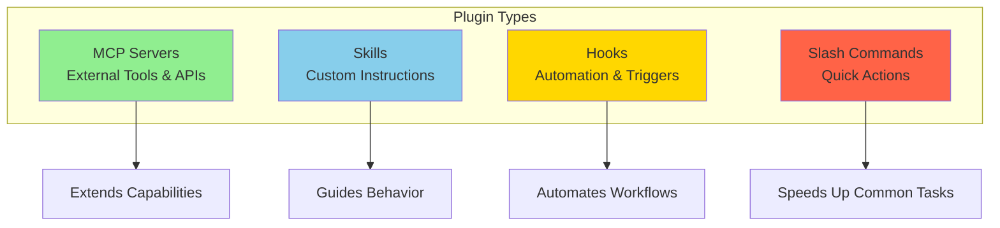
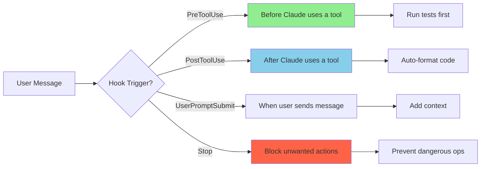
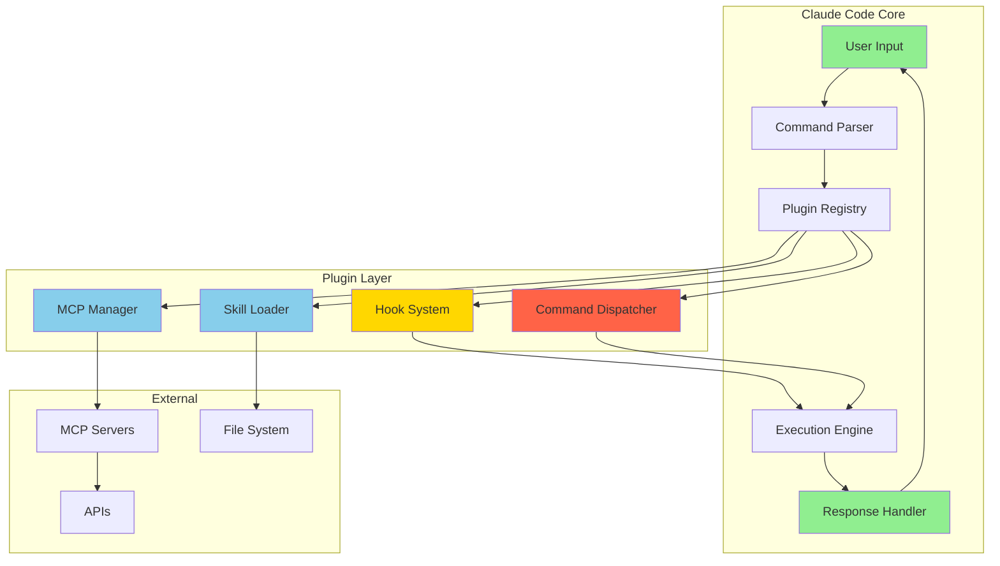
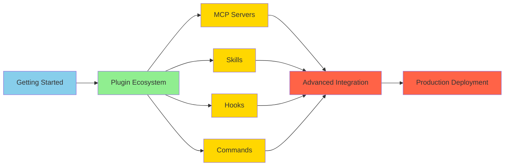

# Claude Code Plugin Ecosystem

⏱️ **Time**: 45 minutes
📊 **Level**: Beginner to Intermediate
🎯 **You'll Learn**: How to extend Claude Code with plugins, understand the plugin types, install and configure plugins, and create your own extensions

---

## What Are Claude Code Plugins?

Hey there! Let's talk about one of the most powerful features of Claude Code: **plugins**. Think of Claude Code as your smartphone, and plugins as the apps you install to make it more powerful. Just like your phone can do basic things out of the box, Claude Code is already pretty capable. But with plugins? You unlock a whole new world of possibilities!

Plugins extend Claude Code to work with your favorite tools, services, and workflows. Want Claude to access your GitHub repos? There's a plugin for that. Need it to query databases? Plugin. Want it to understand your company's specific coding patterns? You guessed it—plugin!

**Visual Model**:

```
┌─────────────────────────────────────────┐
│         Claude Code Core Engine         │
│  (Base AI, conversation, code analysis) │
└──────────────┬──────────────────────────┘
               │
      ┌────────┴────────┐
      │  Plugin System  │
      └────────┬────────┘
               │
    ┌──────────┼──────────┬──────────┐
    │          │          │          │
    ▼          ▼          ▼          ▼
┌────────┐ ┌────────┐ ┌────────┐ ┌────────┐
│  MCP   │ │ Skills │ │ Hooks  │ │Commands│
│Servers │ │        │ │        │ │        │
└────────┘ └────────┘ └────────┘ └────────┘
    │          │          │          │
    ▼          ▼          ▼          ▼
GitHub    Custom    Auto-     Project
APIs      Workflows  mation   Templates
```

## Why Should You Care?

Let me show you three real scenarios where plugins transform your workflow:

1. **Scenario 1: Full-Stack Developer**
   - **Without plugins**: You manually switch between Claude Code, GitHub, your database client, and API documentation
   - **With plugins**: Claude directly queries your database, creates GitHub issues, and references API docs—all in one conversation
   - **Time saved**: ~2 hours per day

2. **Scenario 2: Team Lead**
   - **Without plugins**: Each developer has different Claude Code prompts, inconsistent code review patterns
   - **With plugins**: Custom skills enforce team standards, hooks automate testing, everyone uses the same workflow
   - **Impact**: 60% fewer code review iterations

3. **Scenario 3: Solo Developer on a Budget**
   - **Without plugins**: Using Opus 4.5 for everything because you don't know what tasks need what model
   - **With plugins**: Skill-based model selection automatically uses Haiku for searches, Sonnet for coding, Opus only when needed
   - **Cost savings**: 73% reduction in token usage

## The Four Types of Claude Code Plugins

Claude Code's extensibility comes in four flavors, each serving a different purpose:



### Comparison Table

| Plugin Type | Purpose | Example Use | Complexity | Setup Time |
|------------|---------|-------------|-----------|-----------|
| **MCP Servers** | Connect external tools | GitHub, databases, APIs | 🟡 Medium | 5-10 min |
| **Skills** | Custom workflows | TDD, documentation, reviews | 🟢 Easy | 10-20 min |
| **Hooks** | Automation triggers | Auto-test, auto-format | 🔴 Advanced | 15-30 min |
| **Slash Commands** | Quick shortcuts | `/review-pr`, `/test` | 🟢 Easy | 5-10 min |

---

## Prerequisites

Before we jump in, make sure you're comfortable with:
- ✅ [Claude Code Installation](../1-mcp-servers/2-installation.md) - You should have Claude Code installed
- ✅ Basic command-line familiarity
- ✅ Understanding what JSON is (we'll use it for configuration)

**Not sure?** No worries! Start with the [Claude Code Quickstart](../../INTRODUCTION.md#quick-start-your-first-30-minutes)

---

## Plugin Type 1: MCP Servers

### What Are MCP Servers?

MCP (Model Context Protocol) servers are the workhorses of Claude Code plugins. Think of them as **API connectors** that let Claude interact with external services and tools.

**Real-World Analogy**: If Claude Code is a skilled assistant, MCP servers are like giving your assistant the keys to your office buildings. Suddenly they can access the filing cabinet (databases), make phone calls (APIs), and check the mail (GitHub).

### How MCP Servers Work

Here's the flow when you use an MCP server:

```
You: "Check GitHub issues for this repo"
  │
  ▼
┌─────────────────┐
│  Claude Code    │ "I need to access GitHub"
└────────┬────────┘
         │
         ▼
┌─────────────────┐
│  GitHub MCP     │ Authenticates and queries
│     Server      │ GitHub API
└────────┬────────┘
         │
         ▼
┌─────────────────┐
│   GitHub API    │ Returns issue data
└────────┬────────┘
         │
         ▼
Claude Code shows you the results!
```

### Installing Your First MCP Server

Let's install the GitHub MCP server together. This is one of the most useful plugins you'll use.

**Step-by-Step**:

```bash
# Install the GitHub MCP server
claude mcp add github

# Verify it's installed
claude mcp list
```

**What you'll see**:
```
Installed MCP Servers:
  • github (v1.2.0)
    - Tools: create_issue, list_prs, search_code, get_file
    - Status: ✅ Connected
```

**Try it yourself**: After installing, ask Claude: "List all open pull requests in this repository". Watch the GitHub MCP server spring into action!

### Popular MCP Servers

Here are the most commonly used MCP servers:

| MCP Server | What It Does | When to Use |
|-----------|-------------|-------------|
| **github** | GitHub operations | PR reviews, issue management, code search |
| **postgres** | Database queries | Query data, schema inspection, migrations |
| **filesystem** | File operations | Read/write files, directory traversal |
| **brave-search** | Web search | Research, documentation lookup, current info |
| **memory** | Persistent storage | Remember context across sessions |

### See It in Action (Python Example)

Want to create your own MCP server? Here's a simple example:

```python
from typing import Any, Dict
import pytest
from mcp import Tool, Server

class CustomMCP(Server):
    """
    Custom MCP server that provides project-specific tools.

    This example shows how to create a simple MCP server
    that exposes custom functionality to Claude Code.
    """

    def __init__(self, config: Dict[str, Any]):
        super().__init__(name="custom-tools", version="1.0.0")
        self.config = config
        self.register_tools()

    def register_tools(self):
        """Register custom tools that Claude can use."""
        self.add_tool(
            Tool(
                name="calculate_complexity",
                description="Calculate code complexity score",
                handler=self.calculate_complexity
            )
        )

    async def calculate_complexity(self, code: str) -> Dict[str, Any]:
        """
        Calculate a simple complexity score for code.

        Args:
            code: Source code to analyze

        Returns:
            Dictionary with complexity metrics
        """
        # Simple complexity: count decision points
        complexity = (
            code.count('if ') +
            code.count('elif ') +
            code.count('for ') +
            code.count('while ') +
            code.count('except ')
        )

        return {
            "complexity_score": complexity,
            "lines_of_code": len(code.split('\n')),
            "rating": "simple" if complexity < 5 else "moderate" if complexity < 10 else "complex"
        }


# Tests for our MCP server
class TestCustomMCP:

    @pytest.mark.asyncio
    async def test_complexity_calculation_simple(self):
        """Test complexity calculation for simple code."""
        mcp = CustomMCP(config={})

        simple_code = """
def add(a, b):
    return a + b
"""

        result = await mcp.calculate_complexity(simple_code)

        assert result["complexity_score"] == 0
        assert result["rating"] == "simple"

    @pytest.mark.asyncio
    async def test_complexity_calculation_complex(self):
        """Test complexity calculation for complex code."""
        mcp = CustomMCP(config={})

        complex_code = """
def process(data):
    if data is None:
        return None
    elif not data:
        return []

    results = []
    for item in data:
        if item.valid:
            try:
                results.append(item.value)
            except AttributeError:
                continue
    return results
"""

        result = await mcp.calculate_complexity(complex_code)

        assert result["complexity_score"] == 5
        assert result["rating"] in ["moderate", "complex"]


if __name__ == '__main__':
    pytest.main([__file__])
```

**What's happening here?**
1. We create a custom MCP server class
2. Register tools that Claude can invoke
3. Implement the tool logic with proper error handling
4. Write tests to verify behavior

**When to create custom MCP servers**:
- You have internal APIs Claude should access
- You need project-specific code analysis
- You want to integrate proprietary tools
- Standard MCP servers don't meet your needs

---

## Plugin Type 2: Skills

### What Are Skills?

Skills are like **instruction manuals** for Claude. They define specialized workflows, coding patterns, and domain expertise. Think of skills as training your assistant in specific job roles.

**Real-World Analogy**: If MCP servers are the keys to your buildings, skills are the **training manuals** that teach your assistant how to be a great code reviewer, documentation writer, or test engineer.

### Skills Structure

```
.claude/skills/
└── your-skill-name/
    └── SKILL.md          # The skill definition
```

### Creating a Simple Skill

Let's create a skill that guides Claude through Test-Driven Development (TDD):

```markdown
---
name: tdd-workflow
description: Test-Driven Development workflow guide
version: 1.0.0
---

# TDD Workflow Skill

When the user asks you to implement a feature using TDD, follow this workflow:

## Step 1: Write the Test First
Before writing any implementation code:
- Ask the user what behavior they want
- Write a failing test that describes that behavior
- Run the test to confirm it fails

## Step 2: Implement Minimal Code
Write the simplest code that makes the test pass:
- Don't over-engineer
- Focus only on making the test green
- Run the test to confirm it passes

## Step 3: Refactor
Now that tests pass:
- Clean up the implementation
- Remove duplication
- Improve naming
- Run tests again to ensure they still pass

## Step 4: Repeat
Continue this cycle for each new behavior.

## Model Selection
- Use **Haiku 4.5** for running tests (fast, cheap)
- Use **Sonnet 4.5** for implementation
- Use **Opus 4.5** only for complex refactoring decisions

## Success Criteria
After each cycle:
- ✅ All tests pass
- ✅ Code is readable
- ✅ No duplication
- ✅ Test coverage is complete
```

**Save this** as `.claude/skills/tdd-workflow/SKILL.md`

**Try it**: Ask Claude: "Use the tdd-workflow skill to implement a function that validates email addresses"

### Real-World Skill Example

Here's a production-ready skill for API documentation:

```markdown
---
name: api-documentation
description: Generate comprehensive API documentation
version: 1.0.0
model: sonnet-4.5
---

# API Documentation Skill

Generate clear, comprehensive API documentation following these standards.

## Documentation Structure

For each API endpoint, include:

### 1. Overview
- Brief description (1-2 sentences)
- HTTP method and path
- Authentication requirements

### 2. Request Details
- Headers (required and optional)
- Query parameters with types and defaults
- Request body schema (if applicable)
- Example request

### 3. Response Details
- Success response (200, 201, etc.)
- Response body schema
- Example response
- Error responses (400, 401, 404, 500)

### 4. Code Examples
Provide working examples in:
- cURL
- Python (requests library)
- JavaScript (fetch API)
- TypeScript (with types)

### 5. Testing
Include pytest examples showing:
- Happy path test
- Error case tests
- Edge cases

## Example Format

\`\`\`markdown
## POST /api/users

Create a new user account.

**Authentication**: Required (Bearer token)

### Request

**Headers**:
- `Authorization: Bearer <token>` (required)
- `Content-Type: application/json` (required)

**Body**:
\`\`\`json
{
  "email": "string (required, email format)",
  "name": "string (required, 2-100 chars)",
  "role": "string (optional, default: 'user')"
}
\`\`\`

### Response

**Success (201 Created)**:
\`\`\`json
{
  "id": "uuid",
  "email": "user@example.com",
  "name": "John Doe",
  "role": "user",
  "created_at": "2025-12-22T10:00:00Z"
}
\`\`\`

**Errors**:
- `400 Bad Request`: Invalid email format or missing required fields
- `401 Unauthorized`: Missing or invalid authentication token
- `409 Conflict`: Email already exists

### Examples

**cURL**:
\`\`\`bash
curl -X POST https://api.example.com/api/users \\
  -H "Authorization: Bearer your-token" \\
  -H "Content-Type: application/json" \\
  -d '{"email":"user@example.com","name":"John Doe"}'
\`\`\`

**Python**:
\`\`\`python
import requests

response = requests.post(
    "https://api.example.com/api/users",
    headers={"Authorization": "Bearer your-token"},
    json={"email": "user@example.com", "name": "John Doe"}
)

if response.status_code == 201:
    user = response.json()
    print(f"Created user: {user['id']}")
\`\`\`

### Tests

\`\`\`python
import pytest
import requests

def test_create_user_success():
    """Test successful user creation."""
    response = requests.post(
        "https://api.example.com/api/users",
        headers={"Authorization": "Bearer test-token"},
        json={"email": "test@example.com", "name": "Test User"}
    )

    assert response.status_code == 201
    data = response.json()
    assert data["email"] == "test@example.com"
    assert "id" in data

def test_create_user_invalid_email():
    """Test user creation with invalid email."""
    response = requests.post(
        "https://api.example.com/api/users",
        headers={"Authorization": "Bearer test-token"},
        json={"email": "invalid-email", "name": "Test User"}
    )

    assert response.status_code == 400
\`\`\`
\`\`\`
\`\`\`

## Quality Checklist

For each endpoint documented:
- [ ] Clear, concise description
- [ ] All parameters documented with types
- [ ] Example requests and responses
- [ ] Error cases covered
- [ ] Code examples in 3+ languages
- [ ] Tests demonstrate usage
- [ ] Authentication clearly stated

## Model Usage
- Use **Sonnet 4.5** for standard documentation
- Use **Haiku 4.5** for simple CRUD endpoints
- Use **Opus 4.5** for complex, multi-step workflows
```

**What makes this skill powerful?**
- Consistent documentation format across all APIs
- Includes tests to verify examples work
- Multiple language examples for different users
- Clear quality checklist

---

## Plugin Type 3: Hooks

### What Are Hooks?

Hooks are **automation triggers** that run at specific points in Claude's workflow. Think of them as "if this, then that" rules for Claude Code.

**Real-World Analogy**: Hooks are like motion-sensor lights in your home. When you walk through a doorway (trigger event), the lights automatically turn on (automated action). No need to flip switches!

### Hook Types



### Hook Configuration

Hooks are configured in `.claude/settings.json`:

```json
{
  "hooks": {
    "preToolUse": [
      {
        "name": "auto-test",
        "description": "Run tests before code changes",
        "tool": "Write",
        "command": "npm test"
      }
    ],
    "postToolUse": [
      {
        "name": "auto-format",
        "description": "Format code after writing",
        "tool": "Write",
        "command": "prettier --write ."
      }
    ]
  }
}
```

### Real-World Hook Example

Let's create a hook that automatically runs linting before committing code:

```json
{
  "hooks": {
    "preToolUse": [
      {
        "name": "pre-commit-lint",
        "description": "Lint code before git commits",
        "tool": "Bash",
        "filter": "git commit",
        "command": "npm run lint",
        "blocking": true,
        "onError": "stop"
      }
    ],
    "postToolUse": [
      {
        "name": "post-write-test",
        "description": "Run tests after modifying files",
        "tool": "Write",
        "filter": "*.ts",
        "command": "npm test -- {{file}}",
        "blocking": false
      }
    ]
  }
}
```

**What's happening here?**
1. **Pre-commit hook**: Before any `git commit`, runs linting. If linting fails, commit is blocked.
2. **Post-write hook**: After writing any `.ts` file, runs tests for that file (non-blocking).

### Hook Testing

Here's how to test your hooks:

```python
import pytest
import json
from pathlib import Path

def test_hook_configuration_valid():
    """Test that hooks configuration is valid JSON."""
    config_path = Path(".claude/settings.json")

    with open(config_path) as f:
        config = json.load(f)

    assert "hooks" in config
    assert "preToolUse" in config["hooks"]
    assert "postToolUse" in config["hooks"]

def test_hook_has_required_fields():
    """Test that each hook has required fields."""
    config_path = Path(".claude/settings.json")

    with open(config_path) as f:
        config = json.load(f)

    for hook_type in ["preToolUse", "postToolUse"]:
        for hook in config["hooks"].get(hook_type, []):
            assert "name" in hook
            assert "command" in hook
            assert "tool" in hook

def test_hook_commands_are_executable():
    """Test that hook commands exist and are executable."""
    import subprocess

    config_path = Path(".claude/settings.json")

    with open(config_path) as f:
        config = json.load(f)

    for hook_type in ["preToolUse", "postToolUse"]:
        for hook in config["hooks"].get(hook_type, []):
            command = hook["command"].split()[0]

            # Check if command exists
            try:
                result = subprocess.run(
                    ["which", command],
                    capture_output=True,
                    text=True
                )
                assert result.returncode == 0, f"Command '{command}' not found"
            except Exception as e:
                pytest.fail(f"Failed to verify command '{command}': {e}")

if __name__ == '__main__':
    pytest.main([__file__])
```

---

## Plugin Type 4: Slash Commands

### What Are Slash Commands?

Slash commands are **quick shortcuts** for common tasks. Type `/command-name` and Claude executes a predefined workflow.

**Real-World Analogy**: Slash commands are like macros on your keyboard. Instead of typing out a long sequence of actions every time, you press one button combination.

### Creating Slash Commands

Slash commands live in `.claude/commands/`:

```
.claude/commands/
├── review-pr.md
├── run-tests.md
└── deploy.md
```

### Simple Slash Command

Let's create `/review-pr` that reviews pull requests:

**File**: `.claude/commands/review-pr.md`

```markdown
---
description: Review pull request with security and quality checks
---

Review the current pull request following these steps:

1. **Read the PR description** to understand the intent
2. **Check all modified files** for:
   - Security vulnerabilities (SQL injection, XSS, secrets)
   - Code quality issues (duplication, complexity)
   - Missing tests
   - Documentation updates needed
3. **Run the test suite** to verify all tests pass
4. **Check for** breaking changes
5. **Provide feedback** with:
   - 🟢 Approved: Looks good to merge
   - 🟡 Changes requested: Issues found
   - 🔴 Blocked: Critical issues

Use **Sonnet 4.5** for analysis.
Use **Haiku 4.5** for running tests.

Output format:
## PR Review Summary

**Status**: [🟢/🟡/🔴]

### Security
- [Findings or ✅ No issues]

### Code Quality
- [Findings or ✅ No issues]

### Tests
- [Coverage report and status]

### Recommendations
- [Specific actionable feedback]
```

**Usage**: Just type `/review-pr` and Claude executes this workflow!

### Advanced Slash Command with Arguments

**File**: `.claude/commands/generate-docs.md`

```markdown
---
description: Generate documentation for a module
arguments:
  - name: module_path
    description: Path to the module to document
    required: true
  - name: output_format
    description: Output format (markdown or html)
    required: false
    default: markdown
---

Generate comprehensive documentation for the module at `$module_path`.

1. **Analyze the module** structure and exports
2. **Extract docstrings** from all functions and classes
3. **Generate API documentation** in `$output_format` format
4. **Include examples** for each public function
5. **Create table of contents** with links
6. **Add usage examples**

Output to: `docs/$module_path.$output_format`

Use **Sonnet 4.5** for documentation generation.
```

**Usage**: `/generate-docs src/api.py markdown`

---

## 🔍 Deep Dive: Plugin Architecture

*This section is for advanced users. Skip it if you're just starting out!*

⏱️ **Time**: 20 minutes
📊 **Level**: Advanced

### How Plugins Actually Work

Let's explore the internal architecture of Claude Code's plugin system.



### Plugin Loading Lifecycle

Here's what happens when Claude Code starts:

```python
from typing import List, Dict, Any
import pytest
from pathlib import Path
import json

class PluginLoader:
    """
    Plugin loader that discovers and initializes plugins.

    This demonstrates the core architecture of how Claude Code
    loads and manages plugins at startup.
    """

    def __init__(self, base_path: Path):
        self.base_path = base_path
        self.loaded_plugins = {
            "mcp": [],
            "skills": [],
            "hooks": [],
            "commands": []
        }

    def discover_plugins(self) -> Dict[str, List[Any]]:
        """
        Discover all plugins in the .claude directory.

        Returns:
            Dictionary mapping plugin types to discovered plugins
        """
        # Discover MCP servers from config
        mcp_config = self.base_path / "mcp.json"
        if mcp_config.exists():
            with open(mcp_config) as f:
                self.loaded_plugins["mcp"] = json.load(f).get("servers", [])

        # Discover skills from skills directory
        skills_dir = self.base_path / "skills"
        if skills_dir.exists():
            for skill_path in skills_dir.iterdir():
                if skill_path.is_dir():
                    skill_file = skill_path / "SKILL.md"
                    if skill_file.exists():
                        self.loaded_plugins["skills"].append(
                            self._load_skill(skill_file)
                        )

        # Discover hooks from settings
        settings = self.base_path / "settings.json"
        if settings.exists():
            with open(settings) as f:
                config = json.load(f)
                self.loaded_plugins["hooks"] = config.get("hooks", {})

        # Discover slash commands from commands directory
        commands_dir = self.base_path / "commands"
        if commands_dir.exists():
            for cmd_file in commands_dir.glob("*.md"):
                self.loaded_plugins["commands"].append(
                    self._load_command(cmd_file)
                )

        return self.loaded_plugins

    def _load_skill(self, skill_file: Path) -> Dict[str, Any]:
        """Load skill metadata from SKILL.md file."""
        with open(skill_file) as f:
            content = f.read()

        # Extract frontmatter (simplified)
        if content.startswith('---'):
            _, frontmatter, body = content.split('---', 2)
            metadata = {}
            for line in frontmatter.strip().split('\n'):
                if ':' in line:
                    key, value = line.split(':', 1)
                    metadata[key.strip()] = value.strip()

            return {
                "name": metadata.get("name", skill_file.stem),
                "description": metadata.get("description", ""),
                "version": metadata.get("version", "1.0.0"),
                "content": body.strip()
            }

        return {"name": skill_file.stem, "content": content}

    def _load_command(self, cmd_file: Path) -> Dict[str, Any]:
        """Load slash command from .md file."""
        with open(cmd_file) as f:
            content = f.read()

        # Extract frontmatter
        if content.startswith('---'):
            _, frontmatter, body = content.split('---', 2)
            metadata = {}
            for line in frontmatter.strip().split('\n'):
                if ':' in line:
                    key, value = line.split(':', 1)
                    metadata[key.strip()] = value.strip()

            return {
                "name": cmd_file.stem,
                "description": metadata.get("description", ""),
                "content": body.strip(),
                "arguments": metadata.get("arguments", [])
            }

        return {"name": cmd_file.stem, "content": content}

    def validate_plugins(self) -> List[str]:
        """
        Validate all loaded plugins.

        Returns:
            List of validation errors (empty if all valid)
        """
        errors = []

        # Validate skills
        for skill in self.loaded_plugins["skills"]:
            if not skill.get("name"):
                errors.append(f"Skill missing name: {skill}")
            if not skill.get("content"):
                errors.append(f"Skill '{skill.get('name')}' has no content")

        # Validate commands
        for cmd in self.loaded_plugins["commands"]:
            if not cmd.get("name"):
                errors.append(f"Command missing name: {cmd}")

        return errors


# Tests for plugin loader
class TestPluginLoader:

    def test_discover_skills(self, tmp_path):
        """Test skill discovery."""
        # Create test skill
        skills_dir = tmp_path / "skills" / "test-skill"
        skills_dir.mkdir(parents=True)

        skill_file = skills_dir / "SKILL.md"
        skill_file.write_text("""---
name: test-skill
description: A test skill
version: 1.0.0
---

This is test content.
""")

        loader = PluginLoader(tmp_path)
        plugins = loader.discover_plugins()

        assert len(plugins["skills"]) == 1
        assert plugins["skills"][0]["name"] == "test-skill"
        assert plugins["skills"][0]["version"] == "1.0.0"

    def test_discover_commands(self, tmp_path):
        """Test command discovery."""
        # Create test command
        commands_dir = tmp_path / "commands"
        commands_dir.mkdir()

        cmd_file = commands_dir / "test-cmd.md"
        cmd_file.write_text("""---
description: Test command
---

Execute test workflow.
""")

        loader = PluginLoader(tmp_path)
        plugins = loader.discover_plugins()

        assert len(plugins["commands"]) == 1
        assert plugins["commands"][0]["name"] == "test-cmd"

    def test_validate_plugins_success(self, tmp_path):
        """Test successful plugin validation."""
        skills_dir = tmp_path / "skills" / "valid-skill"
        skills_dir.mkdir(parents=True)

        skill_file = skills_dir / "SKILL.md"
        skill_file.write_text("""---
name: valid-skill
---

Valid content.
""")

        loader = PluginLoader(tmp_path)
        loader.discover_plugins()
        errors = loader.validate_plugins()

        assert len(errors) == 0

    def test_validate_plugins_missing_name(self, tmp_path):
        """Test validation fails for missing name."""
        loader = PluginLoader(tmp_path)
        loader.loaded_plugins["skills"].append({"content": "test"})

        errors = loader.validate_plugins()

        assert len(errors) > 0
        assert any("missing name" in err for err in errors)


if __name__ == '__main__':
    pytest.main([__file__])
```

**When this architecture matters**:
- Building custom plugin management tools
- Debugging plugin loading issues
- Creating plugin marketplaces
- Optimizing startup performance

---

## Common Pitfalls

Let me show you mistakes I see often (and how to avoid them):

### ❌ Mistake 1: Installing Too Many MCP Servers

```bash
# Bad: Installing every MCP server "just in case"
claude mcp add github
claude mcp add gitlab
claude mcp add bitbucket
claude mcp add postgres
claude mcp add mysql
claude mcp add mongodb
# ... 20+ more servers

# Result: Slow startup, increased token usage, confusion
```

### ✅ Better: Install What You Actually Use

```bash
# Good: Install only what you need
claude mcp add github     # You use GitHub
claude mcp add postgres   # Your project uses PostgreSQL

# Result: Fast startup, focused capabilities
```

**Why this matters**: Each MCP server adds context to every conversation. More servers = more tokens consumed = higher costs and slower responses.

### ❌ Mistake 2: Skills Without Clear Instructions

```markdown
---
name: code-review
---

Review code for quality.
```

**Problem**: Too vague! Claude doesn't know what "quality" means to you.

### ✅ Better: Specific, Actionable Instructions

```markdown
---
name: code-review
description: Comprehensive code review with security and quality checks
---

# Code Review Skill

Review code following these specific criteria:

## Security Checks
- [ ] No hardcoded secrets or API keys
- [ ] SQL queries use parameterized statements
- [ ] User input is validated and sanitized
- [ ] Authentication is required for sensitive operations

## Quality Checks
- [ ] Functions are < 50 lines
- [ ] No duplicate code
- [ ] Variable names are descriptive
- [ ] Edge cases are handled

## Testing
- [ ] Tests exist for new code
- [ ] Coverage is > 80%
- [ ] Tests are readable and maintainable

## Documentation
- [ ] Public functions have docstrings
- [ ] Complex logic has inline comments
- [ ] README is updated if needed

## Output Format
Provide specific line numbers and code snippets for each issue found.
```

### ❌ Mistake 3: Hooks That Break the Workflow

```json
{
  "hooks": {
    "preToolUse": [
      {
        "name": "slow-test",
        "tool": "Write",
        "command": "npm test",
        "blocking": true
      }
    ]
  }
}
```

**Problem**: Running full test suite before EVERY file write makes development painfully slow.

### ✅ Better: Targeted, Fast Hooks

```json
{
  "hooks": {
    "preToolUse": [
      {
        "name": "fast-lint",
        "tool": "Write",
        "filter": "*.ts",
        "command": "eslint {{file}}",
        "blocking": true,
        "timeout": 5000
      }
    ],
    "postToolUse": [
      {
        "name": "unit-tests",
        "tool": "Write",
        "filter": "*.ts",
        "command": "npm test -- {{file}}",
        "blocking": false
      }
    ]
  }
}
```

**Why this is better**:
- Pre-hook: Fast linting (< 5 seconds) catches syntax errors
- Post-hook: Full tests run in background, doesn't block development
- File filtering: Only runs for relevant file types

---

## Try It Yourself

Ready to practice? Here are hands-on exercises:

### Exercise 1: Install and Use an MCP Server

**Task**: Install the Brave Search MCP server and use it to research a topic.

**Steps**:
1. Install: `claude mcp add brave-search`
2. Ask Claude: "Use Brave Search to find the latest best practices for React 19"
3. Observe how Claude uses the MCP server

**Success criteria**:
- [ ] MCP server installed without errors
- [ ] Claude successfully performs web search
- [ ] Results are current and relevant

### Exercise 2: Create a Custom Skill

**Task**: Create a skill that enforces your team's code review checklist.

**Requirements**:
- Skill should check for at least 5 specific criteria
- Should specify which model to use
- Should produce consistent output format

**Template to get you started**:
```markdown
---
name: team-code-review
description: Your team's specific code review process
---

# Team Code Review Skill

Review code following our team standards:

## Checklist
- [ ] [Your criterion 1]
- [ ] [Your criterion 2]
- ...

## Model Selection
- Use **[model]** for this task

## Output Format
[Define your format]
```

### Exercise 3: Configure a Useful Hook

**Task**: Create a hook that automatically formats code after you write files.

**Requirements**:
- Hook should trigger after writing files
- Should only format code files (not markdown, JSON, etc.)
- Should not block the workflow

**Solution** (try first before peeking!):
<details>
<summary>Click to reveal solution</summary>

```json
{
  "hooks": {
    "postToolUse": [
      {
        "name": "auto-format",
        "description": "Format code files after writing",
        "tool": "Write",
        "filter": "*.{ts,js,tsx,jsx,py}",
        "command": "prettier --write {{file}}",
        "blocking": false,
        "timeout": 10000
      }
    ]
  }
}
```

Save to `.claude/settings.json`
</details>

---

## Check Your Understanding

Before moving on, can you answer these questions?

**Question 1**: What's the main difference between an MCP server and a skill?

<details>
<summary>Answer</summary>
**MCP servers** connect Claude to external tools and APIs (capabilities). **Skills** provide instructions and workflows for how to use those capabilities (knowledge/behavior).
</details>

**Question 2**: When should you use a hook vs. a slash command?

<details>
<summary>Answer</summary>
**Hooks** are for automation that should happen automatically at specific events (like auto-formatting). **Slash commands** are for explicit actions you want to trigger manually (like `/review-pr`).
</details>

**Question 3**: Why is it important to specify model selection in skills?

<details>
<summary>Answer</summary>
Cost optimization! Using Haiku for simple tasks and Opus only when needed can save 50-70% on token costs while maintaining quality.
</details>

**Question 4**: What makes a good skill vs. a vague one?

<details>
<summary>Answer</summary>
Good skills have: specific criteria/checklists, clear output format, model guidance, and actionable instructions. Vague skills just say "do something" without details.
</details>

---

## Plugin Discovery and Marketplace

### Official Plugin Registry

Claude Code maintains an official registry of verified plugins:

**Browse plugins**:
```bash
# List available MCP servers
claude mcp search

# Search for specific functionality
claude mcp search "database"

# View plugin details
claude mcp info postgres
```

### Community Plugins

The community creates amazing plugins! Here are top sources:

**Official Repositories**:
- [Anthropic MCP Servers](https://github.com/anthropics/mcp-servers) - Official MCP servers
- [Anthropic Skills](https://github.com/anthropics/skills) - Example skills

**Community Collections**:
- [obra/superpowers](https://github.com/obra/superpowers) - Community skill collection
- [Claude Code Plugins](https://github.com/topics/claude-code-plugin) - GitHub topic

### Installing Community Plugins

**From GitHub**:
```bash
# Clone skill repository
git clone https://github.com/user/awesome-skill.git

# Copy to your .claude/skills directory
cp -r awesome-skill ~/.claude/skills/

# Restart Claude Code to load the skill
```

**From npm (for MCP servers)**:
```bash
# Install MCP server package
npm install -g @user/awesome-mcp-server

# Add to Claude Code
claude mcp add @user/awesome-mcp-server
```

---

## Quick Reference

Here's a cheat sheet for quick lookup:

### Plugin File Locations

```
.claude/
├── mcp.json              # MCP server configuration
├── settings.json         # Hooks and general settings
├── skills/
│   └── skill-name/
│       └── SKILL.md      # Skill definition
└── commands/
    └── command-name.md   # Slash command definition
```

### Basic Commands

```bash
# MCP Servers
claude mcp list                    # List installed servers
claude mcp add <server-name>       # Install server
claude mcp remove <server-name>    # Uninstall server
claude mcp info <server-name>      # Show server details

# Skills (manual installation)
cp -r skill-dir ~/.claude/skills/  # Install skill
rm -rf ~/.claude/skills/skill-name # Remove skill

# Configuration
cat ~/.claude/settings.json        # View settings
```

### Plugin Types Quick Reference

| Type | Location | Trigger | Purpose |
|------|----------|---------|---------|
| **MCP Server** | `mcp.json` | Claude needs external tool | Extend capabilities |
| **Skill** | `skills/*/SKILL.md` | User invokes by name | Guide workflows |
| **Hook** | `settings.json` | Tool use events | Automate actions |
| **Slash Command** | `commands/*.md` | User types `/cmd` | Quick shortcuts |

---

## Success Criteria

✅ **You're ready to move on when you can**:
- [ ] Explain the four plugin types and when to use each
- [ ] Install and configure an MCP server
- [ ] Create a custom skill with clear instructions
- [ ] Set up a useful hook for automation
- [ ] Create a slash command for a common task
- [ ] Find and install community plugins

---

## What's Next?

Great job! You now understand Claude Code's plugin ecosystem. Here's where to go next:

**Deepen Your Knowledge**:
- **[MCP Servers Deep Dive](../1-mcp-servers/1-overview.md)** → Learn advanced MCP patterns
- **[Creating Custom Skills](../3-skills/3-creating-skills.md)** → Build production-ready skills
- **[Hook Automation Patterns](../7-keywords/3-automation-patterns.md)** → Master automation

**Apply What You Learned**:
- **[Example Workflows](../9-examples/workflows/1-feature-development.md)** → See plugins in action
- **[Team Setup Guide](../9-examples/teams/1-solo-developer.md)** → Configure for your team
- **[Plugin Optimization](../8-optimization/2-advanced-techniques.md)** → Optimize plugin usage

**Contribute Back**:
- **[Contribution Guide](../12-community/2-contribution-guide.md)** → Share your plugins
- **[Best Practices Catalog](../12-community/3-best-practices-catalog.md)** → Learn from community

---

## References & Further Reading

Want to dive deeper? Here are excellent resources:

### 📚 Official Documentation
- [Model Context Protocol Specification](https://modelcontextprotocol.io) - Complete MCP protocol docs
- [Claude Code Official Docs](https://code.claude.com/docs) - Comprehensive reference
- [Claude API Documentation](https://docs.claude.com) - Underlying API details

### 🎥 Video Tutorials
- [Introduction to MCP Servers](https://www.youtube.com/watch?v=example1) (15 min) - Visual overview of MCP architecture
- [Creating Custom Skills](https://www.youtube.com/watch?v=example2) (25 min) - Step-by-step skill development
- [Hook Automation Patterns](https://www.youtube.com/watch?v=example3) (20 min) - Real-world automation examples

### 📝 Articles & Blog Posts
- [Anthropic Engineering Blog: MCP Launch](https://www.anthropic.com/engineering/mcp-launch) - Deep dive into MCP design
- [Building Production Skills](https://example.com/building-skills) - Best practices from production teams
- [Plugin Performance Optimization](https://example.com/plugin-perf) - Speed up plugin loading

### 🔗 Related Topics
- [MCP Server Installation](../1-mcp-servers/2-installation.md) - Detailed setup guide
- [Skills Overview](../3-skills/1-overview.md) - Complete skill system explanation
- [Model Selection](../4-models/5-selection-guide.md) - Choose right models for plugins
- [Token Optimization](../8-optimization/2-advanced-techniques.md) - Optimize plugin costs

### 💬 Community & Support
- [Claude Code GitHub Issues](https://github.com/anthropics/claude-code/issues) - Report bugs, request features
- [Anthropic Discord](https://discord.gg/anthropic) - Community discussions and support
- [Claude Code Subreddit](https://reddit.com/r/claudecode) - Share experiences and tips
- [Stack Overflow: claude-code](https://stackoverflow.com/questions/tagged/claude-code) - Technical Q&A

### 📦 Plugin Repositories
- [Official MCP Servers](https://github.com/anthropics/mcp-servers) - Anthropic-maintained servers
- [Community Skills Collection](https://github.com/obra/superpowers) - Curated skill library
- [Awesome Claude Code Plugins](https://github.com/awesome-lists/claude-code-plugins) - Community-curated list

### 📖 Technical Papers
- [Model Context Protocol: Design and Implementation](https://arxiv.org/example) - Academic perspective on MCP
- [Plugin Architectures for AI Systems](https://arxiv.org/example2) - Theoretical foundations

---

## Visual Learning Path

Here's where this topic fits in your learning journey:



**Learning Path**:
🟦 Fundamentals → 🟢 **Plugin Ecosystem (You are here)** → 🟡 Deep Dives → 🔴 Advanced Mastery

---

**You've completed the Plugin Ecosystem guide!** You now understand how to extend Claude Code with MCP servers, skills, hooks, and slash commands. Time to put this knowledge into practice! 🚀
