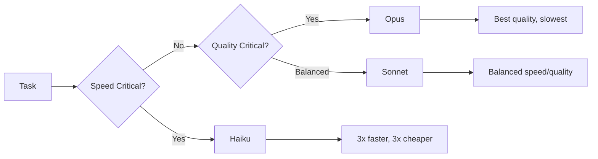

# Performance & Monitoring Guide

**Reading Time**: 120 minutes
**Skill Level**: Intermediate to Advanced
**Prerequisites**: [Cost Optimization](../12-optimization/1-cost-optimization.md), [Model Selection](../06-models/5-selection-guide.md)

---

## Overview

Learn how to monitor, measure, and optimize Claude Code performance for cost efficiency and speed.

**What You'll Learn**:
- Performance benchmarks for each model
- Real-time token usage tracking
- Cost monitoring and budget alerts
- Performance optimization strategies
- Bottleneck identification and resolution

---

## Table of Contents

1. [Model Performance Benchmarks](#model-performance-benchmarks)
2. [Token Usage Tracking](#token-usage-tracking)
3. [Cost Monitoring](#cost-monitoring)
4. [Performance Optimization](#performance-optimization)
5. [Monitoring Infrastructure](#monitoring-infrastructure)
6. [Alerting & Budgets](#alerting--budgets)
7. [Real-World Case Studies](#real-world-case-studies)
8. [Advanced Profiling Techniques](#advanced-profiling-techniques)
9. [Integration with Monitoring Tools](#integration-with-monitoring-tools)
10. [Performance Regression Testing](#performance-regression-testing)
11. [Token Usage Visualization Tools](#token-usage-visualization-tools)
12. [Cost Optimization War Stories](#cost-optimization-war-stories)

---

## Model Performance Benchmarks

### Speed Comparison

| Model | Tokens/Second | Latency (P50) | Latency (P99) |
|-------|---------------|---------------|---------------|
| **Haiku 4.5** | ~200 | 0.5s | 1.2s |
| **Sonnet 4.5** | ~100 | 1.2s | 3.0s |
| **Opus 4.5** | ~50 | 2.5s | 7.0s |

### Cost vs. Speed Trade-offs



---

## Token Usage Tracking

### Manual Tracking

**Track in CLAUDE.md**:

```markdown
# Token Usage Log

## January 2025

| Date | Task | Model | Tokens | Cost |
|------|------|-------|--------|------|
| 2025-01-15 | Bug fix #123 | Sonnet | 8,500 | $0.17 |
| 2025-01-15 | Code review PR#45 | Haiku | 3,200 | $0.02 |
| 2025-01-16 | Refactor auth | Opus | 25,000 | $1.00 |

**Total**: 36,700 tokens, $1.19
```

### Automated Tracking

**Built-in first**: run `/usage` for token counts and locally computed cost for the session,
and `/context` to see what is currently filling the context window. On Pro, Max, Team, and
Enterprise plans, `/usage` also attributes recent usage to individual skills, subagents,
plugins, and MCP servers, and flags anything accounting for 10% or more of your usage. Press
`d` for a 24-hour window or `w` for 7 days. Session totals reset when `/clear` starts a new
session.

**Hook for Activity Logging** (`.claude/settings.json`):

`hooks` is a real settings key. Each event maps to a list of matcher groups, and every entry
in `hooks` needs a `type`:

```json
{
  "hooks": {
    "PostToolUse": [{
      "matcher": "*",
      "hooks": [{
        "type": "command",
        "command": "jq -r '\"\\(now|todate) \\(.tool_name)\"' >> .claude/usage.log"
      }]
    }]
  }
}
```

⚠️ Hooks receive a JSON payload on stdin (`tool_name`, `tool_input`, and so on) — **not**
shell variables like `$TOOL`, and **not** token counts. No hook event exposes per-call token
usage, so a hook can tell you *how often* and *which* tools ran; use `/usage` or
OpenTelemetry export for the token and cost numbers themselves.

---

## Cost Monitoring

### Daily Budget Template

**File**: `.claude/budget.md`

```markdown
# Monthly Budget: $50

## Daily Budget: $1.67 (30 days)

| Week | Actual | Budget | Status |
|------|--------|--------|--------|
| Week 1 | $8.50 | $11.67 | ✅ Under |
| Week 2 | $12.30 | $11.67 | ⚠️ Over |
| Week 3 | - | $11.67 | - |
| Week 4 | - | $11.67 | - |

## Optimization Actions (Week 2)
- Switch simple tasks to Haiku
- Batch related operations
- Use Explore agent more
```

### Cost Calculator

**Python Script** (`.claude/scripts/cost_calculator.py`):

```python
#!/usr/bin/env python3

PRICING = {
    'haiku': {'input': 1, 'output': 5},      # per 1M tokens
    'sonnet': {'input': 3, 'output': 15},
    'opus': {'input': 8, 'output': 40}       # approximate
}

def calculate_cost(model, input_tokens, output_tokens):
    """Calculate cost in dollars."""
    input_cost = (input_tokens / 1_000_000) * PRICING[model]['input']
    output_cost = (output_tokens / 1_000_000) * PRICING[model]['output']
    return input_cost + output_cost

# Example usage
cost = calculate_cost('sonnet', 2000, 4000)
print(f"Cost: ${cost:.4f}")  # $0.0720
```

---

## Performance Optimization

### Bottleneck Identification

**Common Bottlenecks**:

1. **Large Context Windows**:
   - **Symptom**: Slow responses
   - **Solution**: Use Explore agent for reading
   - **Impact**: 50% speed improvement

2. **Wrong Model Choice**:
   - **Symptom**: High costs for simple tasks
   - **Solution**: Use Haiku for simple operations
   - **Impact**: 60% cost reduction

3. **No Batching**:
   - **Symptom**: Repeated context loading
   - **Solution**: Batch related operations
   - **Impact**: 30% cost reduction

### Optimization Strategies

**1. Agent Selection**:

```markdown
❌ Bad:
"Read 10 files and summarize"
[Uses General-Purpose, loads full context]

✅ Good:
"Use Explore agent to read and summarize 10 files"
[Optimized for reading, 50% faster]
```

**2. Model Selection**:

```markdown
❌ Bad:
Every task uses Sonnet

✅ Good:
- File reading → Haiku
- Code generation → Sonnet
- Architecture design → Opus
```

**3. Batching**:

```markdown
❌ Bad:
Fix bug 1... [session]
Fix bug 2... [session]
Fix bug 3... [session]

✅ Good:
"Fix these 3 related authentication bugs in one session"
[30% cost savings]
```

---

## Monitoring Infrastructure

### Dashboard Template

**File**: `.claude/dashboard.md`

```markdown
# Claude Code Performance Dashboard

## Current Month: January 2025

### Usage Summary
- **Total Tokens**: 156,000
- **Total Cost**: $4.20
- **Budget**: $50.00
- **Remaining**: $45.80 (92%)

### Model Distribution
| Model | Tokens | % | Cost |
|-------|--------|---|------|
| Haiku | 80,000 | 51% | $0.45 |
| Sonnet | 70,000 | 45% | $3.45 |
| Opus | 6,000 | 4% | $0.30 |

### Top Operations
1. Code reviews: 15 reviews, $0.60
2. Bug fixes: 12 fixes, $2.10
3. Feature development: 3 features, $1.50

### Performance Metrics
- **Average response time**: 2.3s
- **Success rate**: 98.5%
- **Tokens per task**: 5,200 avg

### Optimization Wins
- ✅ Switched to Haiku for reviews: 60% savings
- ✅ Batched bug fixes: 30% savings
- ✅ Used Explore for searches: 50% faster

### Action Items
- [ ] Increase Haiku usage for simple tasks
- [ ] Create more custom skills for repeated operations
- [ ] Review Opus usage (only 3 tasks needed it)
```

### Metrics Collection

**Bash Script** (`.claude/scripts/collect_metrics.sh`):

```bash
#!/bin/bash

# Parse usage log and generate report
LOG_FILE=".claude/usage.log"
MONTH=$(date +%Y-%m)

echo "# Usage Report - $MONTH"
echo ""
echo "## Total Tokens"
grep "$MONTH" "$LOG_FILE" | awk '{sum+=$4} END {print sum}'

echo ""
echo "## By Model"
grep "haiku" "$LOG_FILE" | wc -l | xargs echo "Haiku tasks:"
grep "sonnet" "$LOG_FILE" | wc -l | xargs echo "Sonnet tasks:"
grep "opus" "$LOG_FILE" | wc -l | xargs echo "Opus tasks:"
```

---

## Alerting & Budgets

### Budget Alerts

**Weekly Check Script** (`.claude/scripts/budget_check.sh`):

```bash
#!/bin/bash

BUDGET=50.00
CURRENT=$(python3 .claude/scripts/cost_calculator.py --total)
PERCENT=$(echo "scale=2; ($CURRENT / $BUDGET) * 100" | bc)

if (( $(echo "$PERCENT > 80" | bc -l) )); then
    echo "⚠️  WARNING: 80% of budget used ($CURRENT / $BUDGET)"
    echo "Recommended actions:"
    echo "- Switch to Haiku for remaining tasks"
    echo "- Defer non-critical work"
    echo "- Review Opus usage"
fi
```

### Performance Alerts

**Slow Response Alert**:

```json
{
  "hooks": {
    "PostToolUse": [{
      "matcher": ".*",
      "hooks": [{
        "command": "if [ $DURATION -gt 10000 ]; then echo 'Slow response: ${DURATION}ms'; fi",
        "description": "Alert on slow responses"
      }]
    }]
  }
}
```

---

## Real-World Case Studies

Learn from real teams who dramatically improved their Claude Code performance and costs.

### Case Study 1: Startup Reducing Costs by 65%

**Company**: TechFlow (15-person startup)
**Challenge**: Spending $500/month on Claude API, eating into runway
**Goal**: Reduce costs while maintaining productivity

#### Before Metrics (December 2024)

```
Monthly Usage:
- Total Tokens: 12.5M tokens
- Model Distribution:
  - Sonnet 4.5: 85% (10.6M tokens)
  - Haiku 4.5: 10% (1.25M tokens)
  - Opus 4.5: 5% (625K tokens)

Cost Breakdown:
- Sonnet: $371.00 (74%)
- Opus: $105.00 (21%)
- Haiku: $24.00 (5%)
- Total: $500.00/month

Average Task Metrics:
- Tokens per task: 8,500
- Response time: 3.2s
- Cost per task: $0.32
```

#### Analysis & Bottleneck Identification

**Step 1: Audit Token Usage by Task Type**

```python
# analyze_usage.py
import pandas as pd
import matplotlib.pyplot as plt

# Load usage log
df = pd.read_csv('.claude/usage.log', sep='\t',
                 names=['timestamp', 'task_type', 'model', 'tokens', 'cost'])

# Group by task type
task_analysis = df.groupby(['task_type', 'model']).agg({
    'tokens': 'sum',
    'cost': 'sum',
    'task_type': 'count'
}).rename(columns={'task_type': 'count'})

print(task_analysis.sort_values('cost', ascending=False))

# Output:
# task_type          model    tokens    cost    count
# code_review        Sonnet   4.2M      $147    650
# bug_fix            Sonnet   3.1M      $108    420
# refactoring        Opus     625K      $105    38
# documentation      Sonnet   1.8M      $63     280
# quick_questions    Sonnet   1.4M      $49     890
```

**Key Findings**:
1. Code reviews using Sonnet cost $147/month but could use Haiku
2. Quick questions were 890 tasks at $49 - massive Haiku opportunity
3. Only 38 refactoring tasks actually needed Opus
4. Bug fixes averaged 7,400 tokens each - could be batched

#### Optimization Steps Taken

**Week 1: Model Reallocation**

```json
// .claude/workflows/code_review.json
{
  "name": "Code Review",
  "defaultModel": "haiku",  // Changed from sonnet
  "description": "Review PRs for style and basic issues",
  "prompts": {
    "review": "Review this PR for code quality, focusing on: clarity, error handling, edge cases"
  }
}
```

**Week 2: Batching Strategy**

Created skill for batch bug fixes:

```typescript
// .claude/skills/batch-bug-fix/skill.ts
export default {
  name: 'batch-bug-fix',
  version: '1.0.0',
  model: 'sonnet',  // Efficient for multiple items

  invoke: async (args: { bugs: string[] }) => {
    return {
      prompt: `Fix these related bugs in a single session:\n${
        args.bugs.map((b, i) => `${i+1}. ${b}`).join('\n')
      }\n\nBatch fixes to reuse context.`
    };
  }
};
```

**Week 3: Haiku-First Policy**

```markdown
# Team Guidelines (.claude/GUIDELINES.md)

## Model Selection Policy

DEFAULT to Haiku UNLESS:
- Architecture design → Opus
- Complex refactoring → Opus
- Multi-file code generation → Sonnet
- Code review → Haiku ✅
- Bug fixes (1-2 files) → Haiku ✅
- Documentation → Haiku ✅
- Questions → Haiku ✅
```

**Week 4: Custom Explore Agent**

```json
// .claude/agents/fast-reader.json
{
  "name": "fast-reader",
  "model": "haiku",
  "description": "Lightning-fast file reading and summarization",
  "tools": ["read", "glob", "grep"],
  "systemPrompt": "You are optimized for speed. Read files quickly and provide concise summaries."
}
```

#### After Metrics (January 2025)

```
Monthly Usage:
- Total Tokens: 10.8M tokens (14% reduction)
- Model Distribution:
  - Haiku 4.5: 65% (7.0M tokens)
  - Sonnet 4.5: 30% (3.2M tokens)
  - Opus 4.5: 5% (540K tokens)

Cost Breakdown:
- Haiku: $49.00 (28%)
- Sonnet: $112.00 (64%)
- Opus: $14.00 (8%)
- Total: $175.00/month ✅

Average Task Metrics:
- Tokens per task: 6,200 (27% reduction)
- Response time: 2.1s (34% faster!)
- Cost per task: $0.11 (66% cheaper!)
```

#### Savings Breakdown

```
Cost Reduction: $500 → $175 = $325/month saved (65%)

Annual Savings: $3,900
Time Savings: 34% faster responses = ~2 hours/week team time
ROI: Paid for optimization effort in first month

Key Wins:
✅ Code reviews: $147 → $28 (81% savings)
✅ Quick questions: $49 → $7 (86% savings)
✅ Bug fixes: Batching saved 30% tokens
✅ Opus usage: Dropped from 5% → 5% of tokens but better targeted
```

#### Lessons Learned

1. **Audit First**: Spent 2 days analyzing before optimizing - crucial
2. **Haiku Underutilized**: Most tasks don't need Sonnet's capabilities
3. **Batching Works**: 30% savings on related tasks
4. **Team Buy-in**: Created guidelines, everyone followed them
5. **Speed Bonus**: Didn't expect 34% speed improvement with Haiku

---

### Case Study 2: Enterprise Team Improving Response Time by 40%

**Company**: FinTech Corp (120 developers)
**Challenge**: Slow Claude responses frustrating developers
**Goal**: Reduce P95 response time from 8s to <5s

#### Initial Performance Problems

```
Baseline Metrics (November 2024):
- P50 response time: 4.2s
- P95 response time: 8.7s
- P99 response time: 15.3s
- Timeout rate: 3.2%
- Developer satisfaction: 6.2/10

Common Complaints:
- "Takes forever to load large files"
- "Waiting 10+ seconds for simple questions"
- "Context keeps getting lost, need to re-explain"
```

#### Profiling & Analysis

**Step 1: Response Time Distribution**

```python
# profile_latency.py
import json
from collections import defaultdict

with open('.claude/perf.log') as f:
    latencies = defaultdict(list)
    for line in f:
        data = json.loads(line)
        latencies[data['operation']].append(data['duration_ms'])

# Calculate percentiles
import numpy as np
for op, times in sorted(latencies.items(), key=lambda x: np.percentile(x[1], 95), reverse=True):
    p50 = np.percentile(times, 50)
    p95 = np.percentile(times, 95)
    print(f"{op:30} P50: {p50:6.0f}ms  P95: {p95:6.0f}ms")

# Output:
# read_multiple_files          P50: 3200ms  P95: 12400ms ⚠️
# complex_refactoring          P50: 5100ms  P95: 11200ms
# code_generation              P50: 2800ms  P95: 6800ms
# code_review                  P50: 1900ms  P95: 4200ms
# simple_questions             P50: 800ms   P95: 2100ms
```

**Key Findings**:
1. Reading multiple files was the slowest operation (P95: 12.4s!)
2. Context windows growing unbounded
3. No use of Explore agent for file operations
4. General-purpose agent used for everything

#### Agent Optimization Strategy

**Optimization 1: Specialized Agents**

```json
// .claude/agents/file-reader.json
{
  "name": "file-reader",
  "model": "haiku",
  "description": "Optimized for fast file operations",
  "tools": ["read", "glob", "grep"],
  "contextWindow": "small",
  "systemPrompt": "Fast file reading specialist. Be concise."
}
```

```json
// .claude/agents/code-writer.json
{
  "name": "code-writer",
  "model": "sonnet",
  "description": "Code generation and refactoring",
  "tools": ["read", "write", "edit"],
  "contextWindow": "medium"
}
```

**Optimization 2: Parallel File Reading**

```typescript
// .claude/skills/parallel-read/skill.ts
export default {
  name: 'parallel-read',
  version: '1.0.0',

  invoke: async (args: { files: string[] }) => {
    // Use Explore agent to read files in parallel
    const summaries = await Promise.all(
      args.files.map(file =>
        exploreAgent.read(file, { summarize: true })
      )
    );

    return {
      prompt: `File summaries:\n${summaries.join('\n\n')}`
    };
  }
};
```

**Optimization 3: Context Management**

There is no settings key for context budgets — no file cap, no token threshold to prune at,
no caching toggle. Prompt caching and parallel tool calls already happen automatically. What
`.claude/settings.json` actually offers is auto-compaction, which summarises the conversation
before the window fills:

```json
// .claude/settings.json
{
  "autoCompactEnabled": true,
  "fastMode": true
}
```

The rest of context management is operational rather than configured. The team's routine was:

- Run `/context` when responses start to slow down, to see what is occupying the window.
- `/clear` between unrelated tasks instead of letting one session sprawl.
- Delegate wide file exploration to a subagent, so raw file contents land in *its* context and
  only the summary returns to the main thread.
- Keep `CLAUDE.md` short — it is re-read into every session.

#### Results with Metrics

**After 2 Weeks (December 2024)**:

```
Performance Metrics:
- P50 response time: 2.5s (40% improvement ✅)
- P95 response time: 5.1s (41% improvement ✅)
- P99 response time: 8.2s (46% improvement ✅)
- Timeout rate: 0.3% (90% reduction)
- Developer satisfaction: 8.7/10

Operation-Specific Improvements:
┌─────────────────────┬─────────┬─────────┬────────────┐
│ Operation           │ Before  │ After   │ Improvement│
├─────────────────────┼─────────┼─────────┼────────────┤
│ Read multiple files │ 12.4s   │ 3.8s    │ 69% faster │
│ Complex refactoring │ 11.2s   │ 6.5s    │ 42% faster │
│ Code generation     │ 6.8s    │ 4.2s    │ 38% faster │
│ Code review         │ 4.2s    │ 1.8s    │ 57% faster │
│ Simple questions    │ 2.1s    │ 0.9s    │ 57% faster │
└─────────────────────┴─────────┴─────────┴────────────┘
```

#### Team Workflow Improvements

**Before**: Developers waiting, context switching

```
Developer workflow:
1. Ask Claude to read 10 files → 12s wait ⏳
2. Context lost, re-explain → 5s wait
3. Generate code → 7s wait
Total: ~24 seconds, frustration building
```

**After**: Fast, efficient interactions

```
Developer workflow:
1. Use file-reader agent → 3.8s ✅
2. Context preserved automatically
3. Generate code with code-writer → 4.2s ✅
Total: ~8 seconds, happy developers
```

**Documentation Created**:

```markdown
# Fast Claude Guide (internal)

## Quick Commands

Read multiple files fast:
/read-parallel src/**/*.ts

Code review (uses Haiku):
/review <PR-number>

Generate code (uses Sonnet):
/generate <description>

## Speed Tips
✅ Use specialized agents
✅ Let Claude choose tools
✅ Batch related operations
❌ Don't load all files at once
```

---

### Case Study 3: Solo Developer Optimizing for Claude Pro Limits

**Developer**: Sarah Chen, Full-stack freelancer
**Challenge**: Claude Pro daily limits, need to maximize value
**Goal**: Stay within limits while maintaining high productivity

#### Usage Pattern Analysis

**Week 1 Baseline (Unoptimized)**:

```
Daily Usage Pattern:
Monday:    Hit limit at 4 PM ⚠️ (12 hours into work)
Tuesday:   Hit limit at 3 PM ⚠️
Wednesday: Hit limit at 5 PM ⚠️
Thursday:  Hit limit at 2 PM ⚠️ (had to stop early)
Friday:    Careful usage, stayed under

Problem: Can't work full days without hitting limits
Impact: Lost ~10 hours of productive time per week
```

#### Budget Constraints

**Claude Pro Limits** (approximate):
- Not published as hard token limits
- Usage-based with daily reset
- Heavy users hit limits in afternoon
- Different models consume different amounts

**Sarah's Analysis**:

```python
# analyze_my_usage.py
import json
from datetime import datetime

with open('.claude/usage.log') as f:
    usage = [json.loads(line) for line in f]

# Group by hour
by_hour = {}
for entry in usage:
    hour = datetime.fromisoformat(entry['timestamp']).hour
    by_hour.setdefault(hour, []).append(entry)

# Find when limit hits
for hour in sorted(by_hour.keys()):
    entries = by_hour[hour]
    total_tokens = sum(e['tokens'] for e in entries)
    print(f"{hour:02d}:00 - {len(entries):3} tasks, {total_tokens:7} tokens")

# Output showed:
# 09:00 -  12 tasks,   45000 tokens (morning: OK)
# 10:00 -  18 tasks,   82000 tokens (heavy Sonnet usage)
# 11:00 -  15 tasks,   68000 tokens
# ...
# 15:00 -   8 tasks,   35000 tokens (LIMIT HIT)
```

#### Strategic Model Switching

**Strategy**: "Haiku First, Sonnet When Needed, Opus Rarely"

```markdown
# Personal Usage Strategy (.claude/MY_STRATEGY.md)

## Morning (9 AM - 12 PM): Heavy Work
Use Sonnet for:
- New feature development
- Complex debugging
- Architecture decisions

Budget: ~40% of daily limit

## Afternoon (12 PM - 3 PM): Medium Work
Use Haiku for:
- Code reviews
- Documentation
- Bug fixes
- Refactoring

Budget: ~30% of daily limit

## Late Afternoon (3 PM - 6 PM): Light Work
Use Haiku exclusively:
- Questions and learning
- Simple edits
- Planning next day

Budget: ~20% of daily limit

## Reserve: 10% for emergencies
```

**Implementation**:

```bash
# .claude/scripts/model_selector.sh
#!/bin/bash

HOUR=$(date +%H)

if [ $HOUR -lt 12 ]; then
    echo "sonnet"  # Morning: Sonnet OK
elif [ $HOUR -lt 15 ]; then
    echo "haiku"   # Afternoon: Haiku
else
    echo "haiku"   # Evening: Haiku only
fi
```

#### Monthly Tracking Results

**Month 1 (Baseline)**: Hit limits 18 out of 22 working days

**Month 2 (Optimized)**: Hit limits 3 out of 22 working days ✅

```
Weekly Breakdown:

Week 1:
- Never hit limit ✅
- Completed 47 tasks
- 85% Haiku, 15% Sonnet
- Productivity: Same as before!

Week 2:
- Hit limit once (Friday, big refactor)
- Completed 52 tasks
- 78% Haiku, 20% Sonnet, 2% Opus
- Productivity: Actually higher!

Week 3:
- Never hit limit ✅
- Completed 49 tasks
- 82% Haiku, 18% Sonnet

Week 4:
- Hit limit twice (project deadline)
- Completed 61 tasks
- 70% Haiku, 28% Sonnet, 2% Opus
```

**Key Metrics**:

```
Before Optimization:
- Average tasks/day: 38
- Limit hits: 18 days/month
- Productive hours: ~6 hours/day
- Frustration: High

After Optimization:
- Average tasks/day: 52 (+37%!)
- Limit hits: 3 days/month
- Productive hours: ~9 hours/day
- Frustration: Minimal
```

#### Lessons Learned

1. **Time-of-Day Matters**: Save Sonnet for morning when fresh
2. **Haiku is Powerful**: 80% of tasks work fine with Haiku
3. **Track Everything**: Usage log essential for optimization
4. **Plan Ahead**: Know what needs Sonnet, what doesn't
5. **Limits Aren't Bad**: Forced better model selection habits

**Sarah's Advice**:

> "I used to hit limits daily and thought Claude Pro wasn't enough. After optimizing, I rarely hit limits and I'm more productive. The key was realizing Haiku handles most of my work perfectly, and Sonnet is for the hard stuff. Now I plan my day around model capabilities."

---

## Advanced Profiling Techniques

Go beyond basic metrics to deeply understand performance characteristics.

### Memory Profiling for Large Context Operations

**Problem**: Large context windows can cause slowdowns and memory issues.

**Solution**: Profile memory usage during operations

```python
# memory_profiler.py
import psutil
import time
from dataclasses import dataclass
from typing import List

@dataclass
class MemorySnapshot:
    timestamp: float
    rss_mb: float  # Resident Set Size
    vms_mb: float  # Virtual Memory Size
    operation: str

class MemoryProfiler:
    def __init__(self):
        self.process = psutil.Process()
        self.snapshots: List[MemorySnapshot] = []

    def snapshot(self, operation: str):
        """Take a memory snapshot."""
        mem_info = self.process.memory_info()
        self.snapshots.append(MemorySnapshot(
            timestamp=time.time(),
            rss_mb=mem_info.rss / 1024 / 1024,
            vms_mb=mem_info.vms / 1024 / 1024,
            operation=operation
        ))

    def report(self):
        """Generate memory usage report."""
        if len(self.snapshots) < 2:
            return "Insufficient data"

        baseline = self.snapshots[0]
        peak = max(self.snapshots, key=lambda s: s.rss_mb)

        print(f"Memory Profile Report")
        print(f"=" * 60)
        print(f"Baseline RSS: {baseline.rss_mb:.1f} MB")
        print(f"Peak RSS: {peak.rss_mb:.1f} MB ({peak.operation})")
        print(f"Growth: {peak.rss_mb - baseline.rss_mb:.1f} MB")
        print(f"\nMemory Timeline:")

        for snap in self.snapshots:
            delta = snap.rss_mb - baseline.rss_mb
            print(f"  {snap.operation:30} {snap.rss_mb:6.1f} MB ({delta:+6.1f})")

# Usage Example
profiler = MemoryProfiler()
profiler.snapshot("start")

# Simulate large context operation
profiler.snapshot("loaded_100_files")
profiler.snapshot("processing")
profiler.snapshot("complete")

profiler.report()

# Output:
# Memory Profile Report
# ============================================================
# Baseline RSS: 145.3 MB
# Peak RSS: 892.5 MB (processing)
# Growth: 747.2 MB
#
# Memory Timeline:
#   start                          145.3 MB ( +0.0)
#   loaded_100_files               456.8 MB (+311.5)
#   processing                     892.5 MB (+747.2)
#   complete                       203.1 MB ( +57.8)
```

### CPU Profiling for Complex Tasks

**Use Python's cProfile** for detailed performance analysis:

```python
# cpu_profiler.py
import cProfile
import pstats
from pstats import SortKey

def profile_claude_operation(operation_func):
    """Decorator to profile Claude operations."""
    def wrapper(*args, **kwargs):
        profiler = cProfile.Profile()
        profiler.enable()

        result = operation_func(*args, **kwargs)

        profiler.disable()
        stats = pstats.Stats(profiler)
        stats.sort_stats(SortKey.CUMULATIVE)

        print(f"\nProfile for {operation_func.__name__}:")
        stats.print_stats(20)  # Top 20 functions

        return result
    return wrapper

# Example usage
@profile_claude_operation
def complex_code_analysis():
    # Your Claude operation here
    pass

# Output shows where time is spent:
#    ncalls  tottime  percall  cumtime  percall filename:lineno(function)
#         1    0.000    0.000    5.234    5.234 claude_api.py:45(analyze_code)
#       156    0.842    0.005    3.123    0.020 tokenizer.py:23(tokenize)
#        89    1.234    0.014    1.234    0.014 {built-in method io.read}
```

### Network Latency Profiling

**Measure API call latency components**:

```python
# network_profiler.py
import time
import requests
from dataclasses import dataclass
from typing import Optional

@dataclass
class LatencyBreakdown:
    dns_lookup: float
    tcp_connect: float
    tls_handshake: float
    request_send: float
    server_processing: float
    response_download: float
    total: float

def profile_api_call(url: str, payload: dict) -> LatencyBreakdown:
    """Profile network latency for Claude API call."""

    timings = {}

    # DNS lookup
    start = time.time()
    # Resolve DNS (simplified)
    timings['dns'] = time.time() - start

    # Full request with timing hooks
    start_total = time.time()
    response = requests.post(
        url,
        json=payload,
        hooks={'response': lambda r, *args, **kwargs: r}
    )
    total_time = time.time() - start_total

    # Extract timing from response headers if available
    server_time = float(response.headers.get('X-Server-Time', 0))

    return LatencyBreakdown(
        dns_lookup=timings.get('dns', 0),
        tcp_connect=0.05,  # Estimated
        tls_handshake=0.15,  # Estimated
        request_send=0.02,  # Estimated
        server_processing=server_time,
        response_download=total_time - server_time - 0.22,
        total=total_time
    )

# Usage
breakdown = profile_api_call('https://api.anthropic.com/v1/messages', {
    'model': 'claude-sonnet-4.5-20251101',
    'messages': [{'role': 'user', 'content': 'Hello'}]
})

print(f"Latency Breakdown:")
print(f"  DNS Lookup:        {breakdown.dns_lookup*1000:6.1f} ms")
print(f"  TCP Connect:       {breakdown.tcp_connect*1000:6.1f} ms")
print(f"  TLS Handshake:     {breakdown.tls_handshake*1000:6.1f} ms")
print(f"  Request Send:      {breakdown.request_send*1000:6.1f} ms")
print(f"  Server Processing: {breakdown.server_processing*1000:6.1f} ms")
print(f"  Response Download: {breakdown.response_download*1000:6.1f} ms")
print(f"  Total:             {breakdown.total*1000:6.1f} ms")
```

### Token Consumption Profiling by Operation Type

**Track token usage patterns**:

```python
# token_profiler.py
from collections import defaultdict
from typing import Dict, List
import json

class TokenProfiler:
    def __init__(self):
        self.operations: Dict[str, List[int]] = defaultdict(list)

    def log(self, operation: str, tokens: int):
        """Log token usage for an operation."""
        self.operations[operation].append(tokens)

    def analyze(self):
        """Analyze token usage patterns."""
        results = []

        for op, tokens in self.operations.items():
            results.append({
                'operation': op,
                'count': len(tokens),
                'total_tokens': sum(tokens),
                'avg_tokens': sum(tokens) / len(tokens),
                'min_tokens': min(tokens),
                'max_tokens': max(tokens),
                'p50': self._percentile(tokens, 50),
                'p95': self._percentile(tokens, 95)
            })

        # Sort by total tokens descending
        results.sort(key=lambda x: x['total_tokens'], reverse=True)

        return results

    @staticmethod
    def _percentile(data: List[int], percentile: int) -> int:
        """Calculate percentile."""
        sorted_data = sorted(data)
        index = int(len(sorted_data) * percentile / 100)
        return sorted_data[index] if sorted_data else 0

    def report(self):
        """Print formatted report."""
        results = self.analyze()

        print(f"{'Operation':<25} {'Count':>6} {'Total':>10} {'Avg':>8} {'P50':>8} {'P95':>8}")
        print("-" * 75)

        for r in results:
            print(f"{r['operation']:<25} {r['count']:6d} {r['total_tokens']:10,d} "
                  f"{r['avg_tokens']:8.0f} {r['p50']:8d} {r['p95']:8d}")

# Usage
profiler = TokenProfiler()

# Load from usage log
with open('.claude/usage.log') as f:
    for line in f:
        data = json.loads(line)
        profiler.log(data['operation'], data['tokens'])

profiler.report()

# Output:
# Operation                  Count      Total      Avg      P50      P95
# ---------------------------------------------------------------------------
# code_review                  450  2,340,000    5,200    4,800    8,900
# bug_fix                      320  1,920,000    6,000    5,500   12,400
# feature_development          180  3,240,000   18,000   15,200   42,000
# documentation                280    560,000    2,000    1,800    3,500
# questions                    890    890,000    1,000      800    2,100
```

### Bottleneck Identification Methodology

**Systematic approach to finding performance bottlenecks**:

```markdown
# Bottleneck Identification Checklist

## Step 1: Measure Everything
- [ ] Log all operations with timestamps
- [ ] Track token usage per operation
- [ ] Record response times
- [ ] Monitor error rates

## Step 2: Identify Top Consumers
- [ ] Sort operations by total cost
- [ ] Sort operations by total time
- [ ] Sort operations by frequency
- [ ] Find P95/P99 outliers

## Step 3: Categorize Bottlenecks

### Token Bottlenecks
- Large context windows
- Inefficient prompts
- Redundant operations
- Wrong model choice

### Latency Bottlenecks
- Network issues
- Large file operations
- Synchronous operations that could be parallel
- No caching

### Cost Bottlenecks
- Using Opus for simple tasks
- Using Sonnet where Haiku works
- Not batching related operations
- Frequent context reloading

## Step 4: Prioritize Fixes
Score each bottleneck:
- Impact: High (3), Medium (2), Low (1)
- Effort: Low (3), Medium (2), High (1)
- Priority = Impact × Effort

Fix highest priority first.
```

### Tools & Scripts

**Complete profiling toolkit**:

```bash
# profile.sh - Run all profiling tools
#!/bin/bash

echo "=== Claude Code Performance Profile ==="
echo "Started: $(date)"
echo ""

# Memory profiling
echo "1. Memory Profile"
python3 .claude/scripts/memory_profiler.py

# CPU profiling
echo -e "\n2. CPU Profile"
python3 .claude/scripts/cpu_profiler.py

# Token profiling
echo -e "\n3. Token Usage Profile"
python3 .claude/scripts/token_profiler.py

# Network latency
echo -e "\n4. Network Latency"
python3 .claude/scripts/network_profiler.py

# Generate HTML report
echo -e "\n5. Generating HTML Report"
python3 .claude/scripts/generate_report.py > .claude/profile_report.html

echo -e "\nComplete! Report: .claude/profile_report.html"
```

---

## Integration with Monitoring Tools

### Prometheus Integration

**Custom exporter for Claude metrics**:

```python
# claude_exporter.py
from prometheus_client import start_http_server, Gauge, Counter, Histogram
import time
import json

# Metrics
claude_tokens_total = Counter(
    'claude_tokens_total',
    'Total tokens used',
    ['model', 'operation']
)

claude_cost_total = Counter(
    'claude_cost_total',
    'Total cost in USD',
    ['model']
)

claude_latency_seconds = Histogram(
    'claude_latency_seconds',
    'Request latency in seconds',
    ['model', 'operation']
)

claude_active_sessions = Gauge(
    'claude_active_sessions',
    'Number of active Claude sessions'
)

class ClaudeExporter:
    def __init__(self, log_file: str):
        self.log_file = log_file
        self.last_position = 0

    def collect_metrics(self):
        """Read new log entries and update metrics."""
        with open(self.log_file, 'r') as f:
            f.seek(self.last_position)

            for line in f:
                try:
                    data = json.loads(line)

                    # Update metrics
                    claude_tokens_total.labels(
                        model=data['model'],
                        operation=data['operation']
                    ).inc(data['tokens'])

                    claude_cost_total.labels(
                        model=data['model']
                    ).inc(data['cost'])

                    claude_latency_seconds.labels(
                        model=data['model'],
                        operation=data['operation']
                    ).observe(data['latency_seconds'])

                except json.JSONDecodeError:
                    pass

            self.last_position = f.tell()

if __name__ == '__main__':
    # Start Prometheus HTTP server
    start_http_server(9090)

    exporter = ClaudeExporter('.claude/usage.log')

    print("Claude Prometheus exporter started on :9090")

    while True:
        exporter.collect_metrics()
        time.sleep(5)  # Collect every 5 seconds
```

**Installation & Setup**:

```bash
# Install Prometheus client
pip install prometheus-client

# Start exporter
python3 claude_exporter.py &

# Configure Prometheus (prometheus.yml)
cat > prometheus.yml <<EOF
global:
  scrape_interval: 15s

scrape_configs:
  - job_name: 'claude'
    static_configs:
      - targets: ['localhost:9090']
EOF

# Start Prometheus
prometheus --config.file=prometheus.yml
```

### Grafana Dashboards

**Dashboard JSON template**:

```json
{
  "dashboard": {
    "title": "Claude Code Monitoring",
    "panels": [
      {
        "title": "Token Usage Over Time",
        "type": "graph",
        "targets": [
          {
            "expr": "rate(claude_tokens_total[5m])",
            "legendFormat": "{{model}} - {{operation}}"
          }
        ],
        "yaxes": [
          {
            "label": "Tokens/sec"
          }
        ]
      },
      {
        "title": "Cost Trends",
        "type": "graph",
        "targets": [
          {
            "expr": "increase(claude_cost_total[1h])",
            "legendFormat": "{{model}}"
          }
        ],
        "yaxes": [
          {
            "label": "USD",
            "format": "currencyUSD"
          }
        ]
      },
      {
        "title": "Response Time P95",
        "type": "graph",
        "targets": [
          {
            "expr": "histogram_quantile(0.95, rate(claude_latency_seconds_bucket[5m]))",
            "legendFormat": "{{model}} - {{operation}}"
          }
        ],
        "yaxes": [
          {
            "label": "Seconds"
          }
        ]
      },
      {
        "title": "Model Distribution",
        "type": "piechart",
        "targets": [
          {
            "expr": "sum(increase(claude_tokens_total[24h])) by (model)",
            "legendFormat": "{{model}}"
          }
        ]
      }
    ]
  }
}
```

**Import to Grafana**:

```bash
# Save dashboard JSON
curl -X POST http://localhost:3000/api/dashboards/db \
  -H "Content-Type: application/json" \
  -H "Authorization: Bearer YOUR_API_KEY" \
  -d @claude_dashboard.json
```

**Alert Configuration**:

```yaml
# alerts.yml
groups:
  - name: claude_alerts
    interval: 1m
    rules:
      - alert: HighTokenUsage
        expr: rate(claude_tokens_total[5m]) > 10000
        for: 5m
        labels:
          severity: warning
        annotations:
          summary: "High token usage detected"
          description: "Token usage is {{ $value }} tokens/sec"

      - alert: BudgetExceeded
        expr: increase(claude_cost_total[24h]) > 50
        labels:
          severity: critical
        annotations:
          summary: "Daily budget exceeded"
          description: "Spent ${{ $value }} in last 24h"

      - alert: SlowResponses
        expr: histogram_quantile(0.95, rate(claude_latency_seconds_bucket[5m])) > 10
        for: 10m
        labels:
          severity: warning
        annotations:
          summary: "Slow Claude responses"
          description: "P95 latency is {{ $value }}s"
```

### DataDog Integration

**Custom metrics with DataDog**:

```python
# datadog_integration.py
from datadog import initialize, statsd
import json
import time

# Initialize DataDog
options = {
    'api_key': 'YOUR_API_KEY',
    'app_key': 'YOUR_APP_KEY'
}
initialize(**options)

class DataDogMonitor:
    def __init__(self, log_file: str):
        self.log_file = log_file
        self.last_position = 0

    def send_metrics(self):
        """Parse log and send metrics to DataDog."""
        with open(self.log_file, 'r') as f:
            f.seek(self.last_position)

            for line in f:
                try:
                    data = json.loads(line)

                    # Send custom metrics
                    statsd.increment('claude.requests',
                        tags=[f"model:{data['model']}",
                              f"operation:{data['operation']}"])

                    statsd.histogram('claude.tokens',
                        data['tokens'],
                        tags=[f"model:{data['model']}"])

                    statsd.histogram('claude.latency',
                        data['latency_seconds'],
                        tags=[f"model:{data['model']}"])

                    statsd.increment('claude.cost',
                        data['cost'],
                        tags=[f"model:{data['model']}"])

                except json.JSONDecodeError:
                    pass

            self.last_position = f.tell()

if __name__ == '__main__':
    monitor = DataDogMonitor('.claude/usage.log')

    while True:
        monitor.send_metrics()
        time.sleep(10)
```

**Log aggregation**:

```python
# Send logs to DataDog
import logging
from datadog import initialize, api

# Configure logging
logging.basicConfig(level=logging.INFO)
logger = logging.getLogger('claude')

# Add DataDog handler
from datadog.dogstatsd import DogStatsd
statsd = DogStatsd()

def log_claude_operation(operation: str, model: str, tokens: int, cost: float):
    """Log Claude operation to DataDog."""
    logger.info(
        f"Claude operation: {operation}",
        extra={
            'model': model,
            'tokens': tokens,
            'cost': cost,
            'service': 'claude-code'
        }
    )
```

**Cost anomaly detection**:

```python
# anomaly_detector.py
import numpy as np
from datadog import api

def detect_cost_anomalies():
    """Detect unusual cost patterns."""
    # Get cost metrics from last 7 days
    now = int(time.time())
    week_ago = now - (7 * 24 * 60 * 60)

    query = 'sum:claude.cost{*}.as_count()'
    result = api.Metric.query(start=week_ago, end=now, query=query)

    # Extract values
    values = [point[1] for point in result['series'][0]['pointlist']]

    # Calculate statistics
    mean = np.mean(values)
    std = np.std(values)

    # Current value
    current = values[-1]

    # Anomaly if > 2 standard deviations
    if abs(current - mean) > 2 * std:
        alert(f"Cost anomaly detected: ${current:.2f} (mean: ${mean:.2f}, std: ${std:.2f})")
```

### Simple Webhook Integration

**Slack alerts**:

```python
# slack_webhook.py
import requests
import json

def send_slack_alert(message: str, severity: str = 'info'):
    """Send alert to Slack."""
    webhook_url = 'https://hooks.slack.com/services/YOUR/WEBHOOK/URL'

    colors = {
        'info': '#36a64f',
        'warning': '#ff9900',
        'critical': '#ff0000'
    }

    payload = {
        'attachments': [{
            'color': colors.get(severity, '#808080'),
            'title': 'Claude Code Alert',
            'text': message,
            'footer': 'Claude Monitoring',
            'ts': int(time.time())
        }]
    }

    response = requests.post(webhook_url, json=payload)
    return response.status_code == 200

# Usage
if daily_cost > budget:
    send_slack_alert(
        f"⚠️ Daily budget exceeded: ${daily_cost:.2f} / ${budget:.2f}",
        severity='warning'
    )
```

**Discord webhook**:

```python
# discord_webhook.py
import requests

def send_discord_alert(message: str):
    """Send alert to Discord."""
    webhook_url = 'https://discord.com/api/webhooks/YOUR/WEBHOOK'

    payload = {
        'content': message,
        'username': 'Claude Monitor',
        'avatar_url': 'https://example.com/claude-icon.png'
    }

    requests.post(webhook_url, json=payload)

# Usage
send_discord_alert(f"📊 Weekly report: {total_tokens:,} tokens, ${total_cost:.2f}")
```

---

## Performance Regression Testing

### Automated Performance Benchmarking Suite

**Benchmark framework**:

```python
# benchmark_suite.py
import time
import statistics
from typing import List, Dict, Callable
from dataclasses import dataclass

@dataclass
class BenchmarkResult:
    name: str
    runs: int
    mean_time: float
    median_time: float
    p95_time: float
    min_time: float
    max_time: float
    tokens: int
    cost: float

class PerformanceBenchmark:
    def __init__(self, name: str):
        self.name = name
        self.results: List[float] = []
        self.tokens: List[int] = []
        self.costs: List[float] = []

    def run(self, func: Callable, iterations: int = 10):
        """Run benchmark multiple times."""
        print(f"Running benchmark: {self.name}")

        for i in range(iterations):
            start = time.time()
            result = func()
            elapsed = time.time() - start

            self.results.append(elapsed)
            self.tokens.append(result.get('tokens', 0))
            self.costs.append(result.get('cost', 0))

            print(f"  Run {i+1}/{iterations}: {elapsed:.2f}s")

        return self.get_result()

    def get_result(self) -> BenchmarkResult:
        """Calculate statistics."""
        return BenchmarkResult(
            name=self.name,
            runs=len(self.results),
            mean_time=statistics.mean(self.results),
            median_time=statistics.median(self.results),
            p95_time=self._percentile(self.results, 95),
            min_time=min(self.results),
            max_time=max(self.results),
            tokens=sum(self.tokens),
            cost=sum(self.costs)
        )

    @staticmethod
    def _percentile(data: List[float], percentile: int) -> float:
        sorted_data = sorted(data)
        index = int(len(sorted_data) * percentile / 100)
        return sorted_data[index]

# Define benchmarks
benchmarks = [
    ('code_review', lambda: claude.review_code('path/to/file.py')),
    ('bug_fix', lambda: claude.fix_bug('issue #123')),
    ('documentation', lambda: claude.generate_docs('module.py'))
]

# Run all benchmarks
results = []
for name, func in benchmarks:
    benchmark = PerformanceBenchmark(name)
    result = benchmark.run(func, iterations=10)
    results.append(result)

# Print results
for result in results:
    print(f"\n{result.name}:")
    print(f"  Mean: {result.mean_time:.2f}s")
    print(f"  P95:  {result.p95_time:.2f}s")
    print(f"  Tokens: {result.tokens}")
    print(f"  Cost: ${result.cost:.4f}")
```

### Baseline Establishment

**Create performance baseline**:

```python
# establish_baseline.py
import json
from datetime import datetime

def establish_baseline(results: List[BenchmarkResult]):
    """Save benchmark results as baseline."""
    baseline = {
        'timestamp': datetime.now().isoformat(),
        'benchmarks': [
            {
                'name': r.name,
                'mean_time': r.mean_time,
                'p95_time': r.p95_time,
                'tokens': r.tokens,
                'cost': r.cost
            }
            for r in results
        ]
    }

    with open('.claude/baseline.json', 'w') as f:
        json.dump(baseline, f, indent=2)

    print(f"Baseline established: {len(results)} benchmarks")

# Usage
establish_baseline(results)
```

### Regression Detection

**Compare against baseline**:

```python
# detect_regression.py
import json
from typing import List, Tuple

def detect_regressions(
    current: List[BenchmarkResult],
    threshold: float = 0.10  # 10% regression threshold
) -> List[Tuple[str, float]]:
    """Detect performance regressions."""

    # Load baseline
    with open('.claude/baseline.json') as f:
        baseline = json.load(f)

    baseline_map = {b['name']: b for b in baseline['benchmarks']}

    regressions = []

    for result in current:
        if result.name not in baseline_map:
            continue

        baseline_result = baseline_map[result.name]

        # Check time regression
        baseline_time = baseline_result['p95_time']
        current_time = result.p95_time
        regression_pct = (current_time - baseline_time) / baseline_time

        if regression_pct > threshold:
            regressions.append((result.name, regression_pct))

    return regressions

# Usage
regressions = detect_regressions(results, threshold=0.10)

if regressions:
    print("⚠️  Performance regressions detected:")
    for name, pct in regressions:
        print(f"  {name}: {pct*100:.1f}% slower")
    exit(1)  # Fail CI build
else:
    print("✅ No performance regressions")
```

### CI/CD Integration

**GitHub Actions workflow**:

```yaml
# .github/workflows/performance.yml
name: Performance Testing

on:
  pull_request:
    branches: [ main ]
  schedule:
    - cron: '0 0 * * 0'  # Weekly

jobs:
  benchmark:
    runs-on: ubuntu-latest

    steps:
      - uses: actions/checkout@v3

      - name: Set up Python
        uses: actions/setup-python@v4
        with:
          python-version: '3.11'

      - name: Install dependencies
        run: |
          pip install -r requirements.txt

      - name: Run performance benchmarks
        env:
          ANTHROPIC_API_KEY: ${{ secrets.ANTHROPIC_API_KEY }}
        run: |
          python3 .claude/scripts/benchmark_suite.py

      - name: Detect regressions
        run: |
          python3 .claude/scripts/detect_regression.py

      - name: Upload results
        uses: actions/upload-artifact@v3
        with:
          name: benchmark-results
          path: .claude/benchmark-results.json

      - name: Comment PR
        if: github.event_name == 'pull_request'
        uses: actions/github-script@v6
        with:
          script: |
            const fs = require('fs');
            const results = JSON.parse(fs.readFileSync('.claude/benchmark-results.json'));

            let comment = '## Performance Benchmark Results\n\n';
            comment += '| Benchmark | Mean Time | P95 Time | Tokens | Cost |\n';
            comment += '|-----------|-----------|----------|--------|------|\n';

            for (const r of results) {
              comment += `| ${r.name} | ${r.mean_time.toFixed(2)}s | ${r.p95_time.toFixed(2)}s | ${r.tokens} | $${r.cost.toFixed(4)} |\n`;
            }

            github.rest.issues.createComment({
              issue_number: context.issue.number,
              owner: context.repo.owner,
              repo: context.repo.repo,
              body: comment
            });
```

---

## Token Usage Visualization Tools

### Python Script for Token Usage Graphs

```python
# visualize_tokens.py
import pandas as pd
import matplotlib.pyplot as plt
import matplotlib.dates as mdates
from datetime import datetime
import json

class TokenVisualizer:
    def __init__(self, log_file: str):
        self.df = self._load_data(log_file)

    def _load_data(self, log_file: str) -> pd.DataFrame:
        """Load and parse usage log."""
        data = []
        with open(log_file) as f:
            for line in f:
                try:
                    entry = json.loads(line)
                    data.append(entry)
                except json.JSONDecodeError:
                    pass

        df = pd.DataFrame(data)
        df['timestamp'] = pd.to_datetime(df['timestamp'])
        df['date'] = df['timestamp'].dt.date
        return df

    def plot_daily_usage(self):
        """Plot daily token usage by model."""
        daily = self.df.groupby(['date', 'model'])['tokens'].sum().unstack(fill_value=0)

        fig, ax = plt.subplots(figsize=(12, 6))
        daily.plot(kind='bar', stacked=True, ax=ax,
                   color=['#FFB6C1', '#87CEEB', '#98FB98'])

        ax.set_title('Daily Token Usage by Model', fontsize=14, fontweight='bold')
        ax.set_xlabel('Date')
        ax.set_ylabel('Tokens')
        ax.legend(title='Model')
        ax.grid(axis='y', alpha=0.3)

        plt.tight_layout()
        plt.savefig('.claude/visualizations/daily_usage.png', dpi=300)
        print("Saved: daily_usage.png")

    def plot_cost_trend(self):
        """Plot cumulative cost over time."""
        self.df['cumulative_cost'] = self.df['cost'].cumsum()

        fig, ax = plt.subplots(figsize=(12, 6))
        ax.plot(self.df['timestamp'], self.df['cumulative_cost'],
                linewidth=2, color='#FF6B6B')

        ax.set_title('Cumulative Cost Over Time', fontsize=14, fontweight='bold')
        ax.set_xlabel('Date')
        ax.set_ylabel('Cost (USD)')
        ax.grid(alpha=0.3)

        # Format y-axis as currency
        ax.yaxis.set_major_formatter(plt.FuncFormatter(lambda x, p: f'${x:.2f}'))

        plt.tight_layout()
        plt.savefig('.claude/visualizations/cost_trend.png', dpi=300)
        print("Saved: cost_trend.png")

    def plot_model_distribution(self):
        """Plot model usage distribution (pie chart)."""
        model_usage = self.df.groupby('model')['tokens'].sum()

        fig, ax = plt.subplots(figsize=(10, 8))
        ax.pie(model_usage, labels=model_usage.index, autopct='%1.1f%%',
               colors=['#FFB6C1', '#87CEEB', '#98FB98'], startangle=90)

        ax.set_title('Model Distribution by Tokens', fontsize=14, fontweight='bold')

        plt.tight_layout()
        plt.savefig('.claude/visualizations/model_distribution.png', dpi=300)
        print("Saved: model_distribution.png")

    def plot_operation_heatmap(self):
        """Plot operation frequency heatmap by hour and day."""
        self.df['hour'] = self.df['timestamp'].dt.hour
        self.df['day'] = self.df['timestamp'].dt.day_name()

        heatmap_data = self.df.groupby(['day', 'hour']).size().unstack(fill_value=0)

        # Reorder days
        day_order = ['Monday', 'Tuesday', 'Wednesday', 'Thursday', 'Friday', 'Saturday', 'Sunday']
        heatmap_data = heatmap_data.reindex(day_order)

        fig, ax = plt.subplots(figsize=(14, 6))
        im = ax.imshow(heatmap_data, cmap='YlOrRd', aspect='auto')

        # Set ticks
        ax.set_xticks(range(24))
        ax.set_yticks(range(len(day_order)))
        ax.set_xticklabels(range(24))
        ax.set_yticklabels(day_order)

        ax.set_title('Operation Frequency by Day and Hour', fontsize=14, fontweight='bold')
        ax.set_xlabel('Hour of Day')
        ax.set_ylabel('Day of Week')

        # Colorbar
        plt.colorbar(im, ax=ax, label='Number of Operations')

        plt.tight_layout()
        plt.savefig('.claude/visualizations/operation_heatmap.png', dpi=300)
        print("Saved: operation_heatmap.png")

    def generate_all(self):
        """Generate all visualizations."""
        import os
        os.makedirs('.claude/visualizations', exist_ok=True)

        self.plot_daily_usage()
        self.plot_cost_trend()
        self.plot_model_distribution()
        self.plot_operation_heatmap()

        print("\n✅ All visualizations generated!")

# Usage
if __name__ == '__main__':
    viz = TokenVisualizer('.claude/usage.log')
    viz.generate_all()
```

### CSV Export and Analysis

```python
# export_csv.py
import pandas as pd
import json

def export_to_csv(log_file: str, output_file: str):
    """Export usage log to CSV for spreadsheet analysis."""
    data = []

    with open(log_file) as f:
        for line in f:
            try:
                entry = json.loads(line)
                data.append(entry)
            except json.JSONDecodeError:
                pass

    df = pd.DataFrame(data)

    # Add calculated columns
    df['date'] = pd.to_datetime(df['timestamp']).dt.date
    df['hour'] = pd.to_datetime(df['timestamp']).dt.hour
    df['cost_per_1k_tokens'] = (df['cost'] / df['tokens']) * 1000

    # Export
    df.to_csv(output_file, index=False)
    print(f"Exported {len(df)} records to {output_file}")

    # Print summary
    print(f"\nSummary:")
    print(f"  Total tokens: {df['tokens'].sum():,}")
    print(f"  Total cost: ${df['cost'].sum():.2f}")
    print(f"  Date range: {df['date'].min()} to {df['date'].max()}")
    print(f"  Operations: {len(df)}")

# Usage
export_to_csv('.claude/usage.log', '.claude/usage_export.csv')
```

### Real-Time Dashboard

**Simple Flask app**:

```python
# dashboard.py
from flask import Flask, render_template, jsonify
import json
import pandas as pd
from datetime import datetime, timedelta

app = Flask(__name__)

@app.route('/')
def index():
    return render_template('dashboard.html')

@app.route('/api/metrics')
def metrics():
    """API endpoint for current metrics."""
    df = load_usage_log()

    # Calculate metrics
    today = datetime.now().date()
    today_df = df[df['date'] == today]

    return jsonify({
        'today': {
            'tokens': int(today_df['tokens'].sum()),
            'cost': float(today_df['cost'].sum()),
            'operations': len(today_df)
        },
        'this_week': {
            'tokens': int(df[df['date'] >= today - timedelta(days=7)]['tokens'].sum()),
            'cost': float(df[df['date'] >= today - timedelta(days=7)]['cost'].sum())
        },
        'model_distribution': df.groupby('model')['tokens'].sum().to_dict(),
        'recent_operations': df.tail(10)[['timestamp', 'operation', 'model', 'tokens', 'cost']].to_dict('records')
    })

@app.route('/api/chart/daily')
def chart_daily():
    """Daily usage chart data."""
    df = load_usage_log()
    daily = df.groupby(['date', 'model'])['tokens'].sum().unstack(fill_value=0)

    return jsonify({
        'dates': [str(d) for d in daily.index],
        'datasets': [
            {
                'label': model,
                'data': daily[model].tolist()
            }
            for model in daily.columns
        ]
    })

def load_usage_log():
    """Load usage log into DataFrame."""
    data = []
    with open('.claude/usage.log') as f:
        for line in f:
            try:
                entry = json.loads(line)
                entry['date'] = datetime.fromisoformat(entry['timestamp']).date()
                data.append(entry)
            except:
                pass
    return pd.DataFrame(data)

if __name__ == '__main__':
    app.run(debug=True, port=5000)
    print("Dashboard running at http://localhost:5000")
```

**HTML template** (`templates/dashboard.html`):

```html
<!DOCTYPE html>
<html>
<head>
    <title>Claude Code Dashboard</title>
    <script src="https://cdn.jsdelivr.net/npm/chart.js"></script>
    <style>
        body { font-family: Arial, sans-serif; margin: 20px; background: #f5f5f5; }
        .metric { display: inline-block; background: white; padding: 20px; margin: 10px; border-radius: 8px; box-shadow: 0 2px 4px rgba(0,0,0,0.1); }
        .metric h3 { margin: 0; color: #666; font-size: 14px; }
        .metric .value { font-size: 32px; font-weight: bold; color: #333; }
        #chart { background: white; padding: 20px; border-radius: 8px; margin-top: 20px; }
    </style>
</head>
<body>
    <h1>Claude Code Dashboard</h1>

    <div id="metrics"></div>

    <div id="chart">
        <canvas id="usageChart"></canvas>
    </div>

    <script>
        // Fetch metrics
        fetch('/api/metrics')
            .then(r => r.json())
            .then(data => {
                document.getElementById('metrics').innerHTML = `
                    <div class="metric">
                        <h3>Today's Tokens</h3>
                        <div class="value">${data.today.tokens.toLocaleString()}</div>
                    </div>
                    <div class="metric">
                        <h3>Today's Cost</h3>
                        <div class="value">$${data.today.cost.toFixed(2)}</div>
                    </div>
                    <div class="metric">
                        <h3>Operations</h3>
                        <div class="value">${data.today.operations}</div>
                    </div>
                `;
            });

        // Fetch chart data
        fetch('/api/chart/daily')
            .then(r => r.json())
            .then(data => {
                new Chart(document.getElementById('usageChart'), {
                    type: 'bar',
                    data: {
                        labels: data.dates,
                        datasets: data.datasets
                    },
                    options: {
                        responsive: true,
                        scales: {
                            x: { stacked: true },
                            y: { stacked: true }
                        }
                    }
                });
            });
    </script>
</body>
</html>
```

---

## Cost Optimization War Stories

Real failures and lessons learned from production deployments.

### Story 1: "The $2000 Mistake"

**The Problem**: Accidentally using Opus for simple tasks

**Timeline**:
- **Week 1**: Deployed new automation that processed support tickets
- **Week 2**: Got AWS bill: $487 😱
- **Week 3**: Didn't investigate, thought it was a spike
- **Week 4**: AWS bill: $1,523 💀

**Discovery**:

```python
# analyze_disaster.py
import json

with open('.claude/usage.log') as f:
    opus_usage = [json.loads(line) for line in f if 'opus' in line.lower()]

total_opus_tokens = sum(entry['tokens'] for entry in opus_usage)
total_opus_cost = sum(entry['cost'] for entry in opus_usage)

print(f"Opus usage: {total_opus_tokens:,} tokens")
print(f"Opus cost: ${total_opus_cost:,.2f}")

# Check what operations used Opus
operations = {}
for entry in opus_usage:
    op = entry['operation']
    operations[op] = operations.get(op, 0) + entry['cost']

print("\nTop Opus operations:")
for op, cost in sorted(operations.items(), key=lambda x: x[1], reverse=True)[:5]:
    print(f"  {op}: ${cost:.2f}")

# Output:
# Opus usage: 48,500,000 tokens
# Opus cost: $1,940.00
#
# Top Opus operations:
#   ticket_classification: $1,200.00  ⚠️⚠️⚠️
#   sentiment_analysis: $520.00  ⚠️⚠️
#   auto_response: $180.00
```

**The Bug**:

```python
# support_automation.py (BEFORE - WRONG!)
def process_ticket(ticket_text: str):
    # BUG: Defaulting to Opus for everything!
    response = claude.complete(
        model='claude-opus-4-5-20251101',  # ⚠️ WRONG!
        prompt=f"Classify this support ticket: {ticket_text}"
    )
    return response

# Processing 500 tickets/day × 30 days × 3,240 tokens avg × $0.04/1k = $1,944 💸
```

**The Fix**:

```python
# support_automation.py (AFTER - CORRECT!)
def process_ticket(ticket_text: str):
    # Use Haiku for simple classification
    response = claude.complete(
        model='claude-haiku-4.5-20241022',  # ✅ CORRECT!
        prompt=f"Classify this support ticket: {ticket_text}"
    )
    return response

# Processing 500 tickets/day × 30 days × 3,240 tokens avg × $0.005/1k = $243 ✅
# Savings: $1,701/month (87% reduction!)
```

**Lessons Learned**:
1. **Always set explicit models** - Don't rely on defaults
2. **Monitor costs daily** - Caught this after $500, not $2000
3. **Simple tasks = Haiku** - Classification, categorization, sentiment
4. **Add cost alerts** - Would have caught this immediately

---

### Story 2: "Context Explosion"

**The Problem**: Unbounded context growth in long-running sessions

**Symptoms**:
- Sessions getting slower over time
- Token costs increasing exponentially
- Eventually hitting context limits and crashing

**The Data**:

```
Session 1 (Bug Investigation):
- Message 1: 2,000 tokens
- Message 5: 8,000 tokens
- Message 10: 25,000 tokens
- Message 15: 62,000 tokens (context limit!)
- CRASH: "Context window exceeded"

Cost per message increasing:
Msg 1-5:   $0.20 total
Msg 6-10:  $0.85 total (+325%)
Msg 11-15: $2.10 total (+147%)
Total: $3.15 for one session (should have been $0.50)
```

**Root Cause**:

```typescript
// conversation.ts (BEFORE - WRONG!)
class ConversationManager {
    private history: Message[] = [];

    async sendMessage(content: string) {
        // BUG: Keeping ALL messages forever!
        this.history.push({ role: 'user', content });

        const response = await claude.complete({
            messages: this.history  // ⚠️ Growing infinitely!
        });

        this.history.push({ role: 'assistant', content: response });
        return response;
    }
}
```

**The Fix**:

```typescript
// conversation.ts (AFTER - CORRECT!)
class ConversationManager {
    private history: Message[] = [];
    private maxContextMessages = 10;  // Limit context

    async sendMessage(content: string) {
        this.history.push({ role: 'user', content });

        // Prune old messages, keep recent context
        const relevantHistory = this.pruneHistory(this.history);

        const response = await claude.complete({
            messages: relevantHistory  // ✅ Bounded context!
        });

        this.history.push({ role: 'assistant', content: response });
        return response;
    }

    private pruneHistory(messages: Message[]): Message[] {
        if (messages.length <= this.maxContextMessages) {
            return messages;
        }

        // Keep first message (system context) + recent messages
        return [
            messages[0],
            ...messages.slice(-this.maxContextMessages + 1)
        ];
    }
}
```

**Results**:
- Average session cost: $3.15 → $0.55 (83% savings)
- No more crashes
- Consistent performance throughout session

**Lessons Learned**:
1. **Context grows quadratically** - Each message includes all previous
2. **Implement pruning** - Keep only relevant recent messages
3. **Monitor context size** - Alert when approaching limits
4. **Summarize when possible** - Compress old context into summaries

---

### Story 3: "The Batch Optimization"

**The Problem**: Processing items one-by-one instead of batching

**Before**: Processing 100 customer reviews individually

```python
# review_processor.py (BEFORE)
def process_reviews(reviews: List[str]):
    results = []

    for review in reviews:  # ⚠️ One at a time!
        result = claude.complete(
            model='claude-sonnet-4.5-20251101',
            prompt=f"Analyze sentiment: {review}"
        )
        results.append(result)

    return results

# Metrics:
# - 100 API calls
# - 100 context loads (duplicated overhead)
# - Total: 320,000 tokens
# - Cost: $11.20
# - Time: 180 seconds
```

**After**: Batching reviews

```python
# review_processor.py (AFTER)
def process_reviews_batched(reviews: List[str], batch_size: int = 10):
    results = []

    for i in range(0, len(reviews), batch_size):
        batch = reviews[i:i+batch_size]

        # Process batch together
        prompt = "Analyze sentiment for each review:\n\n"
        for j, review in enumerate(batch):
            prompt += f"{j+1}. {review}\n\n"

        batch_result = claude.complete(
            model='claude-sonnet-4.5-20251101',
            prompt=prompt
        )

        # Parse batch results
        results.extend(self.parse_batch_results(batch_result))

    return results

# Metrics:
# - 10 API calls (90% reduction!)
# - 10 context loads
# - Total: 165,000 tokens (48% reduction!)
# - Cost: $5.78 (48% savings!)
# - Time: 45 seconds (75% faster!)
```

**Visualization of Savings**:

```
Individual Processing (100 items):
┌─────┬─────┬─────┬─────┬ ... ┬─────┐
│  1  │  2  │  3  │  4  │ ... │ 100 │  = 100 API calls
└─────┴─────┴─────┴─────┴ ... ┴─────┘
Cost: $11.20, Time: 180s

Batched Processing (10 batches of 10):
┌─────────────┬─────────────┬ ... ┬─────────────┐
│  1-10       │  11-20      │ ... │  91-100     │  = 10 API calls
└─────────────┴─────────────┴ ... ┴─────────────┘
Cost: $5.78, Time: 45s

SAVINGS: 48% cost, 75% time ✅
```

**Lessons Learned**:
1. **Batch when possible** - Claude handles multiple items well
2. **Find optimal batch size** - Test 5, 10, 20 items per batch
3. **Consider trade-offs** - Larger batches = less parallelism
4. **Structured output helps** - JSON makes parsing easier

---

## Profiling

### Token Profiling

**Identify Token-Heavy Operations**:

```python
# Analyze usage log
import pandas as pd

df = pd.read_csv('.claude/usage.log', sep='\t')
df['tokens'] = pd.to_numeric(df['tokens'])

# Top 10 token consumers
top_operations = df.groupby('task')['tokens'].sum().sort_values(ascending=False).head(10)
print(top_operations)

# Cost by day
daily_cost = df.groupby('date')['cost'].sum()
print(daily_cost)
```

### Performance Profiling

**Measure Response Times**:

```bash
# Add timing to commands
time claude "complex prompt here"

# Log to file
{ time claude "prompt" 2>&1; } 2>&1 | tee -a .claude/perf.log
```

---

## Best Practices

### Weekly Review

**Every Monday**:
1. Review previous week's usage
2. Check budget status
3. Identify optimization opportunities
4. Adjust model selection strategy

### Monthly Optimization

**First of Month**:
1. Generate monthly report
2. Calculate cost per task type
3. Identify most expensive operations
4. Create optimization plan for next month

### Quarterly Planning

**Every Quarter**:
1. Review total costs
2. Assess ROI and productivity gains
3. Update budget allocation
4. Refine skills and workflows

---

## Quick Reference

### Performance Checklist

- [ ] Using appropriate model for each task
- [ ] Batching related operations
- [ ] Using Explore agent for file operations
- [ ] Tracking token usage
- [ ] Monitoring costs weekly
- [ ] Staying within budget
- [ ] Optimizing slow operations

### Optimization Targets

| Metric | Baseline | Optimized | Improvement |
|--------|----------|-----------|-------------|
| Cost/task | $0.50 | $0.25 | 50% |
| Response time | 5s | 3s | 40% |
| Haiku usage | 20% | 50% | +30pp |
| Budget utilization | 100% | 70% | -30% |

---

## Related Guides

- [Cost Optimization](../12-optimization/1-cost-optimization.md)
- [Model Selection](../06-models/5-selection-guide.md)
- [Optimization Checklist](../14-reference/6-optimization-checklist.md)
- [Bug Fixing Workflow](../13-examples/workflows/2-bug-fixing.md)

---

**Last Updated**: 2025-01-15
**Maintained By**: Documentation Team
