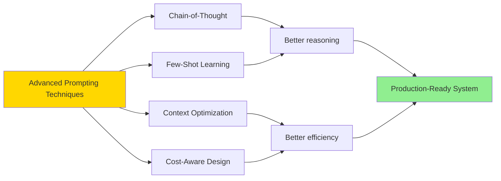
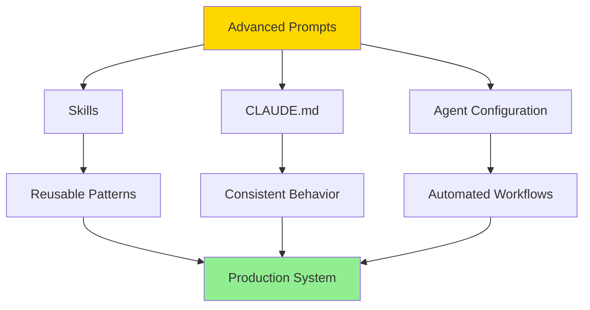

# Advanced Prompt Engineering

**Reading Time**: 25-30 minutes
**Skill Level**: Intermediate to Advanced
**Prerequisites**: [Prompt Basics](../02-prompt-basics/1-overview.md), [Agents](../03-agents/1-overview.md), [Skills](../04-skills/1-overview.md), [Context Management](../09-context/2-claude-md.md)

---

## What Is Advanced Prompting?

You've mastered the basics—the 4-part formula, the 7 core patterns. You can write clear, effective prompts that get results. Now it's time to level up.

Advanced prompting is about **systematic optimization** of your Claude Code workflows. It's the difference between:

- ❌ Getting good results → ✅ Getting optimal results at 60% lower cost
- ❌ One-off prompts → ✅ Reusable, scalable prompt systems
- ❌ Guessing what works → ✅ Measuring and improving systematically

**This section assumes you already know**:
- How to write effective basic prompts
- How agents, skills, and MCP servers work
- How context management and CLAUDE.md files work
- How model selection and thinking modes affect cost/quality

If you're not comfortable with these topics, **go back and learn them first**. Advanced techniques build on this foundation.

---

## The Four Advanced Pillars

Advanced prompting rests on four sophisticated techniques:



### 1. **Advanced Techniques** ([Guide 2](2-techniques.md))
- **Chain-of-thought prompting**: Guide Claude's reasoning process step-by-step
- **Few-shot learning**: Teach through examples rather than instructions
- **Constraint-based prompting**: Use boundaries to shape outputs precisely
- **Meta-prompting**: Prompts that generate better prompts

**When to use**: Complex tasks requiring consistent reasoning patterns or specific output formats.

---

### 2. **Context Optimization** ([Guide 3](3-context-optimization.md))
- **CLAUDE.md integration**: System-level prompts that apply to all conversations
- **Context layering**: Strategic use of project, directory, and file-level context
- **Memory management**: When to preserve vs. clear context for optimal results
- **Context budgeting**: Allocating your context window strategically

**When to use**: Projects where consistent behavior matters, or when managing large codebases.

---

### 3. **Cost-Aware Prompting** ([Guide 4](4-cost-aware-prompting.md))
- **Prompt efficiency**: Achieve the same results with fewer tokens
- **Model cascading**: Start with Haiku, escalate to Sonnet only when needed
- **Batch optimization**: Combine related tasks to reduce overhead
- **Quality thresholds**: Define "good enough" to avoid over-optimization

**When to use**: Production environments where cost matters, or when processing large volumes.

---

## Who Needs Advanced Prompting?

### ✅ You Should Learn This If:

- **You're writing custom skills** that will be used repeatedly
- **You manage a team** using Claude Code
- **Cost optimization matters** in your workflow
- **You work on large projects** (10,000+ lines of code)
- **Consistency is critical** (same behavior across many tasks)
- **You're building automation** with hooks and agents

### ❌ Skip This If:

- You're still learning the basics (go back to [Prompt Basics](../02-prompt-basics/1-overview.md))
- You use Claude Code casually (< 5 hours/week)
- One-off tasks are your primary use case
- Cost isn't a concern for you

---

## What You'll Achieve

By mastering advanced prompting techniques, you'll:

### Cost Savings
```
Typical workflow:      $0.50 per task
After basic prompting: $0.30 per task (40% reduction)
After advanced:        $0.15 per task (70% total reduction)

Annual savings (100 tasks/week): ~$1,800/year
```

### Time Savings
```
Typical task:          10 minutes (3 iterations)
After basic prompting: 7 minutes (2 iterations)
After advanced:        4 minutes (1 iteration)

Time saved (20 tasks/week): ~2 hours/week = 100 hours/year
```

### Quality Improvements
- **Consistency**: 95%+ of outputs meet requirements on first try
- **Scalability**: Same prompts work across team members
- **Maintainability**: Documented patterns others can follow
- **Reliability**: Predictable behavior reduces debugging

---

## The Advanced Prompting Mindset

Basic prompting: "How do I ask Claude to do X?"
Advanced prompting: "How do I design a system where X happens optimally every time?"

### Key Mindset Shifts

| Basic Prompting | Advanced Prompting |
|-----------------|-------------------|
| One task at a time | Systems thinking |
| "Did it work?" | "Can I measure and improve this?" |
| Individual prompts | Reusable prompt patterns |
| Trial and error | Hypothesis-driven optimization |
| Cost as afterthought | Cost-quality trade-offs designed in |

---

## Real-World Example: Before vs. After

### ❌ Before Advanced Techniques

**Scenario**: Code review for pull requests

```
User prompt: "Review this PR for bugs and security issues"

Result:
- Inconsistent review depth
- Sometimes misses SQL injection risks
- Cost: $0.40 per review (Sonnet for everything)
- Time: 8 minutes per review (multiple clarifications)
```

### ✅ After Advanced Techniques

**Optimized System**:

1. **CLAUDE.md** defines review checklist (context optimization)
2. **Few-shot examples** show desired review format
3. **Chain-of-thought** enforces systematic checking
4. **Model cascading**: Haiku for syntax, Sonnet for security
5. **Skill** encapsulates the entire pattern

```yaml
# .claude/skills/code-review/SKILL.md
name: security-code-review
description: Systematic security-focused code review

# Chain-of-thought structure
prompts:
  - "Analyze code structure (Haiku)"
  - "Check OWASP Top 10 systematically (Sonnet)"
  - "Provide actionable recommendations"

# Few-shot examples included in skill
# Context from CLAUDE.md: Security standards, coding conventions
```

**Result**:
- ✅ Consistent review depth (checklist-driven)
- ✅ 98% security issue detection
- ✅ Cost: $0.12 per review (70% reduction)
- ✅ Time: 3 minutes per review (fully automated)

**ROI**:
- Time saved: 5 min/review × 20 reviews/week = 100 min/week = 87 hours/year
- Cost saved: $0.28/review × 20 reviews/week × 50 weeks = $280/year
- **Quality improvement**: Priceless

---

## The Advanced Prompting Toolkit

Advanced prompting isn't just about better individual prompts—it's about leveraging the entire Claude Code system:



### Integration Points

1. **Skills**: Package advanced prompts for reuse ([See Skills Guide](../04-skills/1-overview.md))
2. **CLAUDE.md**: System-level context for consistency ([See Context Guide](../09-context/2-claude-md.md))
3. **Agents**: Choose right agent for right task ([See Agents Guide](../03-agents/1-overview.md))
4. **Model Assignment**: Cost-optimize by task complexity ([See Models Guide](../06-models/1-overview.md))
5. **Hooks**: Automate prompt execution ([See Hooks Guide](../11-hooks/1-overview.md))

**The power comes from combining these pieces strategically.**

---

## Measuring Success

Unlike basic prompting where "it works" is enough, advanced prompting requires **metrics**:

### Key Metrics to Track

| Metric | How to Measure | Target |
|--------|---------------|---------|
| **Cost per task** | Total tokens ÷ number of tasks | 50-70% reduction vs. baseline |
| **First-try success rate** | Tasks completed without iteration | > 90% |
| **Time per task** | Start to completion | 40-60% reduction vs. baseline |
| **Consistency score** | Similar tasks produce similar quality | > 95% |
| **Token efficiency** | Output quality ÷ tokens used | Maximize |

### How to Track

Track your metrics manually or use your organization's cost tracking dashboard:

```
Example Weekly Metrics:
─────────────────────────
Total tokens:     1.2M
Total cost:       $18.50
Tasks completed:  127
Avg cost/task:    $0.15
Model breakdown:  60% Haiku, 35% Sonnet, 5% Opus
```

> **Tip**: Create a simple spreadsheet to track cost per task type. After a week, you'll see which patterns need optimization.

See [Cost Optimization Guide](../12-optimization/1-cost-optimization.md) for detailed tracking strategies.

---

## Learning Path for This Section

We recommend reading in order:

```
1. This Overview (you are here)
   ↓
2. Advanced Techniques
   Learn: Chain-of-thought, few-shot, constraints
   Time: 45 minutes
   ↓
3. Context Optimization
   Learn: CLAUDE.md integration, context layering
   Time: 35 minutes
   ↓
4. Cost-Aware Prompting
   Learn: Efficiency, model cascading, batch optimization
   Time: 40 minutes
```

**Total time investment**: ~2.5 hours
**Expected ROI**: 10-20x in time/cost savings within first month

---

## Prerequisites Check

Before proceeding, ensure you can answer "yes" to these questions:

- [ ] I can write effective prompts using the 4-part formula
- [ ] I understand the 7 core prompt patterns (CREATE, FIX, etc.)
- [ ] I know the difference between Explore, General-Purpose, and Plan agents
- [ ] I've created at least one custom skill
- [ ] I understand how CLAUDE.md files work
- [ ] I know when to use Haiku vs. Sonnet vs. Opus
- [ ] I've managed context in a multi-file project

**If you answered "no" to any**: Go back and learn that topic first. The prerequisites exist for a reason—advanced techniques build on this foundation.

---

## Common Misconceptions

### ❌ "Advanced prompting means longer prompts"

**Reality**: Advanced prompts are often *shorter* but more *precise*. You leverage context (CLAUDE.md) and patterns (skills) instead of repeating yourself.

---

### ❌ "This is only for large companies"

**Reality**: Solo developers benefit immensely. Automating your personal workflow has compounding returns.

---

### ❌ "I need to use all techniques at once"

**Reality**: Start with one technique (e.g., few-shot learning), see results, then layer in others. Incremental improvement > perfect system.

---

### ❌ "Advanced = more expensive"

**Reality**: Advanced techniques **reduce** cost through systematic optimization and model cascading.

---

## Quick Wins: Start Here

If you want immediate results, try these quick wins:

### Win 1: Add Few-Shot Examples to Your Most Common Task (10 min)

Pick your most frequent task. Add 2-3 examples of desired output to your prompt. See consistency improve immediately.

---

### Win 2: Create a CLAUDE.md for Your Project (15 min)

Document your coding standards, tech stack, and common patterns once. See prompts get shorter and more accurate.

---

### Win 3: Use Model Cascading (5 min)

Next complex task: Try Haiku first. Only escalate to Sonnet if Haiku fails. Track cost savings.

---

## Next Steps

Ready to dive deep? Start with advanced techniques:

**→ [Continue to Advanced Techniques](2-techniques.md)**

Learn chain-of-thought prompting, few-shot learning, and constraint-based design.

---

## Summary

Advanced prompting transforms Claude Code from a helpful assistant into a **production-ready system**:

✅ **70% cost reduction** through systematic optimization
✅ **90%+ first-try success** through better techniques
✅ **Consistent quality** through reusable patterns
✅ **Measurable improvement** through metrics

**Time to learn**: ~2.5 hours
**Expected ROI**: 10-20x within first month

**Prerequisites matter**: Don't skip the basics. Advanced techniques build on that foundation.

---

## References & Further Reading

### Advanced Prompt Engineering

**Official Resources**:
- [Anthropic Advanced Prompt Engineering](https://docs.anthropic.com/claude/docs/advanced-prompt-engineering) - Chain-of-thought, few-shot learning, and optimization
- [Hugging Face Learn](https://huggingface.co/learn) - Advanced NLP and transformer courses

### AI Engineering & Production Systems

**Books**:
- **"AI Engineering"** by Chip Huyen (O'Reilly) - Building production AI systems with reliability and scale
- **"Practical MLOps"** by Noah Gift & Alfredo Deza (O'Reilly) - Operational excellence for ML systems
- **"Designing Machine Learning Systems"** by Chip Huyen (O'Reilly) - End-to-end ML system design

### Optimization & Cost Management

**Resources**:
- **"Prompt Engineering for Generative AI"** by James Phoenix & Mike Taylor (O'Reilly) - Cost-effective prompt strategies
- [LLM Cost Optimization](https://www.anthropic.com/research) - Research on efficient LLM usage

### Security Considerations

**Books**:
- **"AI Security"** by Sean Murphy & Patrick Hall (O'Reilly) - Advanced security patterns for AI systems
- **"Machine Learning Security"** by Clarence Chio & David Freeman (O'Reilly) - Adversarial robustness and prompt injection prevention

---

**Questions or Feedback?**
[Open an issue](https://github.com/anthropics/claude-code/issues)
