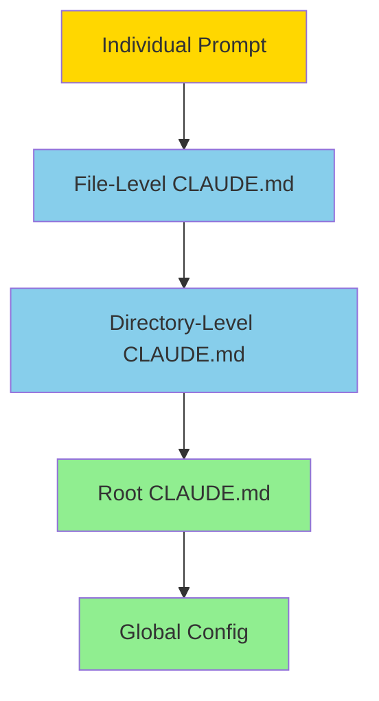

# Context Optimization for Advanced Prompting

**Reading Time**: 35-40 minutes
**Skill Level**: Intermediate to Advanced
**Prerequisites**: [Context Management](../09-context/2-claude-md.md), [Advanced Techniques](2-techniques.md)

---

## What Is Context Optimization?

Context optimization is the strategic use of Claude Code's context system to make prompts **shorter, cheaper, and more consistent** while improving results.

**The Core Insight**: Information you put in context (CLAUDE.md, memory) doesn't need to be repeated in every prompt.

### Before Context Optimization

```
Every single prompt:
"Review this code. Our coding standards: Use TypeScript, functional style,
no classes, Jest for tests, follow Airbnb style guide, add JSDoc comments,
handle errors with Result type, no console.log in production..."

Cost: 50 tokens of repeated context × 100 prompts = 5,000 wasted tokens
```

### After Context Optimization

```
CLAUDE.md (one-time setup):
[All coding standards, conventions, patterns]

Each prompt:
"Review this code"

Cost: 5 tokens × 100 prompts = 500 tokens
Savings: 90% reduction in prompt tokens
```

---

## The Context Hierarchy

Claude Code has multiple context layers that work together:



**Precedence** (highest to lowest):
1. **Individual Prompt** - Immediate, specific instructions
2. **File-Level CLAUDE.md** - Rules for specific files
3. **Directory-Level CLAUDE.md** - Rules for file groups
4. **Root CLAUDE.md** - Project-wide rules
5. **Global Config** - User preferences

**Strategy**: Put stable, reusable information higher in the hierarchy.

---

## CLAUDE.md Integration Patterns

### Pattern 1: Project Standards (Root Level)

**File**: `/project-root/CLAUDE.md`

**Purpose**: Define project-wide standards once, reference everywhere

```markdown
# Project: E-Commerce API

## Tech Stack
- Language: TypeScript 5.0+
- Framework: Express 4.18
- Database: PostgreSQL with Prisma ORM
- Testing: Jest + Supertest
- Auth: JWT with refresh tokens

## Coding Standards
### Style
- Functional programming preferred (no classes except DTOs)
- Airbnb TypeScript style guide
- Max function length: 50 lines
- Max file length: 300 lines

### Error Handling
\```typescript
// Use Result type pattern
type Result<T, E> = { success: true; data: T } | { success: false; error: E };
\```

### Testing
- Test coverage minimum: 80%
- Test pattern: Arrange-Act-Assert
- Mock external services
- Integration tests for APIs

## Common Patterns
### API Response Format
\```typescript
{
  "data": { /* response data */ },
  "error": null,
  "meta": { "timestamp": "2025-01-15T10:30:00Z" }
}
\```

### Database Queries
- Use Prisma query builder (no raw SQL except complex reports)
- Always use transactions for multi-table updates
- Include created_at, updated_at on all tables

## Security Requirements
- All inputs validated with Zod
- SQL injection prevented via Prisma
- XSS prevention: sanitize HTML inputs
- CSRF tokens required for state-changing operations
- Rate limiting: 100 req/min per IP

## Performance
- API response time target: < 200ms
- Database queries: < 50ms
- Use Redis caching for frequently accessed data
- Implement pagination (max 100 items per page)
```

**Effect on Prompts**:

**Before** (without CLAUDE.md):
```
"Create a user registration endpoint. Use TypeScript, Express, Prisma,
validate with Zod, hash passwords with bcrypt, return JWT token, use
Result type for errors, write Jest tests with 80% coverage, follow
Airbnb style, limit to 50 lines per function..."
```

**After** (with CLAUDE.md):
```
"Create a user registration endpoint at POST /api/auth/register"
```

Claude knows all the standards from CLAUDE.md.

---

### Pattern 2: Directory-Specific Rules

**File**: `/src/api/CLAUDE.md`

**Purpose**: Rules specific to API layer

```markdown
# API Layer Guidelines

## Extends
- Root CLAUDE.md (inherits all project standards)

## Additional Rules for This Directory

### Endpoint Structure
\```typescript
router.post('/resource',
  validateRequest(schema),  // Zod validation middleware
  authenticate,             // JWT auth middleware
  authorize(['admin']),     // Role-based access
  controller.create         // Business logic
);
\```

### Controller Pattern
\```typescript
export const controller = {
  async create(req: Request, res: Response) {
    const result = await service.create(req.body);
    if (!result.success) {
      return res.status(400).json({ error: result.error });
    }
    return res.status(201).json({ data: result.data });
  }
};
\```

### Validation Schemas
- Define in separate `schemas/` directory
- One schema per endpoint
- Export as `createUserSchema`, `updateUserSchema`, etc.

### Error Handling
- HTTP 400: Validation errors
- HTTP 401: Authentication failed
- HTTP 403: Authorization failed
- HTTP 404: Resource not found
- HTTP 500: Server errors (log details, don't expose to client)
```

**Effect**:
```
Prompt: "Add a DELETE endpoint for users"

Claude knows:
- Project standards from root CLAUDE.md
- API-specific patterns from /src/api/CLAUDE.md
- Generates endpoint matching both contexts automatically
```

---

### Pattern 3: File-Specific Context

**File**: `/src/api/auth/login.ts.claude.md`

**Purpose**: Context for ONE specific file

```markdown
# Login Endpoint Context

## Current Implementation Issues
- Uses plain bcrypt (slow)
- No rate limiting
- Vulnerable to timing attacks

## Planned Changes
- Migrate to Argon2 (better security)
- Add rate limiting (5 attempts per 15 min)
- Use constant-time comparison

## Dependencies
- src/services/auth.ts - Authentication logic
- src/middleware/rateLimit.ts - Rate limiting
- src/utils/crypto.ts - Password hashing

## Testing Notes
- Mock Redis for rate limit tests
- Test both valid and invalid credentials
- Verify rate limit kicks in at 6th attempt
```

**Effect**:
```
Prompt: "Fix the security issues in this file"

Claude sees:
- Root standards
- API layer patterns
- THIS FILE'S specific context
- Knows exactly what issues to fix and how
```

---

## Context Layering Strategy

### Layer 1: Stable Information (Root CLAUDE.md)

**What to include**:
- Tech stack
- Coding standards
- Common patterns
- Security requirements
- Performance targets

**Why**: Changes rarely, applies to everything

---

### Layer 2: Domain Rules (Directory CLAUDE.md)

**What to include**:
- Layer-specific patterns (API, UI, database)
- Shared utilities for this domain
- Domain-specific constraints

**Why**: Applies to groups of related files

---

### Layer 3: Specific Context (File or Prompt)

**What to include**:
- Current task details
- File-specific issues
- Temporary overrides

**Why**: Changes frequently, applies narrowly

---

## Memory Management for Prompts

### When to Preserve Context

**Keep context when**:
- Working on same feature across multiple files
- Iterating on same code
- Context is expensive to rebuild

**Example**:
```
Conversation 1: "Analyze the authentication system"
[Claude builds mental model]

Conversation 2: "Now refactor it"
[Uses existing mental model - faster, cheaper]
```

---

### When to Clear Context

**Clear context when**:
- Switching to unrelated task
- Context is outdated
- Getting unexpected results (context confusion)

**How to clear**:
```bash
# Start fresh conversation
/clear

# Or in prompt
"Forget previous context. Fresh start: [new task]"
```

---

## Context Optimization Patterns

### Pattern: The Checklist Reference

Instead of listing requirements every time, reference a checklist:

**CLAUDE.md**:
```markdown
## Code Review Checklist
See: docs/CODE_REVIEW_CHECKLIST.md

Summary:
1. Security (OWASP Top 10)
2. Performance (< 200ms)
3. Testing (80% coverage)
4. Style (Airbnb + our extensions)
5. Documentation (JSDoc on public functions)
```

**Prompt**:
```
"Review this PR using the code review checklist"
```

---

### Pattern: The Example Library

**CLAUDE.md**:
```markdown
## Example Library

### Good API Endpoint
See: src/api/users/create.ts

### Good Test Suite
See: src/api/users/create.test.ts

### Good Error Handling
See: src/middleware/errorHandler.ts
```

**Prompt**:
```
"Create a product endpoint following the user endpoint example"
```

Claude reads the example file automatically.

---

### Pattern: The Anti-Pattern List

**CLAUDE.md**:
```markdown
## Common Mistakes to Avoid

❌ DON'T:
- Use `any` type (use `unknown` and narrow)
- Put business logic in controllers (use services)
- Hard-code configuration (use environment variables)
- Catch errors without logging
- Return sensitive data in error messages

✅ DO:
- Use strict TypeScript
- Keep controllers thin
- Validate all inputs
- Log errors with context
- Return generic error messages to clients
```

**Effect**: Claude avoids these mistakes automatically

---

## Advanced: Context Budgeting

Context has a **token limit**. Budget it strategically.

### Token Budget Example

```
Total context window: 200,000 tokens

Allocation:
- Root CLAUDE.md:     5,000 tokens (2.5%)
- Code being edited: 50,000 tokens (25%)
- Related files:     30,000 tokens (15%)
- Conversation:      15,000 tokens (7.5%)
- Output buffer:     50,000 tokens (25%)
- Reserve:           50,000 tokens (25%)
```

### Optimization Strategies

#### 1. Reference > Inline

**Bad** (inline everything):
```markdown
## API Standards
[3000 tokens of detailed standards...]

## Database Standards
[2000 tokens of detailed standards...]
```

**Good** (reference):
```markdown
## Standards
- API: See docs/api-standards.md (summary: REST, JSON, JWT auth)
- Database: See docs/db-standards.md (summary: Prisma, transactions, indexes)
```

Claude reads referenced files only when needed.

---

#### 2. Summaries > Full Details

**CLAUDE.md**:
```markdown
## Tech Stack
- TypeScript 5.0+ (strict mode enabled)
- Express 4.18 (see docs/express-config.md for full setup)
- Prisma 5.0 (schema in prisma/schema.prisma)

Key patterns:
- Functional style (see examples/patterns.md)
- Result type errors (see utils/result.ts)
```

Full details in separate docs, summaries in CLAUDE.md.

---

#### 3. Conditional Context

**For large projects**, use directory-specific CLAUDE.md:

```
/src/
  /api/CLAUDE.md          # Only loaded for API work
  /ui/CLAUDE.md           # Only loaded for UI work
  /database/CLAUDE.md     # Only loaded for DB work
```

---

## Measuring Context Effectiveness

### Metric 1: Prompt Length Reduction

**Before optimization**:
```
Average prompt: 300 tokens
× 100 prompts = 30,000 tokens
```

**After optimization**:
```
Average prompt: 50 tokens
× 100 prompts = 5,000 tokens

Savings: 83% reduction
```

---

### Metric 2: First-Try Success Rate

**Track**:
```
Tasks completed on first try (no iteration):
Before: 60%
After: 90%

Savings:
Before: 100 tasks × 1.67 avg attempts = 167 API calls
After: 100 tasks × 1.11 avg attempts = 111 API calls
Reduction: 33% fewer API calls
```

---

### Metric 3: Consistency Score

**Measure**:
```
Similar tasks produce similar outputs?

Before: 70% consistency
After: 95% consistency

Why: CLAUDE.md ensures standards applied uniformly
```

---

## Common Pitfalls

### ❌ Mistake 1: Outdated Context

**Problem**: CLAUDE.md says "use library X", but project now uses library Y

**Solution**: Treat CLAUDE.md like code - update when things change

---

### ❌ Mistake 2: Too Much Context

**Problem**: 20,000 token CLAUDE.md file

**Solution**: Keep CLAUDE.md focused. Link to detailed docs.

**Rule of thumb**: Root CLAUDE.md should be < 2,000 tokens

---

### ❌ Mistake 3: Contradictory Context

**Problem**:
- Root CLAUDE.md: "Use functional style"
- Directory CLAUDE.md: "Use classes"

**Solution**: Make precedence clear. Directory can override root if needed:

```markdown
# API Directory Rules

## Override: Use Classes
For this directory, use classes (not functional style) because:
- Express middleware works better with classes
- Easier dependency injection
```

---

### ❌ Mistake 4: No Context Versioning

**Problem**: Changed CLAUDE.md, now old conversations are confused

**Solution**: Version your context:

```markdown
# CLAUDE.md - Version 2.1 (2025-01-15)

## Changes in v2.1
- Migrated from Jest to Vitest
- Updated API response format
- New error handling pattern
```

---

## Real-World Example: Before & After

### Before Context Optimization

**Every prompt repeated**:
```
"Analyze this code for security issues. Check for: SQL injection,
XSS, CSRF, authentication bypass, authorization issues, password
storage, token security, input validation, rate limiting, and
logging. Use OWASP Top 10 as reference. Provide recommendations
with code examples. Priority: Critical > High > Medium > Low."

Tokens: ~100 per prompt
× 50 security reviews = 5,000 tokens wasted
Cost: ~$0.25 wasted
```

**Inconsistent results**: Sometimes checks all items, sometimes misses some.

---

### After Context Optimization

**CLAUDE.md** (one-time):
```markdown
## Security Review Standards

Follow OWASP Top 10 systematically:
1. Injection (SQL, NoSQL, Command)
2. Broken Authentication
3. Sensitive Data Exposure
4. XML External Entities
5. Broken Access Control
6. Security Misconfiguration
7. XSS
8. Insecure Deserialization
9. Using Components with Known Vulnerabilities
10. Insufficient Logging & Monitoring

For each issue:
- Severity: Critical | High | Medium | Low
- Location: File:line
- Recommendation: Code example
- Reference: OWASP link

Priority order: Critical → High → Medium → Low
```

**Each prompt**:
```
"Security review"

Tokens: ~5 per prompt
× 50 reviews = 250 tokens
Cost: ~$0.01

Savings: 95% reduction in tokens
Consistency: 100% (always follows checklist)
```

---

## Integration with Skills

Context optimization + Skills = Maximum reusability

**Skill**: `security-review`

```markdown
# .claude/skills/security-review/SKILL.md
name: security-review
model: sonnet  # Complex task needs Sonnet

## Context
Inherits security standards from root CLAUDE.md

## Progressive Disclosure
### Step 1: Analyze
Review code using security checklist from CLAUDE.md

### Step 2: Report
Format findings according to CLAUDE.md standards

### Step 3: Recommend
Provide fixes matching project patterns in CLAUDE.md
```

**Usage**:
```
User: /security-review src/api/auth/login.ts

Claude:
- Reads security standards from CLAUDE.md
- Follows skill's progressive disclosure
- Applies project patterns automatically
- Consistent, thorough review every time
```

---

## Quick Reference

### CLAUDE.md Checklist

**Root Level**:
- [ ] Tech stack documented
- [ ] Coding standards defined
- [ ] Common patterns listed
- [ ] Security requirements clear
- [ ] File is < 2,000 tokens

**Directory Level**:
- [ ] Extends root (doesn't duplicate)
- [ ] Domain-specific patterns
- [ ] References to examples
- [ ] Clear when it overrides root

**File Level** (rare):
- [ ] Temporary context only
- [ ] Specific to this file
- [ ] Will be removed when task done

---

## Practice Exercise

Create a CLAUDE.md for a React project:

**Requirements**:
- TypeScript
- Functional components
- Tailwind CSS
- React Query for data fetching
- Vitest for testing

**Your CLAUDE.md**: _______

<details>
<summary>💡 Suggested Answer</summary>

```markdown
# React Dashboard Project

## Tech Stack
- React 18 + TypeScript 5
- Build: Vite 5
- Styling: Tailwind CSS 3
- State: Zustand (local), React Query (server)
- Testing: Vitest + React Testing Library
- Routing: React Router 6

## Component Standards
### Style
- Functional components only (no classes)
- TypeScript strict mode
- Props interface exported
- Max component size: 200 lines

### Pattern
\```typescript
interface Props {
  user: User;
  onSave: (data: UserData) => void;
}

export function UserProfile({ user, onSave }: Props) {
  // Component logic
  return (/* JSX */);
}
\```

### Hooks
- React Query for server state
- Zustand for client state
- Custom hooks in `hooks/` directory
- Prefix custom hooks with `use`

## Styling
- Tailwind utility classes (no custom CSS)
- Responsive: mobile-first
- Dark mode support required
- Use `className` helper for conditionals

## Testing
- Test coverage: 80% minimum
- Test user interactions, not implementation
- Mock API calls with MSW
- Snapshot tests only for complex UI

## Data Fetching
\```typescript
// Use React Query
const { data, isLoading } = useQuery({
  queryKey: ['user', id],
  queryFn: () => api.users.getById(id),
});
\```

## Performance
- Lazy load routes
- Memoize expensive calculations
- Virtualize long lists (react-virtual)
- Images: lazy loading + WebP format
```

</details>

---

## Next Steps

You've learned context optimization. Now learn how to balance cost and quality:

**→ [Continue to Cost-Aware Prompting](4-cost-aware-prompting.md)**

Learn prompt efficiency, model cascading, and batch optimization.

---

## Summary

**Context Optimization**:
- ✅ Put stable info in CLAUDE.md (don't repeat in prompts)
- ✅ Use context hierarchy strategically
- ✅ Reference docs instead of inlining everything
- ✅ Keep CLAUDE.md < 2,000 tokens
- ✅ Version your context files

**Benefits**:
- **83%+ reduction** in prompt tokens
- **90%+ first-try** success rate
- **95%+ consistency** across tasks
- **Shorter prompts** = faster + cheaper

**Key Insight**: Good context makes prompts nearly disappear.

---

**Questions or Feedback?**
[Open an issue](https://github.com/anthropics/claude-code/issues)
