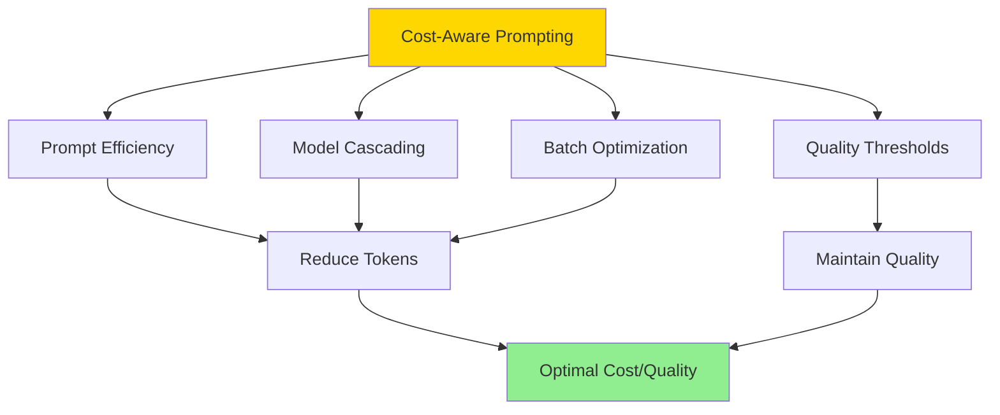
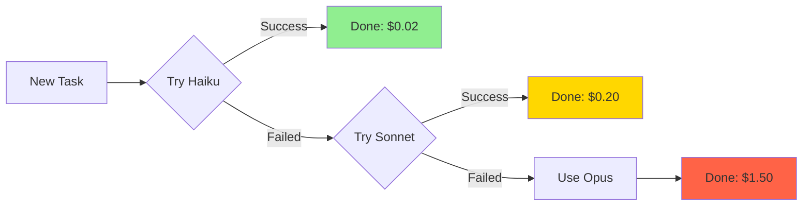

# Cost-Aware Prompting

**Reading Time**: 40-45 minutes
**Skill Level**: Advanced
**Prerequisites**: [Advanced Techniques](2-techniques.md), [Context Optimization](3-context-optimization.md), [Model Selection](../06-models/1-overview.md)

---

## What Is Cost-Aware Prompting?

Cost-aware prompting is designing prompts to **maximize value per dollar** while meeting quality requirements.

**Core principle**: Every token costs money. Optimize to spend only what's needed for the desired quality level.

### The Cost Reality

```
Haiku 4.5:   $1.00 / 1M input tokens,  $5.00 / 1M output tokens
Sonnet 4.5:  $3.00 / 1M input tokens, $15.00 / 1M output tokens
Opus 4.5:    $5.00 / 1M input tokens, $25.00 / 1M output tokens

Sonnet is 3x more expensive than Haiku for input
Opus is 5x more expensive than Haiku for input
```

**Question**: Do you really need Sonnet for "list files in this directory"?

---

## The Four Pillars of Cost-Aware Prompting



---

## Pillar 1: Prompt Efficiency

### What Is It?

Achieving the same result with **fewer tokens**.

### Before vs After

**Inefficient** (287 tokens):
```
"Hello Claude! I hope you're doing well today. I have a question about
some code I'm working on. I was wondering if you could please take a
look at this function I've written and let me know if there are any
issues or problems with it. I'm particularly concerned about whether
there might be any security vulnerabilities, performance issues, or
bugs. Also, if you notice anything that could be improved in terms of
code quality or best practices, that would be really helpful. Please be
as thorough as possible in your review. Here's the code:

[code]

Thank you so much for your help! I really appreciate it."
```

**Efficient** (23 tokens):
```
"Review this function for security, performance, and code quality:

[code]"
```

**Savings**: 92% reduction, identical results

---

### Efficiency Techniques

#### 1. Remove Pleasantries

| ❌ Don't | ✅ Do |
|----------|-------|
| "Hello Claude! How are you?" | [Start with task] |
| "Thank you so much!" | [End after task] |
| "I was wondering if maybe..." | "Do X" |

**Savings**: 20-50 tokens per prompt

---

#### 2. Use Imperative Voice

| ❌ Weak | ✅ Strong | Savings |
|---------|-----------|---------|
| "Could you please review..." | "Review..." | 3 tokens |
| "I would like you to..." | "Create..." | 4 tokens |
| "If possible, fix..." | "Fix..." | 2 tokens |

---

#### 3. Leverage Context (CLAUDE.md)

**Without context** (150 tokens):
```
"Create a React component using TypeScript, functional style, with
Tailwind CSS, include TypeScript types, export as default, add JSDoc
comments, use React hooks, keep under 200 lines, follow our naming
conventions, include error handling..."
```

**With context** (15 tokens):
```
"Create a UserProfile component"
```

Context in CLAUDE.md provides all the standards.

**Savings**: 90% reduction

---

#### 4. Use Abbreviations Where Clear

| Full Form | Abbreviated | Context Where Safe |
|-----------|-------------|-------------------|
| "authentication" | "auth" | Technical contexts |
| "configuration" | "config" | Technical contexts |
| "application" | "app" | Technical contexts |
| "database" | "DB" | Technical contexts |

**Caution**: Only use where absolutely unambiguous

---

#### 5. Structured > Prose

**Prose** (45 tokens):
```
"Please check if there are any SQL injection vulnerabilities, XSS issues,
or authentication bypass problems. Also look for any authorization bugs."
```

**Structured** (18 tokens):
```
"Check for:
- SQL injection
- XSS
- Authentication bypass
- Authorization bugs"
```

**Savings**: 60% reduction, clearer too

---

## Pillar 2: Model Cascading

### What Is It?

**Start with cheapest model, escalate only when needed.**

### The Cascade Strategy



---

### Model Selection Matrix

| Task Type | Start With | Escalate To | When to Escalate |
|-----------|------------|-------------|------------------|
| **Search/Find** | Haiku | Never | Haiku is sufficient |
| **Simple edits** | Haiku | Sonnet if complex | Needs reasoning about architecture |
| **Code review** | Haiku (syntax) → Sonnet (logic) | Opus (architecture) | Requires deep analysis |
| **Architecture** | Sonnet | Opus | Novel patterns, trade-offs |
| **Bug diagnosis** | Haiku (obvious) | Sonnet | Not obvious |
| **Testing** | Haiku | Sonnet if complex | Integration/E2E tests |

---

### Example: Cascading Code Review

**Stage 1: Haiku** ($0.02)
```
"Quick syntax and style check of this code"

Haiku finds:
- Missing semicolons
- Unused variables
- Style violations
- Simple type errors

Cost: $0.02
```

**Stage 2: Sonnet** ($0.15) - Only if needed
```
"Deeper review: logic bugs, edge cases, security issues"

Sonnet finds:
- Off-by-one errors
- Race conditions
- SQL injection risk
- Missing error handling

Cost: $0.15
```

**Stage 3: Opus** ($1.50) - Rarely needed
```
"Architecture review: scalability, maintainability, design patterns"

Opus analyzes:
- System design issues
- Scalability bottlenecks
- Better architectural patterns
- Long-term maintainability

Cost: $1.50
```

**Total cost**: $0.02 (usually) to $1.67 (comprehensive)

**vs Always using Opus**: $1.50 every time

---

### Implementing Cascades in Skills

```yaml
# .claude/skills/code-review/SKILL.md
name: cascading-code-review

## Progressive Disclosure
### Stage 1: Syntax Check (Haiku)
model: haiku
prompt: "Quick syntax and style check"

### Stage 2: Logic Review (Sonnet) - if issues found
model: sonnet
prompt: "Deep review: logic, security, edge cases"

### Stage 3: Architecture (Opus) - if major refactor needed
model: opus
prompt: "Architecture and design review"
```

---

## Pillar 3: Batch Optimization

### What Is It?

**Combining multiple related tasks** to reduce overhead.

### The Overhead Problem

**Separate prompts**:
```
Prompt 1: "Review file1.ts" (overhead: 20 tokens + API call)
Prompt 2: "Review file2.ts" (overhead: 20 tokens + API call)
Prompt 3: "Review file3.ts" (overhead: 20 tokens + API call)

Total overhead: 60 tokens + 3 API calls
```

**Batched**:
```
"Review these files:
1. file1.ts
2. file2.ts
3. file3.ts

For each, check: security, performance, style"

Total overhead: 30 tokens + 1 API call
```

**Savings**: 50% overhead reduction

---

### Batching Patterns

#### Pattern 1: Multi-File Review

**❌ Inefficient**:
```
Review src/auth/login.ts
Review src/auth/register.ts
Review src/auth/logout.ts
Review src/auth/refresh.ts
```

**✅ Efficient**:
```
"Review all files in src/auth/ for:
- Consistent error handling
- Proper token validation
- Rate limiting
- Security best practices

Provide one consolidated report"
```

---

#### Pattern 2: Related Edits

**❌ Inefficient**:
```
Add user field to User model
Add user field to API response
Add user field to frontend type
Update user tests
```

**✅ Efficient**:
```
"Add 'phoneNumber' field to User across the stack:
1. Database schema (Prisma)
2. API types and validation
3. Frontend TypeScript types
4. Update relevant tests

Make changes consistent across all layers"
```

---

#### Pattern 3: Test Generation

**❌ Inefficient**:
```
Write test for validateEmail
Write test for validatePassword
Write test for validateUsername
Write test for validatePhone
```

**✅ Efficient**:
```
"Generate tests for all validation functions in src/utils/validate.ts

For each function:
- Valid inputs (2-3 cases)
- Invalid inputs (2-3 cases)
- Edge cases
- Use consistent test structure"
```

---

### When NOT to Batch

❌ **Don't batch if**:
- Tasks are unrelated (context confusion)
- One task depends on reviewing another's output
- You need to verify each step before proceeding
- Total token count exceeds model's context window

✅ **Do batch when**:
- Tasks are similar/related
- Can be done in parallel
- Share common context
- Results can be consolidated

---

## Pillar 4: Quality Thresholds

### What Is It?

Defining **"good enough"** to avoid over-optimization.

### The Diminishing Returns Problem

```
Draft 1 (Haiku):     90% quality, $0.02
Draft 2 (Sonnet):    95% quality, $0.15  (+5%, +$0.13)
Draft 3 (Opus):      97% quality, $1.50  (+2%, +$1.35)
Draft 4 (Opus+time): 98% quality, $3.00  (+1%, +$1.50)
```

**Question**: Is 98% quality worth 150x the cost of 90%?

**Answer**: Depends on context.

---

### Quality Threshold Matrix

| Task Type | Acceptable Quality | Model | Cost |
|-----------|-------------------|-------|------|
| **Exploratory code** | 70% | Haiku | $0.02 |
| **Internal tools** | 85% | Haiku | $0.02 |
| **Production code** | 95% | Sonnet | $0.15 |
| **Financial/medical code** | 99%+ | Opus + review | $2.00+ |
| **Documentation** | 80% | Haiku | $0.02 |
| **User-facing API** | 95% | Sonnet | $0.15 |

---

### Defining "Good Enough"

**For each task, ask**:

1. **Who sees this?** (users, team, just me)
2. **What's the impact of errors?** (catastrophic, annoying, minor)
3. **Can it be iterated?** (prototype, production)
4. **What's the time pressure?** (ASAP, when ready)

**Examples**:

**Task**: Generate test data for development
- Who: Just developers
- Impact: None (test data)
- Iteration: Easy to regenerate
- **Threshold**: 70% → Use Haiku

**Task**: Write authentication logic
- Who: All users
- Impact: Security vulnerability = catastrophic
- Iteration: Difficult after deployment
- **Threshold**: 99% → Use Opus + manual review

---

### Implementing Quality Gates

**Skill with quality gate**:

```markdown
# .claude/skills/create-endpoint/SKILL.md

## Quality Gate
For production endpoints:
- [ ] Input validation (Zod schema)
- [ ] Authentication check
- [ ] Authorization check
- [ ] Error handling (all paths)
- [ ] Rate limiting
- [ ] Logging
- [ ] Tests (80%+ coverage)

If ALL checks pass → Deploy
If ANY fail → Sonnet review + fix
```

---

## Combining All Four Pillars

### Real-World Example: Feature Development

**Task**: Add user profile photo upload

#### Traditional Approach (No cost optimization)

```
Use Sonnet for everything:
1. Design database schema ($0.20)
2. Create API endpoint ($0.30)
3. Add frontend upload ($0.25)
4. Write tests ($0.20)
5. Review code ($0.15)
6. Write docs ($0.10)

Total: $1.20
```

#### Cost-Optimized Approach

```
1. Design database schema
   - Haiku first draft ($0.02)
   - Sonnet review ($0.10)
   Subtotal: $0.12 ✅ (90% savings)

2. Create API endpoint (batch with frontend)
   - Sonnet for both ($0.20)
   Subtotal: $0.20 ✅ (45% savings vs separate)

3. Write tests (batch all tests)
   - Haiku for simple tests ($0.05)
   Subtotal: $0.05 ✅ (75% savings)

4. Review code
   - Haiku syntax check ($0.02)
   - Sonnet logic check ($0.10)
   Subtotal: $0.12 ✅ (20% savings)

5. Write docs (efficient prompt)
   - Haiku with examples ($0.03)
   Subtotal: $0.03 ✅ (70% savings)

Total: $0.52

Savings: 57% reduction ($0.68 saved)
```

**Over 100 features**: $68 saved

---

## Measuring and Optimizing

### Metrics to Track

#### 1. Cost Per Task Type

```
Track costs for common tasks:
- Code review: $0.05 avg
- New endpoint: $0.15 avg
- Bug fix: $0.08 avg
- Tests: $0.04 avg
```

**Goal**: Reduce average while maintaining quality

---

#### 2. Model Utilization

```
Ideal breakdown:
- Haiku: 60-70% of tasks
- Sonnet: 25-35% of tasks
- Opus: 5-10% of tasks

Current breakdown:
- Haiku: 30%  ⚠️ (using Sonnet too much)
- Sonnet: 60%
- Opus: 10%

Action: Review which Sonnet tasks could use Haiku
```

---

#### 3. Prompt Efficiency Ratio

```
Prompt Efficiency = Output Value / Input Tokens

High efficiency: Clear, short prompts → desired output
Low efficiency: Long, unclear prompts → many iterations

Track average and optimize low performers
```

---

### Optimization Process

**Step 1: Measure Baseline**

Track your usage for one week. Record:
- Total cost
- Model breakdown (% Haiku vs Sonnet vs Opus)
- Average cost per task type

**Step 2: Identify High-Cost Patterns**
```
Find tasks with:
- High token usage for simple tasks
- Opus where Sonnet would work
- Repeated similar prompts (should be a skill)
```

**Step 3: Apply Optimizations**
```
For each high-cost pattern:
1. Try cheaper model (cascading)
2. Shorten prompt (efficiency)
3. Batch similar tasks
4. Create skill for reusable patterns
```

**Step 4: Measure Improvement**

Compare this week's metrics to your baseline:
- Target: 30-60% cost reduction
- Track: Cost per task type, model usage distribution

---

## Advanced: Cost Budgets

### Setting Team Budgets

Create team guidelines for model selection and cost management:

| Task Type | Budget Target | Recommended Model |
|-----------|---------------|-------------------|
| **Exploration** | $0.05 max | Haiku |
| **Code Review** | $0.15 max | Haiku → Sonnet |
| **New Feature** | $0.50 max | Sonnet |
| **Architecture** | $2.00 max | Sonnet → Opus |

**Team Budget Structure**:
```markdown
Monthly team limit: $100
├── Senior developers: $50/month
├── Junior developers: $25/month
└── Reserve for complex tasks: $25/month

Warning threshold: 80% ($80)
Action at threshold: Switch to Haiku for routine tasks
```

---

### Personal Cost Tracking

```markdown
# Weekly Cost Goal: $10

Monday:    $2.50 (on track)
Tuesday:   $3.00 (on track)
Wednesday: $5.00 (⚠️ over daily budget)

Action: Switch to Haiku for rest of week
Reason: Used Opus for task that Sonnet could handle
```

---

## Common Mistakes

### ❌ Mistake 1: Premature Opus

**Bad**:
```
"I want this to be perfect, so I'll use Opus"
[Uses Opus for simple task]
Cost: $1.50
```

**Good**:
```
"Try Haiku first, escalate if needed"
[Haiku succeeds]
Cost: $0.02

Savings: 98.7%
```

---

### ❌ Mistake 2: Context Duplication

**Bad**:
```
Every prompt includes:
"Our stack is React, TypeScript, Node.js, PostgreSQL..." (30 tokens)
× 100 prompts = 3,000 tokens wasted
```

**Good**:
```
Put stack in CLAUDE.md (one-time)
Each prompt: just the task
Savings: 3,000 tokens = $0.15
```

---

### ❌ Mistake 3: Micro-Optimization Trap

**Bad**:
```
Spend 30 min optimizing a prompt to save 10 tokens ($0.000003)
Your time cost: $25/hour = $12.50
```

**Good**:
```
Optimize high-frequency patterns (used 100+ times)
Ignore one-off tasks
Focus on ROI
```

---

### ❌ Mistake 4: Quality Sacrifice

**Bad**:
```
Use Haiku for security-critical auth code
Save $0.10, introduce vulnerability
Cost of breach: $$$$$
```

**Good**:
```
Use appropriate model for risk level
Security-critical: Opus + manual review
Internal tools: Haiku is fine
```

---

## ROI Calculator

### Example: 100 Code Reviews Per Month

**Before optimization**:
```
Model: Sonnet (all reviews)
Avg tokens: 5,000 input + 2,000 output
Cost per review: $0.045
Monthly cost: $4.50
```

**After optimization**:
```
90 reviews: Haiku ($0.002 each) = $0.18
10 reviews: Sonnet ($0.045 each) = $0.45
Monthly cost: $0.63

Savings: 86% ($3.87/month, $46/year)
```

**Time investment**: 2 hours to set up skills and optimize prompts
**Payback**: Immediate
**Annual ROI**: 2300% (2 hours → $46 + time savings)

---

## Quick Reference

### Cost Optimization Checklist

**Before Each Task**:
- [ ] Can CLAUDE.md reduce prompt length?
- [ ] Can I batch with related tasks?
- [ ] What's the minimum quality needed?
- [ ] Can Haiku handle this?

**For High-Frequency Tasks**:
- [ ] Create a skill (reusable pattern)
- [ ] Optimize prompt (remove waste)
- [ ] Test with cheaper model
- [ ] Measure and iterate

**Monthly Review**:
- [ ] Check model utilization (60%+ Haiku?)
- [ ] Identify high-cost patterns
- [ ] Optimize top 3 expensive tasks
- [ ] Update budget if needed

---

## Practice Exercise

Optimize this expensive pattern:

**Current** (used 50x/month):
```
Model: Sonnet
Prompt: "Hello! I hope you're doing well. I was wondering if you could
please help me write unit tests for this function. I want to make sure
we cover all the edge cases and that the tests are comprehensive. Please
include both positive and negative test cases. Here's the function:

[code]

Thank you so much for your help!"

Cost per use: $0.25
Monthly cost: $12.50
```

**Your optimized version**: _______

<details>
<summary>💡 Suggested Answer</summary>

```
Model: Haiku (tests are straightforward)

Prompt: "Generate unit tests for this function:
[code]

Include:
- Valid inputs (2 cases)
- Invalid inputs (2 cases)
- Edge cases"

Cost per use: $0.02
Monthly cost: $1.00

Savings: 92% ($11.50/month, $138/year)
```

**Additional optimization**: Create a skill for test generation
- One-time setup: 10 minutes
- Reusable across team
- Consistent test quality

</details>

---

## Summary

**Four Pillars of Cost-Aware Prompting**:
1. ✅ **Prompt Efficiency**: Fewer tokens, same result
2. ✅ **Model Cascading**: Start cheap, escalate when needed
3. ✅ **Batch Optimization**: Combine related tasks
4. ✅ **Quality Thresholds**: Define "good enough"

**Expected Outcomes**:
- **30-60% cost reduction** typical
- **60-90% reduction** possible with full optimization
- **No quality sacrifice** when done right
- **2-10x ROI** on time invested

**Key Insights**:
- Haiku can handle 60-70% of tasks
- Context optimization (CLAUDE.md) = 80%+ prompt reduction
- Batching saves 30-50% on related tasks
- Measure, optimize, repeat

**Remember**: Optimize high-frequency patterns first. Don't micro-optimize one-off tasks.

---

## Next Steps

Congratulations! You've completed the Advanced Prompting section and mastered cost-aware prompting techniques.

### What You've Learned

You now know how to:
- Design prompts for maximum efficiency (reduce tokens without losing quality)
- Use model cascading strategically (start cheap, escalate only when needed)
- Batch similar tasks for cost reduction
- Set and enforce quality thresholds
- Track and optimize your costs systematically

### Apply These Skills

**Immediate actions**:
1. Start tracking your weekly costs and model usage distribution
2. Identify your 3 most frequent prompt patterns
3. Apply efficiency techniques to those high-frequency prompts
4. Measure your baseline before/after cost reduction

**Integration with other Claude Code features**:
- **[Skills Guide](../04-skills/1-overview.md)** - Package your optimized prompts as reusable skills
- **[Token Optimization](../12-optimization/1-cost-optimization.md)** - Apply system-wide cost strategies
- **[Context Management](../09-context/2-claude-md.md)** - Use CLAUDE.md files to reduce prompt length
- **[Model Selection](../06-models/1-choosing-models.md)** - Deep dive into when to use each model

**See it in action**:
- **[Examples](../13-examples/1-overview.md)** - Real-world prompt optimization examples
- **[Best Practices](../16-community/3-best-practices-catalog.md)** - Community patterns and lessons learned

### Expected Results

Within your first week of applying these techniques, you should see:
- **30-60% cost reduction** on similar quality output
- **Faster iterations** from clearer, more efficient prompts
- **Better tracking** of where costs are going
- **Consistent quality** from well-designed prompts

**Target ROI**: 10-20x return in first month through cost savings and efficiency gains

---

## References & Further Reading

### Official Documentation

**Anthropic Resources** (Most Current):
- [Anthropic Prompt Engineering Guide](https://docs.anthropic.com/claude/docs/prompt-engineering) - Token optimization and cost-aware prompting strategies
- [Anthropic API Pricing](https://www.anthropic.com/pricing) - Current model pricing (updated regularly)
- [Anthropic Research Blog](https://www.anthropic.com/research) - Latest cost optimization research and techniques

### Books

**Cost-Aware Prompting**:
- **"Prompt Engineering for Generative AI"** by James Phoenix & Mike Taylor (O'Reilly, 2024)
  - *Chapter 10*: Optimization and cost management
  - *Chapter 12*: Production deployment at scale
  - *Chapter 13*: Monitoring and evaluation

### Context Efficiency

**Efficient Context Management**:
- [Model Context Protocol Documentation](https://modelcontextprotocol.io) - Best practices for efficient context usage
- [Model Context Protocol Specification](https://modelcontextprotocol.io/specification) - Technical deep dive into context optimization
- [Claude Code Context Management](https://docs.anthropic.com/claude/docs/context-management) - CLAUDE.md patterns for token reduction

### Community Resources

- [Claude Code Cost Optimization Discussions](https://github.com/anthropics/claude-code/discussions) - Real-world cost savings strategies
- [Anthropic Developer Forum](https://www.anthropic.com/developers) - Community patterns and benchmarks

---

**Questions or Feedback?**
[Open an issue](https://github.com/anthropics/claude-code/issues)
