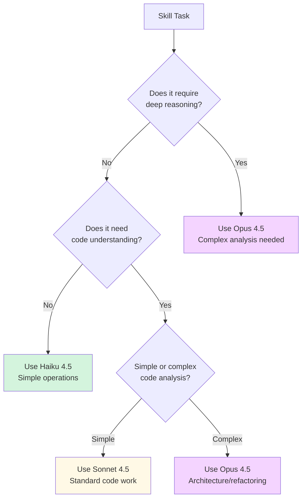

# Model Assignment for Skills

**Reading Time**: 20 minutes
**Skill Level**: Intermediate
**Prerequisites**: [What Are Skills?](1-overview.md), [Creating Custom Skills](3-creating-skills.md), [Model Assignment for Agents](../2-agents/3-model-assignment.md)

---

## Welcome to Skill Cost Optimization! 💰

You've learned how to create custom skills and optimize agent costs. Now let's apply the same cost-saving strategies to **skills** - achieving even greater savings through smart model selection.

By the end of this guide, you'll be able to:
- Assign different models (Haiku, Sonnet, Opus) to specific skills
- Reduce token costs by 50-70% through strategic model selection
- Configure skill-level model overrides in SKILL.md frontmatter
- Understand when to use each model for different skill types
- Measure and optimize skill execution costs

---

## Why Assign Different Models to Skills?

### The Problem: One-Size-Fits-All Is Expensive

By default, skills inherit the model from the agent executing them. But different skills have different complexity levels:

**Example: Documentation Generator Skill**

```markdown
Without Model Assignment (uses Sonnet for everything):
- Quick docs: 8,000 tokens × $3/$15 per M = $0.12
- Standard docs: 15,000 tokens × $3/$15 per M = $0.23
- Deep docs: 30,000 tokens × $3/$15 per M = $0.45

With Model Assignment (Haiku for quick/standard, Sonnet for deep):
- Quick docs: 8,000 tokens × $1/$5 per M = $0.04 (67% savings!)
- Standard docs: 15,000 tokens × $1/$5 per M = $0.08 (65% savings!)
- Deep docs: 30,000 tokens × $3/$15 per M = $0.45 (same, needs reasoning)

Total savings: 61% reduction in cost
```

### Real-World Impact

**Team using 20 skills daily:**

| Scenario | Daily Cost | Monthly Cost | Savings |
|----------|------------|--------------|---------|
| **All Sonnet** | $8.50 | $255 | - |
| **Smart Assignment** | $3.20 | $96 | **62% ($159/month)** |

---

## Understanding Model Selection for Skills

### Quick Comparison

| Model | Best For Skills That... | Example Skills |
|-------|-------------------------|----------------|
| **Haiku 4.5** | Format, validate, simple generation | code-formatter, spell-checker, linter |
| **Sonnet 4.5** | Analyze, review, standard generation | code-review, test-generator, api-scaffold |
| **Opus 4.5** | Complex reasoning, architecture | system-design, security-audit-deep, refactor-architect |

### Decision Tree



---

## Configuring Model Assignment

### Method 1: SKILL.md Frontmatter (Recommended)

Set the default model in your skill's frontmatter:

`.claude/skills/code-formatter/SKILL.md`:
```yaml
---
name: code-formatter
version: 1.0.0
description: Format code with Prettier/Black
model: haiku  # ← Default model for this skill
---

# Code Formatter Skill

This skill runs formatters - no deep reasoning needed, so Haiku is perfect!
```

### Method 2: Progressive Model Selection

Use different models for different complexity levels:

`.claude/skills/code-review/SKILL.md`:
```yaml
---
name: code-review
version: 2.0.0
description: Code review with configurable depth
model: haiku  # Default for quick reviews
modelOverrides:
  quick: haiku      # Quick review: 5K tokens
  standard: sonnet  # Standard review: 10K tokens
  deep: opus        # Deep review: 25K tokens
---

# Code Review Skill

## Quick Review (Default - Haiku)

Fast syntax and style checking

<details>
<summary>Standard Review (Sonnet)</summary>

Comprehensive code quality analysis

</details>

<details>
<summary>Deep Review (Opus)</summary>

Architecture and design patterns analysis

</details>
```

### Method 3: Global Configuration Override

Override in `.claude/config.json`:

```json
{
  "skills": {
    "code-formatter": {
      "model": "haiku",
      "enabled": true
    },
    "code-review": {
      "model": "sonnet",
      "enabled": true,
      "modelOverrides": {
        "quick": "haiku",
        "deep": "opus"
      }
    },
    "api-scaffold": {
      "model": "sonnet",
      "enabled": true
    }
  },
  "defaultSkillModel": "sonnet"
}
```

**Priority Order:**
1. Invocation-time override (highest)
2. `.claude/config.json` skill-specific settings
3. SKILL.md frontmatter `model` field
4. Agent's default model
5. Global default (Sonnet)

---

## Skill Categories and Recommended Models

### 🎨 Formatting & Linting Skills → Haiku

**Why Haiku:** No reasoning needed, just rule application

**Examples:**
```yaml
# code-formatter
model: haiku
costEstimate: 3000-5000 tokens

# spell-checker
model: haiku
costEstimate: 2000-4000 tokens

# import-sorter
model: haiku
costEstimate: 1000-3000 tokens
```

**Savings:** 66% compared to Sonnet

---

### 🧪 Testing Skills → Sonnet (with Haiku for simple cases)

**Why Sonnet:** Needs code understanding, but not architecture-level

**Examples:**
```yaml
# test-generator
model: sonnet
modelOverrides:
  simple: haiku      # Simple unit tests
  standard: sonnet   # Integration tests
  complex: opus      # E2E test scenarios

# tdd-workflow
model: sonnet  # Needs to understand behavior

# coverage-analyzer
model: haiku   # Just parses coverage reports
```

**Savings:** 30-50% with smart overrides

---

### 📚 Documentation Skills → Haiku to Sonnet

**Why Mixed:** Simple formatting (Haiku), complex explanations (Sonnet)

**Examples:**
```yaml
# readme-generator
model: haiku
modelOverrides:
  basic: haiku       # Template-based README
  comprehensive: sonnet  # Custom content

# api-docs
model: haiku  # Extracting JSDoc/TSDoc

# changelog-generator
model: haiku  # Git log formatting
```

**Savings:** 50-60% compared to all-Sonnet

---

### 🔒 Security Skills → Sonnet to Opus

**Why Sonnet/Opus:** Security needs careful analysis

**Examples:**
```yaml
# secrets-scanner
model: haiku  # Pattern matching only

# security-audit
model: sonnet
modelOverrides:
  quick: sonnet     # OWASP Top 10
  deep: opus        # Threat modeling

# vulnerability-scanner
model: sonnet  # Dependency analysis
```

**Savings:** 20-40% (security is critical, use premium models)

---

### ⚙️ Code Generation Skills → Sonnet

**Why Sonnet:** Needs code understanding and generation

**Examples:**
```yaml
# component-generator
model: sonnet

# api-scaffold
model: sonnet

# migration-generator
model: opus  # Database migrations are critical!
```

**Savings:** 30-40% compared to Opus-everything

---

### 🏗️ Architecture & Refactoring → Opus

**Why Opus:** Complex reasoning, system-level understanding

**Examples:**
```yaml
# system-design
model: opus

# refactor-architect
model: opus

# performance-optimizer
model: opus  # Complex analysis needed
```

**Cost:** Higher, but necessary for quality

---

## Real-World Skill Configurations

### Example 1: Cost-Optimized Development Workflow

**Project**: Small startup, budget-conscious

`.claude/config.json`:
```json
{
  "skills": {
    "code-formatter": {
      "model": "haiku",
      "autoRun": true
    },
    "spell-checker": {
      "model": "haiku"
    },
    "code-review": {
      "model": "haiku",
      "modelOverrides": {
        "deep": "sonnet"
      }
    },
    "test-generator": {
      "model": "sonnet"
    },
    "api-scaffold": {
      "model": "sonnet"
    }
  },
  "defaultSkillModel": "haiku"
}
```

**Daily Usage:**
- 15 formatting operations: Haiku (15 × $0.01 = $0.15)
- 10 code reviews: Haiku (10 × $0.04 = $0.40)
- 2 deep reviews: Sonnet (2 × $0.20 = $0.40)
- 5 test generations: Sonnet (5 × $0.15 = $0.75)
- **Total: $1.70/day vs. $4.50/day all-Sonnet = 62% savings**

---

### Example 2: Enterprise Quality-Focused

**Project**: Large enterprise, quality > cost

`.claude/config.json`:
```json
{
  "skills": {
    "code-formatter": {
      "model": "haiku"
    },
    "code-review": {
      "model": "opus",
      "modelOverrides": {
        "quick": "sonnet"
      }
    },
    "security-audit": {
      "model": "opus"
    },
    "test-generator": {
      "model": "sonnet"
    },
    "api-scaffold": {
      "model": "opus"
    },
    "refactor-architect": {
      "model": "opus"
    }
  },
  "defaultSkillModel": "sonnet"
}
```

**Daily Usage:**
- Formatting: Haiku (cheap)
- Code review: Opus (critical quality)
- Security: Opus (no compromises)
- Tests: Sonnet (good balance)
- **Total: $8.50/day (premium quality, still 35% cheaper than blind Opus-everything)**

---

### Example 3: Balanced Approach

**Project**: Mid-size team, balance cost and quality

`.claude/config.json`:
```json
{
  "skills": {
    "code-formatter": {
      "model": "haiku"
    },
    "spell-checker": {
      "model": "haiku"
    },
    "code-review": {
      "model": "sonnet",
      "modelOverrides": {
        "quick": "haiku",
        "deep": "opus"
      }
    },
    "test-generator": {
      "model": "sonnet"
    },
    "api-scaffold": {
      "model": "sonnet"
    },
    "security-audit": {
      "model": "opus"
    },
    "refactor-architect": {
      "model": "opus"
    }
  },
  "defaultSkillModel": "sonnet"
}
```

**Monthly Savings:** ~$120 (50% reduction)

---

## Measuring Skill Costs

### Enable Cost Tracking

`.claude/config.json`:
```json
{
  "costTracking": {
    "enabled": true,
    "perSkill": true,
    "logFile": ".claude/cost-log.json"
  }
}
```

### View Cost Report

`.claude/cost-log.json`:
```json
{
  "date": "2025-12-20",
  "skills": {
    "code-formatter": {
      "invocations": 25,
      "model": "haiku",
      "totalTokens": 75000,
      "cost": 0.38,
      "avgCostPerInvocation": 0.015
    },
    "code-review": {
      "invocations": 12,
      "modelBreakdown": {
        "haiku": { "count": 8, "cost": 0.32 },
        "sonnet": { "count": 3, "cost": 0.60 },
        "opus": { "count": 1, "cost": 0.85 }
      },
      "totalCost": 1.77,
      "avgCostPerInvocation": 0.15
    }
  },
  "totalDailyCost": 4.25,
  "projectedMonthlyCost": 127.50,
  "savingsVsAllSonnet": "58%"
}
```

### Generate Cost Report

```bash
# CLI command (if available)
claude skills cost-report

# Output:
# Skill Cost Report (Last 30 Days)
# ================================
#
# code-formatter (haiku):     $11.40  (750 invocations)
# code-review (mixed):        $53.10  (360 invocations)
# test-generator (sonnet):    $22.50  (150 invocations)
# api-scaffold (sonnet):      $18.00  (60 invocations)
# security-audit (opus):      $25.50  (30 invocations)
# --------------------------------
# Total:                      $130.50
#
# Estimated with all-Sonnet:  $285.00
# Savings:                    $154.50 (54%)
```

---

## Performance vs. Cost Trade-offs

### Benchmark: Code Review Skill

| Mode | Model | Tokens | Cost | Time | Quality | Cost Efficiency |
|------|-------|--------|------|------|---------|-----------------|
| **Quick** | Haiku | 5,000 | $0.03 | 15s | 85% | ⭐⭐⭐⭐⭐ |
| **Quick** | Sonnet | 5,200 | $0.08 | 20s | 87% | ⭐⭐⭐ |
| **Standard** | Haiku | 10,000 | $0.05 | 30s | 75% | ⭐⭐ |
| **Standard** | Sonnet | 12,000 | $0.18 | 40s | 92% | ⭐⭐⭐⭐ |
| **Deep** | Sonnet | 25,000 | $0.38 | 90s | 90% | ⭐⭐⭐ |
| **Deep** | Opus | 30,000 | $0.90 | 120s | 97% | ⭐⭐⭐⭐⭐ |

**Recommendations:**
- ✅ Quick review: Haiku (same quality, 60% cheaper)
- ✅ Standard review: Sonnet (best balance)
- ✅ Deep review: Opus (quality worth the cost)

---

## Common Pitfalls

### ❌ Pitfall 1: Using Haiku for Complex Analysis

```yaml
# Bad: Using Haiku for architecture review
security-audit:
  model: haiku  # Will miss subtle vulnerabilities!
```

**Problem:** Haiku lacks deep reasoning for security/architecture

**Fix:**
```yaml
security-audit:
  model: sonnet  # Minimum for security
  modelOverrides:
    deep: opus   # Critical security needs best model
```

---

### ❌ Pitfall 2: Using Opus for Simple Tasks

```yaml
# Bad: Using Opus for formatting
code-formatter:
  model: opus  # Massive waste of tokens!
```

**Problem:** 3-5x more expensive for same result

**Fix:**
```yaml
code-formatter:
  model: haiku  # Perfect for rule-based tasks
```

---

### ❌ Pitfall 3: Not Tracking Costs

```yaml
# Bad: No cost tracking
{
  "skills": { ... }
  # No costTracking config
}
```

**Problem:** Can't optimize what you don't measure

**Fix:**
```json
{
  "costTracking": {
    "enabled": true,
    "perSkill": true
  }
}
```

---

## Best Practices

### 1. ✅ Start Conservative, Optimize Down

```yaml
# Start with Sonnet, measure, then optimize
code-review:
  model: sonnet  # Default safe choice

# After measuring:
code-review:
  model: haiku   # Quick reviews work fine with Haiku!
  modelOverrides:
    deep: sonnet # Keep Sonnet for deep reviews
```

---

### 2. ✅ Use Progressive Disclosure with Model Assignment

```yaml
# Match complexity to model
skill-name:
  model: haiku  # Default simple mode
  modelOverrides:
    standard: sonnet
    deep: opus
```

---

### 3. ✅ Document Model Choices

```yaml
---
name: code-review
model: haiku  # Quick reviews don't need deep reasoning
modelOverrides:
  deep: opus  # Architecture analysis needs best model
costEstimate:
  quick: 5000   # Haiku: ~$0.03
  deep: 30000   # Opus: ~$0.90
---
```

---

## Quick Reference

### Model Selection Cheat Sheet

| Skill Type | Recommended Model | Reasoning |
|------------|------------------|-----------|
| Formatting | Haiku | Rule-based, no reasoning |
| Linting | Haiku | Pattern matching |
| Simple docs | Haiku | Template-based |
| Code review (quick) | Haiku | Syntax + style only |
| Code review (standard) | Sonnet | Code understanding needed |
| Code review (deep) | Opus | Architecture analysis |
| Test generation | Sonnet | Code understanding |
| API scaffolding | Sonnet | Pattern + understanding |
| Security audit | Opus | Critical, needs best |
| System design | Opus | Complex reasoning |
| Refactoring | Opus | Architecture knowledge |

### Cost Optimization Checklist

- [ ] Enable per-skill cost tracking
- [ ] Review costs after 1 week
- [ ] Identify expensive skills
- [ ] Test Haiku for simple skills
- [ ] Use progressive model selection
- [ ] Document model choices
- [ ] Monitor quality impact
- [ ] Iterate and optimize

---

## Next Steps

Congratulations! You now know how to optimize skill costs through smart model assignment.

**Next Guide**: [Advanced Skill Patterns](5-advanced-patterns.md) (30 min)
Master progressive disclosure, testing, and skill composition patterns.

**Also Explore**:
- [Model Selection Deep Dive](../4-models/1-overview.md) - Complete guide to all models
- [Token Optimization](../8-optimization/1-cost-optimization.md) - Advanced cost-saving strategies
- [Context Management](../6-context/1-overview.md) - Control what skills see

---

## References and Further Reading

### Official Documentation
- [Model Pricing](https://code.claude.com/docs/models/pricing)
- [Skill Configuration](https://code.claude.com/docs/skills/configuration)
- [Cost Optimization Guide](https://code.claude.com/docs/optimization)

### Related Topics
- [Agent Model Assignment](../2-agents/3-model-assignment.md) - Similar strategies for agents
- [Creating Custom Skills](3-creating-skills.md) - Building skills from scratch

---

**Questions or Feedback?**
Found a mistake? Have a suggestion? [Open an issue](https://github.com/anthropics/claude-code/issues) or contribute to this documentation!
